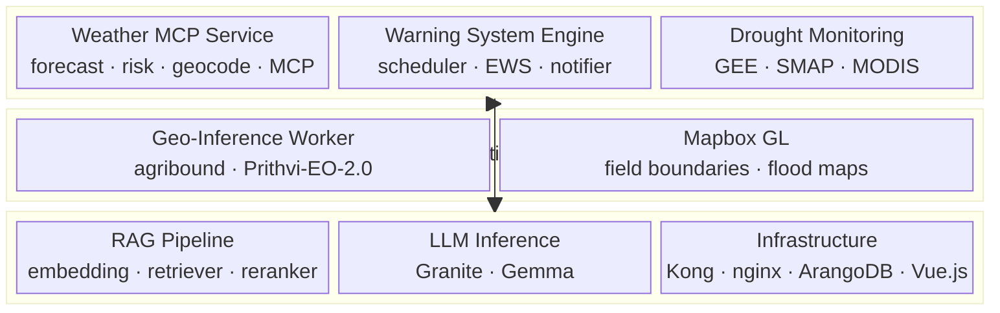
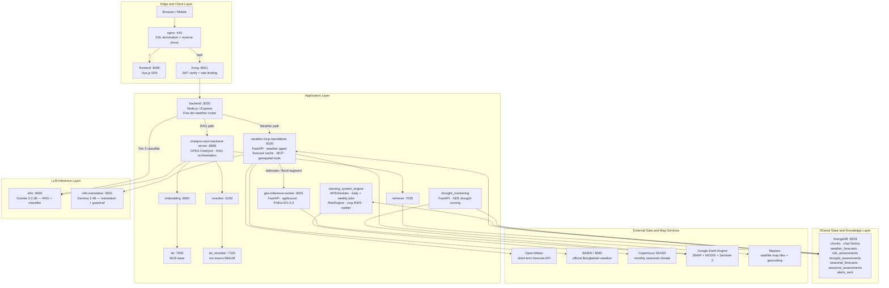
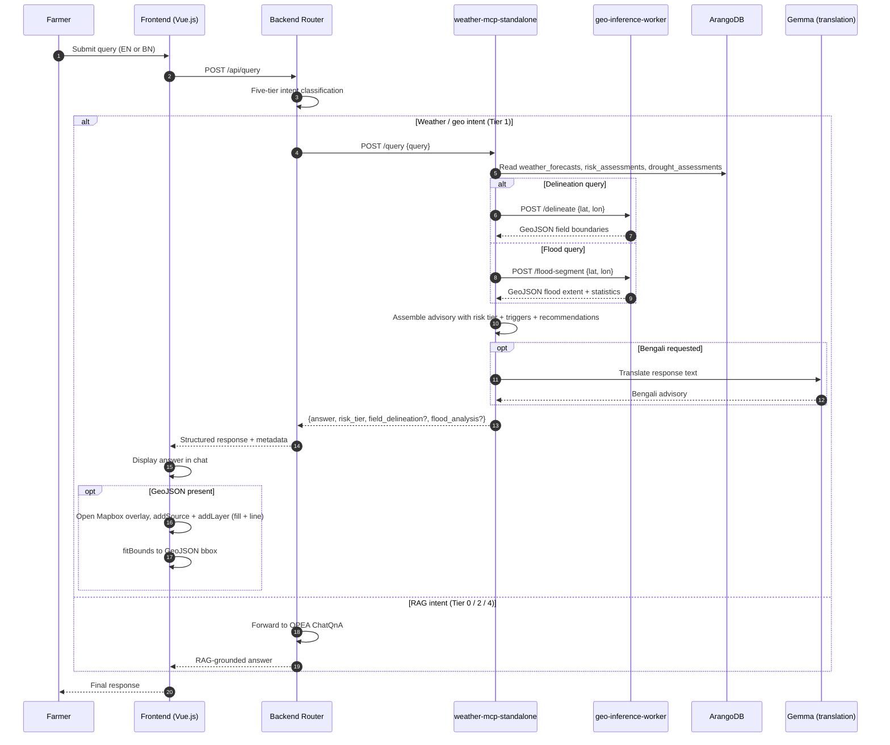
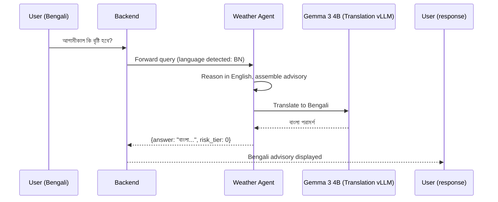

# MEWA: Meteorological Enhanced Weather Advisor
## A Genia.ai-Powered Agricultural Weather Intelligence Platform

**Version:** 2.0 · **Status:** Production · **Date:** May 2026

---

## Table of Contents

1. [Executive Summary](#1-executive-summary)
2. [Background and Motivation](#2-background-and-motivation)
3. [Enhanced RAG Awareness](#3-enhanced-rag-awareness)
4. [What is MEWA?](#4-what-is-mewa)
5. [Relationship Between MEWA and Genia.ai](#5-relationship-between-mewa-and-geniaai)
6. [MEWA Philosophy](#6-mewa-philosophy)
7. [High-Level Architecture](#7-high-level-architecture)
8. [Core Components](#8-core-components)
9. [Project Structure](#9-project-structure)
10. [Detailed Data Flow](#10-detailed-data-flow)
11. [Query Examples and Expected Outcomes](#11-query-examples-and-expected-outcomes)
12. [Example Output Format](#12-example-output-format)
13. [Tailored Value for Farmers](#13-tailored-value-for-farmers)
14. [Multilingual Support](#14-multilingual-support)
15. [Technical Improvements Over Base Genia.ai](#15-technical-improvements-over-base-geniaai)

---

## 1. Executive Summary

MEWA is an operational early warning and agricultural advisory system built on top of the [ITU Genia.ai](https://github.com/itu-genie) open-source generative AI platform. It transforms raw meteorological data into actionable, crop-specific, district-level guidance that Bangladesh farmers can query conversationally — in English or Bengali — through a unified chat interface.

### Core Capabilities

| Capability | Description |
|---|---|
| Short-term weather monitoring | Daily district forecasts across all 64 Bangladesh districts, validated against BAMIS/BMD |
| Crop-specific early warnings | Automated risk classification for potato and other crops against agronomic thresholds |
| Seasonal crop planning | Monthly outlook from Copernicus SEAS5 mapped to crop growth stages |
| Drought monitoring | Remote-sensing-based drought scoring via SMAP + MODIS + Google Earth Engine |
| Geospatial field intelligence | Satellite field boundary delineation (agribound) and flood detection (IBM Prithvi-EO-2.0) |
| Conversational access | Multi-turn chat with weather routing, RAG-grounded knowledge, and multilingual output |
| Proactive alerting | Tiered push/SMS/voice dispatch when deterministic risk thresholds are breached |

### Main Innovations

- **Five-tier hybrid weather router** that transparently separates weather queries from RAG knowledge queries, eliminating the need for users to switch modes or know which subsystem to address.
- **Crop × district profile model** encoding agronomic thresholds per growth stage, derived from official BAMIS Crop Weather Calendar PDFs parsed into structured JSON and ingested as searchable knowledge chunks.
- **Source trust gate (`sense_check`)** that validates Open-Meteo forecasts against BAMIS/BMD bounds at day-0 and applies automatic fallback when divergence exceeds tolerance.
- **Satellite geospatial layer** exposing agribound field delineation and Prithvi-EO-2.0 flood segmentation as on-demand map overlays rendered directly in the chat interface via Mapbox GL.
- **Deterministic + generative separation**: the warning tier always comes from a stateless rule engine; language models are used only for explanation, translation, and ambiguity classification — never for risk scoring.

### Business Value

MEWA gives farmers and agricultural extension officers access to district- and crop-specific weather intelligence that previously required specialist interpretation. The platform reduces information latency from days to minutes, delivers guidance in local language, and provides spatial context (field boundaries, flood extent) that no existing generic weather application offers at this specificity.

---

## 2. Background and Motivation

### The Problem with Generic Weather Forecasts

Standard weather services — even accurate ones — are systematically insufficient for agricultural decision-making. A farmer in Rajshahi district growing potato in the tuber bulking stage at week 51 needs to know whether the forecast 28 °C night temperature will trigger bacterial wilt risk, not what tomorrow's headline maximum temperature is.

The gap between raw meteorological output and actionable agronomic guidance is wide along several dimensions:

### Challenges Farmers Face

**Hyperlocal variability**
Bangladesh's agricultural landscape is divided into 64 districts with distinct microclimates, soil types, and cropping calendars. A cyclone warning valid for Chittagong is irrelevant to a farmer in Rangpur. Generic national forecasts mask district-level differences that determine planting, irrigation, and harvesting decisions.

**Crop-specific thresholds**
Each crop has distinct tolerance windows for temperature, humidity, rainfall, and wind at each growth stage. Potato tuber initiation, for example, is critically sensitive to night temperatures above 28 °C (bacterial wilt trigger) and humidity above 90 % at 16–20 °C mean temperature (late blight trigger). These thresholds cannot be derived from a generic weather feed without agronomic knowledge encoded in the system.

**Irrigation timing**
Irrigation decisions depend on soil moisture deficit, current rainfall, evapotranspiration estimates, and crop water requirement — not on rain probability alone. Farmers who irrigate when rainfall is imminent waste water and money. Farmers who skip irrigation when soil moisture is critically low lose yield.

**Disease and pest risk windows**
Many crop diseases activate within narrow temperature × humidity × precipitation windows that last only 48–72 hours. Without a system that continuously compares live forecast data against crop-specific disease conditions, farmers cannot act within the actionable window.

**Extreme weather alerts**
Cyclones, flash floods, heatwaves, and hailstorms can destroy a crop in hours. The existing alert infrastructure in Bangladesh reaches farmers through SMS and radio, but rarely carries crop-specific protective action guidance.

**Language barrier**
Most farmers in Bangladesh are more comfortable in Bengali than English. Standard meteorological bulletins are published in English or technical Bengali that is inaccessible to smallholder farmers. A system that reasons in English but delivers guidance in plain conversational Bengali removes a fundamental access barrier.

**Information fragmentation**
Weather data, crop calendars, agronomic thresholds, disease guides, market information, and government bulletins are maintained in separate systems by different agencies. Farmers must synthesize these sources themselves — a task requiring specialist knowledge most do not have.

MEWA addresses all of these gaps through a purpose-built system that integrates meteorological data ingestion, agronomic knowledge encoding, deterministic risk classification, conversational delivery, and multilingual output into one operational platform.

---

## 3. Enhanced RAG Awareness

### From Generic Chatbot to Domain-Aware Agricultural Advisor

The base Genia.ai platform provides a powerful retrieval-augmented generation (RAG) backbone: document ingestion, vector embedding, BM25 retrieval, reranking, and LLM-grounded answer generation. MEWA extends this with domain-specific knowledge that makes the system genuinely aware of agricultural, weather, and geospatial topics — not just capable of searching documents that happen to mention them.

### 3.1 Domain Document Ingestion

MEWA ingests official agricultural advisory documents published by BAMIS, the Bangladesh Meteorological Department, and partner agricultural research institutions. The primary example is the Crop Weather Calendar for Potato in the Dhaka region, which encodes 15 weeks of climate normals, favorable growing conditions, pest/disease risk windows, and weather warnings:

```
# From: potato_dhaka.md (BAMIS Crop Weather Calendar)

| Favorable Weather Conditions     |                                      |
|----------------------------------|--------------------------------------|
| Temperature                      | 18–21 °C (germination) 10–18 °C (bulking) |
| Relative Humidity                | 65–80 %                              |
| Soil Temperature                 | 15–18 °C                             |
| Rainfall                         | 400–600 mm season total              |
| Late Blight trigger              | Temp 16–20 °C, RH > 90 %, drizzle   |
| Bacterial Wilt trigger           | Night temp 28–30 °C, RH 80–90 %     |
| Weather Warning — High Rainfall  | > 25 mm/day, > 100 mm/day critical  |
| Weather Warning — Temperature    | Min < 10 °C or Max > 30 °C          |
```

These documents are parsed, chunked at the growth-stage level, embedded, and stored in ArangoDB as searchable knowledge chunks. The RAG retriever can then surface exact agronomic guidance when a farmer asks a disease or threshold question — grounded in authoritative source material rather than model parametric knowledge.

### 3.2 Structured Crop Profiles with Pydantic Validation

Beyond document ingestion, MEWA generates structured **crop × district profiles** from the same source material. These profiles encode every agronomic rule as a machine-readable JSON object validated against a Pydantic schema, making them consumable by both the deterministic risk engine and the conversational explanation layer.

A complete profile contains:

```json
{
  "potato_dhaka": {
    "crop": "potato",
    "region": "dhaka",
    "season_span": {
      "weeks": [42, 43, 44, 45, 46, 47, 48, 49, 50, 51, 52, 1, 2, 3, 4],
      "months": ["October", "November", "December", "January"],
      "duration_weeks": 15
    },
    "growth_stages": [
      {
        "stage": "Sprouting",
        "weeks": [42],
        "climate_stats": {
          "temp_min_c": { "mean": 23.8 },
          "temp_max_c": { "mean": 32.0 },
          "rainfall_mm": { "mean": 40.5 }
        }
      },
      {
        "stage": "Tuber Set / Initiation",
        "weeks": [48, 49, 50],
        "climate_stats": {
          "temp_min_c": { "mean": 15.43, "stdev": 0.7 },
          "temp_max_c": { "mean": 27.37, "stdev": 1.07 }
        }
      }
    ],
    "weekly_calendar": [
      {
        "week": 44,
        "stage": "Seedling",
        "temp_min_c": 21.5,
        "temp_max_c": 30.9,
        "rainfall_mm": 12.5,
        "chunk_text": "Crop: potato | Region: dhaka | Week 44 (October) | Stage: Seedling. Climate: Rainfall 12.5mm, Temp 21.5-30.9°C, RH 54.6-94.5%."
      }
    ],
    "crop_rules": {
      "temperature_min":  { "min": 10 },
      "temperature_max":  { "max": 30 },
      "humidity":         { "min": 65, "max": 80 },
      "rainfall_daily":   [
        { "severity": "medium",   "min": 25 },
        { "severity": "critical", "min": 100 }
      ],
      "wind_speed_kmh":   { "max": 30 }
    },
    "disease_risks": [
      {
        "name": "late_blight",
        "when": {
          "temperature_mean": { "min": 16, "max": 20 },
          "humidity":         { "min": 90 },
          "precipitation":    { "min": 1 }
        }
      },
      {
        "name": "bacterial_wilt",
        "when": {
          "temperature_min": { "min": 28, "max": 30 },
          "humidity":        { "min": 80, "max": 90 }
        }
      }
    ]
  }
}
```

The `weekly_calendar` entries also contain a `chunk_text` field that is indexed directly in the vector store, meaning a natural-language query like "what are the conditions during potato tuber initiation?" can retrieve the precise weekly climate record.

The Pydantic models that validate these structures are defined in `warning_system_engine/app/core/models.py` and enforce typed schema for `UnifiedForecast`, `RiskAssessment`, `DayForecast`, `TemperatureData`, `PrecipitationData`, and related primitives.

### 3.3 BM25 + Semantic Hybrid Retrieval

The base Genia.ai platform supports semantic (vector) retrieval. MEWA augments this with BM25 sparse retrieval for agricultural terminology that benefits from exact lexical matching: crop stage names, disease names, district names, and numerical threshold values are better retrieved by keyword overlap than by semantic similarity alone.

The two retrieval signals are fused using Reciprocal Rank Fusion (RRF) before the reranking stage, improving recall for highly specific queries like "late blight threshold potato week 48."

### 3.4 Two-layer Reranking

Retrieved candidates pass through a two-layer reranking stack:

1. **TEI reranker** (`ms-marco-MiniLM-L-12-v2`): cross-encoder relevance scoring against the query
2. **Python confidence wrapper**: normalizes the reranker score, caps zero scores from error paths to the maximum valid score, and attaches a `confidence_score` to the metadata returned with each response

This ensures that the confidence signal presented to the user and stored in ArangoDB is calibrated and never artificially zero due to an error in the scoring path.

### 3.5 Knowledge Categories Now Available in RAG

After ingestion and profile generation, the MEWA knowledge base is aware of:

| Domain | Examples |
|---|---|
| Crop agronomics | Growth stages, temperature windows, rainfall requirements, harvest timing |
| Disease and pest thresholds | Late blight, bacterial wilt, fusarium wilt, potato leaf roll virus triggers |
| Weather warnings | Rainfall, wind, temperature, drought, hailstorm thresholds per crop |
| District climate baselines | Historical weekly temperature, rainfall, humidity norms per district |
| Drought indicators | SMAP soil moisture, MODIS NDVI, evapotranspiration, runoff scoring |
| Seasonal outlooks | Copernicus SEAS5 month-ahead temperature, precipitation, wind anomalies |
| Flood events | Satellite-derived flood extent from Prithvi-EO-2.0 |
| Government bulletins | BAMIS agrometeorological bulletin content |

---

## 4. What is MEWA?

**MEWA — Meteorological Enhanced Weather Advisor** is a domain-specific vertical implementation of the ITU Genia.ai generative AI platform, purpose-built for agricultural weather intelligence in Bangladesh.

### Full Definition

| Dimension | Description |
|---|---|
| **Full name** | Meteorological Enhanced Weather Advisor |
| **Purpose** | Transform district-scale weather forecasts into crop-specific, actionable, conversational agricultural guidance |
| **Scope** | All 64 Bangladesh districts; potato (primary crop); extensible to additional crops |
| **Delivery** | Web and mobile chat interface, push notifications, SMS, voice |
| **Languages** | English and Bengali |
| **Operating modes** | Proactive push (scheduled monitoring → alerts) + reactive pull (user query → answer) |

### Key Differentiators

**Decision-oriented output, not data delivery**
MEWA never simply reports a temperature or rainfall value. Every response contains an interpretation: what the value means for the crop at its current growth stage, what risk it represents, and what action the farmer should take. The system reasons over data rather than presenting it.

**Deterministic risk scoring, generative explanation**
The risk tier (0–4) is computed by a stateless rule engine with transparent, auditable thresholds. The language model generates only the explanation and translation — it does not determine the risk level. This separation ensures reproducibility, regulatory trustworthiness, and the ability to audit why any specific alert was sent.

**Continuous background monitoring**
Unlike query-only systems, MEWA runs daily and weekly monitoring cycles independently of user interaction. If a Tier 2 wind warning develops at 3 AM for Sylhet district, the system detects and dispatches it without waiting for a user to ask.

**Integrated geospatial layer**
Farmers can request field boundary delineation and satellite-derived flood extent maps directly in the chat. The results are rendered as interactive Mapbox overlays — no GIS software or technical knowledge required.

---

## 5. Relationship Between MEWA and Genia.ai

### Genia.ai as the Foundational Platform

Genia.ai is the ITU-developed open-source generative AI platform that MEWA is built on. It provides:

- Multi-tenant application framework with authentication (Kong JWT gateway)
- RAG pipeline: document ingestion, vector embedding, BM25 retrieval, semantic retrieval, reranking
- LLM inference infrastructure (vLLM serving Granite and Gemma models)
- Conversational chat frontend (Vue.js SPA)
- Backend orchestration layer (Node.js/Express)
- ArangoDB as the shared state and vector store
- Docker Compose deployment across all components
- Translation and guardrail layer

### MEWA as a Vertical Solution

MEWA extends Genia.ai with a complete weather intelligence stack mounted on top of the platform backbone:



### Capability Comparison

| Capability | Genia.ai (Base) | MEWA Extension |
|---|---|---|
| Document ingestion and RAG | General-purpose document Q&A | Agricultural PDFs, crop calendars, BAMIS bulletins indexed with domain-aware chunking |
| Retrieval | Semantic vector search | BM25 + semantic hybrid with agronomic term optimization |
| Reranking | Single-layer TEI cross-encoder | Two-layer reranker with calibrated confidence scoring |
| LLM generation | Open-domain response generation | Constrained to deterministic risk data; LLM used for explanation only |
| Query routing | Single RAG path | Five-tier hybrid router separating weather, RAG, geospatial, and seasonal paths |
| Weather data | Not included | Open-Meteo + BAMIS/BMD + Copernicus SEAS5 with trust-gate validation |
| Structured risk scoring | Not included | Deterministic 5-tier RiskEngine with crop × district profile model |
| Scheduled monitoring | Not included | APScheduler daily + weekly monitoring across 64 districts |
| Drought analytics | Not included | GEE-based SMAP + MODIS drought scoring with multi-signal correlation |
| Geospatial inference | Not included | Agribound field delineation + Prithvi-EO-2.0 flood segmentation |
| Map rendering | Not included | Mapbox GL GeoJSON overlay rendered in chat response |
| Translation | Generic | Bilingual EN/BN with agricultural terminology localization |
| Alerting | Not included | Tiered push/SMS/voice dispatch with 12-hour deduplication |

---

## 6. MEWA Philosophy

The design of MEWA is grounded in eight principles that distinguish it from generic weather applications or general-purpose chatbots.

### 6.1 Farmer-First Intelligence

Every design decision begins with the question: does this help a smallholder farmer make a better decision today? MEWA is not built to showcase AI capability — it is built to reduce crop loss, water waste, and missed planting windows for farmers who have limited access to extension services and specialist agronomic knowledge.

This principle drives the choice of conversational delivery over dashboards, Bengali output over English-only responses, push alerts over passive data portals, and concise action recommendations over lengthy meteorological reports.

### 6.2 Context Over Raw Data

Raw meteorological values have no inherent meaning to a farmer. A forecast of 28 °C night temperature is noise. A statement that "tonight's temperature may trigger bacterial wilt in your potato field — consider applying copper-based fungicide as a preventive measure" is actionable intelligence.

MEWA never returns raw data without context. Every weather value is interpreted through the lens of the current crop, growth stage, district baseline, and established agronomic thresholds before being delivered to the user.

### 6.3 Hyperlocal Precision

Bangladesh is a geographically diverse country where district-scale climate differences are agronomically significant. MEWA maintains separate forecasts, baselines, and risk assessments for all 64 districts rather than applying a national or regional aggregate.

The `sense_check()` function extends this precision to data sourcing: if Open-Meteo diverges from BAMIS ground truth at the district level beyond a 20 % tolerance threshold on temperature, precipitation, or humidity, the system switches to BMD data for that district for that run. Precision is maintained even when primary data sources disagree.

### 6.4 Explainability

Every risk assessment includes a `reasoning` field that describes in plain language which meteorological condition triggered the alert and why it is relevant to the crop. This is not a post-hoc explanation generated by a language model — it is a structured output of the rule engine, translated into natural language.

> Note: Explainability is a governance requirement as much as a user experience feature. Extension officers and government supervisors need to audit why a Tier 3 warning was dispatched for Sylhet district. MEWA's deterministic scoring makes this possible.

### 6.5 Multilingual Accessibility

Agricultural guidance is only useful if it is understood. MEWA delivers all responses in the user's language — English for technical users and Bengali for farmers and field extension staff. The translation layer uses a dedicated Gemma 3 4B model (vLLM-served) with agricultural terminology consistency to ensure that terms like "তুষারপাত" (frost), "দেরী আলু ব্লাইট" (late blight), and "সেচ" (irrigation) are rendered consistently and correctly across responses.

Bengali is not an afterthought — it is a first-class output path tested against agronomic glossary entries established before deployment.

### 6.6 Modular and Extensible Architecture

MEWA is designed so that any component can be replaced or upgraded without requiring changes to the others. The ArangoDB shared-state contract is the integration point: monitoring services write structured documents, and the conversational layer reads them. Neither depends on the internal implementation of the other.

This modularity makes MEWA extensible:
- New crops are added by creating a new JSON profile and ingesting the corresponding BAMIS document — no code change required.
- New data sources (e.g., CHIRPS rainfall, MODIS land surface temperature) are added to the monitoring pipeline without touching the conversational layer.
- New inference models (e.g., a crop classification model) are deployed to the geo-inference-worker without affecting risk scoring.

### 6.7 Scientific Rigor

All thresholds and crop rules in MEWA are derived from official BAMIS and BMD agronomic publications, not from model parametric knowledge or internet sources. The source section of each rule is recorded in the crop profile (`"source_section": "Weather Warning"`), enabling the system to cite provenance when explaining why a threshold applies.

The Copernicus SEAS5 seasonal pipeline applies standard meteorological unit conversions (K → °C, m/day → mm/month, m/s → km/h, dewpoint → relative humidity via Magnus formula) before comparing against crop thresholds — ensuring that the physical interpretation of forecast data is scientifically correct.

### 6.8 Decision-Oriented Outputs

MEWA outputs are structured around a decision, not a summary. Every response contains:

1. **What is happening** — the current or forecast condition
2. **Why it matters** — the agronomic implication for the current crop and stage
3. **What to do** — a recommended protective or preparatory action
4. **How certain** — a confidence score derived from the reranker calibration and source trust gate

This structure ensures that a farmer reading a MEWA response can act immediately without needing to interpret raw values or consult additional sources.

---

## 7. High-Level Architecture

MEWA operates as a layered system with clear separation between the edge, application, monitoring, inference, data, and external-service layers.



### Operational Ownership

| Service | Owns | Does Not Own |
|---|---|---|
| `weather-mcp-standalone` | Weather agent, query endpoints, forecast cache reads, map/bulletin delivery, geo routing to `geo-inference-worker` | Scheduled classification, alert dispatch |
| `warning_system_engine` | APScheduler jobs, RiskEngine, crop EWS, seasonal EWS, notifier | Chat routing, user-facing responses |
| `drought_monitoring` | Drought scoring, drought assessment persistence | Chat routing, weather classification |
| `geo-inference-worker` | agribound field delineation, Prithvi-EO-2.0 flood inference, GeoJSON output | Alert scoring, weather retrieval |
| `backend` | Auth, sessions, translation routing, five-tier weather router | Meteorological scoring, scheduling |
| `ArangoDB` | Shared state contract for all monitoring outputs and chat history | Business logic |

### Five-Tier Weather Router

The backend's query routing engine decides whether each user message goes to the weather stack or the RAG stack:

| Tier | Decision Signal | Destination | Example |
|---|---|---|---|
| 0 | Document/knowledge signals (`according to`, `table`, `calendar`) | OPEA ChatQnA RAG | "What does the document say about potato humidity?" |
| 1 | Hard weather or geo intents (`delineat`, `flood detection`, `cyclone`) | `weather-mcp-standalone` | "Flood detection Sylhet" |
| 2 | Agricultural knowledge terms (`soil`, `pest`, `fertilizer`) | OPEA ChatQnA RAG | "What fertilizer should I use for potato?" |
| 3 | Ambiguous measurables (`weather`, `temperature`, `rain`) | Granite classifier → weather or RAG | "Is it going to rain?" |
| 4 | No signals detected | OPEA ChatQnA RAG | "Tell me about Bangladesh" |

---

## 8. Core Components

### 8.1 Drought Monitoring Service

The drought monitoring service is a standalone FastAPI microservice that computes district-level drought severity using Google Earth Engine (GEE) as the remote-sensing backend.

**Inputs**

| Source | Dataset | Variable |
|---|---|---|
| NASA SMAP | SPL4SMGP/008 | Surface soil moisture (m³/m³) |
| MODIS | MOD13A2 | NDVI (vegetation health index) |
| GEE derived | SMAP + energy balance | Evapotranspiration estimate |
| GEE derived | SMAP moisture budget | Overland runoff proxy |

**Drought Score Logic**

Each district assessment computes a composite score from four indicators, each compared against established baseline thresholds:

| Score | Level | Interpretation |
|---|---|---|
| 0 | NORMAL | All indicators within healthy range |
| 1 | NORMAL | Minor stress, within tolerance |
| 2 | WATCH | Two or more indicators below threshold |
| 3 | MODERATE | Significant drought stress detected |
| 4 | SEVERE | All indicators signal active drought |

**Agricultural Implications**
- Score 2+ reduces the effective rainfall contribution in crop water balance calculations
- Score 3+ elevates the background risk tier for all short-term crop assessments in the affected district
- Score 4 is correlated against weather Tier 2+ to check for multi-signal escalation

**ArangoDB Integration**

Drought assessments are written to `drought_assessments` with a district × timestamp key and are read by `warning_system_engine` during the daily monitoring cycle to provide cross-signal correlation context.

**GEE Authentication**

The service authenticates to Google Earth Engine using a service account JSON mounted at `/app/secrets/credentials.json` — no interactive OIDC flow required in production.

---

### 8.2 Geo-Inference Worker

The geo-inference worker is an isolated FastAPI microservice that handles all heavy geospatial AI inference, keeping CPU-intensive PyTorch operations isolated from the weather agent and RAG stack.

**Endpoints**

| Endpoint | Method | Purpose |
|---|---|---|
| `/health` | GET | Liveness check |
| `/delineate` | POST | Field boundary delineation via agribound + GEE |
| `/flood-segment` | POST | Flood detection via GEE Sentinel-2 + Prithvi-EO-2.0 |

**Field Boundary Delineation Pipeline**

When a user asks to delineate fields at explicit coordinates, the following pipeline runs:

```mermaid
flowchart LR
    Q["User query with lat/lon"] --> W["weather-mcp-standalone\nextracts coordinates"]
    W --> G["geo-inference-worker\nPOST /delineate"]
    G --> GEE["GEE Sentinel-2\ncomposite download"]
    GEE --> DA["agribound\ndelineate-anything engine"]
    DA -->|fallback if unavailable| SAM["agribound\nsamgeo / SAM engine"]
    SAM --> FTW["agribound\nFTW refinement"]
    FTW --> GJ["GeoJSON FeatureCollection"]
    GJ --> MB["Mapbox GL\nfield-boundaries-fill + line layers"]
```



1. GEE downloads a Sentinel-2 median composite for the target area
2. agribound's `delineate-anything` engine produces candidate field polygons
3. If unavailable, falls back to the SAM (Segment Anything Model) engine
4. Fields of the World (FTW) refines the boundaries
5. Returns a GeoJSON FeatureCollection rendered green on the map

**Satellite Flood Detection Pipeline**

```mermaid
flowchart LR
    Q["User query with location"] --> W["weather-mcp-standalone\nresolves district coordinates"]
    W --> G["geo-inference-worker\nPOST /flood-segment"]
    G --> GEE["GEE\nSentinel-2 L2A download\n6 bands · 5.5 km buffer"]
    GEE --> P["Prithvi-EO-2.0-300M\nTL-Sen1Floods11\nsliding window 512 px tiles"]
    P --> V["vectorize_flood_mask()\nrasterio.features.shapes()"]
    V --> GJ["GeoJSON FeatureCollection\nwith flood_fraction statistics"]
    GJ --> MB["Mapbox GL\nflood-areas-fill + line layers\n(blue overlay)"]
```



1. GEE downloads Sentinel-2 bands B2, B3, B4, B8A, B11, B12 for the district
2. IBM Prithvi-EO-2.0 (300M parameter, Sen1Floods11 fine-tuned) runs inference in CPU mode with 512 px sliding window tiles
3. The binary flood mask is vectorized to GeoJSON polygons using `rasterio.features.shapes()`
4. Returns `flood_fraction`, pixel counts, and GeoJSON rendered blue on the map

**Coordinate Resolution for Trigger Queries**

For delineation: explicit `lat X lon Y` coordinates are required in the query.
For flood detection: either a recognized Bangladesh district name (resolved from a built-in lookup of all 64 districts) or explicit coordinates are accepted.

---

### 8.3 Weather MCP Service

The `weather-mcp-standalone` service is the central weather intelligence gateway. It owns all user-facing weather query handling, forecast cache access, risk result delivery, map geocoding, bulletin rendering, and routing to the geo-inference worker.

**Architecture**

The service exposes both a direct REST API and an MCP (Model Context Protocol) tool surface, allowing it to be consumed both as a traditional API and as an agent tool registry:

```
POST /query              — on-demand NL weather query (main entry point)
GET  /risk/latest        — latest district short-term risk assessment
GET  /potato/risk/latest — latest crop-specific short-term risk
GET  /potato/seasonal/risk — latest seasonal crop outlook
GET  /geocode            — district-first geocoding for map and parcel flows
POST /mcp/tools/list     — MCP tool registry
POST /mcp/tools/call     — execute named MCP tool
GET  /bulletin/image/    — bulletin image delivery for chat rendering
```

**Forecast Normalization**

All forecast data — whether from Open-Meteo or BAMIS/BMD — is normalized into the `UnifiedForecast` Pydantic schema before storage or risk classification:

```python
class UnifiedForecast(BaseModel):
    location: str           # Canonical English district name
    source: str             # "bmd" | "open_meteo"
    horizon: str            # "short" (0–7 d) | "long" (8–30 d)
    ingested_at: str        # ISO 8601 UTC
    forecast: list[DayForecast]
    fallback_used: bool
    sense_check_passed: Optional[bool]
```

**Source Trust Gate**

The `sense_check()` function validates Open-Meteo day-0 forecasts against BAMIS bounds:

```python
# Operational decision rule
if violation_rate < 0.5:
    use Open-Meteo
else:
    switch to BMD fallback for this district
```

Three variables are checked: temperature, precipitation, and humidity, each against a BAMIS envelope expanded by ±20 %. If Open-Meteo rainfall exceeds `max(BAMIS_rain × 1.2, BAMIS_rain + 10 mm)`, that is one violation.

**Translation and Explanation**

Weather explanations are generated in English by the WeatherAgent and optionally translated to Bengali by the Gemma translation vLLM endpoint. The translation layer maintains consistency for agricultural terminology across responses.

---

### 8.4 Translation Layer

MEWA provides end-to-end Bengali language support through a dedicated translation vLLM endpoint running Gemma 3 4B.

**Translation Path**

```
User query (Bengali) → backend detects language → query forwarded in Bengali
  → weather agent reasons in English → Gemma 3 4B translates response → Bengali output
```

**Scope**

- All weather advisory text
- Risk tier labels and reasoning
- Crop-specific recommendations
- Bulletin content
- Error and fallback messages

**Consistency Mechanism**

A reference agricultural glossary is maintained to ensure that critical terms are translated consistently across all responses. Key terms are never left in English when Bengali output is requested.

---

### 8.5 Agricultural Advisory Layer

The agricultural advisory layer combines the deterministic risk engine outputs with crop profile knowledge to produce structured advisory content.

**Crop-Aware Risk Classification**

After the general district `RiskEngine` runs, a crop-specific short-term EWS evaluates the next 48-hour forecast window against the active crop × district profile:

- Temperature upper and lower limits (`crop_rules.temperature_min`, `temperature_max`)
- Rainfall against crop thresholds (medium and critical severity tiers)
- Wind speed against crop threshold (`crop_rules.wind_speed_kmh`)
- Disease risk windows (late blight, bacterial wilt, fusarium wilt, potato leaf roll virus)

The disease risk check is compound: it matches temperature, humidity, and precipitation simultaneously against the multi-variable trigger conditions encoded in `disease_risks[]`.

**Risk Assessment Output Schema**

```python
class RiskAssessment(BaseModel):
    location: str
    assessed_at: str         # ISO 8601 UTC
    horizon: str             # "short" | "long"
    tier: int                # 0–4
    tier_label: str          # "Normal" | "Advisory" | "Warning" | "Severe" | "Emergency"
    triggers: list[str]      # ["high_temperature", "late_blight_risk", ...]
    reasoning: str           # human-readable explanation
    forecast_source: str     # "open_meteo" | "bmd"
    raw_forecast: dict       # worst DayForecast snapshot
```

**Multi-Hazard Escalation**

When two independent Tier-2-or-higher triggers occur on the same day (e.g., heavy rainfall + high wind), the overall tier is elevated by one additional tier, capped at Tier 4. This prevents the system from under-reporting compound events.

---

## 9. Project Structure

```
mewa_v2/                                 ← Root repository (genia.ai fork)
│
├── components/                          ← All MEWA microservices
│   │
│   ├── gov-chat-frontend/               ← Vue.js SPA (genia.ai base, MEWA-extended)
│   │   └── src/components/
│   │       ├── ChatBotComponent.vue     ← Chat UI: query routing, auto-map trigger
│   │       ├── MapView.vue              ← Mapbox GL: field + flood GeoJSON overlays
│   │       └── WeatherPanel.vue         ← Weather forecast panel
│   │
│   ├── gov-chat-backend/                ← Node.js/Express API gateway (MEWA-extended)
│   │   └── services/
│   │       ├── query-service.js         ← Five-tier hybrid weather router (MEWA)
│   │       └── tool-registry.js         ← MCP tool definitions
│   │
│   ├── weather-mcp-service/             ← FastAPI weather intelligence gateway (MEWA)
│   │   ├── main.py                      ← Entry point: /query, /risk, /geocode, /mcp/*
│   │   ├── agent.py                     ← WeatherAgent with tool orchestration
│   │   ├── risk_engine.py               ← Deterministic 5-tier RiskEngine
│   │   ├── storage.py                   ← ArangoDB read layer
│   │   ├── models.py                    ← Pydantic schemas (UnifiedForecast, etc.)
│   │   └── mcp_weather/tools/           ← MCP tool implementations
│   │
│   ├── warning_system_engine/           ← Python background worker (MEWA)
│   │   └── app/
│   │       ├── core/
│   │       │   ├── risk_engine.py       ← District RiskEngine (Tier 0–4)
│   │       │   ├── models.py            ← Shared Pydantic schemas
│   │       │   ├── scheduler.py         ← APScheduler daily + weekly jobs
│   │       │   ├── storage.py           ← ArangoDB write layer
│   │       │   └── notifier.py          ← Alert dispatch (push/SMS/voice)
│   │       ├── crops/                   ← Crop-specific EWS logic
│   │       └── workflows/               ← Seasonal + short-term monitoring flows
│   │
│   ├── drought_monitoring/              ← GEE drought service (MEWA)
│   │   └── src/
│   │       ├── api.py                   ← FastAPI: /health, /run/all, /run/district
│   │       ├── runner.py                ← Drought pipeline orchestration
│   │       ├── storage.py               ← ArangoDB drought assessment persistence
│   │       └── utils/gee_auth.py        ← Service account JSON authentication
│   │
│   ├── geo-inference-worker/            ← Geospatial AI inference (MEWA, new)
│   │   ├── main.py                      ← FastAPI: /delineate, /flood-segment
│   │   ├── agri_engine/
│   │   │   ├── processor.py             ← AgriProcessor: agribound field delineation
│   │   │   └── utils.py                 ← AOI GeoJSON helper
│   │   └── flood_engine/
│   │       ├── sentinel_gee.py          ← Sentinel-2 download via GEE
│   │       ├── prithvi_inference.py     ← Prithvi-EO-2.0 inference (CPU)
│   │       └── vectorize.py             ← Flood mask → GeoJSON polygons
│   │
│   ├── arangodb/                        ← ArangoDB init and migration scripts
│   ├── document-repository/             ← Source PDFs and agricultural documents
│   └── shared/                          ← Shared Node.js library (logger, dbService)
│
├── docs/                                ← Technical documentation
│   ├── MEWA_report_updated.md           ← Operational design report
│   ├── FE_GEOJSON_MAPBOX_TILE_RENDERING_GUIDE.md
│   └── FE_ADDING_TILES_RW_TUTORIAL.md
│
├── secrets/                             ← GEE service account JSON (not committed)
│   └── credentials.json
│
├── docker-compose.yaml                  ← Full production stack definition
└── potato_dhaka.md                      ← Source BAMIS Crop Weather Calendar (potato)
```

### Component Relationship to Genia.ai Base

| Component | Origin | MEWA Changes |
|---|---|---|
| `gov-chat-frontend` | Genia.ai base | Added `MapView.vue`, auto-map GeoJSON trigger, `WeatherPanel.vue`, risk banner |
| `gov-chat-backend` | Genia.ai base | Added five-tier weather router in `query-service.js`, GeoJSON metadata forwarding |
| `chatqna-xeon-backend-server` | Genia.ai base | Unchanged — OPEA RAG pipeline |
| `embedding / retriever / reranker / tei / tei_reranker` | Genia.ai base | Unchanged — confidence score bug fix in reranker wrapper |
| `weather-mcp-service` | MEWA original | Full MEWA component |
| `warning_system_engine` | MEWA original | Full MEWA component |
| `drought_monitoring` | MEWA original | Full MEWA component |
| `geo-inference-worker` | MEWA original | Full MEWA component, added this implementation cycle |

---

## 10. Detailed Data Flow

### Step-by-Step Request Flow

**Step 1 — Farmer submits a question**
The farmer types a query in the Vue.js chat interface (desktop or mobile). The frontend sends the message to the backend Node.js API via the Kong gateway, which verifies the JWT token and applies rate limiting.

**Step 2 — Five-tier router classifies intent**
`query-service.js` evaluates the message against keyword lists and Tier 3 LLM classification:
- If the message contains hard geo/weather signals (`delineat`, `flood detection`, `rainfall`, `cyclone`), it routes directly to `weather-mcp-standalone` (Tier 1)
- If it contains agro-knowledge terms (`soil`, `pest`, `fertilizer`), it routes to OPEA ChatQnA RAG (Tier 2)
- Ambiguous queries invoke the Granite LLM classifier for YES/NO weather classification (Tier 3)

**Step 3 — Weather path: location inference**
`weather-mcp-standalone` receives the query and resolves location:
- District names are matched against a canonical 64-district lookup table first
- Unrecognized locations fall back to Mapbox geocoding
- Explicit `lat X lon Y` coordinates are extracted by regex for delineation and flood queries

**Step 4 — Weather retrieval and risk reading**
The weather agent reads from ArangoDB:
- `weather_forecasts` — the latest Open-Meteo or BMD forecast for the district
- `risk_assessments` — the latest `RiskEngine` output (written by `warning_system_engine`)
- `seasonal_assessments` — the monthly Copernicus crop outlook (if seasonal query)
- `drought_assessments` — the latest GEE drought score for the district

**Step 5 — Drought and cross-signal correlation**
If the drought score for the district is ≥ 2, the advisory notes the drought context and adjusts irrigation recommendations accordingly.

**Step 6 — Geospatial inference (on-demand)**
For delineation or flood queries, `weather-mcp-standalone` forwards to `geo-inference-worker`:
- `/delineate` → agribound pipeline → field boundary GeoJSON
- `/flood-segment` → GEE Sentinel-2 + Prithvi-EO-2.0 → flood extent GeoJSON

**Step 7 — Agronomic reasoning and explanation**
The WeatherAgent assembles the final response combining risk tier, triggers, crop-stage context, and recommended actions. The reasoning is deterministic from the stored assessment; the language is generated by the agent.

**Step 8 — Translation**
If the user's language is Bengali, the response is translated by the Gemma 3 4B translation endpoint before being returned.

**Step 9 — Final response and map rendering**
The backend forwards the structured response to the frontend. If `field_delineation` or `flood_analysis` GeoJSON is present in the metadata, the frontend automatically opens the Mapbox map overlay and renders the GeoJSON layers (green for field boundaries, blue for flood extent).

### End-to-End Sequence Diagram



---

## 11. Query Examples and Expected Outcomes

### Example 1: Irrigation Decision

**Query:** "Should I irrigate my rice field tomorrow in Rajshahi?"

**Routing:** Tier 1 (hard weather signal: `rain`, district: Rajshahi)

**System actions:**
1. Reads tomorrow's forecast for Rajshahi from `weather_forecasts`
2. Reads `risk_assessments` for Rajshahi district
3. Reads `drought_assessments` — checks if soil moisture deficit is elevated
4. Checks precipitation probability and expected rainfall amount

**Expected output:**
```
Rajshahi — Tomorrow's Forecast
Temperature: 28–35 °C | Rainfall: 3.2 mm (probability 15%) | Humidity: 72%

Irrigation Recommendation: ✅ Proceed with irrigation.
Tomorrow's rainfall (3.2 mm) is insufficient to meet rice field water requirements
at the current crop growth stage. Soil moisture readings for Rajshahi indicate
a moderate deficit (drought score: 2 / WATCH level). Irrigate in the early
morning hours (5–7 AM) to reduce evaporation loss.

Risk Tier: 0 — Normal
Confidence: 0.87
```

---

### Example 2: Rain Timing for Transplanting

**Query:** "Will it rain enough this week for transplanting in Sylhet?"

**Routing:** Tier 3 → Granite classifies YES (weather query) → Tier 1 → weather path

**System actions:**
1. Reads 7-day forecast for Sylhet
2. Aggregates weekly rainfall projection
3. Checks if weekly total meets transplanting water requirement threshold

**Expected output:**
```
Sylhet — 7-Day Rainfall Outlook
Projected weekly rainfall: 42 mm over 3 rain days (Tuesday, Thursday, Saturday)
Peak daily: 18 mm (Thursday)

Transplanting Suitability: ⚠️ Marginal conditions.
42 mm projected for the week is below the 60–80 mm typically required for
transplanting to establish root contact under field conditions. If you have
access to supplemental irrigation for the first 3 days after transplanting,
conditions are workable. Without irrigation, delay by 5–7 days and monitor
the weekly outlook again.

Risk Tier: 1 — Advisory
```

---

### Example 3: Heat Stress for Tomatoes

**Query:** "Will my tomatoes face heat stress next week in Dhaka?"

**Routing:** Tier 1 (hard keyword `heat` via Tier 3 ambiguity classification)

**System actions:**
1. Reads 7-day Dhaka forecast
2. Checks forecast max temperatures against tomato heat stress threshold (> 35 °C daytime, > 25 °C night — standard tomato crop rules)
3. Checks RH for compounding humidity stress

**Expected output:**
```
Dhaka — Heat Stress Assessment for Tomato
Days with max temperature > 35 °C: 4 out of 7 (Wednesday–Saturday)
Peak forecast: 38.5 °C (Friday)
Night temperature minimum: 27–29 °C all week

Heat Stress Risk: 🔴 HIGH
Daytime temperatures will exceed the fruit set threshold (35 °C) for four
consecutive days, and night temperatures above 25 °C will prevent thermal
recovery. This combination causes flower drop and reduces fruit set
significantly. Recommended actions:
  • Apply reflective mulch to reduce soil and air temperature near canopy
  • Irrigate in the early morning and late afternoon — avoid midday irrigation
  • Consider shade net (30–50%) for the worst days (Wednesday–Friday)
  • Monitor for signs of blossom drop from Wednesday onward

Risk Tier: 2 — Warning
```

---

### Example 4: Bengali Language Query

**Query:** "আগামী তিন দিনে কি বৃষ্টি হবে?" *(Will it rain in the next three days?)*

**Routing:** Tier 3 → Granite classifies YES (weather intent detected despite Bengali input) → weather path

**System actions:**
1. Detects Bengali language
2. Resolves location from user session context (or prompts for location)
3. Reads 3-day forecast
4. Generates English advisory → Gemma translates to Bengali

**Expected output (Bengali):**
```
ঢাকা — আগামী ৩ দিনের বৃষ্টির পূর্বাভাস

আগামীকাল (বুধবার): ১২ মিমি বৃষ্টি, সম্ভাবনা ৭০%
বৃহস্পতিবার: ৮ মিমি বৃষ্টি, সম্ভাবনা ৫৫%
শুক্রবার: ২ মিমি বৃষ্টি, সম্ভাবনা ২৫%

কৃষি পরামর্শ: আগামীকাল এবং বৃহস্পতিবার মাঠের কাজ সীমিত রাখুন।
বুধবারের ১২ মিমি বৃষ্টি আলুর জন্য সেচ কমিয়ে আনতে পারে। তবে
বৃষ্টির পরিমাণ সর্বোচ্চ সীমার মধ্যে (২৫ মিমি/দিন) থাকায় কোনো
সতর্কতা জারি নেই।

ঝুঁকির মাত্রা: ০ — স্বাভাবিক
আত্মবিশ্বাস স্তর: উচ্চ (০.৯১)
```

**English equivalent:**
```
Dhaka — 3-Day Rainfall Forecast

Tomorrow (Wednesday): 12 mm, probability 70%
Thursday: 8 mm, probability 55%
Friday: 2 mm, probability 25%

Advisory: Limit field operations Wednesday and Thursday. Wednesday's 12 mm
may reduce irrigation requirement for potato. As the amount stays below the
25 mm/day warning threshold, no alert is raised.

Risk Tier: 0 — Normal | Confidence: 0.91
```

---

## 12. Example Output Format

Every MEWA advisory response follows a consistent structured format that balances actionability with transparency:

```
{DISTRICT} — {TIME WINDOW} {TOPIC}
───────────────────────────────────────────────────────
FORECAST SUMMARY
  Temperature:    {min}–{max} °C | Humidity: {rh}%
  Rainfall:       {mm} mm ({probability}% chance)
  Wind:           {kmh} km/h {direction}

AGRICULTURAL IMPACT
  Current crop stage: {stage} ({crop})
  Stage thresholds:   temp {min_c}–{max_c} °C, rainfall < {max_rain} mm/day
  {impact description: what the forecast means for this crop at this stage}

RECOMMENDED ACTION
  {specific, time-bound action recommendation}

RISK LEVEL
  Tier {0–4} — {label}
  Triggered by: {list of trigger conditions, if any}

CONFIDENCE: {score}  |  Source: {open_meteo|bmd}
```

### Structured metadata returned to the frontend

```json
{
  "answer": "...",
  "risk_tier": 2,
  "risk_label": "Warning",
  "location": "Dhaka",
  "forecast": { "days": [...] },
  "field_delineation": {
    "field_count": 12,
    "fields_geojson": { "type": "FeatureCollection", "features": [...] },
    "source": "gee+ftw"
  },
  "flood_analysis": {
    "flood_fraction": 0.14,
    "flood_pixel_count": 1820,
    "valid_pixel_count": 13000,
    "flood_geojson": { "type": "FeatureCollection", "features": [...] }
  }
}
```

When `field_delineation` or `flood_analysis` contains GeoJSON features, the frontend automatically opens the Mapbox satellite map and renders the polygons without any additional user action.

---

## 13. Tailored Value for Farmers

### Water Savings

By combining 7-day rainfall forecasts with drought monitoring and crop water requirement data, MEWA enables precision irrigation timing. Farmers who irrigate the day before a confirmed 15 mm rainfall event waste the cost of that irrigation and risk waterlogging. MEWA's actionable guidance eliminates this inefficiency.

Estimated impact: **10–25% reduction in irrigation water use** through better forecast-informed timing decisions.

### Better Planting Timing

The seasonal advisory layer reads Copernicus SEAS5 monthly outlooks against the crop stage calendar. A farmer who asks "When should I plant potato this season?" receives a month-by-month outlook compared against historical climate norms for their district, with the specific weeks identified as favorable or risky for germination and seedling establishment.

### Reduced Disease Risk

The crop-specific EWS evaluates disease risk windows continuously. When the 48-hour forecast for Rajshahi shows 17 °C mean temperature, 92 % humidity, and 2 mm drizzle — the exact late blight trigger conditions for potato — the system automatically dispatches an alert recommending preventive fungicide application before symptoms develop.

Farmers who act on a MEWA late blight warning within the 48-hour window can prevent the epidemic spread that typically destroys 20–40 % of yield in unmanaged late blight events.

### Improved Yields

All of the above capabilities compound. Better irrigation timing reduces water stress. Earlier disease detection reduces crop loss. Appropriate planting windows improve establishment rates. MEWA's integrated guidance, delivered conversationally and in the local language, reduces the total agronomic risk exposure across the season.

### Local-Language Accessibility

Bengali output removes the specialist knowledge barrier. A farmer does not need to understand meteorological terminology to act on a MEWA advisory — the response is written in the same conversational Bengali used in agricultural extension communication.

### Increased Trust Through Explanation

Every MEWA alert explains *why* the risk exists: which specific temperature, humidity, or rainfall value triggered the warning, which crop rule was violated, and what the agronomic consequence is. This transparency builds farmer trust over multiple seasons — the system is not a black box that occasionally cries wolf, but a system whose reasoning can be understood and verified.

---

## 14. Multilingual Support

### Languages Supported

| Language | Status | Coverage |
|---|---|---|
| English | Full | All responses, all components |
| Bengali (বাংলা) | Full | All advisory text, risk labels, recommended actions |

### Translation Architecture



The translation model is the same Gemma 3 4B model used for query guardrailing, served by a dedicated vLLM endpoint to isolate translation latency from RAG inference latency.

### Agricultural Terminology Glossary

Key terms are translated consistently across all responses:

| English | Bengali | Notes |
|---|---|---|
| Late blight | দেরী আলু ব্লাইট | Potato disease, specific term |
| Bacterial wilt | ব্যাকটেরিয়াল উইল্ট | Direct transliteration used |
| Irrigation | সেচ | Standard Bengali agronomic term |
| Flood | বন্যা | Used for flood alerts |
| Drought | খরা | Used for drought advisories |
| Field boundary | মাঠের সীমানা | Used in delineation responses |
| Crop stage | ফসলের পর্যায় | Growth stage reference |
| Germination | অঙ্কুরোদগম | Sprouting stage |
| Harvest | ফসল কাটা | Harvesting stage |
| Risk tier | ঝুঁকির মাত্রা | Risk level label |
| Advisory | পরামর্শ | Tier 1 label |
| Warning | সতর্কতা | Tier 2 label |
| Severe | গুরুতর | Tier 3 label |
| Emergency | জরুরি অবস্থা | Tier 4 label |

---

## 15. Technical Improvements Over Base Genia.ai

### Summary of Innovations

| Innovation | Description | Components Involved |
|---|---|---|
| Five-tier hybrid weather router | Separates weather, geo, RAG, and seasonal query paths without exposing routing to the user | `query-service.js` |
| Deterministic risk engine | Stateless 5-tier risk scoring with transparent, auditable thresholds | `warning_system_engine`, `risk_engine.py` |
| Crop × district profile model | Pydantic-validated JSON profiles encoding agronomic thresholds per growth stage, derived from official BAMIS documents | `warning_system_engine`, ArangoDB |
| Source trust gate (`sense_check`) | Automated Open-Meteo vs. BAMIS/BMD validation with district-level fallback switching | `weather-mcp-service` |
| Multi-signal monitoring correlation | Drought + weather + crop risk outputs correlated in the daily monitoring cycle | `warning_system_engine`, `drought_monitoring` |
| BM25 + semantic hybrid retrieval | Sparse + dense retrieval fusion for agricultural terminology queries | `retriever`, ArangoDB |
| Two-layer reranker with calibrated confidence | TEI cross-encoder + confidence normalization fix (zero-score bug eliminated) | `reranker` |
| GEE drought monitoring | SMAP + MODIS remote sensing pipeline producing structured drought assessments | `drought_monitoring` |
| Agribound field delineation | SAR/optical satellite field boundary extraction via GEE + SAM + FTW | `geo-inference-worker` |
| Prithvi-EO-2.0 flood segmentation | IBM foundation model for Sentinel-2-based flood extent mapping | `geo-inference-worker` |
| In-chat Mapbox GeoJSON rendering | Field boundary and flood extent polygons rendered as interactive map overlays in the chat interface | `MapView.vue`, `ChatBotComponent.vue` |
| Service account GEE authentication | Headless GEE authentication via service account JSON — no OIDC interactive flow | `drought_monitoring`, `geo-inference-worker` |
| Seasonal Copernicus SEAS5 pipeline | Monthly ensemble forecast ingestion, unit conversion, and crop-stage comparison | `warning_system_engine` |
| Tiered alert dispatch | Tier-aware push/SMS/voice alert routing with 12-hour deduplication | `warning_system_engine`, notifier |
| Bengali translation layer | Full Bengali advisory output via dedicated Gemma 3 4B vLLM endpoint | `weather-mcp-service`, `backend` |
| Geo-inference-worker isolation | Heavy PyTorch/SAM/Prithvi inference isolated in a dedicated container with separate model volume | `geo-inference-worker` |

### Architecture Decisions That Differ From Genia.ai Base

**Dual query path (weather + RAG)**
The base Genia.ai platform has one query path: everything goes through OPEA ChatQnA. MEWA adds a parallel weather path that handles time-sensitive, computationally intensive meteorological queries without going through the embedding and retrieval stack. This avoids embedding-search overhead for structured data lookups and enables direct database reads for near-real-time risk queries.

**Deterministic before generative**
Genia.ai uses LLMs throughout the answer generation pipeline, including for factual determination. MEWA uses LLMs only for explanation and translation after the risk determination has been made by the stateless rule engine. This ensures that risk tiers are reproducible and auditable — the same forecast always produces the same tier, regardless of LLM state.

**Background monitoring independent of user queries**
Genia.ai is query-driven: it responds when asked. MEWA adds autonomous background monitoring that writes risk assessments, seasonal assessments, and drought assessments to ArangoDB on a schedule independent of user interaction. This enables proactive alerting and ensures that query responses reflect pre-computed, up-to-date monitoring outputs rather than on-demand computation.

**GeoJSON in chat**
The base platform does not render map content in the chat interface. MEWA extends the frontend to detect GeoJSON in the response metadata and automatically open an interactive Mapbox satellite map with rendered polygon layers — making satellite-derived field boundaries and flood extent maps directly accessible in conversation.

---

*This document describes the MEWA v2 implementation as of May 2026, built on the ITU Genia.ai platform. The architecture is designed for operational deployment in Bangladesh and is extensible to other crop types, districts, and countries with equivalent BAMIS-style agronomic source data.*
