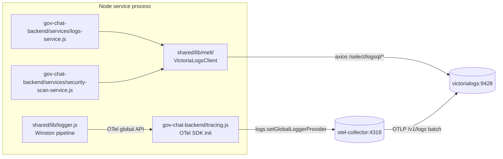

# Architecture Spine — GENIE.AI Admin Logs → VictoriaLogs

## Design Paradigm

**Structured logging with separated producer/consumer over OTel context, exposed through a hexagonal/onion boundary.**

Producers (Winston logger in Node services) emit structured `LogRecord`s via the OTel `LoggerProvider`. The OTel Collector batches and forwards to VictoriaLogs over OTLP/HTTP. Consumers (`LogsService`, `securityScanService`) read via the **MELT port** `LogQueryRepository`, with the **adapter** `VictoriaLogsAdapter` (axios HTTP client against VictoriaLogs LogSQL endpoints) as the only current implementation. No shared in-process state between producer and consumer; the shared schema is the wire format (`VictoriaLogsRow` normalized shape).

Hexagonal mapping (MELT layer = `components/shared/lib/melt/`):
- **Domain core** (no I/O): `LogQuery`, `VictoriaLogsRow`, `LogQueryResult` — pure types, zero deps.
- **Port** (`LogQueryRepository`): `query({q, start, end, limit, fields}): Promise<VictoriaLogsRow[]>`, `hits({q, start, end, field}): Promise<Record<string, number>>`. **Multi-tenant-ready**: `constructor({baseURL, tenantId})`. `tenantId` defaults to `VICTORIALOGS_TENANT_ID` env (default `0:0`); today single-tenant hardcoded via default, env kept as seam for future.
- **Adapter** (`VictoriaLogsAdapter implements LogQueryRepository`): the actual axios client. Internal-only file.
- **Application service** (`VictoriaLogsClient`): thin wrapper around `VictoriaLogsAdapter` exposing the seam to consumers via `require('shared/lib/melt').VictoriaLogsClient`. Adds `MELT_PROVIDER` discriminator (`'victorialogs'` only today).

The other direction (application `MELT_PROVIDER` env):
- `components/shared/lib/logger.js` → producer (Winston pipeline)
- `components/shared/lib/melt/` → consumer port + adapter (axios HTTP)
- `components/gov-chat-backend/tracing.js` → OTel SDK init (resource attributes, global `LoggerProvider`)
- `components/shared/lib/melt/` → MELT seam (single adapter today, multi-tenant-ready port)

## Invariants & Rules

### AD-1 — Logging transport paradigm

- **Binds:** CAP-1, CAP-2
- **Prevents:** ad-hoc transports bypassing the OTel context; mixed format/console/file-only emitters
- **Rule:** Winston logger emits through Console (always) + VictoriaLogsTransport (OTel `LoggerProvider`, default on) + `DailyRotateFile` (gated on `LOG_TO_FILE=1`). Single Winston pipeline; new transport is a `TransportStream` subclass. Producer-side lazy-init buffers up to 100 records before `LoggerProvider` is set, then flushes.

### AD-2 — VL stream field pinning

- **Binds:** CAP-1, CAP-7
- **Prevents:** VL cardinality blowup if `trace_id` / `span_id` treated as stream fields
- **Rule:** VL stream fields = `{service.name, deployment.environment}` only. `trace_id`, `span_id` are `LogRecord` attributes, not stream fields. Empty/absent `trace_id` is dropped before adding to attributes. **Pinned values**: backend `service.name=genie-backend`, document-repository `service.name=genie-document-repository`. Both consumers MUST hardcode these literals (no env-var indirection).

### AD-3 — `VictoriaLogsRow` canonical shape (port contract)

- **Binds:** CAP-3, CAP-4
- **Prevents:** two consumers (LogsService + securityScanService) diverging on row shape; contract-test drift; hexagonal layer violation (consumers reaching past port into raw axios)
- **Rule:** The **port** `LogQueryRepository.query()` returns `VictoriaLogsRow[]`. The adapter's `_normalizeRows` (private) maps VL wire `{_msg, _stream, _time, ...rest}` → `VictoriaLogsRow` with these exact sub-shapes:
  - `timestamp`: ISO 8601 string from `_time` (e.g. `2026-08-31T12:00:00.000Z`)
  - `message`: string from `_msg`
  - `stream`: `{service: string, environment: string}` from `_stream`
  - `fields`: object containing all `...rest` keys EXCEPT `_msg`/`_stream`/`_time`
  - `date`: `YYYY-MM-DD` (UTC) extracted from `_time`
  - `time`: `HH:MM:SS` (UTC) extracted from `_time`
  - `level`: uppercase string from `fields.level` or `_stream.level` (default `INFO`)
  - `service`: string from `_stream.service` (default `unknown`)

  Application consumers (`LogsService`, `securityScanService`) MUST consume via the **port** (`require('shared/lib/melt').VictoriaLogsClient`) — NOT via raw axios. Any change to `VictoriaLogsRow` breaks the contract-test gate in CAP-3 + CAP-4 acceptance.

### AD-4 — PII scrubbing scope

- **Binds:** CAP-1, CAP-5, constraint C-5
- **Prevents:** PII leaks via `logger.info(\`Login failed for ${email}\`)` — body contains user input
- **Rule:** PII scrubbing applies to BOTH OTel span attributes (existing `PIIRedactionProcessor` at `tracing.js:52-96`) AND OTel log record `body` field (new `PIIRedactingLogRecordProcessor extends BatchLogRecordProcessor` with `onEmit`). Do NOT reuse the `SpanProcessor` pattern for `LogRecord` — different lifecycle (`onEnd` vs `onEmit`). **Mandatory registration**: every `LoggerProvider` (backend + document-repository) MUST register `PIIRedactingLogRecordProcessor` BEFORE `logs.setGlobalLoggerProvider`. Component without the processor fails integration smoke.

### AD-5 — Dual-emit window handling

- **Binds:** CAP-1, CAP-3
- **Prevents:** duplicate log records in admin UI during P1a→P1c overlap; 2x storage cost; double-counted security-scan vulnerabilities
- **Rule:** Between P1a merge and P1c merge, backend + document-repository logs land in VL twice (OTel + fluentd driver). `LogsService.getLogsInRange` filters with `service:genie-backend AND NOT (_stream:genie.backend OR _stream:genie.document-repository)`. Filter removed in P1c MR. **Lint rule**: forbid `*fluent-logging` anchor references in any `logging:` block for services whose `image:` starts with `node:` — enforced via `.gitlab-ci.yml` `lint:compose` job that parses compose YAML and greps for the anchor + node image co-occurrence.

### AD-6 — Permanent escape hatches (per-call env read)

- **Binds:** CAP-6, rollback-matrix
- **Prevents:** rollback matrix lying (env flip without restart); last-wins module-load cache
- **Rule:** `ADMIN_LOGS_SOURCE=file|victorialogs` and `SECURITY_SCAN_BACKEND=file|victorialogs` are permanent. Consumers read `process.env.*` **per call** inside `getLogs` / `getLogsSummary` / `searchLogs` / `getDebugYesterday` / `runSecurityScan` — NEVER at module load. When `ADMIN_LOGS_SOURCE='file'` is set while `LOG_TO_FILE !== '1'` (post-P4 default), return 503 with recovery hint `"set LOG_TO_FILE=1"` instead of throwing `ENOENT`.

### AD-7 — Configuration split (profiles)

- **Binds:** CAP-7
- **Prevents:** cloud deployments with `ENABLE_OBSERVABILITY=0` returning empty admin logs by policy
- **Rule:** VL + OTel Collector run unconditionally — `profiles: [observability]` removed from `docker-compose.yaml:1650, :1671, :1749`, `victorialogs.deploy.replicas` pinned to `1`. Observability profile keeps `victoriametrics`, `victoriatraces`, `grafana` only. `LOG_TO_VICTORIALOGS=1` is still AND-gated with `ENABLE_OBSERVABILITY=1` so disabled observability does not emit into absent collector; a Prometheus counter `log_record_dropped_total{reason="observability_disabled"}` exposes the policy state.

### AD-8 — OTel global setter pattern

- **Binds:** CAP-1
- **Prevents:** doc-repo logs flowing through backend's `LoggerProvider` with backend's resource attributes (last-wins setter collision)
- **Rule:** Use `logs.setGlobalLoggerProvider(provider)` from `tracing.js` init. NO custom `setOtelLoggerProvider` setter in `components/shared/lib/logger.js`. Multi-process safe; per-service init wins for its own process. **Provider MUST include the PII processor per AD-4** before `setGlobalLoggerProvider` is called.

### AD-9 — JSON log format

- **Binds:** CAP-2
- **Prevents:** F4 regex mismatch; OTel transport needing printf substring parsing
- **Rule:** Winston format = `winston.format.combine(timestamp(), errors({stack:true}), json())`. Replaces printf + `traceFormat` at `logger.js:24-30`. `trace_id`/`span_id` are JSON keys, not printf substrings. File-fallback NDJSON parser uses `JSON.parse(line)`, not regex.

### AD-10 — File rotation + concurrent-writer invariants

- **Binds:** CAP-6 (escape hatch)
- **Prevents:** empty logs after `kill -9` mid-write; torn-line `SyntaxError`; ENOENT during `DailyRotateFile` rename
- **Rule:** `ADMIN_LOGS_SOURCE=file` path: re-read directory listing before each file; tolerate `ENOENT` between `stat()` and `open()`. Concurrent writers use `O_EXCL` PID lock via `fs.open(path, 'wx')` (Node 22 native — do NOT use `posix_fadvise`, not exposed). NDJSON parse wraps `JSON.parse` in try/catch; on `SyntaxError` (truncated line) read next **N=4096 bytes**, append, attempt re-parse, else skip with `parse_error` counter. `error.stack` newlines handled via `winston.format.json({replacer})` (verified supported in `logform/json.js`).

### AD-11 — Rate-limit state persistence

- **Binds:** CAP-5
- **Prevents:** 1-per-minute-cadence becoming 1-per-restart during extended VL outage; concurrent writers corrupting state file
- **Rule:** VL outage error logs capped at 1/min; state persisted to `/tmp/vl-fail-open-ts` as **Unix milliseconds** (single integer line) so backend restarts do not reset the counter. Both `LogsService` and `securityScanService` share the rate-limiter state file. Concurrent writers use `fs.open(path, 'wx')` for atomic claim; loser backs off 50 ms.

### AD-12 — Cache schema validation

- **Binds:** CAP-4
- **Prevents:** admin UI showing stale vulnerabilities from old `worker_threads` code path; security review based on outdated data; silent acceptance of legacy schema
- **Rule:** `/app/data/security/last-scan-results.json` schema-validated on read using **AJV 8.17+** (pinned exact version) with a strict JSON Schema covering the full `vulnerabilities.{critical,medium,low}[]` shape. If validation fails, treat as cache miss and regenerate. AJV is the canonical validator — no duck-typing or hand-rolled `typeof` checks.

### AD-13 — CI merge-order gate

- **Binds:** CAP-6, worktree cadence
- **Prevents:** half-rewired code under container restart; VL queries failing or Winston emitting nowhere mid-rollout
- **Rule:** MR-N+1 must not merge to `main` until MR-N's pipeline is green on the release branch. **Mechanism**: each phase MR's `.gitlab-ci.yml` deploy job adds `needs: ["pipeline:MR-N-success"]` via `trigger:` + `pipeline:` keyword referencing MR-N's branch pipeline status. Alternative: `rules:` with `allow_failure: false` + a manual `when: manual` status check tied to MR-N. One MR per phase boundary (P0 → MR-1, P1a → MR-2, ..., P4 → MR-7).

### AD-14 — Boolean env-var coercion

- **Binds:** CAP-1, CAP-5
- **Prevents:** `'LOG_TO_VICTORIALOGS=true'` silently off because check was strict equality; helper-location drift between components
- **Rule:** All boolean gates (`LOG_TO_VICTORIALOGS`, `LOG_TO_FILE`, `ADMIN_LOGS_SOURCE=file`, `VL_FAIL_OPEN`, `SECURITY_SCAN_BACKEND=file`) accept `1`, `true`, `TRUE`, `yes` via the **single helper** `components/shared/lib/boolean-env.js` exporting `booleanEnv(name): boolean`. Strict equality forbidden. Both backend and document-repository MUST require this same file.

### AD-15 — VL tenant identity headers

- **Binds:** CAP-1, CAP-3
- **Prevents:** cryptic "unknown tenant" errors on VL upgrade
- **Rule:** VL 1.50+ canonical headers `AccountID` + `ProjectID`. NOT legacy `VL-Tenant` (deprecated upstream). `VICTORIALOGS_TENANT_ID` env (default `0:0`) splits to `AccountID: <account>`, `ProjectID: <project>`. Multi-tenant deployment out of scope for this rollout.

### AD-16 — axios timeout + health-probe

- **Binds:** CAP-3, CAP-4, CAP-5
- **Prevents:** hung requests past 30s default; first admin request after deploy throwing `ENOTFOUND`; DNS races during swarm cold start; Jest module-load hang on constructor probe
- **Rule:** `VictoriaLogsClient` uses `VL_QUERY_TIMEOUT_MS` (default `30000`) for `query`/`hits`. **Health probe is lazy, NOT constructor-blocking**: triggered on first call, retries 3×5s. Constructor accepts `{ skipHealthProbe: true }` for test fixtures; production calls skip the flag. Early calls during the probe window throw a typed error caught by `VL_FAIL_OPEN` (which gates on `ECONNREFUSED` / `ENOTFOUND` / timeout / 5xx).

### AD-17 — Contract-test fixture convention

- **Binds:** CAP-3, CAP-4
- **Prevents:** contract tests asserting on divergent inputs; reproducibility drift across MRs
- **Rule:** `tests/test-fixtures/logs/combined-2026-08-15.log` — NDJSON, one record per line, schema `{timestamp, level, message, service, trace_id, span_id}`. ~500 records across `ERROR`/`WARN`/`INFO`. Ingestion script posts the same fixture to `/v1/logs` (OTLP) before contract tests run. Both `logs-vl-contract.test.js` + `security-scan-vl-bulk.test.js` use the SAME input on both file path and VL path.

### AD-18 — Tracing SDK location (no cross-component require)

- **Binds:** CAP-1, project-context rule 1
- **Prevents:** broken Winston load in document-repository (cross-component require chain); coupling backend ↔ shared/lib; divergent `BatchLogRecordProcessor` config across components
- **Rule:** `components/gov-chat-backend/tracing.js` owns the `LoggerProvider`, exports it via OTel `logs.setGlobalLoggerProvider`. `components/shared/lib/logger.js` consumes via the OTel global API — NEVER requires `gov-chat-backend` paths. Document-repository instantiates its own `LoggerProvider` in its own `tracing.js` and calls `setGlobalLoggerProvider` itself. **Shared batch tuning** (in `components/shared/lib/otel-batch-config.js`): `BatchLogRecordProcessor` constructed via the new 0.220+ signature `{ exporter, maxExportBatchSize: 512, scheduledDelayMillis: 5000, maxQueueSize: 2048 }`. Both components require the same config — no per-component drift. **PIIRedactingLogRecordProcessor** is also required by every `LoggerProvider` (AD-4).

**Document-repository init pattern (P1a follow-up)**: `components/document-repository/src/tracing.js` mirrors backend's `tracing.js:104-117` pattern with the following differences:
- Resource `service.name` = `'genie-document-repository'` (per AD-2)
- **Logs-only**: NO `OTLPTraceExporter`, NO `OTLPMetricExporter`, NO `PeriodicExportingMetricReader`. Only `OTLPLogExporter`.
- **Processor order mandatory**: `addLogRecordProcessor(new PIIRedactingLogRecordProcessor())` THEN `addLogRecordProcessor(new BatchLogRecordProcessor(exporter, sharedBatchConfig))` — PII first, batching second.
- Wire at `src/app.js:1` via `require('./tracing')`, mirroring backend's `index.js:14`.
- Document-repository `package.json` deps: `@opentelemetry/api`, `@opentelemetry/api-logs`, `@opentelemetry/sdk-logs`, `@opentelemetry/exporter-logs-otlp-http` — pinned exact 0.221.0 per Stack table.

### AD-19 — Security-scan dedupe + truncation + retention

- **Binds:** CAP-4
- **Prevents:** `401+forbidden` double-count inflating critical bucket; 7-day brute-force flood under-counting; retention mismatch silent scan misses
- **Rule:** Bucket hits by record key `sha1(record._time + '|' + record._stream.service + '|' + record._msg).slice(0, 16)` so one record contributes to at most one vulnerability bucket AND the key never collides with `_msg` content containing `|`. If `vlClient.query.length === limit`, set `degraded: true` in response. If `VICTORIALOGS_RETENTION` < scan window, set `degraded: true` and cap start to `now - retention`.

### AD-20 — ClamAV observability

- **Binds:** CAP-1 (producer side extends), cross-cutting with observability profile
- **Prevents:** silent ClamAV latency drift; ClamAV failure mode invisible in admin UI; blind capacity planning on virus-definition bloat
- **Rule:** Document-repository emits structured Winston events for every ClamAV scan call with these exact attrs:
  - `_msg`: `'clamav.scan.start'`, `'clamav.scan.complete'`, `'clamav.scan.failed'`, `'clamav.scan.timeout'` — predictable query prefix
  - `clamav_duration_ms`: integer — latency observation
  - `clamav_result`: `'OK' | 'FOUND' | 'ERROR' | 'TIMEOUT'` — outcome classification
  - `file_size_bytes`: integer — capacity signal
  - `file_id`: string — correlation with admin dashboard file list
  - `clamav_signature_version`: string from `clamd --version` output — track definition updates

  PII-redacted (no user info in attrs; `file_id` is opaque). Queryable in admin UI via `?q=service:genie-document-repository AND _msg:clamav.scan.*` + `?field=clamav_duration_ms` for p99 latency. **Out of scope this rollout**: ClamAV daemon stdout/stderr parsing via Fluentd sidecar (already reaches VL unstructured via existing fluentd driver; parsing deferred to a future observability epic).

### Dependency-direction diagram



`logger.js` MUST NOT require `tracing.js` (AD-18). `logs-service.js` + `security-scan-service.js` MUST NOT require `tracing.js` either; both reach OTel via `logs-service.js` reading VL only.

## Consistency Conventions

| Concern | Convention |
| --- | --- |
| Naming (entities, files, interfaces, events) | `victorialogs-*` prefix for new files in `shared/lib/` and `shared/lib/melt/`. `boolean-env.js` / `otel-batch-config.js` for cross-component helpers. `MELT_PROVIDER` for future-provider seam. `LogRecord` over `LogMessage` for OTel-side types. |
| Data & formats (ids, dates, error shapes, envelopes) | NDJSON one record per line for file fallback. LogSQL row shape = `VictoriaLogsClient._normalizeRows` output (AD-3). VL stream fields = `{service.name: genie-backend\|genie-document-repository, deployment.environment: <NODE_ENV>}` (AD-2). Env vars: snake_case, `1`/`true`/`yes` boolean coercion via `boolean-env.js` (AD-14). Timestamps in rate-limit file = Unix milliseconds (AD-11). |
| State & cross-cutting (mutation, errors, logging, config, auth) | Winston logger is the ONLY logger entrypoint in Node services. Per-call env read for escape hatches (AD-6). Rate-limit state in `/tmp/vl-fail-open-ts` with `O_EXCL` claim (AD-11). Cache files schema-validated on read via AJV 8.17+ (AD-12). PII scrubbed on attributes AND body via `PIIRedactingLogRecordProcessor` (AD-4). Batch tuning shared via `otel-batch-config.js` (AD-18). External-dependency events use `_msg:` prefix convention (e.g. `clamav.scan.*`) for queryable observation (AD-20). |

## Stack

| Name | Version |
| --- | --- |
| Node.js | 22.x (Docker image `node:22`) |
| Winston | 3.x |
| winston-daily-rotate-file | latest |
| `@opentelemetry/api` | `0.221.0` (already in `gov-chat-backend/package.json`) |
| `@opentelemetry/sdk-node` | `0.221.0` |
| `@opentelemetry/sdk-logs` | `0.221.0` (already transitive via `sdk-node`; pin explicitly in `package.json`) |
| `@opentelemetry/exporter-logs-otlp-http` | `0.221.0` (pin explicitly) |
| `@opentelemetry/api-logs` | `0.221.0` (peer of `sdk-logs` + `exporter-logs-otlp-http`, not of `api`) |
| axios | `^1.7.0` (unified with backend + frontend per project-context.md) |
| `victoriametrics/victoria-logs` | `v1.50.0` (verified at `docker-compose.yaml:1752`) |
| `otel/opentelemetry-collector-contrib` | `0.152.0` (verified at `docker-compose.yaml:1673`) |
| OTel Collector receivers | `fluent_forward` + `otlp` (after P0) on `:4318` / `:24224` |
| `ajv` | `^8.17.0` (cache schema validator, AD-12) |

## Structural Seed

### Container view

```mermaid
graph TB
  subgraph swarm[Docker Swarm]
    subgraph core[profiles:[core] — always on]
      VL[victorialogs:9428<br/>v1.50.0]
      OC[otel-collector:4318<br/>contrib v0.96.0]
    end
    subgraph genieai[profiles:[genieai]]
      BE[gov-chat-backend<br/>:3000]
      DR[document-repository<br/>:3001]
    end
    subgraph observability[profiles:[observability]]
      VM[victoriametrics:8428]
      VT[victoriatraces:10428]
      GRAF[grafana:3000]
    end
  end
  BE -->|OTel OTLP logs| OC
  BE -->|shared Winston transport| VL
  DR -->|shared Winston transport| VL
  OC -->|batch OTLP /v1/logs| VL
  BE -.->|future metrics/traces| VM
  BE -.->|future traces| VT
  GRAF -.->|queries| VL
  GRAF -.->|queries| VM
  GRAF -.->|queries| VT
```

Non-Node services (Python OPEA, Kong, nginx, postgres) keep `fluentd → collector → VL`; not shown. `victorialogs` data volume: `vlogs-data` (`docker-compose.yaml:65`).

### Source tree (touched files)

```text
components/shared/lib/
  logger.js                                 # MODIFY: format=json, drop traceFormat, add VL transport
  victorialogs-transport.js                 # NEW: Winston TransportStream → OTel LoggerProvider
  melt/
    index.js                                # NEW: exports VictoriaLogsClient + MELT_PROVIDER
    victorialogs-client.js                  # NEW: axios HTTP client
  index.js                                  # MODIFY: re-export melt/

components/gov-chat-backend/
  tracing.js                                # MODIFY: LoggerProvider + setGlobalLoggerProvider + metrics
  services/
    logs-service.js                         # REWRITE: getLogsInRange via VictoriaLogsClient
    admin-dashboard-service.js              # MODIFY: drop F4 regex, delegate getLogs
    security-scan-service.js                  # REWRITE: worker_threads → VL bulk query + dedupe
  routes/
    admin-routes.js                         # MODIFY: rolloverLogs deprecation (P4)
    logger-routes.js                        # MODIFY: import internal ./logger not shared/lib (P4)

components/document-repository/
  src/app.js                                # MINOR: producer-side Winston (no admin endpoints)

configs/otel/
  otel-collector-config.yaml                # MODIFY: add otlp to logs receivers

docker-compose.yaml                        # MODIFY: 3 profile changes + 2 logging driver switches
deploy/ansible/
  templates/env.j2                          # MODIFY: render 3 new vars unconditionally
  group_vars/all.yml                        # NO CHANGE
  group_vars/cloud_deploy/vars.yml          # NO CHANGE

env                                         # MODIFY: commented templates for 8 new vars

tests/
  test-fixtures/logs/combined-2026-08-15.log # NEW: NDJSON fixture
  config-validator/                         # MODIFY: whitelist MELT_PROVIDER, validate new envs
  melt-correlation/                         # NEW (P0 stub only)
  smoke/docker-log-driver.sh                # NEW: P1c verification shell

components/gov-chat-backend/__tests__/
  logger-functions.test.js                  # EXTEND: JSON format assertions
  logger-otel-trace.test.js                 # EXTEND: JSON-key assertions (drop printf)
  routes/admin.test.js                      # EXTEND: degraded banner + contract responses
  routes/logger-routes.test.js              # EXTEND: deprecated endpoints
  services/logs-service.test.js             # EXTEND: per-call env read tests
  services/security-scan-service.test.js    # REPLACE: Worker mock → VictoriaLogsClient mock
  services/logs-vl-contract.test.js         # NEW: contract parity
  services/logs-vl-degradation.test.js      # NEW: graceful degradation
  services/security-scan-vl-bulk.test.js    # NEW: shape parity
  services/security-scan-vl-degradation.test.js # NEW: security-scan degradation
  logger-vl-integration.test.js             # NEW: fake OTLPLogExporter
  p-l-lig-pii-scrubbing.test.js             # NEW: PII body redaction
  linter-shared-lib-re-exports.test.js      # NEW: triggerLogRollover refactor guard

components/shared/lib/__tests__/
  victorialogs-transport.test.js            # NEW: severity mapping, trace_id flow
  melt/victorialogs-client.test.js          # NEW: AccountID/ProjectID headers, normalization
```

## Capability → Architecture Map

| Capability | Lives in | Governed by |
| --- | --- | --- |
| CAP-1 Producer emits structured records | `shared/lib/logger.js` + `victorialogs-transport.js` | AD-1, AD-2, AD-8, AD-9, AD-20 |
| CAP-2 JSON format | `shared/lib/logger.js` format config | AD-9 |
| CAP-3 Admin Logs endpoints | `gov-chat-backend/services/logs-service.js` + `melt/victorialogs-client.js` | AD-3, AD-5, AD-10, AD-17 |
| CAP-4 Security scanner | `gov-chat-backend/services/security-scan-service.js` | AD-3, AD-12, AD-19 |
| CAP-5 Graceful degradation | `LogsService` + `securityScanService` VL wrappers | AD-6, AD-11, AD-14, AD-16 |
| CAP-6 Rollback escape hatches | Env-driven per-call reads + `rollback-matrix.md` | AD-6, AD-13, AD-14 |
| CAP-7 VL + Collector core stack | `docker-compose.yaml` profiles + `otel-collector-config.yaml` | AD-7 |
| CAP-8 CI stub for `tests/melt-correlation/` | `tests/melt-correlation/{run-melt-test.sh,README.md}` | NG-4 (deferred) |

## Deferred

- **ELK / Loki MELT adapter** — `LogQueryRepository` port ready; only `VictoriaLogsAdapter` shipped today. New adapter = `ElasticsearchAdapter` or `LokiAdapter` implementing the same port, plus `MELT_PROVIDER` discriminator logic in `VictoriaLogsClient` factory. Revisit when a second backend is requested.
- **`tests/melt-correlation/` full implementation** — P0 MR ships `exit-0` stub only. Tracked as `DW-325` in `_bmad-output/implementation-artifacts/deferred-work.md`. Chaos/correlation suite (OTel trace↔log↔metric correlation, controlled VL/Collector/fluentd failures) is a separate epic. Triggers for revisit: any MR touching VL/OTel collector deployment, observability reliability question, or Grafana dashboard rework.
- **Document-repository OTel SDK init (logs-only path)** — AD-18 documents the full init pattern; implementation deferred to a P1a follow-up MR. Not blocking P1a backend MR.
- **Multi-tenant VL isolation** — `VICTORIALOGS_TENANT_ID` env kept as port seam (default `0:0`, single-tenant hardcoded in current `VictoriaLogsAdapter`). Multi-tenant deployment out of scope for this rollout. Revisit if GENIE.AI moves to multi-tenant.
- **VL collector/Collector version drift automation** — versions pinned (Stack table); no automated version-bump policy in this rollout. Manual upgrades via MR with smoke verification.

## Open Questions

- **Q-1** OTel deps location — `components/shared/lib/package.json` (shared) OR only `components/gov-chat-backend/package.json` + `document-repository`'s own? Confirm before P1a MR. (project-context.md prefers deps with consumer.)
- **Q-2** `VL_FAIL_OPEN` rate-limit cadence — 1/min (drafted) vs 1/5min (less log flood during extended outage). Confirm before P2 MR.
- **Q-3** Multi-tenant readiness — `VICTORIALOGS_TENANT_ID` env reserved but multi-tenant not planned. Confirm tenant isolation is out-of-scope.
- **Q-4** `log_record_dropped_total` cardinality — labels proposed `{queue_full, otlp_unreachable, observability_disabled}`. Confirm no per-service labels (cardinality blowup risk).