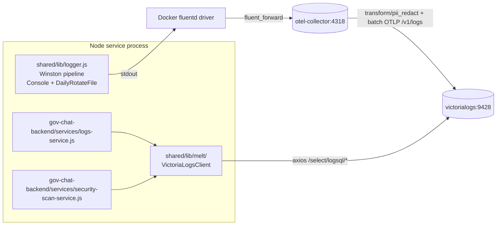

# Architecture Spine — GENIE.AI Admin Logs → VictoriaLogs

## Design Paradigm

**Structured logging with separated producer/consumer over OTel context, exposed through a hexagonal/onion boundary.**

Producers (Winston logger in Node services) emit structured `LogRecord`s via the OTel `LoggerProvider`. The OTel Collector batches and forwards to VictoriaLogs over OTLP/HTTP. Consumers (`LogsService`, `securityScanService`) read via the **MELT port** `LogQueryRepository`, with the **adapter** `VictoriaLogsAdapter` (axios HTTP client against VictoriaLogs LogSQL endpoints) as the only current implementation. No shared in-process state between producer and consumer; the shared schema is the wire format (`VictoriaLogsRow` normalized shape).

Hexagonal mapping (MELT layer = `components/shared/lib/melt/`):
- **Domain core** (no I/O): `LogQuery`, `VictoriaLogsRow`, `LogQueryResult` — pure types, zero deps.
- **Port** (`LogQueryRepository`): `query({q, start, end, limit, fields}): Promise<VictoriaLogsRow[]>`, `hits({q, start, end, field}): Promise<Record<string, number>>`. **Multi-tenant-ready**: `constructor({baseURL, tenantId})`. `tenantId` defaults to `VICTORIALOGS_TENANT_ID` env (default `0:0`); today single-tenant hardcoded via default, env kept as seam for future.
- **Adapter** (`VictoriaLogsAdapter implements LogQueryRepository`): the actual axios client. Internal-only file.
- **Application service** (`VictoriaLogsClient`): thin wrapper around `VictoriaLogsAdapter` exposing the seam to consumers via `require('shared/lib/melt').VictoriaLogsClient`. Adds `MELT_PROVIDER` discriminator (`'victorialogs'` only today).

The other direction (application `MELT_PROVIDER` env):
- `components/shared/lib/logger.js` → producer (Winston pipeline)
- `components/shared/lib/melt/` → consumer port + adapter (axios HTTP)
- `components/gov-chat-backend/tracing.js` → OTel SDK init (resource attributes, global `LoggerProvider`)
- `components/shared/lib/melt/` → MELT seam (single adapter today, multi-tenant-ready port)

## Invariants & Rules

### AD-1 — Logging transport paradigm

- **Binds:** CAP-1, CAP-2
- **Prevents:** ad-hoc transports bypassing the OTel context; mixed format/console/file-only emitters
- **Rule:** Winston logger emits through Console (always) + `DailyRotateFile` (gated on `LOG_TO_FILE=1`). The OTel SDK `LoggerProvider` / `VictoriaLogsTransport` dual-channel path is dropped (T2/T3/T2b of the OTel-SDK-revert initiative, 2026-09-17). The single-channel invariant (C-8) is: every log record traverses `Winston → stdout → Docker fluentd driver → OTel Collector (fluent_forward receiver) → VictoriaLogs`. PII redaction now lives in the OTel Collector edge (`transform/pii_redact` in `configs/otel/otel-collector-config.yaml`); the in-process `PIIRedactingLogRecordProcessor` is gone.

### AD-3 — `VictoriaLogsRow` canonical shape (port contract)

- **Binds:** CAP-3, CAP-4
- **Prevents:** two consumers (LogsService + securityScanService) diverging on row shape; contract-test drift; hexagonal layer violation (consumers reaching past port into raw axios)
- **Rule:** The **port** `LogQueryRepository.query()` returns `VictoriaLogsRow[]`. The adapter's `_normalizeRows` (private) maps VL wire `{_msg, _stream, _time, ...rest}` → `VictoriaLogsRow` with these exact sub-shapes:
  - `timestamp`: ISO 8601 string from `_time` (e.g. `2026-08-31T12:00:00.000Z`)
  - `message`: string from `_msg`
  - `stream`: `{service: string, environment: string}` from `_stream`
  - `fields`: object containing all `...rest` keys EXCEPT `_msg`/`_stream`/`_time`
  - `date`: `YYYY-MM-DD` (UTC) extracted from `_time`
  - `time`: `HH:MM:SS` (UTC) extracted from `_time`
  - `level`: uppercase string from `fields.level` or `_stream.level` (default `INFO`)
  - `service`: string from `_stream.service` (default `unknown`)

  Application consumers (`LogsService`, `securityScanService`) MUST consume via the **port** (`require('shared/lib/melt').VictoriaLogsClient`) — NOT via raw axios. Any change to `VictoriaLogsRow` breaks the contract-test gate in CAP-3 + CAP-4 acceptance.

### AD-4 — PII scrubbing scope (post-OTel-SDK-revert)

- **Binds:** CAP-1, CAP-5, constraint C-5
- **Prevents:** PII leaks via `logger.info(\`Login failed for ${email}\`)` — body contains user input
- **Rule:** PII scrubbing now lives at the **OTel Collector edge** in `transform/pii_redact` (`configs/otel/otel-collector-config.yaml`). Both OTel OTLP logs and the docker fluentd driver path pass through it before export to VictoriaLogs. The 19-key PII list (`configs/otel/pii-key-list.md`) is enforced at the export boundary. **Why**: the previous in-process `PIIRedactingLogRecordProcessor extends BatchLogRecordProcessor` (AD-4 v1) only covered the OTel SDK path; logs arriving via the docker fluentd driver never went through it and reached VL unredacted. The collector-edge placement closes that gap. The transform redacts both `body` strings and `attributes` Maps with anchored `IsString`/`IsMap` guards. `error_mode: propagate` for the first 30 days (then `ignore` per a follow-up MR — tracked in CHANGELOG `[Unreleased]`).

### AD-5 — Dual-emit window handling (OBSOLETE post-T5)

- **Binds:** CAP-1, CAP-3
- **Prevents:** duplicate log records in admin UI during P1a→P1c overlap; 2x storage cost; double-counted security-scan vulnerabilities
- **Rule:** _No longer applicable._ The P1a→P1c dual-emit window closed when the OTel SDK LoggerProvider was dropped (T2/T3/T2b) — there is no OTel-direct emit to dedup. The `_vlFilter` dedup at `logs-service.js:413-435` was deleted in T5; read-side filters no longer carry the `NOT fluent.tag:*` discriminator. (The original rule during the migration window was: `LogsService.getLogsInRange` filters with `service:genie-backend AND NOT (_stream:genie.backend OR _stream:genie.document-repository)`.)

### AD-6 — Permanent escape hatches (per-call env read)

- **Binds:** CAP-6, rollback-matrix
- **Prevents:** rollback matrix lying (env flip without restart); last-wins module-load cache
- **Rule:** `ADMIN_LOGS_SOURCE=file|victorialogs` and `SECURITY_SCAN_BACKEND=file|victorialogs` are permanent. Consumers read `process.env.*` **per call** inside `getLogs` / `getLogsSummary` / `searchLogs` / `getDebugYesterday` / `runSecurityScan` — NEVER at module load. The file-source body implementation is dropped in T8 per SPEC D2, but the env contract is preserved: when `ADMIN_LOGS_SOURCE='file'` is set while `LOG_TO_FILE !== '1'` (post-P4 default), the consumer returns HTTP 503 with body `{"error":"vl_files_disabled","message":"Set LOG_TO_FILE=1 to use file-based log source"}` instead of throwing `ENOENT`. Re-enabling file-source behaviour requires the surviving `LOG_TO_FILE=1` escape hatch (P4).

### AD-7 — Configuration split (profiles)

- **Binds:** CAP-7
- **Prevents:** cloud deployments with `ENABLE_OBSERVABILITY=0` returning empty admin logs by policy
- **Rule:** VL + OTel Collector run unconditionally — `profiles: [observability]` removed from `docker-compose.yaml:1650, :1671, :1749`, `victorialogs.deploy.replicas` pinned to `1`. Observability profile keeps `victoriametrics`, `victoriatraces`, `grafana` only. The OTel SDK LoggerProvider path is gone (T2/T3/T2b); `LOG_TO_VICTORIALOGS` and `OTEL_EXPORTER_OTLP_LOGS_ENDPOINT` env vars are no longer read — egress flows through the docker fluentd driver regardless of `ENABLE_OBSERVABILITY`.

### AD-9 — JSON log format

- **Binds:** CAP-2
- **Prevents:** F4 regex mismatch; OTel transport needing printf substring parsing
- **Rule:** Winston format = `winston.format.combine(timestamp(), errors({stack:true}), json())`. Replaces printf + `traceFormat` at `logger.js:24-30`. `trace_id`/`span_id` are JSON keys, not printf substrings. File-fallback NDJSON parser uses `JSON.parse(line)`, not regex.

### AD-10 — File rotation + concurrent-writer invariants (OBSOLETE post-T8)

- **Binds:** CAP-6 (escape hatch)
- **Prevents:** empty logs after `kill -9` mid-write; torn-line `SyntaxError`; ENOENT during `DailyRotateFile` rename
- **Rule:** _No longer applicable to the read path._ The `ADMIN_LOGS_SOURCE=file` body implementation was dropped in T8 (~1100 LOC: 22 method bodies + 5 `LOG_TO_FILE` early-return guards). The env contract is preserved (SPEC D2 + AD-6) — consumers still honour `ADMIN_LOGS_SOURCE` per-call and return HTTP 503 when set without `LOG_TO_FILE=1`. The write-side invariants (NDJSON format, `DailyRotateFile` rotation, `O_EXCL` PID lock) only apply when the operator activates the surviving `LOG_TO_FILE=1` escape hatch (P4) AND manually re-adds the `/app/logs` host bind-mount (T7 dropped it from `docker-compose.yaml`).

### AD-11 — Rate-limit state persistence

- **Binds:** CAP-5
- **Prevents:** 1-per-minute-cadence becoming 1-per-restart during extended VL outage; concurrent writers corrupting state file
- **Rule:** VL outage error logs capped at 1/min; state persisted to `/tmp/vl-fail-open-ts` as **Unix milliseconds** (single integer line) so backend restarts do not reset the counter. Both `LogsService` and `securityScanService` share the rate-limiter state file. **Implementation note (post-T8)**: the implementation now uses `fs.promises.writeFile` (atomic-truncate on POSIX for small files) rather than `fs.open(path, 'wx')` — the previous O_EXCL pattern always threw `EEXIST` after the first successful write and silently muted every subsequent incident for the host lifetime. The `cooldownWrite` assertion in `logs-vl-degradation.test.js` Property 3 pins the file-write integration.

### AD-12 — Cache schema validation

- **Binds:** CAP-4
- **Prevents:** admin UI showing stale vulnerabilities from old `worker_threads` code path; security review based on outdated data; silent acceptance of legacy schema
- **Rule:** `/app/data/security/last-scan-results.json` schema-validated on read using **AJV 8.17+** (pinned exact version) with a strict JSON Schema covering the full `vulnerabilities.{critical,medium,low}[]` shape. If validation fails, treat as cache miss and regenerate. AJV is the canonical validator — no duck-typing or hand-rolled `typeof` checks.

### AD-13 — CI merge-order gate

- **Binds:** CAP-6, worktree cadence
- **Prevents:** half-rewired code under container restart; VL queries failing or Winston emitting nowhere mid-rollout
- **Rule:** MR-N+1 must not merge to `main` until MR-N's pipeline is green on the release branch. **Mechanism**: each phase MR's `.gitlab-ci.yml` deploy job adds `needs: ["pipeline:MR-N-success"]` via `trigger:` + `pipeline:` keyword referencing MR-N's branch pipeline status. Alternative: `rules:` with `allow_failure: false` + a manual `when: manual` status check tied to MR-N. One MR per phase boundary (P0 → MR-1, P1a → MR-2, ..., P4 → MR-7).

### AD-14 — Boolean env-var coercion

- **Binds:** CAP-1, CAP-5
- **Prevents:** `'LOG_TO_VICTORIALOGS=true'` silently off because check was strict equality; helper-location drift between components
- **Rule:** All boolean gates (`LOG_TO_VICTORIALOGS`, `LOG_TO_FILE`, `ADMIN_LOGS_SOURCE=file`, `VL_FAIL_OPEN`, `SECURITY_SCAN_BACKEND=file`) accept `1`, `true`, `TRUE`, `yes` via the **single helper** `components/shared/lib/boolean-env.js` exporting `booleanEnv(name): boolean`. Strict equality forbidden. Both backend and document-repository MUST require this same file.

### AD-15 — VL tenant identity headers

- **Binds:** CAP-1, CAP-3
- **Prevents:** cryptic "unknown tenant" errors on VL upgrade
- **Rule:** VL 1.50+ canonical headers `AccountID` + `ProjectID`. NOT legacy `VL-Tenant` (deprecated upstream). `VICTORIALOGS_TENANT_ID` env (default `0:0`) splits to `AccountID: <account>`, `ProjectID: <project>`. Multi-tenant deployment out of scope for this rollout.

### AD-16 — axios timeout + health-probe

- **Binds:** CAP-3, CAP-4, CAP-5
- **Prevents:** hung requests past 30s default; first admin request after deploy throwing `ENOTFOUND`; DNS races during swarm cold start; Jest module-load hang on constructor probe
- **Rule:** `VictoriaLogsClient` uses `VL_QUERY_TIMEOUT_MS` (default `30000`) for `query`/`hits`. **Health probe is lazy, NOT constructor-blocking**: triggered on first call, retries 3×5s. Constructor accepts `{ skipHealthProbe: true }` for test fixtures; production calls skip the flag. Early calls during the probe window throw a typed error caught by `VL_FAIL_OPEN` (which gates on `ECONNREFUSED` / `ENOTFOUND` / timeout / 5xx).

### AD-17 — Contract-test fixture convention

- **Binds:** CAP-3, CAP-4
- **Prevents:** contract tests asserting on divergent inputs; reproducibility drift across MRs
- **Rule:** `tests/test-fixtures/logs/combined-2026-08-15.log` — NDJSON, one record per line, schema `{timestamp, level, message, service, trace_id, span_id}`. ~500 records across `ERROR`/`WARN`/`INFO`. Ingestion script posts the same fixture to `/v1/logs` (OTLP) before contract tests run. Both `logs-vl-contract.test.js` + `security-scan-vl-bulk.test.js` use the SAME input on both file path and VL path.

### AD-18 — Tracing SDK location (no cross-component require)

- **Binds:** CAP-1, project-context rule 1
- **Prevents:** broken Winston load in document-repository (cross-component require chain); coupling backend ↔ shared/lib; divergent `BatchLogRecordProcessor` config across components
- **Rule:** _Updated post-OTel-SDK-revert (T2/T3/T2b)._ `components/gov-chat-backend/tracing.js` no longer instantiates a `LoggerProvider`; the OTel **logs** signal chain is removed. Trace + metrics signal chains (Express + FastAPI instrumentations, db-arango, pii filters) are unchanged. `components/shared/lib/logger.js` is now purely a Winston pipeline (Console + optional `DailyRotateFile`) — it NEVER requires `gov-chat-backend` paths. Document-repository's `src/tracing.js` mirrors backend's trace + metrics init with the same simplification (no `OTLPLogExporter`). **PII redaction** (AD-4) is now collector-edge only — the `PIIRedactingLogRecordProcessor` / `BatchLogRecordProcessor` chain that this AD previously described is gone.

**Document-repository init pattern (post-T3)**: `components/document-repository/src/tracing.js` mirrors backend's `tracing.js` pattern with the following differences:
- Resource `service.name` = `'genie-document-repository'` (per AD-2)
- **Logs-only entry point removed**: NO `OTLPLogExporter`, NO `LoggerProvider`, NO `BatchLogRecordProcessor`. PII redaction runs at the collector edge.
- **Trace + metrics stay**: `OTLPTraceExporter` + `OTLPMetricExporter` + `PeriodicExportingMetricReader` continue as before.
- Wire at `src/app.js:1` via `require('./tracing')`, mirroring backend's `index.js:14`.
- Document-repository `package.json` deps: `@opentelemetry/api`, `@opentelemetry/sdk-node` (pinned exact 0.221.0 per Stack table) — `@opentelemetry/api-logs`, `@opentelemetry/sdk-logs`, `@opentelemetry/exporter-logs-otlp-http` removed.

### AD-19 — Security-scan dedupe + truncation + retention

- **Binds:** CAP-4
- **Prevents:** `401+forbidden` double-count inflating critical bucket; 7-day brute-force flood under-counting; retention mismatch silent scan misses
- **Rule:** Bucket hits by record key `sha1(record._time + '|' + record._stream.service + '|' + record._msg).slice(0, 16)` so one record contributes to at most one vulnerability bucket AND the key never collides with `_msg` content containing `|`. If `vlClient.query.length === limit`, set `degraded: true` in response. If `VICTORIALOGS_RETENTION` < scan window, set `degraded: true` and cap start to `now - retention`.

### AD-20 — ClamAV observability

- **Binds:** CAP-1 (producer side extends), cross-cutting with observability profile
- **Prevents:** silent ClamAV latency drift; ClamAV failure mode invisible in admin UI; blind capacity planning on virus-definition bloat
- **Rule:** Document-repository emits structured Winston events for every ClamAV scan call with these exact attrs:
  - `_msg`: `'clamav.scan.start'`, `'clamav.scan.complete'`, `'clamav.scan.failed'`, `'clamav.scan.timeout'` — predictable query prefix
  - `clamav_duration_ms`: integer — latency observation
  - `clamav_result`: `'OK' | 'FOUND' | 'ERROR' | 'TIMEOUT'` — outcome classification
  - `file_size_bytes`: integer — capacity signal
  - `file_id`: string — correlation with admin dashboard file list
  - `clamav_signature_version`: string from `clamd --version` output — track definition updates

  PII-redacted (no user info in attrs; `file_id` is opaque). Queryable in admin UI via `?q=service:genie-document-repository AND _msg:clamav.scan.*` + `?field=clamav_duration_ms` for p99 latency. **Out of scope this rollout**: ClamAV daemon stdout/stderr parsing via Fluentd sidecar (already reaches VL unstructured via existing fluentd driver; parsing deferred to a future observability epic).

### Dependency-direction diagram



`logger.js` MUST NOT require `tracing.js` (AD-18). `logs-service.js` + `security-scan-service.js` reach VictoriaLogs only through the MELT client (axios / `select/logsql/*`) — NOT through any in-process OTel logs signal chain (the OTel SDK `LoggerProvider` is gone per the OTel-SDK-revert initiative).

## Consistency Conventions

| Concern | Convention |
| --- | --- |
| Naming (entities, files, interfaces, events) | `victorialogs-*` prefix for new files in `shared/lib/` and `shared/lib/melt/`. `boolean-env.js` for the cross-component helper. `MELT_PROVIDER` for future-provider seam. |
| Data & formats (ids, dates, error shapes, envelopes) | LogSQL row shape = `VictoriaLogsClient._normalizeRows` output (AD-3). VL stream fields = `{service.name: genie-backend\|genie-document-repository, deployment.environment: <NODE_ENV>}` (AD-2). Env vars: snake_case, `1`/`true`/`yes` boolean coercion via `boolean-env.js` (AD-14). Timestamps in rate-limit file = Unix milliseconds (AD-11). |
| State & cross-cutting (mutation, errors, logging, config, auth) | Winston logger is the ONLY logger entrypoint in Node services. Per-call env read for escape hatches (AD-6). Rate-limit state in `/tmp/vl-fail-open-ts` (atomic-truncate writeFile) (AD-11). Cache files schema-validated on read via AJV 8.17+ (AD-12). PII scrubbed at OTel Collector edge via `transform/pii_redact` (AD-4). External-dependency events use `_msg:` prefix convention (e.g. `clamav.scan.*`) for queryable observation (AD-20). |

## Stack

| Name | Version |
| --- | --- |
| Node.js | 22.x (Docker image `node:22`) |
| Winston | 3.x |
| winston-daily-rotate-file | latest (audit-retention escape hatch, `LOG_TO_FILE=1`) |
| `@opentelemetry/api` | `0.221.0` (already in `gov-chat-backend/package.json`) |
| `@opentelemetry/sdk-node` | `0.221.0` (trace + metrics only — logs signal removed in T2/T3) |
| ~~`@opentelemetry/sdk-logs`~~ | _Removed_ in T2/T3 — OTel logs signal chain is gone |
| ~~`@opentelemetry/exporter-logs-otlp-http`~~ | _Removed_ in T2/T3 — no in-process OTel logs exporter |
| ~~`@opentelemetry/api-logs`~~ | _Removed_ in T2/T3 |
| axios | `^1.7.0` (unified with backend + frontend per project-context.md) |
| `victoriametrics/victoria-logs` | `v1.50.0` (verified at `docker-compose.yaml:1752`) |
| `otel/opentelemetry-collector-contrib` | `0.152.0` (verified at `docker-compose.yaml:1673`) — now hosts `transform/pii_redact` + `transform/set_trace_id_from_body` |
| OTel Collector receivers | `fluent_forward` + `otlp` on `:4318` / `:24224` |
| `ajv` | `^8.17.0` (cache schema validator, AD-12) |

## Structural Seed

### Container view

```mermaid
graph TB
  subgraph swarm[Docker Swarm]
    subgraph core[profiles:[core] — always on]
      VL[victorialogs:9428<br/>v1.50.0]
      OC[otel-collector:4318<br/>contrib v0.96.0]
    end
    subgraph genieai[profiles:[genieai]]
      BE[gov-chat-backend<br/>:3000]
      DR[document-repository<br/>:3001]
    end
    subgraph observability[profiles:[observability]]
      VM[victoriametrics:8428]
      VT[victoriatraces:10428]
      GRAF[grafana:3000]
    end
  end
  BE -->|stdout → fluentd| OC
  DR -->|stdout → fluentd| OC
  OC -->|transform/pii_redact + batch OTLP /v1/logs| VL
  BE -.->|metrics/traces| VM
  BE -.->|traces| VT
  GRAF -.->|queries| VL
  GRAF -.->|queries| VM
  GRAF -.->|queries| VT
```

Non-Node services (Python OPEA, Kong, nginx, postgres) keep `fluentd → collector → VL`; not shown. `victorialogs` data volume: `vlogs-data` (`docker-compose.yaml:65`). **The previous `BE -->|OTel OTLP logs| OC` direct-emit edge is removed** — backend + document-repository emit exclusively via the docker fluentd driver (T2/T3 OTel-SDK-revert).

### Source tree (touched files)

```text
components/shared/lib/
  logger.js                                 # MODIFY (post-OTel-SDK-revert): drop VictoriaLogsTransport,
                                            #   keep Console + DailyRotateFile (LOG_TO_FILE=1 escape)
  melt/
    index.js                                # NEW: exports VictoriaLogsClient + MELT_PROVIDER
    victorialogs-client.js                  # NEW: axios HTTP client
  index.js                                  # MODIFY: re-export melt/

components/gov-chat-backend/
  tracing.js                                # MODIFY (post-T2): drop LoggerProvider + setGlobalLoggerProvider
                                            #   + PIIRedactingLogRecordProcessor; trace + metrics stay
  tracing-pii-logs.js                       # DELETED (T4)
  services/
    logs-service.js                         # REWRITE (T8): drop 22 file-source method bodies
                                            #   (~1100 LOC); keep _sourceMode() + VlFilesDisabledError
                                            #   for SPEC D2 503 contract
    admin-dashboard-service.js              # MODIFY: drop F4 regex, delegate getLogs
    security-scan-service.js                # REWRITE: worker_threads → VL bulk query + dedupe
  routes/
    admin-routes.js                         # MODIFY: rolloverLogs deprecation (P4)
    logger-routes.js                        # MODIFY: import internal ./logger not shared/lib (P4)

components/document-repository/
  src/tracing.js                            # MODIFY (post-T3): drop LoggerProvider + OTLPLogExporter
  src/tracing-pii-logs.js                   # DELETED (T4)
  src/app.js                                # MINOR: producer-side Winston (no admin endpoints)

components/shared/lib/victorialogs-transport.js   # DELETED (T4 — OTel SDK logs signal chain removed)

genie-ai-overlay/
  tracing.py                                # MODIFY (post-T2b): drop setup_logging() — Python logging
                                            #   now flows via stdout → fluentd → collector → VL

configs/otel/
  otel-collector-config.yaml                # MODIFY (post-T1): add `transform/pii_redact` (covers all
                                            #   ingestion paths) and `transform/set_trace_id_from_body`
                                            #   for the fluentd path's trace correlation

docker-compose.yaml                        # MODIFY (T6/T7/T-fluentd-buffer): drop LOG_TO_VICTORIALOGS
                                            #   + OTEL_EXPORTER_OTLP_LOGS_ENDPOINT, drop /app/logs
                                            #   bind mounts, add fluentd-buffer-limit 8MB +
                                            #   fluentd-max-retries 5 + fluentd-retry-wait 2s
deploy/ansible/
  templates/env.j2                          # MODIFY (T6/T7): drop LOG_TO_VICTORIALOGS,
                                            #   OTEL_EXPORTER_OTLP_LOGS_ENDPOINT, LOG_TO_FILE
  group_vars/all.yml                        # NO CHANGE
  group_vars/cloud_deploy/vars.yml          # NO CHANGE

env                                         # MODIFY (T6/T7): drop commented templates for
                                            #   LOG_TO_VICTORIALOGS + LOG_TO_FILE;
                                            #   LOG_TO_FILE kept as a cross-reference comment

tests/
  test-fixtures/logs/combined-2026-08-15.log # NEW: NDJSON fixture
  config-validator/                         # NO CHANGE: never asserted presence of dropped vars
  melt-correlation/                         # NEW (P0 stub only)

components/gov-chat-backend/__tests__/
  logger-functions.test.js                  # EXTEND: JSON format assertions; LOG_TO_FILE gate block
  logger-otel-trace.test.js                 # EXTEND: JSON-key assertions (drop printf)
  routes/admin.test.js                      # EXTEND: degraded banner + contract responses
  routes/logger-routes.test.js              # EXTEND: deprecated endpoints
  services/logs-service.test.js             # EXTEND: per-call env read tests
  services/security-scan-service.test.js    # REPLACE: Worker mock → VictoriaLogsClient mock
  services/logs-vl-contract.test.js         # NEW: contract parity
  services/logs-vl-degradation.test.js      # NEW: graceful degradation (1/min cadence, etc.)
  services/security-scan-vl-bulk.test.js    # NEW: shape parity
  services/security-scan-vl-degradation.test.js # NEW: security-scan degradation
  services/logs-service-no-vlfilter.test.js # NEW (T5): _vlFilter dedup removed regression pin
  services/logs-service-no-file-branches.test.js # NEW (T8): file-source drop regression pin
  services/logs-service-admin-source.test.js # NEW: ADMIN_LOGS_SOURCE toggle contract
  linter-shared-lib-re-exports.test.js      # NEW: triggerLogRollover refactor guard
  # DELETED (T4b): logger-vl-integration.test.js, pii-body-scrubbing.test.js, pi-scrubbing tests
  #   (OTel SDK path no longer exists)

components/shared/lib/__tests__/
  melt/victorialogs-client.test.js          # NEW: AccountID/ProjectID headers, normalization
  # DELETED (T4): victorialogs-transport.test.js (transport removed)
```

## Capability → Architecture Map

| Capability | Lives in | Governed by |
| --- | --- | --- |
| CAP-1 Producer emits structured records | `shared/lib/logger.js` + Docker fluentd driver + OTel Collector | AD-1, AD-2, AD-4 (collector edge), AD-9, AD-20 |
| CAP-2 JSON format | `shared/lib/logger.js` format config | AD-9 |
| CAP-3 Admin Logs endpoints | `gov-chat-backend/services/logs-service.js` + `melt/victorialogs-client.js` | AD-3, AD-6, AD-10 (OBSOLETE), AD-17 |
| CAP-4 Security scanner | `gov-chat-backend/services/security-scan-service.js` | AD-3, AD-12, AD-19 |
| CAP-5 Graceful degradation | `LogsService` + `securityScanService` VL wrappers | AD-6, AD-11, AD-14, AD-16 |
| CAP-6 Rollback escape hatches | Env-driven per-call reads + `rollback-matrix.md` | AD-6, AD-13, AD-14 |
| CAP-7 VL + Collector core stack | `docker-compose.yaml` profiles + `otel-collector-config.yaml` | AD-7 |

## Deferred

- **ELK / Loki MELT adapter** — `LogQueryRepository` port ready; only `VictoriaLogsAdapter` shipped today. New adapter = `ElasticsearchAdapter` or `LokiAdapter` implementing the same port, plus `MELT_PROVIDER` discriminator logic in `VictoriaLogsClient` factory. Revisit when a second backend is requested.
- **`tests/melt-correlation/` full implementation** — P0 MR ships `exit-0` stub only. Tracked in `_bmad-output/implementation-artifacts/deferred-work.md`. Chaos/correlation suite (OTel trace↔log↔metric correlation, controlled VL/Collector/fluentd failures) is a separate epic. Triggers for revisit: any MR touching VL/OTel collector deployment, observability reliability question, or Grafana dashboard rework.
- **Multi-tenant VL isolation** — `VICTORIALOGS_TENANT_ID` env kept as port seam (default `0:0`, single-tenant hardcoded in current `VictoriaLogsAdapter`). Multi-tenant deployment out of scope for this rollout. Revisit if GENIE.AI moves to multi-tenant.
- **VL collector/Collector version drift automation** — versions pinned (Stack table); no automated version-bump policy in this rollout. Manual upgrades via MR with smoke verification.

## Open Questions

- **Q-1** OTel SDK **logs** signal location — RESOLVED 2026-09-17 (OTel-SDK-revert). Removed entirely; the in-process `LoggerProvider` is no longer instantiated by `components/gov-chat-backend/tracing.js`, `components/document-repository/src/tracing.js`, or `genie-ai-overlay/tracing.py`. Trace + metrics signal chains unchanged.
- **Q-2** `VL_FAIL_OPEN` rate-limit cadence — RESOLVED 1/min (per AD-11, pinned by `logs-vl-degradation.test.js` Property 1 + T8.5 fake-timer smoke).
- **Q-3** Multi-tenant readiness — `VICTORIALOGS_TENANT_ID` env reserved but multi-tenant not planned. Tenant isolation is out-of-scope.