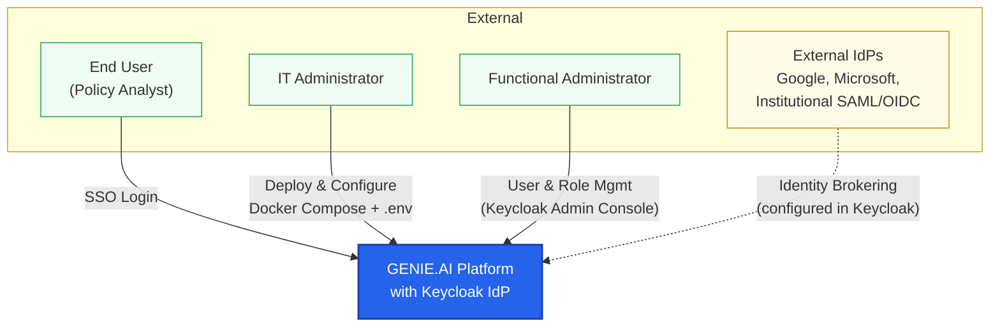
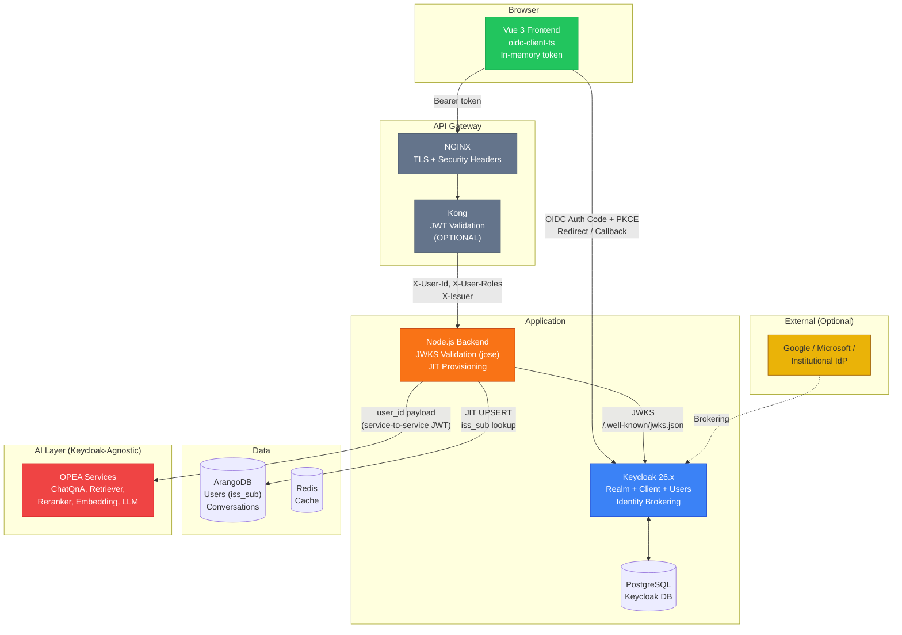
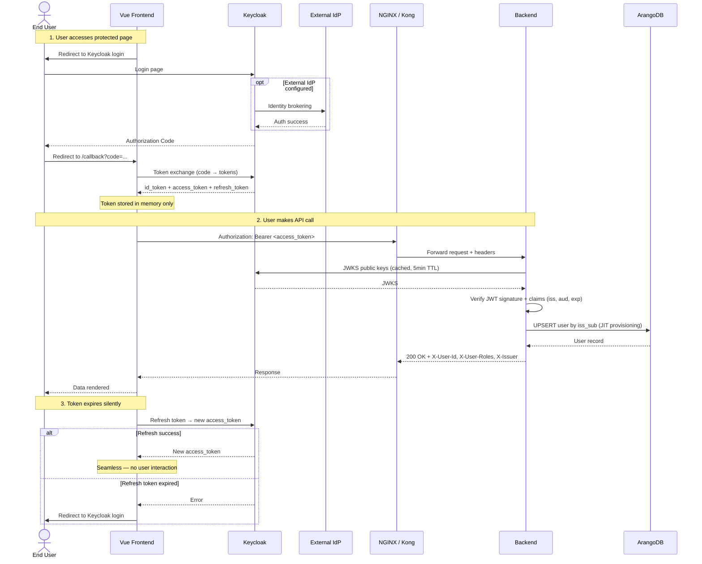
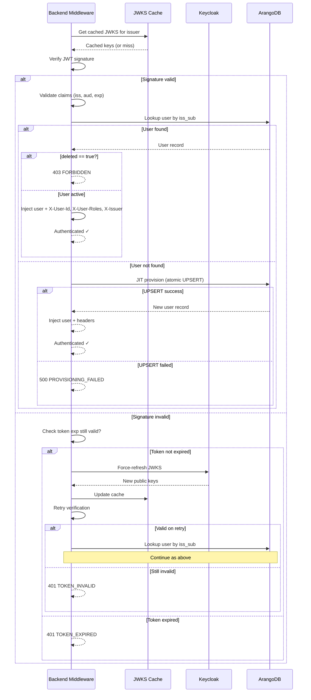

# Keycloak IdP Integration — Architecture Diagrams

## 1. C4 Context — System in Scope

## 2. C4 Container — Internal Architecture

## 3. Sequence — OIDC Authentication Flow (SSO)

## 4. Sequence — Token Validation with JWKS Force-Refresh

