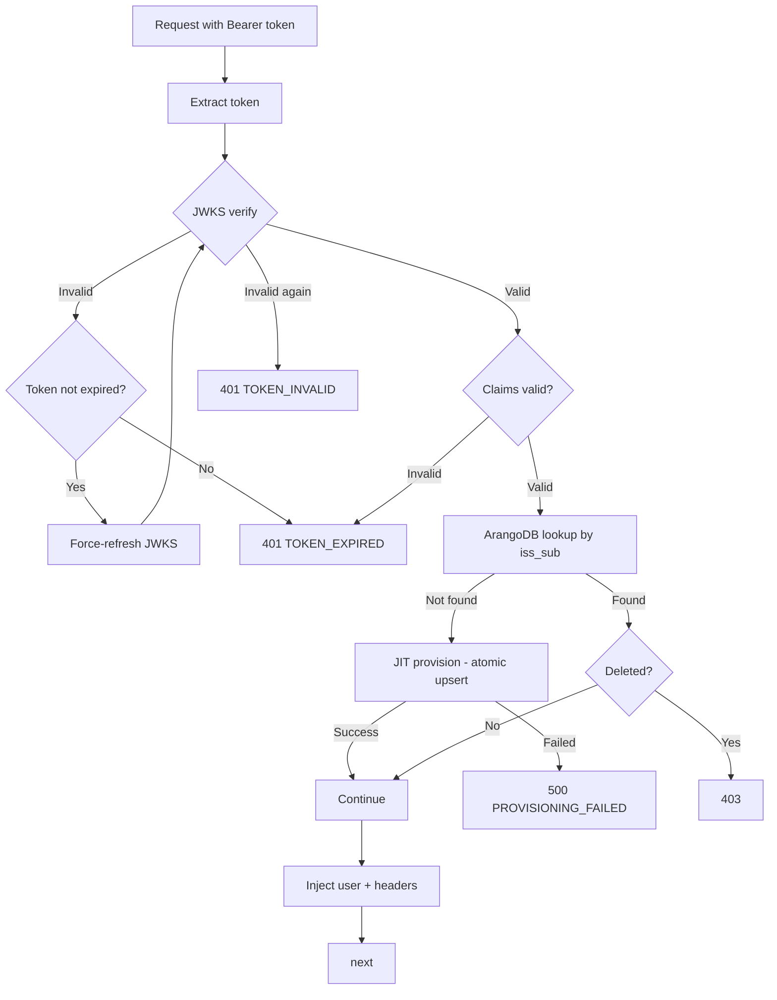

# Architecture Decision Document

_This document builds collaboratively through step-by-step discovery. Sections are appended as we work through each architectural decision together._

## Project Context Analysis

### Requirements Overview

**Functional Requirements:**

38 FRs organized into 7 categories driving the architecture:

1. **Authentication & Identity Federation (FR1-FR6):** OIDC via Keycloak as mandatory gateway, supporting both federated SSO (external IdPs via brokering) and isolated mode (Keycloak as local IdP). Multi-realm support within a single Keycloak instance.
2. **Deployment & Configuration (FR7-FR11):** Single Docker Compose command deployment with pre-configured Keycloak (realm, client, default admin user). Kong optional. All secrets via single `.env`. Full offline capability.
3. **Session & Token Management (FR12-FR17):** Token passthrough — no GENIE.AI JWT issued. Backend validates independently via JWKS. Kong provides optional additional validation. In-memory token storage on frontend (never persisted).
4. **User Provisioning & Management (FR18-FR21):** JIT provisioning in ArangoDB using composite `{iss}#${sub}` key. All user management via Keycloak admin console — no GENIE.AI-specific user management UI.
5. **API Access & Route Security (FR22-FR26):** Per-route authentication enforcement. Public routes (`/health`, `/api-docs`, static assets). Swagger UI with OIDC "Authorize" button.
6. **Error Handling & Recovery (FR27-FR30):** Graceful auth failure handling. Clear user-facing error messages. Keycloak unavailability detection with service degradation communication.
7. **Security & Compliance (FR31-FR38):** TLS encryption. Audit-ready authentication logs. GDPR support (right to erasure, log retention, session data purging). OPEA services unchanged — Keycloak-agnostic.

**Non-Functional Requirements:**

24 NFRs organized into 5 categories shaping architectural decisions:

1. **Security (NFR1-NFR7):** OIDC with PKCE mandatory. TLS 1.2+. Tokens in browser memory only. Backend JWKS validation with issuer/audience/expiration checks. Token revocation detection. Downstream services receive signed headers only.
2. **Reliability & Availability (NFR8-NFR11):** Backend operational without Kong. Keycloak unavailability returns HTTP 503. JWKS caching with force-refresh on 401. Health check verifies Keycloak OIDC discovery endpoint reachability.
3. **Compliance & Data Protection (NFR12-NFR18):** Audit logs with timestamps, `{iss}#${sub}`, event type. Configurable log retention (90 days min, 12 months max). Session auto-purge. GDPR right to erasure. Data residency within institution boundary.
4. **Performance (NFR19-NFR21):** Token validation < 500ms. Auth redirect flow < 3s. 500+ concurrent sessions per realm.
5. **Compatibility & Interoperability (NFR22-NFR24):** Any standard-compliant external IdP. Keycloak 26.x with upgrade path to 27.x. Latest 2 versions of Chrome, Firefox, Safari, Edge.

**Scale & Complexity:**

- Primary domain: Web App + API Backend (Mobile deferred to Phase 2)
- Complexity level: High — multi-realm JWKS, multi-issuer validation, GDPR compliance, air-gapped deployment, defense-in-depth security
- Estimated architectural components: 6-8 (Keycloak container, backend auth middleware, frontend OIDC client, Kong JWT plugin config, ArangoDB schema evolution, Docker Compose setup, environment configuration, health check integration)

### Technical Constraints & Dependencies

- **Existing codebase conventions:** Backend must use CommonJS (`require`/`module.exports`), frontend must use Vue 3 Options API — PRD notes that Issue #218 reference code conflicts with these conventions
- **Token format dependency:** Architecture is tied to Keycloak JWT format (claims structure, signing algorithm). Multi-issuer support requires dynamic JWKS endpoint resolution per realm. This is a **Keycloak-specific backend validation constraint** — a future provider switch would require middleware changes, even though client-side SDKs are IdP-agnostic
- **ArangoDB schema evolution:** Current `users` collection must accommodate composite `{iss}#${sub}` key and JWT-derived user profiles. Lookup index must be properly configured for the composite key
- **OPEA services unchanged:** Backend-to-OPEA communication uses existing service-to-service JWT and `user_id` payload — no changes to AI layer
- **Kong optional:** Two Docker Compose configurations needed — system must behave identically with and without Kong. **Header names and formats injected by Kong vs Backend must be consistent** to avoid confusing downstream services
- **Docker single-stage builds:** Per project conventions, each service uses single Dockerfile
- **No production users:** Clean slate — no migration needed, no backward compatibility with existing auth

### Cross-Cutting Concerns Identified

1. **Security:** OIDC/PKCE flow, JWKS validation, token lifecycle, TLS, CORS, helmet — affects frontend, backend, and gateway layers
2. **Compliance (GDPR):** Log retention, right to erasure, session data purging, data residency — affects logging, user management, and data storage
3. **Multi-tenancy (Multi-realm):** Dynamic issuer resolution, per-realm user isolation, role mapping — affects auth middleware, ArangoDB queries, and configuration
4. **Observability:** Authentication audit logs with structured format (`{iss}#${sub}`, timestamps, event types) — affects logging infrastructure
5. **Resilience:** Keycloak health monitoring, graceful degradation (503), JWKS cache with force-refresh, Kong-optional deployment — affects middleware design and error handling
6. **Configuration management:** Single `.env` for all secrets, Keycloak hostname/DNS configuration, realm/client pre-configuration — affects Docker Compose and init scripts

### Open Architectural Questions (from collaborative review)

1. **Multi-realm `user_id` for OPEA:** The `user_id` passed to downstream OPEA services — should it be the Keycloak `sub` alone (risking collision across realms) or the full `{iss}#${sub}` composite? This impacts FR38 and all downstream analytics/conversation history. **Decision required.**
2. **Token revocation in air-gapped mode:** JWKS caching covers signature verification and expiration but cannot detect revoked tokens without an introspection endpoint. In isolated/air-gapped deployments, real-time revocation is not possible. This is a **documented security trade-off** — the JWKS cache TTL becomes the maximum window for a revoked token to remain valid. NFR10 addresses caching but not the revocation gap explicitly.
3. **Programmatic test token acquisition:** FR25 provides Swagger UI with OIDC "Authorize" button for manual testing. For automated test suites, a mechanism to obtain Keycloak tokens programmatically (test client, pre-configured service account, or test realm) should be considered.

## Integration Component Evaluation

### Primary Technology Domain

Web App + API Backend (brownfield auth migration) — adding Keycloak IdP to existing Vue 3 + Node.js/Express stack.

### Components Added to Existing Stack

**Not a starter template project** — this is a brownfield integration. The evaluation covers new components added to the established GENIE.AI stack.

| Component | Version / Source | Purpose | New or Existing |
|---|---|---|---|
| Keycloak | `quay.io/keycloak/keycloak:26.5.6` | Identity Provider container | New |
| `oidc-client-ts` | 3.x (latest stable) | Frontend OIDC client, Authorization Code + PKCE | New |
| Backend JWT/JWKS library | TBD (jose vs jsonwebtoken+jwks-rsa) | Token validation at backend level | New |
| Keycloak init mechanism | TBD (keycloak-config-cli vs custom init vs export/import) | Pre-configured realm, client, default user | New |
| ArangoDB schema evolution | — | Composite `{iss}#${sub}` key, JIT provisioning | Modified |
| Docker Compose | — | Keycloak service definition, env wiring | Modified |

### Architecture Pattern: Token Passthrough (PRD Decision)

The PRD selected **token passthrough** over the research document's BFF recommendation:
- No GENIE.AI JWT issued — Keycloak tokens validated directly
- Backend validates independently via JWKS (no dependency on Kong)
- Kong optional — additional validation layer when deployed
- Frontend uses `oidc-client-ts` directly (not a backend-mediated flow)

This simplifies the architecture but creates Keycloak-specific backend validation (noted as evolution constraint).

### Integration Points

1. **Frontend:** New `oidc-client-ts` integration wrapped in Options API service (per project conventions — NOT a composable)
2. **Backend:** New auth middleware replacing current JWT validation with Keycloak JWKS validation + ArangoDB user lookup
3. **Docker Compose:** Keycloak service added with init mechanism for pre-configuration
4. **Kong (optional):** JWT plugin configuration for multi-issuer/multi-realm validation
5. **ArangoDB:** `users` collection schema evolution for `{iss}#${sub}` composite key

### User Lifecycle & JIT Provisioning Decisions

JIT provisioning creates ArangoDB user records on first Keycloak login using `{iss}#${sub}` as composite key. The following lifecycle scenarios are addressed:

| Scenario | Behavior | ArangoDB Impact |
|---|---|---|
| First login (new user) | JIT provisioning — user record created from JWT claims | New record inserted |
| Subsequent logins | Upsert — existing record updated with latest JWT claims | Record updated |
| Email change in Keycloak | Updated in JWT claims → upsert reflects new email | Record updated |
| User locked in Keycloak | Keycloak refuses new tokens; existing tokens expire | No change — record persists, user de facto blocked |
| User disabled in Keycloak | Same as locked — tokens expire, no new tokens issued | No change — record persists |
| User deleted in Keycloak | FR15: session invalidated; FR34: right to erasure supported | **Soft delete** — record marked `deleted: true`, PII anonymized, conversations preserved |
| User switches IdP/realm | `{iss}#{sub}` changes → new identity | **New user** created — old record preserved as orphan (documented limitation) |

**Key decisions:**
- **MVP:** User lock/disable = no ArangoDB action (let tokens expire naturally)
- **MVP:** User deletion = soft delete + PII anonymization (preserve conversation history integrity)
- **MVP:** IdP/realm switch = new user (documented as architectural limitation for future enhancement)
- **JIT provisioning = upsert** (not insert-only) — handles email changes and profile updates automatically

### Open Decisions

1. **Backend JWKS library:** `jose` (lightweight, modern, dual CJS/ESM) vs `jsonwebtoken` (already in dependencies) + `jwks-rsa` for JWKS endpoint resolution
2. **Keycloak realm initialization approach:** `keycloak-config-cli` (dedicated tool, YAML/JSON config) vs custom init container (bash script with `kcadm`) vs Keycloak realm export/import
3. **Frontend OIDC integration pattern:** Standalone Vue service class wrapping `oidc-client-ts` UserManager vs direct integration into existing Vuex store actions

## Core Architectural Decisions

### Decision Priority Analysis

**Critical Decisions (Block Implementation):**
- Backend JWKS validation library selection → `jose`
- ArangoDB user schema evolution for Keycloak → composite `{iss}#{sub}` with upsert
- Keycloak realm initialization approach → `keycloak-config-cli`
- Frontend OIDC integration pattern → standalone service class
- Multi-realm `user_id` format for OPEA → `{iss}#{sub}` complete

**Important Decisions (Shape Architecture):**
- JWKS caching strategy (TTL, force-refresh logic) → 5 min TTL, force-refresh on 401
- Soft delete + PII anonymization approach → TBD (pending confirmation on anonymization method)

**Deferred Decisions (Post-MVP):**
- User migration/fusion when switching IdP or realm (documented as limitation)
- Index on `sub` alone (defer — evaluate based on actual query patterns)

### Data Architecture

**Decision D1 — ArangoDB `users` collection schema:**

| Field | Type | Source | Mutable | Notes |
|---|---|---|---|---|
| `_key` | string | Auto ArangoDB | No | Primary key |
| `iss_sub` | string | JWT `{iss}#{sub}` | No | **Unique index** — composite identity key |
| `iss` | string | JWT `iss` | No | Issuer (Keycloak realm URL) |
| `sub` | string | JWT `sub` | No | Subject (Keycloak user ID) |
| `email` | string | JWT `email` | Yes | Upserted on each login |
| `name` | string | JWT `name` / `preferred_username` | Yes | Upserted on each login |
| `roles` | array | JWT `realm_access.roles` | Yes | Updated on each login |
| `active` | boolean | Default `true` | Yes | Soft delete support |
| `deleted` | boolean | Default `false` | Yes | Soft delete + PII anonymization |
| `createdAt` | string (ISO 8601) | First login | No | Immutable — record creation timestamp |
| `updatedAt` | string (ISO 8601) | Each login | Yes | Last profile update timestamp |

**Indexes:**
- Unique persistent index on `iss_sub` — primary lookup for JIT provisioning
- Persistent index on `email` — admin lookup

**JIT provisioning logic:** Upsert (insert if new, update if exists) on each successful authentication. Profile fields (`email`, `name`, `roles`) refreshed from JWT claims on every login.

**Soft delete behavior:** `active: false` + `deleted: true` + PII fields anonymized. Conversation history preserved. PII anonymization approach TBD (pending Jerome confirmation: field replacement vs field removal).

### Authentication & Security

**Decision D2 — Backend JWKS library: `jose`**

- **Rationale:** Lightweight, modern API with native JWKS multi-issuer support via `createRemoteJWKS()`. Single-call verification with `jose.jwtVerify()`. No additional library needed for JWKS resolution. Node.js 22 Web Crypto API compatible.
- **Install:** `npm install jose` (CommonJS: `const { jwtVerify, createRemoteJWKS } = require('jose')`)
- **Affects:** Backend auth middleware only
- **Alternative rejected:** `jsonwebtoken` + `jwks-rsa` — additional dependency, older API, designed for both emission and verification (we only verify)

**Decision D3 — JWKS caching strategy:**

| Parameter | Value | Rationale |
|---|---|---|
| Cache key | `{iss}` (issuer URL) | Enables multi-issuer without collision |
| TTL | 5 minutes | Below Keycloak key rotation interval (~10 min) |
| Force-refresh trigger | HTTP 401 + valid `exp` | Detects key rotation without performance penalty |
| Force-refresh logic | 1. Token verification fails → 2. Check `exp` still valid → 3. Force-refresh JWKS for this issuer → 4. Re-verify token → 5. If fail again, reject with 401 | Two-attempt pattern prevents user disruption during key rotation |

**Decision D4 — Multi-realm `user_id` for OPEA: `{iss}#{sub}`**

- **Rationale:** Guarantees uniqueness across realms. Using `sub` alone risks data corruption when two realms have the same `sub` for different users. Consistent with ArangoDB composite key. Minimal implementation cost (string concatenation) for significant forward compatibility.
- **Open question:** Verify whether OPEA services process `user_id` format or pass it transparently — may require consumer adaptation.
- **Affects:** Backend-to-OPEA payload, conversation history, analytics queries

**Decision D7 — Multi-tenancy approach: Keycloak Organizations (v26)**

- **Default:** Keycloak Organizations for multi-population within a single institution (one realm, sub-namespaces per organization)
- **Advanced:** Multi-realm for total isolation between distinct institutions (requires multi-issuer JWKS cache and `{iss}#{sub}` — both already built into D3/D4)
- **Rationale:** Organizations simplify MVP (single realm, single JWKS endpoint, single `KEYCLOAK_REALM`) while D3/D4 ensure the system is multi-realm ready without code changes
- **External IdP (Google, Microsoft, etc.):** Configured entirely within Keycloak per organization — GENIE.AI sees only standard Keycloak tokens, zero code awareness of external IdPs
- **Mobile (Flutter Phase 2):** Benefits from Organizations — single authority URL, no multi-tenant config needed

### Frontend Architecture

**Decision D5 — OIDC integration: Standalone service class**

- **Pattern:** `src/services/keycloakAuthService.js` wrapping `oidc-client-ts` UserManager
- **Rationale:** Follows existing project convention (services in `src/services/`). Separation of concerns. Testable in isolation. Vuex store consumes the service via actions.
- **Vuex integration:** New `auth` module in store that dispatches to `keycloakAuthService` methods
- **Token storage:** In-memory only (NFR3) — `oidc-client-ts` configured with `storeAuthStateInCookie: false`, no `localStorage`/`sessionStorage`
- **Exposed methods:** `initialize()`, `login()`, `logout()`, `handleCallback()`, `getUser()`, `getAccessToken()`, `isAuthenticated()`

### Infrastructure & Deployment

**Decision D6 — Keycloak realm initialization: Custom image with `keycloak-config-cli`**

- **Approach:** Custom Docker image (`genie-keycloak-config`) based on `bitnami/keycloak-config-cli` with YAML config baked in. Deployed as init container alongside Keycloak.
- **Rationale:** No bind mounts (not cloud-native). Config is version-controlled in git and baked into the image. Secrets injected via environment variables at runtime (`${env:KEYCLOAK_CLIENT_SECRET}`, `${env:KEYCLOAK_ADMIN_PASSWORD}`). 100% cloud-native.
- **Config location:** `config/keycloak/genie-realm.yaml` (consistent with existing `config/prompts/` convention)
- **Dockerfile:** `FROM bitnami/keycloak-config-cli:latest` + `COPY config/keycloak/genie-realm.yaml /config/`
- **Docker:** Init container in Keycloak service definition, secrets via env vars from `.env`
- **Affects:** Docker Compose setup, `config/` directory structure, new Dockerfile

### Decision Impact Analysis

**Implementation Sequence:**
1. ArangoDB schema + indexes (foundation for all auth flows)
2. Backend auth middleware with `jose` JWKS validation
3. Keycloak Docker service + `keycloak-config-cli` initialization
4. Frontend `keycloakAuthService.js` + Vuex auth module
5. Kong JWT plugin configuration (optional deployment)
6. Health check integration + error handling

**Cross-Component Dependencies:**
- ArangoDB schema must exist before backend auth middleware can do JIT provisioning
- Keycloak container must be running before frontend OIDC flows can be tested
- Backend auth middleware must be in place before Kong JWT plugin can be configured
- Frontend service depends on Keycloak OIDC discovery endpoint being reachable

## Implementation Patterns & Consistency Rules

### Already Established (from project-context.md — do not re-decide)

- Backend: CommonJS, 2-space indent, single quotes, semicolons, PascalCase controllers, kebab-case routes/services
- Frontend: Options API, PascalCase components, ES modules with @/ alias, translate() for i18n
- DB: direct AQL queries, no ORM, no repository pattern
- Config: process.env with defaults inline, minimal config.js
- Error handling: try/catch in route handlers, global error middleware
- Logging: winston via shared-lib logger
- Auth middleware: per-route, not global

### Keycloak Integration — New Patterns

#### Naming Patterns

**Environment Variables:**
- Prefix: `KEYCLOAK_` for all Keycloak-related configuration
- Format: SCREAMING_SNAKE_CASE
- `KEYCLOAK_URL` — base URL of Keycloak server (e.g., `https://keycloak.genie-ai.local`)
- `KEYCLOAK_REALM` — default realm for the frontend OIDC client (backend uses JWT `iss` claim instead)
- `KEYCLOAK_CLIENT_ID` — OIDC client ID
- `KEYCLOAK_CLIENT_SECRET` — OIDC client secret (backend only)
- Issuer constructed in code: `${KEYCLOAK_URL}/realms/${KEYCLOAK_REALM}`

**JWT Claims Extraction:**
- Use camelCase in code (JavaScript standard): `const { sub, iss, email, realm_access } = payload`
- Extract `realm_access.roles` as `roles` array
- Build composite key: `const issSub = \`${payload.iss}#${payload.sub}\``

**Downstream Headers:**
- Prefix: `X-` for custom headers
- Format: SCREAMING_SNAKE_CASE with hyphens
- `X-User-Id` — `{iss}#{sub}` composite (comma-separated roles)
- `X-User-Roles` — comma-separated role list (e.g., `admin,user`)
- `X-Issuer` — full issuer URL

#### Format Patterns

**Auth Error Response:**
```json
{
  "error": "ERROR_CODE",
  "message": "Human-readable description",
  "details": {}
}
```

**Error Codes:**

| HTTP | Code | Meaning |
|---|---|---|
| 401 | `TOKEN_INVALID` | Malformed or invalid token signature |
| 401 | `TOKEN_EXPIRED` | Token expiration claim exceeded |
| 403 | `INSUFFICIENT_ROLES` | Valid token but missing required role |
| 500 | `PROVISIONING_FAILED` | Valid token but ArangoDB JIT provisioning failed |
| 503 | `AUTH_SERVICE_UNAVAILABLE` | Keycloak unreachable |

**Audit Log Entry (structured):**
```json
{
  "event": "login_success",
  "timestamp": "ISO 8601",
  "userId": "iss#sub",
  "issuer": "https://keycloak/realms/genie",
  "ip": "optional",
  "userAgent": "optional"
}
```

**Event types:** `login_success`, `login_failed`, `logout`, `token_refreshed`, `token_validation_failed`, `user_provisioned`

**Note:** The `#` separator in `userId` may require escaping in some log aggregation systems (Elasticsearch, Splunk). Agents must escape values if the target log system requires it.

#### Structure Patterns

**OIDC Callback Routes (public, no auth required):**
- `GET /api/auth/callback` — OIDC authorization code callback
- `GET /api/auth/logout/callback` — post-logout redirect

**Vuex Auth Module State Shape:**
```js
// store/modules/auth.js — replaces existing auth module entirely (no coexistence)
state: {
  isAuthenticated: false,
  user: null,           // { iss_sub, sub, iss, email, name, roles }
  accessToken: null,    // string — in-memory only, never persisted
  error: null           // string or null
}
```

**ArangoDB User Query Patterns:**
- Lookup: `FOR u IN users FILTER u.iss_sub == @iss_sub && u.deleted != true RETURN u`
- Upsert: `UPSERT { iss_sub: @iss_sub } INSERT @doc REPLACE @update IN users` (atomic, no race conditions)
- All queries filter out soft-deleted users (`deleted != true`)

#### Process Patterns

**JWKS Force-Refresh (all agents must follow this exact flow):**
1. Verify token with cached JWKS → fail
2. Check if token `exp` is still valid (not expired)
3. If yes → force-refresh JWKS for this issuer → re-verify → if fail again, 401
4. If no (token expired) → 401 immediately (no refresh)

**Auth Middleware Flow:**
1. Extract Bearer token from Authorization header
2. Verify JWT signature via JWKS (with force-refresh logic above)
3. Validate claims: `iss`, `aud`, `exp`
4. Lookup user in ArangoDB by `iss_sub`
5. If user not found → JIT provision (atomic upsert)
6. If JIT provisioning fails → 500 `PROVISIONING_FAILED`
7. If user `deleted == true` → 403
8. Inject user identity into request object
9. Set downstream headers: `X-User-Id`, `X-User-Roles`, `X-Issuer`
10. Call next()



### Test Patterns

**Shared Mock Fixture (mandatory for all auth tests):**
- Location: `__tests__/mocks/mockJwtPayload.js`
- Contains minimum valid JWT payload: `sub`, `iss`, `email`, `name`, `realm_access`, `exp`, `aud`
- All agents writing auth middleware tests MUST use this shared fixture

### Enforcement Guidelines

**All AI Agents MUST:**
- Follow the `KEYCLOAK_*` env var naming convention without exception
- Use the standardized auth error response format with error codes
- Follow the two-attempt JWKS force-refresh pattern exactly
- Use atomic ArangoDB UPSERT for JIT provisioning (never INSERT + UPDATE separately)
- Filter out soft-deleted users (`deleted != true`) in all ArangoDB queries
- Never persist access tokens (in-memory only)
- Use the downstream header names `X-User-Id`, `X-User-Roles`, `X-Issuer` with specified formats
- Log auth events using the structured audit log format
- Replace the existing Vuex auth module entirely (no coexistence with old auth)
- Use the shared mock fixture for all auth-related tests

## Project Structure & Boundaries

### Changes by Component

#### 1. Backend — `components/gov-chat-backend/`

**New files:**

```
gov-chat-backend/
├── middleware/
│   └── keycloak-auth-middleware.js      # NEW — JWKS validation + JIT provisioning
├── services/
│   └── keycloak-auth-service.js          # NEW — JWKS cache, token verification, user lookup
├── __tests__/
│   ├── mocks/
│   │   └── mockJwtPayload.js             # NEW — shared JWT payload fixture
│   └── keycloak-auth-middleware.test.js  # NEW — auth middleware tests
```

**Modified files:**

| File | Change |
|---|---|
| `middleware/auth-middleware.js` | **Replaced** — imports keycloak-auth-middleware.js |
| `routes/auth-routes.js` | **Modified** — add `GET /callback` and `GET /logout/callback` public routes, remove local auth endpoints |
| `controllers/authController.js` | **Modified** — add OIDC callback handler, remove local auth handlers |
| `services/auth-service.js` | **Replaced** — local JWT auth replaced by Keycloak passthrough |
| `config.js` | **Modified** — add `KEYCLOAK_URL`, `KEYCLOAK_REALM`, `KEYCLOAK_CLIENT_ID`, `KEYCLOAK_CLIENT_SECRET` |
| `index.js` | **Modified** — replace auth middleware import with keycloak-auth-middleware |
| `package.json` | **Modified** — add `jose` dependency |
| `swaggerConfig.js` | **Modified** — add OIDC "Authorize" button config (FR25) |

**Removed files (local auth):**

| File | Reason |
|---|---|
| `services/auth-service.js` (local auth functions) | Replaced by Keycloak |
| `components/LoginScreen.vue` | Replaced by Keycloak redirect |
| `components/RegisterScreen.vue` | Replaced by Keycloak |
| `components/PasswordReset*.vue` | Replaced by Keycloak flows |
| `components/EmailVerificationScreen.vue` | Replaced by Keycloak |
| `views/LoginView.vue` | Replaced by Keycloak redirect |
| `views/RegisterView.vue` | Replaced by Keycloak redirect |
| `services/passwordService.js` | Keycloak handles passwords |

#### 2. Frontend — `components/gov-chat-frontend/`

**New files:**

```
gov-chat-frontend/src/
├── services/
│   └── keycloakAuthService.js            # NEW — oidc-client-ts wrapper (Options API service)
├── config/
│   └── oidcConfig.js                     # NEW — OIDC configuration (authority, client_id, redirect_uri)
```

**Modified files:**

| File | Change |
|---|---|
| `store/modules/auth.js` | **Replaced** — new Vuex auth module consuming keycloakAuthService |
| `services/authService.js` | **Removed or replaced** |
| `services/userService.js` | **Modified** — user profile from Keycloak token claims |
| `services/api.js` | **Modified** — Authorization header from keycloakAuthService |
| `router.js` | **Modified** — auth guards via keycloakAuthService |
| `router/index.js` | **Modified** — remove login/register routes |
| `main.js` | **Modified** — initialize keycloakAuthService on startup |
| `package.json` | **Modified** — add `oidc-client-ts` dependency |
| `components/NavBarComponent.vue` | **Modified** — logout via keycloakAuthService |

#### 3. Keycloak Config — `config/keycloak/`

```
config/
├── prompts/                               # EXISTING — LLM prompts (unchanged)
└── keycloak/                               # NEW
    ├── genie-realm.yaml                   # Realm, client, roles, default user
    └── Dockerfile                         # Custom image for keycloak-config-cli
```

#### 4. Docker Compose

**New services in `docker-compose.yaml`:**

```yaml
keycloak:
  image: quay.io/keycloak/keycloak:26.5.6
  environment:
    - KEYCLOAK_ADMIN_PASSWORD=${KEYCLOAK_ADMIN_PASSWORD}
    - KC_BOOTSTRAP_ADMIN_USERNAME=admin
    - KC_BOOTSTRAP_ADMIN_PASSWORD=${KEYCLOAK_ADMIN_PASSWORD}
    - KC_HEALTH_ENABLED=true
  # ... healthcheck, network, depends_on postgres

keycloak-config:
  build:
    context: ./config/keycloak
  depends_on:
    - keycloak
  environment:
    - KEYCLOAK_CLIENT_SECRET=${KEYCLOAK_CLIENT_SECRET}
    - KEYCLOAK_ADMIN_PASSWORD=${KEYCLOAK_ADMIN_PASSWORD}
    - KEYCLOAK_URL=http://keycloak:8080
```

**Modified services:**

| Service | Change |
|---|---|
| `backend` | Add `KEYCLOAK_*` env vars, depends_on keycloak |
| `frontend` | Add `VUE_APP_KEYCLOAK_URL`, `VUE_APP_KEYCLOAK_REALM`, `VUE_APP_KEYCLOAK_CLIENT_ID` |
| `kong` | Add JWT plugin config (optional deployment) |

**New env vars in `env` template:**

```
KEYCLOAK_URL=http://keycloak:8080
KEYCLOAK_REALM=genie
KEYCLOAK_CLIENT_ID=genie-ai
KEYCLOAK_CLIENT_SECRET=<generate>
KEYCLOAK_ADMIN_PASSWORD=<set-strong-password>
```

#### 5. ArangoDB Schema Migration

```
scripts/new-schema-scripts/
└── keycloak-user-migration.js              # NEW — evolve users collection, create indexes
```

### Architectural Boundaries

**Authentication Boundary:** Keycloak is the sole auth authority. Frontend never handles credentials. Backend never issues tokens.

**Data Boundary:** ArangoDB is a read-through cache of Keycloak identity (JIT provisioning). No user data flows from ArangoDB back to Keycloak.

**Service Boundary:** OPEA receives `X-User-Id` header only — never raw tokens. Kong is optional. Backend is autonomous.

### Requirements to Structure Mapping

| FR Category | Primary Files |
|---|---|
| FR1-FR6 (Auth & Federation) | `keycloakAuthService.js`, `keycloak-auth-middleware.js`, `config/keycloak/` |
| FR7-FR11 (Deployment) | `docker-compose.yaml`, `env`, `config/keycloak/Dockerfile` |
| FR12-FR17 (Session & Token) | `keycloakAuthService.js`, `keycloak-auth-service.js`, `store/modules/auth.js` |
| FR18-FR21 (User Provisioning) | `keycloak-auth-middleware.js` (JIT upsert), `keycloak-user-migration.js` |
| FR22-FR26 (API Security) | `keycloak-auth-middleware.js`, `routes/*.js` |
| FR27-FR30 (Error Handling) | `keycloak-auth-middleware.js`, `keycloakAuthService.js` |
| FR31-FR36 (Security & Compliance) | `keycloak-auth-service.js` (audit logs), ArangoDB schema (soft delete) |
| FR37-FR38 (OPEA Integration) | `keycloak-auth-middleware.js` (downstream headers) |

### Data Flow

```
Browser
  │
  ├── [Unauthenticated] ──→ keycloakAuthService.login() ──→ Keycloak Login Page
  │                                                            │
  │                                                      [Google/Microsoft/Local]
  │                                                            │
  │                                                      Keycloak Token
  │                                                            │
  ├── [Callback: /api/auth/callback] ←── Keycloak redirect ───┘
  │       │
  │       ├── Store token in memory (keycloakAuthService)
  │       ├── Update Vuex store (user, isAuthenticated)
  │       └── Navigate to dashboard
  │
  ├── [API Request] ──→ Authorization: Bearer <token>
  │       │
  │       ├── [Kong optional] ──→ JWKS validation → headers
  │       │
  │       └── [Backend] ──→ keycloak-auth-middleware
  │               ├── Verify JWT via JWKS (force-refresh on fail)
  │               ├── Validate claims (iss, aud, exp)
  │               ├── ArangoDB lookup/upsert by iss_sub
  │               ├── Inject user + downstream headers
  │               └── next()
  │
  └── [OPEA] ←── X-User-Id, X-User-Roles, X-Issuer
```

## Architecture Validation Results

### Coherence Validation

**Decision Compatibility:** All 7 decisions (D1-D7) are compatible. No contradictions. Technology stack versions align (Keycloak 26.5.6, jose CJS, oidc-client-ts ESM via bundler, Node.js 22).

**Pattern Consistency:** Naming conventions, error formats, and process patterns are internally consistent and aligned with existing project-context.md conventions.

**Structure Alignment:** Project structure respects existing brownfield layout. New files follow established directory conventions.

### Requirements Coverage

**Functional Requirements: 38/38 covered.** Each FR category maps to specific files documented in the Requirements-to-Structure mapping.

**Non-Functional Requirements: 24/24 covered.** NFR6 (token revocation in air-gapped) documented as accepted security trade-off. NFR11 health check returns 200 with `keycloak: unreachable` flag in body (not 503 — health endpoint must always respond). All other NFRs have direct architectural support.

### Gap Analysis

**Open items (non-blocking for MVP):**
1. PII anonymization method at soft delete (replacement vs field removal) — pending Jerome confirmation
2. OPEA `user_id` format handling (transparent or processed) — requires code verification
3. Programmatic test token acquisition — deferred post-MVP
4. ArangoDB index on `sub` alone — deferred, evaluate based on actual query patterns
5. User profile in GENIE.AI UI — modifiable or read-only (FR19 says Keycloak-only management, but existing UI components exist) — pending Jerome confirmation

**Implementation notes from collaborative review:**
- CORS must be configured consistently between Keycloak (redirectUris/webOrigins) and backend (helmet) — vigilance point
- Frontend `redirect_uri` in `oidcConfig.js` must match Keycloak's `redirectUris` exactly — operational risk
- `auth-service.js` (935 lines) must be audited before deletion — reusable utility functions may exist
- Cleanup of removed auth components requires a dedicated implementation step (import references in NavBarComponent, router, etc.)
- Shared test mock should include a `mockJwtPayloadMinimal.js` variant (mandatory fields only) for edge case testing

### Architecture Readiness Assessment

**Overall Status:** READY FOR IMPLEMENTATION

**Confidence Level:** High — all critical decisions made, patterns documented, structure defined, gaps are non-blocking.

**Key Strengths:**
- Token passthrough simplifies the architecture (no token translation layer)
- Defense in depth with optional Kong (backend autonomous)
- Multi-realm ready at minimal cost (D3/D4 decisions)
- Organizations Keycloak provides flexible multi-population without code changes
- Cloud-native config approach (custom image, no bind mounts)

**Areas for Future Enhancement:**
- Programmatic test token mechanism
- Keycloak theme customization for WCAG compliance (NFR17)
- User migration/fusion when switching IdP or realm
- Hard delete with cascading anonymization option

### Implementation Handoff

**AI Agent Guidelines:**
- Follow all architectural decisions exactly as documented
- Use implementation patterns consistently across all components
- Respect project structure and boundaries
- Refer to this document for all architectural questions
- Follow project-context.md rules without exception

**Implementation Sequence:**
1. ArangoDB schema migration (indexes for `iss_sub` and `email`)
2. Audit `auth-service.js` for reusable functions before removal
3. Backend auth middleware with `jose` JWKS validation + `keycloak-auth-service.js`
4. Keycloak Docker service + custom config image (`genie-keycloak-config`)
5. Frontend `keycloakAuthService.js` + Vuex auth module replacement
6. Cleanup: remove local auth components, fix broken imports
7. Kong JWT plugin configuration (optional deployment)
8. Health check integration + Swagger OIDC Authorize button
