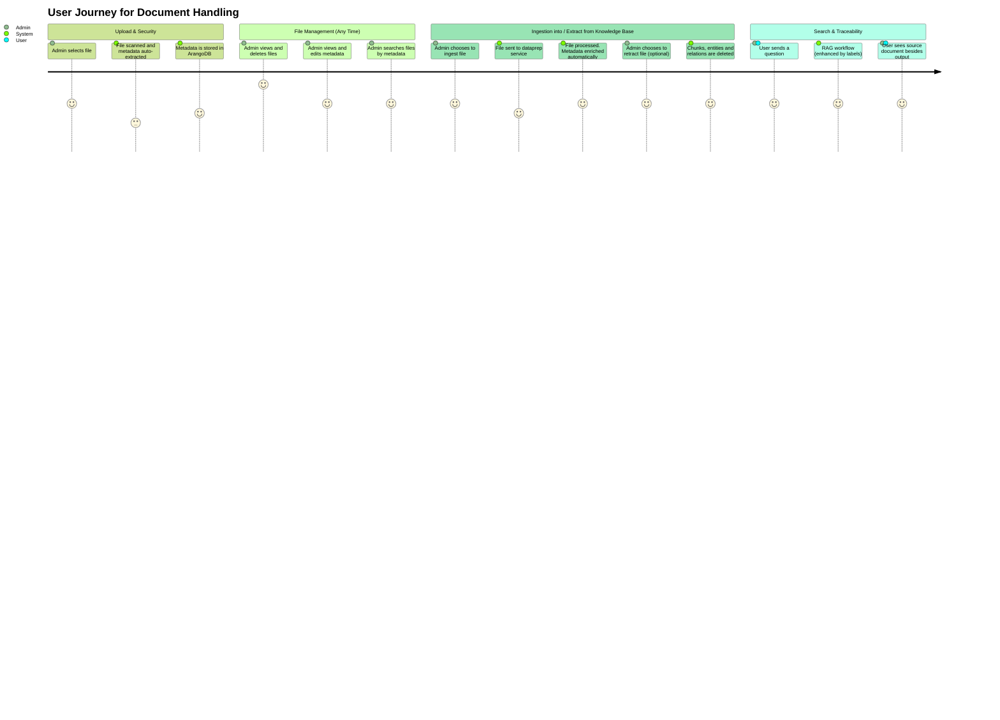
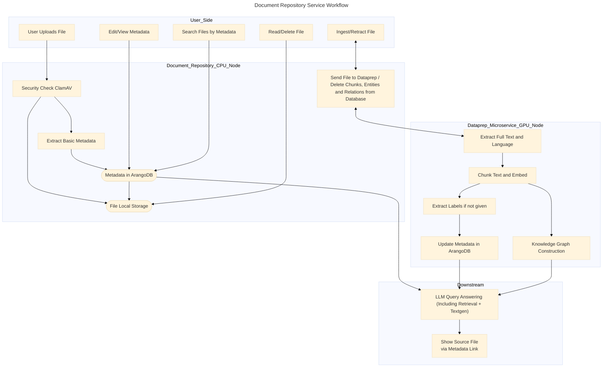

# Document Repository Service

This service provides a backend file system for managing file CRUD + search + ingest&extract operations. It is designed to connect with the frontend located at `/root/chat-ui-vue-app/gov-chat-frontend`.





## Supported File Types
The file system supports various file types, including but not limited to:
- Text files (`.txt`)
- Document files (`.pdf`, `.docx`, `.doc`, `.md`)
- Web files (`.html`)
- Sheet files (`.xls`, `.xlsx`)

## Feature Services

- **Upload Files:** Administrators can upload files from their local computers.
- **Read Files:** Uploaded files are stored in `/document-repository/uploads` and can be accessed for viewing in browser for all supported file types.
- **Download Files:** Files can be downloaded to the administrator's local machine.
- **Delete Files:** Administrators can remove files from the system.
- **Virus Scanning:** Files are scanned for viruses before being saved to the file system.
- **Metadata Extraction:** Metadata such as file labels and language is extracted and stored for search functionality. See [`README_metadata.md`](./README_metadata.md) for details.
- **Search Files:** Users can search files by metadata such as file name, type, and labels.
- **Ingest Files to Dataprep:** Files can be ingested into the dataprep microservice for further processing.
- **Retract Files from Dataprep:** Files can be retracted from the dataprep microservice.

## Folder Structure (to be updated)

```
document-repository/
├── src/
│   ├── controllers/              # Handles HTTP requests
│   │   ├── fileController.js
│   ├── routes/                   # Express routes
│   │   ├── fileRoutes.js
│   ├── services/                 # Business logic
│   │   ├── fileService.js
│   │   ├── securityService.js
│   │   ├── metadataService.js
│   │   ├── dataprepClient.js     # Handles HTTP calls to dataprep
│   ├── utils/                    # Helper functions
│   │   ├── fileUtils.js
│   │   ├── virusScanner.js       # Hooks to ClamAV or similar
│   │   ├── mimeTypes.js
│   ├── middlewares/             # Middleware for Express
│   │   ├── fileUpload.js         # Multer config
│   │   ├── errorHandler.js
│   ├── config/
│   │   ├── appConfig.js
│   │   ├── dataprepConfig.js
│   ├── app.js                    # Express app
│   ├── server.js                 # Entry point
├── uploads/                      # Stores uploaded files
├── tests/
│   ├── unit/
│   ├── integration/
├── Dockerfile
├── package.json
├── README.md
```

## Responsibilities

**document-repository responsibilities**:

| Feature                   | Responsibility                |
| ------------------------- | ----------------------------- |
| File upload               | ✔️                            |
| Virus scan                | ✔️ (`virusScanner.js`)        |
| Save to `/uploads` folder | ✔️                            |
| Read/view/download file   | ✔️                            |
| Metadata extraction *     | ✔️ (`metadataService.js`)     |
| Search by metadata        | ✔️                            |
| Delete file (from disk)   | ✔️                            |
| Ingest to dataprep        | ✅ via `dataprepClient.js`     |
| Retract from dataprep     | ✅ via `dataprepClient.js`     |

> ✅ Means this service initiates the action, but the dataprep microservice owns the actual data processing.
> Metadata extraction is done at both upload time and ingest time, allowing for quick user access and later semantic enrichment. In document-repository, the basic metadata is extracted and stored in the ArangoDB database, while the enrichment is handled by the dataprep microservice.

**Dataprep microservice responsibilities (related to document-repository)**:

* **Metadata extraction (especially for file labels and file language)**
* **Content safety checks**
* Text extraction from files
* Chunking
* Embedding
* Indexing & storing in DB
* ...

## Routes Overview

| Method | Route                       | Description                         |
| ------ | --------------------------- | ----------------------------------- |
| POST   | `/files/upload`             | Upload and validate file            |
| GET    | `/files/:filename`          | View file in browser                |
| GET    | `/files/download/:filename` | Download file                       |
| GET    | `/files/metadata/search`    | Search files by metadata            |
| POST   | `/files/ingest/:filename`   | Ingest file to dataprep             |
| DELETE | `/files/retract/:filename`  | Retract file from dataprep          |
| DELETE | `/files/:filename`          | Delete file (and retract if needed) |

## Setup (to be updated)

To set up the file system backend service:

1. **Navigate to the project directory:**
    ```bash
    cd document-repository
    ```

2. **Initialize the project:**
    ```bash
    npm init -y
    ```

3. **Install required dependencies:**
    ```bash
    npm install
    ```

4. **Run the service (in the background):**
    ```bash
    npm run dev
    ```

## Usage (to be updated)

Use the following `curl` commands to interact with the file system backend service. Replace `<remote-node-ip>` with the actual IP address of the remote node if you are accessing it remotely.

### Upload a File

**Request**

```bash
curl -X POST http://localhost:3000/api/files/upload \
  -F "file=@/Users/scarlettsun/Desktop/ITU/Urban Immunization Toolkit.pdf"
```

**Response**

```json
{"success":true,"message":"File uploaded successfully","data":{"id":"d5e6bd75-1061-4a82-b7db-451dece05661","originalName":"Urban Immunization Toolkit.pdf","mimeType":"application/pdf","size":2770818,"uploadedAt":"2025-06-11T11:19:03.898Z","category":"general","description":"","tags":[],"status":"uploaded"}}
```

---

### Read/Preview a File

Read a file from the backend server:
```bash
curl http://localhost:9981/api/files/read/1748524213244-962969549-AAA-testing.txt
```
Or simply open the URL in your browser to view the file.

---

### Download a File

Download from the backend server:
```bash
curl http://localhost:9981/api/files/1748521446956-129192260-AAA-testing.txt --output downloaded.txt
```

Download from the remote file system to your local computer:
```bash
curl http://<remote-node-ip>:9981/api/files/1748524213244-962969549-ExamplePDF.pdf --output /path/to/local/destination/<filename>
```

---

### Delete a File

Delete from the backend server:
```bash
curl -X DELETE http://localhost:9981/api/files/1748521446956-129192260-AAA-testing.txt
```

Delete from your local computer (remotely):
```bash
curl -X DELETE http://<remote-node-ip>:9981/api/files/1748524213244-962969549-ExamplePDF.pdf
```

## Security for Access Control

- Common users authenticated as citizens can only read files.
- Users authenticated as administrators can access all the file operations.
- File access is not restricted to intranet or localhost; remote access is supported.

## Notes

* For metadata-related operations, please see [`README_metadata.md`](./README_metadata.md) for more details.

## Extending

* Hybrid Upload/Ingest feature: Default to Manual Ingest, but Offer "Auto-Ingest" as a Setting

    By default, uploaded files are **not automatically ingested** into the knowledge base (via the dataprep microservice). This allows users to review or manage files before deciding to include them in retrieval-augmented generation (RAG) workflows. However, for convenience, an **optional auto-ingest setting** can be enabled to automatically push uploaded files to the knowledge base. This setting is configurable and ideal for trusted environments where immediate ingestion is preferred.

## License

SPDX-License-Identifier: Apache-2.0