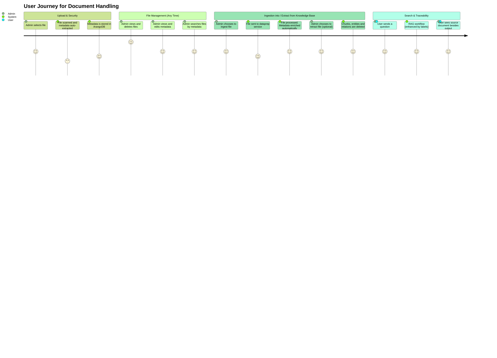

# Document Repository Service

This service provides a backend file system for managing file CRUD + search + ingest&extract operations. It is designed to connect with the frontend located at `/root/chat-ui-vue-app/gov-chat-frontend`.




## Supported File Types
The file system supports various file types, including but not limited to:
- Text files (`.txt`)
- Document files (`.pdf`, `.docx`, `.doc`, `.md`)
- Web files (`.html`)
- Sheet files (`.xls`, `.xlsx`)

## Feature Services

- **Upload Files:** Administrators can upload files from their local computers.
- **Read Files:** Uploaded files are stored in `/document-repository/uploads` and can be accessed for viewing in browser for all supported file types.
- **Download Files:** Files can be downloaded to the administrator's local machine.
- **Delete Files:** Administrators can remove files from the system.
- **Virus Scanning:** Files are scanned for viruses before being saved to the file system.
- **Metadata Extraction:** Metadata such as file labels and language is extracted and stored for search functionality. See [`README_metadata.md`](./README_metadata.md) for details.
- **Search Files:** Users can search files by metadata such as file name, type, and labels.
- **Ingest Files to Dataprep:** Files can be ingested into the dataprep microservice for further processing.
- **Retract Files from Dataprep:** Files can be retracted from the dataprep microservice.

## Folder Structure (to be updated)

```
document-repository/
├── src/
│   ├── controllers/              # Handles HTTP requests
│   │   ├── fileController.js
│   ├── routes/                   # Express routes
│   │   ├── fileRoutes.js
│   ├── services/                 # Business logic
│   │   ├── fileService.js
│   │   ├── securityService.js
│   │   ├── metadataService.js
│   │   ├── dataprepClient.js     # Handles HTTP calls to dataprep
│   ├── utils/                    # Helper functions
│   │   ├── fileUtils.js
│   │   ├── virusScanner.js       # Hooks to ClamAV or similar
│   │   ├── mimeTypes.js
│   ├── middlewares/             # Middleware for Express
│   │   ├── fileUpload.js         # Multer config
│   │   ├── errorHandler.js
│   ├── config/
│   │   ├── appConfig.js
│   │   ├── dataprepConfig.js
│   ├── app.js                    # Express app
│   ├── server.js                 # Entry point
├── uploads/                      # Stores uploaded files
├── tests/
│   ├── unit/
│   ├── integration/
├── Dockerfile
├── package.json
├── README.md
```

## Responsibilities

**document-repository responsibilities**:

| Feature                   | Responsibility                |
| ------------------------- | ----------------------------- |
| File upload               | ✔️                            |
| Virus scan                | ✔️ (`virusScanner.js`)        |
| Save to `/uploads` folder | ✔️                            |
| Read/view/download file   | ✔️                            |
| Metadata extraction *     | ✔️ (`metadataService.js`)     |
| Search by metadata        | ✔️                            |
| Delete file (from disk)   | ✔️                            |
| Ingest to dataprep        | ✅ via `dataprepClient.js`     |
| Retract from dataprep     | ✅ via `dataprepClient.js`     |

> ✅ Means this service initiates the action, but the dataprep microservice owns the actual data processing.
> Metadata extraction is done at both upload time and ingest time, allowing for quick user access and later semantic enrichment. In document-repository, the basic metadata is extracted and stored in the ArangoDB database, while the enrichment is handled by the dataprep microservice.

**Dataprep microservice responsibilities (related to document-repository)**:

* **Metadata extraction (especially for file labels and file language)**
* **Content safety checks**
* Text extraction from files
* Chunking
* Embedding
* Indexing & storing in DB
* ...

## Routes Overview (to be updated)

| Method | Route                       | Description                         |
| ------ | --------------------------- | ----------------------------------- |
| POST   | `/files/upload`             | Upload and validate file            |
| GET    | `/files/:filename`          | View file in browser                |
| GET    | `/files/download/:filename` | Download file                       |
| GET    | `/files/metadata/search`    | Search files by metadata            |
| POST   | `/files/ingest/:filename`   | Ingest file to dataprep             |
| DELETE | `/files/retract/:filename`  | Retract file from dataprep          |
| DELETE | `/files/:filename`          | Delete file (and retract if needed) |

## Setup (to be updated)

1. cd into the `document-repository` directory.
2. `docker compose build document-repository`
3. docker network create chatqna_default
3. `docker compose up arango-vector-db document-repository`
4. open arando web interface at http://localhost:8529
5. Create a database named `document_repository` in ArangoDB.
6. Create a collection named `files` in the `document_repository` database.
7. Change password for the `root` user in ArangoDB to `test` (or update the password in the config file accordingly).
8. change user permission for "document_repository" database to "administrate".


To set up the file system backend service:

1. **Navigate to the project directory:**
    ```bash
    cd document-repository
    ```

2. **Initialize the project:**
    ```bash
    npm init -y
    ```

3. **Install required dependencies:**
    ```bash
    npm install
    ```

4. **Run the service (in the background):**
    ```bash
    npm run dev
    ```

## Usage (to be updated)

Use the following `curl` commands to interact with the file system backend service. Replace `<remote-node-ip>` with the actual IP address of the remote node if you are accessing it remotely.

### Upload a File

**Request**

```bash
curl -X POST http://localhost:3000/api/files/upload \
  -F "file=@/Users/scarlettsun/Desktop/ITU/ExamplePDF.pdf"
```

**Response**

```json
{"success":true,
 "message":"File uploaded successfully",
 "data":{"file_id":"1750164284119-30f48760",
         "file_name":"ExamplePDF.pdf",
         "file_size":4577594,
         "file_type":"application/pdf",
         "storage_path":"/Users/scarlettsun/Desktop/ITU/genie-ai/components/document-repository/uploads/1750164284119-30f48760.pdf","file_hash":"65f7f55f1142a85eff2ee54896dbe531c6db38289a1dac9ded7594ca7f9a5892","labels":[],
         "crawl_date":null,
         "source_url":"",
         "language":"",
         "chunk_count":0,
         "dataprep":{"status":"pending",
                     "ingest_date":"",
                     "retract_date":""}}}
```

---

### Upload Multiple Files (max 5)

```bash
curl -X POST http://localhost:3000/api/files/uploads \
  -F "files=@/Users/scarlettsun/Desktop/ITU/txtai.txt" \
  -F "files=@/Users/scarlettsun/Desktop/ITU/Sample_criteria.xlsx" \
  -F "files=@/Users/scarlettsun/Desktop/ITU/EMBEDDING MODEL TESTS.docx" \
  -F "files=@/Users/scarlettsun/Desktop/ITU/pymupdf4llm_markdown.md" \
  -F "files=@/Users/scarlettsun/Desktop/ITU/ExamplePDF.pdf"
```

**Response**

```json
{"success":true,
 "message":"Files uploaded successfully",
 "data":[{"file_id":"1750164437466-b51fa7c5", "file_name":"txtai.txt", "file_size":210930, "file_type":"text/plain", "storage_path":"/Users/scarlettsun/Desktop/ITU/genie-ai/components/document-repository/uploads/1750164437466-b51fa7c5.txt","file_hash":"60a92fa3b2ce3bd8039702806ffdf65250ddfcab59cca1ed6cbd0f60cf23beff","labels":[], "crawl_date":null, "source_url":"","language":"","chunk_count":0, "dataprep":{"status":"pending","ingest_date":"","retract_date":""}},
         {"file_id":"1750164437466-1c31ed4c","file_name":"Sample_criteria.xlsx", "..."},{"file_id":"1750164437467-42b326a7", "..."},
         {"..."}]}
```

---

### View a File

**View a file in base64** (for future API integration)

```bash
curl http://localhost:3000/api/files/1750172535368-a0de31df/view
```

**Response**

```base64
IGl0LiBUaGlzIHdpbGwgZGVwZW5kIG9uIGhvdyB0aGUgCnRhb
```

**View a file in browser** (for supported file types. For example, PDF, HTML, etc. Files in other types will be downloaded instead.)

```
Open your browser and navigate to:

http://localhost:3000/api/files/1750172535368-a0de31df/viewbrowser
```

---

### Download a File

Download from the backend server:

```bash
curl http://localhost:3000/api/files/1750172521893-9274c986/download --output /Users/scarlettsun/Desktop/ITU/test-download-3.pdf
```

**Response**

```bash
  % Total    % Received % Xferd  Average Speed   Time    Time     Time  Current
                                 Dload  Upload   Total   Spent    Left  Speed
100 4470k  100 4470k    0     0   148M      0 --:--:-- --:--:-- --:--:--  174M
```

---

### Delete a File

Delete from the backend server:
```bash
curl -X DELETE http://localhost:3000/api/files/1750172521893-9274c986
```

**Response**

```json
{"success":true, "message":"File deleted successfully"}
```

---

### Delete Multiple Files

```bash
curl -X DELETE http://localhost:3000/api/files \
  -H "Content-Type: application/json" \
  -d '{"fileIds":["76d74b7c-b3e5-4162-b4ca-6ba09809515a", "1750163480096-19d9304a", "1750164437466-b51fa7c5"]}'
```

**Response**

```json
{"message":"Batch delete completed",
 "results":[{"fileId":"76d74b7c-b3e5-4162-b4ca-6ba09809515a",
             "success":false,
             "error":"File record not found in database: 76d74b7c-b3e5-4162-b4ca-6ba09809515a"},
            {"fileId":"1750163480096-19d9304a","success":true},{"fileId":"1750164437466-b51fa7c5","success":true}]}
```

---

### Get Files (by common metadata fields for simple, fast filtering)

💚 Default to return the first 10 files, sorted by `upload_date` in descending order.

```bash
curl "http://localhost:3000/api/files"
```

💚 Get files with pagination and limit:
```bash
curl "http://localhost:3000/api/files?page=2&limit=5"
```

💚 Get files by mimetype:
```bash
curl "http://localhost:3000/api/files?mimeType=application/pdf"
```

💚 Search by file name (case insensitive):
```bash
curl "http://localhost:3000/api/files?search=immunization"
```

💚 Filter by dataprep status:

```bash
curl "http://localhost:3000/api/files?dataprepStatus=pending"
```

💚 Combine filters (e.g., PDF files with 'example' in the name)

```bash
curl "http://localhost:3000/api/files?mimeType=application/pdf&search=example"
```

**Response (for the combine filters)**

```json
{"success":true,
 "message":"Files retrieved successfully",
 "data":[{"_key":"2665","_id":"files/2665","_rev":"_j1S7H16---","file_id":"1750018631535-79b1bc54","file_name":"ExamplePDF.pdf","file_size":4577594,"file_type":"application/pdf","file_path":"/app/uploads/1750018631535-79b1bc54.pdf","labels":[],"uploaded_date":"2025-06-15T20:17:11.545Z","created_date":"2025-06-15T20:17:11.536Z","crawl_date":null,"source_url":"","language":"","chunk_count":0,"dataprep":{"status":"pending","ingested_date":"","retracted_date":""}},
         {"_key":"3132","_id":"files/3132","_rev":"_j1TKMHO---","file_id":"1750019618934-ce1317a4","file_name":"ExamplePDF.pdf","file_size":4577594,"file_type":"application/pdf","file_path":"/app/uploads/1750019618934-ce1317a4.pdf","labels":[],"uploaded_date":"2025-06-15T20:33:38.961Z","created_date":"2025-06-15T20:33:38.936Z","crawl_date":null,"source_url":"","language":"","chunk_count":0,"dataprep":{"status":"pending","ingested_date":"","retracted_date":""}},
         {"_key":"3663","_id":"files/3663","_rev":"_j1TbepG---","file_id":"1750020752005-1ba26d2d","file_name":"ExamplePDF.pdf","file_size":4577594,"file_type":"application/pdf","file_path":"/app/uploads/1750020752005-1ba26d2d.pdf","labels":[],"uploaded_date":"2025-06-15T20:52:32.048Z","created_date":"1970-01-01T00:00:00.000Z","crawl_date":null,"source_url":"","language":"","chunk_count":0,"dataprep":{"status":"pending","ingested_date":"","retracted_date":""}}]
 "pagination":{"currentPage":1,
               "totalPages":3,
               "totalFiles":28,
               "limit":10}}
```

---

### Search Files by Filtering Metadata

```bash
curl "http://localhost:3000/api/files/search?file_name=immunization&file_type=application/pdf"
```

---

## Security for Access Control

- Common users authenticated as citizens can only read files.
- Users authenticated as administrators can access all the file operations.
- File access is not restricted to intranet or localhost; remote access is supported.

## Notes

* For metadata-related operations, please see [`README_metadata.md`](./README_metadata.md) for more details.

## Extending

* Hybrid Upload/Ingest feature: Default to Manual Ingest, but Offer "Auto-Ingest" as a Setting

    By default, uploaded files are **not automatically ingested** into the knowledge base (via the dataprep microservice). This allows users to review or manage files before deciding to include them in retrieval-augmented generation (RAG) workflows. However, for convenience, an **optional auto-ingest setting** can be enabled to automatically push uploaded files to the knowledge base. This setting is configurable and ideal for trusted environments where immediate ingestion is preferred.

## License

SPDX-License-Identifier: Apache-2.0