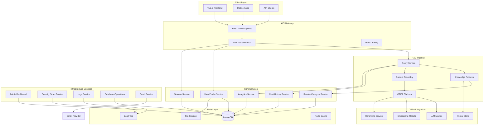
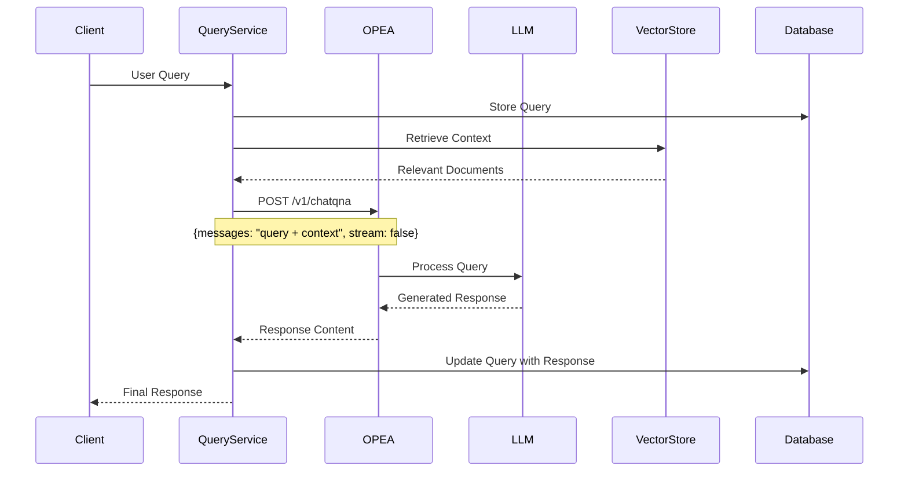
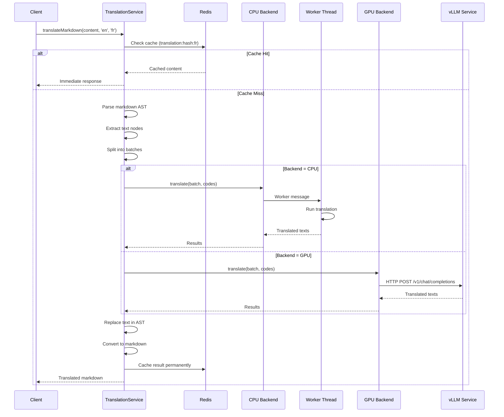
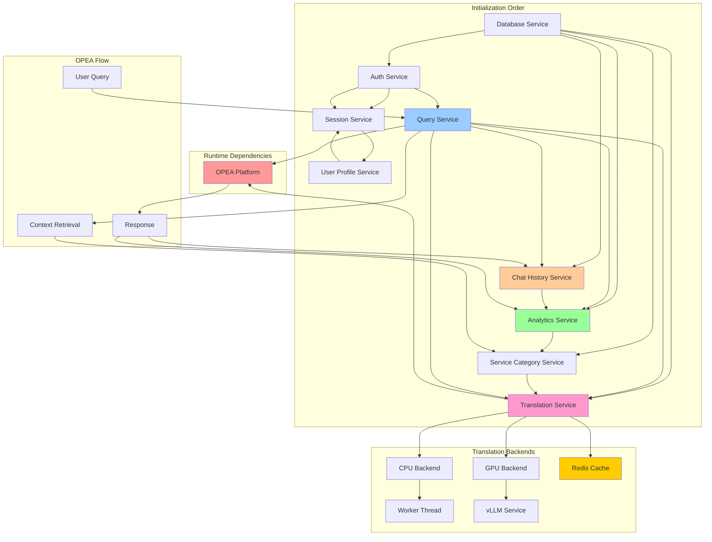
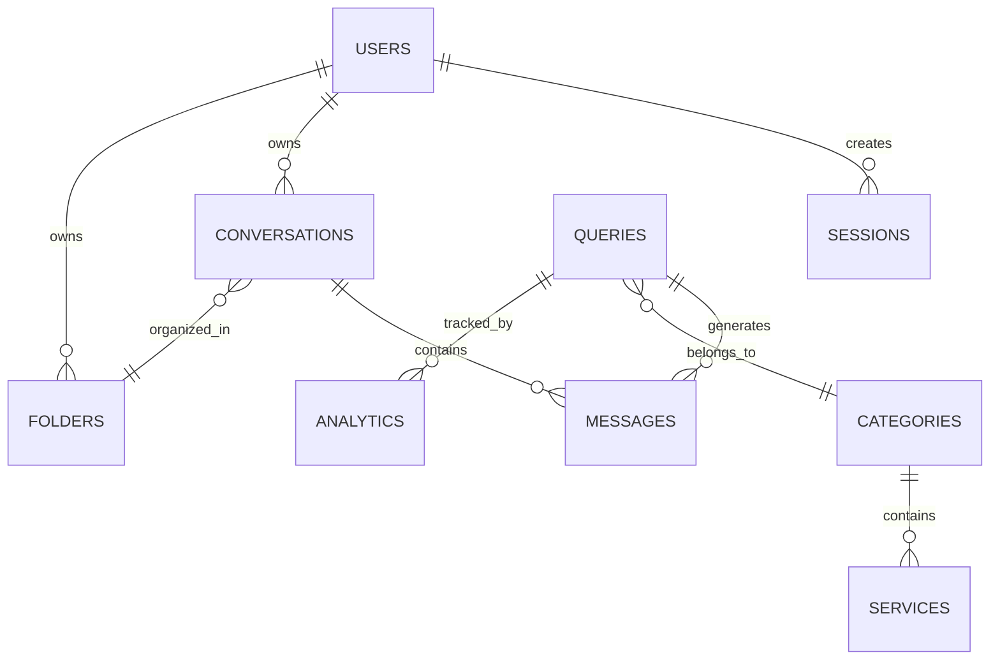
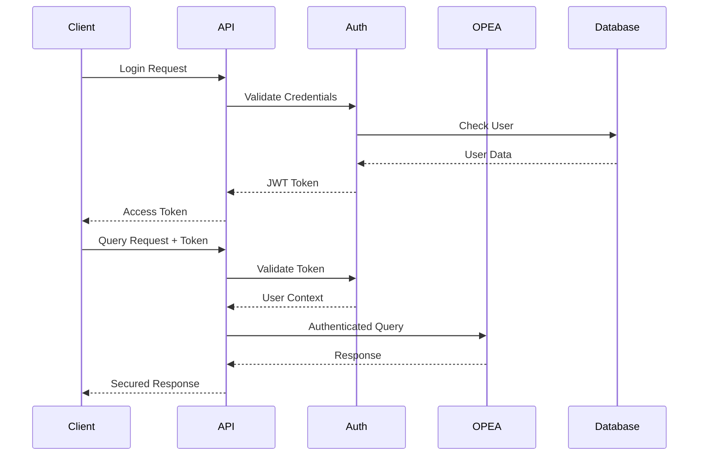

# GENIE.AI - RAG Chatbot Framework Backend

This repository contains the backend services that power the GENIE.AI RAG (Retrieval-Augmented Generation) chatbot framework. GENIE.AI is a comprehensive enterprise chatbot platform that leverages OPEA (Open Platform for Enterprise AI) for LLM hosting and access, providing intelligent conversational AI capabilities with advanced user management, analytics, and administrative tools.

## Table of Contents

- [Overview](#overview)
- [System Architecture](#system-architecture)
- [OPEA Integration](#opea-integration)
- [Service Architecture](#service-architecture)
- [Core Services](#core-services)
- [Service Dependencies](#service-dependencies)
- [Database Schema](#database-schema)
- [Security System](#security-system)
- [API Layer](#api-layer)
- [Setup and Configuration](#setup-and-configuration)
- [Development](#development)
- [Deployment](#deployment)
- [Security Considerations](#security-considerations)

## Overview

GENIE.AI is designed as a microservices-based RAG chatbot framework that provides:

- **RAG-Powered Conversations**: Intelligent responses using OPEA's LLM hosting platform
- **Knowledge Base Management**: Service categorization and retrieval for context-aware responses
- **Conversation Management**: Persistent chat history with folder organization and threading
- **Advanced Analytics**: Real-time monitoring of chatbot performance and user interactions
- **Multi-language Support**: Internationalized responses and content management
- **Enterprise Features**: User management, security scanning, and administrative dashboards

## System Architecture



## OPEA Integration

GENIE.AI leverages OPEA (Open Platform for Enterprise AI) as the core AI engine for LLM processing. OPEA provides a comprehensive platform for hosting and accessing Large Language Models.

### OPEA Architecture Integration



### OPEA Configuration

```yaml
# OPEA Service Configuration
OPEA_HOST: "e2e-109-198"  # OPEA server hostname
OPEA_PORT: "8888"         # OPEA service port
OPEA_ENDPOINT: "/v1/chatqna"  # ChatQNA endpoint
```

### OPEA Request Flow

1. **Query Processing**: User queries are received by the Query Service
2. **Context Retrieval**: Relevant knowledge is retrieved from the vector store
3. **Context Assembly**: Query and context are combined into a prompt
4. **OPEA Request**: POST request to OPEA's ChatQNA endpoint
5. **LLM Processing**: OPEA routes to appropriate LLM models
6. **Response Generation**: LLM generates contextual response
7. **Response Delivery**: Formatted response returned to client

## Service Architecture

### Service Types Classification

#### Singleton Services (Stateful)
**Pattern**: Single instance per application with internal state management
**Lifecycle**: Application-scoped, initialized once

| Service | Type | State Management | OPEA Integration |
|---------|------|------------------|------------------|
| **Query Service** | Singleton | Maintains connections to Analytics and ChatHistory | Direct OPEA API calls |
| **Analytics Service** | Singleton | Caches aggregated data, ServiceCategory reference | Tracks OPEA response metrics |
| **Chat History Service** | Singleton | Conversation state, analytics dependency | Stores OPEA responses |
| **Session Service** | Singleton | Active sessions, expiration timers | Session-based OPEA context |
| **User Profile Service** | Singleton | File upload state, session dependency | User-specific OPEA preferences |
| **Service Category Service** | Singleton | Translation cache, category hierarchy | Knowledge base for OPEA context |
| **Auth Service** | Singleton | Token validation state, session dependency | Secure OPEA access |
| **Translation Service** | Singleton | Backend selection, Redis cache, worker threads | Multi-language OPEA support |

#### Utility Services (Stateless)
**Pattern**: Functional services with minimal internal state

| Service | Type | Configuration | OPEA Role |
|---------|------|---------------|-----------|
| **Email Service** | Stateless | SMTP configuration | Notification delivery |
| **Weather Service** | Stateless | API keys, location cache | External data augmentation |
| **Logs Service** | Stateless | File system paths | OPEA interaction logging |
| **CPU Translation Backend** | Stateless | Model ID, thread/batch config | CPU-based translation worker |
| **GPU Translation Backend** | Stateless | vLLM endpoint, model ID | GPU-based translation service |

#### Administrative Services (Hybrid)
**Pattern**: Combination of stateless operations with caching

| Service | Type | State Management | OPEA Monitoring |
|---------|------|------------------|-----------------|
| **Admin Dashboard Service** | Hybrid | Resource usage cache | OPEA performance metrics |
| **Security Scan Service** | Hybrid | Scan result cache | OPEA security analysis |
| **Database Operations Service** | Hybrid | Backup state | OPEA data management |

## Core Services

### Translation Service
**File**: `translation-service.js`
**Type**: Singleton Service
**Multi-language Support**: CPU and GPU backends with Redis caching

The Translation Service provides comprehensive language translation capabilities with flexible backend selection:

- **Pluggable Backend Architecture**: Choose between CPU and GPU translation backends
- **Auto-Fallback Mode**: Automatically falls back from GPU to CPU on failures
- **Redis Caching**: Permanent caching of translated markdown content
- **Markdown Preservation**: Translates content while preserving markdown structure
- **Worker Thread Support**: CPU backend uses worker threads to prevent blocking
- **Language Maps**: Modular language mapping supporting multiple translation models
- **In-Flight Tracking**: Prevents duplicate translation requests
- **34+ Languages**: Support for expanded language set including Mandinka and Sesotho

#### Backend Architecture

**CPU Backend** (`translation/cpu-translate-backend.js`):
- Uses `@xenova/transformers` for local ML translation
- Supports NLLB-200 model by default (configurable via `.env`)
- Runs in dedicated worker thread to prevent main thread blocking
- Configurable thread count and batch processing
- Ideal for development and low-volume translation needs

**GPU Backend** (`translation/gpu-translate-backend.js`):
- Uses vLLM translation guardrail service for GPU-accelerated translation
- Supports TranslateGemma and Gemma-3 models (configurable via `.env`)
- Faster translation for high-volume scenarios
- Requires vLLM service deployment
- Automatic health checking on initialization

#### Configuration

Environment variables for translation service:

```bash
# Backend Selection
TRANSLATION_BACKEND=cpu|gpu|auto  # Default: auto

# CPU Backend Configuration
TRANSLATION_CPU_MODEL_ID=Xenova/nllb-200-distilled-600M
TRANSLATION_THREADS=4              # Number of worker threads
TRANSLATION_BATCHES=5              # Number of parallel batches

# GPU Backend Configuration
VLLM_TRANSLATION_MODEL_ID=google/gemma-3-4b-it
VLLM_TRANSLATION_ENDPOINT=http://vllm-translation-guardrail:9031
VLLM_TRANSLATION_SERVICE_PORT=9031

# Redis Caching
TRANSLATION_CACHE=on|off           # Enable Redis caching
TRANSLATION_CACHE_HOST=localhost
TRANSLATION_CACHE_PORT=6379
TRANSLATION_CACHE_PASSWORD=optional
```

#### Language Support

The translation service supports 34+ languages through modular language maps:

**Supported Languages**:
- Original 11: English, Arabic, Thai, Chinese, German, French, Indonesian, Spanish, Russian, Portuguese, Swahili
- Newly Added (23): Amharic, Azerbaijani, Bengali, Persian, Fulah, Hausa, Javanese, Kazakh, Kurdish, Malayalam, Malay, Oromo, Punjabi, Pashto, Sindhi, Saraiki, Somali, Sundanese, Turkish, Uyghur, Urdu, Uzbek, Yoruba, Sorani Kurdish
- Latest Additions (2): Mandinka, Sesotho

**Language Maps**:
- `translation/language-maps/nllb-200-map.js`: NLLB-200 model (FLORES-200 codes)
- `translation/language-maps/gemma-3-map.js`: Gemma-3 model (ISO 639-1 codes)
- `translation/language-maps/translategemma-map.js`: TranslateGemma model (ISO 639-1 codes)

Each language map includes:
- Language code mappings (ISO to model-specific)
- Fallback chains for graceful degradation
- Model-specific prompt templates
- Language names for prompt generation

#### Key Features

**1. Markdown Translation**:
```javascript
// Translate entire markdown documents while preserving structure
const translated = await translationService.translateMarkdown(
  markdownContent,
  'en',
  'fr'
);
```

**2. Batch Text Translation**:
```javascript
// Translate arrays of text with controlled concurrency
const translated = await translationService.translate(
  ['Hello', 'World'],
  'en',
  'es'
);
```

**3. Redis Caching**:
- Cache keys: `translation:<md5_hash>:<locale>`
- Permanent storage (no expiration)
- Automatic cache hits/misses logging
- Graceful degradation if Redis is unavailable

**4. In-Flight Tracking**:
- Prevents duplicate translation requests
- Tracks pending translations by document hash and language
- Automatic cleanup on completion/failure
- 1-hour timeout for large documents

**5. Worker Thread Architecture** (CPU Backend):
- Model loading happens in worker thread
- Main thread remains responsive during translation
- Message-based communication between threads
- Graceful worker termination on shutdown

**6. Auto-Fallback** (Auto Mode):
- Tries GPU backend first for performance
- Falls back to CPU on GPU failures
- Continues operation without service interruption
- Logs fallback events for monitoring

#### CPU Translation Worker

**File**: `translation/cpu-translation-worker.js`

Runs in a separate worker thread to handle CPU-intensive translation:

- **Initialization**: Loads translation model in worker thread
- **Message Handling**: Processes translation requests from main thread
- **Error Handling**: Graceful error reporting back to main thread
- **Resource Management**: Proper cleanup on termination

Worker thread lifecycle:
```javascript
// Main thread spawns worker
this.worker = new Worker(workerPath, {
  workerData: { modelId, threads }
});

// Send init message
this.worker.postMessage({ type: 'init' });

// Send translation request
this.worker.postMessage({
  type: 'translate',
  data: { messageId, texts, sourceCode, targetCode }
});
```

#### Language Map Structure

Example language map format:

```javascript
module.exports = {
  modelName: 'nllb-200-distilled-600M',
  modelType: 'nllb',
  codeFormat: 'FLORES-200',

  // ISO 639-1 to model-specific codes
  languageMap: {
    en: 'eng_Latn',
    fr: 'fra_Latn',
    // ...
  },

  // Fallback chains for graceful degradation
  fallbackMap: {
    bn: 'en',  // Bengali to English
    st: 'en',  // Sesotho to English
    // ...
  },

  // Optional prompt template for LLM-based models
  promptTemplate: (sourceCode, targetCode, sourceLangName, targetLangName, text) => {
    return `Translate from ${sourceLangName} to ${targetLangName}: ${text}`;
  },

  // Language names for prompt generation
  languageNames: {
    en: 'English',
    fr: 'French',
    // ...
  }
};
```

#### Usage Examples

**Basic Translation**:
```javascript
// Initialize service
await translationService.init();

// Translate texts
const translated = await translationService.translate(
  ['Hello world', 'How are you?'],
  'en',
  'fr'
);
// Returns: ['Bonjour le monde', 'Comment allez-vous?']
```

**Markdown Translation with Caching**:
```javascript
const markdown = `# Hello World\n\nThis is a test.`;
const translated = await translationService.translateMarkdown(
  markdown,
  'en',
  'de'
);
// Returns: '# Hallo Welt\n\nDies ist ein Test.'
```

**Get Backend Information**:
```javascript
const info = translationService.getBackendInfo();
// Returns: { type: 'cpu', model: 'Xenova/nllb-200-distilled-600M', ... }
```

**Get Supported Languages**:
```javascript
const languages = translationService.getSupportedLanguages();
// Returns: { en: 'eng_Latn', fr: 'fra_Latn', ... }
```

#### Performance Considerations

**CPU Backend**:
- Model loading: 2-20 minutes on first startup (cached afterward)
- Translation speed: ~1-5 sentences per second (depends on hardware)
- Thread count: Scale with CPU cores (default: 4)
- Memory usage: ~2-4 GB for NLLB-200 model

**GPU Backend**:
- Model loading: Handled by vLLM service
- Translation speed: ~10-50 sentences per second
- Requires GPU with sufficient VRAM
- Network latency to vLLM service

**Caching Strategy**:
- Permanent caching for translated markdown
- Cache hits return immediately
- Cache misses trigger full translation
- In-flight tracking prevents duplicate work

### Query Service
**File**: `query-service.js`
**Type**: Singleton Service
**OPEA Integration**: Primary interface to OPEA ChatQNA service

The Query Service is the core component handling RAG conversations:

- **OPEA Communication**: Direct integration with OPEA's ChatQNA endpoint
- **Context Management**: Assembles user queries with retrieved knowledge
- **Response Processing**: Handles OPEA responses and stores conversation history
- **Analytics Integration**: Records query metrics and response times

Key OPEA interactions:
```javascript
// OPEA API Call
const opeaUrl = `http://${opeaHost}:${opeaPort}/v1/chatqna`;
const opeaPayload = {
  messages: queryData.text,  // User query + context
  stream: false
};
const opeaResponse = await axios.post(opeaUrl, opeaPayload);
const responseContent = opeaResponse.data.choices[0].message.content;
```

Functions:
- `createQuery`: Creates query and calls OPEA for response
- `addFeedback`: Records user feedback on OPEA responses
- `setQueryCategory`: Categorizes queries for context retrieval
- `getSimilarQueries`: Finds related queries for context

### Analytics Service
**File**: `analytics-service.js`
**Type**: Singleton Service
**OPEA Integration**: Monitors OPEA performance and usage

Tracks and analyzes chatbot interactions:

- **OPEA Metrics**: Response times, success rates, token usage
- **Conversation Analytics**: User engagement, satisfaction scores
- **Performance Monitoring**: OPEA service health and availability
- **Usage Trends**: Query patterns and knowledge base effectiveness

Key functions:
- `recordQuery`: Records OPEA query attempts and results
- `recordFeedback`: Tracks user satisfaction with OPEA responses
- `getDashboardAnalytics`: OPEA performance dashboard data
- `getTimeSeriesData`: OPEA usage trends over time

### Chat History Service
**File**: `chat-history-service.js`
**Type**: Singleton Service
**OPEA Integration**: Manages conversation persistence

Manages persistent conversations and folder organization:

- **Conversation Threads**: Multi-turn conversations with OPEA
- **Message Linking**: Links OPEA responses to original queries
- **Folder Organization**: Hierarchical conversation management
- **Context Persistence**: Maintains conversation context for OPEA

Key functions:
- `createConversation`: Starts new conversation thread
- `addMessage`: Adds OPEA responses to conversations
- `linkQueryToConversation`: Links OPEA responses to queries
- `createConversationFromQuery`: Converts standalone queries to conversations

### Service Category Service
**File**: `service-category-service.js`
**Type**: Singleton Service
**OPEA Integration**: Knowledge base management for RAG

Manages the knowledge base structure for context retrieval:

- **Category Hierarchy**: Organizes knowledge for efficient retrieval
- **Multi-language Support**: Localized knowledge categories
- **Context Mapping**: Maps user queries to relevant knowledge areas
- **RAG Enhancement**: Provides structured context for OPEA queries

Key functions:
- `getAllCategoriesWithServices`: Retrieval knowledge structure
- `searchCategoriesAndServices`: Context-aware knowledge search
- `upsertCategories`: Manages knowledge base updates

### User Profile Service
**File**: `user-profile-service.js`
**Type**: Singleton Service
**OPEA Integration**: User-specific OPEA preferences

Manages user accounts and personalization:

- **Profile Management**: User information and preferences
- **OPEA Personalization**: User-specific conversation context
- **File Handling**: Document uploads for RAG context
- **Session Integration**: Links users to conversation sessions

### Session Service
**File**: `session-service.js`
**Type**: Singleton Service
**OPEA Integration**: Session-based conversation context

Manages user sessions and conversation state:

- **Session Persistence**: Maintains conversation context across interactions
- **OPEA Context**: Provides session-based context to OPEA
- **Expiration Management**: Handles session timeouts
- **Multi-device Support**: Cross-device conversation continuity

### Auth Service
**File**: `auth-service.js`
**Type**: Singleton Service
**OPEA Integration**: Secure access to OPEA services

Handles authentication and authorization:

- **JWT Management**: Token-based authentication
- **OPEA Security**: Secure access to OPEA endpoints
- **Password Management**: User credential handling
- **Email Verification**: Account verification workflows

## Translation Service Architecture

### Workflow Diagram



### Language Map System

The translation service uses a modular language map system to support multiple translation models:

**Purpose**:
- Maps ISO 639-1 language codes to model-specific codes
- Provides fallback chains for graceful degradation
- Contains model-specific prompt templates
- Defines language names for prompt generation

**Adding New Languages**:

1. **Add ISO Code to Language Map**:
   ```javascript
   // translation/language-maps/nllb-200-map.js
   languageMap: {
     // Existing languages...
     xx: 'xxx_Latn',  // Add new language
   }
   ```

2. **Add Fallback Chain** (optional):
   ```javascript
   fallbackMap: {
     // Existing fallbacks...
     xx: 'en',  // Fallback to English
   }
   ```

3. **Add Language Name** (for LLM-based models):
   ```javascript
   // translation/language-maps/gemma-3-map.js
   languageNames: {
     // Existing names...
     xx: 'Language Name',
   }
   ```

4. **Create New Language Map** (for new model):
   ```javascript
   // translation/language-maps/new-model-map.js
   module.exports = {
     modelName: 'new-model-name',
     modelType: 'model-type',
     codeFormat: 'ISO-639-1' | 'FLORES-200' | 'custom',
     languageMap: { /* ... */ },
     fallbackMap: { /* ... */ },
     promptTemplate: (srcCode, tgtCode, srcName, tgtName, text) => {
       return `Prompt template here: ${text}`;
     },
     languageNames: { /* ... */ }
   };
   ```

5. **Register Language Map** (in backend):
   ```javascript
   // cpu-translate-backend.js or gpu-translate-backend.js
   loadLanguageMap(modelId) {
     const modelToMap = {
       'existing-model': './language-maps/existing-map.js',
       'new-model': './language-maps/new-model-map.js',
     };
     // ... loading logic
   }
   ```

### Translation Service Flows

#### 1. Markdown Translation Flow

```javascript
// 1. Parse markdown into AST
const tree = processor.parse(markdownContent);

// 2. Extract all text nodes
const textNodes = [];
visit(tree, 'text', (node) => textNodes.push(node));

// 3. Split into parallel batches
const batchSize = Math.ceil(textNodes.length / numParallelBatches);
const batches = [];
for (let i = 0; i < texts.length; i += batchSize) {
  batches.push(texts.slice(i, i + batchSize));
}

// 4. Translate batches in parallel
const translatedBatches = await Promise.all(
  batches.map(batch => this.translate(batch, sourceLang, targetLang))
);

// 5. Replace text in AST
textNodes.forEach((node, index) => {
  node.value = translatedTexts[index];
});

// 6. Convert back to markdown
const translatedMarkdown = processor.stringify(tree);
```

#### 2. Backend Selection Flow

```javascript
async selectBackend() {
  if (translationBackend === 'gpu') {
    this.backend = new GpuTranslateBackend();
    await this.backend.init();
    return this.backend;
  }

  if (translationBackend === 'cpu') {
    this.backend = new CpuTranslateBackend();
    await this.backend.init();
    return this.backend;
  }

  if (translationBackend === 'auto') {
    try {
      this.backend = new GpuTranslateBackend();
      await this.backend.init();
      return this.backend;
    } catch (gpuError) {
      this.backend = new CpuTranslateBackend();
      await this.backend.init();
      return this.backend;
    }
  }
}
```

#### 3. Cache Management Flow

```javascript
// Check cache
const cacheKey = `translation:${md5(content)}:${targetLang}`;
const cached = await redis.get(cacheKey);
if (cached) return cached;

// Check in-flight translations
if (inFlightTranslations.has(inFlightKey)) {
  return await inFlightTranslations.get(inFlightKey);
}

// Perform translation
const promise = performTranslation();
inFlightTranslations.set(inFlightKey, promise);

// Cache result
const result = await promise;
await redis.set(cacheKey, result);  // Permanent cache
inFlightTranslations.delete(inFlightKey);

return result;
```

### Performance Optimization

**1. Worker Thread Architecture** (CPU Backend):
- Prevents main thread blocking during translation
- Allows concurrent request handling
- Graceful worker termination on shutdown

**2. Parallel Batch Processing**:
- Splits large texts into configurable batches
- Processes batches in parallel for faster translation
- Configurable batch size and thread count

**3. Redis Caching**:
- Permanent caching of translated markdown
- Instant response for cached content
- Reduces backend load significantly

**4. In-Flight Tracking**:
- Prevents duplicate translation requests
- Multiple concurrent requests wait for single translation
- Automatic cleanup on completion/failure

**5. Auto-Fallback**:
- Tries GPU first for performance
- Falls back to CPU on failures
- Continuous operation without interruption

## Service Dependencies



### Dependency Injection Pattern

Services use setter injection for loose coupling:

```javascript
// Analytics Service Dependencies
analyticsService.setServiceCategoryService(serviceCategoryService);

// Query Service Dependencies
queryService.setAnalyticsService(analyticsService);
queryService.setChatHistoryService(chatHistoryService);
queryService.setTranslationService(translationService);

// User Profile Service Dependencies
userProfileService.setSessionService(sessionService);

// Auth Service Dependencies
authService.setSessionService(sessionService);

// Chat History Service Dependencies
chatHistoryService.setAnalyticsService(analyticsService);

// Translation Service Dependencies (optional)
translationService.setServiceCategoryService(serviceCategoryService);
```

### Translation Service Integration

The Translation Service integrates with multiple components:

**1. Query Service Integration**:
- Translates user queries to English for OPEA processing
- Translates OPEA responses back to user's language
- Preserves conversation context across languages

**2. Service Category Service Integration**:
- Translates knowledge categories for UI display
- Translates service names and descriptions
- Provides language-aware context for RAG

**3. Redis Cache Integration**:
- Caches translated markdown content permanently
- Improves performance for repeated translations
- Reduces load on translation backends

**4. Backend Selection Logic**:
```javascript
// Auto mode: Try GPU first, fallback to CPU
if (translationBackend === 'auto') {
  try {
    this.backend = new GpuTranslateBackend();
    await this.backend.init();
  } catch (gpuError) {
    this.backend = new CpuTranslateBackend();
    await this.backend.init();
  }
}
```

### OPEA Integration Dependencies

```javascript
// OPEA Configuration Dependencies
const opeaHost = process.env.OPEA_HOST || 'e2e-109-198';
const opeaPort = process.env.OPEA_PORT || '8888';
const opeaUrl = `http://${opeaHost}:${opeaPort}/v1/chatqna`;

// Service Dependencies for OPEA Context
queryService.setAnalyticsService(analyticsService);  // For metrics
queryService.setChatHistoryService(chatHistoryService);  // For conversation context
```

## Database Schema

The system uses ArangoDB, a multi-model database supporting documents and graphs:

### Core Collections

#### RAG-Specific Collections
- `queries`: User queries and OPEA responses
- `conversations`: Multi-turn conversation threads
- `messages`: Individual messages in conversations
- `queryMessages`: Links between queries and conversation messages

#### Knowledge Base Collections
- `serviceCategories`: Knowledge categories for RAG context
- `services`: Specific knowledge items within categories
- `categoryServices`: Relationships between categories and services
- `serviceCategoryTranslations`: Multi-language support
- `serviceTranslations`: Localized service descriptions

#### User Management Collections
- `users`: User profiles and authentication data
- `sessions`: Active user sessions
- `userSessions`: User-session relationships
- `userConversations`: User-conversation ownership

#### Conversation Organization
- `folders`: Conversation folder structure
- `folderConversations`: Folder-conversation relationships
- `userFolders`: User folder permissions

#### Analytics Collections
- `analytics`: Query and response metrics
- `events`: System events and user interactions

### Graph Relationships



## Security System

### Authentication Flow



### Security Features

#### Authentication & Authorization
- **JWT Tokens**: Stateless authentication with refresh tokens
- **Session Management**: Server-side session tracking
- **Role-Based Access**: User roles and permissions
- **OPEA Security**: Authenticated access to OPEA services

#### Security Monitoring
- **Real-time Scanning**: Continuous security threat detection
- **Log Analysis**: Automated log parsing for security events
- **Vulnerability Detection**: Pattern-based threat identification
- **OPEA Access Control**: Secure API access to OPEA endpoints

#### Data Protection
- **Authentication**: Keycloak OIDC with token passthrough architecture
- **Token Security**: JWT validation via JWKS (RS256)
- **File Upload Security**: Validated file uploads
- **Database Security**: Parameterized queries and access controls

## API Layer

### Base Configuration

```javascript
// API Configuration (api.js)
const api = axios.create({
  baseURL: process.env.VUE_APP_API_URL || '/api',
  timeout: 30000,
  headers: {
    'Content-Type': 'application/json',
    'Accept': 'application/json'
  }
});
```

### OPEA Integration Endpoints

#### Query Processing
- `POST /api/queries` - Submit query to OPEA
- `GET /api/queries/:id` - Get query and OPEA response
- `POST /api/queries/:id/feedback` - Rate OPEA response

#### Conversation Management
- `GET /api/conversations` - List user conversations
- `POST /api/conversations` - Create new conversation thread
- `GET /api/conversations/:id` - Get conversation with OPEA responses
- `POST /api/conversations/:id/messages` - Add message to conversation

#### Knowledge Base
- `GET /api/categories` - Get knowledge categories for RAG
- `POST /api/categories/search` - Search knowledge base
- `GET /api/categories/:id/services` - Get category services

## Setup and Configuration

### Prerequisites

- Node.js 16+
- ArangoDB 3.9+
- OPEA Platform deployment
- Redis (optional, for caching)

### Environment Variables

```bash
# Database Configuration
ARANGO_URL=http://localhost:8529
ARANGO_DB=genie-ai
ARANGO_USERNAME=root
ARANGO_PASSWORD=password

# OPEA Configuration
OPEA_HOST=e2e-109-198
OPEA_PORT=8888
OPEA_ENDPOINT=/v1/chatqna

# Translation Service Configuration
TRANSLATION_BACKEND=cpu|gpu|auto
TRANSLATION_CPU_MODEL_ID=Xenova/nllb-200-distilled-600M
TRANSLATION_THREADS=4
TRANSLATION_BATCHES=5
VLLM_TRANSLATION_MODEL_ID=google/gemma-3-4b-it
VLLM_TRANSLATION_ENDPOINT=http://vllm-translation-guardrail:9031
VLLM_TRANSLATION_SERVICE_PORT=9031

# Translation Cache Configuration
TRANSLATION_CACHE=on|off
TRANSLATION_CACHE_HOST=localhost
TRANSLATION_CACHE_PORT=6379
TRANSLATION_CACHE_PASSWORD=optional

# Authentication
SESSION_EXPIRATION_TIME=1800000

# Email Configuration
EMAIL_HOST=smtp.mailjet.com
EMAIL_PORT=587
EMAIL_USER=your-api-key
EMAIL_PASSWORD=your-secret-key
EMAIL_FROM=noreply@genie.ai

# File Upload
UPLOAD_DIR=/app/uploads

# Logging
LOG_LEVEL=info
LOG_DIR=/app/logs
```

### OPEA Platform Setup

1. **Deploy OPEA Platform**:
   ```bash
   # Follow OPEA documentation at https://opea.dev
   docker run -d --name opea-platform \
     -p 8888:8888 \
     opea/chatqna:latest
   ```

2. **Configure OPEA Connection**:
   ```bash
   export OPEA_HOST=your-opea-host
   export OPEA_PORT=8888
   ```

3. **Test OPEA Connection**:
   ```bash
   curl -X POST http://your-opea-host:8888/v1/chatqna \
     -H "Content-Type: application/json" \
     -d '{"messages": "Hello", "stream": false}'
   ```

### Installation

1. **Clone Repository**:
   ```bash
   git clone https://github.com/your-org/genie-ai-backend.git
   cd genie-ai-backend
   ```

2. **Install Dependencies**:
   ```bash
   npm install
   ```

3. **Initialize Database**:
   ```bash
   npm run init-db
   ```

4. **Start Services**:
   ```bash
   npm start
   ```

### Service Initialization Order

```javascript
// Proper initialization sequence
async function initializeServices() {
  // 1. Database connection
  await dbService.init();
  
  // 2. Core authentication
  await authService.init();
  
  // 3. Session management
  await sessionService.init();
  
  // 4. Knowledge base
  await serviceCategoryService.init();
  
  // 5. User management
  await userProfileService.init();
  
  // 6. Query processing (OPEA integration)
  await queryService.init();
  
  // 7. Analytics and monitoring
  await analyticsService.init();
  await chatHistoryService.init();
  
  // 8. Infrastructure services
  await adminDashboardService.init();
  await logsService.init();
  
  // 9. Set up dependencies
  authService.setSessionService(sessionService);
  userProfileService.setSessionService(sessionService);
  queryService.setAnalyticsService(analyticsService);
  queryService.setChatHistoryService(chatHistoryService);
  chatHistoryService.setAnalyticsService(analyticsService);
  analyticsService.setServiceCategoryService(serviceCategoryService);
}
```

## Development

### Adding New Services

1. **Create Service File**:
   ```javascript
   // new-service.js
   class NewService {
     constructor() {
       this.initialized = false;
     }

     async init() {
       // Initialize service
       this.initialized = true;
     }
   }

   module.exports = new NewService();
   ```

2. **Add OPEA Integration** (if needed):
   ```javascript
   async processWithOPEA(query) {
     const opeaUrl = `http://${process.env.OPEA_HOST}:${process.env.OPEA_PORT}/v1/chatqna`;
     const response = await axios.post(opeaUrl, {
       messages: query,
       stream: false
     });
     return response.data.choices[0].message.content;
   }
   ```

### Adding New Translation Backends

To add a new translation backend:

1. **Create Backend Class**:
   ```javascript
   // translation/new-translate-backend.js
   class NewTranslateBackend {
     constructor() {
       this.modelId = process.env.NEW_TRANSLATION_MODEL_ID;
       this.initialized = false;
     }

     async init() {
       // Initialize backend
       this.initialized = true;
     }

     async translate(texts, sourceCode, targetCode) {
       // Implement translation logic
       return translatedTexts;
     }

     getLanguageCode(isoCode) {
       // Return model-specific code
     }

     isLanguageSupported(isoCode) {
       // Check language support
     }

     getBackendInfo() {
       return {
         type: 'new',
         model: this.modelId,
         initialized: this.initialized
       };
     }
   }

   module.exports = NewTranslateBackend;
   ```

2. **Register in Translation Service**:
   ```javascript
   // translation-service.js
   const NewTranslateBackend = require('./translation/new-translate-backend');

   async selectBackend() {
     if (translationBackend === 'new') {
       this.backend = new NewTranslateBackend();
       await this.backend.init();
       return this.backend;
     }
     // ... existing backends
   }
   ```

### Adding New Languages to Translation Service

1. **Update Language Maps**:
   ```javascript
   // translation/language-maps/nllb-200-map.js
   languageMap: {
     // ... existing languages
     xx: 'xxx_Latn',  // New language code
   },
   fallbackMap: {
     xx: 'en',  // Fallback to English
   }
   ```

2. **Update All Model Maps**:
   - `nllb-200-map.js`: NLLB-200 model codes (FLORES-200 format)
   - `gemma-3-map.js`: Gemma-3 model codes (ISO 639-1 format)
   - `translategemma-map.js`: TranslateGemma model codes (ISO 639-1 format)

3. **Add Language Names** (for LLM-based models):
   ```javascript
   // gemma-3-map.js and translategemma-map.js
   languageNames: {
     xx: 'Language Name in English',
   }
   ```

4. **Test New Language**:
   ```javascript
   // Test translation
   const translated = await translationService.translate(
     ['Test text'],
     'en',
     'xx'
   );
   ```

### Translation Service Scripts

The system includes several scripts for managing translations:

**create-translations.js**: Generates translations for service categories and services
```bash
# Using Google Cloud Translate API
node create-translations.js ID

# Using Internal Translation Service
node create-translations.js ID --translation-engine=internal
```

**Language Support Expansion**:
- Recently added: Mandinka (man/mnk), Sesotho (st)
- Total supported languages: 34+
- Supports fallback chains for unsupported languages

### Testing OPEA Integration

```javascript
// Test OPEA connectivity
async function testOPEAConnection() {
  try {
    const response = await axios.post(
      `http://${process.env.OPEA_HOST}:${process.env.OPEA_PORT}/v1/chatqna`,
      {
        messages: "Test query",
        stream: false
      }
    );
    console.log('OPEA connection successful');
    return true;
  } catch (error) {
    console.error('OPEA connection failed:', error.message);
    return false;
  }
}
```

### Running Tests

```bash
# Unit tests
npm test

# OPEA integration tests
npm run test:opea

# Full test suite
npm run test:all
```

## Translation Service Best Practices

### Backend Selection

**Use CPU Backend When**:
- Development and testing environments
- Low translation volume (< 100 requests/day)
- Limited GPU resources
- Need for offline operation
- Cost-sensitive deployments

**Use GPU Backend When**:
- Production environments with high volume
- Need for fast translation speeds
- Dedicated GPU resources available
- vLLM service already deployed
- Real-time translation requirements

**Use Auto Mode When**:
- Want automatic fallback on failures
- Mixed development/production environments
- Need for high availability
- Unknown GPU availability

### Configuration Tuning

**CPU Backend Optimization**:
```bash
# For systems with more CPU cores
TRANSLATION_THREADS=8

# For faster batch processing
TRANSLATION_BATCHES=10

# For memory-constrained systems
TRANSLATION_THREADS=2
TRANSLATION_BATCHES=3
```

**GPU Backend Optimization**:
- Ensure vLLM service has sufficient GPU memory
- Use appropriate model size (1B vs 4B parameters)
- Monitor vLLM service response times
- Consider load balancing for high volume

### Caching Strategy

**Enable Redis Caching When**:
- Translating static content (documents, FAQs)
- Repeated translations of same content
- Need for instant response times
- High translation volume

**Disable Redis Caching When**:
- Translating dynamic/user-generated content
- Memory constraints
- Redis service unavailable
- Testing/debugging translation

### Language Management

**Adding New Languages**:
1. Check model support for target language
2. Add language code to all language maps
3. Configure fallback chain if needed
4. Test translation quality
5. Update documentation

**Language Fallbacks**:
- Configure sensible fallbacks for similar languages
- Use English as universal fallback when appropriate
- Document fallback chains for transparency
- Test fallback behavior regularly

### Monitoring and Logging

**Key Metrics to Monitor**:
- Translation request volume
- Response times (backend-specific)
- Cache hit/miss ratios
- Worker thread status
- Error rates and types
- Backend fallback events

**Log Analysis**:
```bash
# Monitor translation performance
grep "Translation completed" logs/app.log

# Check cache effectiveness
grep "CACHE HIT" logs/app.log | wc -l
grep "CACHE MISS" logs/app.log | wc -l

# Monitor worker thread issues
grep "Worker error" logs/app.log

# Track backend fallbacks
grep "falling back to CPU" logs/app.log
```

## Deployment

### Docker Deployment

```dockerfile
# Dockerfile
FROM node:18-alpine

WORKDIR /app
COPY package*.json ./
RUN npm ci --only=production

COPY . .
EXPOSE 3000

CMD ["npm", "start"]
```

### Docker Compose with OPEA

```yaml
# docker-compose.yml
version: '3.8'

services:
  genie-ai-backend:
    build: .
    ports:
      - "3000:3000"
    environment:
      - OPEA_HOST=opea-platform
      - OPEA_PORT=8888
    depends_on:
      - arangodb
      - opea-platform

  opea-platform:
    image: opea/chatqna:latest
    ports:
      - "8888:8888"
    environment:
      - LLM_MODEL_ID=Intel/neural-chat-7b-v3-3
    volumes:
      - opea-models:/app/models

  arangodb:
    image: arangodb:3.9
    ports:
      - "8529:8529"
    environment:
      - ARANGO_ROOT_PASSWORD=password
    volumes:
      - arangodb-data:/var/lib/arangodb3

volumes:
  arangodb-data:
  opea-models:
```

### Production Deployment

```bash
# Build and deploy
docker-compose -f docker-compose.prod.yml up -d

# Scale services
docker-compose scale genie-ai-backend=3

# Monitor OPEA health
curl http://your-domain:8888/health
```

## Recent Updates (2026)

### Translation Service Refactoring

The translation service has been completely refactored with the following improvements:

**1. Worker Thread Architecture**:
- CPU backend now uses worker threads to prevent main thread blocking
- Translation runs in background thread while main thread handles requests
- Graceful worker termination on shutdown
- Message-based communication between threads

**2. Pluggable Backend System**:
- CPU backend: Local ML translation using NLLB-200
- GPU backend: vLLM-based translation with TranslateGemma/Gemma-3
- Auto mode: Automatic fallback from GPU to CPU on failures

**3. Redis Caching**:
- Permanent caching of translated markdown content
- Cache keys: `translation:<md5_hash>:<locale>`
- Automatic cache hits/misses logging
- Graceful degradation if Redis is unavailable

**4. Language Map System**:
- Modular language maps for different translation models
- Support for 34+ languages including Mandinka and Sesotho
- Fallback chains for graceful degradation
- Model-specific prompt templates

**5. Performance Improvements**:
- Parallel batch processing for faster translation
- In-flight tracking to prevent duplicate work
- Configurable thread count and batch size
- 1-hour timeout for large documents

**Bug Fixes**:
- Fixed main thread blocking during CPU translation
- Improved error handling and recovery
- Better logging and debugging information
- Fixed worker thread cleanup on shutdown

### Language Support Updates

**Newly Added Languages**:
- Mandinka (man/mnk): Using Dyula as linguistic proxy
- Sesotho (st): Direct language support

**Total Language Support**: 34+ languages

## Troubleshooting

### Translation Service Issues

**Problem: Translation service not initializing**
```bash
# Check backend selection
grep TRANSLATION_BACKEND .env

# Check if Redis is running (if caching enabled)
redis-cli ping

# Check backend-specific logs
# CPU: Check for model loading progress
# GPU: Check vLLM service health
curl http://vllm-translation-guardrail:9031/health
```

**Problem: CPU translation is slow**
- First startup: Model loading takes 2-20 minutes (cached afterward)
- Check thread configuration: `TRANSLATION_THREADS=4`
- Check batch configuration: `TRANSLATION_BATCHES=5`
- Monitor worker thread status in logs

**Problem: GPU translation fails**
- Verify vLLM service is running: `docker ps | grep vllm`
- Check vLLM service health: `curl http://vllm-translation-guardrail:9031/health`
- Verify model ID in `.env`: `VLLM_TRANSLATION_MODEL_ID`
- Check vLLM service logs for errors

**Problem: Redis caching not working**
- Check Redis is running: `redis-cli ping`
- Verify cache configuration: `TRANSLATION_CACHE=on`
- Check Redis connection settings: `TRANSLATION_CACHE_HOST`, `TRANSLATION_CACHE_PORT`
- Test Redis connection: `redis-cli -h localhost -p 6379`

**Problem: Language not supported**
- Check language map files in `services/translation/language-maps/`
- Verify language code is in the map
- Check if fallback language is configured
- Consider adding the language to the language map

**Problem: Worker thread crashes**
- Check for memory issues (NLLB-200 requires ~2-4 GB)
- Reduce thread count: `TRANSLATION_THREADS=2`
- Reduce batch count: `TRANSLATION_BATCHES=3`
- Check logs for specific error messages

### OPEA Integration Issues

**Problem: OPEA service unreachable**
```bash
# Check OPEA service status
curl http://${OPEA_HOST}:${OPEA_PORT}/health

# Verify environment variables
echo $OPEA_HOST
echo $OPEA_PORT

# Test OPEA endpoint
curl -X POST http://${OPEA_HOST}:${OPEA_PORT}/v1/chatqna \
  -H "Content-Type: application/json" \
  -d '{"messages": "test", "stream": false}'
```

**Problem: OPEA responses are slow**
- Check OPEA service logs for bottlenecks
- Verify model loading is complete
- Monitor GPU/CPU utilization on OPEA server
- Check network latency to OPEA service

## Security Considerations

### OPEA Security
- **API Authentication**: Secure access to OPEA endpoints
- **Input Validation**: Sanitize queries before sending to OPEA
- **Response Filtering**: Validate OPEA responses before storage
- **Rate Limiting**: Prevent OPEA service abuse

### Data Security
- **Conversation Privacy**: Encrypt sensitive conversation data
- **User Data Protection**: GDPR-compliant data handling
- **Audit Logging**: Track all OPEA interactions
- **Secure Storage**: Encrypted file uploads and database storage

### Infrastructure Security
- **Network Security**: VPC isolation for OPEA services
- **Access Controls**: Role-based access to administrative functions
- **Monitoring**: Real-time security threat detection
- **Backup Security**: Encrypted database and file backups

### Compliance
- **Data Retention**: Configurable conversation and query retention
- **Privacy Controls**: User data deletion and export capabilities
- **Security Scanning**: Automated vulnerability detection
- **Incident Response**: Security event alerting and response procedures

---

**GENIE.AI** - Powered by OPEA (Open Platform for Enterprise AI)  
For more information about OPEA, visit: https://opea.dev