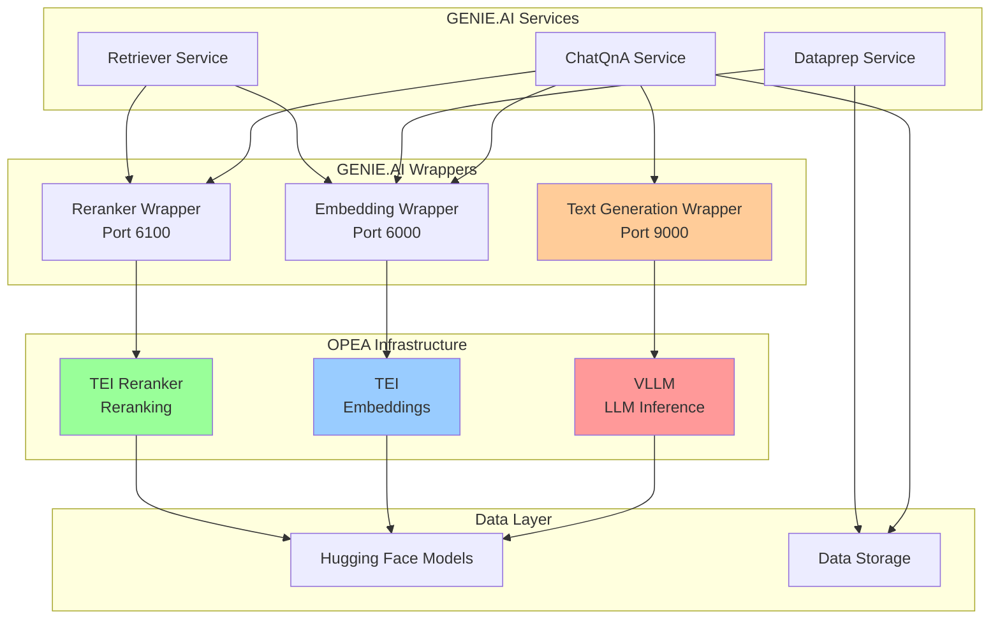
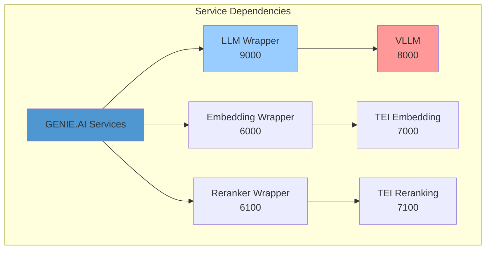

# OPEA Configuration Reference

## Overview

The `configs/opea-config/` directory contains the complete Docker Compose configuration for deploying the [OPEA (Open Platform for Enterprise AI)](https://opea.dev) infrastructure that powers the GENIE.AI framework. This configuration sets up all required microservices including LLM inference, embedding generation, reranking, and associated wrapper services.

---

## Table of Contents

- [Architecture](#architecture)
- [Services](#services)
- [Prerequisites](#prerequisites)
- [Quick Start](#quick-start)
- [Configuration Files](#configuration-files)
- [Environment Variables](#environment-variables)
- [Service Dependencies](#service-dependencies)
- [GPU Configuration](#gpu-configuration)
- [Deployment](#deployment)
- [Troubleshooting](#troubleshooting)

---

## Architecture



---

## Services

### Core OPEA Services

#### VLLM (LLM Inference)
- **Image**: `vllm/vllm-openai:latest`
- **Port**: 8000
- **Purpose**: High-performance LLM text generation
- **GPU**: Required
- **Models**: Hosts Hugging Face LLM models

#### TEI (Embedding Server)
- **Image**: `ghcr.io/huggingface/text-embeddings-inference:cpu-1.5.0`
- **Port**: 7000
- **Purpose**: Vector embedding generation
- **GPU**: Optional (CPU-compatible)
- **Models**: Hosts embedding models

#### TEI Reranker
- **Image**: `ghcr.io/huggingface/text-embeddings-inference:cpu-1.5.0`
- **Port**: 7100
- **Purpose**: Document reranking for improved retrieval
- **GPU**: Optional (CPU-compatible)
- **Models**: Hosts reranking models

### GENIE.AI Wrapper Services

#### Text Generation Wrapper
- **Port**: 9000
- **Purpose**: Wraps VLLM for GENIE.AI compatibility
- **Endpoint**: `/v1/chat/completions`

#### Embedding Wrapper
- **Port**: 6000
- **Purpose**: Wraps TEI for GENIE.AI compatibility
- **Endpoint**: `/v1/embeddings`

#### Reranker Wrapper
- **Port**: 6100
- **Purpose**: Wraps TEI Reranker for GENIE.AI compatibility
- **Endpoint**: `/v1/rerank`

---

## Prerequisites

### Hardware Requirements

**Minimum**:
- CPU: 16 cores
- RAM: 32 GB
- GPU: NVIDIA with 16+ GB VRAM
- Storage: 200 GB SSD

**Recommended**:
- CPU: 32 cores
- RAM: 64 GB
- GPU: NVIDIA A100/H100 with 40+ GB VRAM
- Storage: 500 GB NVMe SSD

### Software Requirements

- **Docker**: 20.10+
- **Docker Compose**: 2.20+
- **NVIDIA Driver**: 525+
- **NVIDIA Container Toolkit**: Latest
- **Hugging Face Account**: For model access

### Network Requirements

- **Bandwidth**: 1+ Gbps for model downloads
- **Latency**: Low latency between services
- **Ports**: Ensure required ports are available

---

## Quick Start

### 1. Set Hugging Face Token

```bash
export HUGGING_FACE_HUB_TOKEN=your_token_here
```

### 2. Set Data Path

```bash
export DATA_PATH=/path/to/data/storage
```

### 3. Start All Services

```bash
cd configs/opea-config
docker-compose up -d
```

### 4. Verify Services

```bash
# Check all services are running
docker-compose ps

# Test VLLM
curl http://localhost:8000/v1/models

# Test Embedding
curl http://localhost:6000/health

# Test Reranker
curl http://localhost:6100/health
```

---

## Configuration Files

### docker-compose.yaml

Main orchestration file containing all OPEA services and GENIE.AI wrappers.

**Key Sections**:
- VLLM service configuration
- TEI embedding service
- TEI reranking service
- Wrapper services
- Network configuration
- Volume mounts

### docker-compose-tei.yaml

TEI-specific configuration for embedding and reranking services.

**Key Sections**:
- TEI CPU configuration
- Model settings
- Resource limits

### vllm/ Directory

Contains VLLM-specific configurations and model settings.

---

## Environment Variables

### Global Variables

| Variable | Required | Default | Description |
|----------|----------|---------|-------------|
| `HUGGING_FACE_HUB_TOKEN` | Yes | - | Hugging Face API token |
| `DATA_PATH` | Yes | - | Data storage path |
| `LOGLEVEL` | No | INFO | Logging verbosity |

### VLLM Variables

| Variable | Default | Description |
|----------|---------|-------------|
| `LLM_MODEL_ID` | `Intel/neural-chat-7b-v3-3` | LLM model to use |
| `VLLM_TENSOR_PARALLEL_SIZE` | 1 | Tensor parallelism degree |
| `MAX_MODEL_LEN` | 4096 | Maximum sequence length |
| `GPU_MEMORY_UTILIZATION` | 0.9 | GPU memory utilization ratio |

### TEI Variables

| Variable | Default | Description |
|----------|---------|-------------|
| `EMBEDDING_MODEL_ID` | `BAAI/bge-base-en-v1.5` | Embedding model |
| `RERANK_MODEL_ID` | `BAAI/bge-reranker-base` | Reranking model |
| `MAX_BATCH_SIZE` | 32 | Maximum batch size |
| `MAX_CLIENT_BATCH_SIZE` | 128 | Maximum client batch size |

---

## Service Dependencies



### Dependency Order

Services must start in this order:

1. **VLLM** (LLM inference)
2. **TEI** (Embedding)
3. **TEI Reranker** (Reranking)
4. **LLM Wrapper** (Text generation wrapper)
5. **Embedding Wrapper** (Embedding wrapper)
6. **Reranker Wrapper** (Reranking wrapper)
7. **GENIE.AI Services** (ChatQnA, Dataprep, Retriever)

---

## GPU Configuration

### Single GPU Setup

```yaml
services:
  vllm:
    deploy:
      resources:
        reservations:
          devices:
            - driver: nvidia
              count: 1
              capabilities: [gpu]
```

### Multi-GPU Setup

```yaml
services:
  vllm:
    environment:
      - VLLM_TENSOR_PARALLEL_SIZE=2
    deploy:
      resources:
        reservations:
          devices:
            - driver: nvidia
              device_ids: ['0', '1']
              capabilities: [gpu]
```

### GPU Sharing

```yaml
services:
  vllm:
    environment:
      - VLLM_USE_MODELSCOPE=false
      - VLLM_GPU_MEMORY_UTILIZATION=0.7
    deploy:
      resources:
        reservations:
          devices:
            - driver: nvidia
              count: 1
              capabilities: [gpu]
```

---

## Deployment

### Production Deployment

1. **Configure Environment**:
   ```bash
   export HUGGING_FACE_HUB_TOKEN=your_production_token
   export DATA_PATH=/mnt/data/opea
   export LOGLEVEL=WARNING
   ```

2. **Deploy with GPU**:
   ```bash
   docker-compose -f docker-compose.yaml up -d
   ```

3. **Scale Services** (if needed):
   ```bash
   docker-compose up -d --scale tei-embedding=3
   ```

4. **Enable Health Checks**:
   ```bash
   docker-compose ps
   curl http://localhost:8000/health
   ```

### Development Deployment

1. **Use CPU for TEI** (no GPU required):
   ```bash
   docker-compose -f docker-compose-tei.yaml up -d
   ```

2. **Enable Debug Logging**:
   ```bash
   export LOGLEVEL=DEBUG
   docker-compose up
   ```

### Monitoring

```bash
# View logs
docker-compose logs -f

# Specific service
docker-compose logs -f vllm

# Resource usage
docker stats
```

---

## Troubleshooting

### Common Issues

#### Service Won't Start

**Symptoms**: Container exits immediately

**Solutions**:
1. Check GPU availability:
   ```bash
   nvidia-smi
   ```

2. Verify Hugging Face token:
   ```bash
   echo $HUGGING_FACE_HUB_TOKEN
   ```

3. Check logs:
   ```bash
   docker-compose logs vllm
   ```

#### Out of Memory

**Symptoms**: GPU OOM errors

**Solutions**:
1. Reduce model size
2. Decrease MAX_MODEL_LEN
3. Lower GPU_MEMORY_UTILIZATION
4. Use tensor parallelism

#### Model Download Fails

**Symptoms**: Cannot download models from Hugging Face

**Solutions**:
1. Verify token is valid
2. Check network connectivity
3. Ensure sufficient disk space
4. Try manual model download:
   ```bash
   huggingface-cli download model_name
   ```

#### Slow Performance

**Symptoms**: High latency responses

**Solutions**:
1. Increase GPU count
2. Enable tensor parallelism
3. Reduce batch sizes
4. Check GPU utilization
5. Verify network between services

### Health Checks

```bash
# Manual health check
curl http://localhost:8000/health
curl http://localhost:7000/health
curl http://localhost:7100/health

# Check service status
docker-compose ps
```

---

## Configuration Examples

### Using Different Models

**Change LLM Model**:
```bash
export LLM_MODEL_ID=meta-llama/Llama-2-7b-chat-hf
docker-compose up -d vllm
```

**Change Embedding Model**:
```bash
export EMBEDDING_MODEL_ID=sentence-transformers/all-MiniLM-L6-v2
docker-compose up -d tei-embedding
```

### Custom Model Paths

**Use Local Models**:
```yaml
services:
  vllm:
    environment:
      - LLM_MODEL_ID=/models/local-model
    volumes:
      - /path/to/models:/models
```

### Resource Limits

**Set Memory Limits**:
```yaml
services:
  vllm:
    deploy:
      resources:
        limits:
          memory: 32G
        reservations:
          memory: 16G
```

---

## Security

### Best Practices

1. **Never commit tokens** to version control
2. **Use secrets management** for sensitive data
3. **Enable firewall** rules to restrict access
4. **Regular security updates** for all containers
5. **Monitor logs** for suspicious activity

### Token Management

```bash
# Use environment file
cat > .env << EOF
HUGGING_FACE_HUB_TOKEN=your_token_here
EOF

# Set proper permissions
chmod 600 .env

# Use in compose
docker-compose --env-file .env up -d
```

---

## Performance Tuning

### VLLM Tuning

```yaml
environment:
  - VLLM_TENSOR_PARALLEL_SIZE=2
  - MAX_MODEL_LEN=8192
  - GPU_MEMORY_UTILIZATION=0.95
  - BLOCK_SIZE=16
```

### TEI Tuning

```yaml
environment:
  - MAX_BATCH_SIZE=64
  - MAX_CLIENT_BATCH_SIZE=256
  - USE_PYTORCH=1
```

### Network Optimization

```yaml
services:
  vllm:
    network_mode: host
    # No network isolation for better performance
```

---

## Monitoring

### Metrics to Track

- GPU utilization
- Memory usage per service
- Request latency (p50, p95, p99)
- Throughput (requests/second)
- Error rates
- Model loading time

### Logging

```bash
# Configure logging
export LOGLEVEL=INFO

# View logs
docker-compose logs -f vllm

# Export logs
docker-compose logs > logs.txt
```

---

## Backup and Recovery

### Model Caching

Models are cached in `${DATA_PATH}/models`. To backup:

```bash
# Backup models
tar -czf models-backup.tar.gz ${DATA_PATH}/models

# Restore
mkdir -p ${DATA_PATH}/models
tar -xzf models-backup.tar.gz -C ${DATA_PATH}/models
```

### Configuration Backup

```bash
# Backup configuration
tar -czf opea-config-backup.tar.gz \
  docker-compose.yaml \
  docker-compose-tei.yaml \
  vllm/
```

---

## Maintenance

### Updating Services

```bash
# Pull latest images
docker-compose pull

# Recreate containers
docker-compose up -d --force-recreate
```

### Cleaning Up

```bash
# Stop all services
docker-compose down

# Remove volumes
docker-compose down -v

# Clean old images
docker image prune -a
```

---

## License

This configuration follows the licensing of the respective OPEA and GENIE.AI components.

---

## Contributing

When contributing configuration changes:

1. Test changes locally first
2. Update this documentation
3. Follow Docker Compose best practices
4. Ensure backward compatibility

---

## Support

For issues or questions:
- [OPEA Documentation](https://opea.dev)
- [OPEA GitHub](https://github.com/opea-project)
- [GENIE.AI Documentation](../../README.md)

---

## Version History

| Version | Date | Changes |
|---------|------|---------|
| 1.0.0 | 2025-02 | Initial OPEA configuration for GENIE.AI |

---

**Last Updated**: 2025-02-07
**OPEA Version**: 1.3
**GENIE.AI Version**: 1.0.0
