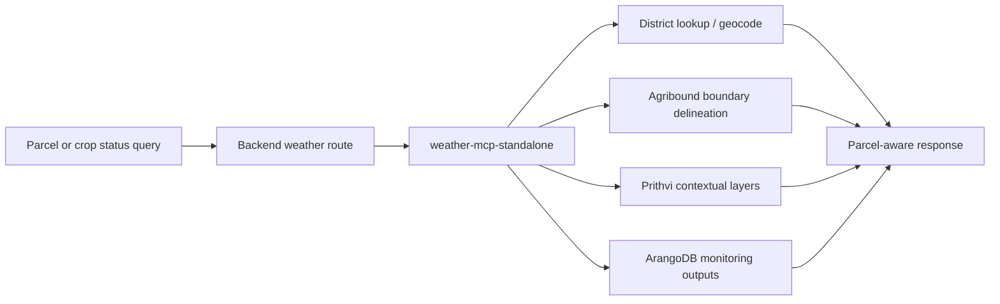
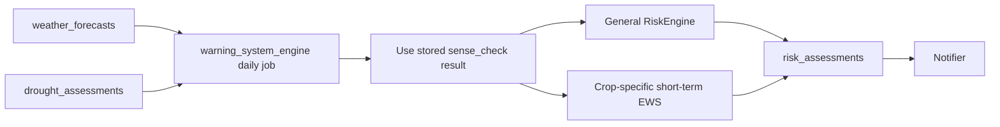
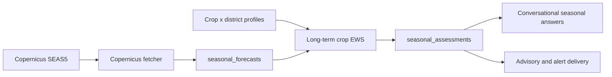
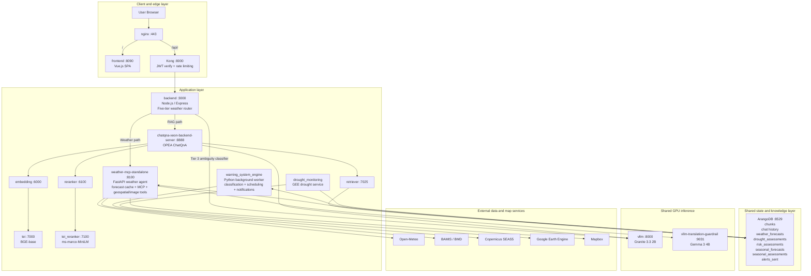
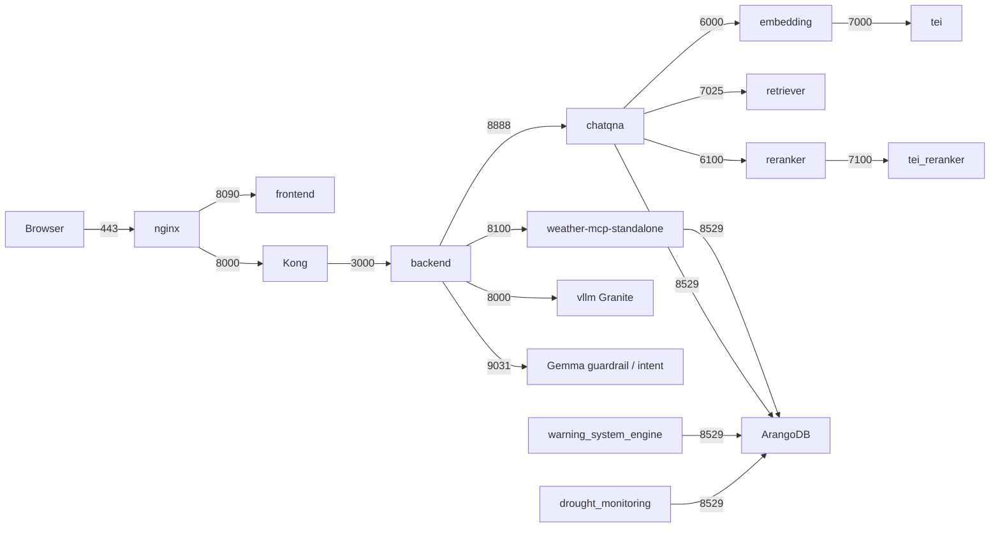
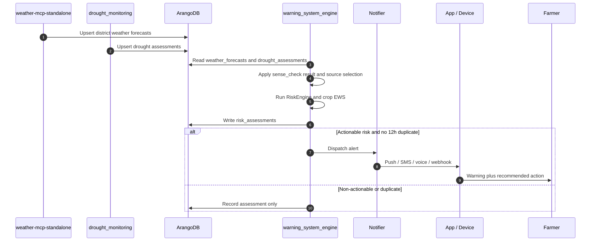
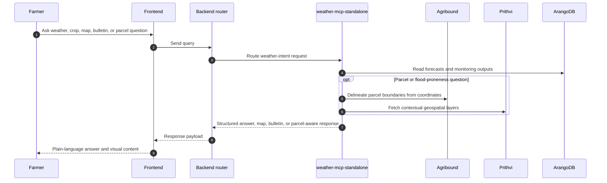
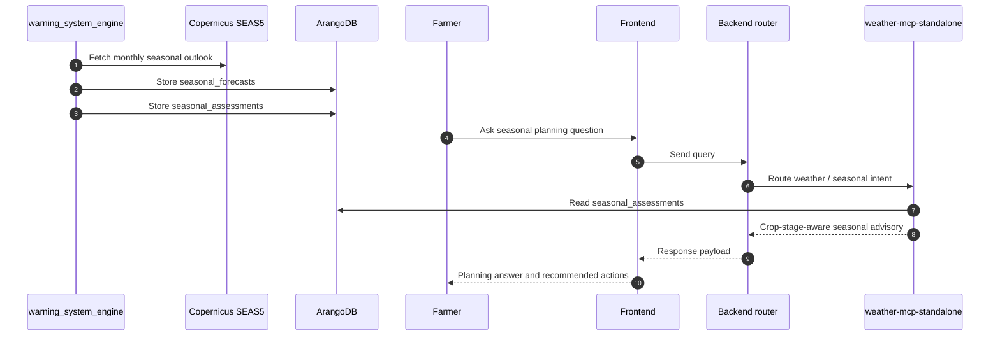

# MEWA - Multi-variable Early Warning Advisor
### Technical Design Report and Operational System Description

---

## Table of Contents

1. [Project Overview](#1-project-overview)
2. [Users](#2-users)
3. [Data Sources](#3-data-sources)
4. [Geospatial Layer - IBM Prithvi, Agribound, and Image Services](#4-geospatial-layer---ibm-prithvi-agribound-and-image-services)
5. [Use Cases](#5-use-cases)
6. [Early Warning System Logic](#6-early-warning-system-logic)
7. [System Architecture](#7-system-architecture)
8. [Sequence Diagrams](#8-sequence-diagrams)
9. [Implementation Backbone](#9-implementation-backbone)
10. [User Interaction in Practice](#10-user-interaction-in-practice)

---

## 1. Project Overview

MEWA is an operational early warning and advisory system built on top of the ITU-developed open-source Gen.AI platform. It combines scheduled monitoring, deterministic risk classification, district-scale weather intelligence, drought monitoring, parcel-aware geospatial context, and conversational delivery in one production backbone.

The platform serves two complementary modes:

- **Proactive push:** the system monitors conditions continuously and sends alerts before harmful weather or crop stress events escalate.
- **Reactive pull:** users ask questions in the chatbot and receive district, crop, seasonal, drought, map, bulletin, or parcel-aware answers without needing to understand the underlying services.

The operational split of responsibilities is deliberate:

- **`weather-mcp-standalone`** is the deployed FastAPI instance of the weather MCP service. It owns the weather agent, weather query endpoints, forecast cache access, Copernicus-facing context services, Prithvi and image services, agribound parcel tooling, bulletin delivery, map geocoding, and response assembly.
- **`warning_system_engine`** is the Python background worker that owns scheduled monitoring, deterministic classification, multi-signal orchestration, and notification dispatch.

MEWA operates at district scale across **all 64 districts of Bangladesh**, while the crop logic is organized around a **crop x district** profile model so the same pattern applies to potato and the other supported crops.

| Monitoring domain | Operational source set | Cadence | Purpose |
|---|---|---|---|
| Short-term weather monitoring | Open-Meteo + BAMIS/BMD | Daily monitoring cycle | Immediate district warning detection |
| Crop-specific short-term EWS | Weather cache + crop profiles | Daily monitoring cycle | Crop stress and disease risk alerts |
| Seasonal crop planning | Copernicus SEAS5 + crop profiles | Weekly monitoring cycle | Month-ahead planning and advisories |
| Drought monitoring | SMAP + MODIS via Google Earth Engine | Monitoring service cycle | Drought severity context and cross-signal monitoring |
| Parcel and flood context | Agribound + Prithvi + Mapbox | On demand | Parcel status, flood-proneness, and map responses |

In this report, the original proposal language has been replaced with the implemented operating model: scheduled monitoring writes structured outputs to ArangoDB, and the conversational layer reads those outputs and combines them with contextual geospatial tools to answer users in plain language.

---

## 2. Users

### 2.1 Farmers (Bangladesh)

Farmers are the primary users. They receive mobile alerts, open district and crop advisories in the application, ask direct weather questions in chat, request map views, inspect bulletin material, and ask parcel-specific questions such as field status or flood-proneness. The system is designed to return concise, actionable guidance rather than raw meteorological output.

### 2.2 Government Officials and Agricultural Support Staff

Government users, extension staff, and operational teams use the same platform to monitor district conditions, inspect warning tiers, review seasonal risk, follow drought signals, and audit why a warning was generated. The platform therefore supports both public communication and internal oversight from the same stored monitoring outputs.

---

## 3. Data Sources

### 3.1 BAMIS / BMD

- **Type:** Official Bangladesh Meteorological Department weather data exposed through BAMIS WRF tables
- **Format:** District-level tabular min / max / average values
- **Operational role:** Reference layer for short-term validation and fallback
- **Coverage:** 64 Bangladesh districts

BAMIS is the trust layer used in the short-term monitoring path. The system fetches BAMIS bounds in bulk, normalizes Bengali and spelling variants to canonical district names, and uses the result to perform the day-0 `sense_check()` against Open-Meteo. If Open-Meteo diverges beyond tolerance, BAMIS/BMD becomes the fallback source for that district.

### 3.2 Open-Meteo

- **Type:** API-based forecast source
- **Format:** 7-day district forecast with daily weather metrics and hourly soil moisture
- **Operational role:** Primary short-term forecast source

Open-Meteo provides the main district forecast used for short-term monitoring. Daily values drive temperature, rainfall, humidity, and wind risk checks, while hourly soil moisture is aggregated to daily values before storage so downstream code works against one normalized forecast schema.

### 3.3 Copernicus SEAS5

- **Type:** Seasonal climate forecast
- **Dataset:** `seasonal-monthly-single-levels`
- **Operational role:** Long-term monthly outlook and crop planning

Copernicus SEAS5 drives the long-term monitoring pipeline. The platform ingests monthly-mean temperature, precipitation, wind, and dewpoint-derived humidity, converts the raw units into operational crop metrics, and stores district outlooks in `seasonal_forecasts`. Those forecasts are then compared against crop x district profiles to generate `seasonal_assessments`.

### 3.4 Drought Monitoring Sources

- **Type:** Remote sensing and land-surface monitoring inputs
- **Datasets:** SMAP SPL4SMGP/008 and MODIS MOD13A2
- **Operational role:** Drought severity detection and multi-signal context

The drought monitoring service uses Google Earth Engine to derive:

- surface soil moisture
- overland runoff
- evapotranspiration
- NDVI

These indicators are converted into a drought score and stored as `drought_assessments`, which the warning system reads alongside short-term and seasonal weather outputs when building the overall monitoring picture.

---

## 4. Geospatial Layer - IBM Prithvi, Agribound, and Image Services

> **Operational rule:** Prithvi is not part of the operational early warning scoring pipeline. Image crop segmentation is not part of the operational early warning scoring pipeline. Flood image segmentation is not part of the operational early warning scoring pipeline. These services are exposed through the weather agent as **contextual geospatial tools** used to enrich parcel and flood-proneness answers.

### 4.1 IBM Prithvi

Prithvi is available in MEWA as a geospatial image service that enriches user responses when the user asks about parcel status, field context, or whether an area is prone to flooding. The outputs are consumed as contextual layers and image-derived evidence in the answer generation path; they do **not** determine the operational warning tier.

In practice, this means:

- the warning tier still comes from deterministic monitoring outputs in ArangoDB
- Prithvi contributes spatial context for parcel-aware answers
- flood-oriented imagery is treated as supporting evidence, not as the scoring engine

### 4.2 Agribound Field Boundary Delineation

Agribound provides parcel geometry extraction for explicit field-location requests. The parcel path operates as follows:

1. A parcel query reaches `weather-mcp-standalone` with explicit coordinates.
2. Google Earth Engine fetches a Sentinel-2 composite for the target area.
3. DelineateAnything produces candidate field polygons.
4. Fields of the World refines the boundaries.
5. A Dynamic World crop-probability filter removes non-agricultural detections.
6. The service returns parcel geometry as GeoJSON together with a map-ready overlay.

Agribound is therefore the parcel-shape tool in MEWA. It delineates field boundaries, but it does not classify crop type. The returned `crop_type` remains `"Unknown"` unless the response is enriched with separate crop or parcel context from other services.

### 4.3 Map and Image Delivery

The same weather service also delivers the user-facing geospatial experience:

- district lookup and free-text geocoding
- Mapbox satellite map rendering
- bulletin images served as chat-renderable markdown images
- parcel overlays that combine boundary geometry with monitoring outputs

Geocoding prioritizes the 64-district local lookup first, then falls back to Mapbox geocoding when the query is outside that canonical district list.



---

## 5. Use Cases

### 5.1 Short-term Push

The short-term push flow is the operational early warning path for imminent district risk.

1. District weather forecasts are refreshed and stored in `weather_forecasts`.
2. `warning_system_engine` runs the daily monitoring cycle across all 64 districts.
3. The engine reads district weather forecasts and drought outputs from ArangoDB.
4. The general weather `RiskEngine` classifies Tier 0 to Tier 4 district risk.
5. The crop-specific short-term EWS evaluates crop rules for the next 48 hours.
6. Assessments are written back to `risk_assessments`.
7. If the result is actionable and not suppressed by deduplication, notifications are dispatched.

The farmer does not need to ask. The system acts first, then the chat and frontend expose the same stored result on demand.

### 5.2 Short-term Pull

Short-term pull begins when the user asks a weather or crop question in the chat.

Examples include:

- "Will it rain in Dhaka in 3 days?"
- "What is the current potato risk in my district?"
- "Show me the bulletin."
- "Show me the map Dhaka."

The backend weather router detects hard weather intent and forwards the request to `weather-mcp-standalone`. That service reads the cached district forecast and risk documents, resolves location, and returns a plain-language answer, a structured risk answer, a bulletin, or a map view depending on the request.

### 5.3 Long-term Push

The long-term push flow produces scheduled crop-planning advisories.

1. `warning_system_engine` runs the weekly monitoring cycle every Monday at 06:00 UTC.
2. Copernicus SEAS5 monthly outlooks are fetched and stored in `seasonal_forecasts`.
3. The long-term crop EWS compares each district-month outlook against the district crop profile.
4. `seasonal_assessments` are written for the relevant crop stages and months.
5. Advisories are surfaced through the same alerting and conversational delivery backbone.

This flow is not a generic climate summary. It is a crop-stage-aware planning path driven by deterministic thresholds and district baselines.

### 5.4 Long-term Pull

Long-term pull happens when a farmer or official asks seasonal planning questions such as:

- "What does the next potato season look like?"
- "What should I expect over the next few months?"
- "Which months are risky for planting in my district?"

The conversational layer reads `seasonal_assessments` and the stored seasonal reasoning payloads, then turns the deterministic result into a user-facing advisory that explains why the month is favorable, risky, or severe for that crop and district.

### 5.5 Parcel and Crop Status Queries

Parcel-aware pull queries combine stored monitoring outputs with geospatial context.

Examples include:

- "What is the status of my parcel?"
- "Is my area prone to flooding?"
- "Delineate field boundaries at latitude 23.5 longitude 90.3."

For these requests, `weather-mcp-standalone` combines:

- district weather and crop warning outputs
- drought context
- agribound parcel geometry
- Prithvi contextual layers
- map and image rendering

The result is a parcel-aware answer that keeps the operational alert tier grounded in deterministic monitoring, while using geospatial services to explain spatial context around the parcel.

---

## 6. Early Warning System Logic

### 6.1 The `sense_check()` Function

The short-term pipeline uses `sense_check()` as the operational trust gate between Open-Meteo and BAMIS/BMD.

Only **day 0** is compared, because that is the point at which both sources are describing the same immediate weather window with the highest comparability.

The check evaluates three variables:

- temperature
- precipitation
- humidity

Operational decision rule:

- **Pass** when `violation_rate < 0.5`
- **Fail** when `violation_rate >= 0.5`

```python
def sense_check(om_day0, bamis_day0, tolerance=0.2):
    violations = 0
    total_checked = 0

    # Temperature must stay within a BAMIS envelope expanded by +/- 20%
    # Humidity must stay within a BAMIS envelope expanded by +/- 20%
    # Precipitation uses an upper-bound rule:
    # max(BAMIS_rain * 1.2, BAMIS_rain + 10 mm)

    return (violations / total_checked) < 0.5
```

Stored outcomes:

| `sense_check_passed` | Meaning |
|---|---|
| `True` | Open-Meteo passed the BAMIS/BMD plausibility check |
| `False` | Open-Meteo failed and the district switched to BMD fallback |
| `None` | BAMIS/BMD was unavailable and the check was skipped |

### 6.2 Short-term Source Selection and Fallback

The fallback strategy is implemented, not theoretical.

Operational decision tree:

- Open-Meteo passes `sense_check()` -> use Open-Meteo
- Open-Meteo fails `sense_check()` -> use BMD fallback
- BAMIS/BMD reference is unavailable -> keep Open-Meteo and mark the check as skipped
- Open-Meteo fetch fails -> use BMD directly
- If both fail -> skip the district for that run

One important limitation is explicit in the implementation: BMD fallback data does not provide wind speed in the same way as Open-Meteo, so BMD-sourced forecasts store wind as `0.0` and wind-driven triggers do not fire for that fallback case.

### 6.3 Crop Profiles by Crop and District

MEWA uses a **crop x district** profile model. The potato profile shown in the documentation is the schema template, not the boundary of the design.

Each profile organizes:

- season span
- growth stages
- weekly crop calendar
- district baseline climate values
- crop rules for temperature, rainfall, humidity, wind, and disease-sensitive logic

Reference schema:

```json
{
  "potato_dhaka": {
    "season_span": { "weeks": [44, 45, 46] },
    "growth_stages": [
      { "stage": "germination", "start_week": 44, "end_week": 46 }
    ],
    "weekly_calendar": [
      {
        "week": 44,
        "stage": "germination",
        "temp_min_c": 15,
        "temp_max_c": 25,
        "rainfall_mm": 12,
        "rh_min_pct": 65,
        "rh_max_pct": 80
      }
    ],
    "crop_rules": {
      "temperature_min": { "min": 10 },
      "temperature_max": { "max": 30 },
      "humidity": { "min": 65, "max": 80 },
      "rainfall_daily": [
        { "severity": "medium", "min": 25 },
        { "severity": "critical", "min": 100 }
      ],
      "wind_speed_kmh": { "max": 30 }
    }
  }
}
```

### 6.4 General Weather Severity Classification

The district-wide weather `RiskEngine` is deterministic and stateless. It classifies the worst observed risk within the short-term forecast window.

| Tier | Label | Rain (mm/day) | Heat (C) | Wind (km/h) | Operational meaning |
|---|---|---|---|---|---|
| 0 | Normal | < 50 | < 38 | < 62 | Normal conditions |
| 1 | Advisory | >= 50 | >= 38 | >= 62 | Elevated awareness |
| 2 | Warning | >= 100 | >= 40 | >= 88 | Precautionary action required |
| 3 | Severe | >= 200 | >= 43 | >= 118 | Immediate protective action |
| 4 | Emergency | Multi-hazard escalation | n/a | n/a | Catastrophic combined risk |

Additional logic includes:

- **Heatwave pattern:** 3 or more consecutive days at or above 40 C
- **Drought indicator:** 14 or more consecutive days below 1 mm/day rainfall
- **Multi-hazard escalation:** two independent Tier-2-or-higher triggers on the same day add one tier, capped at Tier 4

### 6.5 Crop-specific Short-term EWS

After the general weather classification, the crop-specific short-term EWS evaluates the next 48 hours for the target crop and district.

The crop path checks:

- upper and lower temperature limits
- rainfall against crop thresholds
- wind against crop thresholds
- humidity-sensitive disease conditions such as late blight

The result is written as a crop-keyed document in `risk_assessments`, for example:

- district-wide short-term risk: `{location}__short`
- crop-specific short-term risk: `{location}__short__{crop}`

The crop assessment remains weather-driven. Parcel and image services enrich the answer later, but they do not override the deterministic crop tier.



### 6.6 Long-term Seasonal EWS

The long-term seasonal engine is also deterministic. It runs weekly, ingests Copernicus SEAS5, and evaluates monthly conditions against crop-stage expectations and district baselines.

Core processing steps:

1. Fetch SEAS5 monthly-mean forecast fields.
2. Collapse ensemble members to one district estimate.
3. Convert units into operational crop metrics.
4. Map each forecast month to the crop stage calendar.
5. Compare the monthly outlook against absolute thresholds and district baseline deviation.
6. Write one assessment per district x crop x month into `seasonal_assessments`.

Operational conversions:

| Raw variable | Source unit | Operational conversion | Stored field |
|---|---|---|---|
| `t2m` | K | `K - 273.15` | `mean_temp_c` |
| `tp` | m/day | `m/day * 1000 * days_in_month` | `total_precip_mm` |
| `u10`, `v10` | m/s | `sqrt(u^2 + v^2) * 3.6` | `mean_wind_kmh` |
| `d2m` | K | Magnus formula from dewpoint and temperature | `estimated_rh_pct` |

Seasonal tier model:

| Tier | Label | Meaning |
|---|---|---|
| 0 | Normal | Monthly values remain within acceptable crop ranges |
| 1 | Advisory | Moderate deviation from stage baseline |
| 2 | Warning | Significant anomaly or severe single trigger |
| 3 | Severe | Multiple severe signals for the month |



### 6.7 Drought Monitoring and Multi-signal Correlation

The drought monitoring service contributes a second monitoring family alongside weather and crop forecasting. It computes drought severity from four remote-sensing indicators and writes structured drought assessments to ArangoDB.

Drought score logic:

| Score | Level | Meaning |
|---|---|---|
| 0 | NORMAL | All indicators healthy |
| 1 | NORMAL | Minor stress, within tolerance |
| 2 | WATCH | Two indicators below threshold |
| 3 | MODERATE | Significant drought stress |
| 4 | SEVERE | All indicators indicate drought |

`warning_system_engine` reads these drought outputs together with weather and crop outputs so the monitoring layer can correlate multiple signals instead of treating each subsystem in isolation.

### 6.8 Notification and Escalation

Actionable warnings are dispatched through the central notifier with 12-hour deduplication.

| Tier | Default action |
|---|---|
| Tier 0 | Structured log only |
| Tier 1 | Advisory log / digest |
| Tier 2 | Push notification |
| Tier 3 | Push notification + SMS |
| Tier 4 | Push notification + SMS + voice |

This alert fabric belongs to `warning_system_engine`, ensuring one service owns scheduling, classification, and escalation.

---

## 7. System Architecture

### 7.1 Full Architecture Diagram



### 7.2 Operational Ownership

| Component | Owns | Does not own |
|---|---|---|
| `weather-mcp-standalone` | Weather agent, query endpoints, forecast cache access, map and bulletin delivery, agribound, Prithvi, image services, explanation assembly | Central scheduled classification, notification escalation |
| `warning_system_engine` | APScheduler jobs, deterministic risk classification, crop EWS, seasonal EWS, correlation of monitoring outputs, notifier | User-facing chat routing |
| `drought_monitoring` | Drought scoring and drought-assessment generation | Chat routing, district weather classification |
| `backend` | Auth, sessions, translation, route selection, gateway orchestration | Meteorological scoring and alerting |
| `ArangoDB` | Shared contract for state, history, risk, seasonal, drought, and alerts | Business logic |

### 7.3 Five-tier Weather Router

The backend weather router decides whether a request goes to the weather path or the RAG path.

| Router tier | Decision | Destination |
|---|---|---|
| Tier 0 | Document signals | OPEA ChatQnA |
| Tier 1 | Hard weather intents | `weather-mcp-standalone` |
| Tier 2 | Agro terms | OPEA ChatQnA |
| Tier 3 | Ambiguous intent | Granite classifier, then weather or OPEA |
| Tier 4 | Default | OPEA ChatQnA |

This router is what allows the same chat surface to answer weather, documents, maps, bulletins, parcel queries, and seasonal planning questions without exposing service boundaries to the user.

### 7.4 Deployment Diagram



---

## 8. Sequence Diagrams

### 8.1 Technical - Short-term Monitoring and Alerting



### 8.2 Technical - Conversational Weather and Parcel Query



### 8.3 Technical - Seasonal Planning Query



---

## 9. Implementation Backbone

### 9.1 Service Breakdown

| Layer | Service | Main responsibility |
|---|---|---|
| Edge | `nginx` | SSL termination and reverse proxy |
| Gateway | `Kong` | JWT verification, rate limiting, API routing |
| Application | `backend` | Session management, translation, query routing, frontend gateway |
| Weather intelligence | `weather-mcp-standalone` | Agent responses, forecast access, maps, bulletin, parcel and image tools |
| Early warning | `warning_system_engine` | Scheduled monitoring, classification, seasonal scoring, notification dispatch |
| Drought monitoring | `drought_monitoring` | Drought indicator fetching, scoring, drought persistence |
| RAG orchestration | `chatqna-xeon-backend-server` | Retrieval and document-grounded answers |
| Vector services | `embedding`, `retriever`, `reranker`, `tei`, `tei_reranker` | Embedding, search, rerank, and retrieval support |
| Shared state | `arango-vector-db` | Operational documents, vectors, and history |
| Shared GPU | `vllm`, `vllm-translation-guardrail` | RAG generation, ambiguity classification, weather explanation, guardrail and translation acceleration |

### 9.2 Core Collections

| Collection | Producer | Consumer | Purpose | Key pattern |
|---|---|---|---|---|
| `chunks` | Document ingestion / RAG pipeline | Retriever | Vectorized knowledge chunks | Service-defined |
| `chat history` | Backend | Backend | Conversation state | Service-defined |
| `weather_forecasts` | Weather monitoring path | `warning_system_engine`, `weather-mcp-standalone` | District short-term weather cache | `{location}__{source}__short` |
| `drought_assessments` | `drought_monitoring` | `warning_system_engine`, `weather-mcp-standalone` | Drought severity monitoring | Service-defined district/time key |
| `risk_assessments` | `warning_system_engine` | `weather-mcp-standalone` | District and crop short-term risk | `{location}__short` or `{location}__short__{crop}` |
| `seasonal_forecasts` | `warning_system_engine` | `warning_system_engine`, `weather-mcp-standalone` | District seasonal climate outlook | `{location}__copernicus__long` |
| `seasonal_assessments` | `warning_system_engine` | `weather-mcp-standalone` | Crop x district x month seasonal risk | `{location}__{crop}__{YYYY_MM}` |
| `alerts_sent` | `warning_system_engine` | `warning_system_engine` | 12-hour deduplication log | Insert-only |

### 9.3 Operational Cadence

| Process | Cadence | Owner |
|---|---|---|
| Daily short-term monitoring | 05:00 UTC + startup catch-up | `warning_system_engine` |
| Weekly seasonal monitoring | Monday 06:00 UTC + startup catch-up | `warning_system_engine` |
| Weather answers and map responses | On demand | `weather-mcp-standalone` |
| Bulletin rendering | On demand | `weather-mcp-standalone` |
| Parcel delineation and Prithvi context | On demand | `weather-mcp-standalone` |
| Crop alert banner refresh | Every 30 minutes in frontend | Frontend + backend weather route |

### 9.4 Key API and MCP Surface

| Interface | Purpose |
|---|---|
| `POST /query` | Main weather agent query entry |
| `GET /risk/latest` | Latest district short-term risk |
| `GET /potato/risk/latest?location=...` | Latest crop-specific short-term risk |
| `GET /potato/seasonal/risk?location=...` | Latest crop seasonal outlook |
| `GET /geocode?location=...` | District-first geocoding for map and parcel flows |
| `GET /bulletin/image/{filename}` | Bulletin image delivery for chat rendering |

---

## 10. User Interaction in Practice

### 10.1 How Users Query Parcel Information

Parcel information is queried through the same chat interface used for weather questions.

Typical flow:

1. The user asks about a parcel, field, crop area, or flood-proneness.
2. The backend routes the request to `weather-mcp-standalone`.
3. The weather service resolves location context and reads the latest stored monitoring outputs.
4. If explicit coordinates are present, agribound delineates parcel boundaries.
5. Prithvi contextual layers are added when the question requires parcel or flood context.
6. The response is returned as text plus map-ready visual content.

This keeps parcel answers inside the same MEWA conversation rather than forcing the user into a separate GIS workflow.

### 10.2 How the System Combines Early Warning Outputs and Geospatial Context

MEWA combines two different classes of information:

- **Deterministic monitoring outputs:** `risk_assessments`, `seasonal_assessments`, `drought_assessments`, and cached forecasts
- **Contextual geospatial outputs:** agribound parcel geometry, Prithvi raster context, geocoded map views, and bulletin imagery

The combination rule is straightforward:

`final answer = stored monitoring result + location resolution + parcel geometry + contextual geospatial layers + plain-language explanation`

The alert tier always comes from the deterministic monitoring result. Geospatial services explain *where* and *why* the condition matters around the parcel, but they do not replace the operational warning engine.

### 10.3 Supported Question Types

The integrated system supports at least the following user question families:

- district weather forecast questions
- short-term crop risk questions
- seasonal crop-planning questions
- drought condition questions
- parcel status and field-boundary questions
- flood-proneness and area-context questions
- bulletin requests
- map requests such as `show me the map {location}`

Examples:

- `Will it rain in Dhaka in 3 days?`
- `What is the potato risk in my district today?`
- `When should I plan potato?`
- `Produce an agricultural advisor bulletin.`
- `Show me the map of my parcel in Dhaka.`
- `Is my parcel prone to flooding?`
- `Delineate field boundaries at latitude my location in Dhaka (23.5 longitude 90.3).`

### 10.4 Actions the Implementation Performs in Response

Depending on the question and the current monitoring state, the system performs one or more of the following actions:

- reads cached district forecasts from ArangoDB
- reads district, crop, drought, or seasonal assessments from ArangoDB
- routes document-like questions to the RAG path
- routes hard weather questions to `weather-mcp-standalone`
- resolves district names or free-text map locations
- renders a satellite map overlay
- returns bulletin markdown with inline images
- delineates parcel boundaries with agribound
- enriches parcel answers with Prithvi contextual layers
- returns a plain-language explanation grounded in the stored operational state
- dispatches push, SMS, voice, or webhook alerts when the monitoring engine detects actionable risk

In other words, the user experiences one MEWA system, while underneath the platform cleanly separates monitoring, storage, geospatial tooling, RAG, and delivery into specialized services.

---
