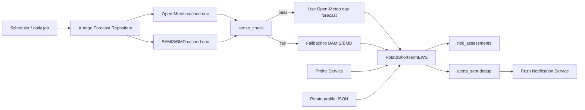
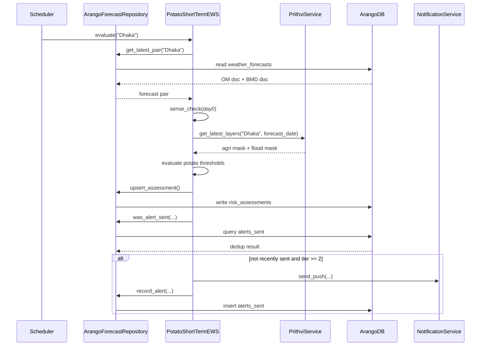

# MEWA Short-Term Potato Push Notification Plan

This document describes an implementation plan for the **short-term crop-specific early warning flow** in MEWA, focused only on **potato** for now.

It is based on:

- [MEWA_report.md](./MEWA_report.md)
- [ME_arangodb_guide.md](./ME_arangodb_guide.md)
- [example_crop_profile.json](./example_crop_profile.json)

## Goal

Implement a **short-term push notification pipeline** that:

1. Reads already-ingested **Open-Meteo** and **BAMIS/BMD** forecast data from **ArangoDB**
2. Runs a `sense_check()` between Open-Meteo and BAMIS/BMD
3. Applies **potato-specific thresholds**
4. Uses **Prithvi** as a geospatial context layer
5. Stores a crop-aware risk assessment
6. Sends a push notification to farmers when the short-term potato risk is actionable

## Scope

This plan focuses only on the **short-term pipeline**.

- Horizon: next 24h to 48h
- Crop: potato
- Forecast sources: Open-Meteo and BAMIS/BMD from ArangoDB
- Geospatial context: Prithvi crop/flood layers
- Output: push notification for actionable short-term potato stress

Out of scope for now:

- Long-term seasonal planning
- Multi-crop support
- Full disease model calibration
- Production deployment details for Prithvi inference

## Why Short-Term Is The Right Place

For messages like:

> "Temperature is not ideal for potatoes tomorrow. Take action."

the **short-term pipeline** is the correct home because:

- Open-Meteo + BAMIS/BMD are intended for imminent weather risk
- BAMIS/BMD acts as the trust/reference layer
- the farmer can act immediately on tomorrow's conditions
- Copernicus seasonal data is better for planning advice, not urgent push warnings

## Key Design Decision

The blueprint in `MEWA_report.md` models short-term forecast data as hourly readings, but the ArangoDB weather cache currently stores **daily aggregated forecast documents**.

That means the first implementation should be:

- a **daily short-term potato advisor**
- not a fully hourly crop stress engine

This keeps the implementation aligned with the stored Arango schema and avoids inventing a parallel data path.

## High-Level Architecture



## Component Plan

### 1. Forecast Repository Layer

Add a repository that reads from the existing Arango collections:

- `weather_forecasts`
- `risk_assessments`
- `alerts_sent`

Responsibilities:

- fetch latest short-horizon Open-Meteo forecast for a district
- fetch latest short-horizon BAMIS/BMD fallback/reference forecast
- upsert crop-aware risk assessments
- check deduplication window before sending alerts
- record sent alerts

Suggested interface:

```python
class ArangoForecastRepository:
    def get_latest_forecast(self, location: str, source: str, horizon: str = "short") -> dict | None:
        ...

    def get_latest_pair(self, location: str) -> tuple[dict | None, dict | None]:
        ...

    def upsert_assessment(self, assessment: dict) -> None:
        ...

    def was_alert_sent(self, location: str, crop: str, tier: int, within_hours: int = 12) -> bool:
        ...

    def record_alert(self, location: str, crop: str, tier: int, channel: str = "push") -> None:
        ...
```

### 2. Potato Profile Loader

Load and normalize `example_crop_profile.json` into a compact threshold object.

Relevant rules from the current potato profile:

- `temperature_min`
- `temperature_max`
- `humidity`
- `rainfall_daily`
- `wind_speed_kmh`

Potentially evaluable disease rule in v1:

- `late_blight`

Rules that should be deferred for now because current weather feeds do not fully support them:

- `termite` requires `fog` and `cloud_cover`
- `potato_wire_worm` requires `soil_temperature`

Suggested normalized model:

```python
from dataclasses import dataclass

@dataclass
class PotatoThresholds:
    temp_min: float
    temp_max: float
    humidity_min: float
    humidity_max: float
    rain_medium: float
    rain_critical: float
    wind_max: float
```

Loader:

```python
import json

def load_potato_thresholds(path: str) -> PotatoThresholds:
    raw = json.load(open(path))["potato_dhaka"]["crop_rules"]
    rain = raw["rainfall_daily"]
    return PotatoThresholds(
        temp_min=raw["temperature_min"]["min"],
        temp_max=raw["temperature_max"]["max"],
        humidity_min=raw["humidity"]["min"],
        humidity_max=raw["humidity"]["max"],
        rain_medium=next(x["min"] for x in rain if x["severity"] == "medium"),
        rain_critical=next(x["min"] for x in rain if x["severity"] == "critical"),
        wind_max=raw["wind_speed_kmh"]["max"],
    )
```

### 3. Forecast Normalization Layer

Convert the Arango `weather_forecasts` documents into a simple internal daily structure.

Suggested internal model:

```python
from dataclasses import dataclass

@dataclass
class DailyForecastPoint:
    date: str
    temp_min: float
    temp_max: float
    humidity_max: float
    rain_mm: float
    wind_kmh: float
    source: str
```

Adapter:

```python
def to_point(day: dict, source: str) -> DailyForecastPoint:
    return DailyForecastPoint(
        date=day["date"],
        temp_min=day["temperature"]["min"],
        temp_max=day["temperature"]["max"],
        humidity_max=day["humidity"],
        rain_mm=day["precipitation"]["value"],
        wind_kmh=day["wind"]["speed"],
        source=source,
    )
```

## Short-Term `sense_check()` Plan

The implementation should follow the Arango guide's short-term validation logic, not the hourly placeholder logic from the report blueprint.

Check day-0 values for:

- max temperature
- precipitation
- humidity

Decision rule:

- pass when `violation_rate < 0.5`
- fail when `violation_rate >= 0.5`

Suggested implementation:

```python
def sense_check_day0(om_day: dict, bmd_day: dict, tol: float = 0.2) -> bool:
    violations = 0
    total = 0

    total += 1
    temp_lo = bmd_day["temperature"]["min"] * (1 - tol)
    temp_hi = bmd_day["temperature"]["max"] * (1 + tol)
    if not (temp_lo <= om_day["temperature"]["max"] <= temp_hi):
        violations += 1

    total += 1
    rain_limit = max(
        bmd_day["precipitation"]["value"] * (1 + tol),
        bmd_day["precipitation"]["value"] + 10.0,
    )
    if om_day["precipitation"]["value"] > rain_limit:
        violations += 1

    total += 1
    humid = bmd_day["humidity"]
    hum_lo = humid * (1 - tol)
    hum_hi = min(humid * (1 + tol), 100.0)
    if not (hum_lo <= om_day["humidity"] <= hum_hi):
        violations += 1

    return (violations / total) < 0.5
```

Fallback rule:

- if `sense_check()` passes, use Open-Meteo
- if `sense_check()` fails, use BAMIS/BMD

## Potato Classification Engine

This is the weather-to-risk classifier for potato stress.

It is separate from Prithvi:

- **Prithvi** provides geospatial context
- **PotatoRiskEngine** provides crop-specific weather evaluation

Suggested logic:

```python
def evaluate_potato_day(day: DailyForecastPoint, t: PotatoThresholds) -> list[str]:
    triggers = []

    if day.temp_max > t.temp_max:
        triggers.append(f"Max temperature {day.temp_max}C > potato limit {t.temp_max}C")

    if day.temp_min < t.temp_min:
        triggers.append(f"Min temperature {day.temp_min}C < potato limit {t.temp_min}C")

    if day.humidity_max < t.humidity_min or day.humidity_max > t.humidity_max:
        triggers.append(
            f"Humidity {day.humidity_max}% outside potato range "
            f"{t.humidity_min}-{t.humidity_max}%"
        )

    if day.rain_mm >= t.rain_critical:
        triggers.append(f"Critical rainfall {day.rain_mm} mm/day")
    elif day.rain_mm >= t.rain_medium:
        triggers.append(f"High rainfall {day.rain_mm} mm/day")

    if day.wind_kmh > t.wind_max:
        triggers.append(f"Wind {day.wind_kmh} km/h > potato limit {t.wind_max} km/h")

    return triggers
```

### Disease Watch Rule For v1

The current profile includes a late blight risk that can be approximated from current daily weather inputs.

Suggested rule:

```python
def detect_late_blight(day: DailyForecastPoint) -> str | None:
    temp_mean = (day.temp_min + day.temp_max) / 2.0
    if 16 <= temp_mean <= 20 and day.humidity_max >= 90 and day.rain_mm >= 1:
        return "Late blight conditions likely"
    return None
```

This should be treated as:

- advisory support
- not a standalone severe alert

until validated by agronomy experts.

## Severity And Notification Mapping

To stay aligned with the existing notification tiers in ArangoDB, use a crop-aware tier mapping.

Suggested v1 mapping:

| Tier | Label | Potato interpretation |
|---|---|---|
| 0 | Normal | No potato threshold breach |
| 1 | Advisory | Mild humidity deviation or disease watch |
| 2 | Warning | Temperature breach, wind breach, or rainfall >= 25 mm/day |
| 3 | Severe | Rainfall >= 100 mm/day or multiple Tier-2 triggers |
| 4 | Emergency | Tier-3 weather + Prithvi flood confirmation |

Suggested classifier:

```python
def classify_tier(triggers: list[str], flood_confirmed: bool) -> tuple[int, str]:
    severe_count = 0
    advisory_count = 0

    for trig in triggers:
        if "Critical rainfall" in trig:
            severe_count += 1
        elif (
            "temperature" in trig.lower()
            or "wind" in trig.lower()
            or "High rainfall" in trig
        ):
            severe_count += 1
        else:
            advisory_count += 1

    if severe_count == 0 and advisory_count == 0:
        return 0, "Normal"
    if severe_count == 0:
        return 1, "Advisory"
    if severe_count == 1:
        return 2, "Warning"
    if severe_count >= 2:
        return 3, "Severe"
    if flood_confirmed:
        return 4, "Emergency"
```

Recommended adjustment:

```python
def escalate_for_flood(base_tier: int, flood_confirmed: bool) -> int:
    if flood_confirmed and base_tier >= 3:
        return 4
    return base_tier
```

## Prithvi Integration Plan

Prithvi should not be treated as the source of potato weather thresholds.

Instead, it should be used for:

1. confirming that the target locality contains meaningful agricultural area
2. limiting impact analysis to relevant agricultural land
3. confirming inundation to escalate severe rain events

Recommended v1 use:

- `classify_crops()` returns a crop/land-cover mask
- `detect_floods()` returns a flood segmentation mask

Practical short-term rules:

- if agricultural coverage is very low, suppress district-wide push
- if flooded agricultural pixel share exceeds a configured threshold, escalate one tier

Example service contract:

```python
class PrithviService:
    def get_latest_layers(self, location: str, forecast_date: str) -> dict:
        return {
            "agri_coverage_pct": 62.5,
            "flooded_agri_pct": 18.0,
            "crop_layer": {...},
            "flood_layer": {...},
        }
```

Flood confirmation helper:

```python
def flood_confirmed(geo: dict, min_pct: float = 15.0) -> bool:
    return geo.get("flooded_agri_pct", 0.0) >= min_pct
```

## Data Model Changes

### 1. `risk_assessments`

The current schema uses one key per district and horizon.

That is not enough for crop-specific alerts.

Change to:

- key format: `{district}__short__potato`

Suggested document:

```json
{
  "_key": "dhaka__short__potato",
  "location": "Dhaka",
  "crop": "potato",
  "horizon": "short",
  "forecast_date": "2026-05-04",
  "assessed_at": "2026-05-03T06:00:05+00:00",
  "tier": 2,
  "tier_label": "Warning",
  "forecast_source": "open_meteo",
  "sense_check_passed": true,
  "fallback_used": false,
  "triggers": [
    "Max temperature 33.0C > potato limit 30.0C"
  ],
  "disease_risks": [],
  "affected_area_pct": 62.5,
  "flood_confirmed": false,
  "reasoning": "Potato warning for Dhaka based on forecasted heat stress tomorrow."
}
```

### 2. `alerts_sent`

To avoid incorrect deduplication across crops, add:

- `crop`
- `forecast_date`

Suggested document:

```json
{
  "location": "Dhaka",
  "crop": "potato",
  "tier": 2,
  "channel": "push",
  "forecast_date": "2026-05-04",
  "sent_at": "2026-05-03T06:00:10+00:00"
}
```

## Main EWS Orchestrator

Suggested structure:

```python
class PotatoShortTermEWS:
    def __init__(self, repo, prithvi, thresholds, notifier):
        self.repo = repo
        self.prithvi = prithvi
        self.thresholds = thresholds
        self.notifier = notifier

    def evaluate(self, location: str) -> dict:
        om_doc, bmd_doc = self.repo.get_latest_pair(location)

        if om_doc is None and bmd_doc is None:
            raise ValueError(f"No short-term forecast available for {location}")

        reliable = False
        source_doc = None

        if om_doc and bmd_doc:
            reliable = sense_check_day0(om_doc["forecast"][0], bmd_doc["forecast"][0])
            source_doc = om_doc if reliable else bmd_doc
        else:
            source_doc = om_doc or bmd_doc

        points = [
            to_point(day, source_doc["source"])
            for day in source_doc["forecast"][:2]
        ]

        geo = self.prithvi.get_latest_layers(location, points[0].date)

        triggers = []
        disease_risks = []
        for point in points:
            triggers.extend(evaluate_potato_day(point, self.thresholds))
            blight = detect_late_blight(point)
            if blight:
                disease_risks.append(blight)

        flood = flood_confirmed(geo)
        tier, label = classify_tier(triggers + disease_risks, flood)
        tier = escalate_for_flood(tier, flood)

        assessment = {
            "location": location,
            "crop": "potato",
            "horizon": "short",
            "forecast_date": points[0].date,
            "tier": tier,
            "tier_label": label,
            "forecast_source": source_doc["source"],
            "sense_check_passed": reliable if om_doc and bmd_doc else None,
            "fallback_used": source_doc["source"] != "open_meteo",
            "triggers": triggers,
            "disease_risks": disease_risks,
            "affected_area_pct": geo.get("agri_coverage_pct"),
            "flood_confirmed": flood,
        }

        self.repo.upsert_assessment(assessment)
        return assessment

    def trigger_push_alert(self, assessment: dict) -> None:
        if assessment["tier"] < 2:
            return

        if self.repo.was_alert_sent(
            assessment["location"],
            assessment["crop"],
            assessment["tier"],
            within_hours=12,
        ):
            return

        message = build_push_message(assessment)
        self.notifier.send_push(assessment["location"], assessment["crop"], message)
        self.repo.record_alert(
            assessment["location"],
            assessment["crop"],
            assessment["tier"],
        )
```

## Push Message Strategy

The push message should be:

- short
- crop-specific
- action-oriented
- easy to localize to Bangla later

Message template:

```python
def build_push_message(assessment: dict) -> str:
    if assessment["tier"] >= 4:
        return (
            f"Potato emergency for {assessment['location']}: severe weather and flood risk "
            f"are expected on {assessment['forecast_date']}. Protect low-lying fields now."
        )

    if assessment["triggers"]:
        return (
            f"Potato warning for {assessment['location']}: "
            f"{assessment['triggers'][0]}. Take protective action today."
        )

    if assessment["disease_risks"]:
        return (
            f"Potato advisory for {assessment['location']}: "
            f"{assessment['disease_risks'][0]}. Monitor field conditions closely."
        )

    return f"Potato weather update for {assessment['location']}: monitor conditions."
```

Example messages:

- `Potato warning for Dhaka: Max temperature 33.0C > potato limit 30.0C. Take protective action today.`
- `Potato warning for Dhaka: High rainfall 28.0 mm/day. Improve drainage and protect tubers.`
- `Potato advisory for Dhaka: Late blight conditions likely. Monitor field conditions closely.`

## End-To-End Flow



## Recommended File Structure

Suggested initial Python modules:

```text
weather/
  arango_repo.py
  potato_profile.py
  forecast_models.py
  sense_check.py
  potato_risk_engine.py
  prithvi_service.py
  short_term_potato_ews.py
  notifier.py
  tests/
    test_sense_check.py
    test_potato_risk_engine.py
    test_short_term_potato_ews.py
```

## Delivery Phases

### Phase 1: Data Access + Threshold Loading

Build:

- Arango repository methods
- potato threshold loader
- forecast normalization layer

Exit criteria:

- can read Dhaka short forecast from Arango
- can parse potato thresholds from JSON

### Phase 2: Crop Risk Engine

Build:

- `sense_check_day0()`
- potato trigger evaluator
- disease watch evaluator
- tier classifier

Exit criteria:

- deterministic tests pass for temperature, rain, humidity, wind

### Phase 3: EWS Orchestrator

Build:

- `PotatoShortTermEWS.evaluate()`
- assessment persistence
- crop-aware dedup support

Exit criteria:

- assessment is written to `risk_assessments`
- assessment uses Open-Meteo when trusted and BAMIS/BMD when not

### Phase 4: Prithvi Context

Build:

- Prithvi service adapter
- agri coverage filter
- flood escalation

Exit criteria:

- severe rain + flood confirmation can produce tier escalation

### Phase 5: Notification Integration

Build:

- push provider integration
- message templating
- alert logging

Exit criteria:

- tier >= 2 can generate a push without duplicates

### Phase 6: Shadow Mode

Run the pipeline without sending real pushes for an observation period.

During shadow mode:

- store assessments
- store would-send decisions
- compare alerts with agronomy expectations
- calibrate thresholds and phrasing

## Testing Plan

Minimum tests:

1. `sense_check()` passes when Open-Meteo stays within BAMIS tolerance
2. `sense_check()` fails when 2 out of 3 variables violate
3. heat-only potato breach returns tier 2
4. heavy rainfall >= 100 mm/day returns tier 3
5. late blight conditions produce advisory signal
6. flood confirmation escalates a severe case
7. duplicate alert within 12h is suppressed

Example unit test:

```python
def test_heat_stress_creates_warning():
    thresholds = PotatoThresholds(
        temp_min=10,
        temp_max=30,
        humidity_min=65,
        humidity_max=80,
        rain_medium=25,
        rain_critical=100,
        wind_max=30,
    )
    point = DailyForecastPoint(
        date="2026-05-04",
        temp_min=19,
        temp_max=33,
        humidity_max=72,
        rain_mm=0,
        wind_kmh=12,
        source="open_meteo",
    )
    triggers = evaluate_potato_day(point, thresholds)
    assert "Max temperature 33C > potato limit 30C" in triggers
```

## Risks And Caveats

1. The Arango forecast cache is daily, not hourly, so advisory precision is limited in v1.
2. The potato profile is labeled `potato_dhaka`, so regional calibration for other districts is still needed.
3. Prithvi in the report is still a blueprint-level integration and may require infrastructure decisions before production use.
4. Some disease rules depend on variables not present in the current weather cache.
5. Crop targeting should initially rely on farmer/crop registration data, not only satellite classification.

## Recommended Final v1 Decisions

- implement only **short-term daily potato alerts**
- read forecasts directly from **ArangoDB**
- use **Open-Meteo when trusted**, otherwise **BAMIS/BMD**
- treat **Prithvi as a context and escalation layer**
- store **crop-aware risk assessments**
- make deduplication **crop-aware**
- send pushes only for **tier 2 and above**
- run in **shadow mode first**

## Next Step After This Plan

The next concrete step should be to scaffold:

- `arango_repo.py`
- `potato_profile.py`
- `sense_check.py`
- `potato_risk_engine.py`
- `short_term_potato_ews.py`

and wire them together against the existing Arango weather collections.
