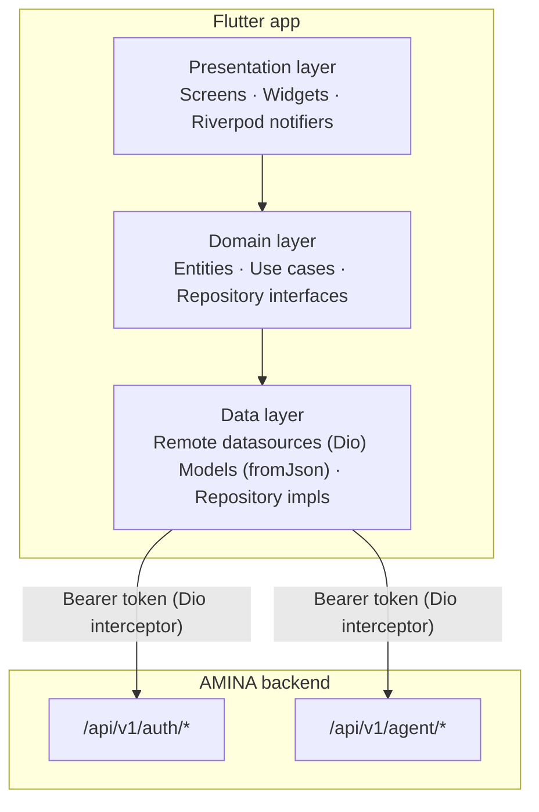

# MOBILE APP — AMINA Android

Flutter patient-facing app that connects to the AMINA backend. Targets Android 9+ (API 28), optimized for low-end devices (1 GB RAM, 720×1280). The mobile app is an additional client, not a separate service.

  

---

  
## 1. Architecture diagram
  



  

---

  

## 2. Feature map

| Feature | Screens / widgets | API endpoints |
|---|---|---|
| **Auth** | Login · Register · ForgotPassword | `POST /auth/login` · `POST /auth/register` · `POST /auth/password-reset/request` · `POST /auth/password-reset/confirm` |
| **AI chat** | TodayScreen · AminaChatBar · ChatMessages | `POST /agent/chat` |
| **Voice input** | AminaChatBar (mic button) | `POST /agent/stt` (Whisper) |
| **TTS playback** | ChatMessageBubble | `POST /agent/tts` |
| **Caregiver directory** | CaregiverScreen (Professional tab) | `GET /cg-apply/directory` |
| **Apply to caregiver** | ApplySheet | `POST /cg-apply/apply` |
| **Assigned caregivers** | CaregiverScreen · AssignedCaregiverTile | `GET /caregiver/list` |
| **Bantaba circle** | CaregiverScreen (Family tab) | `GET /caregiver/bantaba-circle` |
| **Profile & settings** | MeScreen · SettingsScreen | `GET /auth/me` |

  
---

## 3. State management

Riverpod is used throughout. Key providers:  

| Provider | Type | Scope |
|---|---|---|
| `authProvider` | `StateNotifierProvider<AuthNotifier, AuthState>` | Global — survives navigation |
| `sessionExpiredProvider` | `StateProvider<bool>` | Global — set by Dio interceptor on 401 from auth/agent endpoints; listened in `main.dart` to force logout |
| `chatSessionsProvider` | `StateNotifierProvider` | Global — holds full chat history + streaming state |
| `vitalsProvider` | `StateNotifierProvider` | Global — local vitals log |
| `caregiverDirectoryProvider` | `FutureProvider` | Invalidated on login to clear startup-401 cache |
| `assignedCaregiversProvider` | `FutureProvider` | Invalidated on login |
| `bantabaCircleProvider` | `FutureProvider` | Invalidated on login |
| `themeModeProvider` | `StateProvider<ThemeMode>` | Global |
| `dioProvider` | `Provider<Dio>` | Global — singleton with interceptors |


---

## 4. Network layer

All HTTP calls go through a single `Dio` instance (`dioProvider`) with two interceptors:

**onRequest** — reads `amina_access_token` from FlutterSecureStorage and injects `Authorization: Bearer <token>` into every request.
 
**onError** — on 401, checks the request path:
- `/api/v1/auth/*` or `/api/v1/agent/*` → genuine token expiry → deletes token from secure storage, sets `sessionExpiredProvider = true` → app root navigates to login.
  

The base URL is injected at build time:

```dart
// lib/core/config/app_config.dart
static const String baseUrl = String.fromEnvironment(
  'API_BASE_URL',
  defaultValue: 'http://10.0.2.2:8000',  // Android emulator → host
);

```

  
---

## 5. Build

```bash
# Debug (emulator — hits local backend via 10.0.2.2)
flutter run

# Release APK pointing to production
flutter build apk --release --dart-define=API_BASE_URL=https://api.amina-design.com

# Output
build/app/outputs/flutter-apk/app-release.apk
```

  
Distribute the APK via a direct download link. 

Users install by enabling *Install from unknown sources*. 

Increment `version` in `pubspec.yaml` (e.g. `1.0.0+1` → `1.0.1+2`) before each new release so Android accepts the over-the-top update.
  
---

## 6. Directory structure

```
lib/
  core/
    config/         app_config.dart (API_BASE_URL)
    network/        dio_client.dart · app_exceptions.dart
    providers/      session_expired_provider.dart · theme_provider.dart
    theme/          app_theme.dart · amina_colors.dart
  features/
    auth/           login · register · forgot-password · auth_provider
    today/          chat screen · AminaChatBar · RxEntrySheet
    vitals/         vitals screen + entry sheet + provider
    caregiver/      directory · assigned caregivers · bantaba circle
    chats/          chat repository · chat datasource · TTS · STT
    me/             profile screen · settings screen
```