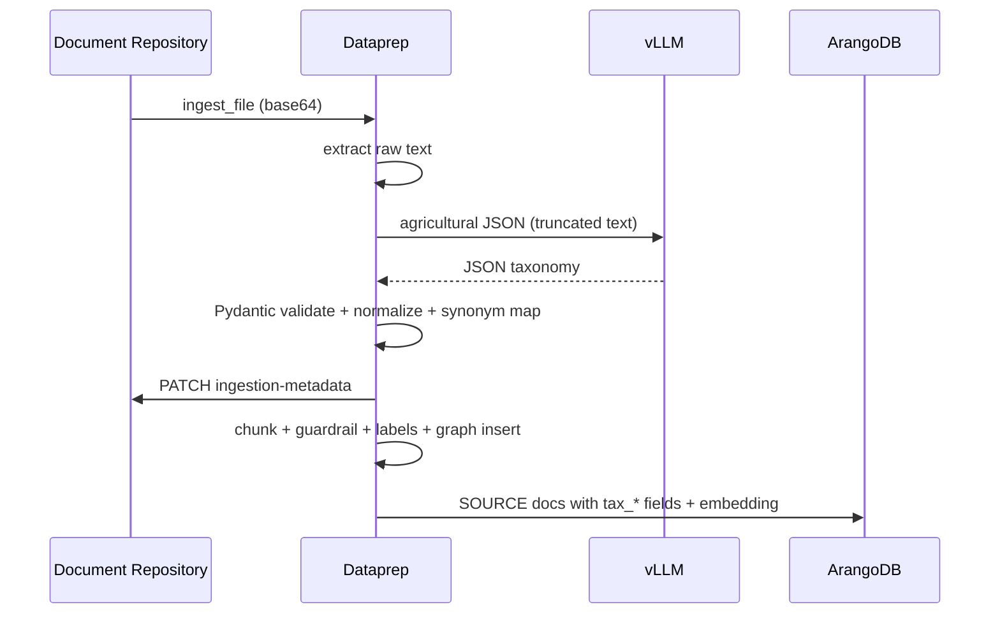

# Agricultural Taxonomy Metadata Layer — Architecture

## Executive summary

This extension adds a **document-level agricultural taxonomy extraction** step in the GENIE.AI dataprep service **after full-text extraction and before chunking**. Normalized metadata is persisted on the **files** collection (document-repository) and **denormalized onto every SOURCE chunk** in ArangoDB for metadata-filtered hybrid retrieval.

## Current platform flow (relevant parts)

| Stage | Component | Responsibility |
|-------|-----------|------------------|
| Upload | Vue → Kong → **document-repository** | ClamAV, store binary, `files` document in ArangoDB |
| Ingest trigger | Admin → **document-repository** `POST /api/files/:id/ingest` | Reads file, base64 → **dataprep** `POST /v1/dataprep/ingest_file` |
| Pipeline | **GenieArangoDataprep** (`genieai_dataprep_arangodb.py`) | Extract → (new) taxonomy → chunk → guardrail → label → graph + embeddings |
| Retrieval | **retriever** | Vector search on `{graph}_SOURCE` + optional `context` filters |

## Safest insertion point

**Inside `GenieArangoDataprep.ingest_file_with_guardrail`**, immediately after `_extract_raw_document_content` and **before** `_plain_chunks_from_content`.

Rationale:

- Full document text (or list segments from HTML loaders) is available without paying chunk-wise LLM calls.
- Chunk rows inherit the same taxonomy via `Document.metadata` merge before `add_graph_documents`.
- Failures in taxonomy can be logged; **fallback regex extraction** prevents hard-fail of ingestion (LLM failures fall back to `fallback_extract`).

## New components

| Area | Path / artifact |
|------|------------------|
| Python package | `genie-ai-overlay/dataprep/agri_metadata/` (schema, vocab, normalizer, JSON repair, fallback, extractor, prompts) |
| Dataprep integration | `genieai_dataprep_arangodb.py` — extract → taxonomy → chunk; `ensure` indexes on `{GRAPH}_SOURCE` |
| Doc repo API | `PATCH /api/files/:id/ingestion-metadata` (service account); `POST /api/files/:id/reextract-taxonomy` (Admin) |
| Dataprep API | `POST /v1/dataprep/reextract_taxonomy` — metadata-only refresh |
| Retrieval | `context.taxonomy_filters` on chat/retrieval requests; AQL `INTERSECTION` on `tax_*` fields |

## Risks and mitigations

| Risk | Mitigation |
|------|------------|
| LLM returns non-JSON | `json_utils.extract_json_object`, retries, `response_format=json_object` |
| Token cost on large PDFs | Head + tail truncation (`AGRI_TAXONOMY_MAX_INPUT_CHARS`) |
| Hallucinated geography | Pydantic `extra=forbid`; normalizer maps only LS/ZA into `Location.Country` |
| Chunk schema drift | Version field `tax_version` + full `taxonomy_metadata` snapshot on chunk |
| Prompt injection in PDF | `strip_prompt_injection_snippets` + instruction to ignore embedded directives |

## Sequence (ingestion)

## Schema migration

No automatic Arango **collection** migration is required: new attributes are added to **documents** as they are written. **Persistent indexes** on `tax_*` fields are created best-effort at ingest via `_ensure_taxonomy_indexes`.

Existing rows without `tax_*` fields are unaffected; **re-ingest** (retract + ingest) is required to populate chunk-level taxonomy for legacy documents.

## Related documents

- [INGESTION_LIFECYCLE.md](./INGESTION_LIFECYCLE.md)
- [TAXONOMY.md](./TAXONOMY.md)
- [ONBOARDING.md](./ONBOARDING.md)
