# Architecture Overview

High-level architecture of the GENIE.AI platform with Keycloak OIDC integration.

---

## 1. System Context

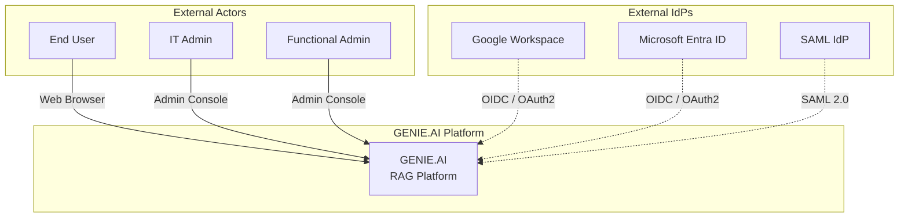

GENIE.AI is a sovereign RAG platform for the public sector. It authenticates users via Keycloak, which can broker to external identity providers (Google, Microsoft, SAML). Three actor personas interact with the system:

- **End User** -- interacts with the chat frontend to query documents
- **IT Admin** -- manages Keycloak realms, clients, and external IdP connections
- **Functional Admin** -- manages documents, categories, and service data

---

## 2. Service Architecture

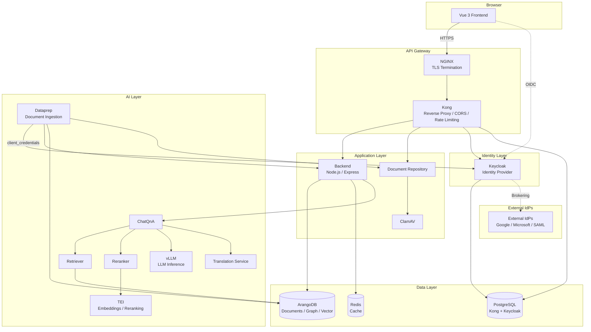

### Layer Descriptions

| Layer | Components | Purpose |
|-------|-----------|---------|
| Browser | Vue 3 Frontend | User interface, in-memory OIDC tokens |
| API Gateway | NGINX, Kong | TLS termination, reverse proxy, CORS, rate limiting |
| Application | Backend, Document Repository, ClamAV | Business logic, session management, file upload with virus scanning |
| Identity | Keycloak | User authentication, session management, identity brokering |
| Data | ArangoDB, Redis, PostgreSQL | Document storage, vector search, graph database; Redis caches backend translations; PostgreSQL stores Kong and Keycloak data |
| AI | ChatQnA, Retriever, Reranker, vLLM, TEI, Dataprep, Translation | RAG pipeline, embeddings, LLM inference |

---

## 3. Service Authentication Matrix

| Service | Auth Method | Notes |
|---------|-------------|-------|
| Frontend (Vue 3) | Keycloak OIDC | oidc-client-ts, tokens in-memory only |
| Backend (Node.js) | Keycloak JWT (JWKS) | Validates every request, performs JIT user provisioning, forwards Bearer token to upstream services |
| Document Repository | Keycloak JWT (JWKS) | Independent JWKS validation |
| OPEA ChatQnA | Keycloak JWT (JWKS) | Validates forwarded Bearer token independently; extracts user info from JWT payload |
| OPEA Dataprep | Keycloak client_credentials | Service account (KC_DATAPREP_CLIENT_ID/SECRET) |
| OPEA AI services | None | vLLM, TEI, reranker -- internal network only |
| Keycloak | N/A | Identity provider (source of truth for users, roles, sessions) |
| Kong | None | Pure reverse proxy |
| NGINX | TLS only | Terminates TLS, proxies to Kong |

---

## 4. User Authentication Flow

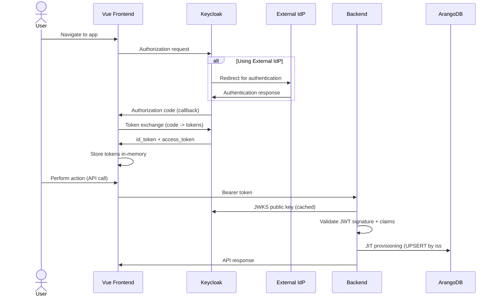

Keycloak serves as the sole identity authority. If an external IdP is configured, Keycloak brokers the authentication. On each authenticated API request, the backend validates the JWT and ensures the user exists in ArangoDB via just-in-time provisioning.

---

## 5. Token Validation and JWKS

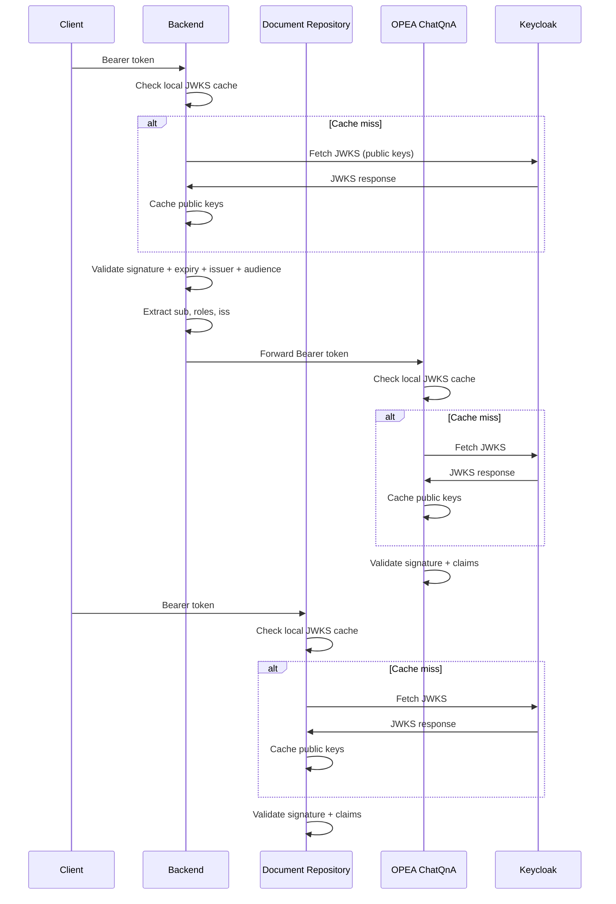

Each service independently validates JWTs against Keycloak JWKS. JWKS public keys are cached locally and refreshed on cache miss or key rotation. Services validate the token signature, expiry, issuer, and audience claims.

---

## 6. Token Lifecycle

### 6.1 Silent Token Renew

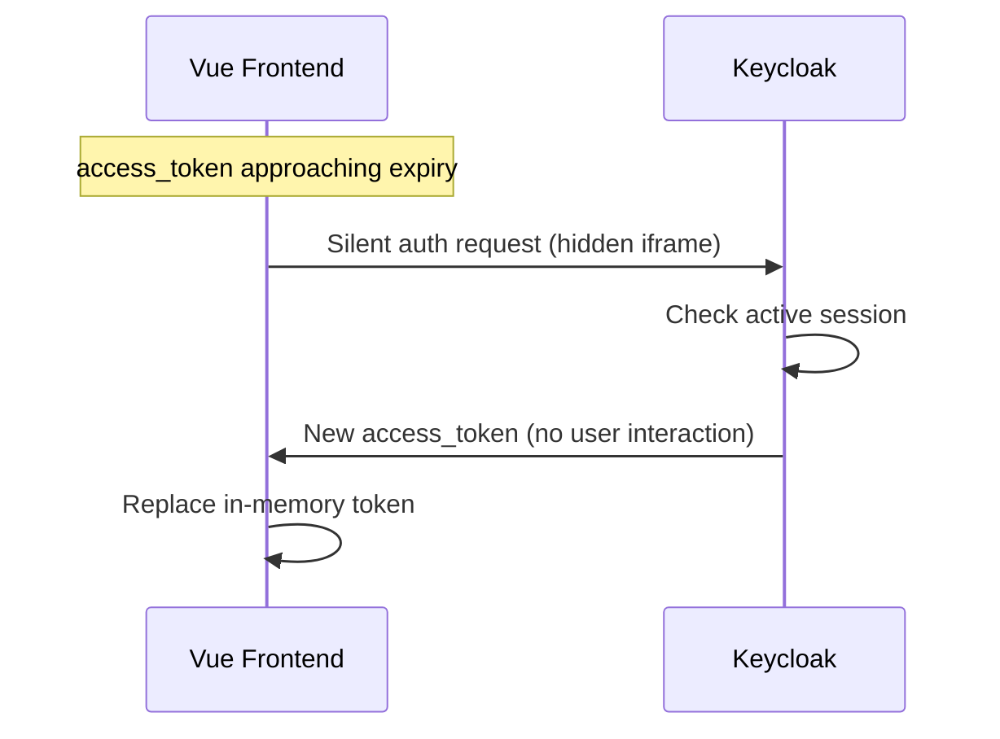

The frontend uses a silent renew mechanism (iframe) to obtain a new access_token from Keycloak before the current one expires. This happens transparently to the user as long as the Keycloak session is still valid.

### 6.2 Logout and Session Termination

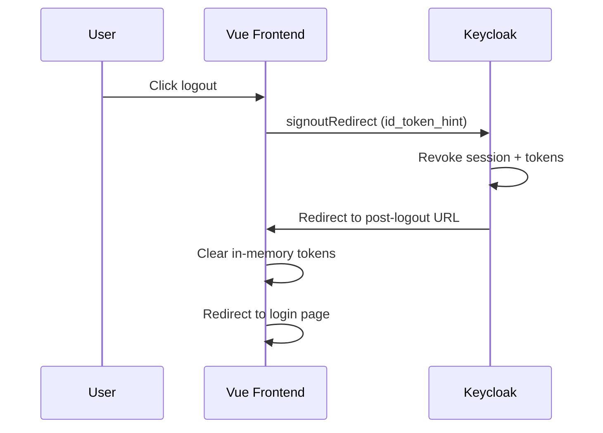

Logout is initiated by the frontend calling Keycloak's end_session_endpoint with the id_token_hint. Keycloak revokes all sessions and tokens, then redirects back. The frontend clears its in-memory token storage and redirects to the login page.

---

## 7. API Request Flow

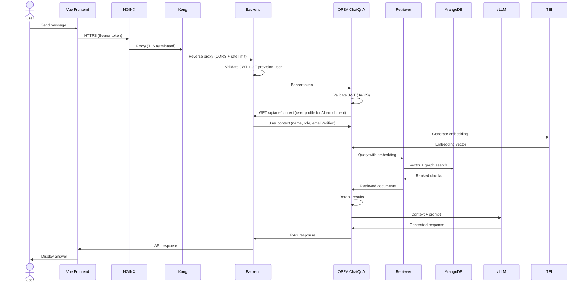

The RAG pipeline flows through the API gateway, backend, and OPEA services. The Bearer token is forwarded to ChatQnA, which performs independent JWKS validation. ChatQnA also fetches user context from the backend via `GET /api/me/context` to enrich AI prompts with user profile data.

---

## 8. Document Upload and Ingestion

### 8.1 Upload Flow

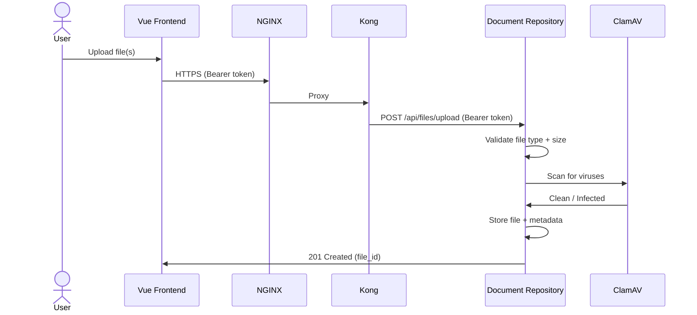

Users upload documents through the frontend to the Document Repository service. Files are validated (type, size), scanned by ClamAV, and stored with metadata. Upload requires an authenticated user with admin role.

### 8.2 Ingestion Flow

Ingestion is triggered manually by an admin after upload. The Document Repository proxies the request to the Dataprep service.

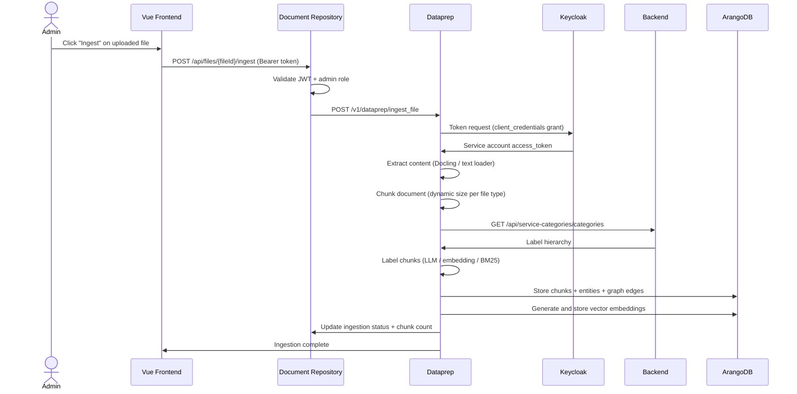

Dataprep uses a dedicated Keycloak client with the `client_credentials` grant type. This service account is separate from user tokens and has permissions scoped to document ingestion operations. The ingestion pipeline extracts content, chunks it, labels each chunk against the service taxonomy, constructs a knowledge graph (entities + relationships), generates vector embeddings, and stores everything in ArangoDB.

### 8.3 Document Retraction

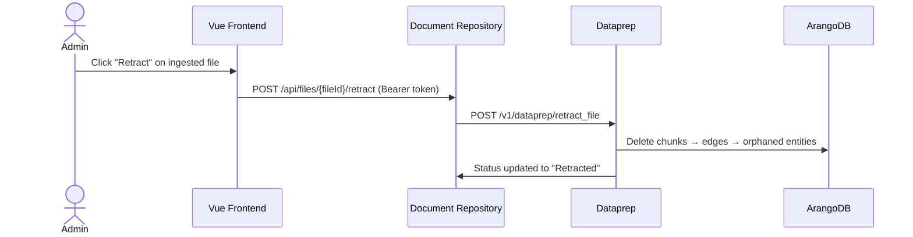

Retraction removes all graph data (chunks, entities, relationships) associated with a document while preserving the original file record for audit purposes.

---

## 9. Public vs Protected Routes

| Route | Access | Notes |
|-------|--------|-------|
| `/health` | Public | Health check endpoints |
| `/api-docs` | Public | Swagger API documentation |
| `/api/auth/callback` | Public | Keycloak OIDC callback redirect |
| `/api/auth/logout/callback` | Public | Keycloak post-logout callback |
| `/api/auth/logout` | Protected | User logout (Keycloak handles session invalidation) |
| `/api/me` | Protected | Current user profile singleton (GET, PUT) |
| `/api/me/context` | Protected | User context for AI enrichment |
| `/api/me/reset-data` | Protected | Reset user profile data |
| `/api/me/delete` | Protected | Delete user account (GDPR erasure) |
| `/api/*` | Protected | All other API routes require valid Bearer token |

Unauthenticated requests to protected routes receive a 401 response. The backend validates the JWT on every protected request before processing.

---

## 10. User Lifecycle

### 10.1 JIT Provisioning

On each authenticated request, the backend checks whether the user exists in ArangoDB. If not, it creates the user record using a composite key formed from the JWT issuer and subject (`iss#sub`). If the user already exists, the backend updates the user's metadata (name, email, roles) to stay in sync with Keycloak.

This ensures ArangoDB always reflects the current state from the identity provider. For detailed user management procedures, see the [Keycloak Admin Guide](keycloak-admin-guide.md).

### 10.2 User Disable and Delete Propagation

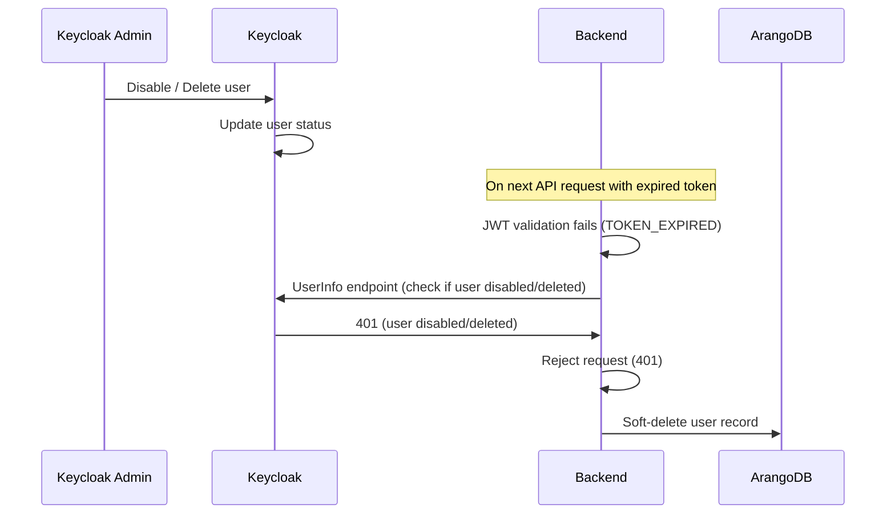

When a user is disabled or deleted in Keycloak, the propagation is handled at the next interaction point:

- **Disabled user**: The backend detects the disabled status during token validation and rejects the request. The user record in ArangoDB is soft-deleted.
- **Deleted user**: Tokens issued before deletion are rejected at validation time. The user record in ArangoDB is soft-deleted.

---

## 11. External Identity Providers

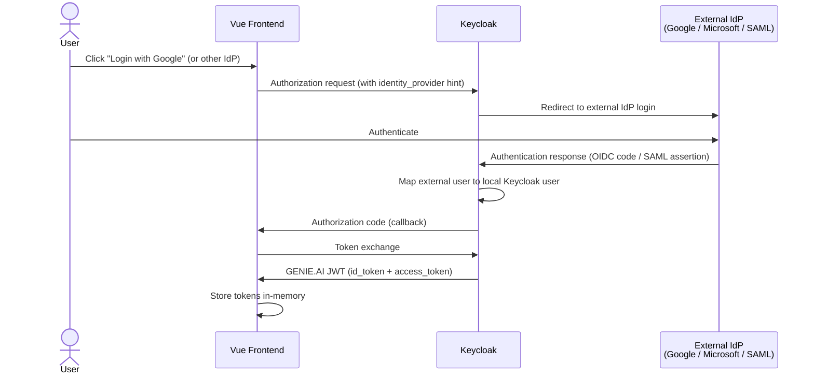

Keycloak acts as a broker between GENIE.AI and external identity providers. The external IdP authenticates the user, Keycloak maps the external identity to a local user, and issues a GENIE.AI-signed JWT. The frontend and backend only interact with Keycloak -- they are unaware of which external IdP was used.

For configuration details, see the [External IdP Integration Guide](external-idp-integration-guide.md).

---

## 12. API Gateway

The API gateway consists of two layers:

**NGINX** -- The outermost layer. Terminates TLS on port 443 and applies security headers. Proxies all requests to Kong.

**Kong** -- Sits behind NGINX and acts as a pure reverse proxy. Provides CORS configuration and rate limiting. Routes requests to backend services. No JWT validation is performed at the gateway level -- authentication is enforced at each service boundary.

Request path: `Browser -> NGINX (TLS) -> Kong (CORS, rate limit) -> Backend (JWT validation) -> Upstream services`

---

## 13. Key Decisions

| ID | Decision | Rationale |
|----|----------|-----------|
| D1 | Keycloak as sole identity authority | Eliminates local password management. Single source of truth for users, roles, and sessions. |
| D2 | Token passthrough to OPEA | The original user's Bearer token is forwarded to ChatQnA, which independently validates it via JWKS and extracts user identity from the JWT payload. No shared trust boundary. |
| D3 | JWT validation at service boundary | Each service (Backend, Document Repository, ChatQnA) validates tokens independently against Keycloak JWKS. No shared trust boundary at the gateway. |
| D4 | JIT user provisioning | ArangoDB user records are created or updated on every login. Keeps the application database in sync with the identity provider without requiring separate user management. |
| D5 | In-memory token storage | The frontend stores tokens in JavaScript memory only (no localStorage or sessionStorage). Mitigates token theft via XSS. |
| D6 | Dataprep service account | Dataprep authenticates via Keycloak client_credentials grant with a dedicated service account, separate from user tokens. |
| D7 | Gateway architecture | NGINX terminates TLS and proxies all traffic to Kong. Kong provides CORS and rate limiting. Both are required in the current configuration — Kong cannot be bypassed. |
| D8 | `/api/me` singleton resource | After Keycloak migration, the frontend has no access to ArangoDB `_key` (only OIDC claims). A singleton `/api/me` resource eliminates the need for path-based user IDs. User resolution happens via JWT middleware (`req.user._key`). The `_key` never leaves the backend. |

---

## 14. Further Reading

- [Keycloak Admin Guide](keycloak-admin-guide.md) -- Realm configuration, user management, client setup
- [Docker Compose Setup](docker-compose-setup.md) -- Local development deployment with Docker Compose
- [Docker Swarm Setup](docker-swarm-setup.md) -- Production deployment with Docker Swarm and Ansible
- [External IdP Integration Guide](external-idp-integration-guide.md) -- Connecting Google, Microsoft, and SAML identity providers
- [E2E Tests](e2e-tests/README.md) -- End-to-end test procedures for authentication and session lifecycle
