# Architecture Overview

High-level architecture of the GENIE.AI platform with Keycloak OIDC integration.

---

## 1. System Context

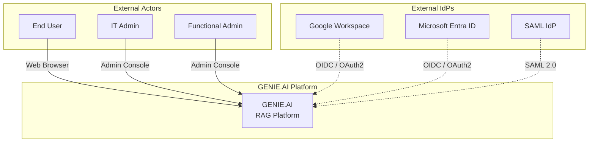

GENIE.AI is a sovereign RAG platform for the public sector. It authenticates users via Keycloak, which can broker to external identity providers (Google, Microsoft, SAML). Three actor personas interact with the system:

- **End User** -- interacts with the chat frontend to query documents
- **IT Admin** -- manages Keycloak realms, clients, and external IdP connections
- **Functional Admin** -- manages documents, categories, and service data

---

## 2. Service Architecture

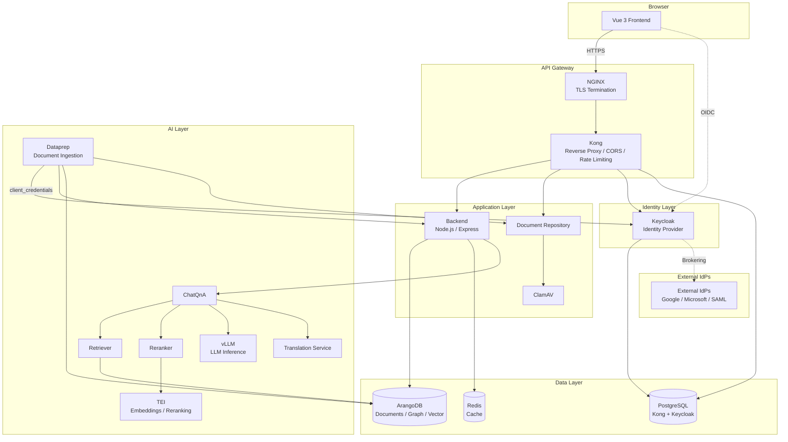

### Layer Descriptions

| Layer | Components | Purpose |
|-------|-----------|---------|
| Browser | Vue 3 Frontend | User interface, in-memory OIDC tokens |
| API Gateway | NGINX, Kong | TLS termination, reverse proxy, CORS, rate limiting |
| Application | Backend, Document Repository, ClamAV | Business logic, session management, file upload with virus scanning |
| Identity | Keycloak | User authentication, session management, identity brokering |
| Data | ArangoDB, Redis, PostgreSQL | Document storage, vector search, graph database; Redis caches backend translations; PostgreSQL stores Kong and Keycloak data |
| AI | ChatQnA, Retriever, Reranker, vLLM, TEI, Dataprep, Translation | RAG pipeline, embeddings, LLM inference |

---

## 3. Service Authentication Matrix

| Service | Auth Method | Notes |
|---------|-------------|-------|
| Frontend (Vue 3) | Keycloak OIDC | oidc-client-ts, tokens in-memory only |
| Backend (Node.js) | Keycloak JWT (JWKS) | Validates every request, performs JIT user provisioning, forwards Bearer token to upstream services |
| Document Repository | Keycloak JWT (JWKS) | Independent JWKS validation |
| OPEA ChatQnA | Keycloak JWT (JWKS) | Validates forwarded Bearer token independently; extracts user info from JWT payload |
| OPEA Dataprep | Keycloak client_credentials | Service account (KC_DATAPREP_CLIENT_ID/SECRET) |
| OPEA AI services | None | vLLM, TEI, reranker -- internal network only |
| Keycloak | N/A | Identity provider (source of truth for users, roles, sessions) |
| Kong | None | Pure reverse proxy |
| NGINX | TLS only | Terminates TLS, proxies to Kong |

### 3.1 Cross-Cutting Services

| Service Type | Components | Purpose |
|--------------|-----------|---------|
| Testing | Jest (backend, frontend, doc-repo), pytest (OPEA), flutter_test (mobile), Playwright (E2E) | Unit, integration, and end-to-end testing with CI pipeline |
| Observability | OTel Collector, VictoriaMetrics, VictoriaLogs, VictoriaTraces, Grafana | Distributed tracing, metrics, logs, dashboards, alerting |

---

## 4. Testing Architecture

### 4.1 Test Framework Matrix

| Component | Test Framework | Test Directory | Coverage |
|-----------|---------------|----------------|----------|
| Backend | Jest (supertest) | `components/gov-chat-backend/__tests__/` | Unit + integration tests for routes, controllers, services |
| Frontend | Jest + Vue Test Utils | `components/gov-chat-frontend/src/__tests__/` | Component unit tests, Vuex store tests |
| Document Repository | Jest (supertest) | `components/document-repository/__tests__/` | Upload, ClamAV scanning, metadata tests |
| OPEA ChatQnA | pytest | `genie-ai-overlay/chatqna/tests/` | Python unit + integration tests |
| OPEA Retriever | pytest | `genie-ai-overlay/retriever/tests/` | Vector + graph retrieval tests |
| OPEA Dataprep | pytest | `genie-ai-overlay/dataprep/tests/` | Ingestion, chunking, labeling tests |
| Mobile | flutter_test | `mobile/genie_ai_mobile/test/` | Widget + integration tests |
| E2E | Playwright | `tests/e2e/` | Multi-phase procedure tests (auth, chat, upload) |
| Config Validation | Jest | `tests/config-validator/` | Environment variable coverage, secret validation |

### 4.2 CI Pipeline Flow

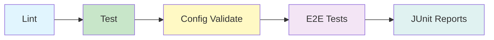

The GitLab CI pipeline (`.gitlab-ci.yml`) executes in four stages:

1. **Lint** — ESLint (JS), Ruff (Python), Dart analyzer (Flutter)
2. **Test** — Unit + integration tests (Jest, pytest, flutter_test)
3. **Config Validate** — Verify environment variable coverage, required secrets, conflicting configs
4. **E2E Tests** — Playwright multi-phase procedures (authentication, chat, document upload, ingestion)

All test stages generate JUnit XML reports for GitLab to display in merge request widgets and block merging on failure.

### 4.3 Backend Testability Pattern

The backend uses a `createApp()` pattern to enable route testing without starting an HTTP server:

```javascript
// index.js
export function createApp() {
  const app = express();
  // ... middleware and routes
  return app;
}

// __tests__/integration/chat.test.js
import { createApp } from '../index';
import request from 'supertest';

describe('POST /api/chat', () => {
  it('should return chat response', async () => {
    const app = createApp();
    const response = await request(app)
      .post('/api/chat')
      .send({ message: 'test' });
    expect(response.status).toBe(200);
  });
});
```

This pattern allows `supertest` to test Express routes directly without binding to a network port, enabling fast parallel test execution.

---

## 5. Observability Architecture

### 5.1 Distributed Tracing Flow

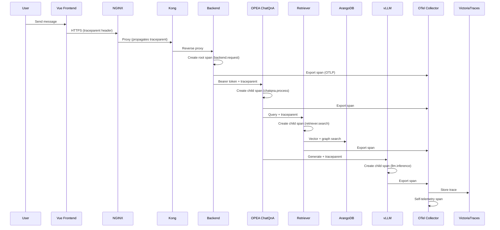

### 5.2 Trace Propagation

All services use W3C Trace Context (`traceparent` header) for distributed tracing:

| Header | Format | Purpose |
|--------|--------|---------|
| `traceparent` | `00-{trace-id}-{parent-id}-{trace-flags}` | W3C standard for trace context propagation |

Trace propagation chain:
1. **Backend** (Node.js) — Creates root span, injects `traceparent` into upstream requests
2. **OPEA ChatQnA** (Python FastAPI) — Extracts context, creates child spans
3. **OPEA Retriever/Reranker/vLLM** — Propagate context through RAG pipeline
4. **OTel Collector** — Receives spans via OTLP, exports to VictoriaTraces

### 5.3 Service Instrumentation

| Service | Instrumentation | Tracing Library | Key Spans |
|---------|---------------|-----------------|-----------|
| Backend | `tracing.js`, `tracing-db.js`, `tracing-pii.js`, `metrics.js` | `@opentelemetry/api` + `@opentelemetry/sdk-node` | HTTP requests, database queries, PII redaction |
| OPEA ChatQnA | `genie-ai-overlay/tracing.py` | OpenTelemetry Python + FastAPI | Request processing, LLM calls, retries |
| OPEA Retriever | OpenTelemetry Python | Vector search, graph queries |
| OPEA Dataprep | OpenTelemetry Python | Ingestion, chunking, labeling |
| Kong (optional) | OTel plugin | Request routing (sampling controlled by `KONG_TRACING_SAMPLING_RATE`) |

### 5.4 Victoria Storage Stack

| Component | Purpose | Retention | Port |
|-----------|---------|-----------|------|
| VictoriaMetrics | Metric storage (Prometheus compatible) | 30d (configurable) | 8428 |
| VictoriaLogs | Log storage (fluentd receiver) | 30d (configurable) | 9428 |
| VictoriaTraces | Distributed trace storage | 30d (configurable) | 10428 |

### 5.5 OTel Collection

The OTel Collector runs in `mode: global` (one instance per Swarm node) and receives:

1. **Traces/Metrics** — Via OTLP HTTP receiver (port 4318) from instrumented services
2. **Logs** — Via fluentd receiver (port 24224) from Docker fluentd logging driver
3. **Self-telemetry** — Collector generates its own spans/metrics for monitoring

Collection flow:
```
Service stdout/stderr → Docker fluentd driver → OTel Collector (fluent_forward) → VictoriaLogs
Service traces/metrics → OTLP HTTP → OTel Collector → VictoriaTraces/VictoriaMetrics
```

### 5.6 Grafana Dashboards and Alerting

Grafana provides 10 pre-built dashboards across two folders:

**Application dashboards (General folder):**

| Dashboard | Purpose | Data Source |
|-----------|---------|-------------|
| Service Health | Service uptime, error rates, latency | VictoriaMetrics |
| Application Metrics | Custom business metrics (requests, users) | VictoriaMetrics |
| Logs Explorer | Log aggregation, filtering, search | VictoriaLogs |
| Trace Explorer | Distributed trace search, waterfall | VictoriaTraces (Jaeger) |
| RAG Waterfall | End-to-end RAG pipeline latency | VictoriaTraces |
| Stack Health | Infrastructure metrics (CPU, memory) | VictoriaMetrics |

**Infrastructure dashboards (Observability folder):**

| Dashboard | Purpose | Data Source |
|-----------|---------|-------------|
| VictoriaMetrics Single Node | VM internal metrics and health | VictoriaMetrics |
| VictoriaLogs Single Node | VL ingestion and storage metrics | VictoriaLogs |
| VictoriaTraces Single Node | VT trace processing metrics | VictoriaTraces |
| Observability Stack Health | Collector, storage, ingestion overview | VictoriaMetrics |

**Alerting** — Grafana alert rules notify on:
- Collector down (missed heartbeat)
- Storage filling (>80% disk usage)
- Log pipeline broken (no log entries)
- Trace export failure (high error rate)

### 5.7 Configuration

Observability is **disabled by default**. Enable via:

| Method | Configuration |
|--------|---------------|
| Docker Compose | `docker compose --profile observability up -d` |
| Docker Swarm | `ENABLE_OBSERVABILITY=1` in `.env` (MUST be `0` or `1`) |
| Ansible | `enable_observability: "1"` in `group_vars/all.yml` |

**Environment variables** (`.env` Section 12C):
- `ENABLE_OBSERVABILITY` — Enable/disable the stack (default: `0`)
- `GRAFANA_ADMIN_USER` / `GRAFANA_ADMIN_PASSWORD` — Grafana credentials
- `VICTORIALOGS_RETENTION` / `VICTORIATRACES_RETENTION` / `VICTORIAMETRICS_RETENTION` — Data retention
- `OTEL_TRACES_SAMPLER_RATE` — Trace sampling rate (default: 100.0 = 100%)

**Config files**:
- `configs/otel/otel-collector-config.yaml` — Collector receivers, processors, exporters
- `configs/grafana/provisioning/` — Datasources + dashboards (auto-provisioned)

---

## 6. User Authentication Flow

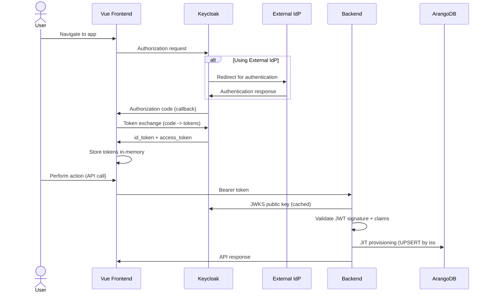

Keycloak serves as the sole identity authority. If an external IdP is configured, Keycloak brokers the authentication. On each authenticated API request, the backend validates the JWT and ensures the user exists in ArangoDB via just-in-time provisioning.

---

## 7. Token Validation and JWKS

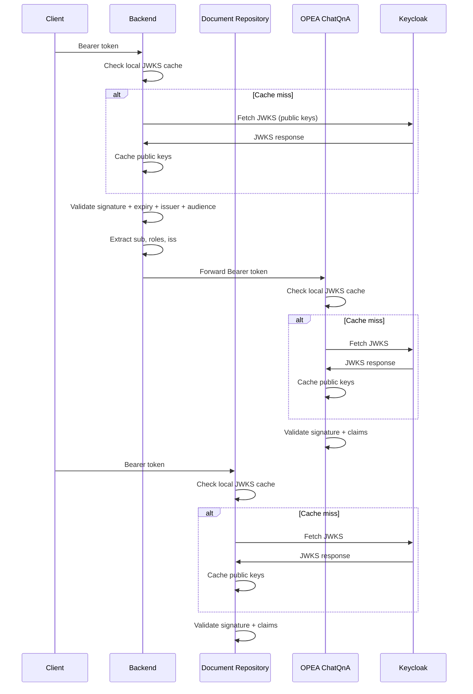

Each service independently validates JWTs against Keycloak JWKS. JWKS public keys are cached locally and refreshed on cache miss or key rotation. Services validate the token signature, expiry, issuer, and audience claims.

---

## 8. Token Lifecycle

### 8.1 Silent Token Renew

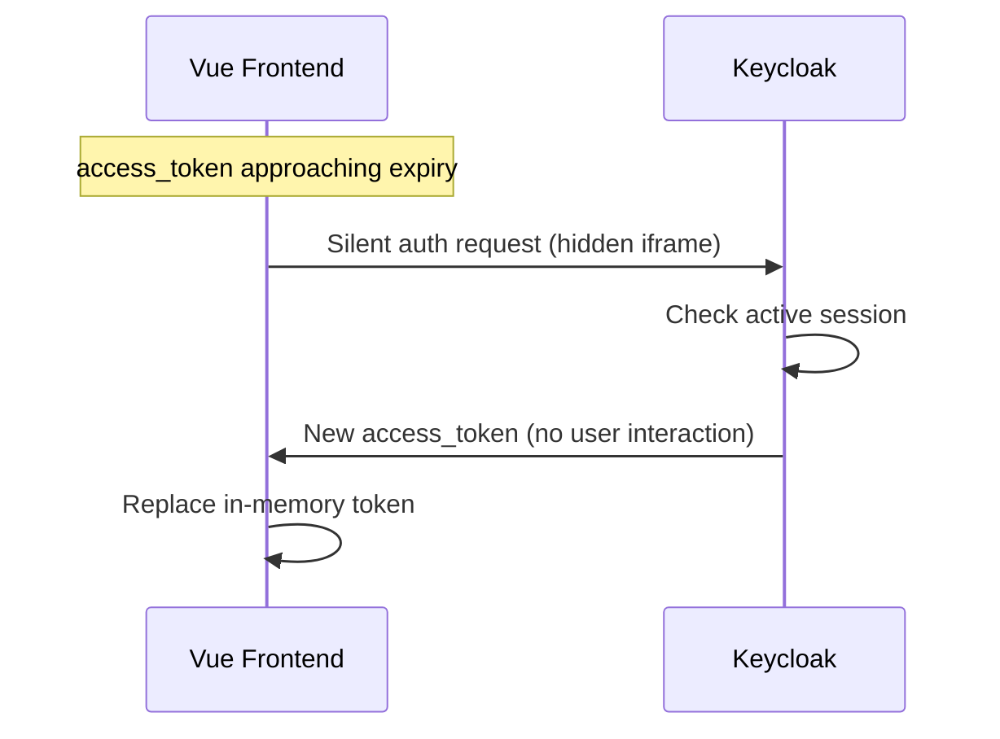

The frontend uses a silent renew mechanism (iframe) to obtain a new access_token from Keycloak before the current one expires. This happens transparently to the user as long as the Keycloak session is still valid.

### 8.2 Logout and Session Termination

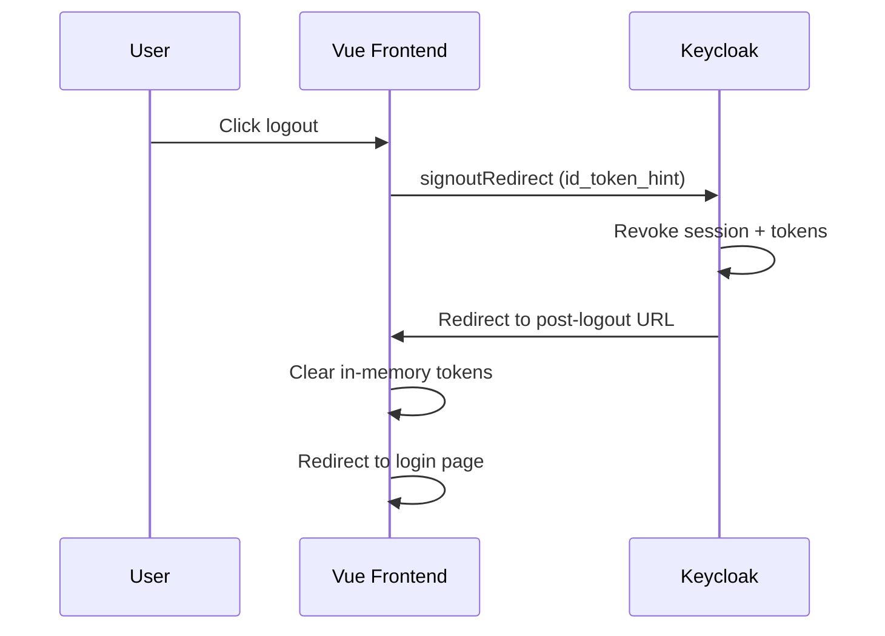

Logout is initiated by the frontend calling Keycloak's end_session_endpoint with the id_token_hint. Keycloak revokes all sessions and tokens, then redirects back. The frontend clears its in-memory token storage and redirects to the login page.

---

## 9. API Request Flow

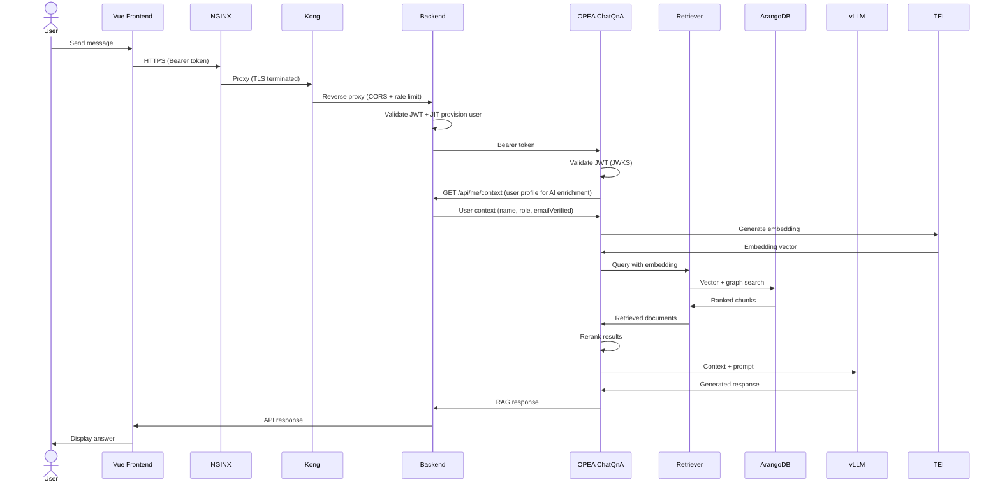

The RAG pipeline flows through the API gateway, backend, and OPEA services. The Bearer token is forwarded to ChatQnA, which performs independent JWKS validation. ChatQnA also fetches user context from the backend via `GET /api/me/context` to enrich AI prompts with user profile data.

### 9.2 RAG Pipeline with Distributed Tracing

Each stage of the RAG pipeline emits OTel spans for observability:

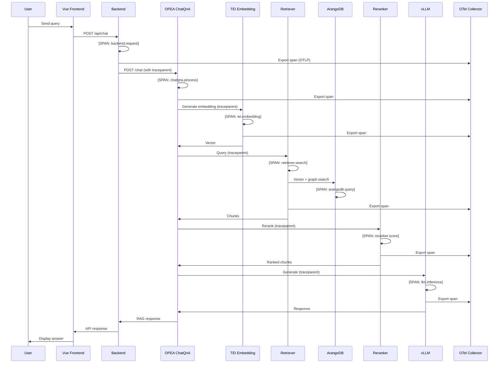

**Key spans emitted:**
- `backend.request` — Backend HTTP request processing
- `chatqna.process` — ChatQnA orchestration (root span for RAG)
- `tei.embedding` — Embedding generation
- `retriever.search` — Vector + graph retrieval
- `arangodb.query` — Database query execution
- `reranker.score` — Result reranking
- `llm.inference` — LLM generation

All spans include:
- **Parent-child relationships** (via `traceparent` header)
- **Attributes** (model IDs, chunk counts, latency, error codes)
- **Events** (LLM prompt start, retrieval completion, etc.)

### 9.3 Reranker Strategies

The reranker (`genie-ai-overlay/reranker/genieai_tei_reranker.py`) re-scores retrieved chunks with the TEI cross-encoder model and selects the subset forwarded to the LLM. The selection strategy is controlled by `RERANKING_STRATEGY` (default `adaptive`; set on the ChatQnA orchestrator and forwarded in the rerank request):

| Strategy | Behaviour |
|----------|-----------|
| `slice` | Top-N by reranker score (N = `RERANKER_TOP_N`). |
| `threshold` | All chunks scoring ≥ `RERANKING_THRESHOLD`. |
| `slice_threshold` | Top-N, but only chunks scoring ≥ `RERANKING_THRESHOLD` (early-exit on TEI's descending sort). |
| `knee_threshold` | Keep chunks up to the "knee" of the score curve ([kneed](https://kneed.readthedocs.io/) algorithm), else all. |
| `adaptive` | **Utility-cost selection** (see below). **Default.** |

#### Adaptive utility-cost selection

Instead of a fixed count or hard threshold, the `adaptive` strategy keeps each chunk only when its **marginal value** exceeds `MIN_VALUE_THRESHOLD`:

```
value   = utility − cost
utility = relevance × novelty_weight
cost    = token_cost + confusion_cost
```

- **relevance** — reranker score, boosted above the skew-adjusted mean.
- **novelty** — penalises redundancy with already-selected chunks (cosine similarity), MMR-style; candidates are processed in descending score order.
- **token_cost** — each chunk consumes context-window budget.
- **confusion_cost** — low-confidence chunks risk degrading the answer.

This yields a non-redundant, confidence- and budget-aware context set — useful under tight context limits or noisy retrieval.

**Embedding flow (adaptive only):** the query embedding (produced by the embedding node, carried in the `embedding` field) and per-chunk embeddings (fetched by the retriever from ArangoDB) are propagated through `ChatQnA.align_outputs` to the reranker. If embeddings are missing or misaligned, `adaptive` raises a `RuntimeError` (no silent fallback — this surfaces integration bugs immediately).

**Tuning parameters** (reranker service environment):

| Variable | Default | Purpose |
|----------|---------|---------|
| `NOVELTY_SIGMOID_A` | `20.0` | novelty→weight logistic steepness |
| `NOVELTY_SIGMOID_B` | `0.25` | novelty→weight logistic midpoint |
| `CONTEXT_DECAY_FACTOR` | `0.0025` | per-token context cost coefficient |
| `MIN_VALUE_THRESHOLD` | `-1.0` | marginal-value cutoff (keep a chunk only if value > threshold) |

### 9.4 Confidence Scoring

The user-facing `confidence_score` (emitted in the chat metadata event) is a **rank-weighted aggregate of calibrated reranker scores**, computed in `ChatQnA._assemble_source_documents` (`genie-ai-overlay/chatqna/genieai_chatqna.py`). It replaced an earlier arithmetic mean of the displayed reranker scores, which had three problems:

1. **Metadata-failure bug** — a failed document-metadata lookup previously injected `score = 0` into the aggregation (and surfaced a synthetic `document_id:"error"` source), intermittently tanking the score. Failed lookups now skip the document entirely.
2. **Uncalibrated scale** — cross-encoder rerankers (`bge-reranker-v2-m3`) emit relevance *logits*, not probabilities; the flat mean had no probabilistic meaning.
3. **Mean pathology** — count-dependent and tail-sensitive: low-scoring-but-novel chunks kept by the `adaptive` strategy depressed the mean, so richer context was *punished*.

**Aggregation:** scores are aggregated with exponential rank-decay weighting (rank 0 = most relevant, since reranker verdicts are descending), so the strongest match dominates and the tail no longer depresses the score. The grounding decision itself is unchanged — `is_grounded` is `True` iff at least one document passed the reranker.

| Variable | Default | Purpose |
|----------|---------|---------|
| `CONFIDENCE_RANK_DECAY` | `0.5` | exponential weight decay per rank; higher → top document dominates more. |
| `RERANKER_SCORE_CALIBRATION` | `none` | `none` \| `sigmoid` — map raw logits to [0,1]. Enable `sigmoid` **only** after verifying the TEI/model returns raw logits (sigmoid on already-normalised scores compresses them). |
| `RERANKER_SCORE_TEMPERATURE` | `1.0` | temperature for `sigmoid` calibration. |

#### LLM self-grade (opt-in, off by default)

When `LLM_SELF_CONFIDENCE_ENABLED=1`, the system prompt instructs the model to end its reply with a `[[CONF:<0-100>]]` sentinel rating how well the retrieved documents support the answer. ChatQnA strips the sentinel **before** the text reaches the user or the translation pipeline (streaming and non-streaming) and exposes the value as a supplementary `self_confidence` field in the metadata event, alongside `confidence_score`. A missing/malformed sentinel yields `null` (never a hard failure).

This is an **LLM self-assessment**, not an independent measurement of groundedness — it is exposed for evaluation, not as a replacement for the retrieval confidence or the `is_grounded` flag. Surface it to end users only after the calibration eval harness confirms it tracks answer correctness.

---

## 10. Document Upload and Ingestion

### 10.1 Upload Flow

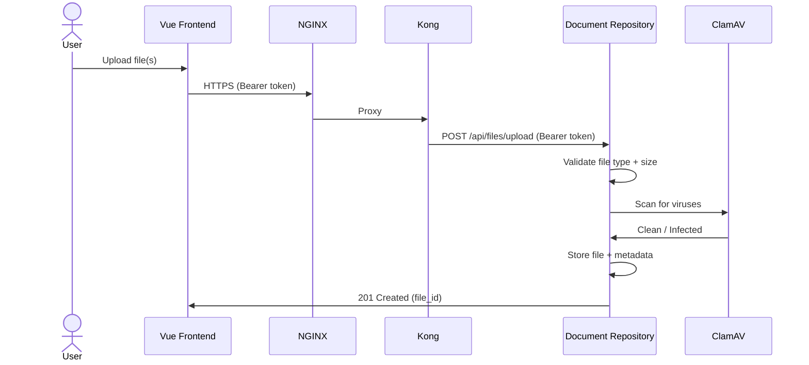

Users upload documents through the frontend to the Document Repository service. Files are validated (type, size), scanned by ClamAV, and stored with metadata. Upload requires an authenticated user with admin role.

### 10.2 Ingestion Flow

Ingestion is triggered manually by an admin after upload. The Document Repository proxies the request to the Dataprep service.

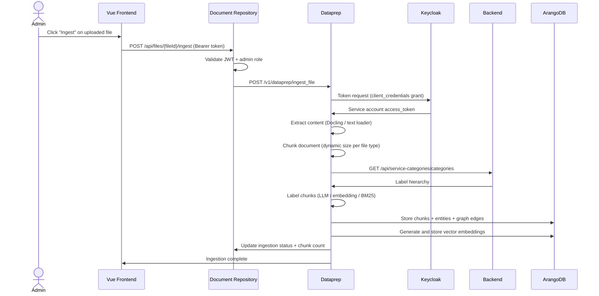

Dataprep uses a dedicated Keycloak client with the `client_credentials` grant type. This service account is separate from user tokens and has permissions scoped to document ingestion operations. The ingestion pipeline extracts content, chunks it, labels each chunk against the service taxonomy, constructs a knowledge graph (entities + relationships), generates vector embeddings, and stores everything in ArangoDB.

> **Contextual Retrieval (optional).** When `CONTEXTUAL_RETRIEVAL_ENABLED=true`, the dataprep generates an LLM document-context prefix per chunk (after chunking, before embedding) so chunks carry the document's subject. `CONTEXTUAL_STRATEGY` selects `per_chunk` (one call/chunk, tailored) or `doc_level` (one call/doc, N× cheaper). `CONTEXTUAL_LABEL_RAW=true` (recommended) decouples: label the **raw** chunk, use the context only for the **embedding** — keeps label precision while propagating the subject via the vector. Default off (true no-op). See `GENIE.AI-Data-Labelling-Strategy.md` §7.

### 10.3 Document Retraction

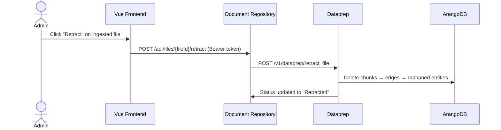

Retraction removes all graph data (chunks, entities, relationships) associated with a document while preserving the original file record for audit purposes.

---

## 11. Public vs Protected Routes

| Route | Access | Notes |
|-------|--------|-------|
| `/health` | Public | Health check endpoints |
| `/api-docs` | Public | Swagger API documentation |
| `/api/auth/callback` | Public | Keycloak OIDC callback redirect |
| `/api/auth/logout/callback` | Public | Keycloak post-logout callback |
| `/api/auth/logout` | Protected | User logout (Keycloak handles session invalidation) |
| `/api/me` | Protected | Current user profile singleton (GET, PUT) |
| `/api/me/context` | Protected | User context for AI enrichment |
| `/api/me/reset-data` | Protected | Reset user profile data |
| `/api/me/delete` | Protected | Delete user account (GDPR erasure) |
| `/api/*` | Protected | All other API routes require valid Bearer token |

Unauthenticated requests to protected routes receive a 401 response. The backend validates the JWT on every protected request before processing.

---

## 12. User Lifecycle

### 12.1 JIT Provisioning

On each authenticated request, the backend checks whether the user exists in ArangoDB. If not, it creates the user record using a composite key formed from the JWT issuer and subject (`iss#sub`). If the user already exists, the backend updates the user's metadata (name, email, roles) to stay in sync with Keycloak.

This ensures ArangoDB always reflects the current state from the identity provider. For detailed user management procedures, see the [Keycloak Admin Guide](keycloak-admin-guide.md).

### 12.2 User Disable and Delete Propagation

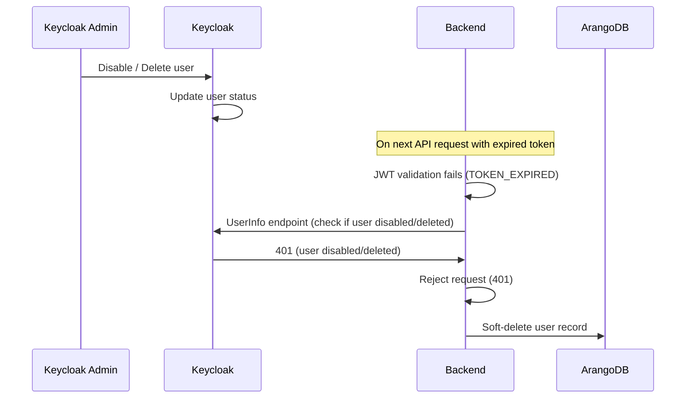

When a user is disabled or deleted in Keycloak, the propagation is handled at the next interaction point:

- **Disabled user**: The backend detects the disabled status during token validation and rejects the request. The user record in ArangoDB is soft-deleted.
- **Deleted user**: Tokens issued before deletion are rejected at validation time. The user record in ArangoDB is soft-deleted.

---

## 13. External Identity Providers

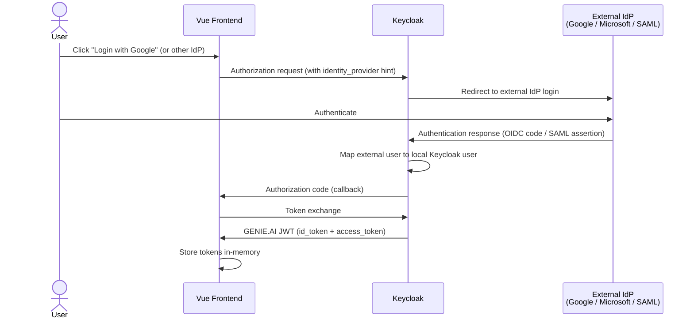

Keycloak acts as a broker between GENIE.AI and external identity providers. The external IdP authenticates the user, Keycloak maps the external identity to a local user, and issues a GENIE.AI-signed JWT. The frontend and backend only interact with Keycloak -- they are unaware of which external IdP was used.

For configuration details, see the [External IdP Integration Guide](external-idp-integration-guide.md).

---

## 14. API Gateway

The API gateway consists of two layers:

**NGINX** -- The outermost layer. Terminates TLS on port 443 and applies security headers. Proxies all requests to Kong. For Keycloak traffic (`/auth/`), NGINX sets `X-Forwarded-Proto`, `X-Forwarded-Host`, and `X-Forwarded-Port` so Keycloak can resolve its public URL dynamically.

**Kong** -- Sits behind NGINX and acts as a pure reverse proxy. Provides CORS configuration and rate limiting. Routes requests to backend services. No JWT validation is performed at the gateway level -- authentication is enforced at each service boundary.

Request path: `Browser -> NGINX (TLS) -> Kong (CORS, rate limit) -> Backend (JWT validation) -> Upstream services`

### 14.1 Reverse Proxy Header Chain for Keycloak

Keycloak runs behind the NGINX → Kong proxy chain with the `/auth` path prefix. The following headers are used to tell Keycloak its public URL:

```
Client → NGINX → Kong → Keycloak
            │         │       │
            │    X-Forwarded-Prefix: /auth
            │    (strip_path removes /auth)
            │         │
     X-Forwarded-Proto: https
     X-Forwarded-Host: <NGINX_PUBLIC_DOMAIN>
     X-Forwarded-Port: <NGINX_HTTPS_PORT>
```

| Header | Set by | Value | Purpose |
|--------|--------|-------|---------|
| `X-Forwarded-Proto` | NGINX | `https` | Keycloak uses HTTPS in issuer URLs |
| `X-Forwarded-Host` | NGINX | `NGINX_PUBLIC_DOMAIN` | Keycloak uses the public hostname in issuer URLs |
| `X-Forwarded-Port` | NGINX | `NGINX_HTTPS_PORT` | Keycloak uses the public port (not internal 443) |
| `X-Forwarded-Prefix` | Kong (request-transformer plugin) | `/auth` | Keycloak resolves context path dynamically |

**Kong trusted_ips**: Kong must trust NGINX to preserve the `X-Forwarded-*` headers set by NGINX. Without `KONG_TRUSTED_IPS`, Kong overwrites them with its own values (http/port 8000). Default: `172.16.0.0/12` (Docker bridge subnets).

**Keycloak configuration**:
- `KC_PROXY_HEADERS=xforwarded` -- tells Keycloak to read proxy headers
- `KC_HOSTNAME=<hostname>` -- simple hostname (no scheme/port/path), Keycloak resolves the full URL from headers
- Keycloak 26.6.1+ required for `X-Forwarded-Prefix` support (bug #35298 in earlier versions)

This approach (docs option 1: X-Forwarded-Prefix) avoids hardcoding a full URL in `KC_HOSTNAME`, making the deployment portable across environments without rebuilding the Keycloak image.

---

## 15. Key Decisions

| ID | Decision | Rationale |
|----|----------|-----------|
| D1 | Keycloak as sole identity authority | Eliminates local password management. Single source of truth for users, roles, and sessions. |
| D2 | Token passthrough to OPEA | The original user's Bearer token is forwarded to ChatQnA, which independently validates it via JWKS and extracts user identity from the JWT payload. No shared trust boundary. |
| D3 | JWT validation at service boundary | Each service (Backend, Document Repository, ChatQnA) validates tokens independently against Keycloak JWKS. No shared trust boundary at the gateway. |
| D4 | JIT user provisioning | ArangoDB user records are created or updated on every login. Keeps the application database in sync with the identity provider without requiring separate user management. |
| D5 | In-memory token storage | The frontend stores tokens in JavaScript memory only (no localStorage or sessionStorage). Mitigates token theft via XSS. |
| D6 | Dataprep service account | Dataprep authenticates via Keycloak client_credentials grant with a dedicated service account, separate from user tokens. |
| D7 | Gateway architecture | NGINX terminates TLS and proxies all traffic to Kong. Kong provides CORS and rate limiting. Both are required in the current configuration — Kong cannot be bypassed. |
| D8 | `/api/me` singleton resource | After Keycloak migration, the frontend has no access to ArangoDB `_key` (only OIDC claims). A singleton `/api/me` resource eliminates the need for path-based user IDs. User resolution happens via JWT middleware (`req.user._key`). The `_key` never leaves the backend. |

---

## 16. Further Reading

- [Keycloak Admin Guide](keycloak-admin-guide.md) -- Realm configuration, user management, client setup
- [Docker Compose Setup](docker-compose-setup.md) -- Local development deployment with Docker Compose
- [Docker Swarm Setup](docker-swarm-setup.md) -- Production deployment with Docker Swarm and Ansible
- [Ansible Deployment](../deploy/ansible/README.md) -- Automated Docker Swarm deployment with per-environment secrets
- [OTel Collector Integration](../configs/otel/README.md) -- Observability stack configuration (OTel Collector, VictoriaMetrics, VictoriaLogs, VictoriaTraces, Grafana)
- [External IdP Integration Guide](external-idp-integration-guide.md) -- Connecting Google, Microsoft, and SAML identity providers
- [E2E Tests](e2e-tests/README.md) -- End-to-end test procedures for authentication and session lifecycle
