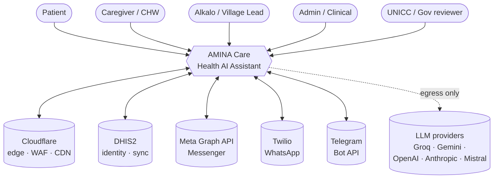
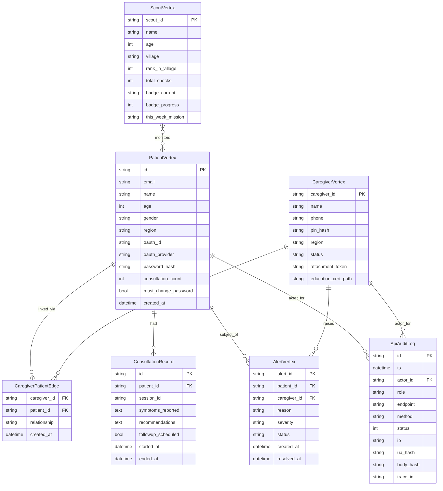
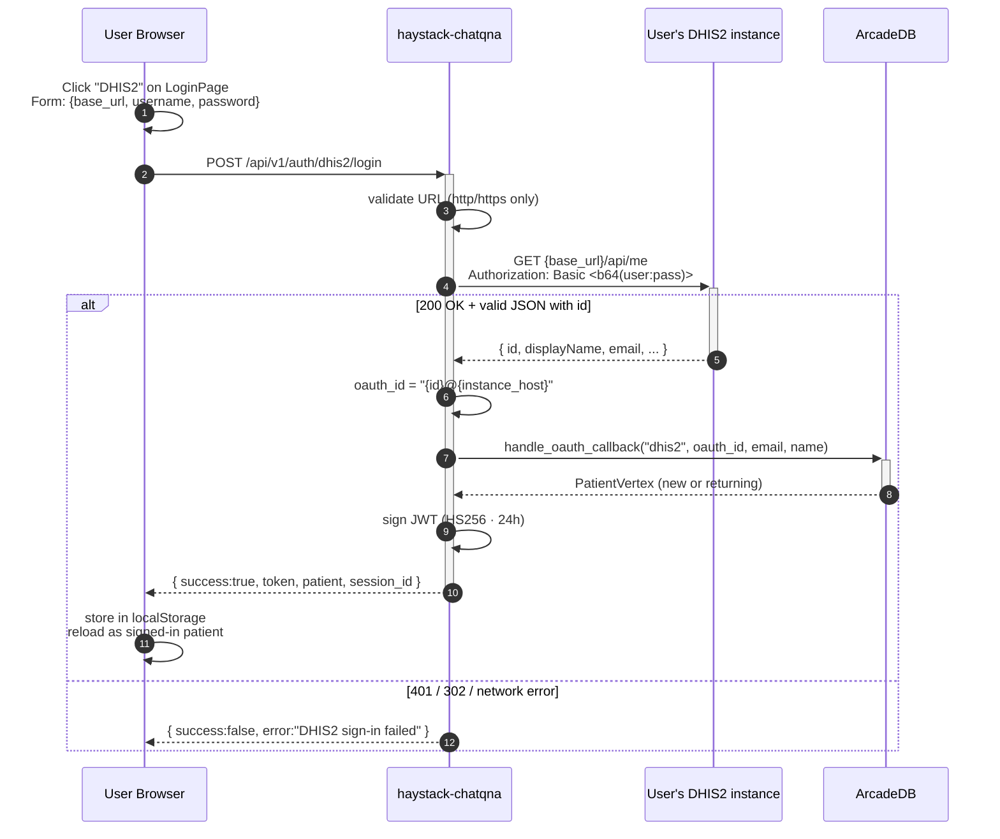
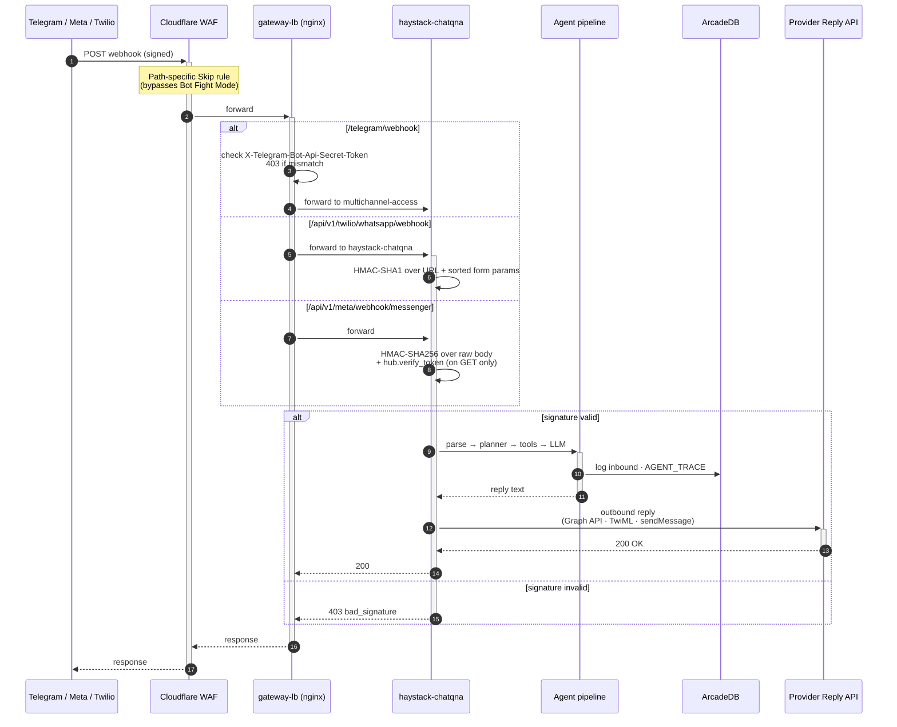
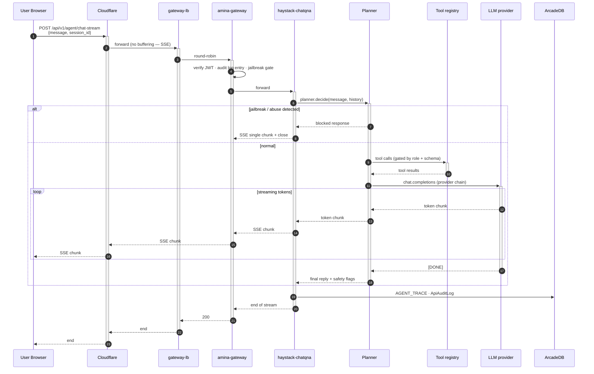
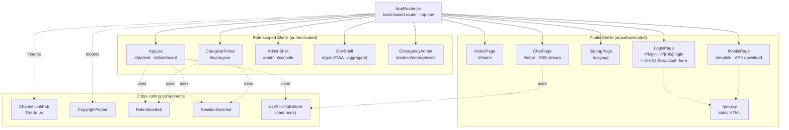
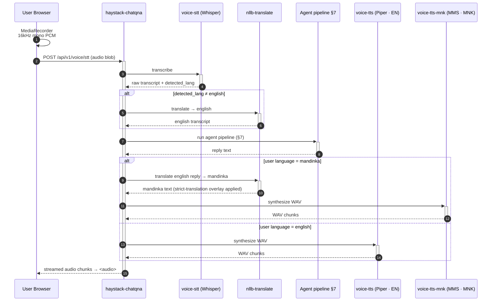

# AMINA Care — System Architecture

**Status:** Authoritative as of 12 May 2026 · Supersedes earlier `docs/ARCHITECTURE.md`,
`docs/AMINA_FULL_SYSTEM_ARCHITECTURE.md`, and `docs/architecture_overview.md` where they
disagree.

**Owner:** AMINA Care project team · Submitted under UNICC GenIA for Good.

---

## 1. Executive summary

AMINA is a humanitarian primary-health AI assistant for low-resource clinical contexts,
initially deployed for The Gambia. It speaks **English, Mandinka, Wolof, and Fula** over
**web, Android, WhatsApp, Facebook Messenger, and Telegram**, with a defended
LLM-agent pipeline grounded in WHO PEN protocols and routed through caregivers + village
health workers when intervention is needed.

The entire production stack runs on a **single A40 GPU host** behind Cloudflare's named
tunnel + WAF, with a Cloudflare-Workers-hosted React frontend on `amina-design.com` and
a Flutter Android app served from the same host as an APK.

---

## 2. System context

### External actors
- **Patients** — adults and minors-with-caregiver. Three literacy modes (beginner /
  basic / advanced) chosen on first sign-in.
- **Caregivers** — community health workers (CHWs), village scouts, family caregivers.
- **Alkalo / Village leader** — community-level dashboards (BantabaCircle, Village rank,
  Youth Scouts) for population-level adherence views.
- **Admin / Clinical staff** — admin console, gov observatory, emergency triage.
- **Government / UNICC reviewers** — aggregate-only observatory shell.

### External systems
| System | Purpose | Direction |
|---|---|---|
| **DHIS2** | Reference clinical data + identity provider (Basic Auth) | bi-directional (sync + login) |
| **Meta Messenger Platform** | Inbound Messenger messages, outbound replies via Graph API | bi-directional |
| **Twilio WhatsApp** | WhatsApp sandbox + business sender for inbound + reply TwiML | bi-directional |
| **Telegram Bot API** | Webhook delivery + outbound `sendMessage`/`sendVoice` | bi-directional |
| **Cloudflare** | TLS termination, WAF, DDoS, tunnel ingress, Workers static-asset hosting | inbound |
| **LLM providers** (Groq, Gemini, OpenAI, Anthropic, Mistral) | Inference fallback chain | egress |

### Diagram — Level 1 (System context)



---

## 3. High-level architecture

### Diagram — Level 2 (Container view)

```mermaid
flowchart TB
    User([User<br/>Web · Mobile · WA · Messenger · Telegram])

    subgraph CFEdge["☁️ Cloudflare Edge"]
        CF["CF CDN + WAF<br/>5 custom rules"]
        Workers["Workers Static Assets<br/>amina-design.com"]
    end

    subgraph A40Host["🖥️ A40 Host — 164.52.196.198 — 15 containers · cron host"]

        Tunnel["amina-cloudflared<br/>named tunnel"]

        subgraph Gateway["Gateway Tier"]
            direction LR
            LB["amina-gateway-lb<br/>nginx · APK · webhooks"]
            GW1["amina-gateway<br/>JWT · audit · proxy"]
            GW2["amina-gateway-2<br/>hot standby"]
        end

        subgraph App["Application Tier"]
            direction LR
            APP["haystack-chatqna<br/>FastAPI · agent core · routes"]
            MC["multichannel-access<br/>Telegram + dispatch"]
        end

        subgraph Voice["Voice + Translation"]
            direction LR
            TTS["voice-tts<br/>English Piper"]
            TTSMnk["voice-tts-mnk<br/>Mandinka MMS"]
            STT["voice-stt<br/>Whisper"]
            NLLB["nllb-translate<br/>NLLB-200"]
        end

        subgraph Data["Data Tier"]
            direction LR
            DB[("arcadedb<br/>graph DB")]
            R1[("amina-redis<br/>session store")]
            R2[("multichannel-redis<br/>channel rate-limits")]
        end

        subgraph Aux["Auxiliary"]
            direction LR
            Sup["amina-superset<br/>analytics"]
            DP["dataprep-worker<br/>RAG ingest"]
        end

        subgraph CronHost["Host cron (self-healing)"]
            CronC["amina-watchdog */5m"]
            CronT["telegram-watchdog */15m"]
            CronW["whatsapp-watchdog */15m"]
            CronM["messenger-watchdog */15m"]
            CronS["scribe-reaper 3:15"]
            CronB["backup 1st+15th 3:30"]
        end
    end

    subgraph Ext["External (egress)"]
        DHIS2[("DHIS2<br/>identity · sync")]
        MetaAPI[("Meta Graph API")]
        TwilioAPI[("Twilio REST")]
        TGAPI[("Telegram Bot API")]
        LLM[("LLM providers<br/>Groq · Gemini · OpenAI · …")]
    end

    User -->|HTTPS| CF
    CF -->|static| Workers
    Workers -->|SPA| User
    CF -->|api.amina-design.com| Tunnel
    Tunnel --> LB
    LB --> GW1
    LB --> GW2
    LB -->|/chatqna/*| APP
    LB -->|/telegram /api/v1/twilio /api/v1/meta| MC
    GW1 --> APP
    GW2 --> APP
    APP --> DB
    APP --> R1
    APP --> TTS
    APP --> TTSMnk
    APP --> STT
    APP --> NLLB
    APP --> Sup
    APP --> DP
    MC --> R2
    MC --> APP
    APP -.->|egress| LLM
    APP -.->|verify · sync| DHIS2
    APP -.->|reply| MetaAPI
    APP -.->|reply| TwilioAPI
    MC -.->|reply| TGAPI
    CronC -.->|monitor| App
    CronT -.->|monitor| MC
    CronW -.->|probe| APP
    CronM -.->|probe| APP
```



**Path color legend:**
- Solid → request/response in normal flow
- Dotted → egress to external services or out-of-band (cron probes)

---

## 4. Component catalog

### 4.1 Edge & ingress

| Component | Role | Notes |
|---|---|---|
| **Cloudflare CDN + WAF** | TLS termination, DDoS, 5 custom rules (1 Skip for messaging webhooks, 1 Skip for Telegram, 1 Block bare-host, 1 Block bad-bots, 1 Managed-Challenge no-UA) | Free plan |
| **`amina-cloudflared`** | Named-tunnel daemon | Routes `*.amina-design.com` → A40 docker network |
| **`amina-gateway-lb`** (`nginx:alpine`) | nginx load-balancer + static APK + webhook routing | Bind-mount: `gateway-lb/nginx.conf`, `/root/amina/downloads:/var/www/downloads:ro` |

**Routes through `gateway-lb`** ([haystack-stack/gateway-lb/nginx.conf](../../haystack-stack/gateway-lb/nginx.conf)):
- `/amina.apk` → static file (57 MB Flutter binary)
- `/chatqna/*` → `haystack-chatqna:8000` directly (chat / agent / docs / tools)
- `/telegram/webhook` → `multichannel-access:8020` (gated by `X-Telegram-Bot-Api-Secret-Token`)
- `/whatsapp/`, `/messenger/` → `multichannel-access:8020`
- `/` (everything else) → round-robin `amina-gateway` + `amina-gateway-2` with auto-failover

### 4.2 API gateway tier

| Container | Source | Role |
|---|---|---|
| **`amina-gateway`** | [components/api-gateway/](../../components/api-gateway/) | FastAPI proxy — JWT validation, audit logging, jailbreak gate, role-based rate limiting, request forwarding to `haystack-chatqna` |
| **`amina-gateway-2`** | same | Hot-standby second replica behind `amina-gateway-lb` for zero-downtime restarts |

Key features:
- JWT verification ([src/auth.py](../../components/api-gateway/app/auth.py))
- Per-role rate limits (Redis-backed, optional)
- Audit-trail writer → `ApiAuditLog` in ArcadeDB
- Jailbreak / abuse-defense gate fronting the agent route

### 4.3 Backend application tier

#### `haystack-chatqna` (FastAPI · port 8000)

The fat application container. Mounted at `/app`, source in
[haystack-stack/haystack-chatqna/src/](../../haystack-stack/haystack-chatqna/src/).

**Route prefixes** (via `main_with_rag_tuning.py`):
| Prefix | File | Purpose |
|---|---|---|
| `/api/v1/auth` | [src/api/auth_routes.py](../../haystack-stack/haystack-chatqna/src/api/auth_routes.py) | signup, login, OAuth callback, **DHIS2 Basic-Auth login**, password reset, /me |
| `/api/v1/agent` | [src/api/agent_routes.py](../../haystack-stack/haystack-chatqna/src/api/agent_routes.py) | `chat`, `chat-stream` (SSE), policy gates, tool dispatch |
| `/api/v1/caregiver` | [src/api/caregiver_routes.py](../../haystack-stack/haystack-chatqna/src/api/caregiver_routes.py) | Caregiver dashboard, alerts, patient supervision |
| `/api/v1/caregiver/application` | [src/api/caregiver_application_routes.py](../../haystack-stack/haystack-chatqna/src/api/caregiver_application_routes.py) | Caregiver application + review (admin role now allowed) |
| `/api/v1/dhis2` | [src/api/dhis2_history_routes.py](../../haystack-stack/haystack-chatqna/src/api/dhis2_history_routes.py) | DHIS2 outbreak / case history pull |
| `/api/v1/twilio/whatsapp` | [src/api/twilio_whatsapp_routes.py](../../haystack-stack/haystack-chatqna/src/api/twilio_whatsapp_routes.py) | Inbound WhatsApp webhook (X-Twilio-Signature) |
| `/api/v1/meta/webhook/{messenger,whatsapp}` | [src/api/meta_routes.py](../../haystack-stack/haystack-chatqna/src/api/meta_routes.py) | Meta verify-token + X-Hub-Signature-256 |
| `/api/v1/meta/status` | same | Adapter health introspection |
| `/api/v1/admin/*` | various | Admin console APIs |

#### `multichannel-access` (FastAPI · port 8020)

Owns the Telegram bot and orchestrates outbound message dispatch back to the messaging
platforms. See [docs/MVP_MULTICHANNEL_RUNBOOK.md](../MVP_MULTICHANNEL_RUNBOOK.md).

### 4.4 Voice + translation

| Container | Engine | Languages |
|---|---|---|
| **`voice-tts`** | Piper (CPU) | English (default voice) |
| **`voice-tts-mnk`** | MMS-TTS (Meta) | Mandinka (with strict-translation overlay, [src/services/tts_mandinka_fix.py](../../haystack-stack/haystack-chatqna/src/services/tts_mandinka_fix.py)) |
| **`voice-stt`** | whisper.cpp `ggml-small.en.bin` | English (Mandinka STT planned) |
| **`nllb-translate`** | NLLB-200 distilled (Meta) | Per-language pairs for clinical-style preservation |

### 4.5 Storage

| Container | Role |
|---|---|
| **`arcadedb`** | Graph DB — patients, caregivers, sessions, alerts, audit. Schema in [docs/ARCADEDB_DATASETS.md](../ARCADEDB_DATASETS.md) and [scripts/_arcade_inventory.json](../../scripts/_arcade_inventory.json) |
| **`amina-redis`** | Session store (chat memory per `s_*` session id), TTL 90 days |
| **`multichannel-redis`** | Per-channel rate limits + message dedup |
| **`amina-superset`** | Analytics dashboard (optional) |
| **`dataprep-worker`** | Document ingest worker for the RAG store |

### 4.6 ArcadeDB schema (key vertices/edges)



Full schema (every vertex/edge field) is in [scripts/_arcade_inventory.json](../../scripts/_arcade_inventory.json) and [docs/ARCADEDB_DATASETS.md](../ARCADEDB_DATASETS.md).

---

## 5. Authentication & authorization

### 5.1 Identity providers

| Provider | Flow | Implementation |
|---|---|---|
| **Phone + 4-digit PIN** | `/api/v1/auth/signup`, `/api/v1/auth/login` | bcrypt-hashed PIN, signed JWT |
| **Email + password** | `/api/v1/auth/signup_email`, `/api/v1/auth/login_email` | bcrypt + JWT |
| **Google OAuth** | Web SDK popup → `access_token` → `/api/v1/auth/oauth/callback` | Verified against `googleapis.com/oauth2/v3/userinfo` |
| **Facebook OAuth** | Web SDK → `/api/v1/auth/oauth/callback` | Verified against `graph.facebook.com/me` |
| **DHIS2 Basic Auth** | Inline 3-field form (URL/user/pass) → `/api/v1/auth/dhis2/login` | Calls `{instance}/api/me` with Basic Auth; oauth_id namespaced `<user_id>@<instance_host>` so any DHIS2 instance works without OAuth client registration. See §5.5 sequence. |
| **Caregiver phone + PIN** | `/api/v1/caregiver/login` | Separate JWT scope |
| **Admin** | `/api/v1/admin/login` | Single demo account `admin/amina2026` — refactor to env var pending |

### 5.2 Token

- **Type:** HS256-signed JWT, 24h TTL, claims `{sub, role, iat, exp}`.
- **Storage** (browser): `localStorage` keys `AMINA_TOKEN`, `AMINA_PATIENT`, `AMINA_SID`, `AMINA_ACTIVE`.
- **Refresh:** None yet — user re-authenticates after expiry.
- **Verification:** Every protected route via `get_current_patient()` reading
  `Authorization: Bearer <jwt>`.

### 5.3 Role-based access control

| Role | Scope | Gate code |
|---|---|---|
| `patient` | Own chat, plan, alerts | `_require_patient` |
| `caregiver` | Linked patients only (via `CaregiverPatientEdge`) | `_require_caregiver` |
| `admin` | Cross-cutting; can role-switch to inspect any patient | `_require_admin` (and patient routes now allow admin tokens) |
| `vhw`, `clinician`, `alkalo`, `scout` | Specialised privileges on community cards | Per-route checks |

### 5.4 Messaging webhooks (signature gates)

| Channel | Mechanism | Required env |
|---|---|---|
| **Telegram** | `X-Telegram-Bot-Api-Secret-Token` checked in nginx **before** reaching the app | `/root/amina/.telegram_webhook_secret` (host file, mode 0600) |
| **Twilio WhatsApp** | `X-Twilio-Signature` (HMAC-SHA1 over URL + sorted form-params) checked in app | `TWILIO_AUTH_TOKEN`, `TWILIO_WEBHOOK_PUBLIC_URL` (pinned so proxy chain stripping `X-Forwarded-*` doesn't break HMAC) |
| **Messenger** | `X-Hub-Signature-256` (HMAC-SHA256 over raw body) + `hub.verify_token` handshake | `MESSENGER_APP_SECRET`, `MESSENGER_VERIFY_TOKEN`, `MESSENGER_PAGE_ACCESS_TOKEN` |

Deep dives: [docs/infra/telegram-bot-security.md](../infra/telegram-bot-security.md) ·
[docs/infra/whatsapp-bot-security.md](../infra/whatsapp-bot-security.md) ·
[docs/infra/messenger-bot-security.md](../infra/messenger-bot-security.md).

### 5.5 Sequence — DHIS2 Basic-Auth login



Password never persisted — used once for the `/api/me` Basic-Auth round-trip, then discarded.

---

## 6. Messaging channels

| Channel | User entry | Inbound path | Outbound path | Status |
|---|---|---|---|---|
| **Web chat** | `https://amina-design.com/#/chat` | direct → `haystack-chatqna:/api/v1/agent/chat-stream` (SSE) | streaming SSE token-by-token to browser | live, primary |
| **Mobile (Android)** | `https://amina-design.com/#/mobile` → download `/amina.apk` from A40 | Flutter app → same backend via HTTPS | same | APK shipped, app live |
| **WhatsApp** | join Twilio sandbox `join milk-shot` to `+1 415 523 8886` | Twilio → `/api/v1/twilio/whatsapp/webhook` (HMAC-SHA1) | Async: `POST graph.twilio.com/Messages.json` | sandbox live; production needs paid Twilio account |
| **Messenger** | `m.me/1047710801765129` (Page "Amina") | Meta → `/api/v1/meta/webhook/messenger` (HMAC-SHA256) | Graph API `me/messages` | Dev Mode (testers only) — pending pages_messaging App Review |
| **Telegram** | DM `@amina_care_bot` | Telegram → `/telegram/webhook` (nginx secret check) → `multichannel-access:/inbound` | `https://api.telegram.org/bot{token}/sendMessage` | live |

Frontend "Talk to us" widget: [components/frontend/src/ChannelLinkFab.jsx](../../components/frontend/src/ChannelLinkFab.jsx).
Both sandbox/dev-mode flows have inline onboarding panels (WhatsApp `join` instructions,
Messenger "ask admin to add me as a Tester").

### Sequence — Inbound messaging webhook (generic, all 3 providers)



---

## 7. Agent / LLM pipeline

### 7.1 Provider fallback chain

```
user message ─▶ planner (agent_routes.py)
                  │
                  ├─▶ Groq        ─┐
                  ├─▶ Gemini      ─┤  first that returns ≤ token cap wins
                  ├─▶ OpenAI      ─┤  if all fail → chain_exhausted_total++
                  └─▶ Mistral     ─┘  + base fallback (canned safe answer)
```

Provider chain rules in [src/services/llm_provider_policy.py](../../haystack-stack/haystack-chatqna/src/services/llm_provider_policy.py).
ADR for deferring local LLM: [docs/architecture/adrs/0001-local-llm-deferred.md](./adrs/0001-local-llm-deferred.md).

### 7.2 Agent platform layers

Per [docs/AGENT_PLATFORM_V1.md](../AGENT_PLATFORM_V1.md), [docs/AGENT_PLATFORM_V2_READONLY_ASSIST.md](../AGENT_PLATFORM_V2_READONLY_ASSIST.md), [docs/AGENT_PLATFORM_PHASE3_ROLLOUT_AND_EVALS.md](../AGENT_PLATFORM_PHASE3_ROLLOUT_AND_EVALS.md):
- **Planner** — decides `native_openai` vs `heuristic_match` per turn
- **Tool registry** — clinical-data tools (BP read, WHO-PEN protocol lookup, alert raise)
  with per-tool risk classification (`read_only_clinical`, `safe_read_only`, etc.)
- **Policy gate** — schema validation, role check, abuse-pattern detection BEFORE tool fire
- **Trace bus** — `AGENT_TRACE` JSON line per turn including: planner path, tool decisions,
  fallback used, latency, native-format detected, native-fallback reason
- **Audit bridge** — every agent turn writes one `ApiAuditLog` row in ArcadeDB
  ([src/services/agent_audit_bridge.py](../../haystack-stack/haystack-chatqna/src/services/agent_audit_bridge.py))

### 7.3 Safety stack

- **Jailbreak detector** ([JAILBREAK_LOGIC_AND_TEST_RESULTS.md](../compliance/JAILBREAK_LOGIC_AND_TEST_RESULTS.md))
- **Abuse-defense cooldown** ([ABUSE_DEFENSE_LOGIC_AND_TEST_RESULTS.md](../compliance/ABUSE_DEFENSE_LOGIC_AND_TEST_RESULTS.md))
- **Clinical safety case** ([CLINICAL_SAFETY_CASE.md](../compliance/CLINICAL_SAFETY_CASE.md))
- **Self-harm + emergency triage** routes to 199 (Gambia ER) + caregiver
- **Audit failure alerting** ([AUDIT_FAILURE_ALERTING.md](../compliance/AUDIT_FAILURE_ALERTING.md))

### 7.4 Sequence — Web chat turn (SSE)



---

## 8. Frontend architecture

### 8.1 Shells

| Shell | Route prefix | Entry |
|---|---|---|
| **Public** | `#/home`, `#/login`, `#/signup`, `#/chat`, `#/mobile`, `#/disclaimer`, `/privacy` (static) | [src/router/AppRouter.jsx](../../components/frontend/src/router/AppRouter.jsx) |
| **Patient dashboard** | `#/patient`, `#/dashboard` | [src/App.jsx](../../components/frontend/src/App.jsx) |
| **Caregiver portal** | `#/caregiver` | [src/CaregiverPortal.jsx](../../components/frontend/src/CaregiverPortal.jsx) |
| **Admin console** | `#/admin/console` | [src/admin/AdminShell.jsx](../../components/frontend/src/admin/AdminShell.jsx) |
| **Government observatory** | `#/gov/*` | [src/gov/GovShell.jsx](../../components/frontend/src/gov/GovShell.jsx) (aggregate-only, separate PWA) |
| **Emergency triage** | `#/admin/emergencies` | [src/emergency/EmergencyAdminPage.jsx](../../components/frontend/src/emergency/EmergencyAdminPage.jsx) |

### 8.2 Cross-cutting components

- **`ChannelLinkFab`** — floating "Talk to us" with per-channel onboarding panels
- **`CopyrightFooter`** — `© 2026 AMINA Care Project. Developed for humanitarian use.`
- **`GatewaySecurityBadge`** — surfaces auth/CF state
- **`RoleInboxBell`** — role-scoped alert inbox
- **`SessionSwitcher`** — multi-account session switching
- **`useStickToBottom`** ([utils/stickToBottom.js](../../components/frontend/src/utils/stickToBottom.js)) — industry-standard chat-scroll hook used by `ChatPage` and embedded chat

### 8.3 Build + hosting

- **Tooling:** Vite 5 + React 18 + JSX (no TypeScript yet)
- **Output:** `dist/` (~2.25 MB total, single bundle + CSS)
- **Hosting:** Cloudflare Workers Static Assets on `amina-design.com` (25 MB per-file limit; APK hosted off-Workers)
- **Routing:** Hash-based (`#/...`) — survives static hosting without server-side rewrites
- **Deploy:** Manual upload via CF Workers UI; no CI/CD pipeline yet

### 8.4 Diagram — Frontend shell hierarchy



---

## 9. Mobile app

- **Source:** [mobile/amina_mobile/](../../mobile/amina_mobile/) (Flutter, added by David Ayala)
- **Binary:** `/root/amina/downloads/amina.apk` on A40 (57 MB, Android 8+ / ARM64)
- **Served at:** `https://api.amina-design.com/amina.apk` via gateway-lb nginx alias
- **Download UI:** `#/mobile` route in the SPA ([src/router/pages/MobilePage.jsx](../../components/frontend/src/router/pages/MobilePage.jsx))
- **Cross-origin behavior:** APK URL serves `Content-Type: application/vnd.android.package-archive` +
  `Content-Disposition: attachment`, browsers download regardless of origin
- **Update workflow:** SCP a new APK to `/root/amina/downloads/amina.apk` on A40; CF edge
  cache expires after 4h or via dashboard purge

---

## 10. Voice pipeline



**Notes:**
- Mandinka strict-translation overlay ([tts_mandinka_fix.py](../../haystack-stack/haystack-chatqna/src/services/tts_mandinka_fix.py)) — ensures replies are generated in Mandinka instead of "translated post-hoc from English", preserving cultural register + clinical accuracy.
- Whisper kwargs + race-condition fix ([stt_whisper.py](../../haystack-stack/haystack-chatqna/src/services/stt_whisper.py)) — addresses concurrent decode crashes seen in earlier builds.
- Mandinka STT not yet wired (Whisper doesn't ship a Mandinka model); planned via Meta MMS-STT in a future sprint.

---

## 11. Observability

### 11.1 Logs

- **Per-container Docker logs** with json-driver, capped 100 MB/file × 5
- **Audit trail** — every agent turn + admin action in `ApiAuditLog` (ArcadeDB)
- **Watchdog logs** — `/var/log/amina-{telegram,whatsapp,messenger}-watchdog.log`,
  rotated weekly via `scripts/ops/amina-logrotate.conf`

### 11.2 Metrics

- **`chain_exhausted_total`** Prometheus counter — fires when entire LLM provider chain
  fails over without producing a reply (per ADR 0001)
- **`AGENT_TRACE`** JSON lines on every turn — feed into log aggregator

### 11.3 Watchdogs (cron-driven self-healing)

| Cron | Script | Action on failure |
|---|---|---|
| `*/5 * * * *` | [amina-watchdog.sh](../../scripts/ops/amina-watchdog.sh) | Restart unhealthy/exited container in CRITICAL list |
| `*/15 * * * *` | [amina-telegram-watchdog.sh](../../scripts/ops/amina-telegram-watchdog.sh) | Re-register Telegram webhook with secret_token if URL drifted |
| `*/15 * * * *` | [amina-whatsapp-watchdog.sh](../../scripts/ops/amina-whatsapp-watchdog.sh) | Probe `/health`, alert if `signature_validation` flips off or pinned URL missing |
| `*/15 * * * *` | [amina-messenger-watchdog.sh](../../scripts/ops/amina-messenger-watchdog.sh) | Verify-token handshake + Graph API token sanity |
| `15 3 * * *` | [amina-scribe-reaper.sh](../../scripts/ops/amina-scribe-reaper.sh) | Reap orphaned scribe sessions |
| `30 3 1,15 * *` | [amina-backup.sh](../../scripts/ops/amina-backup.sh) | ArcadeDB + `.env` snapshot to `/root/amina/backups/` |

---

## 12. Deployment & operations

### 12.1 Host

**Single A40 host** — `164.52.196.198` · 80 vCPU · NVIDIA A40 (48 GB) · 56 days uptime
at time of writing. Detailed resource allocation in [docs/infra/a40-resource-allocation.md](../infra/a40-resource-allocation.md).

### 12.2 Compose files

| File | Services |
|---|---|
| [docker-compose.yml](../../haystack-stack/docker-compose.yml) | Core: arcadedb, redis, haystack-chatqna, voice-tts, voice-tts-mnk, voice-stt, nllb-translate, dataprep-worker, amina-superset |
| [docker-compose.gateway.yml](../../haystack-stack/docker-compose.gateway.yml) | amina-gateway, amina-gateway-2, amina-gateway-lb |
| [docker-compose.override.yml](../../haystack-stack/docker-compose.override.yml) | Environment + bind-mount overrides for haystack-chatqna |
| [docker-compose.inbox.yml](../../haystack-stack/docker-compose.inbox.yml) | multichannel-access + multichannel-redis |
| [docker-compose.meta-channels.yml](../../haystack-stack/docker-compose.meta-channels.yml) | Meta channels overrides |
| [docker-compose.oauth.yml](../../haystack-stack/docker-compose.oauth.yml) | OAuth provider env vars |
| [docker-compose.demo.yml](../../haystack-stack/docker-compose.demo.yml) | Demo-data seeding |

**Network:** All containers share `chatqna_default` bridge (declared `external: true`).

### 12.3 Deploy workflows

**Frontend** — `npm --prefix components/frontend run build` → `dist/` → CF Workers UI upload
(manual). No CI/CD.

**Backend** — Source files bind-mounted from `/root/amina/haystack-stack/...` into containers.
For changes: SFTP file → `docker cp` into container (since selective bind-mounts) → `docker restart`.

**Mobile** — Flutter build externally → SCP APK to `/root/amina/downloads/amina.apk` → no
service restart needed (nginx bind-mount sees file change live).

**Watchdog updates** — Edit `scripts/ops/*.sh` → SCP to `/usr/local/bin/...` on A40 → cron picks
up next tick.

---

## 13. Security architecture

Detailed posture: [docs/compliance/ENCRYPTION_AND_SECURITY_HARDENING.md](../compliance/ENCRYPTION_AND_SECURITY_HARDENING.md).

### 13.1 In transit
- TLS 1.2+ everywhere (Cloudflare cert at edge + cloudflared tunnel TLS to origin)
- HSTS preloaded (`strict-transport-security: max-age=31536000; preload`)
- Cross-origin-resource-policy, X-Frame-Options DENY, X-Content-Type-Options nosniff

### 13.2 At rest
- bcrypt for all passwords (per-account salt)
- ArcadeDB data on disk on A40 (LUKS encryption pending — flagged in compliance docs)
- No PII in git: caregiver education certs gitignored (`haystack-stack/education_certs/*.jpg`)

### 13.3 Network gates
- **CF WAF**: 5 custom rules
  - Skip messaging webhooks (Twilio + Messenger merged rule)
  - Skip Telegram webhook
  - Block bare-host attacks
  - Block bad bots (score > 14)
  - Managed Challenge no-UA traffic (skipped for chatqna)
- **nginx gateway-lb**: defence-in-depth for Telegram (`X-Telegram-Bot-Api-Secret-Token`)
- **App layer**: HMAC for Twilio + Messenger signatures, OAuth verify for Google/FB,
  Basic Auth ping for DHIS2

### 13.4 Secret management
- Production `.env` at `/root/amina/haystack-stack/.env` (mode 0644 in docker group)
- Telegram webhook secret in `/root/amina/.telegram_webhook_secret` (mode 0600)
- All `.env.backup_*` gitignored (per current `.gitignore`)
- LLM provider keys never reach frontend; egress only from `haystack-chatqna`

### 13.5 Known follow-ups
- Demo admin password `amina2026` is hardcoded in sanity scripts — env-var refactor
  pending
- Education-cert `.webp` already-committed file (pre-existing) — retro-scrub pending
- GitLab PAT in local `.git/config` plain text (user-side; rotate at convenience)

---

## 14. Privacy & compliance

| Doc | What it covers |
|---|---|
| [PRIVACY_NOTICE.md](../compliance/PRIVACY_NOTICE.md) + public [/privacy](../../components/frontend/public/privacy.html) | User-facing 13-section privacy policy meeting Meta App Review requirements |
| [DPIA.md](../compliance/DPIA.md) | Data Protection Impact Assessment |
| [RETENTION_POLICY.md](../compliance/RETENTION_POLICY.md) | 90d chat / 12mo audit / 24h voice |
| [CONSENT_MODEL.md](../compliance/CONSENT_MODEL.md) | Caregiver consent + revocation flow |
| [INCIDENT_RESPONSE_PLAN.md](../compliance/INCIDENT_RESPONSE_PLAN.md) | 4-tier breach process |
| [MODEL_CARD_AMINA.md](../compliance/MODEL_CARD_AMINA.md) | Clinical-safety model card |
| [DATA_FLOW_MAP.md](../compliance/DATA_FLOW_MAP.md) | What data crosses what boundary |

**Data deletion** — user emails `privacy@amina-design.com` (anchor `#delete` on the
privacy page); 30-day SLA, exceptions for legally-required audit-trail records and
backup rotation.

---

## 15. External integrations

| Integration | Direction | Auth | Docs |
|---|---|---|---|
| **DHIS2** | sync (scheduled + ad-hoc) + identity (Basic Auth login) | env-stored admin creds for sync; user-provided creds for login | [docs/DHIS2_INTEGRATION.md](../DHIS2_INTEGRATION.md), [src/api/dhis2_history_routes.py](../../haystack-stack/haystack-chatqna/src/api/dhis2_history_routes.py), [src/services/dhis2_health.py](../../haystack-stack/haystack-chatqna/src/services/dhis2_health.py) |
| **Meta Messenger Platform** | webhook + Graph API | App secret HMAC + Page access token | [docs/infra/messenger-bot-security.md](../infra/messenger-bot-security.md) |
| **Twilio WhatsApp** | webhook + REST API | Auth-token HMAC + Account SID | [docs/infra/whatsapp-bot-security.md](../infra/whatsapp-bot-security.md) |
| **Telegram Bot API** | webhook + Bot API | Bot token + secret_token | [docs/infra/telegram-bot-security.md](../infra/telegram-bot-security.md) |
| **Cloudflare** | tunnel + Workers + WAF | Per-zone API token | (CF-side config; not in repo) |
| **LLM providers** | egress only | Per-provider API keys | [llm_provider_policy.py](../../haystack-stack/haystack-chatqna/src/services/llm_provider_policy.py) |

---

## Appendix A — Container inventory

```
$ docker ps --format "table {{.Names}}\t{{.Status}}" (15 containers)
NAMES                 STATUS
haystack-chatqna      Up — primary app (FastAPI 8000)
amina-gateway-lb      Up — nginx LB, APK serving
amina-gateway-2       Up — gateway replica
amina-gateway         Up — gateway primary
amina-cloudflared     Up — CF tunnel
multichannel-access   Up — Telegram + outbound dispatch
multichannel-redis    Up — channel-level rate limits
amina-superset        Up — analytics (optional)
voice-tts             Up — English TTS (Piper)
voice-tts-mnk         Up — Mandinka TTS (MMS)
voice-stt             Up — Whisper STT
nllb-translate        Up — NLLB-200 translation
dataprep-worker       Up — RAG document ingest
arcadedb              Up — graph DB
amina-redis           Up — session store
```

## Appendix B — Cron snapshot

```
*/5  * * * * /usr/local/bin/amina-watchdog.sh
30 3 1,15 * * /usr/local/bin/amina-backup.sh
15 3 * * * /usr/local/bin/amina-scribe-reaper.sh
*/15 * * * * /usr/local/bin/amina-telegram-watchdog.sh
*/15 * * * * /usr/local/bin/amina-whatsapp-watchdog.sh
*/15 * * * * /usr/local/bin/amina-messenger-watchdog.sh
```

## Appendix C — Public URLs

```
https://amina-design.com/              (web app · Cloudflare Workers)
https://amina-design.com/#/mobile      (mobile app landing)
https://amina-design.com/privacy       (privacy policy)
https://api.amina-design.com/amina.apk (Android binary, 57 MB)
https://api.amina-design.com/api/v1/   (backend API root)
https://api.amina-design.com/telegram/webhook (Telegram)
https://api.amina-design.com/api/v1/twilio/whatsapp/webhook (Twilio)
https://api.amina-design.com/api/v1/meta/webhook/messenger  (Meta)
m.me/1047710801765129                  (Messenger deep link · Page "Amina")
+1 415 523 8886 / "join milk-shot"     (Twilio WhatsApp sandbox)
@amina_care_bot                        (Telegram)
```

## Appendix D — Env var inventory (production-critical)

```
# Backend
DHIS2_BASE_URL                     # default sync target
DHIS2_USERNAME / DHIS2_PASSWORD    # admin sync creds
DHIS2_DATASET_ID                   # dataset for outbound metrics
DHIS2_DATA_ELEMENT_MAP             # JSON map AMINA→DHIS2 codes
DHIS2_ORG_UNIT_MAP                 # JSON map region→OU id
MESSENGER_APP_SECRET               # HMAC for X-Hub-Signature-256
MESSENGER_PAGE_ACCESS_TOKEN        # outbound Graph API
MESSENGER_VERIFY_TOKEN             # = "amina_health_2026"
FACEBOOK_APP_ID                    # = "1388627716614900"
TELEGRAM_BOT_TOKEN                 # Bot API token
TWILIO_ACCOUNT_SID
TWILIO_AUTH_TOKEN                  # HMAC for X-Twilio-Signature
TWILIO_PHONE_NUMBER                # = "+18254624766"
TWILIO_VALIDATE_SIGNATURE          # = "true"
TWILIO_WEBHOOK_PUBLIC_URL          # pinned (proxy chain strips X-Forwarded-*)
GROQ_API_KEY / OPENAI_API_KEY / GEMINI_API_KEY / ANTHROPIC_API_KEY / MISTRAL_API_KEY
JWT_SECRET                         # HS256 signing
ARCADEDB_ROOT_PASSWORD

# Frontend (baked at build time via VITE_*)
VITE_AMINA_WHATSAPP_NUMBER         # = "14155238886"
VITE_AMINA_WHATSAPP_JOIN_CODE      # = "milk-shot"
VITE_AMINA_MESSENGER_HANDLE        # = "1047710801765129"
VITE_AMINA_MESSENGER_DEV_MODE      # = true (until App Review)
VITE_AMINA_TELEGRAM_HANDLE         # = "amina_care_bot"
VITE_GOOGLE_CLIENT_ID
VITE_FACEBOOK_APP_ID
VITE_DHIS2_BASE_URL                # (empty — Basic Auth model lets user specify per login)
```

---

## Change log

- **2026-05-12** — Initial authoritative version. Captures: DHIS2 Basic-Auth login,
  Mobile/Flutter, privacy page, Messenger Dev-Mode panel, WhatsApp sandbox flow, full
  cron stack, `useStickToBottom` hook, agent platform phases 1–3.
- **2026-05-12 (later same day)** — Replaced ASCII container diagram with proper
  Mermaid diagrams. Added 7 native-rendered diagrams: Level-1 system context,
  Level-2 container view, ER data model, DHIS2 Basic-Auth sequence, generic
  messaging-webhook sequence, web chat-turn (SSE) sequence, frontend shell hierarchy,
  voice pipeline sequence. All diagrams render natively in GitLab + GitHub markdown
  preview without any extra tooling.
