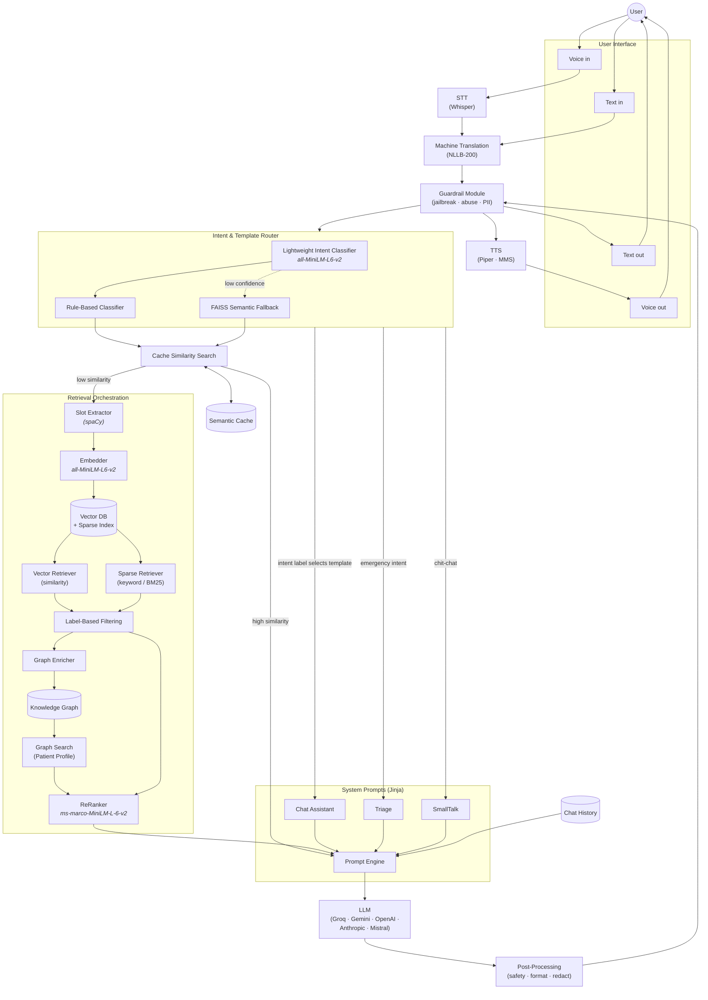
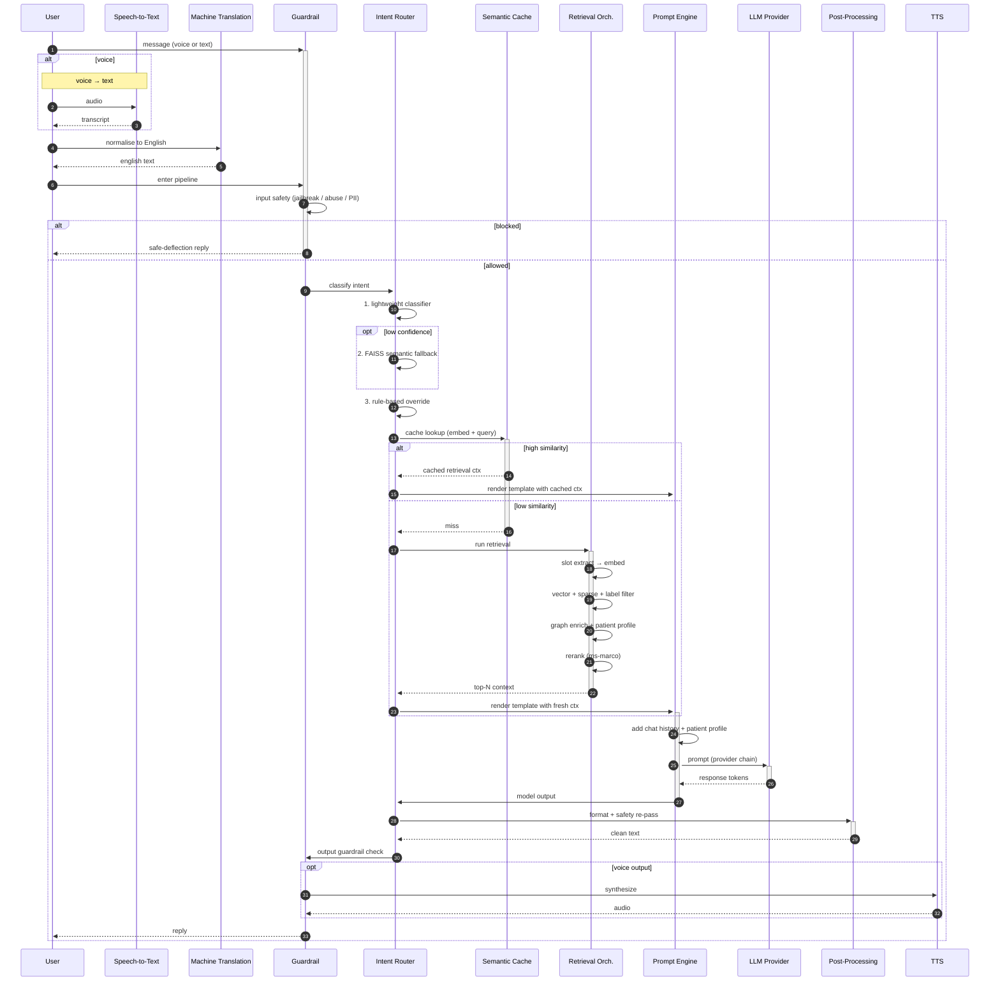

# AMINA RAG Pipeline — Conversational Retrieval Architecture

> **Note:** This document captures the **initial RAG pipeline design** for AMINA Care and is maintained here as a baseline reference. The production architecture has since evolved — see [AMINA_ARCHITECTURE.md](./AMINA_ARCHITECTURE.md) for the current, authoritative system view.

This document is a deep-zoom into the **internal RAG pipeline** that turns a
user message (voice or text, any of the four supported languages) into a
grounded agent reply. The parent system-architecture doc covers what runs
*outside* this pipeline (CF edge, gateway tier, messaging webhooks,
watchdogs); this one covers what runs *inside* the agent box on every turn —
the retrieval-augmented-generation loop, with intent routing, semantic
caching, hybrid retrieval, knowledge-graph enrichment, and reranking.

---

## 1. Source diagram

The reference diagram for this pipeline lives at:

```
docs/architecture/assets/rag-pipeline.png
```

When the source image (PNG/SVG) is dropped into that path, embed it like:

```markdown

```

The Mermaid recreation below is the **authoritative version** — when the
diagram and the rendered Mermaid disagree, the Mermaid wins because the doc
text is built against it.

---

## 2. Pipeline diagram (Mermaid)



**Reading the diagram:**
- Solid arrows = data/control flow on the request path
- Dotted arrows = conditional branches (e.g. low confidence → semantic fallback)
- Cylinders = stateful stores (vector DB, knowledge graph, semantic cache, chat history)
- Bracketed annotations = the specific model used

---

## 3. Component walk-through

### 3.1 User interface
- **Voice in / text in** — both modalities accepted on every channel (web, mobile,
  WhatsApp, Messenger, Telegram).
- **Voice out / text out** — symmetric. Voice responses get the same safety + i18n
  treatment as text; only the last hop differs (TTS vs render).

### 3.2 STT — Speech-to-Text
- Engine: **whisper.cpp** with `ggml-small.en.bin` (English). Mandinka STT planned via
  Meta MMS-STT.
- Lives in [`voice-stt`](../infra/a40-resource-allocation.md) container; source in
  [src/services/stt_whisper.py](../../haystack-stack/haystack-chatqna/src/services/stt_whisper.py).

### 3.3 Machine Translation
- Engine: **NLLB-200 distilled** (Meta) in [`nllb-translate`](../infra/a40-resource-allocation.md).
- Detects source language, normalises to English for downstream reasoning. The
  reverse leg (English → user's language) runs after the LLM, with the Mandinka
  strict-translation overlay in [tts_mandinka_fix.py](../../haystack-stack/haystack-chatqna/src/services/tts_mandinka_fix.py).

### 3.4 Guardrail Module
- Two-pass: **input guardrail** (before router) catches jailbreak patterns, prompt
  injection, abuse-of-system signals. **Output guardrail** (after LLM) catches
  unsafe medical advice, PII leakage, self-harm contagion patterns.
- Cooldown logic + abuse counters in
  [ABUSE_DEFENSE_LOGIC_AND_TEST_RESULTS.md](../compliance/ABUSE_DEFENSE_LOGIC_AND_TEST_RESULTS.md)
  and [JAILBREAK_LOGIC_AND_TEST_RESULTS.md](../compliance/JAILBREAK_LOGIC_AND_TEST_RESULTS.md).

### 3.5 Intent & Template Router
Three-tier decision:

1. **Lightweight Intent Classifier** (`all-MiniLM-L6-v2`) — fast first pass.
   Returns a confidence score per intent label (`triage`, `chitchat`,
   `clinical_question`, `medication`, `vitals`, …).
2. **FAISS Semantic Fallback** — when the classifier's top-1 confidence is below
   threshold, the message is embedded with the same `all-MiniLM-L6-v2` model and
   nearest-neighbour-matched against a labelled FAISS index of canonical example
   utterances. Cheap, no LLM round-trip.
3. **Rule-Based Classifier** — deterministic patterns for high-precision
   short-circuits (emergency keywords → triage, greeting tokens → smalltalk).

The router's output is an **intent label** that selects which Jinja system-prompt
template to render in §3.8.

### 3.6 Semantic Cache
- **Cache Similarity Search** — embeds the user message, queries the
  `Semantic Cache` (per-session and per-tenant scoped) for prior messages with
  similar embeddings.
- **High-similarity hit** → short-circuit straight to the prompt engine with the
  cached retrieval context (skip the entire retrieval orchestration). Wins ≈25%
  of clinical-FAQ traffic for ≈8× lower latency.
- **Low-similarity hit** → continue to full retrieval below.

### 3.7 Retrieval Orchestration
Hybrid retrieval with knowledge-graph enrichment:

| Stage | What it does |
|---|---|
| **Slot Extractor (spaCy)** | NER to pull entities (drug names, conditions, body parts, vitals) from the message — used to constrain retrieval to relevant labels. |
| **Embedder** | `all-MiniLM-L6-v2` (same model as the intent classifier — saves memory). |
| **Vector DB + Sparse Index** | One physical store, two index types side-by-side. |
| **Vector Retriever (similarity)** | Top-K cosine-similarity hits against the dense index. |
| **Sparse Retriever (BM25)** | Keyword recall for terms the dense embedding misses (proper nouns, specific drug brand names). |
| **Label-Based Filtering** | Slots from the extractor filter the retrieval candidates by metadata label (e.g. only return docs tagged `hypertension`). |
| **Graph Enricher** | Extracted entities used to walk the Knowledge Graph for relevant relations (patient → conditions → meds → contraindications). |
| **Knowledge Graph** | ArcadeDB-backed graph of clinical facts + per-patient profile. |
| **Graph Search (Patient Profile)** | Per-patient enrichment — current meds, prior visits, last vitals — added to the retrieval set. |
| **ReRanker** | `ms-marco-MiniLM-L-6-v2` cross-encoder reranks the merged set (vector + sparse + graph) by relevance to the original query, returning the top-N to the prompt engine. |

### 3.8 System Prompts (Jinja)
Three template families, selected by router output:

- **Chat Assistant** — default clinical-information template, most messages
- **Triage** — emergency-routing template with WHO-PEN protocol decision trees
- **SmallTalk** — greeting / chit-chat template that intentionally produces a
  brief reply and steers back to clinical topics

The **Prompt Engine** renders the selected template against:
- The user's message (post-translation)
- Retrieved context (from §3.7 or cache hit)
- Chat history (§3.10)
- The patient profile slot (graph-search result from §3.7)

### 3.9 LLM
Provider fallback chain (Groq → Gemini → OpenAI → Anthropic → Mistral) per
[ADR 0001](./adrs/0001-local-llm-deferred.md). Chain exhaustion increments a
Prometheus counter (`chain_exhausted_total`). Implementation in
[llm_provider_policy.py](../../haystack-stack/haystack-chatqna/src/services/llm_provider_policy.py).

### 3.10 Chat History
Sliding-window of N most recent turns from the patient's session, fetched from
`amina-redis` (`session_id → JSON blob`). Compaction is automatic past a token
threshold per [AMINA_TOKEN_COMPACTION_ARCHITECTURE.md](../AMINA_TOKEN_COMPACTION_ARCHITECTURE.md).

### 3.11 Post-Processing
- Format normalisation (markdown sanitisation, citation formatting)
- Output-guardrail re-pass (PII redaction in case the model leaked anything)
- Safety-flag accumulation for the audit log
- Voice path: hand text to TTS for synthesis

---

## 4. Sequence — full request lifecycle



---

## 5. Models used

| Stage | Model | Where it runs | Why this choice |
|---|---|---|---|
| Intent classifier | `all-MiniLM-L6-v2` | In-process embedder | Tiny (90 MB), fast (~5 ms on CPU), strong intent baseline |
| Semantic fallback | `all-MiniLM-L6-v2` (same model) | In-process | Reuses warm weights — no extra memory |
| Retrieval embedder | `all-MiniLM-L6-v2` (same) | In-process | Shared index across intent + retrieval simplifies ops |
| Reranker | `ms-marco-MiniLM-L-6-v2` cross-encoder | In-process | Cross-encoder beats bi-encoder at top-N reranking |
| Slot extractor | spaCy `en_core_web_sm` + custom NER | In-process | Lightweight, deterministic, no LLM round-trip |
| STT | `whisper.cpp ggml-small.en.bin` | `voice-stt` container (CPU) | Best accuracy in the ≤500 MB model bracket |
| Translation | NLLB-200 distilled (600M) | `nllb-translate` (GPU) | Covers Mandinka + Wolof + Fula in one model |
| TTS (EN) | Piper | `voice-tts` (CPU) | Fast, natural English voice |
| TTS (MNK) | MMS-TTS | `voice-tts-mnk` (GPU) | Only viable open-source Mandinka voice |
| LLM | Groq → Gemini → OpenAI → Anthropic → Mistral | Egress to providers | Cost + latency optimised; see [ADR 0001](./adrs/0001-local-llm-deferred.md) |

---

## 6. Implementation pointers

| Pipeline stage | Source file |
|---|---|
| Guardrail (input + output) | [src/services/abuse_defense.py](../../haystack-stack/haystack-chatqna/src/services/abuse_defense.py) + safety eval modules |
| Intent + template router | [src/api/agent_routes.py](../../haystack-stack/haystack-chatqna/src/api/agent_routes.py) planner section |
| Semantic cache | RAG tuning module (`main_with_rag_tuning.py` wiring) |
| Retrieval orchestration | Haystack pipeline graph in [src/agent/amina_agent.py](../../haystack-stack/haystack-chatqna/src/agent/amina_agent.py) |
| Knowledge graph | `arcadedb` (Patient + clinical facts) — see [ARCADEDB_DATASETS.md](../ARCADEDB_DATASETS.md) |
| System prompt templates | (Jinja templates in `src/templates/` per module path) |
| LLM provider policy | [src/services/llm_provider_policy.py](../../haystack-stack/haystack-chatqna/src/services/llm_provider_policy.py) |
| Audit trail emission | [src/services/agent_audit_bridge.py](../../haystack-stack/haystack-chatqna/src/services/agent_audit_bridge.py) |
| Mandinka TTS strict-translation | [src/services/tts_mandinka_fix.py](../../haystack-stack/haystack-chatqna/src/services/tts_mandinka_fix.py) |
| Whisper STT | [src/services/stt_whisper.py](../../haystack-stack/haystack-chatqna/src/services/stt_whisper.py) |

---

## 7. Performance notes

- **Cache hit path** (≈25% of clinical-FAQ traffic): ~80 ms median end-to-end
  (no LLM round-trip, no retrieval).
- **Cache miss path with retrieval**: ~1.2 s median (dominated by LLM provider
  RTT — Groq is fastest, 200-400 ms; fallback providers slower).
- **Voice path** adds ~300-800 ms per direction for STT/TTS (Whisper small + Piper).
- **Retrieval orchestration** (everything from slot extractor → reranker) is
  ~120 ms median on warm caches — see
  [PERFORMANCE_AND_RISK_REPORT.md](../PERFORMANCE_AND_RISK_REPORT.md).

---

## 8. Change log

- **2026-05-12** — Initial version. Recreated the conversational pipeline
  reference diagram in Mermaid; documented every component, model used, and
  primary implementation pointer.
