<!-- _class: title -->
<!-- _paginate: false -->

GENIE.AI

Sovereign RAG Framework

# GENIE.AI Discovery Workshop

Government of Kenya & ITU Technical Working Group

---

<!-- _class: title -->
<!-- _paginate: false -->

GENIE.AI

Master Workshop Agenda

# Agenda

### Introduction (30 min)
- **Welcome address** (10 min)
- **Around the table** (20 min)

### Part 1 — Technical & Sovereign Overview (30 min)
- **Session 1** — Sovereign AI & Architecture Fundamentals
- **Session 2** — Ingestion, Graph-RAG & Multilingual
- **Session 3** — Security, IAM (Keycloak) & Governance
- **Session 4** — Live Architecture Walkthrough & Case Studies

### Part 2 — Agile Scoping & Use Case Alignment (1 h 30 min)
- **Practice 1** — Marketplace of Skills (Capability Mapping)
- **Practice 2** — Lean Impact Mapping (Corpus Discovery)
- **Practice 3** — Ease vs. Value Matrix & Dot Voting
- Action Items & Phase 1 Deliverables

---

The GENIE.AI mandate

# A Strategic Approach to Public Value

No isolated projects — ecosystem, enablement, and impact delivered as one ITU programme.

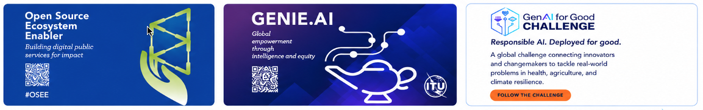

OSEE · GENIE.AI · AI for Good Challenge

**Ecosystem** — *Building the foundations.*
- Open-source training framework
- Skills development in country
- Open-source programme offices
- Ecosystem strengthening & mobilisation

**Enablement** — *Turning foundations into capabilities.*
- Open-source AI building blocks
- Expert training
- Real-world implementation experience

**Impact** — *Delivering impact at scale.*
- Bringing innovation into the field
- Connecting with local ecosystems
- Accelerating AI-powered public services

---

Mandate alignment

# Aligned with ITU-D Resolutions

### Direct mandate link
- **Resolution 89** — Digital transformation for sustainable development.
- **Resolution 73** — Structured digital capacity development.
- **Resolution 90** — Fostering ICT-centric innovation ecosystems.
- **Resolution 45** — Trusted, sovereign, DPI-aligned AI.

All operationalized through the **Baku Declaration &amp; Baku Action Plan (2026–2029)**.

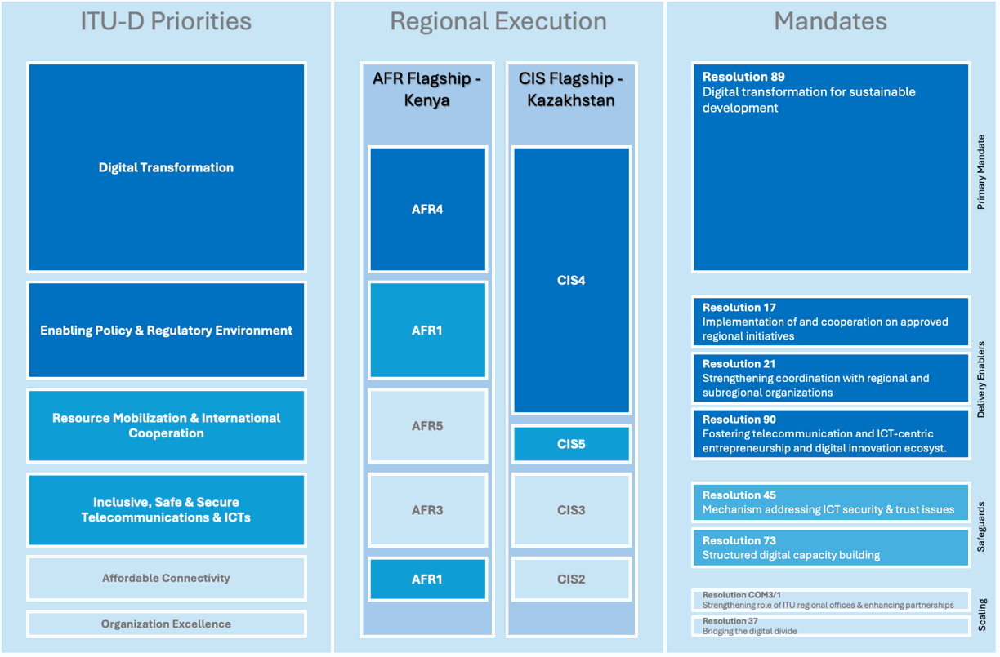

ITU-D priorities · AFR Flagship = Kenya

<strong>AFR Flagship — Kenya:</strong> GENIE.AI is the designated AI framework for the ITU Africa Regional Initiative.

---

60-second shared definition

# What is GENIE.AI

 

**ITU GENIE.AI** — *Global Empowerment through Intelligence and Equity.*

An **open-source framework** for public institutions to prototype, deploy and run custom generative AI solutions — chatbots, assistants, content tools — **at low cost, with full control, and without external API calls.**

Runs on **government-controlled infrastructure**: Intel/NVIDIA stacks, Docker Swarm or Kubernetes. **An ITU initiative**.

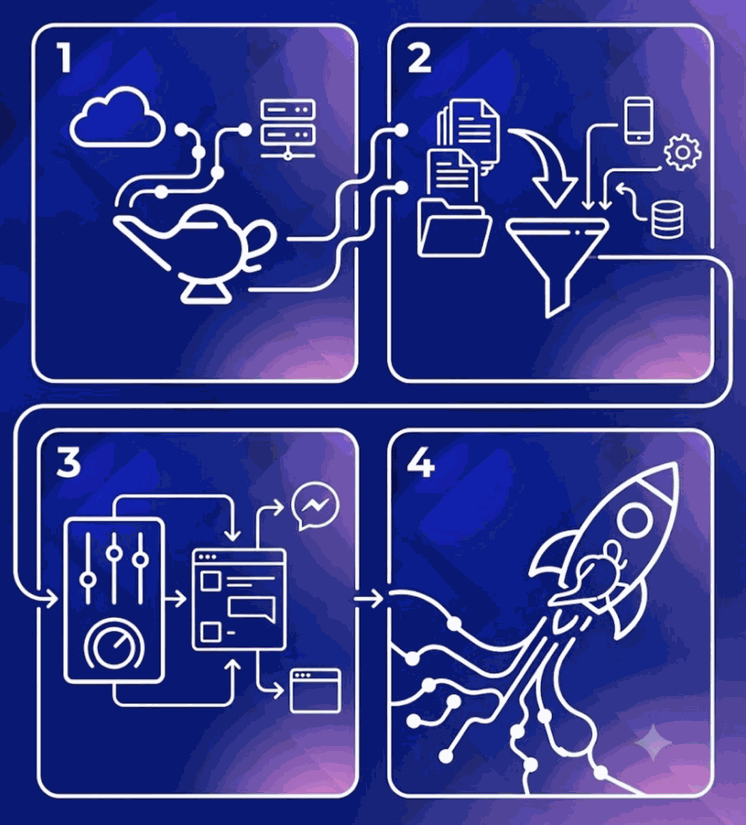

ITU · Open Source

<strong>Why now:</strong> governments want AI but most can't afford proprietary solutions, lack sovereign data control, and depend on vendors locked to non-local languages.

---

<!-- _class: title -->
<!-- _paginate: false -->

GENIE.AI

GENIE.AI — Sovereign RAG Framework

# Part 1 of 2 · GENIE.AI Deep Dive

---

<!-- _class: title -->
<!-- _paginate: false -->

GENIE.AI

Workshop — Part 1 · 30 min

# Agenda

1 Sovereign AI &amp; Architecture Fundamentals

2 Hybrid Ingestion, Vector-Graph RAG &amp; Multilingual

3 Security, IAM &amp; Governance

4 Live Architecture Walkthrough &amp; Case Studies

    

Part 2 — Agile Scoping (1 h 30 min) follows.

---

<!-- _class: session-divider -->
<!-- _paginate: false -->

01

Session 1

# Sovereign AI & Architecture

Public-sector AI under government control — from silicon to UI.

---

Session 1 · The architecture

# One Architecture — Sovereign by Design

### Core stack (all open-source)
- **Frontend** — Vue.js web · Flutter mobile.
- **Gateway** — Kong with OIDC plugin.
- **App layer** — Express / Node.js BFF (JWT verify).
- **Storage** — ArangoDB (docs + vectors + graph).

### Inference (on your GPU/CPU)
- **LLM** — vLLM (OpenAI-compatible API).
- **Embeddings + rerank** — TEI.
- **Hardware** — Intel (CPU) and NVIDIA (GPU) validated.

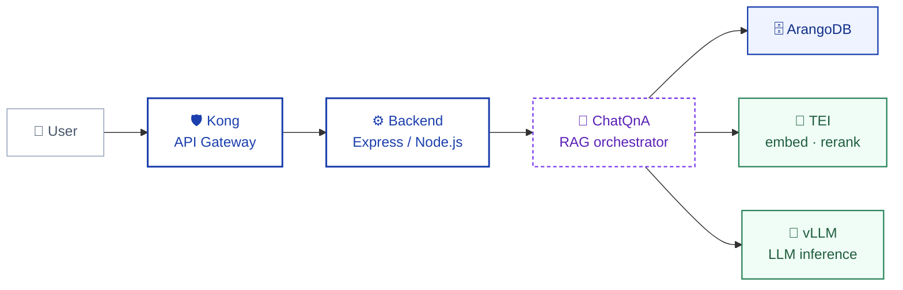

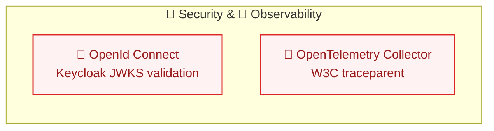

<strong>Key idea:</strong> every layer — gateway, app, retrieval, inference — is open-source and runs on government infrastructure. No external API calls, no data leaves your stack.

---

Session 1 · What "sovereign" actually means here

# Sovereignty Guarantees

  

  
Business as usual

  
GENIE.AI

  
Pilot cost

  
$200k–500k (closed-source RFP)

  
≈$50k (open-source stack)

  
Time to pilot

  
6–12 months

  
3–4 weeks

  
External API calls

  
Always-on vendor endpoints

  
Zero — fully on-prem

  
UI languages

  
1 (English) or expensive add-on

  
14+ from a single English index

  
Vendor lock-in

  
Proprietary weights + APIs

  
Open weights, open source (DPG)

### All artefacts in your jurisdiction
- Docker images · models · vector store · auth/autz · telemetry

### Open weights, open source
- Apache-2.0 / MIT — compliant with the **OSI Open Source AI Definition**.
- No proprietary model APIs. **Digital Public Good** (DPG) compliant.

### Hardware-agnostic
- Intel &amp; NVIDIA stacks validated. vLLM + TEI inference.

### No vendor lock-in
- Same compose file: laptop PoC → Docker Swarm production.
- _Kubernetes manifests planned (same images, different orchestrator)._

<strong>Takeaway:</strong> sovereignty is measurable — cost, timeline, data residency, languages, lock-in — and every row improves at once.

---

Session 1 · The five principles guiding every GENIE.AI build

# The Five Brand Pillars

 

 

  
01

  
Local Ownership

  
Code, data, models — all on your stack.

  
<em>Keycloak + ArangoDB stay on-prem.</em>

  
02

  
Open Source

  
OSI + DPG compliant. Apache-2.0 / MIT.

  
<em>No proprietary model APIs.</em>

  
03

  
Zero-Hallucination

  
Architectural abstention when evidence is absent.

  
<em>Every answer cites its source chunk.</em>

  
04

  
Scalability &amp; Accessibility

  
14+ UI languages · web + mobile clients.

  
<em>Laptop PoC → Docker Swarm. Kubernetes (roadmap).</em>

  
05

  
Real-World Deployment

  
Operational since 2024 across UN missions.

  
<em>6 active country pilots · 100+ stakeholders.</em>

---

<!-- _class: session-divider -->
<!-- _paginate: false -->

02

Session 2

# How GENIE.AI Works

From document to grounded, multilingual answer — every stage under your control.

---

Session 2 · The operating model

# Deploy, Configure, Tune, Pilot

 

**1. Deploy** Spin up a GENIE.AI instance — cloud or on-premise, Docker Swarm production.

**2. Select data** Drag-and-drop documents, plus custom integrations to existing systems.

**3. Tune** Configure RAG macro-parameters, UI locale, and connectors.

**4. Launch & iterate** Deploy the pilot, gather feedback, re-tune. _With full control at every step_.

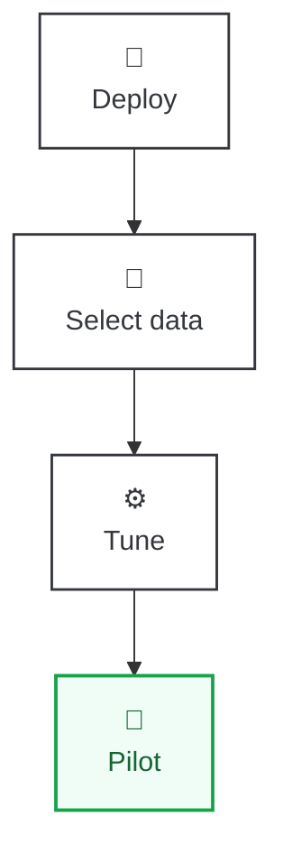

<strong>Key idea:</strong> the pilot is in your hands — no vendor in the loop, no external API calls, full control at every iteration.

---

Session 2 · How documents enter the system

# Ingestion Pipeline

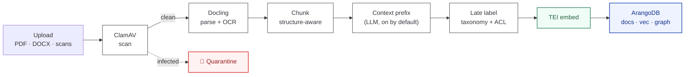

  <strong>Tunable at every step</strong> — contextual retrieval on/off, late-label mode, batch concurrency, label prompts, taxonomy — all overridable per deployment.

### What each stage does
- **ClamAV scan** — virus-check before any parsing.
- **Docling + OCR** — scans become structured text.
- **Context-aware chunking** — preserves document hierarchy.
- **Context prefix** — LLM one-liner per chunk.
- **Late labeling** — taxonomy + ACL after chunking.

### What comes out
- **Chunks** with document-level context prefix.
- **Vector embeddings** (TEI) for similarity search.
- **Graph links** (parent / child / references) in ArangoDB.
- **Per-chunk ACL** tags — ready for Keycloak-enforced retrieval.
- **Trace** of the ingestion pipeline, visible in OTel.

<strong>Key idea:</strong> one standard pipeline — no ministry-specific glue scripts. Context prefix + late labeling happen after ClamAV clears the file.

---

Session 2 · How retrieval works

# Hybrid Vector–Graph Retrieval

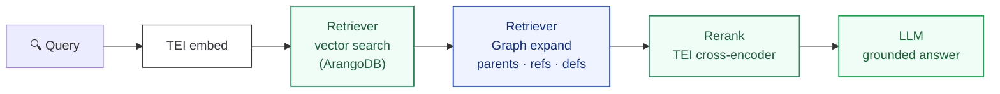

  <strong>Tunable at every step</strong> — pure vector or hybrid BM25+RRF, graph traversal depth, reranking strategy (slice / threshold / knee / adaptive), reranker model — all overridable per deployment.

### Why hybrid (not pure vector or pure graph)?
- **Pure vector** fails on **government legalese** — similar embeddings are **not the same as** same meaning.
- **Pure graph** captures entity links but misses semantic similarity.
- **Vector + graph** retrieves the article **and** its carve-outs together.

### What GENIE.AI does:
1. **Embed** the query (TEI).
2. **Vector search** over ArangoDB (similar chunks).
3. **Graph expansion** (by the retriever over ArangoDB graph) — pull parents, refs, definitions.
4. **TEI cross-encoder rerank** — re-score, then keep Top-N (slice/threshold) or adaptive utility-cost.
5. **Grounded LLM answer** — ChatQnA streams citation-backed response.

<strong>Key idea:</strong> the article, its carve-outs, and its definitions — pulled together in one retrieval. Every answer cites its source chunks.

---

Session 2 · One index, many languages

# Multilingual Engine / Streaming API

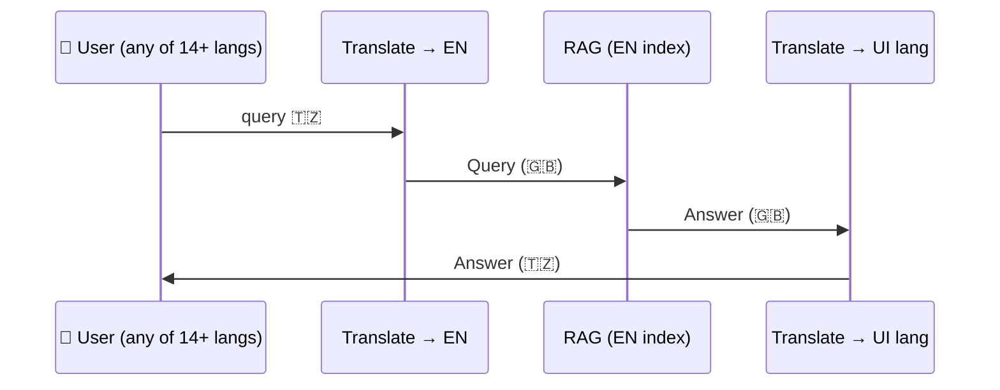

### One canonical index
- Knowledge base stored in **English** (canonical SSoT).
- Chunking, embedding, labeling — all English-native.

### 14 UI languages
- Query translation + answer translation **streamed** on the fly.
- Swahili · French · Arabic · Spanish · Portuguese + 9 more.

<strong>Key idea:</strong> one English index, consistent behaviour across languages. New language = add translator config, no re-index.

---

<!-- _class: demo -->

💻

Session 2 · Demo break

# Live Demo — Multilingual Retrieval

### What we'll show
- A question asked in **Spanish** against an English-only corpus.
- Retrieval happens on the **English** index (translated query).
- Answer is generated in **English** and re-translated back to **Spanish** (streamed).

### What to watch for
- **Latency** of the translation round-trip (~1–2s on top of RAG).
- **Citation faithfulness** — the same chunk is cited, regardless of language.
- **No re-indexing** when adding a new locale (config change only).

<strong>Demo:</strong> 5 min · live · assistant answers in 14 UI languages from a single English knowledge base.

---

<!-- _class: session-divider -->
<!-- _paginate: false -->

03

Session 3

# Trust, Identity &amp; Observability

Hard grounding, real identities, traceable answers.

---

Session 3 · Pillar 1 → "Local Ownership" — identity is the perimeter

# Authentication & Authorisation

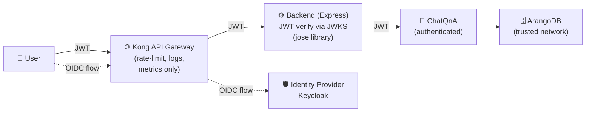

### What Keycloak handles
- **Federation**: SAML, Entra ID, OIDC, generic OIDC providers.
- **Single Sign-On**: one login for all GENIE.AI surfaces (web, mobile, admin).
- **Role/group mapping**: Keycloak groups can be propagated as claims into GENIE.AI metadata.

### What this means for you
- **OIDC at the edge** — login flow handled by Keycloak, tokens issued via standard OIDC.
- **JWT verified in depth** — verified not only in the backend but also in the OPEA services.
- **IDP swap is config** — change provider, keep the same JWT contract on the backend.

<strong>Key idea:</strong> standard protocols end-to-end — OIDC at Keycloak, JWT (RS256) verified in each backend via JWKS. No proprietary auth scheme.

---

Session 3 · Observability across every hop

# Observability: Trace Context Across Every Hop

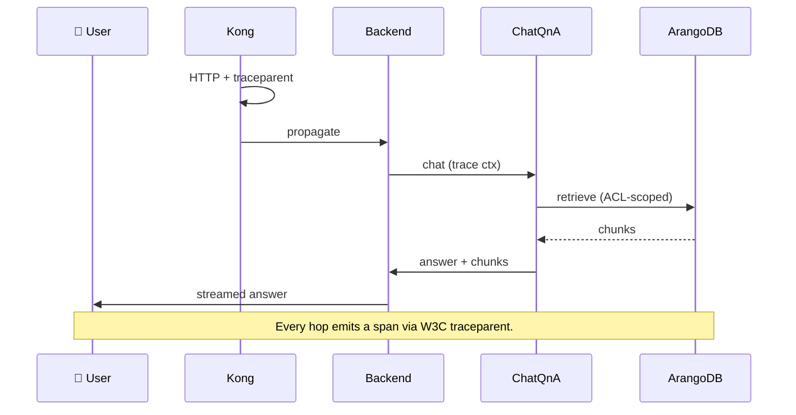

  

OpenTelemetry

W3C traceparent · every hop

  

RFC

W3C Trace Context standard

### Leverage:
- **VictoriaMetrics**, **VictoriaLogs** and **VictoriaTraces** solution for storage
- **Grafana** for dashboards

 

<strong>Key idea:</strong> every hop emits a span — same trace ID follows the question from browser to LLM. One request, one timeline.

<strong>Inspectable by design:</strong> the same trace ID lets legal officers see the exact document chunk that produced an answer — and SREs see the latency of every hop in the same view.

---

<!-- _class: demo -->

💻

Session 3 · Demo break

# Live Demo — Trace + Abstention

### What we'll show
- A real **chat question** in the deployed instance.
- Open **Grafana** → see the full trace.
- Click a span → see the **exact chunk** cited by the LLM (coupled with logs etc...).
- **Query Inspector** to keep trace of different queries

### What to watch for
- **Latency per hop** — vector search vs LLM generation.
- **Citation** — the answer shows which document chunk was used.
- **Grounding** — the model answers from cited chunks only.

<strong>Demo:</strong> 5 min · live · bring your own question · we trace it from browser to LLM in real time.

---

<!-- _class: session-divider -->
<!-- _paginate: false -->

04

Session 4

# Deployments &amp; Country Use Cases

GENIE.AI in the field — six countries, real pilots.

---

Session 4 · Deployment paths

# One Stack, Four Deployment Paths

### Local PoC — `docker compose`
- Single `docker-compose.yaml`, opt-in profiles.
- `opea` · `gpu-models` · `observability`.
- One-command setup on a laptop.

### Production — Ansible + Swarm
- **`deploy/ansible/`** playbooks with per-environment secrets.
- Images pulled from GitLab Container Registry (pre-built CI).
- Jinja2 templating + `ansible-vault` for secrets.

### Kubernetes (roadmap)
- Same images, different orchestrator.
- Helm charts planned.

### Remote GPU
- *See dedicated next slide.*

  

1

Same image, all paths

  

3

Compose profiles

  

∞

Scales horizontally

<strong>Key idea:</strong> one image, four deployment paths. Start local with `docker compose up`, scale to Swarm via Ansible, migrate to K8s when you need it. No code changes.

---

Session 4 · Remote GPU

# Air-Gapped GPU Deployment

```mermaid
flowchart LR
  subgraph CPU ["🖥️ CPU Node — app services"]
    direction TB
    Q["🌐 Query<br/>(user message)"]:::q
    R["🔍 Retrieve<br/>(vector + graph)"]:::r
    L["🧠 LLM Call<br/>(via GPU)"]:::l
    D["📄 Document<br/>(ingest path)"]:::q
  end

  subgraph GPU ["⚡ GPU Node — AI services"]
    direction TB
    V["💬 vLLM<br/>(LLM + translation)"]:::gpu
    E["📐 TEI<br/>(embed)"]:::gpu
    RR["🔀 TEI<br/>(rerank)"]:::gpu
    DOC["📄 docling-serve<br/>(OCR / parse)"]:::gpu
  end

  subgraph LINK ["🛰️ Encrypted CPU↔GPU channel"]
    direction TB
    TLS["🔒 HTTPS + WSS<br/>Bearer VLLM_API_KEY"]
  end

  CPU ==> LINK ==> GPU

  classDef q fill:#eef3ff,stroke:#1b3fad,stroke-width:1.5px,color:#122f87;
  classDef gpu fill:#f0fdf6,stroke:#16a34a,stroke-width:1.5px,color:#166534;
  class Q,R,L,D q
  class V,E,RR,DOC gpu
```

  

TLS

Encrypted CPU↔GPU

  

Auth

VLLM_API_KEY

  

Air-gap

Sovereign option

<strong>Key idea:</strong> CPU node runs app services (Query, Retrieve, LLM call). GPU node runs AI services (vLLM, TEI, docling). All AI calls go over HTTPS + API key, no internet required at runtime.

---

Session 4 · Configuration

# Tunable at Every Layer

### Secrets (required, no defaults)
- `ARANGO_PASSWORD` · `KEYCLOAK_*` · `EMAIL_*` (SMTP)
- `HUGGING_FACE_HUB_TOKEN` · `VLLM_API_KEY`
- Server **fails fast** if missing — no silent insecure fallback.

### Deployment-specific
- `VLLM_LLM_MODEL_ID` · `EMBEDDING_MODEL_ID` · `RERANKER_MODEL_ID`
- `RERANKING_STRATEGY` (slice / threshold / knee / adaptive)
- `VLLM_MAX_MODEL_LEN` per GPU file (`env.t4`, `env.rtx6000`)

### Runtime toggles
- `ENABLE_OBSERVABILITY=1` (off by default — zero overhead)
- `STREAMING_TRANSLATION_ENABLED` · `MULTI_TURN_BLEND_ENABLED`
- `CHATQNA_ENFORCE_ABSTENTION=true`
- `VICTORIAMETRICS_RETENTION` · `VICTORIATRACES_RETENTION` (data lifecycle)

### Prompt overrides
- `CHATQNA_SYSTEM_PROMPT` (env var beats built-in default)
- `LABEL_SELECTOR_SYSTEM_PROMPT` · `CONTEXTUAL_RETRIEVAL_PROMPT`

<strong>Two-tier priority:</strong> every config has a built-in default in code; env vars override per deployment. <strong>~60 env vars</strong> documented in `env` — groups: secrets (~10), deployment-specific (~15), runtime toggles (~15), prompt overrides (~3), plus URLs, ports, GPU tuning. Switch models, re-tune, add the observability stack — without touching code.

---

Session 4 · Frontend design system

# Your Brand, Same Codebase

### CSS custom properties
- Every colour is a `--ds-*` token (light + dark modes).
- Override variables in your `.env` — same Docker image, different look.
- **Typography-driven**: Inter body, JetBrains Mono for code/labels.
- **Self-hosted fonts** — DPG compliant, no external CDN.

### Theming examples (from existing deployments)
- Brand colours, logo, and typography — per deployment.
- Dark mode via Bootstrap 5.3 `data-bs-theme` (no JS).
- Component restyle without forking the codebase.
- Mobile + web parity via `KeycloakConfig.supportedLocaleCodes`.

  

14

UI languages

  

DS

CSS custom properties

  

0

External CDN

  

1

Same source code, all brands

<strong>Key idea:</strong> per-deployment branding without forking the codebase. 14 languages at strict key parity — locale whitelist controls web, mobile, and Keycloak from a single config file.

---

Session 4 · Live in the field

# GENIE.AI in the Field

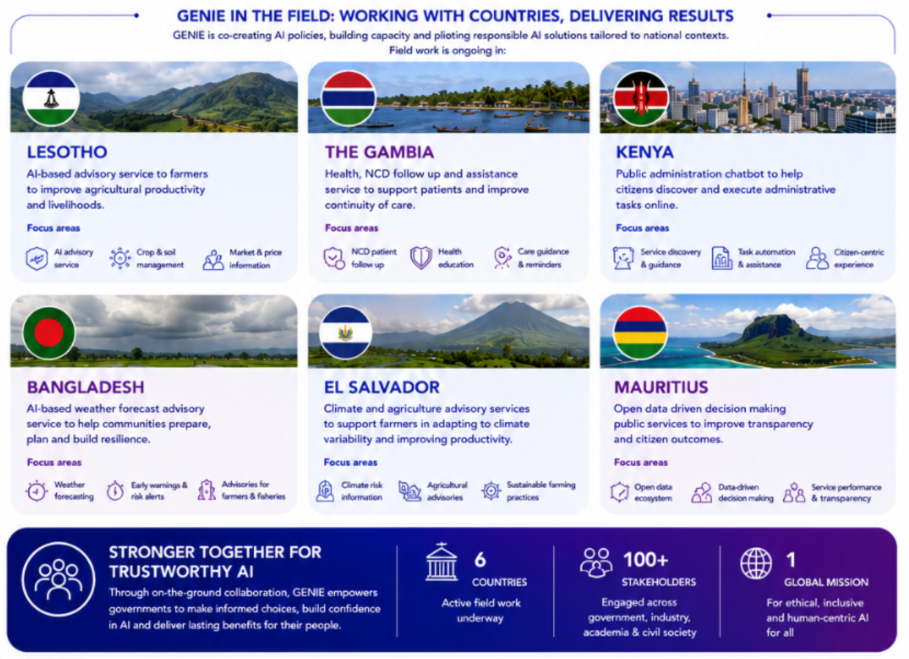

---

Session 4 · Q&amp;A &amp; next steps

# Open Floor

  

  

    

      
QUESTIONS ?

      
Bring your hardest data-sovereignty question

    

  

  

    <strong>Next:</strong> Part 2 — Agile Scoping 
    Marketplace of Skills · Impact Mapping · Dot-vote
  

  

    Thank You!
  

