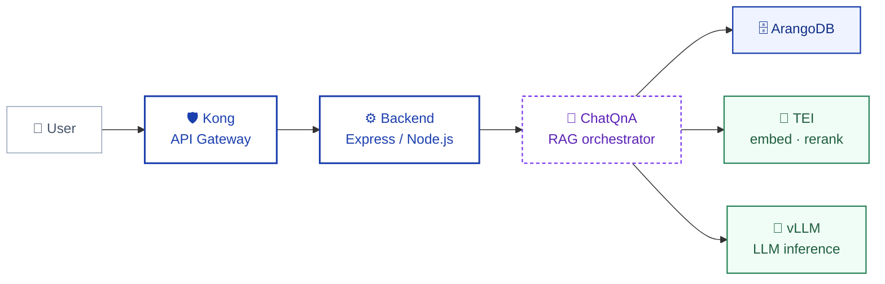
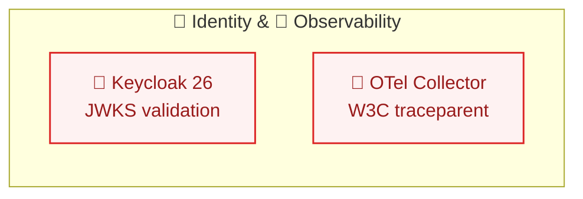
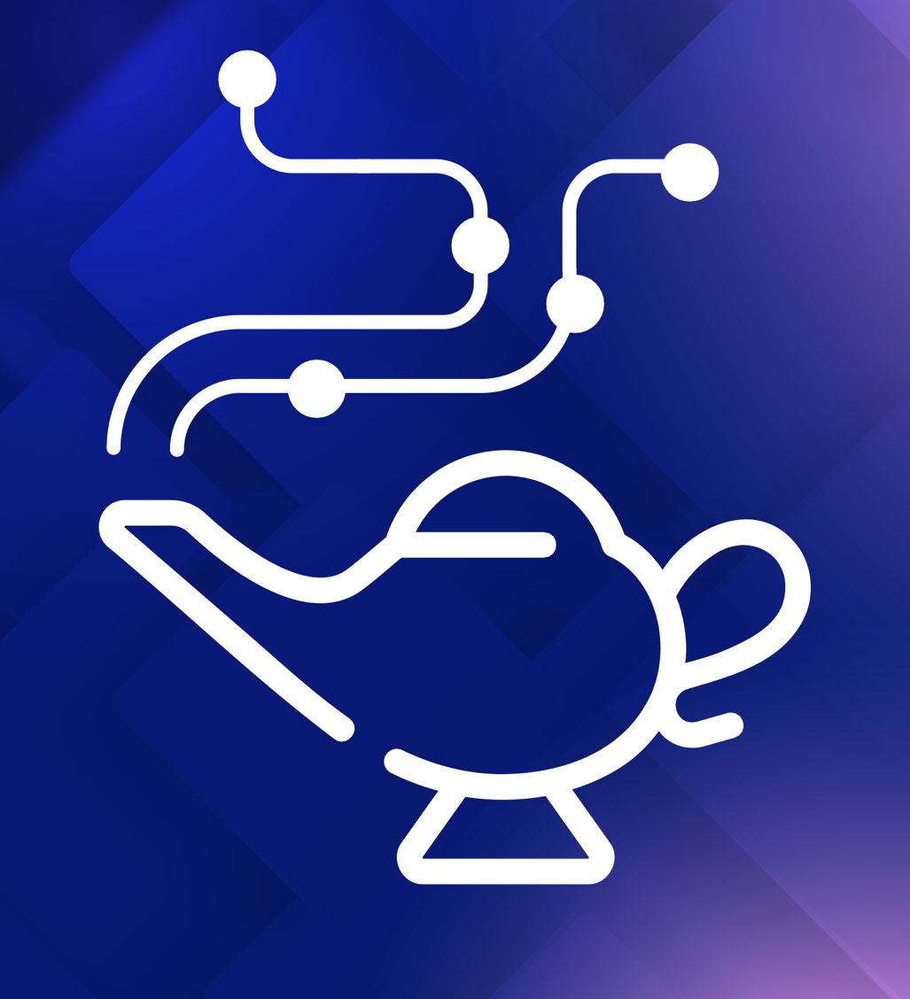
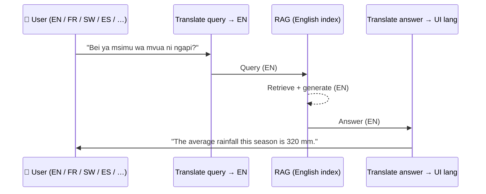
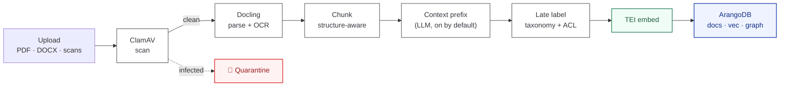
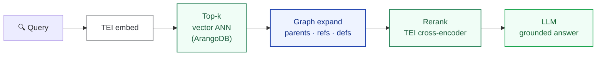
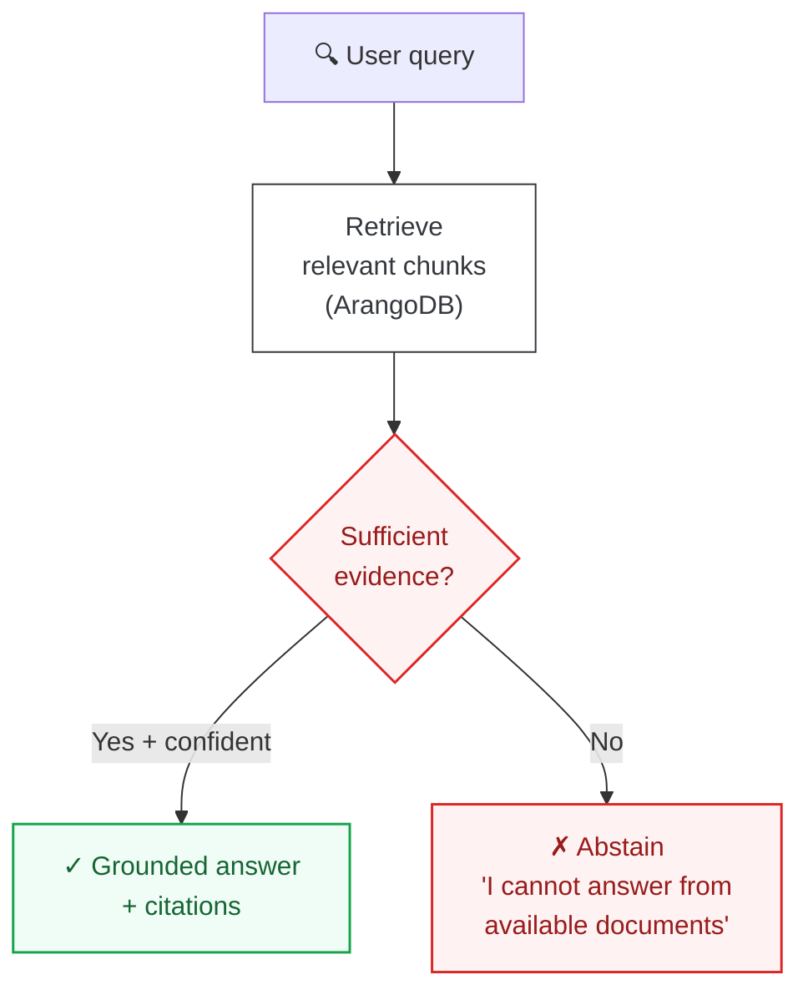
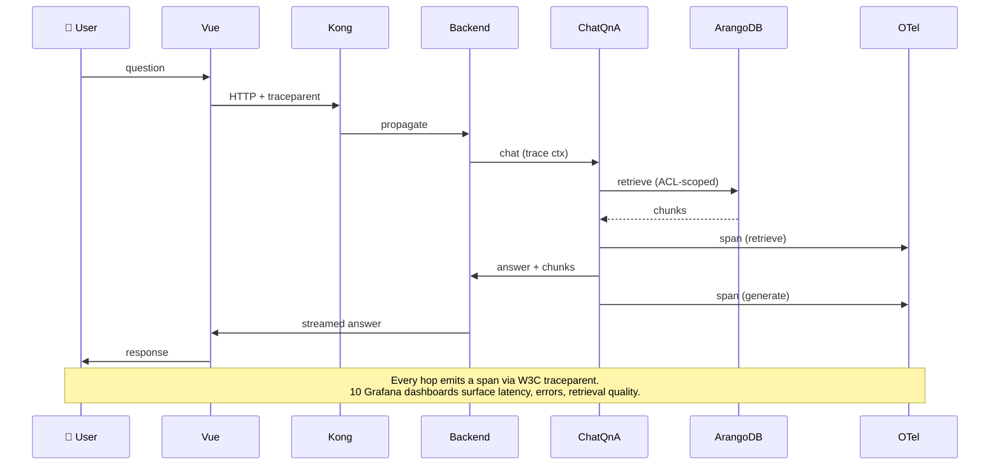

<!-- _class: title -->
<!-- _paginate: false -->

GENIE.AI

GENIE.AI — Sovereign RAG Framework

# Sovereign AI for the Public Sector

Discovery Workshop — Part 1 of 2 · GENIE.AI Deep Dive

Government of Kenya · ITU Technical Working Group

---

<!-- _class: title -->
<!-- _paginate: false -->

GENIE.AI

Workshop — Part 1 · 60 min

# Agenda

1 Sovereign AI &amp; Architecture Fundamentals

2 Hybrid Ingestion, Vector-Graph RAG &amp; Multilingual

3 Security, IAM &amp; Zero-Hallucination Governance

4 Live Architecture Walkthrough &amp; Case Studies

    

Part 2 — Agile Scoping (1 h) follows after the break.

---

Before we start · 60-second shared definition

# What is GENIE.AI

 

**ITU GENIE.AI** — *Global Empowerment through Intelligence and Equity.*

An **open-source framework** for public institutions to prototype, deploy and run custom generative AI solutions — chatbots, assistants, content tools — **at low cost, with full control, and without external API calls.**

Runs on **government-controlled infrastructure**: Intel/NVIDIA stacks, Docker Swarm or Kubernetes. **An ITU initiative**.

ITU · Open Source

<strong>Why now:</strong> governments want AI but most can't afford proprietary solutions, lack sovereign data control, and depend on vendors locked to non-local languages.

---

<!-- _class: session-divider -->
<!-- _paginate: false -->

01

Session 1

# Why Sovereign AI &amp; Architecture

Public-sector AI under government control — from silicon to UI.

---

Session 1 · The GENIE.AI mandate

# A Strategic Approach to Public Value

No isolated projects — ecosystem, enablement, and impact delivered as one ITU programme.

OSEE · GENIE.AI · AI for Good Challenge

**Ecosystem** — *Building the foundations.*
- Open-source training framework
- Skills development in country
- Open-source programme offices
- Ecosystem strengthening & mobilisation

**Enablement** — *Turning foundations into capabilities.*
- Open-source AI building blocks
- Expert training
- Real-world implementation experience

**Impact** — *Delivering impact at scale.*
- Bringing innovation into the field
- Connecting with local ecosystems
- Accelerating AI-powered public services

---

Session 1 · Mandate alignment

# Aligned with ITU-D Resolutions

### Direct mandate link
- **Resolution 89** — Digital transformation for sustainable development.
- **Resolution 73** — Structured digital capacity development.
- **Resolution 90** — Fostering ICT-centric innovation ecosystems.
- **Resolution 45** — Trusted, sovereign, DPI-aligned AI.

All operationalized through the **Baku Declaration &amp; Baku Action Plan (2026–2029)**.

ITU-D priorities · AFR Flagship = Kenya

<strong>AFR Flagship — Kenya:</strong> GENIE.AI is the designated AI framework for the ITU Africa Regional Initiative.

---

Session 1 · The architecture

# One Architecture — Sovereign by Design

### Core stack (all open-source)
- **Frontend** — Vue.js web · Flutter mobile.
- **Gateway** — Kong with OIDC plugin.
- **App layer** — Express / Node.js BFF (JWT verify).
- **Storage** — ArangoDB (docs + vectors + graph).

### Inference (on your GPU/CPU)
- **LLM** — vLLM (OpenAI-compatible API).
- **Embeddings + rerank** — TEI.
- **Hardware** — Intel (CPU) and NVIDIA (GPU) validated.

<strong>Key idea:</strong> the data flow lives entirely on your stack. Identity (Keycloak 26) and observability (OTel + W3C traceparent) are <em>rails</em> across every hop — not bolt-ons.

---

Session 1 · What "sovereign" actually means here

# Sovereignty Guarantees

  

  
Business as usual

  
GENIE.AI

  
Pilot cost

  
$200k–500k (closed-source RFP)

  
≈$50k (open-source stack)

  
Time to pilot

  
6–12 months

  
3–4 weeks

  
External API calls

  
Always-on vendor endpoints

  
Zero — fully on-prem

  
UI languages

  
1 (English) or expensive add-on

  
11+ from a single English index

  
Vendor lock-in

  
Proprietary weights + APIs

  
Open weights, open source (DPG)

### All artefacts in your jurisdiction
- Docker images · models · ArangoDB · vector store · logs

### Open weights, open source
- Apache-2.0 / MIT. Compliant with the **OSI Open Source AI Definition**.
- No proprietary model APIs. **Digital Public Good** (DPG) registered.

### Hardware-agnostic
- Intel &amp; NVIDIA stacks validated. vLLM + TEI inference.

### No vendor lock-in
- Same compose file: laptop PoC → Docker Swarm production.
- Kubernetes manifests planned (same images, different orchestrator).

<strong>Takeaway:</strong> "sovereign" is structural here, not contractual. Every layer runs inside your perimeter.

---

Session 1 · The five principles guiding every GENIE.AI build

# The Five Brand Pillars

  
01

  
Local Ownership

  
Code, data, models — all on your stack.

  
<em>Keycloak + ArangoDB stay on-prem.</em>

  
02

  
Open Source

  
OSI + DPG compliant. Apache-2.0 / MIT.

  
<em>No proprietary model APIs.</em>

  
03

  
Zero-Hallucination

  
Architectural abstention when evidence is absent.

  
<em>Every answer cites its source chunk.</em>

  
04

  
Scalability &amp; Accessibility

  
11+ UI languages · web + mobile clients.

  
<em>Laptop PoC → Docker Swarm. Kubernetes (roadmap).</em>

  
05

  
Real-World Deployment

  
Operational since 2024 across UN missions.

  
<em>6 active country pilots · 100+ stakeholders.</em>

<strong>Workshop tie-in:</strong> Session 3 zooms into pillar #1 (Local Ownership → Keycloak + W3C trace) and pillar #3 (Zero-Hallucination → grounding &amp; abstention).

---

<!-- _class: session-divider -->
<!-- _paginate: false -->

02

Session 2

# How GENIE.AI Works

From document to grounded, multilingual answer — every stage under your control.

---

Session 2 · The operating model

# Deploy, Configure, Tune, Pilot

**1. Deploy** a GENIE.AI instance in cloud or on-premise.

**2. Select data** — drag-and-drop, plus custom integrations.

**3. Tune** RAG macro-parameters and configure the UI (or connect to a custom UI / messenger app).

**4. Launch** the pilot, gather feedback, iterate — **with full control at every step**.

Deploy → Configure → Tune → Pilot

<strong>Key idea:</strong> the pilot is in your hands. No vendor in the loop. No external API calls.

---

Session 2 · One index, many languages

# Multilingual Engine

### One canonical index
- Knowledge base stored in **English** (canonical SSoT).
- Chunking, embedding, labeling — all English-native.

### 11+ UI languages
- Query translation + answer translation on the fly.
- **Swahili · French · Arabic · Spanish · Portuguese** + 6 more.

  

11+

UI languages out-of-the-box

  

1

Canonical English index

  

+1

Add a language = config change

  

0

Re-indexing when extending

<strong>Key idea:</strong> one English index, consistent behaviour across languages. New language = add translator config, no re-index.

---

Session 2 · How documents enter the system

# Ingestion Pipeline

<strong>Key idea:</strong> one standard pipeline — no ministry-specific glue scripts. Context prefix + late labeling happen after ClamAV clears the file.

---

Session 2 · How retrieval works

# Hybrid Vector–Graph Retrieval

### Why hybrid?
**Pure vector** misses entity links, fails on legalese.
**Pure graph** misses semantic similarity.

### What GENIE does
Vector top-k → graph expansion (parents · refs · defs) → TEI cross-encoder rerank → grounded LLM answer.

<strong>Key idea:</strong> retrieve the article, its exceptions, and its definitions — together.

---

<!-- _class: session-divider -->
<!-- _paginate: false -->

03

Session 3

# Trust, Identity &amp; Observability

Hard grounding, real identities, traceable answers.

---

Session 3 · Pillar 1 → "Local Ownership" made technical

# Identity: Keycloak 26 + OIDC / SAML / Entra

```mermaid
flowchart LR
  U["👤 User"] --> IDP["🛡️ Identity Provider<br/>Keycloak 26 / Entra / SAML"]
  IDP -->|OIDC token| K["Kong<br/>OIDC plugin"]
  K -->|JWT| B["⚙️ Backend<br/>JWT verify (JWKS)"]
  B -->|user claims + ACL| ACL["📑 Document ACL<br/>just-in-time claims"]
  ACL --> Q["🧠 ChatQnA<br/>scoped to user entitlements"]
  Q --> A["🗄️ ArangoDB<br/>scoped query"]

classDef client fill:#ffffff,stroke:#94a3b8,stroke-width:1px,color:#475569;
classDef gateway fill:#ffffff,stroke:#1b3fad,stroke-width:2px,color:#1b3fad;
classDef core fill:#ffffff,stroke:#34373d,stroke-width:1px,color:#34373d;
classDef data fill:#eef3ff,stroke:#1b3fad,stroke-width:1.5px,color:#122f87;
classDef ai fill:#f0fdf6,stroke:#2b855b,stroke-width:1.5px,color:#1f5e3f;
classDef orch fill:#ffffff,stroke:#7c3aed,stroke-width:1.5px,stroke-dasharray:4 3,color:#5b21b6;
classDef risk fill:#fef2f2,stroke:#dc2626,stroke-width:1.5px,color:#991b1b;
classDef ok fill:#f0fdf6,stroke:#16a34a,stroke-width:1.5px,color:#166534;
```

### What Keycloak handles
- **Federation**: SAML, Entra ID, OIDC, generic OIDC providers.
- **JWT access tokens** validated via **JWKS** (rotated keys).
- **Just-In-Time (JIT) provisioning**: user claims → per-document ACL tags on first hit.
- **Document-level ACL** evaluated at retrieval time.

### What this means for you
- "No rights → no chunk" — enforced, not promised.
- Every document carries per-chunk entitlement tags.
- IDP swap is a config change, not a code change.

<strong>Key idea:</strong> identity is the perimeter. Document-level ACL makes governance enforceable, not aspirational.

---

Session 3 · Pillar 3 → "Zero-Hallucination"

# Grounding: Zero-Hallucination Decision

"<strong>If the answer is not in your documents, the system abstains.</strong> It does not improvise."

<strong>Key idea:</strong> safer than "best-effort guessing." The model refuses to answer rather than fabricate — and every answered question ships with citations.

---

Session 3 · Observability across every hop

# Observability: End-to-End Trace Context

  

OTel

W3C traceparent · every hop

  

10

Pre-built Grafana dashboards

  

1 env var

Enable the full obs stack

"<strong>Inspectable by design.</strong> Every answer carries the exact document chunk that produced it — auditable end-to-end via W3C <code>traceparent</code>."

<strong>Key idea:</strong> legal officers, compliance and SREs see the same data — the exact chunk that synthesized an answer, plus the latency of every hop. Built on the <strong>W3C trace context</strong> standard.

---

<!-- _class: session-divider -->
<!-- _paginate: false -->

04

Session 4

# Deployments &amp; Country Use Cases

GENIE.AI in the field — six countries, real pilots.

---

Session 4 · Operational deployment

# docker-compose Profiles

### Core stack — always on
- Frontend · Backend · Kong · Keycloak
- ArangoDB · Redis · Document repository
- ClamAV · Dataprep

### Three opt-in profiles
- **`opea`** → activates AI/ML services (ChatQnA, Dataprep).
- **`gpu-models`** → adds vLLM + TEI inference on GPU.
- **`observability`** → enables OTel + Grafana + Victoria stack.

  

1

Same compose file

  

3

Opt-in profiles

  

∞

Scales horizontally (Swarm)

<strong>Key idea:</strong> you choose your own complexity. PoC on a laptop, production on Docker Swarm. Kubernetes is on the roadmap (same images, different orchestrator).

---

Session 4 · Active deployments

# GENIE.AI in the Field

6 active country pilots · 100+ stakeholders · 1 global mission

<strong>Kenya's pilot focus:</strong> public-administration chatbot — service discovery, task automation, citizen-centric experience.

---

Session 4 · Use cases &amp; Q&amp;A

# Use Cases × Building Blocks × Live-In

| Use case | Building block | Data class | Live in |
|----------|---------------|------------|---------|
| **Agriculture extension** | Hybrid retrieval · late label | Public docs + ministry corpus | El Salvador, The Gambia, Bangladesh |
| **Preventive health** | Keycloak ACL · grounding | Public-health guidelines | The Gambia, Mauritius |
| **Climate-risk advisories** | Vector+graph · trace context | Weather + policy docs | El Salvador, Bangladesh, Kenya (pilot) |

<strong>Q&amp;A — open floor.</strong> Bring your hardest data-sovereignty question.
 After the break: <strong>Part 2 — Agile Scoping</strong> (Marketplace of Skills · Impact Mapping · Dot-vote).

<strong>Workshop tie-in:</strong> in Part 2, we'll down-select ONE of these use cases (or a new one from your team) for the Kenya pilot — keeping it low-risk and zero-PII.

