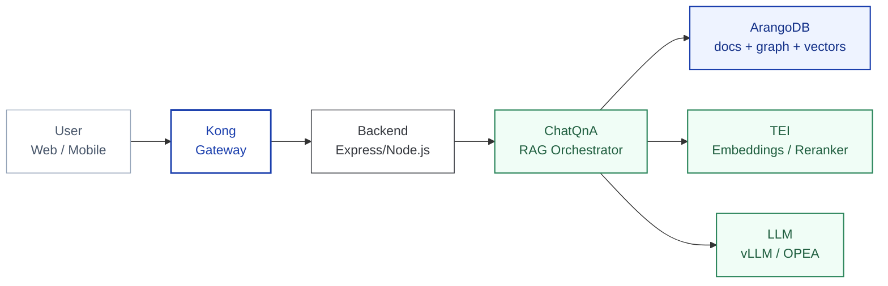
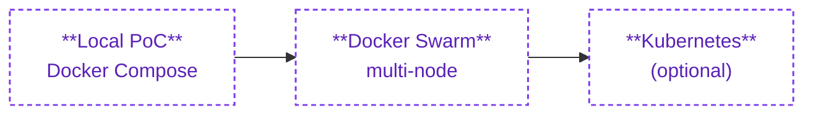
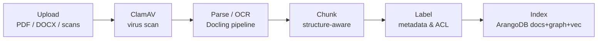
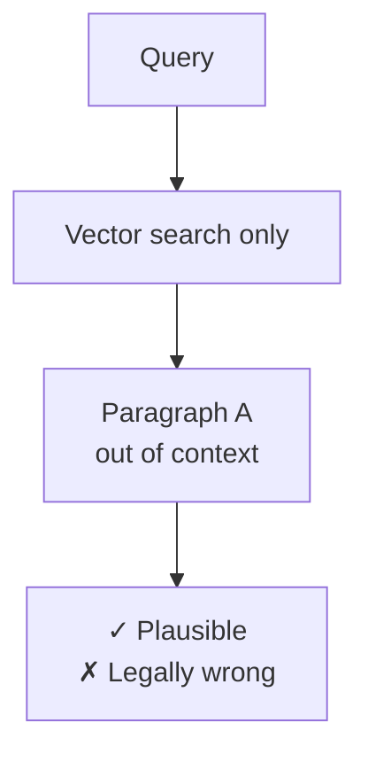
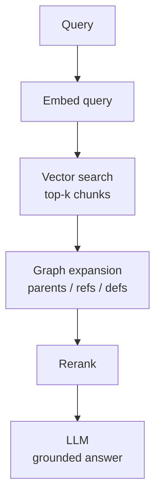
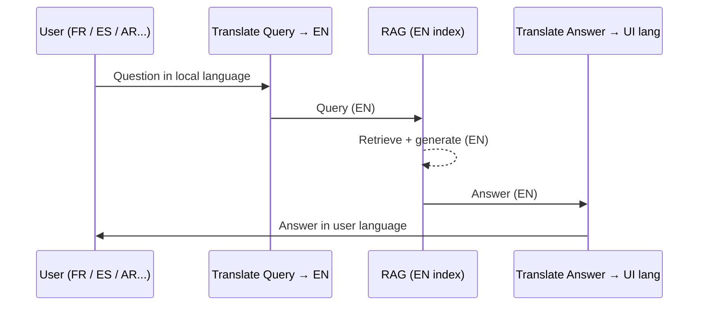
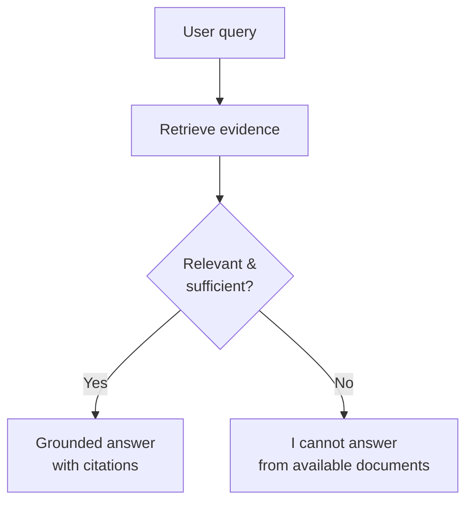
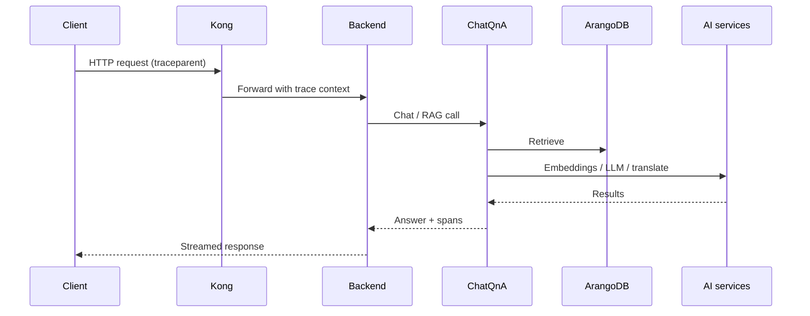
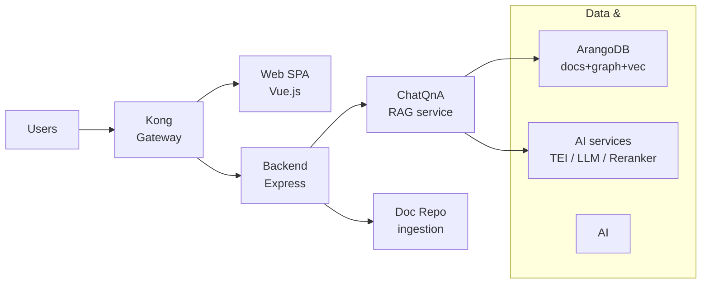

<!-- Title -->

<!-- _class: title -->
<!-- _paginate: false -->

GENIE.AI

GENIE.AI — Sovereign RAG Framework

# Sovereign AI &amp; Architecture Fundamentals

Open-source RAG for public services — architecture, ingestion, security, and deployments

2026-09-XX

---

<!-- Agenda -->

<!-- _class: title -->
<!-- _paginate: false -->

GENIE.AI — Session Overview

# Agenda

1 Sovereign AI &amp; Architecture Fundamentals

2 Ingestion, Vector–Graph RAG &amp; Multilingual Engine

3 Security, IAM &amp; Zero-Hallucination Governance

4 Live Architecture &amp; Case Studies

---

# What is GENIE.AI

Purpose-built framework

- Open-source RAG framework for public institutions.
- Bridges AI policy ambitions and real services.
- Designed for chatbots, assistants and content tools.

- Runs on government-controlled infrastructure.
- Focus on low cost and local capacity-building.
- Technical backbone for AI-powered public services.

---

# Why GENIE Matters

Current reality vs GENIE response

**Current reality**
- High-cost proprietary GenAI.
- Limited data/model sovereignty.
- Weak support for local languages.
- Vendor lock-in and long-term dependency.

**GENIE response**
- Open source, DPG/DPI aligned.
- Sovereign by design, deployable by governments.
- Localized and inclusive by configuration.
- Agentic-friendly roadmap for advanced use cases.

---

# Business as Usual vs GENIE.AI

Time, cost, risk

|                | Business as usual | With GENIE.AI |
|----------------|-------------------|---------------|
| Budget         | ≈ US$ 250k        | ≈ US$ 50k     |
| Timeline       | 6–12 months       | 3–4 weeks     |
| Process        | RFP, vendor, custom build | Curate, configure, pilot |
| Ownership      | Vendor solutions  | Institutional assets |
| Risk           | Lock-in, pricing, data | Minimized; sovereign control |

<strong>Takeaway:</strong> Same capabilities, but faster, cheaper, and under public control.

---

# Session 1 — Sovereign AI &amp; Architecture

Where it runs and how it’s built

- Sovereign, standards-based architecture.
- No external model APIs: vLLM / TEI on your stack.
- Clear separation between UI, gateway, backend, RAG and data.
- One topology from laptop PoC to Swarm / Kubernetes.

---

# GENIE.AI Core Stack

From user to AI services

<strong>Key idea:</strong> UI and business logic are decoupled from models and storage.

---

# Deployment Topologies

From laptop PoC to production cluster

**Same service set, three orchestrators**
- One `docker-compose.yaml` for every environment.
- Profiles to enable/disable AI &amp; observability.

**Kubernetes supported out-of-the-box**
- Same compose contract maps to K8s manifests.
- Gradual migration: laptop → Swarm → K8s.

<strong>Key idea:</strong> One architecture, three orchestrators — laptop, Swarm, Kubernetes.

---

# Session 2 — Ingestion &amp; Vector–Graph RAG

From documents to grounded answers

- Ingestion pipeline with ClamAV, parsing and chunking.
- ArangoDB as multi-model store.
- Hybrid vector–graph retrieval.
- Multilingual engine with single English index.

---

# Ingestion Pipeline

From raw files to knowledge base

<strong>Key idea:</strong> one standard pipeline, no ad-hoc scripts per ministry.

---

# Why Vector-Only RAG Fails

Legal and policy documents

- Dense, nested structures and annexes.
- Cross-references and definitions across sections.
- Semantically similar ≠ legally equivalent.

<strong>Key idea:</strong> structure and relationships matter as much as similarity.

---

# Hybrid Vector–Graph RAG

Combining meaning and structure

<strong>Key idea:</strong> retrieve the right article, its exceptions, and its definitions together.

---

# Multilingual Engine &amp; Single Source of Truth

One English index, many UI languages

<strong>Key idea:</strong> one canonical index, consistent behaviour across languages.

---

# Session 3 — Security, IAM &amp; Governance

Zero-trust, zero-hallucination

### Identity

- Keycloak (OIDC / SAML).
- SSO across UI, admin, APIs.
- Roles &amp; groups mapping.

### Permissions

- Document-level ACL.
- Just-in-time checks.
- “No rights → no chunk”.

### Grounding

- Only retrieved chunks.
- Confidence thresholds.
- Abstain instead of hallucinate.

---

# Zero-Hallucination Behaviour

Simple decision path

<strong>Key idea:</strong> safer for health, law and regulation than “best-effort guessing”.

---

# Trace Context &amp; Auditability

End-to-end visibility

<strong>Key idea:</strong> every hop is traceable for debugging, SLOs and legal review.

---

# Session 4 — Architecture &amp; Case Studies

From topology to deployments

- Microservices topology at a glance.
- Compose profiles, Swarm / Kubernetes mapping.
- Example deployments and patterns.
- Open Q&amp;A with engineering team.

---

# Microservices Topology

High-level view

<strong>Key idea:</strong> easy to reason about what scales, what is stateful, and what sits near the network edge.

---

# Example Deployments &amp; Use Cases

Patterns, not one-offs

### Use cases

- Agriculture advisory assistants.
- Public health information assistants.
- Policy / regulatory assistants.

### Patterns

- Same core architecture, different collections.
- Different languages per country.
- Same governance and deployment pipeline.

---

# Q&amp;A &amp; Technical Feasibility

Discussion with your team

**Topics**
- Target environment (cloud / on-prem).
- Swarm vs Kubernetes.
- Identity integration (Keycloak, IdPs).
- GPU/CPU sizing and constraints.

**Next steps**
- Define a pilot scope and success criteria.
- Align on governance and observability.
- Plan a phased rollout to production.

---

<!-- Closing -->

<!-- _class: closing -->
<!-- _paginate: false -->

# Thank You

GENIE.AI — Sovereign AI for the Public Sector

  
Happy to deep dive into any box of the architecture during Q&amp;A.

