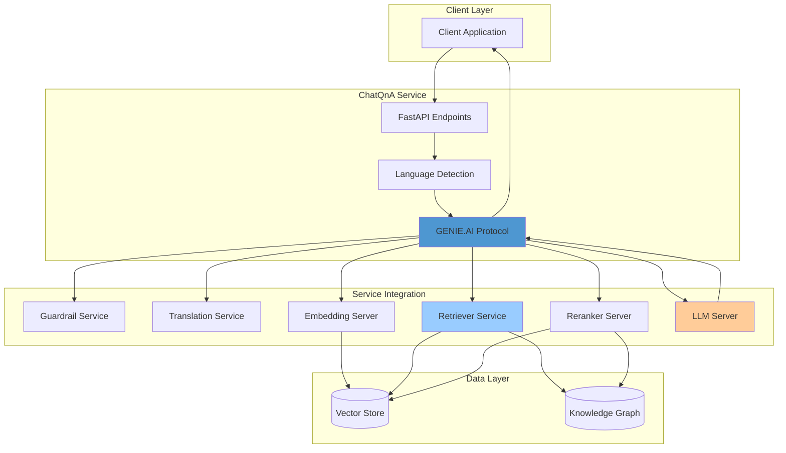

# GENIE.AI ChatQnA Microservice

## Overview

The GENIE.AI ChatQnA microservice is an advanced conversational AI service built on the [OPEA (Open Platform for Enterprise AI)](https://opea.dev) framework. It provides OpenAI-compatible chat completions with enhanced multilingual support, content moderation, and integration with retrieval-augmented generation (RAG) capabilities.

This service extends the standard OPEA ChatQnA implementation with ITU-specific features including translation services, guardrails for content safety, and flexible deployment modes.

---

## Table of Contents

- [Features](#features)
- [Architecture](#architecture)
- [Deployment Modes](#deployment-modes)
- [Prerequisites](#prerequisites)
- [Installation](#installation)
- [Configuration](#configuration)
- [API Endpoints](#api-endpoints)
- [Development](#development)
- [Deployment](#deployment)
- [Troubleshooting](#troubleshooting)

---

## Features

### Core Capabilities

- **OpenAI-Compatible API**: Drop-in compatibility with OpenAI chat completion endpoints
- **Multilingual Support**: Automatic language detection and translation services
- **RAG Integration**: Seamless integration with retrieval services for context-aware responses
- **Content Moderation**: Built-in guardrail service for safety and compliance
- **Async Processing**: High-performance asynchronous HTTP client architecture
- **Multiple Deployment Modes**: Flexible configurations for different use cases

### Advanced Features

- **Service Integrations**:
  - Guardrail service for content filtering
  - Translation service for multi-language support
  - Embedding server for vector representations
  - Retriever service (hybrid vector-graph search)
  - Rerank server for result optimization
  - LLM server for text generation

---

## Architecture



### Service Flow

1. **Request Reception**: Client sends chat completion request
2. **Language Detection**: Automatic detection of input language
3. **Guardrail Check**: Content moderation and safety filtering
4. **Translation** (optional): Translation to English for processing
5. **Context Retrieval**: RAG pipeline fetches relevant context
6. **LLM Generation**: Text generation using language models
7. **Reranking**: Result optimization and ranking
8. **Translation** (optional): Translation back to user's language
9. **Response Delivery**: Formatted response to client

---

## Deployment Modes

The service supports three deployment modes configured via environment variables:

### CHATQNA_GENIE_AI (Full GENIE.AI Mode)

**Description**: Complete GENIE.AI functionality with all services enabled

**Features**:
- Full translation service integration
- All RAG pipeline components active
- Complete multilingual support

**Environment Variables**:
```bash
export CHATQNA_MODE="CHATQNA_GENIE_AI"
export TRANSLATION_SERVICE_ENABLED=true
export GUARDRAIL_SERVICE_ENABLED=true
```

### CUSTOM (define as part of the ChatQnAService class)

**Description**: GENIE.AI custom pipeline

**Custom Features (EXAMPLE)**:
- Full translation service integration
- Reranker component disabled  

**Environment Variables (EXAMPLE)**:
```bash
export CHATQNA_MODE="CUSTOM_MODE_NAME"
export TRANSLATION_SERVICE_ENABLED=true
export RERANKER_SERVICE_ENABLED=false
```

---

## Prerequisites

### Required Software

- **Docker**: 20.10+ for container deployment
- **NVIDIA Docker Runtime**: For GPU-enabled deployments
- **Python**: 3.10+ (for local development)
- **Hugging Face Account**: For model access

### Required Services

The following services must be running (depending on deployment mode):

| Service | Port | Required | Purpose |
|---------|------|----------|---------|
| LLM Server | 9000 | Yes | Text generation |
| Embedding Server | 6000 | Yes | Vector embeddings |
| Retriever Service | 7025 | Yes | Context retrieval |
| Reranker Server | 80 | Optional | Result reranking |
| Guardrail Service | Variable | Optional | Content moderation |
| Translation Service | Variable | Optional | Multilingual support |

### Hardware Requirements

**Minimum**:
- CPU: 4 cores
- RAM: 8 GB
- Storage: 20 GB

**Recommended (for GPU)**:
- GPU: NVIDIA with 8+ GB VRAM
- RAM: 16 GB
- Storage: 50 GB SSD

---

## Installation

### Option 1: Docker Deployment (Recommended)

1. **Pull the Image**:
   ```bash
   docker pull genieai/chatqna:latest
   ```

2. **Run the Container**:
   ```bash
   docker run -d \
     --name chatqna-service \
     --gpus all \
     -p 9000:9000 \
     -e CHATQNA_MODE=CHATQNA_GENIE_AI \
     -e HUGGING_FACE_HUB_TOKEN=your_token_here \
     -e LOG_FLAG=true \
     genieai/chatqna:latest
   ```

3. **Verify Deployment**:
   ```bash
   curl http://localhost:9000/health
   ```

### Option 2: Build from Source

1. **Clone Repository**:
   ```bash
   git clone https://github.com/your-org/genie-ai-overlay.git
   cd genie-ai-overlay/chatqna
   ```

2. **Build Docker Image**:
   ```bash
   docker build -f Dockerfile-chatqna_genie-ai -t genieai/chatqna:latest .
   ```

3. **Run Service**:
   ```bash
   docker-compose up -d
   ```

### Option 3: Local Development

1. **Install Dependencies**:
   ```bash
   pip install -r requirements.txt
   ```

2. **Set Environment Variables**:
   ```bash
   export HUGGING_FACE_HUB_TOKEN=your_token_here
   export CHATQNA_MODE=CHATQNA_GENIE_AI
   ```

3. **Run Service**:
   ```bash
   python genieai_chatqna.py
   ```

---

## Configuration

### Environment Variables

| Variable | Type | Default | Description |
|----------|------|---------|-------------|
| `CHATQNA_MODE` | string | CHATQNA_GENIE_AI | Deployment mode |
| `HUGGING_FACE_HUB_TOKEN` | string | - | Hugging Face API token |
| `LOG_FLAG` | boolean | true | Enable logging |
| `GUARDRAIL_SERVICE_IP` | string | localhost | Guardrail service host |
| `GUARDRAIL_SERVICE_PORT` | int | 8080 | Guardrail service port |
| `TRANSLATION_SERVICE_IP` | string | localhost | Translation service host |
| `TRANSLATION_SERVICE_PORT` | int | 8001 | Translation service port |
| `EMBEDDING_SERVER_IP` | string | localhost | Embedding server host |
| `EMBEDDING_SERVER_PORT` | int | 6000 | Embedding server port |
| `RETRIEVER_SERVICE_IP` | string | localhost | Retriever service host |
| `RETRIEVER_SERVICE_PORT` | int | 7025 | Retriever service port |
| `RERANK_SERVER_IP` | string | localhost | Reranker server host |
| `RERANK_SERVER_PORT` | int | 80 | Reranker server port |
| `LLM_SERVER_IP` | string | localhost | LLM server host |
| `LLM_SERVER_PORT` | int | 9000 | LLM server port |

### Language Configuration

The service uses `language_codes.json` for supported languages. To add new languages:

1. Edit `language_codes.json`:
   ```json
   {
     "supported_languages": {
       "en": "English",
       "fr": "French",
       "sw": "Swahili",
       "es": "Spanish"
     }
   }
   ```

2. Restart the service to apply changes.

---

## API Endpoints

### Chat Completions

**Endpoint**: `POST /v1/chat/completions`

**Description**: OpenAI-compatible chat completions endpoint

**Request Body**:
```json
{
  "messages": [
    {
      "role": "user",
      "content": "Hello, how can you help me?"
    }
  ],
  "stream": false,
  "max_tokens": 1000,
  "temperature": 0.7
}
```

**Response**:
```json
{
  "id": "chatcmpl-123",
  "object": "chat.completion",
  "created": 1677652288,
  "model": "genie-ai-chat",
  "choices": [
    {
      "index": 0,
      "message": {
        "role": "assistant",
        "content": "Hello! I'm your AI assistant..."
      },
      "finish_reason": "stop"
    }
  ],
  "usage": {
    "prompt_tokens": 10,
    "completion_tokens": 20,
    "total_tokens": 30
  }
}
```

### Health Check

**Endpoint**: `GET /health`

**Response**:
```json
{
  "status": "healthy",
  "mode": "CHATQNA_GENIE_AI",
  "services": {
    "llm": "connected",
    "embedding": "connected",
    "retriever": "connected",
    "translation": "connected"
  }
}
```

### Model List

**Endpoint**: `GET /v1/models`

**Description**: List available models

**Response**:
```json
{
  "object": "list",
  "data": [
    {
      "id": "genie-ai-chat",
      "object": "model",
      "owned_by": "genie-ai"
    }
  ]
}
```

---

## Development

### Project Structure

```
chatqna/
├── genieai_chatqna.py              # Main service implementation
├── entrypoint.sh                    # Service entry point
├── language_codes.json              # Language configuration
├── Dockerfile-chatqna_genie-ai      # Docker build configuration
├── requirements.txt                 # Python dependencies
└── README.md                        # This file
```

### Key Components

- **genieai_chatqna.py**: Main FastAPI application
  - Chat completion endpoint
  - Language detection
  - Service orchestration
  - Response formatting

- **entrypoint.sh**: Container entry point
  - Mode selection
  - Service initialization
  - Health checks

### Adding New Features

1. **Create Feature Branch**:
   ```bash
   git checkout -b feature/new-feature
   ```

2. **Make Changes**:
   - Edit `genieai_chatqna.py`
   - Update `requirements.txt` if needed
   - Add tests

3. **Test Locally**:
   ```bash
   python genieai_chatqna.py
   ```

4. **Build and Test**:
   ```bash
   docker build -t genieai/chatqna:test .
   docker run -p 9000:9000 genieai/chatqna:test
   ```

5. **Submit PR**: Create pull request to main branch

---

## Deployment

### Docker Compose Deployment

Add to your `docker-compose.yaml`:

```yaml
services:
  chatqna:
    image: genieai/chatqna:latest
    container_name: genieai-chatqna
    ports:
      - "9000:9000"
    environment:
      - CHATQNA_MODE=CHATQNA_GENIE_AI
      - HUGGING_FACE_HUB_TOKEN=${HUGGING_FACE_HUB_TOKEN}
      - LOG_FLAG=true
      - GUARDRAIL_SERVICE_IP=guardrail
      - TRANSLATION_SERVICE_IP=translation
      - EMBEDDING_SERVER_IP=embedding
      - RETRIEVER_SERVICE_IP=retriever
      - RERANK_SERVER_IP=rerank
      - LLM_SERVER_IP=llm
    deploy:
      resources:
        reservations:
          devices:
            - driver: nvidia
              count: 1
              capabilities: [gpu]
    networks:
      - genieai-network
    restart: unless-stopped
```

### Kubernetes Deployment

```yaml
apiVersion: apps/v1
kind: Deployment
metadata:
  name: chatqna
spec:
  replicas: 3
  selector:
    matchLabels:
      app: chatqna
  template:
    metadata:
      labels:
        app: chatqna
    spec:
      containers:
      - name: chatqna
        image: genieai/chatqna:latest
        ports:
        - containerPort: 9000
        env:
        - name: CHATQNA_MODE
          value: "CHATQNA_GENIE_AI"
        - name: HUGGING_FACE_HUB_TOKEN
          valueFrom:
            secretKeyRef:
              name: huggingface-secret
              key: token
        resources:
          limits:
            nvidia.com/gpu: 1
```

---

## Troubleshooting

### Common Issues

#### Service Won't Start

**Symptoms**: Container exits immediately

**Solutions**:
1. Check GPU availability:
   ```bash
   docker run --rm --gpus all nvidia/cuda:11.0-base nvidia-smi
   ```

2. Verify Hugging Face token:
   ```bash
   echo $HUGGING_FACE_HUB_TOKEN
   ```

3. Check logs:
   ```bash
   docker logs chatqna-service
   ```

#### Translation Not Working

**Symptoms**: Responses always in English regardless of input language

**Solutions**:
1. Verify deployment mode supports translation:
   ```bash
   echo $CHATQNA_MODE
   ```

2. Check translation service connectivity:
   ```bash
   curl http://${TRANSLATION_SERVICE_IP}:${TRANSLATION_SERVICE_PORT}/health
   ```

3. Enable translation in config:
   ```bash
   export TRANSLATION_SERVICE_ENABLED=true
   ```

#### High Latency

**Symptoms**: Slow response times

**Solutions**:
1. Check service health:
   ```bash
   curl http://localhost:9000/health
   ```

2. Verify all dependent services are running

3. Increase GPU allocation if using CPU mode

4. Check network connectivity between services

#### Memory Issues

**Symptoms**: OOM (Out of Memory) errors

**Solutions**:
1. Reduce batch size in configuration
2. Increase container memory limit
3. Use smaller models if applicable
4. Enable response streaming

### Debug Mode

Enable detailed logging:

```bash
export LOG_LEVEL=DEBUG
docker run -e LOG_LEVEL=DEBUG genieai/chatqna:latest
```

### Getting Help

- **Documentation**: [OPEA Documentation](https://opea.dev)
- **Issues**: Create an issue on GitHub
- **Community**: Join our [Discord server](https://discord.gg/genie-ai)

---

## Performance Tuning

### GPU Optimization

For optimal GPU performance:

```bash
docker run -d \
  --gpus '"device=0"' \
  --shm-size=16g \
  -e CUDA_VISIBLE_DEVICES=0 \
  genieai/chatqna:latest
```

### Caching

Enable response caching for repeated queries:

```bash
export ENABLE_CACHE=true
export CACHE_TTL=3600
```

### Load Balancing

For high-availability deployments:

```yaml
# docker-compose.yaml
services:
  chatqna:
    image: genieai/chatqna:latest
    deploy:
      replicas: 3
      endpoint_mode: dnsrr
```

---

## Security Considerations

### API Key Management

Store Hugging Face tokens securely:

```bash
# Use Docker secrets
docker secret create huggingface-token huggingface-token.txt
```

### Content Moderation

Enable guardrail service for content filtering:

```bash
export GUARDRAIL_SERVICE_ENABLED=true
export GUARDRAIL_STRICT_MODE=true
```

### Rate Limiting

Implement rate limiting at the API gateway level to prevent abuse.

---

## License

This project is licensed under the Apache License 2.0. See LICENSE file for details.

---

## Contributing

Contributions are welcome! Please read CONTRIBUTING.md for details on our code of conduct and the process for submitting pull requests.

---

## Acknowledgments

Built with [OPEA (Open Platform for Enterprise AI)](https://opea.dev) framework.

---

**Last Updated**: 2025-02-07
**Version**: 1.0.0
