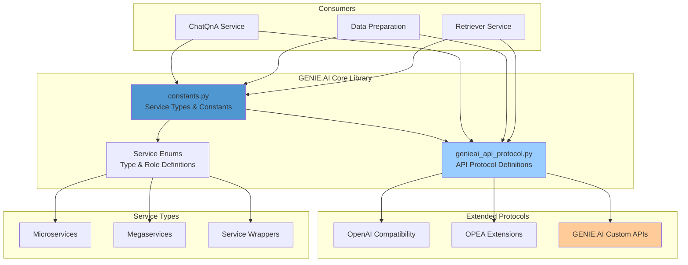

# GENIE.AI Core Library

## Overview

The GENIE.AI Core Library provides the foundational definitions, protocols, and service architecture for the GENIE.AI framework. It extends the standard [OPEA (Open Platform for Enterprise AI)](https://opea.dev) protocols with ITU-specific enhancements, custom service types, and extended API endpoints.

This library serves as the **central contract** that ensures compatibility between all GENIE.AI components and services.

---

## Table of Contents

- [Purpose](#purpose)
- [Architecture](#architecture)
- [Core Components](#core-components)
- [Service Types](#service-types)
- [API Protocols](#api-protocols)
- [Data Models](#data-models)
- [Usage](#usage)
- [Extending the Core](#extending-the-core)
- [Reference](#reference)

---

## Purpose

The Core Library is responsible for:

1. **Defining Service Architecture**: Establishes the service types and roles within the GENIE.AI ecosystem
2. **API Contracts**: Provides standardized request/response models for all services
3. **Protocol Definitions**: Extends OpenAI and OPEA protocols with GENIE.AI-specific functionality
4. **Type Safety**: Ensures type consistency across microservices using Pydantic models
5. **Service Discovery**: Enables automated service registration and discovery

---

## Architecture



---

## Core Components

### 1. constants.py

**File**: [constants.py](constants.py)

**Purpose**: Defines core constants, service types, and enumerations used across the GENIE.AI framework.

**Key Contents**:

- **ServiceRole Enum**: Defines the architectural role of services
- **ServiceType Enum**: Lists all available service types (OPEA + GENIE.AI custom)
- **Endpoint Constants**: Standard endpoint paths for services
- **Configuration Constants**: Default values and settings

**Example Usage**:
```python
from core.constants import ServiceRole, ServiceType

# Define a microservice
service_type = ServiceType.EMBEDDING
service_role = ServiceRole.MICROSERVICE
```

### 2. genieai_api_protocol.py

**File**: [genieai_api_protocol.py](genieai_api_protocol.py)

**Purpose**: Defines the API protocol models, request/response schemas, and endpoint contracts.

**Key Contents**:

- **Request Models**: Pydantic models for API requests
- **Response Models**: Pydantic models for API responses
- **Custom Endpoints**: GENIE.AI-specific endpoint definitions
- **Protocol Extensions**: Extensions to OpenAI/OPEA protocols

**Example Usage**:
```python
from core.genieai_api_protocol import (
    ChatCompletionRequest,
    ChatCompletionResponse,
    GenieAIRequest
)

# Create a request
request = ChatCompletionRequest(
    messages=[{"role": "user", "content": "Hello"}],
    stream=False
)
```

---

## Service Types

The Core Library defines three categories of services:

### Microservices

Lightweight, focused services that perform specific functions:

| Service Type | Description | Port |
|--------------|-------------|------|
| `EMBEDDING` | Text embedding generation | 6000 |
| `RERANK` | Result reranking | 6100 |
| `GUARDRAIL` | Content moderation | 8080 |
| `TRANSLATION` | Language translation | 8001 |
| `DATAPREP` | Data preparation | 7007 |
| `RETRIEVER` | Context retrieval | 7025 |

### Megaservices

Comprehensive services that combine multiple capabilities:

| Service Type | Description | Port |
|--------------|-------------|------|
| `GATEWAY` | API gateway and routing | 8080 |
| `TEXT_GENERATION` | LLM text generation | 9000 |
| `CHATQNA` | Chat completions with RAG | 9000 |
| `GRAPH_RAG` | Graph-based RAG | 9001 |

### Service Wrappers

Wrapper services that provide unified interfaces:

| Service Type | Description | Port |
|--------------|-------------|------|
| `EMBEDDING_WRAPPER` | Embedding service wrapper | 6000 |
| `RERANK_WRAPPER` | Reranker wrapper | 6100 |
| `LLM_WRAPPER` | LLM service wrapper | 9000 |

### GENIE.AI Custom Services

ITU-specific services beyond standard OPEA:

| Service Type | Description | Endpoint |
|--------------|-------------|----------|
| `TRANSLATOR` | Multilingual translation service | `/v1/translation` |
| `KNOWLEDGE_GRAPH` | Knowledge graph operations | `/v1/graphrag` |
| `DOCUMENT_REPOSITORY` | Document management | `/v1/documents` |
| `ANALYTICS` | Usage analytics | `/v1/analytics` |

---

## API Protocols

### OpenAI Compatibility

The Core Library maintains full compatibility with OpenAI APIs:

**Standard Endpoints**:
```python
POST /v1/chat/completions
GET  /v1/models
POST /v1/embeddings
```

**Request Models**:
```python
class ChatCompletionRequest(BaseModel):
    messages: List[ChatMessage]
    model: str
    stream: bool = False
    max_tokens: Optional[int] = None
    temperature: Optional[float] = None
```

### OPEA Extensions

Extends OPEA protocol with GENIE.AI features:

**OPEA Endpoints**:
```python
POST /v1/chatqna
POST /v1/dataprep
POST /v1/retrieve
```

### GENIE.AI Custom APIs

ITU-specific endpoints and models:

**Custom Endpoints**:
```python
POST /v1/translation
POST /v1/graphrag
GET  /v1/analytics
POST /v1/documents/ingest
DELETE /v1/documents/retract
```

**Custom Request Models**:
```python
class TranslationRequest(BaseModel):
    text: str
    target_language: str
    source_language: Optional[str] = None

class GraphRAGRequest(BaseModel):
    query: str
    graph_context: Optional[List[str]] = None
    traversal_depth: int = 2
```

---

## Data Models

### Service Definition Model

```python
class ServiceDefinition(BaseModel):
    """Defines a service in the GENIE.AI ecosystem"""

    name: str
    service_type: ServiceType
    role: ServiceRole
    endpoint: str
    port: int
    dependencies: List[str] = []
    health_check_url: Optional[str] = None
```

### Request/Response Models

```python
class GenieAIRequest(BaseModel):
    """Base request model for GENIE.AI services"""

    request_id: str = Field(default_factory=lambda: str(uuid4()))
    timestamp: datetime = Field(default_factory=datetime.utcnow)
    context: Optional[Dict[str, Any]] = None

class GenieAIResponse(BaseModel):
    """Base response model for GENIE.AI services"""

    request_id: str
    status: str
    data: Optional[Dict[str, Any]] = None
    error: Optional[str] = None
    processing_time: float
```

### Configuration Models

```python
class ServiceConfig(BaseModel):
    """Service configuration model"""

    service_name: str
    service_type: ServiceType
    host: str = "localhost"
    port: int
    timeout: int = 30
    retry_attempts: int = 3
    enable_logging: bool = True
```

---

## Usage

### Importing Core Library

```python
# Import constants
from genie_ai_overlay.core.constants import (
    ServiceRole,
    ServiceType,
    DEFAULT_TIMEOUT,
    MAX_RETRIES
)

# Import protocol models
from genie_ai_overlay.core.genieai_api_protocol import (
    ChatCompletionRequest,
    ChatCompletionResponse,
    GenieAIRequest,
    ServiceDefinition
)
```

### Defining a New Service

```python
from genie_ai_overlay.core.constants import ServiceType, ServiceRole
from genie_ai_overlay.core.genieai_api_protocol import ServiceDefinition

# Define service configuration
my_service = ServiceDefinition(
    name="my-custom-service",
    service_type=ServiceType.MICROSERVICE,
    role=ServiceRole.MICROSERVICE,
    endpoint="/v1/custom",
    port=8050,
    dependencies=["embedding", "llm"],
    health_check_url="/health"
)

# Use in service initialization
print(f"Service: {my_service.name}")
print(f"Type: {my_service.service_type}")
print(f"Endpoint: {my_service.endpoint}")
```

### Creating Custom Request Models

```python
from pydantic import BaseModel, Field
from typing import Optional, List

class CustomGenieAIRequest(GenieAIRequest):
    """Extended request model"""

    custom_field: str
    options: Optional[List[str]] = None
    priority: int = Field(default=5, ge=1, le=10)

# Use in service
request = CustomGenieAIRequest(
    custom_field="value",
    options=["opt1", "opt2"],
    priority=7
)
```

### Service Discovery

```python
from genie_ai_overlay.core.constants import ServiceType

# Get all services of a type
embedding_services = get_services_by_type(ServiceType.EMBEDDING)

# Get service dependencies
dependencies = get_service_dependencies("chatqna")

# Check service compatibility
is_compatible = check_service_compatibility(
    service_a=ServiceType.CHATQNA,
    service_b=ServiceType.RETRIEVER
)
```

---

## Extending the Core

### Adding New Service Types

1. **Update constants.py**:
   ```python
   class ServiceType(str, Enum):
       # ... existing services ...

       # Add new service type
       CUSTOM_SERVICE = "custom_service"
   ```

2. **Add Protocol Models** (if needed):
   ```python
   class CustomServiceRequest(BaseModel):
       """Request model for custom service"""

       query: str
       parameters: Optional[Dict[str, Any]] = None
   ```

3. **Update Service Registry**:
   ```python
   SERVICE_REGISTRY[ServiceType.CUSTOM_SERVICE] = {
       "default_port": 8050,
       "health_endpoint": "/health",
       "protocol_version": "1.0"
   }
   ```

### Adding New API Endpoints

1. **Define Endpoint in Protocol**:
   ```python
   # genieai_api_protocol.py
   CUSTOM_ENDPOINTS = {
       "custom_action": "/v1/custom/action"
   }
   ```

2. **Create Request/Response Models**:
   ```python
   class CustomActionRequest(BaseModel):
       parameter: str
       options: List[str]

   class CustomActionResponse(BaseModel):
       result: str
       metadata: Dict[str, Any]
   ```

3. **Implement in Service**:
   ```python
   from genie_ai_overlay.core.genieai_api_protocol import (
       CustomActionRequest,
       CustomActionResponse
   )

   @app.post("/v1/custom/action")
   async def custom_action(request: CustomActionRequest):
       # Implementation
       return CustomActionResponse(result="success", metadata={})
   ```

---

## Reference

### Constants Reference

#### ServiceRole Enum

```python
class ServiceRole(str, Enum):
    """Defines the architectural role of a service"""

    MICROSERVICE = "microservice"  # Lightweight, focused service
    MEGASERVICE = "megaservice"    # Comprehensive, multi-capability
    WRAPPER = "wrapper"            # Unified interface wrapper
```

#### ServiceType Enum (Selected)

```python
class ServiceType(str, Enum):
    """All service types in GENIE.AI"""

    # Standard OPEA services
    GATEWAY = "gateway"
    EMBEDDING = "embedding"
    RETRIEVER = "retriever"
    RERANK = "rerank"
    LLM = "llm"
    TEXT_GENERATION = "text_generation"

    # GENIE.AI custom services
    TRANSLATOR = "translator"
    KNOWLEDGE_GRAPH = "knowledge_graph"
    DOCUMENT_REPOSITORY = "document_repository"
    ANALYTICS = "analytics"
    GUARDRAIL = "guardrail"
```

### Protocol Models Reference

#### Request Models

| Model | Purpose | Fields |
|-------|---------|--------|
| `ChatCompletionRequest` | Chat completions | messages, model, stream, max_tokens |
| `EmbeddingRequest` | Text embeddings | input, model, encoding_format |
| `TranslationRequest` | Translation | text, target_language, source_language |
| `GraphRAGRequest` | Graph-based RAG | query, graph_context, traversal_depth |
| `DataprepRequest` | Data preparation | documents, chunk_size, metadata |

#### Response Models

| Model | Purpose | Fields |
|-------|---------|--------|
| `ChatCompletionResponse` | Chat responses | id, choices, usage |
| `EmbeddingResponse` | Embeddings | data, model, usage |
| `TranslationResponse` | Translations | translated_text, source_language, confidence |
| `GraphRAGResponse` | Graph RAG results | response, context, graph_path |
| `DataprepResponse` | Data prep status | status, processed_count, errors |

---

## Best Practices

### Using Core Library in Services

1. **Always import from core**:
   ```python
   # Good
   from core.constants import ServiceType

   # Avoid
   from my_service.constants import ServiceType
   ```

2. **Use type hints**:
   ```python
   def process_request(
       request: ChatCompletionRequest,
       service_type: ServiceType
   ) -> ChatCompletionResponse:
       pass
   ```

3. **Validate inputs**:
   ```python
   from pydantic import ValidationError

   try:
       request = ChatCompletionRequest(**data)
   except ValidationError as e:
       raise HTTPException(status_code=400, detail=str(e))
   ```

4. **Handle compatibility**:
   ```python
   def check_version_compatibility(
       client_version: str,
       server_version: str
   ) -> bool:
       # Check if versions are compatible
       return parse(client_version) >= parse(server_version)
   ```

---

## Version History

| Version | Date | Changes |
|---------|------|---------|
| 1.0.0 | 2025-02 | Initial release with OPEA extensions |

---

## License

This project is licensed under the Apache License 2.0.

---

## Contributing

When contributing to the Core Library:

1. **Maintain backward compatibility**
2. **Add tests for new features**
3. **Update this documentation**
4. **Follow PEP 8 style guidelines**
5. **Use type hints for all functions**

---

## Support

For questions or issues:
- Create an issue on GitHub
- Check the [OPEA documentation](https://opea.dev)
- Review existing service implementations

---

**Last Updated**: 2025-02-07
**Version**: 1.0.0
