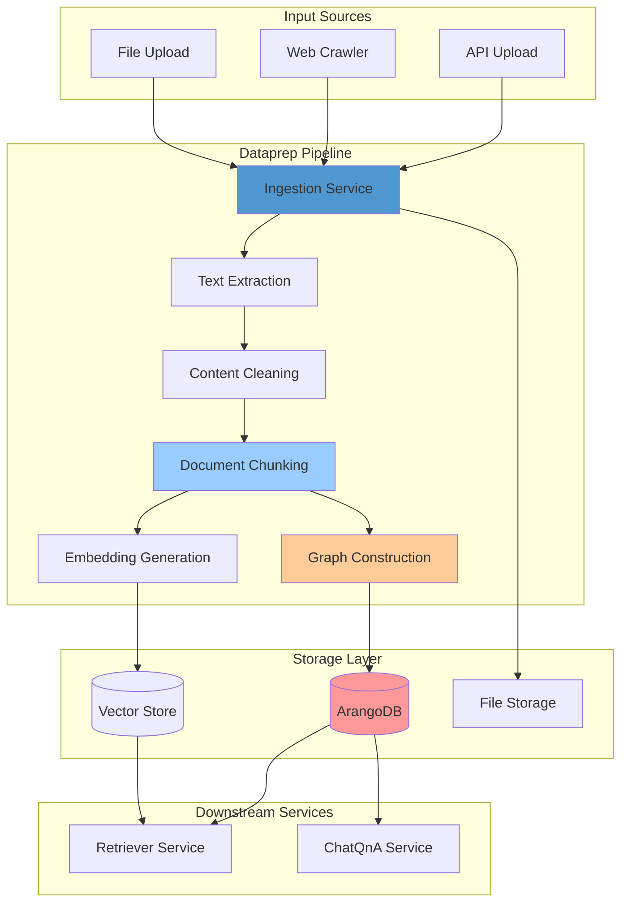
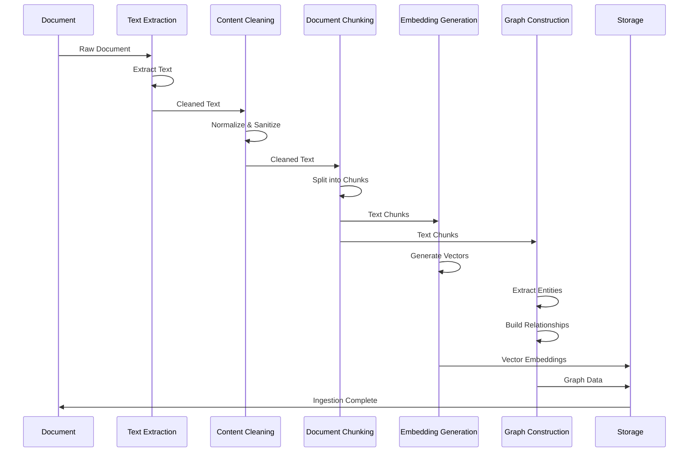
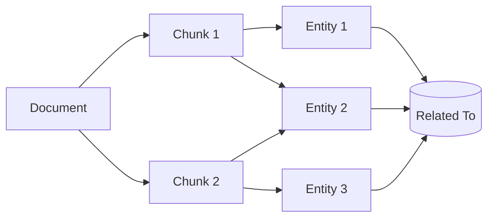

# GENIE.AI Data Preparation Microservice

## Overview

The GENIE.AI Data Preparation (Dataprep) microservice is a comprehensive document ingestion and processing pipeline built on the [OPEA (Open Platform for Enterprise AI)](https://opea.dev) framework. It handles document extraction, chunking, embedding generation, and storage in both vector databases and graph databases (ArangoDB).

This service extends the standard OPEA dataprep implementation with advanced features including:
- Multi-format document processing (PDF, HTML, Word, Excel, etc.)
- Graph-based knowledge construction
- Hybrid vector-graph search support
- Document ingestion and retraction workflows
- Metadata extraction and indexing

---

## Table of Contents

- [Features](#features)
- [Architecture](#architecture)
- [Prerequisites](#prerequisites)
- [Installation](#installation)
- [Configuration](#configuration)
- [API Endpoints](#api-endpoints)
- [Document Processing Pipeline](#document-processing-pipeline)
- [ArangoDB Integration](#arangodb-integration)
- [Development](#development)
- [Deployment](#deployment)
- [Troubleshooting](#troubleshooting)

---

## Features

### Core Capabilities

- **Multi-Format Support**:
  - PDF documents
  - HTML web pages
  - Word documents (.docx)
  - Excel spreadsheets (.xlsx)
  - Plain text files
  - Markdown files

- **Document Processing**:
  - Text extraction and cleaning
  - Document chunking with overlap
  - Metadata extraction
  - Language detection
  - Content validation

- **Knowledge Graph Construction**:
  - Entity extraction
  - Relationship mapping
  - Graph storage in ArangoDB
  - Hybrid vector-graph indexing

- **Embedding Generation**:
  - Vector embeddings for chunks
  - Contextual Retrieval (optional, `CONTEXTUAL_RETRIEVAL_ENABLED`, default off): an LLM-generated document-context prefix is prepended to each chunk before embedding + labeling, so chunks carry the document's subject (Anthropic-style; raw-chunk fallback on any failure — ingestion never blocks)
  - Batch processing
  - GPU acceleration support
  - Multiple embedding models

### Advanced Features

- **Document Ingestion**:
  - Upload from file system
  - Web crawling
  - Batch processing
  - Progress tracking

- **Document Retraction**:
  - Selective removal
  - Graph cleanup
  - Vector deletion
  - Audit logging

- **Quality Control**:
  - Content validation
  - Duplicate detection
  - Size limits
  - Error handling

---

## Architecture



### Processing Flow

1. **Document Ingestion**: Documents received from multiple sources
2. **Text Extraction**: Raw text extracted from documents
3. **Content Cleaning**: Text normalization and sanitization
4. **Document Chunking**: Intelligent splitting into manageable chunks
5. **Embedding Generation**: Vector embeddings created for each chunk
6. **Graph Construction**: Knowledge graph entities and relationships created
7. **Storage**: Chunks stored in vector DB, graph stored in ArangoDB
8. **Indexing**: Hybrid indexes created for fast retrieval

---

## Prerequisites

### Required Software

- **Docker**: 20.10+ for container deployment
- **Python**: 3.10+ (for local development)
- **ArangoDB**: 3.12+ for graph storage
- **NVIDIA CUDA**: 11.8+ (for GPU acceleration)

### Required Services

| Service | Port | Required | Purpose |
|---------|------|----------|---------|
| ArangoDB | 8529 | Yes | Graph database storage |
| Embedding Server | 6000 | Yes | Vector embedding generation |
| Document Repository | 3001 | Yes | File management |
| Retrieval Service | 7025 | No | Context retrieval |

### Hardware Requirements

**Minimum**:
- CPU: 8 cores
- RAM: 16 GB
- Storage: 100 GB SSD

**Recommended (for GPU)**:
- GPU: NVIDIA with 16+ GB VRAM
- RAM: 32 GB
- Storage: 500 GB NVMe SSD

### Model Requirements (LLM labeling)

Chunk labeling sends one LLM call per batch of chunks and requests **strict JSON
object output** via OpenAI-compatible `response_format={"type": "json_object"}`.
The labeling LLM (`VLLM_LLM_MODEL_ID`, served by vLLM) **must support guided JSON
decoding** (`response_format`):

- ✅ Supported: vLLM ≥ 0.6 with a JSON-capable model (validated on
  `ibm-granite/granite-4.1-8b`).
- ❌ Unsupported models / vLLM builds return markdown-wrapped or malformed JSON →
  `json.loads` fails → per-chunk fallback (slower ingestion, lower label quality).

Tuning knobs: `DATAPREP_MAX_CONCURRENT_BATCHES` (concurrency), `DATAPREP_LLM_LABEL_BATCH_SIZE`
(chunks per call), `DATAPREP_LLM_TEMPERATURE` (use 0.0 for deterministic JSON).

---

## Installation

### Option 1: Docker Deployment (Recommended)

1. **Pull the Image**:
   ```bash
   docker pull genieai/dataprep:latest
   ```

2. **Run the Container**:
   ```bash
   docker run -d \
     --name dataprep-service \
     --gpus all \
     -p 7007:7007 \
     -e ARANGO_URL=http://arangodb:8529 \
     -e ARANGO_USERNAME=root \
     -e ARANGO_PASSWORD=your_password \
     -e ARANGO_DATABASE=genie-ai \
     -e EMBEDDING_SERVER_IP=embedding \
     -e EMBEDDING_SERVER_PORT=6000 \
     -v /data/uploads:/app/uploads \
     genieai/dataprep:latest
   ```

3. **Verify Deployment**:
   ```bash
   curl http://localhost:7007/health
   ```

### Option 2: Build from Source

1. **Clone Repository**:
   ```bash
   git clone https://github.com/your-org/genie-ai-overlay.git
   cd genie-ai-overlay/dataprep
   ```

2. **Build Docker Image**:
   ```bash
   docker build -f Dockerfile-dataprep_genie-ai -t genieai/dataprep:latest .
   ```

3. **Run with Docker Compose**:
   ```bash
   docker-compose up -d
   ```

### Option 3: Local Development

1. **Install Dependencies**:
   ```bash
   pip install -r requirements.txt
   ```

2. **Set Environment Variables**:
   ```bash
   export ARANGO_URL=http://localhost:8529
   export ARANGO_USERNAME=root
   export ARANGO_PASSWORD=your_password
   export ARANGO_DATABASE=genie-ai
   ```

3. **Run Service**:
   ```bash
   python genieai_dataprep_microservice.py
   ```

---

## Configuration

### Environment Variables

| Variable | Type | Default | Description |
|----------|------|---------|-------------|
| `ARANGO_URL` | string | http://localhost:8529 | ArangoDB connection URL |
| `ARANGO_USERNAME` | string | root | ArangoDB username |
| `ARANGO_PASSWORD` | string | - | ArangoDB password |
| `ARANGO_DATABASE` | string | genie-ai | Database name |
| `EMBEDDING_SERVER_IP` | string | localhost | Embedding server host |
| `EMBEDDING_SERVER_PORT` | int | 6000 | Embedding server port |
| `UPLOAD_DIR` | string | /app/uploads | Upload directory |
| `MAX_FILE_SIZE` | int | 52428800 | Max file size (50MB) |
| `CHUNK_SIZE` | int | 1000 | Token chunk size |
| `CHUNK_OVERLAP` | int | 200 | Token overlap between chunks |
| `BATCH_SIZE` | int | 32 | Embedding batch size |
| `ENABLE_GPU` | boolean | true | Enable GPU acceleration |

### Document Processing Settings

Configure chunking behavior:

```python
# Chunk size (tokens)
CHUNK_SIZE = 1000  # Default: 1000 tokens per chunk

# Chunk overlap (tokens)
CHUNK_OVERLAP = 200  # Default: 200 tokens overlap

# Minimum chunk size
MIN_CHUNK_SIZE = 100  # Discard chunks smaller than this

# Maximum chunk size
MAX_CHUNK_SIZE = 2000  # Split chunks larger than this
```

### ArangoDB Configuration

```python
# Collection names
DOCUMENTS_COLLECTION = "documents"
CHUNKS_COLLECTION = "chunks"
ENTITIES_COLLECTION = "entities"
RELATIONSHIPS_COLLECTION = "relationships"
GRAPH_NAME = "knowledge_graph"
```

---

## API Endpoints

### Document Ingestion

**Endpoint**: `POST /v1/dataprep/ingest`

**Description**: Process and ingest a document into the knowledge base

**Request Body**:
```json
{
  "file_id": "1750164284119-30f48760",
  "file_path": "/uploads/example.pdf",
  "metadata": {
    "title": "Example Document",
    "author": "John Doe",
    "language": "en",
    "labels": ["healthcare", "policy"]
  }
}
```

**Response**:
```json
{
  "success": true,
  "message": "Document ingested successfully",
  "data": {
    "document_id": "doc_123",
    "chunks_created": 15,
    "entities_extracted": 42,
    "relationships_created": 38,
    "processing_time": 3.45
  }
}
```

### Batch Ingestion

**Endpoint**: `POST /v1/dataprep/ingest/batch`

**Description**: Ingest multiple documents in batch

**Request Body**:
```json
{
  "file_ids": ["file1", "file2", "file3"],
  "parallel_processing": true,
  "max_workers": 4
}
```

**Response**:
```json
{
  "success": true,
  "results": [
    {
      "file_id": "file1",
      "success": true,
      "chunks_created": 15
    },
    {
      "file_id": "file2",
      "success": true,
      "chunks_created": 12
    }
  ],
  "summary": {
    "total_files": 2,
    "successful": 2,
    "failed": 0
  }
}
```

### Document Retraction

**Endpoint**: `DELETE /v1/dataprep/retract`

**Description**: Remove a document from the knowledge base

**Request Body**:
```json
{
  "file_id": "1750164284119-30f48760",
  "remove_graph": true,
  "remove_vectors": true
}
```

**Response**:
```json
{
  "success": true,
  "message": "Document retracted successfully",
  "data": {
    "chunks_deleted": 15,
    "entities_deleted": 42,
    "relationships_deleted": 38
  }
}
```

### Health Check

**Endpoint**: `GET /health`

**Response**:
```json
{
  "status": "healthy",
  "services": {
    "arangodb": "connected",
    "embedding_server": "connected",
    "file_storage": "accessible"
  },
  "stats": {
    "documents_processed": 1234,
    "chunks_created": 18456,
    "entities_extracted": 4321
  }
}
```

---

## Document Processing Pipeline

### Pipeline Stages



### Stage 1: Text Extraction

**Supported Formats**:
- **PDF**: Using `docling` library
- **HTML**: Using `beautifulsoup4`
- **Word**: Using `python-docx`
- **Excel**: Using `openpyxl`
- **Text**: Direct file reading
- **Markdown**: Using `markdown` library

**Features**:
- Preserves document structure
- Extracts tables and lists
- Handles multi-page documents
- OCR support for scanned PDFs (optional)

### Stage 2: Content Cleaning

**Operations**:
- Remove special characters
- Normalize whitespace
- Remove headers/footers
- Fix encoding issues
- Filter boilerplate content

**Example**:
```python
# Before cleaning
"Hello   World!\n\n\nThis is  a test."

# After cleaning
"Hello World! This is a test."
```

### Stage 3: Document Chunking

**Strategies**:
- **Token-based**: Fixed token count with overlap
- **Sentence-based**: Complete sentences
- **Paragraph-based**: Logical paragraph units
- **Semantic**: Using NLP to find topic boundaries

**Example**:
```python
# Original text (3000 tokens)
chunks = chunk_text(
    text=original_text,
    chunk_size=1000,
    overlap=200
)

# Result: 3 chunks with overlap
# Chunk 1: tokens 0-1000
# Chunk 2: tokens 800-1800
# Chunk 3: tokens 1600-2600
```

### Stage 4: Embedding Generation

**Process**:
1. Send chunks to embedding server
2. Receive vector embeddings
3. Store in vector database
4. Index for fast retrieval

**Configuration**:
```python
BATCH_SIZE = 32  # Process 32 chunks at once
EMBEDDING_MODEL = "BAAI/bge-base-en-v1.5"
DIMENSIONS = 768
```

### Stage 5: Graph Construction

**Entity Extraction**:
- Named entities (people, places, organizations)
- Key phrases and concepts
- Technical terms
- Relationships between entities

**Graph Structure**:


---

## ArangoDB Integration

### Collections

| Collection | Type | Purpose |
|------------|------|---------|
| `documents` | Document | Document metadata |
| `chunks` | Document | Text chunks with vectors |
| `entities` | Document | Extracted entities |
| `relationships` | Edge | Entity relationships |
| `document_chunks` | Edge | Document-chunk links |
| `chunk_entities` | Edge | Chunk-entity links |

### Graph Schema

```javascript
// Knowledge graph structure
{
  "graphs": {
    "knowledge_graph": {
      "edgeCollections": ["relationships", "document_chunks", "chunk_entities"],
      "vertexCollections": ["documents", "chunks", "entities"]
    }
  }
}
```

### Query Examples

**Find related chunks**:
```aql
FOR v, e, p IN 2..2 OUTBOUND 'documents/doc_123'
  GRAPH 'knowledge_graph'
  RETURN v
```

**Get document statistics**:
```aql
FOR doc IN documents
  COLLECT WITH COUNT INTO count
  RETURN {
    total_documents: count,
    total_chunks: SUM(doc.chunk_count),
    avg_chunks: AVERAGE(doc.chunk_count)
  }
```

---

## Development

### Project Structure

```
dataprep/
├── genieai_dataprep_microservice.py    # Main service
├── genieai_dataprep_arangodb.py        # ArangoDB integration
├── genieai_dataprep_loader.py          # Data loading utilities
├── genieai_dataprep_utils.py           # Helper functions
├── Dockerfile-dataprep_genie-ai        # Docker configuration
├── requirements.txt                     # Python dependencies
└── README.md                            # This file
```

### Running Tests

```bash
# Unit tests
pytest tests/unit/

# Integration tests
pytest tests/integration/

# End-to-end tests
pytest tests/e2e/
```

### Adding New Document Formats

1. **Create Extractor**:
   ```python
   class CustomExtractor(BaseExtractor):
       def extract(self, file_path: str) -> str:
           # Implementation
           pass
   ```

2. **Register Extractor**:
   ```python
   EXTRACTORS = {
       ".custom": CustomExtractor()
   }
   ```

3. **Add Tests**:
   ```python
   def test_custom_extractor():
       extractor = CustomExtractor()
       text = extractor.extract("test.custom")
       assert text is not None
   ```

---

## Deployment

### Docker Compose Example

```yaml
services:
  dataprep:
    image: genieai/dataprep:latest
    container_name: genieai-dataprep
    ports:
      - "7007:7007"
    environment:
      - ARANGO_URL=http://arangodb:8529
      - ARANGO_USERNAME=root
      - ARANGO_PASSWORD=${ARANGO_PASSWORD}
      - EMBEDDING_SERVER_IP=embedding
      - EMBEDDING_SERVER_PORT=6000
      - ENABLE_GPU=true
    volumes:
      - uploads:/app/uploads
    deploy:
      resources:
        reservations:
          devices:
            - driver: nvidia
              count: 1
              capabilities: [gpu]
    networks:
      - genieai-network
    restart: unless-stopped
```

### Kubernetes Deployment

```yaml
apiVersion: apps/v1
kind: Deployment
metadata:
  name: dataprep
spec:
  replicas: 2
  selector:
    matchLabels:
      app: dataprep
  template:
    metadata:
      labels:
        app: dataprep
    spec:
      containers:
      - name: dataprep
        image: genieai/dataprep:latest
        ports:
        - containerPort: 7007
        env:
        - name: ARANGO_URL
          value: "http://arangodb:8529"
        resources:
          limits:
            nvidia.com/gpu: 1
          requests:
            memory: "16Gi"
            cpu: "4"
```

---

## Troubleshooting

### Common Issues

#### Document Processing Fails

**Symptoms**: Ingestion returns error status

**Solutions**:
1. Check file format is supported
2. Verify file is not corrupted
3. Check file size limit (default 50MB)
4. Ensure sufficient disk space
5. Review logs: `docker logs dataprep-service`

#### ArangoDB Connection Errors

**Symptoms**: Cannot connect to ArangoDB

**Solutions**:
1. Verify ArangoDB is running:
   ```bash
   curl http://localhost:8529/_api/version
   ```

2. Check connection credentials:
   ```bash
   echo $ARANGO_URL
   echo $ARANGO_USERNAME
   echo $ARANGO_PASSWORD
   ```

3. Test from container:
   ```bash
   docker exec -it dataprep-service bash
   curl http://arangodb:8529/_api/version
   ```

#### Embedding Generation Slow

**Symptoms**: Long processing times

**Solutions**:
1. Enable GPU acceleration
2. Increase batch size
3. Reduce chunk size
4. Use faster embedding model
5. Check embedding server health

#### Memory Issues

**Symptoms**: OOM errors during processing

**Solutions**:
1. Reduce batch size
2. Process smaller files
3. Increase container memory limit
4. Enable streaming processing
5. Use smaller embedding models

### Debug Mode

Enable detailed logging:

```bash
export LOG_LEVEL=DEBUG
docker run -e LOG_LEVEL=DEBUG genieai/dataprep:latest
```

---

## Performance Tuning

### GPU Optimization

For optimal GPU performance:

```bash
docker run -d \
  --gpus '"device=0"' \
  --shm-size=16g \
  -e CUDA_VISIBLE_DEVICES=0 \
  genieai/dataprep:latest
```

### Batch Processing

Configure for large batches:

```python
MAX_WORKERS = 8  # Parallel processing
BATCH_SIZE = 64  # Larger batches
CHUNK_SIZE = 2000  # Fewer, larger chunks
```

### Storage Optimization

Use NVMe storage for I/O-intensive operations:

```yaml
volumes:
  - /nvme/uploads:/app/uploads
```

---

## Security Considerations

### File Upload Security

- Validate file types
- Scan for malware (ClamAV integration)
- Limit file sizes
- Sanitize filenames
- Use secure temporary directories

### ArangoDB Security

- Use strong passwords
- Enable SSL/TLS connections
- Restrict database access
- Regular backups
- Audit logging

### API Security

- Implement rate limiting
- Authentication for uploads
- Input validation
- Output sanitization
- CORS configuration

---

## Monitoring

### Metrics to Track

- Documents processed per hour
- Average processing time
- Embedding generation rate
- ArangoDB query performance
- GPU utilization
- Error rates

### Health Checks

```bash
# Basic health
curl http://localhost:7007/health

# Detailed status
curl http://localhost:7007/health/detailed

# Metrics
curl http://localhost:7007/metrics
```

---

## License

This project is licensed under the Apache License 2.0.

---

## Contributing

Contributions are welcome! Please read CONTRIBUTING.md for details.

---

## Acknowledgments

Built with [OPEA (Open Platform for Enterprise AI)](https://opea.dev) framework.
Document processing powered by [LangChain](https://langchain.com/).
Graph storage with [ArangoDB](https://www.arangodb.com/).

---

**Last Updated**: 2025-02-07
**Version**: 1.0.0
