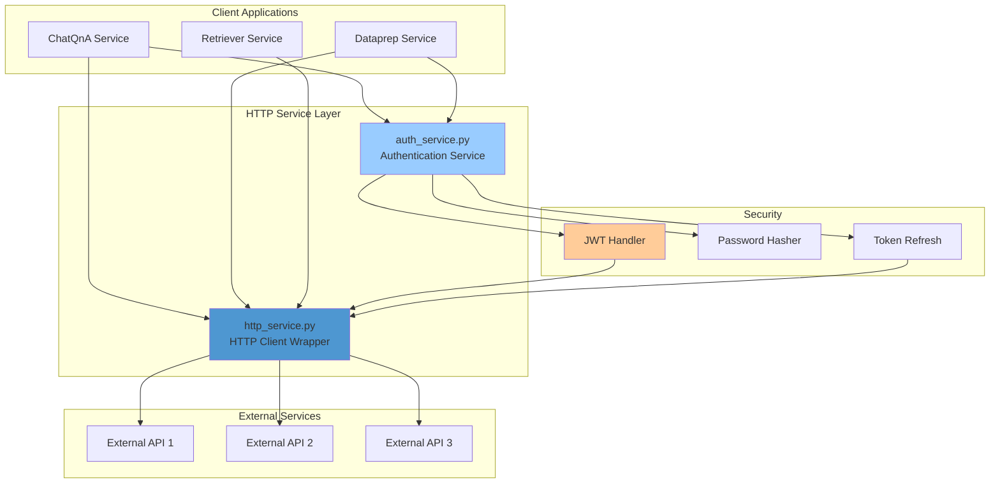
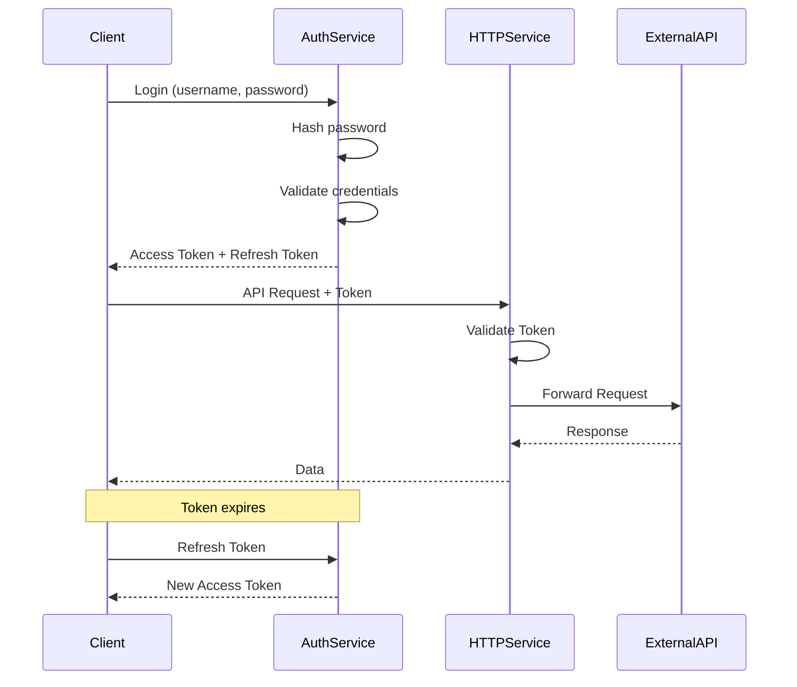

# GENIE.AI HTTP Service

## Overview

The GENIE.AI HTTP Service is a lightweight, high-performance HTTP client wrapper and authentication service designed for the GENIE.AI framework. It provides standardized HTTP communication and JWT-based authentication across all microservices.

This service ensures consistent API interactions, secure authentication flows, and reliable error handling for all GENIE.AI components.

---

## Table of Contents

- [Features](#features)
- [Architecture](#architecture)
- [Components](#components)
- [Prerequisites](#prerequisites)
- [Installation](#installation)
- [Configuration](#configuration)
- [Usage](#usage)
- [API Reference](#api-reference)
- [Authentication Flow](#authentication-flow)
- [Development](#development)
- [Deployment](#deployment)
- [Troubleshooting](#troubleshooting)

---

## Features

### Core Capabilities

- **Async HTTP Client**: High-performance asynchronous HTTP requests
- **JWT Authentication**: Token-based authentication with automatic refresh
- **Error Handling**: Comprehensive error detection and retry logic
- **Connection Pooling**: Efficient connection management
- **Request/Response Logging**: Optional logging for debugging
- **Type Safety**: Full type hints for better code quality

### Security Features

- **SHA256 Password Hashing**: Secure password storage
- **JWT Token Management**: Generation, validation, and refresh
- **Token Expiration**: Automatic token refresh before expiry
- **Secure Headers**: Built-in security headers for all requests
- **Credential Management**: Secure credential storage and retrieval

---

## Architecture



---

## Components

### 1. http_service.py

**Purpose**: Generic HTTP client wrapper for making API requests

**Key Features**:
- Async HTTP requests using `httpx`
- Automatic retry logic with exponential backoff
- Connection pooling for performance
- Timeout management
- Request/response logging
- Error handling and recovery

**Methods**:
```python
class HTTPService:
    async def get(url: str, params: dict = None) -> Response
    async def post(url: str, data: dict = None) -> Response
    async def put(url: str, data: dict = None) -> Response
    async def delete(url: str) -> Response
    async def patch(url: str, data: dict = None) -> Response
```

### 2. auth_service.py

**Purpose**: Authentication service with JWT token management

**Key Features**:
- User authentication (login/logout)
- JWT token generation and validation
- Password hashing with SHA256
- Token refresh mechanism
- Session management

**Methods**:
```python
class AuthService:
    async def login(username: str, password: str) -> TokenResponse
    async def logout(token: str) -> LogoutResponse
    async def refresh_token(refresh_token: str) -> TokenResponse
    async def verify_token(token: str) -> bool
    def hash_password(password: str) -> str
    def verify_password(password: str, hashed: str) -> bool
```

---

## Prerequisites

### Required Software

- **Python**: 3.10+
- **Docker**: 20.10+ (for container deployment)
- **pip**: Package manager

### Required Python Packages

```
fastapi>=0.100.0
uvicorn>=0.23.0
httpx>=0.24.0
requests>=2.31.0
pydantic>=2.0.0
python-jose[cryptography]>=3.3.0
passlib[bcrypt]>=1.7.4
python-multipart>=0.0.6
```

---

## Installation

### Option 1: Docker Deployment

1. **Pull the Image**:
   ```bash
   docker pull genieai/http-service:latest
   ```

2. **Run the Container**:
   ```bash
   docker run -d \
     --name http-service \
     -p 8080:8080 \
     -e LOG_LEVEL=INFO \
     -e TIMEOUT=30 \
     genieai/http-service:latest
   ```

### Option 2: Build from Source

1. **Clone Repository**:
   ```bash
   git clone https://github.com/your-org/genie-ai-overlay.git
   cd genie-ai-overlay/http-service
   ```

2. **Build Docker Image**:
   ```bash
   docker build -t genieai/http-service:latest .
   ```

3. **Run Service**:
   ```bash
   docker-compose up -d
   ```

### Option 3: Local Development

1. **Install Dependencies**:
   ```bash
   pip install -r requirements.txt
   ```

2. **Run Service**:
   ```bash
   uvicorn http_service:app --host 0.0.0.0 --port 8080
   ```

---

## Configuration

### Environment Variables

| Variable | Type | Default | Description |
|----------|------|---------|-------------|
| `HOST` | string | 0.0.0.0 | Service bind address |
| `PORT` | int | 8080 | Service port |
| `LOG_LEVEL` | string | INFO | Logging level (DEBUG, INFO, WARNING, ERROR) |
| `TIMEOUT` | int | 30 | Request timeout (seconds) |
| `MAX_RETRIES` | int | 3 | Maximum retry attempts |
| `RETRY_DELAY` | int | 1 | Retry delay (seconds) |
| `JWT_SECRET_KEY` | string | - | JWT signing secret (required) |
| `JWT_ALGORITHM` | string | HS256 | JWT signing algorithm |
| `ACCESS_TOKEN_EXPIRE_MINUTES` | int | 30 | Access token expiry |
| `REFRESH_TOKEN_EXPIRE_DAYS` | int | 7 | Refresh token expiry |

### Configuration File

Create `config.yaml`:

```yaml
http_service:
  host: "0.0.0.0"
  port: 8080
  timeout: 30
  max_retries: 3
  retry_delay: 1
  log_level: "INFO"

authentication:
  jwt_secret_key: "your-secret-key-here"
  jwt_algorithm: "HS256"
  access_token_expire_minutes: 30
  refresh_token_expire_days: 7

connection_pool:
  max_connections: 100
  max_keepalive_connections: 20
  keepalive_expiry: 5.0
```

---

## Usage

### HTTP Service

#### Basic GET Request

```python
from http_service import HTTPService

http = HTTPService()

# Simple GET request
response = await http.get("https://api.example.com/data")
print(response.json())

# GET with parameters
params = {"page": 1, "limit": 10}
response = await http.get("https://api.example.com/items", params=params)
```

#### POST Request

```python
# POST with JSON data
data = {"name": "John", "email": "john@example.com"}
response = await http.post("https://api.example.com/users", data=data)

# POST with headers
headers = {"Authorization": "Bearer token123"}
response = await http.post(
    "https://api.example.com/protected",
    data={"key": "value"},
    headers=headers
)
```

#### Error Handling

```python
try:
    response = await http.get("https://api.example.com/data")
    response.raise_for_status()
except HTTPError as e:
    print(f"HTTP error: {e}")
except ConnectionError as e:
    print(f"Connection error: {e}")
except TimeoutError:
    print("Request timed out")
```

### Authentication Service

#### User Login

```python
from auth_service import AuthService

auth = AuthService()

# Login user
result = await auth.login(
    username="user@example.com",
    password="securepassword"
)

# Access tokens
access_token = result.access_token
refresh_token = result.refresh_token
print(f"Logged in: {result.user}")
```

#### Token Refresh

```python
# Refresh access token
new_tokens = await auth.refresh_token(refresh_token)
access_token = new_tokens.access_token
```

#### Password Hashing

```python
# Hash password
hashed = auth.hash_password("mypassword")
print(f"Hashed: {hashed}")

# Verify password
is_valid = auth.verify_password("mypassword", hashed)
print(f"Valid: {is_valid}")
```

### Integration Example

```python
from http_service import HTTPService
from auth_service import AuthService

class MyService:
    def __init__(self):
        self.http = HTTPService()
        self.auth = AuthService()
        self.access_token = None

    async def login_and_fetch(self):
        # Login
        result = await self.auth.login("user", "pass")
        self.access_token = result.access_token

        # Use token for requests
        headers = {"Authorization": f"Bearer {self.access_token}"}
        response = await self.http.get(
            "https://api.example.com/protected",
            headers=headers
        )
        return response.json()
```

---

## API Reference

### HTTP Service Endpoints

#### GET /health

Health check endpoint

**Response**:
```json
{
  "status": "healthy",
  "timestamp": "2025-02-07T10:00:00Z"
}
```

### Authentication Endpoints

#### POST /auth/login

Authenticate user and receive tokens

**Request Body**:
```json
{
  "username": "user@example.com",
  "password": "password123"
}
```

**Response**:
```json
{
  "access_token": "eyJhbGciOiJIUzI1NiIsInR5cCI6IkpXVCJ9...",
  "refresh_token": "eyJhbGciOiJIUzI1NiIsInR5cCI6IkpXVCJ9...",
  "token_type": "bearer",
  "expires_in": 1800,
  "user": {
    "id": "123",
    "username": "user@example.com"
  }
}
```

#### POST /auth/refresh

Refresh access token

**Request Body**:
```json
{
  "refresh_token": "eyJhbGciOiJIUzI1NiIsInR5cCI6IkpXVCJ9..."
}
```

**Response**:
```json
{
  "access_token": "eyJhbGciOiJIUzI1NiIsInR5cCI6IkpXVCJ9...",
  "token_type": "bearer",
  "expires_in": 1800
}
```

#### POST /auth/logout

Logout and invalidate tokens

**Request Headers**:
```
Authorization: Bearer <access_token>
```

**Response**:
```json
{
  "message": "Successfully logged out"
}
```

---

## Authentication Flow



### Token Lifecycle

1. **Login**: User provides credentials → Server validates → Returns tokens
2. **Access**: Use access token for API requests (30 min validity)
3. **Refresh**: Before expiry, use refresh token to get new access token
4. **Logout**: Invalidate tokens on server

---

## Development

### Project Structure

```
http-service/
├── http_service.py          # HTTP client wrapper
├── auth_service.py          # Authentication service
├── Dockerfile               # Docker configuration
├── Dockerfile-http-service_genie-ai  # GENIE.AI build
├── requirements.txt         # Python dependencies
└── README.md               # This file
```

### Adding New HTTP Methods

```python
class HTTPService:
    async def custom_request(self, method: str, url: str, **kwargs):
        """Custom HTTP request method"""
        async with self.client.stream(method, url, **kwargs) as response:
            response.raise_for_status()
            return await response.json()
```

### Custom Authentication Backend

```python
class CustomAuthService(AuthService):
    async def authenticate_user(self, username: str, password: str):
        """Custom user authentication logic"""
        # Query database
        # Verify credentials
        # Return user object
        pass
```

### Testing

```bash
# Unit tests
pytest tests/unit/

# Integration tests
pytest tests/integration/

# With coverage
pytest --cov=http_service --cov=auth_service
```

---

## Deployment

### Docker Compose

```yaml
services:
  http-service:
    image: genieai/http-service:latest
    container_name: genieai-http-service
    ports:
      - "8080:8080"
    environment:
      - JWT_SECRET_KEY=${JWT_SECRET_KEY}
      - LOG_LEVEL=INFO
      - TIMEOUT=30
    networks:
      - genieai-network
    restart: unless-stopped
    healthcheck:
      test: ["CMD", "curl", "-f", "http://localhost:8080/health"]
      interval: 30s
      timeout: 10s
      retries: 3
```

### Kubernetes

```yaml
apiVersion: v1
kind: Service
metadata:
  name: http-service
spec:
  selector:
    app: http-service
  ports:
  - protocol: TCP
    port: 8080
    targetPort: 8080
---
apiVersion: apps/v1
kind: Deployment
metadata:
  name: http-service
spec:
  replicas: 3
  selector:
    matchLabels:
      app: http-service
  template:
    metadata:
      labels:
        app: http-service
    spec:
      containers:
      - name: http-service
        image: genieai/http-service:latest
        ports:
        - containerPort: 8080
        env:
        - name: JWT_SECRET_KEY
          valueFrom:
            secretKeyRef:
              name: auth-secrets
              key: jwt-secret
        resources:
          requests:
            memory: "256Mi"
            cpu: "250m"
          limits:
            memory: "512Mi"
            cpu: "500m"
```

---

## Troubleshooting

### Common Issues

#### Connection Refused

**Symptoms**: `ConnectionError` when making requests

**Solutions**:
1. Verify target service is running
2. Check URL and port are correct
3. Ensure network connectivity
4. Verify firewall rules

#### Token Expired

**Symptoms**: `401 Unauthorized` on API requests

**Solutions**:
1. Refresh access token
2. Increase token expiry time
3. Check system time synchronization
4. Verify JWT secret matches

#### Timeout Errors

**Symptoms**: Requests take too long or timeout

**Solutions**:
1. Increase timeout value
2. Check network latency
3. Verify target service performance
4. Enable request compression

#### High Memory Usage

**Symptoms**: Service consumes too much memory

**Solutions**:
1. Reduce connection pool size
2. Enable response streaming
3. Limit concurrent requests
4. Profile for memory leaks

### Debug Mode

Enable detailed logging:

```bash
export LOG_LEVEL=DEBUG
docker run -e LOG_LEVEL=DEBUG genieai/http-service:latest
```

### Health Checks

```bash
# Basic health
curl http://localhost:8080/health

# Detailed status
curl http://localhost:8080/health/detailed

# Connection test
curl http://localhost:8080/health/connections
```

---

## Performance Tuning

### Connection Pooling

```python
# Optimize connection pool
connection_limits = httpx.Limits(
    max_connections=100,
    max_keepalive_connections=20,
    keepalive_expiry=5.0
)

http = HTTPService(limits=connection_limits)
```

### Async Concurrency

```python
import asyncio

async def fetch_multiple(urls):
    http = HTTPService()
    tasks = [http.get(url) for url in urls]
    results = await asyncio.gather(*tasks)
    return results
```

### Caching

Enable response caching:

```python
from functools import lru_cache

class CachedHTTPService(HTTPService):
    @lru_cache(maxsize=128)
    async def get(self, url: str, params: dict = None):
        return await super().get(url, params)
```

---

## Security Best Practices

### Password Security

- Always hash passwords before storage
- Use SHA256 with salt
- Never log passwords
- Implement password strength requirements

### Token Security

- Use strong JWT secret keys
- Rotate keys regularly
- Set appropriate token expiry
- Implement token revocation
- Use HTTPS in production

### Request Security

- Validate all inputs
- Sanitize user data
- Rate limit requests
- Implement CORS properly
- Use secure headers

---

## Monitoring

### Metrics to Track

- Request rate per endpoint
- Response times (p50, p95, p99)
- Error rates
- Token refresh rate
- Connection pool utilization
- Memory and CPU usage

### Logging

```python
import logging

# Configure logging
logging.basicConfig(
    level=logging.INFO,
    format='%(asctime)s - %(name)s - %(levelname)s - %(message)s'
)

# Log requests
logger.info(f"GET {url} - Status: {response.status_code}")
```

---

## License

This project is licensed under the Apache License 2.0.

---

## Contributing

Contributions are welcome! Please read CONTRIBUTING.md for details.

---

## Support

For questions or issues:
- Create an issue on GitHub
- Check the documentation
- Contact the development team

---

**Last Updated**: 2025-02-07
**Version**: 1.0.0
