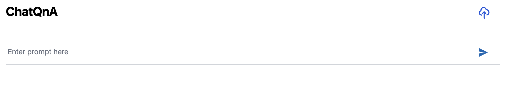

# ChatQnA-Xeon UI Server

## Overview

The **ChatQnA-Xeon UI Server** is the web-based user interface for the ChatQnA system. It allows users to interact with the AI-powered chat backend, upload files, ask questions, and view answers in a friendly and intuitive way—all from their browser.

This UI is designed to be easy to use, even for people with no technical background.

* default port: `5173`
* default image: `opea/chatqna-ui:latest`

---

## Architecture & Flow

- **Frontend Web App:** Runs as a Docker container and serves the UI on port 5173.
- **Backend Connection:** Communicates with the ChatQnA backend server for all AI and chat functions.
- **File Upload:** Allows users to upload documents, which are processed and used by the backend for better answers.
- **Healthcheck:** Provides a health endpoint for monitoring if the UI is running.

**Workflow:**

1. **Start the UI container:** The UI is served at `http://localhost:5173` (or the server's IP).
2. **User opens the web page:** The user sees a chat interface in their browser.
3. **User interacts:** The user can type questions, upload files, and view responses.
4. **UI sends requests:** The UI sends chat and file upload requests to the backend server.
5. **Backend processes:** The backend handles the AI logic and returns answers or file processing results.
6. **UI displays results:** The user sees answers, document status, and other information in real time.

---

## Usage

### Run with Docker

```sh
docker run -d \
  --name chatqna-xeon-ui-server \
  -p 5173:5173 \
  -e UPLOAD_FILE_BASE_URL=http://localhost:6007/v1/dataprep/ingest \
  opea/chatqna-ui:latest
```



⬆️ This is the default UI interface for ChatQnA-Xeon. For the MVP version, a new UI is being developed that will be more user-friendly and contains more functions. Developers can customize the UI based on their needs.

#### Key Elements Explained

- `-p 5173:5173`: Makes the UI available at `http://localhost:5173` in your browser.
- `-e UPLOAD_FILE_BASE_URL=...`: Tells the UI where to send uploaded files (should match your backend's file upload endpoint).
- `opea/chatqna-ui:latest`: The Docker image for the ChatQnA UI.

## Notes

- **Backend Dependency:**  
  The UI needs the ChatQnA backend server running and accessible.  
  By default, it expects the backend at `http://localhost:8888` (you can change this in the UI config if needed).
- **File Uploads:**  
  The `UPLOAD_FILE_BASE_URL` environment variable must point to the correct backend endpoint for file uploads.
- **Port Conflicts:**  
  Make sure port 5173 is not used by another service on your machine.
- **Browser Access:**  
  Open your browser and go to `http://localhost:5173` to use the chat UI.

---

## Extending

- **Change Backend Address:**  
  If your backend runs on a different host or port, update the UI configuration or environment variables accordingly.
- **Customize UI:**  
  You can rebuild the UI Docker image with your own.
- **Add Features:**  
  Developers can extend the UI to support new chat features, file types, or integrations.

## License

SPDX-License-Identifier: Apache-2.0

See [OPEA License](https://github.com/opea-ai/opea/blob/main/LICENSE) for usage and distribution terms.