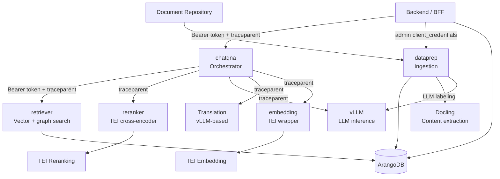
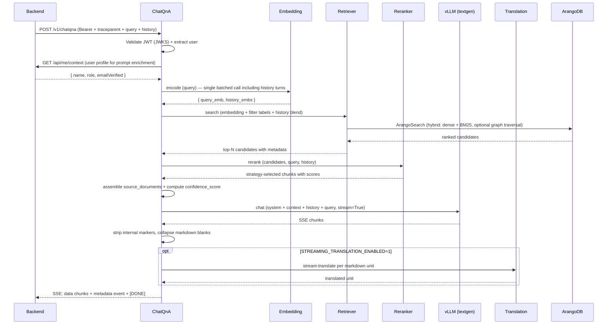

# OPEA Microservices

The OPEA overlay layer (`genie-ai-overlay/`) is where the RAG pipeline actually runs. This page is the architectural reference for the layer: which microservice owns which concern, what they exchange with each other and with the backend, and where the per-service contract surfaces live.

> **Audience:** Integrators extending the RAG pipeline, deployers debugging inter-service issues, and reviewers tracing a failure through the stack. For tuning knobs and operator-facing config, see the [RAG Pipeline]() section.

---

## 1. Service Map



| Service | Source | Owns | Key contract surface |
|---------|--------|------|----------------------|
| **chatqna** | `genie-ai-overlay/chatqna/genieai_chatqna.py` | Orchestrates retrieval → rerank → generation. Validates Bearer token via JWKS. Emits the user-facing SSE stream + `confidence_score`. | `POST /v1/chatqna` (called by backend), reads/writes `source_documents` field, emits `confidence_score` metadata event |
| **retriever** | `genie-ai-overlay/retriever/` | Dense + BM25 (lexical) hybrid retrieval against ArangoDB. Optional graph traversal. | `RETRIEVER_ARANGO_*` (k, fetch_k, score_threshold, traversal, hybrid, distance, search_mode), label-filter data contract encoded in `search_start` |
| **reranker** | `genie-ai-overlay/reranker/genieai_tei_reranker.py` | TEI cross-encoder rescoring + strategy selection (`slice`, `threshold`, `slice_threshold`, `knee_threshold`, `adaptive`). | `RERANKING_STRATEGY`, `RERANKER_TOP_N`, `RERANKING_THRESHOLD`, `NOVELTY_SIGMOID_*`, `CONTEXT_DECAY_FACTOR`, `MIN_VALUE_THRESHOLD` |
| **embedding** | `genie-ai-overlay/embedding/` | TEI embedding microservice wrapper — single endpoint shared by dataprep (ingest) and chatqna (query). | `EMBEDDING_SERVER_ENDPOINT`, `EMBEDDING_MODEL_ID`, `EMBEDDING_SERVICE_URL` |
| **textgen** | `genie-ai-overlay/textgen/` | vLLM wrapper service — chat, translation, and labeling all call into vLLM through this. | `VLLM_ENDPOINT`, `VLLM_LLM_MODEL_ID`, `VLLM_API_KEY` |
| **dataprep** | `genie-ai-overlay/dataprep/genieai_dataprep_arangodb.py` | Docling parse → dynamic-size chunk → contextual prefix (optional) → LLM labeling → vector embedding → ArangoDB write. Emits the `ingestion_log` to the backend. | `POST /v1/dataprep/ingest_file`, `POST /v1/dataprep/retract_file` (called by Document Repository via admin service account) |
| **translation** | separate OPEA microservice | Target-language chat translation (streaming or post-generation). | `TRANSLATION_BACKEND`, `VLLM_TRANSLATION_*`, `STREAMING_TRANSLATION_ENABLED` |

---

## 2. Request Flow (ChatQnA Pipeline)



### What the backend sends to ChatQnA

| Field | Required | Source |
|-------|----------|--------|
| `messages` | yes | Trimmed conversation history (`MULTI_TURN_HISTORY_TURNS` default 1) |
| `query` | yes | Current user message |
| `stream` | yes | Mirrors `OPEA_STREAMING`; backend reads `OPEA_STREAMING` from env |
| `top_n`, `reranking_strategy`, `reranking_threshold`, `traversal_max_depth`, `traversal_max_returned`, `traversal_score_threshold`, `distance_threshold`, `lambda_mult`, `score_threshold` | no | Top-level per-request override fields (no wrapper block) — see §5 |
| Bearer token | yes | Forwarded from the user's request, validated independently in ChatQnA |
| `traceparent` | yes | W3C trace context propagated from backend |

### What ChatQnA returns to the backend

Two modes, controlled by `OPEA_STREAMING`:

**Non-streaming** (`OPEA_STREAMING=false`):
```json
{
  "text": "<final answer, internal markers stripped>",
  "source_documents": [
    { "document_id": "<doc_key>", "score": 0.91, "metadata": { ... } },
    ...
  ],
  "metadata": {
    "retrieval_confidence_score": 0.78,
    "confidence_score": 0.82,
    "is_grounded": true,
    "self_confidence": 67   // only when LLM_SELF_CONFIDENCE_ENABLED=1
  }
}
```

**Streaming** (`OPEA_STREAMING=true`):
- A sequence of SSE events. Each non-terminal event is `data: {"text":"<delta>"}`.
- A single metadata event (typically just before `[DONE]`) carries the `source_documents` and confidence metadata.
- Terminal: `data: [DONE]`.

> **Internal-marker stripping.** ChatQnA scrubs `|<-MSG->|`, `USER:`, `ASSISTANT:` markers and collapses excess blank runs before the text reaches the user or the translation pipeline. This is essential to prevent prompt-template leakage.

---

## 3. Trust Boundaries (Microservice Level)

Each OPEA microservice that touches the network has its own authentication posture:

| Service | Inbound auth | Outbound auth | Notes |
|---------|-------------|---------------|-------|
| chatqna | **Keycloak JWT (JWKS)** — validates Bearer on every request | None to retriever/reranker/embedding/textgen (internal network) | Extracts user identity (`sub`, `iss`, roles) from the JWT payload for audit + prompt enrichment |
| retriever | None (internal network only) | ArangoDB credentials from `ARANGO_URL`/`ARANGO_USER`/`ARANGO_PASSWORD` | Reads only — no write access |
| reranker | None | TEI Reranking HTTP endpoint | Reads only |
| embedding | None | TEI Embedding HTTP endpoint | Shared by chatqna (query) and dataprep (ingest) |
| textgen | None | vLLM HTTP endpoint (Bearer `VLLM_API_KEY`) | OpenAI-compatible; also used for labeling and translation |
| dataprep | **Keycloak `client_credentials`** — dedicated service account (`KC_DATAPREP_CLIENT_ID/SECRET`) | Same internal endpoints as above, plus backend ingestion-log endpoint for diagnostics | Service account is separate from user tokens; permissions scoped to ingestion |
| translation | None | vLLM translation endpoint (Bearer `VLLM_API_KEY`) | Called from ChatQnA only |

**Failure mode:** if ChatQnA's JWKS call to Keycloak fails (Keycloak down or unreachable), chatqna returns 401/500 — the backend surfaces this as a 5xx to the user. The JWKS cache absorbs short Keycloak hiccups; cache miss on every request is a sign Keycloak itself is misconfigured.

---

## 4. Telemetry Architecture

All OPEA services emit OTel spans through the shared `genie-ai-overlay/tracing.py`. The trace context flows via W3C `traceparent` headers — backend injects on the first hop, every downstream service extracts and propagates.

### Dataprep spans (instrumented in `genieai_dataprep_arangodb.py`)

| Span | Phase | Key attributes |
|------|-------|----------------|
| `dataprep.ingest` | ingest entry | `dataprep.file_type`, `dataprep.file_size_bytes`, `dataprep.file_id` |
| `dataprep.retract` | retract entry | `dataprep.file_id` |
| `dataprep.chunking` | docling + chunk | `dataprep.chunk_count` |
| `dataprep.llm.label_chunk` | single-chunk label call | `dataprep.chunk_index`, `dataprep.llm_attempt`, `dataprep.llm_batched=False`, `dataprep.llm_model`, `dataprep.labels_suggested`, `dataprep.llm.completion_tokens` |
| `dataprep.llm.label_batch` | batched label call | `dataprep.llm_batched=True`, `dataprep.llm_batch_size`, `dataprep.chunk_indices`, `dataprep.llm_model`, `dataprep.labels_suggested`, `dataprep.llm.prompt_tokens` |

### ChatQnA spans

| Span | Phase | Notes |
|------|-------|-------|
| `chatqna.orchestrate` | orchestrator entry | Root span for the RAG pipeline inside chatqna (`genieai_chatqna.py`) |
| `chatqna.reranker_selection` | reranker strategy selection | Which strategy was applied to the candidates |
| `retriever.hybrid_search` | retriever call | Emitted by the retriever service (ArangoDB hybrid vector + BM25 + graph) |
| `reranker.rerank` | reranker call | Emitted by the reranker service |
| `reranker.tei_invoke` | inner TEI call | Inner span inside the reranker for the TEI HTTP call |

For full per-phase breakdown and an end-to-end debug recipe (fetch a trace by ID, find the bottleneck, decode the `traceparent` chain), see [Debugging with Tracing & Logs](/.claude/rules/DEBUGGING-TRACING.md) in the developer KB.

---

## 5. Per-Request Overrides (ChatQnA)

The request body fields below act as per-request overrides over the deployment defaults (`RERANKER_TOP_N`, `RERANKING_STRATEGY`, `RETRIEVER_ARANGO_K`, `RETRIEVER_ARANGO_FETCH_K`, `RETRIEVER_ARANGO_FILTER_STRATEGY`, `CONFIDENCE_RANK_DECAY`, `RERANKER_SCORE_CALIBRATION`, `RERANKER_SCORE_TEMPERATURE`). They are **top-level fields** on the ChatQnA request (e.g. `top_n`, `reranking_strategy`), not nested inside a wrapper block — see `genie-ai-overlay/chatqna/genieai_chatqna.py` (`chat_request.top_n`, `chat_request.reranking_strategy`, `GenieaiRetrieverParms`, `GenieaiRerankerParms`). This is how the same chatqna service can serve different retrieval strategies for different user requests without restart.

| Request field | Maps to | Default | Notes |
|--------------|---------|---------|-------|
| `top_n` | `RERANKER_TOP_N` | `3` | Final chunks forwarded to the LLM |
| `reranking_strategy` | `RERANKING_STRATEGY` | `slice` | See [Architecture — §9.3 Reranker Strategies](/docs/architecture/architecture/#93-reranker-strategies) |
| `reranking_threshold` | `RERANKING_THRESHOLD` | (env) | Threshold used by `threshold` / `slice_threshold` / `knee_threshold` strategies |
| `traversal_max_depth` | `RETRIEVER_TRAVERSAL_MAX_DEPTH` | (env) | Graph traversal depth |
| `traversal_max_returned` | `RETRIEVER_TRAVERSAL_MAX_RETURNED` | (env) | Graph traversal fan-out |
| `traversal_score_threshold` | `RETRIEVER_TRAVERSAL_SCORE_THRESHOLD` | (env) | Minimum graph-edge score to follow |
| `distance_threshold` | `RETRIEVER_DISTANCE_THRESHOLD` | (env) | MMR pool distance cutoff |
| `lambda_mult` | `RETRIEVER_LAMBDA_MULT` | (env) | MMR diversity vs relevance weight |
| `score_threshold` | `RETRIEVER_SCORE_THRESHOLD` | (env) | Minimum retriever score |

> **Safety:** per-request overrides cannot weaken global safety knobs (e.g. cannot disable Contextual Retrieval once it is enabled at the service level). The override is a *forwarding* mechanism, not an authentication-bypass one.

---

## 6. The Label-Filter Data Contract

A subtle but load-bearing detail: OPEA's framework drops custom fields that aren't part of its known schema. The retriever therefore receives category labels encoded inside the `search_start` parameter (a string with a `::labels:` separator), not as a separate top-level field.

```python
# chatqna → retriever
from core.label_contract import encode_filter_labels

search_start = encode_filter_labels("chunk", ["Agriculture.Crops.Corn", "Agriculture.Crops.Cassava"])
# => "chunk::labels:Agriculture.Crops.Corn,Agriculture.Crops.Cassava"
```

The retriever parses this back out (`decode_filter_labels(search_start)` in `genie-ai-overlay/core/label_contract.py`) and uses the label list to build the AQL `FILTER` clause before the vector search. If a chunk arrives without an expected label (dataprep returned `[]`), the chunk is still stored but will not surface under a strict label filter at query time.

For the label-driven retrieval behavior (label selector prompt, taxonomy alignment, common pitfalls), see [Knowledge Base — Labelling & Taxonomy](/docs/knowledge-base/labelling-taxonomy/).

---

## 7. Inter-Service Failure Modes

| Symptom | Likely cause | Where to look |
|---------|-------------|---------------|
| Chat returns 401 to a logged-in user | ChatQnA JWKS validation failed — Keycloak unreachable or `iss`/`aud` mismatch | `docker logs <chatqna>` — JWKS errors. Verify `KEYCLOAK_URL` matches the public URL in the JWT |
| Chat returns "no relevant documents" for a known-good query | Retriever returns empty — could be label filter too strict, embedding model mismatch, or traversal disabled | Check the `retriever.hybrid_search` span (emitted by the retriever service); the trace shows the AQL `FILTER` clause and result count |
| LLM hallucinates instead of abstaining | `CHATQNA_ENFORCE_ABSTENTION=false` or the system prompt override is too weak | See `CHATQNA_ABSTENTION_INSTRUCTIONS` and `CHATQNA_ENFORCE_ABSTENTION` env vars |
| Translation never appears in the stream | `STREAMING_TRANSLATION_ENABLED=0` (default) — output is translated post-generation (English-then-flip), not per-unit | Set `STREAMING_TRANSLATION_ENABLED=1` for per-unit streaming; verify `VLLM_TRANSLATION_ENDPOINT` reachable |
| Ingestion "completes" but chunks are missing labels | Label selector LLM call failed silently (per-chunk fallback to raw chunk + no context for embedding) | Check `dataprep.llm.label_chunk` spans — look for `llm_attempt > 1` or `JSONDecodeError`. Verify `VLLM_LLM_MODEL_ID` supports guided JSON (`response_format={"type":"json_object"}`) |
| All chat requests time out | vLLM is down or saturated; the embedding model call hangs | `curl <VLLM_ENDPOINT>/health`; check `gpu=true` node labels and `docker service ls \| grep vllm` |
| ChatQnA rejects Bearer tokens | Wrong `aud` claim — ChatQnA's expected audience doesn't match what Keycloak issues | Verify ChatQnA's `KEYCLOAK_AUDIENCE` (or equivalent) and the client config in `keycloak-config/` |

---

## 8. Verifying After a Stack Update

After upgrading any OPEA service image, run this verification sequence before opening it to users:

```bash
# 1. All OPEA services are healthy in Swarm
docker service ls | grep -E "chatqna|retriever|reranker|dataprep|embedding|textgen"

# 2. Internal health endpoints respond
docker exec $(docker ps --format "{{.Names}}" | grep chatqna | head -1) curl -s http://localhost:8888/health
docker exec $(docker ps --format "{{.Names}}" | grep retriever | head -1) curl -s http://localhost:7000/health
docker exec $(docker ps --format "{{.Names}}" | grep reranker | head -1) curl -s http://localhost:8000/health

# 3. End-to-end smoke: ask a known question, verify a trace lands in VictoriaTraces
# (use the API contracts doc for curl examples with a Keycloak ROPC token)
# Then query VictoriaTraces for the trace:
TRACE_ID=<from response headers>
docker exec $(docker ps --format "{{.Names}}" | grep backend | head -1) \
  curl -s "http://victoriatraces:10428/select/jaeger/api/traces/$TRACE_ID" | jq '.data[0].spans | length'
# Expected: an auto-instrumented backend HTTP server span (named after the route, e.g. `POST /api/chat`) plus chatqna.orchestrate, chatqna.reranker_selection, retriever.hybrid_search, reranker.rerank, and reranker.tei_invoke — at least 6 spans total, more if dataprep runs
```

A trace that returns fewer spans than expected means one stage silently no-ops — usually a service that's reachable but misconfigured (e.g. TEI pointing at the wrong embedding model).

---

## 9. Where to Go Next

| Concern | Where |
|---------|-------|
| End-to-end RAG flow with operator-facing config | [RAG Pipeline]() |
| Ingestion stages (parse, chunk, label, embed) | [Knowledge Base — Ingestion](/docs/knowledge-base/ingestion/) |
| Confidence score derivation | [Architecture — §9.4 Confidence Scoring](/docs/architecture/architecture/#94-confidence-scoring) |
| Contextual Retrieval | [Architecture — §10.2 Ingestion Flow](/docs/architecture/architecture/#102-ingestion-flow) and [Data Labelling Strategy]() §7 |
| Multi-turn retrieval | [Multi-Turn Retrieval]() |
| HTTP API shapes | [API Contracts — Backend]() |
| Live trace debugging | [Debugging with Tracing & Logs](/.claude/rules/DEBUGGING-TRACING.md) (developer KB) |
