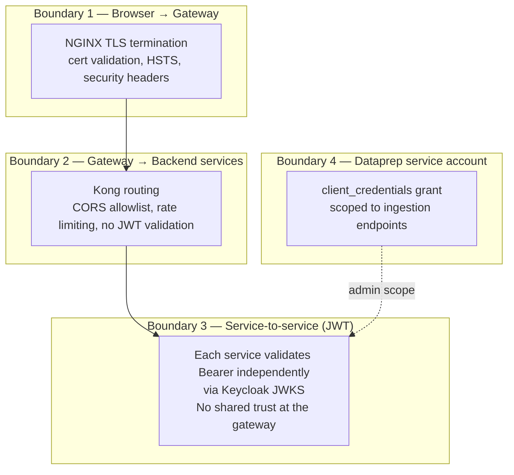
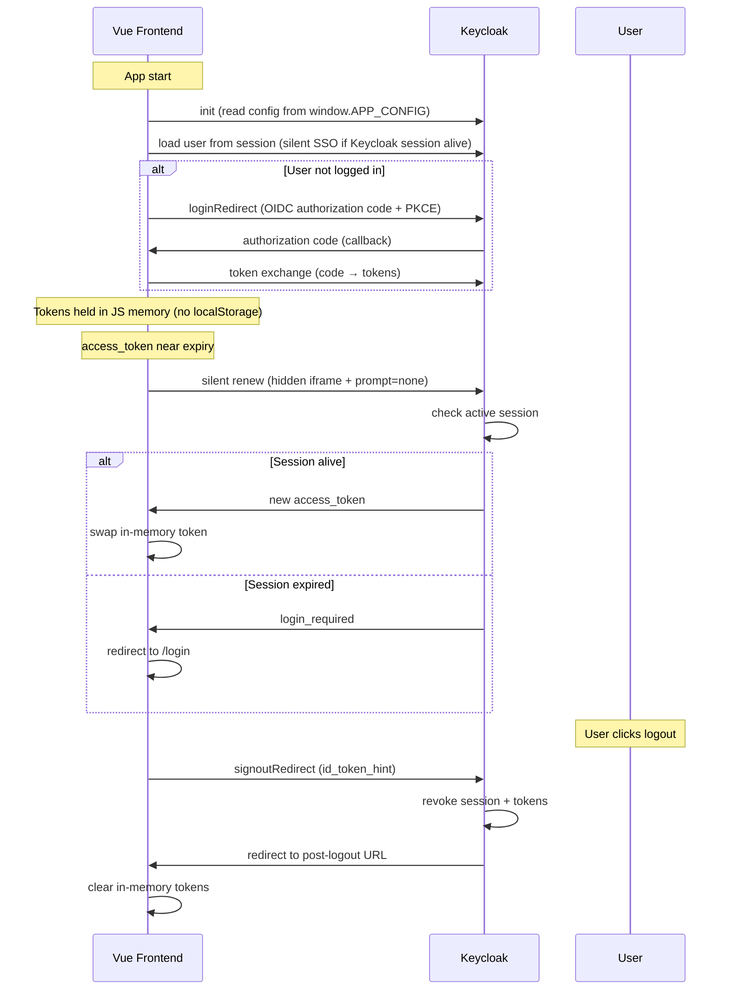
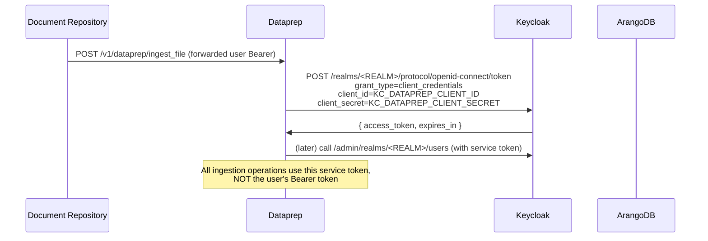
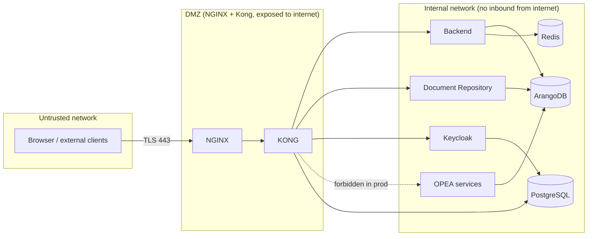

# Trust Boundaries & Security Architecture

How GENIE.AI decides *who can do what*, where each trust boundary lives, and what happens when one is misconfigured. This is the security-side companion to the [Architecture Overview](/docs/architecture/architecture/).

> **Audience:** Deployers and security reviewers. For user management procedures, see the [Keycloak Admin Guide]().

---

## 1. The Trust Boundary Model

GENIE.AI has **four trust boundaries**, each enforced independently:



| # | Boundary | What's enforced | What is NOT enforced |
|---|----------|-----------------|----------------------|
| 1 | Browser → NGINX | TLS, HSTS, security headers, cert chain validation | Authentication (anyone can hit `/`) |
| 2 | NGINX → Kong → Backend | CORS, rate limit, path routing | **No JWT validation** at the gateway — every service does it itself |
| 3 | Service-to-service | Each service validates Bearer via JWKS, extracts `sub`/`roles`, enforces per-route authz | The gateway does not gate auth; a misconfigured service that skips validation is the failure mode to watch |
| 4 | Dataprep service account | `client_credentials` grant; the service account has its own client ID + secret, separate from any user | It cannot impersonate users — its scope is limited to the ingestion endpoints |

> **Why this shape?** Defense in depth: a misconfigured Kong (rate-limit off, wrong CORS) cannot bypass authentication. A compromised user token cannot reach services it has no role for. The gateway is treated as untrusted.

---

## 2. JWT Validation & JWKS Caching

Every service that touches a Bearer token validates it independently. There is **no shared trust at the gateway**, and no session store the backend has to consult — the JWT is the source of truth.

### 2.1 What each service validates

| Claim | Required | Where it's checked | Failure → |
|-------|----------|---------------------|-----------|
| `iss` (issuer) | yes | Must equal Keycloak's issuer (derived from `KEYCLOAK_URL` + realm path) | 401, code `TOKEN_INVALID` |
| `aud` (audience) | yes | Must include this service's expected audience (per-client in Keycloak) | 401, code `TOKEN_INVALID` |
| `exp` (expiry) | yes | Rejected if past; clock skew tolerance is implementation-defined | 401, code `TOKEN_EXPIRED` |
| `sub` (subject) | yes | Combined with `iss` as `iss#sub` for JIT user identity | Treated as new user if absent from DB |
| `realm_access.roles` | route-dependent | Admin routes check `realm_access.roles` includes `admin` | 403, code `FORBIDDEN` |
| Signature | yes | RSA / EC verified against Keycloak JWKS | 401, code `TOKEN_INVALID` |

### 2.2 JWKS caching

Keycloak publishes its public keys at `/realms/<REALM>/protocol/openid-connect/certs` (the JWKS endpoint). Each service caches these locally.

```
GET <KEYCLOAK_URL>/realms/<REALM>/protocol/openid-connect/certs
→ { "keys": [ { "kid": "...", "kty": "RSA", "n": "...", "e": "..." }, ... ] }
```

Cache policy:
- **Cache miss** → service fetches the JWKS over HTTPS, caches keys keyed by `kid`.
- **Cache hit but unknown `kid`** (e.g. Keycloak rotated the signing key) → service refreshes the JWKS.
- **Cache TTL** — implementation-specific; on the order of minutes to hours. The next miss or unknown-`kid` event triggers refresh.
- **Refresh under failure** — JWKS HTTP errors do not invalidate the cache; the service retries the request against the cached keys until expiry, then surfaces the failure as 5xx.

> **Verify JWKS is reachable from each service.** If a service is deployed with the wrong `KEYCLOAK_URL` (e.g. `http://keycloak:8080` instead of the public `https://.../auth`), it cannot fetch the JWKS and every request 401s.

### 2.3 Why per-service validation?

If the gateway were the only validator, then a backend bug that forwards the raw token without re-checking could escalate privileges; and a service compromise would let an attacker mint tokens against any other service. Independent validation means each service enforces its own contract.

| Failure mode | What happens |
|--------------|-------------|
| Kong routing misconfigured (sends request to wrong upstream) | Wrong upstream returns 401 (its own JWKS validation rejects the token's `aud` claim) — the user sees a clean auth error, not silent escalation |
| Backend JWT validation disabled by a bug | Document Repository still validates; OPEA ChatQnA still validates; the user cannot reach the LLM with a forged token |
| Keycloak unreachable | Services continue to validate against cached keys; once keys expire or the cache is cold, every request fails 5xx — graceful degradation up to the cache TTL |
| Keycloak rotated signing keys mid-session | Old tokens still validate against the cached old key (until expiry); new tokens use the new key. The next cache refresh pulls both |

---

## 3. The Frontend Token Lifecycle



### 3.1 Why in-memory only?

| Storage | XSS theft risk | Survives page reload |
|---------|----------------|----------------------|
| `localStorage` | High (any injected script can read) | Yes |
| `sessionStorage` | High | Until tab close |
| **JS memory (current)** | **Low** (must read it during the same tick as the XSS) | **No — silent SSO on next load via Keycloak session cookie** |

The trade-off: every page reload requires a silent SSO round-trip. That round-trip is essentially free when the Keycloak session cookie is alive (the iframe flow), and degrades to a login redirect when the session is gone.

### 3.2 Silent renew failure modes

| Symptom | Cause | Fix |
|---------|-------|-----|
| User bounced to login on every page reload | Keycloak session cookie not present (third-party cookie blocked, or session expired) | Check browser cookie settings; verify Keycloak is on the same eTLD+1 as the frontend (otherwise third-party cookies are blocked by default in modern browsers) |
| User stuck on "renewing…" screen | Hidden iframe fails because Keycloak rejects `prompt=none` from an unknown origin | Add the frontend origin to Keycloak's `Web origins` allowlist (`KEYCLOAK_WEB_ORIGINS` in `.env`) |
| Renew succeeds but token is immediately rejected by backend | Clock skew between browser host and backend host | Sync clocks via NTP |

---

## 4. Service Account: Dataprep

Dataprep is the only service that uses `client_credentials` instead of a Bearer token from a user session.



### 4.1 Why a separate service account?

- **Auditability** — Dataprep actions appear in Keycloak logs under the service account, not under whichever user happened to trigger the ingest. This matters for compliance audits.
- **Permission scoping** — the service account has the minimum scopes needed for ingestion (read service categories, write chunks/edges, emit ingestion log). It cannot, for example, read other users' chat history.
- **Independence** — the service account keeps working even when no user is logged in (batch ingestion, admin re-indexing).

### 4.2 Service account security checklist

| Setting | Recommended | Why |
|---------|-------------|-----|
| Client secret length | ≥ 32 random bytes (`openssl rand -hex 32`) | Brute-force resistance |
| Client secret rotation | Every 90 days | Limit blast radius of a leak |
| Service account roles | Minimum: `dataprep-service` role with `service-category:read` + `dataprep:write` | Least privilege |
| Session timeout | No refresh token — short-lived access tokens only | Service-to-service doesn't need long sessions |
| Audit logging | Enabled in Keycloak (`Events > Login` + `Events > Admin`) | Trace every ingestion action |

---

## 5. Network Trust Posture

The deployment assumes the internal Docker network is trusted between services — there is **no mTLS** between services. The trust model is:



| Surface | Exposed | Authentication |
|---------|---------|----------------|
| NGINX :80 / :443 | yes (internet) | TLS |
| Kong :8000 | **no** (internal only, behind NGINX) | TLS from NGINX |
| Backend :3000 | no | JWT (validated by every service) |
| Document Repository :3001 | no | JWT |
| Dataprep :5000 | no | `client_credentials` |
| ChatQnA :8888 | no | JWT |
| ArangoDB :8529 | **yes** (host port `ARANGO_PORT`, for ops) | `ARANGO_USER` / `ARANGO_PASSWORD` |
| Keycloak :8080 | no (behind NGINX at `/auth/`) | n/a — it IS the IdP |
| Redis :6379 | no | `TRANSLATION_CACHE_PASSWORD` |
| PostgreSQL :5432 | no | `POSTGRES_PASSWORD` |

> **Operational rule:** never expose the internal services directly. If a tool (e.g. a database admin UI) needs to reach ArangoDB, use `docker exec <container> curl ...` from a container on the overlay network, or a WireGuard/Site-to-Site VPN.

---

## 6. Threat Model Summary

| Threat | Mitigation |
|--------|------------|
| **XSS in the Vue frontend** | Tokens in JS memory only; `oidc-client-ts` does not write to `localStorage`. CSP via `CSP_CONNECT_SRC` restricts outbound script sources. |
| **Stolen refresh token** | The frontend never stores refresh tokens (Authorization Code + PKCE + silent iframe). Stolen `access_token` has the short lifespan configured by `KEYCLOAK_ACCESS_TOKEN_LIFESPAN`. |
| **Compromised user with admin role** | All admin actions audit-logged to ArangoDB `ingestion_log` and VictoriaLogs. `realm_access.roles` is the only authz source — no other privilege escalation path. |
| **Compromised OPEA service** | Cannot reach Keycloak admin endpoints (it only does JWKS read + ingestion write); cannot read other services' tokens (each service has its own audience). Blast radius limited to its own contract surface. |
| **Misconfigured Kong** | Each service still validates JWT — Kong cannot bypass auth by mis-routing. |
| **Clock skew** | NTP on all nodes; tokens include `exp` and `nbf`; services reject out-of-window tokens. |
| **Replay (stolen short-lived access_token)** | Short token lifetime (default 5 minutes). High-value operations can be rate-limited at the service level (Kong applies coarse limits; per-endpoint limits live in the backend). |
| **Service account secret leak** | Dataprep's `KC_DATAPREP_CLIENT_SECRET` is scoped to ingestion only; rotate via Keycloak admin. The leak does not give user impersonation. |
| **JWT algorithm confusion (alg=none)** | All services require the alg to match Keycloak's configured signing algorithm and reject `none`. |
| **Path traversal / open redirect on the OIDC callback** | `KEYCLOAK_VALID_REDIRECT_URIS` whitelist; OIDC redirect URI strictly validated. |

---

## 7. Security Headers & Transport

NGINX sets the following on every response:

| Header | Value (default) | Purpose |
|--------|-----------------|---------|
| `Strict-Transport-Security` | `max-age=31536000; includeSubDomains` | Force HTTPS |
| `X-Content-Type-Options` | `nosniff` | Prevent MIME sniffing |
| `X-Frame-Options` | `DENY` (default); `SAMEORIGIN` on `/auth/` and `/grafana/` (iframable admin consoles) | Prevent clickjacking |
| `Referrer-Policy` | `no-referrer-when-downgrade` | Limit Referer leakage |
| `Content-Security-Policy` | `default-src 'self'; connect-src ...` (`CSP_CONNECT_SRC`) | Restrict script and outbound connections |
| `Permissions-Policy` | (deny dangerous features) | Disable camera/mic/geolocation etc. by default |

`CSP_CONNECT_SRC` is the **most important** one for an LLM app — it controls which origins the browser will `fetch` to (and thus which origins can leak the JWT to). Override per deployment via `CSP_CONNECT_SRC` and `VUE_APP_CSP_CONNECT_SRC` in `.env`.

---

## 8. Verifying the Trust Boundaries After Install

```bash
# 1. Public surface — only NGINX :80 / :443 should respond
nmap -p 1-65535 <NGINX_PUBLIC_DOMAIN> --open -T4
# Expected: only 80, 443 open

# 2. Gateway → backend — Kong does NOT validate JWT
curl -sk https://<NGINX_PUBLIC_DOMAIN>/api/me
# Expected: 401 from the BACKEND (with code TOKEN_INVALID), not from Kong

# 3. Keycloak reachable only through /auth prefix
curl -skI https://<NGINX_PUBLIC_DOMAIN>/auth/realms/<KEYCLOAK_REALM>
# Expected: 200 with JSON
curl -skI https://<NGINX_PUBLIC_DOMAIN>/realms/<KEYCLOAK_REALM>
# Expected: 404 (no direct Keycloak exposure)

# 4. JWKS fetchable
curl -sk https://<NGINX_PUBLIC_DOMAIN>/auth/realms/<KEYCLOAK_REALM>/protocol/openid-connect/certs | jq '.keys | length'
# Expected: ≥ 1 (Keycloak has at least one active signing key)

# 5. Security headers present
curl -skI https://<NGINX_PUBLIC_DOMAIN>/ | grep -iE "strict-transport|content-security|x-frame|x-content-type|referrer-policy"
# Expected: all five headers present

# 6. Dataprep service account present and usable
docker exec $(docker ps --format "{{.Names}}" | grep dataprep | head -1) \
  sh -c "curl -sk -X POST http://keycloak:8080/realms/$REALM/protocol/openid-connect/token \
    -d grant_type=client_credentials \
    -d client_id=$KC_DATAPREP_CLIENT_ID \
    -d client_secret=$KC_DATAPREP_CLIENT_SECRET | jq .access_token"
# Expected: a long JWT string
```

A failure on any of these is a **deploy-day blocker**, not a "we'll fix it later" item — proceed only after every check passes.

---

## 9. Where to Go Next

| Concern | Where |
|---------|-------|
| Architecture overview | [Architecture Overview](/docs/architecture/architecture/) |
| OPEA service-level contracts | [OPEA Microservices](/docs/architecture/opea-microservices/) |
| User & role management | [Keycloak Admin Guide]() |
| External IdP (Google, Microsoft, SAML) | [External IdP Integration Guide]() |
| HTTP API auth requirements | [API Contracts — Backend]() |
| Deployment hardening | [Docker Compose Setup]() or [Docker Swarm Setup]() |
