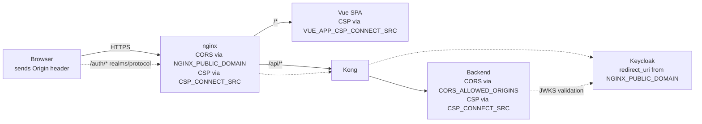

## Goal

Configure the three variables that govern what the browser is allowed to do
against GENIE.AI, and what GENIE.AI announces as its public origin — the trust
boundary between the SPA and the API gateway.

## Prerequisites

- A deployed GENIE.AI stack (Docker Compose or Swarm) with HTTPS terminated at
  nginx.
- A reachable `NGINX_PUBLIC_DOMAIN` (the FQDN clients use to reach nginx) and a
  valid TLS certificate for it.
- Access to `.env` at the deploy root and to the host running the stack.
- For the OIDC verification step: the Keycloak realm name (default `genie`).

## At a glance

| Variable | Set in | Where it is consumed | Purpose |
|---|---|---|---|
| `NGINX_PUBLIC_DOMAIN` | `.env` | nginx redirects + frontend `Host` header (`default.conf.template:278, 301`), Keycloak `redirect_uri` / `KC_HOSTNAME`, Grafana `GF_SERVER_ROOT_URL`, backend `KEYCLOAK_URL` | Hostname every redirect + OIDC issuer URL is derived from |
| `CORS_ALLOWED_ORIGINS` | `.env` | Backend `cors` middleware (`components/gov-chat-backend/index.js:404`) | Comma-separated allow-list enforced by the backend `cors` middleware (with `/regex/` syntax — see [CORS_ALLOWED_ORIGINS](#cors_allowed_origins)) |
| `CSP_CONNECT_SRC` | `.env` | nginx `location /` (`default.conf.template:268`), nginx named location `@frontend_spa` (`default.conf.template:292`), backend Helmet `contentSecurityPolicy` (`components/gov-chat-backend/index.js:382`) | CSP `connect-src` directive emitted by nginx for the frontend HTML responses **and** by the backend Helmet middleware. Must mirror `VUE_APP_CSP_CONNECT_SRC` (frontend dev-server CSP — `components/gov-chat-frontend/vue.config.js:5`) |
| `VUE_APP_CSP_CONNECT_SRC` | `.env` | Frontend dev-server CSP (`vue.config.js:5`) and `DefinePlugin` injection (`vue.config.js:63`) | Build-time `connect-src` for the local dev server and the runtime Vue bundle. Same value as `CSP_CONNECT_SRC` (different stage: build-time vs. runtime). |

The other nginx locations each handle CSP **independently of `CSP_CONNECT_SRC`** —
this is deliberate (the API has no need for cross-origin `connect-src`; Grafana
needs its own because it embeds WebSocket traffic):

| nginx `location` | CSP source | Header value (high-level) |
|---|---|---|
| `/api/queries/stream` | hardcoded | `default-src 'none'; connect-src 'self'; ...` (`default.conf.template:132`) |
| `/api/` | hardcoded | `default-src 'none'; connect-src 'self'; ...` (`default.conf.template:185`) |
| `/api-docs` | hardcoded | `default-src 'none'; connect-src 'self'; ...` (`default.conf.template:210`) |
| `/grafana/` | parameterized via `${NGINX_PUBLIC_DOMAIN}` + `${NGINX_HTTPS_PORT}` | `default-src 'self'; connect-src 'self' wss://${NGINX_PUBLIC_DOMAIN}:${NGINX_HTTPS_PORT} https://${NGINX_PUBLIC_DOMAIN}:${NGINX_HTTPS_PORT}; ...` (`default.conf.template:247`) |
| `/auth/` | **no CSP header emitted** | Only `X-Content-Type-Options`, `X-Frame-Options`, `X-XSS-Protection`, HSTS, `Referrer-Policy`, `Permissions-Policy` are set (`default.conf.template:95-100`). Keycloak's own UI controls CSP for proxied responses. |

All three are required for a production deploy. Leaving any of them empty
causes either CORS rejections (`CORS_ALLOWED_ORIGINS`), CSP console errors
(`CSP_CONNECT_SRC`), or broken OIDC redirects (`NGINX_PUBLIC_DOMAIN`).

## Where each variable lives



## `NGINX_PUBLIC_DOMAIN`

The fully-qualified origin the SPA is served from. nginx uses it to build
`Location:` headers on OIDC callbacks and the HTTP→HTTPS redirect
(`default.conf.template:14`), and to set the upstream `Host` header passed to
the frontend (`default.conf.template:278, 301`);
Keycloak uses it for `redirect_uri` validation (`KC_HOSTNAME` +
`KEYCLOAK_VALID_REDIRECT_URIS`); Grafana uses it for `GF_SERVER_ROOT_URL`.

```bash
# .env
NGINX_PUBLIC_DOMAIN=genie.example.gov
```

- **No scheme, no path, no port.** nginx prepends `https://`; do not include it.
- For self-signed dev stacks, use the IP or hostname clients reach the
  container on (e.g. `10.0.0.102`) — see
  [Mobile Deployment Guide → El Salvador test topology](/docs/mobile/mobile-deployment-guide/)
  for the WireGuard-tunnel + self-signed-cert gotchas.

## `CORS_ALLOWED_ORIGINS`

Comma-separated list of origins the backend `cors` middleware accepts
(`components/gov-chat-backend/index.js:404-433`). The browser sends an
`Origin:` header on every cross-origin request; the middleware responds with
`Access-Control-Allow-Origin` for any origin on this list and rejects everything
else — **except** requests with no `Origin` header (server-to-server, Postman,
curl), which the middleware always allows (`index.js:414-417`).

```bash
# .env
CORS_ALLOWED_ORIGINS=https://genie.example.gov,https://admin.genie.example.gov
```

- Wildcard (`*`) is **not supported** — the SPA sends credentials, and CORS
  rejects credentialed requests with a wildcard `Allow-Origin`.
- Regex entries are supported via `/pattern/` syntax
  (e.g. `/\\.example\\.com$/`) — the inner string is passed straight to
  `new RegExp()` (`index.js:425`). A malformed pattern falls back to strict
  equality so a bad entry can never widen access (`index.js:428-430`).
- For local dev with the frontend on `:8090`, add `http://localhost:8090`
  (the default Vue dev-server port per `vue.config.js:11`; the `:5173` port
  belongs to the disabled `chatqna-xeon-ui-server` OPEA service, not the
  GENIE.AI SPA).
- Multiple values are matched by exact string; trailing slashes are
  significant (`https://genie.example.gov` ≠ `https://genie.example.gov/`).
- This variable is **separate from nginx's CORS layer** — nginx uses
  `NGINX_PUBLIC_DOMAIN` as the single allowed origin at the TLS termination
  point (`default.conf.template:119-120, 171, 179`). They must agree in
  production, but each is configured and verified independently.

## `CSP_CONNECT_SRC`

The `connect-src` directive emitted by nginx for the SPA HTML responses (and
the SPA fallback) and by the backend Helmet middleware for API responses.
Controls which origins the browser is allowed to make `fetch()`,
`XMLHttpRequest`, `WebSocket`, and `EventSource` connections to. Anything not
in this list is blocked by the browser before the request leaves the device.

```bash
# .env
CSP_CONNECT_SRC='self' https://genie.example.gov
```

- Must include `'self'` (the SPA's own origin).
- Must include the **HTTPS** origin for the streaming chat endpoint — the
  chat transport uses Server-Sent Events (SSE, `text/event-stream`) over HTTP
  via `POST /api/queries/stream` (`components/gov-chat-backend/routes/query-routes.js:167`,
  consumed by `components/gov-chat-frontend/src/services/chatbotService.js:62`).
  WSS origins are also accepted by `connect-src` (the directive covers
  WebSocket per the CSP spec), but the chat itself is HTTP-based.
- Set `VUE_APP_CSP_CONNECT_SRC` to the **same value** — the Vue dev server
  (`vue.config.js:5`) and the production bundle's CSP (`vue.config.js:63`)
  read from that variable, not `CSP_CONNECT_SRC` directly.
- The `/grafana/` location emits its own CSP header built from
  `${NGINX_PUBLIC_DOMAIN}` + `${NGINX_HTTPS_PORT}` directly
  (`default.conf.template:247`), **not** from `CSP_CONNECT_SRC` — ensure
  `NGINX_PUBLIC_DOMAIN` and `NGINX_HTTPS_PORT` are set so Grafana's OIDC
  redirect to Keycloak is allowed.
- The `/auth/` location emits **no CSP header at all** — Keycloak's own UI
  controls CSP for proxied responses (`default.conf.template:93-114`).

## Verify it worked

After deploying any of the three:

```bash
# 1a. nginx CORS preflight — intercepts OPTIONS at the edge
curl -sk -i -X OPTIONS https://genie.example.gov/api/chat \
  -H "Origin: https://genie.example.gov" \
  -H "Access-Control-Request-Method: POST"
# Expect: HTTP/1.1 204 No Content
# Expect: Access-Control-Allow-Origin: https://genie.example.gov
# (This is the nginx CORS layer, default.conf.template:169-177, not the backend.)

# 1b. Backend CORS middleware — exercise the Express `cors()` layer directly.
#     Run this on any container that can reach the backend service
#     (e.g. nginx, kong, or the host with `docker exec`).
docker exec $(docker ps --format '{{.Names}}' | grep -E '^(genieai_)?nginx' | head -1) \
  curl -sk -i -X OPTIONS http://backend:3000/api/chat \
    -H "Origin: https://genie.example.gov" \
    -H "Access-Control-Request-Method: POST"
# Expect: Access-Control-Allow-Origin: https://genie.example.gov
# If only (1a) works and (1b) fails, CORS_ALLOWED_ORIGINS is missing the origin.

# 2. CSP header on every SPA HTML response (uses CSP_CONNECT_SRC)
curl -skI https://genie.example.gov/ | grep -i content-security-policy
# Expect: connect-src 'self' https://genie.example.gov

# 3. CSP header on API responses (also uses CSP_CONNECT_SRC, via backend Helmet)
docker exec $(docker ps --format '{{.Names}}' | grep -E '^(genieai_)?nginx' | head -1) \
  curl -skI http://backend:3000/api/health | grep -i content-security-policy
# Expect: connect-src 'self' https://genie.example.gov

# 4. OIDC issuer URL is built from NGINX_PUBLIC_DOMAIN (no trailing slash)
curl -sk https://genie.example.gov/auth/realms/genie/.well-known/openid-configuration \
  | python3 -c 'import sys,json; print(json.load(sys.stdin)["issuer"])'
# Expect: https://genie.example.gov/auth/realms/genie

# 5. Keycloak accepted the redirect_uri pattern
curl -skI 'https://genie.example.gov/auth/realms/genie/protocol/openid-connect/auth?client_id=genie-app&response_type=code&redirect_uri=https://genie.example.gov/callback' \
  | head -1
# Expect: HTTP/1.1 200 OK (or 302 to login) — never 400 invalid_redirect_uri
```

## Troubleshooting

| Symptom | Cause | Fix |
|---|---|---|
| Browser console: `Cross-Origin Request Blocked: … 'Access-Control-Allow-Origin' header has a value that is not the requested origin.` | nginx sees a request whose `Origin` doesn't match `NGINX_PUBLIC_DOMAIN` | Add the origin to `CORS_ALLOWED_ORIGINS` (the **backend** layer) **and** confirm `NGINX_PUBLIC_DOMAIN` matches the host the browser actually hits (the **nginx** layer). Both must agree. |
| Browser console: `Refused to connect to 'https://…' because it violates the following Content Security Policy directive: "connect-src 'self' …"`. | The public domain is missing from `CSP_CONNECT_SRC` (or the wrong one is set) | Set `CSP_CONNECT_SRC='self' https://<NGINX_PUBLIC_DOMAIN>` in `.env`, redeploy the backend **and** the frontend, then restart the affected containers so nginx re-templates the config (`api-gateway-solution/nginx/conf/default.conf.template:268, 292`). |
| Browser console: `Refused to connect to 'wss://…'` (Grafana only). | `/grafana/` uses its own parameterized CSP that depends on `NGINX_PUBLIC_DOMAIN` + `NGINX_HTTPS_PORT` (`default.conf.template:247`) | Confirm both variables are set; `wss://<NGINX_PUBLIC_DOMAIN>:<NGINX_HTTPS_PORT>` must resolve to the public FQDN on the HTTPS port. |
| Chat streams the first chunk, then the browser silently stops. | `CSP_CONNECT_SRC` is missing the public domain; the SSE response at `/api/queries/stream` is blocked by the browser (`default.conf.template:132` enforces `connect-src 'self'`) | Same fix as the generic CSP case — include the public origin. |
| First Keycloak login attempt returns `invalid_redirect_uri`. | `NGINX_PUBLIC_DOMAIN` has a trailing slash, or `CORS_ALLOWED_ORIGINS` disagrees with it | Drop the trailing slash from `NGINX_PUBLIC_DOMAIN`; align `CORS_ALLOWED_ORIGINS` with the exact origin (no trailing slash). |
| `curl` / Postman / server-to-server call works against the backend, but the browser fails. | The backend `cors` middleware allows requests with no `Origin` header (`index.js:414-417`) but rejects unknown origins | This is the expected behaviour — the missing `Origin` is **not** the same as the browser case. Add the browser's origin to `CORS_ALLOWED_ORIGINS`. |
| OIDC discovery returns `{"issuer":"http://localhost/..."}` in production. | `NGINX_PUBLIC_DOMAIN` was empty at deploy time, so all the issuer derivations (`KC_HOSTNAME`, `KEYCLOAK_URL`, `GF_SERVER_ROOT_URL`, etc.) defaulted to `localhost` | Set `NGINX_PUBLIC_DOMAIN` in `.env` and re-render the templates (Ansible: re-run `deploy.yml`; Compose: `docker compose up -d --force-recreate nginx keycloak`). |
| `/auth/realms/<realm>` returns `404` from nginx. | The Keycloak realm doesn't exist, or `KEYCLOAK_REALM` doesn't match what Keycloak was initialized with | Log into the Keycloak admin console (`/auth/admin`) and confirm the realm name; align `KEYCLOAK_REALM` in `.env`. |
| Vue dev server (`npm run dev`) blocks every API call. | `VUE_APP_CSP_CONNECT_SRC` is missing — the dev-server CSP (`vue.config.js:5`) defaults to `'self' http://localhost:3000 ws://localhost:8090`, which doesn't include the API host the dev server actually talks to | Set `VUE_APP_CSP_CONNECT_SRC` to the same value as `CSP_CONNECT_SRC` (including the public domain for any cross-origin dev setup). |

## Common mistakes

- **Trusting the SPA without HTTPS**: include `https://` in
  `CORS_ALLOWED_ORIGINS` even if the SPA is local — the browser only sends
  `Origin` for HTTPS, and modern browsers refuse mixed content from
  `http://` origins against an `https://` API.
- **Missing the public domain in `CSP_CONNECT_SRC`**: the chat streams via
  SSE (Server-Sent Events, `text/event-stream`) over HTTPS; if the public
  domain is not listed the browser blocks the first chunk and the chat
  silently fails on the first turn.
- **Including a trailing slash in `NGINX_PUBLIC_DOMAIN`**: the value flows
  into OIDC issuer URLs and Keycloak `redirect_uri` patterns as a literal
  string. A trailing slash produces `…//auth/realms/genie/...` in the
  issuer and `…/redirect_uri=//callback` in the `redirect_uri`, both of
  which fail Keycloak's `redirect_uri` exact-match validation and produce
  an `invalid_redirect_uri` error on the first login attempt.
- **Using a different domain in `CORS_ALLOWED_ORIGINS` than in
  `NGINX_PUBLIC_DOMAIN`**: nginx preflight passes (single-origin layer),
  but the OIDC `redirect_uri` compute lands on the wrong host and Keycloak
  rejects the callback with `invalid_redirect_uri`.

## Related

- [Reference → Environment variables](/docs/reference/env-vars/) — the canonical list
- [Reference → Routes](/docs/reference/routes/) — which paths the CORS middleware protects
- [Deploy → Install guide](/docs/deploy/install-guide/) — first-deploy wiring walkthrough
- [Mobile → Deployment Guide](/docs/mobile/mobile-deployment-guide/) — El Salvador-style
  phone↔server trust chain (WireGuard tunnel, private IP, self-signed cert, Keycloak
  `/auth` prefix) where `NGINX_PUBLIC_DOMAIN` is a private IP
