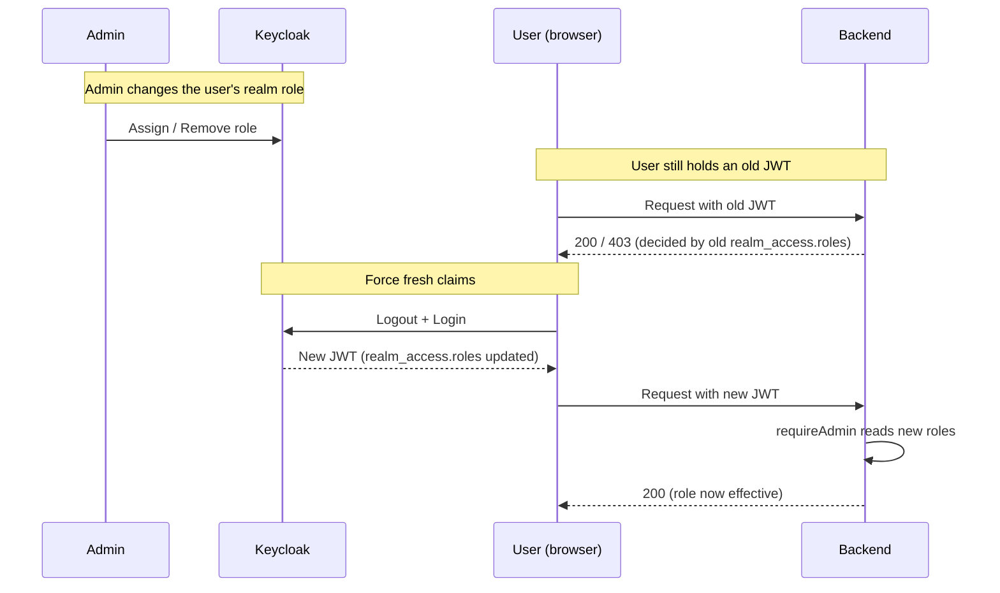
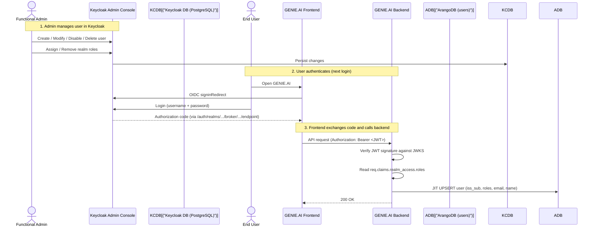

This guide explains how to manage users, roles, and groups for GENIE.AI through the Keycloak admin console. Everything identity-related — sign-up, sign-in, password reset, role assignment — happens in Keycloak; no GENIE.AI-specific UI is needed for user administration.

## Before you start

Before following this guide, make sure:

1. **GENIE.AI is deployed** with HTTPS reachable at `https://<NGINX_PUBLIC_DOMAIN>/` (see [Installation & Configuration Guide](/docs/deploy/install-guide/)).
2. **Keycloak admin console is reachable** at `https://<NGINX_PUBLIC_DOMAIN>/auth/admin`. NGINX routes `/auth/*` to Kong, which forwards to the Keycloak container (see `api-gateway-solution/nginx/conf/default.conf.template` and `api-gateway-solution/new-config/kong_config.json` for the chain).
3. **You have the master admin password** — the value of `KEYCLOAK_ADMIN_PASSWORD` in your `.env`. The realm-level admin (`genie-admin`, from `GENIE_ADMIN_USERNAME` / `GENIE_ADMIN_PASSWORD`) is a *different* account; either works for the admin console.
4. **You are operating on the `genie` realm**, not `master`. Switch via the top-left realm dropdown.

> **Note on line numbers.** Several steps below cite line numbers in `components/gov-chat-backend/middleware/keycloak-auth-middleware.js`, `components/gov-chat-backend/services/user-provisioning-service.js`, and `configs/keycloak/genie-realm.yaml`. These are correct on the current `main` branch but will drift on future refactors. Anchor on the function name or block, not the line.

## Key terms

If you are new to OIDC, these terms appear throughout the doc and the broader GENIE.AI documentation:

| Term | Meaning |
|---|---|
| **JWT (JSON Web Token)** | The opaque-looking string Keycloak issues after a successful login. The backend decodes it on every request to identify the user. |
| **JWKS (JSON Web Key Set)** | A set of public keys Keycloak publishes at `…/realms/<realm>/protocol/openid-connect/certs`. The backend uses these to verify that a JWT was actually signed by Keycloak (not forged by the client). |
| **`realm_access.roles`** | The list of realm roles embedded inside the JWT. The backend's `requireAdmin` middleware reads this array on every request — there is no role header or shared cache. |
| **JIT (Just-In-Time) provisioning** | The act of creating or updating the user record in ArangoDB on first authenticated request, using the JWT claims as the source of truth. Triggered automatically by the auth middleware. |
| **`{iss}#{sub}`** | The composite key used as the stable identifier for a user across logins. `iss` = the issuer URL of the realm; `sub` = the user ID inside that realm. Both are part of every JWT. |
| **Identity Provider (IdP) Mapper** | A Keycloak transformation applied during authentication to map an external IdP claim (e.g., Google's `groups`) to a Keycloak realm role (e.g., `admin`). See [§6 External IdP attribute → role mapping](#6-external-idp-attribute--role-mapping). |

For a deeper architectural treatment, see [Architecture Overview](/docs/architecture/architecture/).

## 1. Accessing the admin console

The Keycloak admin console is reachable at:

```
https://<NGINX_PUBLIC_DOMAIN>/auth/admin
```

Examples:

| Deployment | URL |
|---|---|
| Localhost (dev) | `https://localhost/auth/admin` |
| Custom domain | `https://gateway.example.com/auth/admin` |

`<NGINX_PUBLIC_DOMAIN>` is set in `.env` at the project root. For local dev the in-code default is `localhost`, but for production you MUST set it to the fully-qualified hostname clients reach the container on.

**Realm selection.** After logging in, switch from `master` to the `genie` realm using the top-left dropdown. All GENIE.AI users, roles, and clients live in `genie`.

## 2. User CRUD operations

The admin console path is **Users** (left menu). The four lifecycle actions below use `verify-user` as a placeholder — replace with the actual username when following along.

### 2.1 Create a user

1. **Users** → **Add user**.
2. Fill in the form:
   - **Username** — required, unique within the realm.
   - **Email** — recommended. Required if the user will log in via email or if the realm enforces email verification.
   - **First Name**, **Last Name** — recommended; the backend's `provisionUser` stores `name = name || preferred_username` in ArangoDB.
   - **Email verified** — toggle On if you have verified the address out-of-band. Off forces the user to verify via the email link (requires SMTP to be configured).
   - **Enabled** — must be On, otherwise the user is created disabled.
3. Click **Create**.
4. Open the **Credentials** tab → **Set password** → enter the password → set **Temporary = Off** (so the user does not have to change it on first login) → **Save**.
5. Open the **Role Mapping** tab → **Assign role** → select `admin` (or whichever realm role the user needs) → **Assign**.

> The realm currently exposes two realm roles: `admin` and `dataprep-service`. See [§3 Realm roles](#3-realm-roles).

### Verify it worked

- In Keycloak: **Users** → search for the username — it appears in the list.
- In ArangoDB: the user document is **not** created until first login (JIT provisioning runs on the first authenticated request, not at Keycloak user creation).
- In the Auth flow: have the user sign in once via the GENIE.AI login page. On their first API request, `keycloak-auth-middleware.js:102` calls `userProvisioningService.provisionUser(decoded)`. To confirm: query ArangoDB `users` collection for the `{iss}#{sub}` composite key from their JWT, or call `GET /api/me` with their token and confirm a 200.

### 2.2 Modify a user

1. **Users** → click the username.
2. Edit fields on the **Details**, **Attributes**, **Email**, or other tabs.
3. **Save**.

Changes propagate to GENIE.AI on the user's next login (JIT provisioning rewrites the ArangoDB document on the first request after the in-memory cache expires — TTL 60 s; see `user-provisioning-service.js:19`).

### 2.3 Disable a user

1. **Users** → click the username → **Details** tab.
2. Toggle **Enabled** to **Off** → **Save**.

Keycloak will refuse to issue new tokens to the disabled user. Existing tokens remain valid until they expire. To force an immediate logout, also revoke active sessions: **Sessions** tab → **Logout** for each active session.

### Verify it worked (disable)

- In Keycloak: **Users** → search for the username → the row shows **Enabled = Off**.
- On the next API call with the disabled user's old JWT: the backend returns `401 TOKEN_EXPIRED`, then calls `keycloakAuthService.checkUserStatusInKeycloak` (`keycloak-auth-middleware.js:132`) which sets `deleted: true` on the ArangoDB record and returns `403 FORBIDDEN — User account is deactivated`. Confirm via the ArangoDB API:
  ```bash
  curl -sk -u "${ARANGO_USER}:${ARANGO_PASSWORD}" \
    "https://${ARANGO_HOST}:8529/_db/${ARANGO_DB}/_api/cursor" \
    -H "Content-Type: application/json" \
    -d '{"query":"FOR u IN users FILTER u.email == @email RETURN { deleted: u.deleted, active: u.active }","bindVars":{"email":"<email>"}}'
  # Expected: [{deleted: true, active: false}]
  ```

### 2.4 Delete a user

1. **Users** → click the username.
2. Click the **Delete** button (top-right) → confirm.

The user is permanently removed from Keycloak. The ArangoDB record remains (not auto-purged) — the user's last JWT continues to work until expiry, at which point they can no longer authenticate. If your data-retention policy requires a hard delete, remove the ArangoDB document separately; do not just flip a flag.

> For right-to-erasure / GDPR-style deletion, also remove any user-owned data: chat history (`conversations`, `messages` collections), uploaded files (`document-repository` storage), and any analytics entries tied to the user's `iss_sub`.

### Verify it worked (deletion)

- In Keycloak: **Users** → search for the username → 0 results.
- In ArangoDB: confirm the user document is gone (or marked `deleted: true` if you use the soft-delete path).
- In the running session: any in-flight request with the old JWT still succeeds until the token's `exp` passes (default 5 minutes — `KEYCLOAK_ACCESS_TOKEN_LIFESPAN`).

## 3. Realm roles

The `genie` realm exposes two realm roles today:

| Role | Purpose | How it is used |
|---|---|---|
| `admin` | Full administrator | Grants access to admin-only API endpoints via the `requireAdmin` middleware (`keycloak-auth-middleware.js:178`). |
| `dataprep-service` | Dataprep ingestion service account | Authorizes `dataprep-service-client` to call `PATCH /api/files/:fileId/status` on the document-repository service. Not for human users. |

Realm roles are defined in `configs/keycloak/genie-realm.yaml` (the `roles.realm` block) and are applied automatically by the `keycloak-config` service at first start. There is **no** `user` realm role today — assigning a role to a "standard" user means giving them `admin`. End users without an explicit role still authenticate and use GENIE.AI normally; the absence of a role only matters for routes protected by `requireAdmin`.

### 3.1 Assign a role to a user

1. **Users** → click the username → **Role Mapping** tab.
2. **Assign role** → select `admin` (or `dataprep-service` for a service-account client) → **Assign**.

### 3.2 Remove a role

1. **Users** → click the username → **Role Mapping** tab.
2. In the **Assigned roles** list, click the **X** next to the role to remove.

### 3.3 How role changes reach GENIE.AI

Role changes do not take effect on the user's currently-issued JWT. You **must ask the user to log out and log back in** (or wait for their token to expire — default 5 minutes, see `KEYCLOAK_ACCESS_TOKEN_LIFESPAN`). After re-login:

1. Keycloak issues a fresh JWT with the updated `realm_access.roles` array.
2. The backend's auth middleware (`keycloak-auth-middleware.js:97`) verifies the signature against JWKS.
3. The backend's `requireAdmin` middleware (`keycloak-auth-middleware.js:178`) reads `req.claims.realm_access.roles` on every request — there is no in-memory role cache, so the new role is effective on the very next request.
4. `userProvisioningService.provisionUser` (`user-provisioning-service.js:65`) upserts the role list into ArangoDB on the same request (the `roles` field at `user-provisioning-service.js:164`).

In short: ask the user to log out and back in. Until they do, their existing JWT still carries the old role list, and `requireAdmin` will reject them or admit them based on that stale list.



## 4. Group management

### 4.1 Groups vs roles

| Feature | Realm roles | Groups |
|---|---|---|
| Purpose | Authorization (who can do what) | Organization (who reports to whom) |
| Consumed by GENIE.AI | Yes (JWT `realm_access.roles` checked by `requireAdmin`) | No |
| Persisted to ArangoDB | Yes (the `roles` field on the user document) | No |
| Source of `requireAdmin` check | `req.claims.realm_access.roles` on every request | n/a |

Today, **only realm roles** affect GENIE.AI authorization. Groups are useful inside Keycloak (e.g., for organizing administrators or organizing per-institution users) but do not propagate to the backend.

### 4.2 Create a group

1. **Groups** (left menu) → **Create group**.
2. Enter a name (e.g., `finance-team`) → **Create**.

### 4.3 Add users to a group

1. **Groups** → click the group → **Members** tab → **Add member**.
2. Search for and select user(s) → **Add**.

### 4.4 Future: groups → roles

If you need groups to influence GENIE.AI authorization, two paths exist:

1. Add a Keycloak **protocol mapper** to a client scope that includes group membership in the JWT (`group` claim). The backend can then read `req.claims.groups`.
2. Use **Identity Provider mappers** (§6.2) to assign a realm role when a user is in a particular group.

Neither is wired up today.

## 5. End-to-end data flow

### 5.1 Sequence (admin action → GENIE.AI effect)



For complete C4 diagrams (Context, Container, OIDC sequence, JWKS validation), see [Architecture Overview](/docs/architecture/architecture/).

### 5.2 What the backend actually does

The auth middleware does **not** propagate the user identity via HTTP headers (`X-User-Roles`, `X-User-Id`, `X-Issuer`) — there is no such header anywhere in the codebase. Identity is propagated through the verified JWT claims and the cached ArangoDB user document:

| Step | Where | File / line |
|---|---|---|
| Verify JWT signature | `keycloakAuthService.verifyToken` | `components/gov-chat-backend/services/keycloak-auth-service.js` |
| JIT-provision user in ArangoDB | `userProvisioningService.provisionUser` | `components/gov-chat-backend/services/user-provisioning-service.js:65` |
| Attach ArangoDB user to request | `req.user = user` | `components/gov-chat-backend/middleware/keycloak-auth-middleware.js:122` |
| Preserve JWT claims for downstream code | `req.claims = decoded` | `components/gov-chat-backend/middleware/keycloak-auth-middleware.js:125` |
| Admin gate | `requireAdmin` reads `req.claims.realm_access.roles` | `components/gov-chat-backend/middleware/keycloak-auth-middleware.js:178` |

Downstream route handlers read either `req.user` (ArangoDB doc) or `req.claims` (raw JWT payload) directly — no header forwarding is involved.

### 5.3 Source files for further reading

| Capability | File | Reference |
|---|---|---|
| Token verification + claim attachment | `components/gov-chat-backend/middleware/keycloak-auth-middleware.js` | `authenticate` (line 65), `requireAdmin` (line 178) |
| JWT→ArangoDB user upsert | `components/gov-chat-backend/services/user-provisioning-service.js` | `provisionUser` (line 65), role field (line 164) |
| Realm role definitions | `configs/keycloak/genie-realm.yaml` | `roles.realm` block (lines 33–45) |
| Admin user (genie-admin) bootstrap | `configs/keycloak/genie-realm.yaml` | `users` block — admin user lines 48–86, service accounts lines 89–103 |
| OIDC client wiring (genie-app, service accounts, mobile, Grafana) | `configs/keycloak/genie-realm.yaml` | `clients` block (lines 106–198) |

> Line numbers are valid for the current `main` branch; they will drift on future refactors. Anchor on the function name, not the number.

## 6. External IdP attribute → role mapping

When users sign in via an external IdP (Google, Microsoft Entra, generic OIDC, SAML), Keycloak can inspect claims from the IdP token and assign Keycloak realm roles automatically — no manual role assignment per user. See [External IdP Integration Guide](/docs/configure/external-idp-integration-guide/) for how to wire up the IdP itself; this section covers the role-mapping layer.

### 6.1 Protocol mappers vs Identity Provider mappers

Keycloak uses two different mapper types. They are often confused:

| Feature | Protocol Mapper | Identity Provider Mapper |
|---|---|---|
| Scope | Client-level (controls the JWT content issued to the client) | IdP-level (transforms incoming IdP claims during brokering) |
| Configuration location | Client → **Mappers** tab | **Identity Providers → <alias> → Mappers** tab |
| Use case | Add or rename JWT claims | Map external IdP attributes to Keycloak roles or user attributes |
| Default in this realm | `user-realm-roles` is contributed automatically by Keycloak's built-in `profile`/`email` scopes (no `clientScopes:` block is declared in `genie-realm.yaml`); it puts `realm_access.roles` into the JWT | None configured by default — this is what you add |

**Protocol mappers** determine what ends up in the JWT. **Identity Provider mappers** run during the brokering flow and can decide what realm role the federated user gets in Keycloak. For attribute-to-role mapping, you configure Identity Provider mappers.

### 6.2 Identity Provider Mapper types for role assignment

Three mapper types are relevant for role assignment:

| Mapper Type | Purpose | Key config fields |
|---|---|---|
| `hardcoded-role-idp-mapper` | Assigns a fixed realm role to **every** user that signs in via this IdP (baseline) | `role` |
| `attribute-to-role-idp-mapper` | Assigns a realm role when an IdP claim **contains** a specific value (substring match) | `attribute`, `role`, `claimValue` |
| `oidc-user-attribute-idp-mapper` | Imports an IdP claim into a Keycloak user attribute (no role assignment) | `claim`, `userAttribute` |

> `attribute-to-role-idp-mapper` does a **contains** check, not an exact match. If the IdP returns `groups = ["staff", "genie-admin", "finance"]`, a mapper with `attribute: groups`, `claimValue: "genie-admin"` matches.

### 6.3 Configuring an Identity Provider Mapper (admin console)

Map a Google Workspace `groups` claim to the `admin` realm role:

1. **Identity Providers** (left menu) → click the IdP (e.g., `google`).
2. Open the **Mappers** tab.
3. Click **Add mapper**.
4. Fill in:
   - **Name**: `google-groups-to-admin` (unique within this IdP)
   - **Identity Provider Alias**: `google` (pre-filled)
   - **Mapper Type**: `Attribute to Role`
   - **Attribute name**: `groups`
   - **Role**: `admin`
   - **Claim value**: `genie-admin`
5. **Save**.

After this, any user whose Google `groups` claim contains `genie-admin` receives the `admin` realm role on their next login via Google.

To assign a baseline role to *every* user of an IdP (so they have at least one role and `requireAdmin`-protected admin endpoints stay locked down to the right people), add a separate `hardcoded-role-idp-mapper`:

- **Mapper Type**: `Hardcoded Role`
- **Name**: `google-default-role`
- **Role**: `admin` (or whatever baseline role the realm exposes — today, only `admin` and `dataprep-service`)

> **Important:** Externally-authenticated users have **no** realm role by default — Keycloak does not auto-grant any baseline role on first IdP login. If you need externally-authenticated users to access admin endpoints, you must add a `hardcoded-role-idp-mapper` or an `attribute-to-role-idp-mapper`. Otherwise `requireAdmin` will reject them with `403 FORBIDDEN` on every admin route.

### 6.4 Mapper evaluation order

Mappers are evaluated in the order they appear in the IdP's Mappers list. List **baseline (hardcoded) mappers first**, then **conditional (attribute-to-role) mappers**; reorder with the arrow buttons. This ensures every user has the baseline role before conditional overrides apply.

### Verify it worked (mapper order)

- In the admin console: **Identity Providers → <alias> → Mappers** — confirm the hardcoded mapper appears above the attribute-to-role mappers.
- Use **Identity Providers → <alias> → Mappers → Identity preview** to simulate an IdP login with a test claims payload. The **Generated user info** section shows the realm roles the user would receive after brokering.
- Or, after the user signs in via the IdP, query the Admin API for their effective realm roles (replace `<uid>` with the value returned by `/auth/admin/realms/genie/users?username=<user>`):
  ```bash
  curl -sk "https://${NGINX_PUBLIC_DOMAIN}/auth/admin/realms/genie/users/<uid>/role-mappings/realm" \
    -H "Authorization: Bearer ${ADMIN_TOKEN}"
  # Expected: ["admin"] (or whatever role(s) your mappers grant)
  ```

### 6.5 Adding a new realm role for attribute mapping

If your attribute mapping requires a role that does not yet exist (e.g., you want `analyst`), add it to `configs/keycloak/genie-realm.yaml`:

```yaml
roles:
  realm:
    - name: admin
      description: Administrator role with full access
      composite: true
      composites:
        client:
          realm-management:
            - manage-users
            - query-users
            - view-identity-providers
    - name: dataprep-service
      description: Service account role for Dataprep ingestion pipeline
    # New role for attribute mapping (example)
    - name: analyst
      description: Read-only analyst role
```

Then redeploy the realm configuration:

```bash
docker service update --force genieai_keycloak-config   # Swarm
# or, for Compose:
docker compose up -d --force-recreate keycloak-config
```

Wait for the healthcheck (`test -f /tmp/config-done`) to pass, then return to **Realm roles** in the admin console to confirm the new role is listed.

### Verify it worked (new realm role)

```bash
# Confirm the healthcheck marker exists inside the keycloak-config container
docker exec $(docker ps --format '{{.Names}}' | grep keycloak-config | head -1) \
  ls /tmp/config-done
# Expected: /tmp/config-done

# Or poll the keycloak-config service in Swarm mode until healthy
docker service ps genieai_keycloak-config --no-trunc --filter "desired-state=running"
# Expected: Current State = Running, no restarts in the last 5 minutes
```

After the marker file appears, refresh **Realm roles** in the admin console — the new role (`analyst` in the example) is listed under `genie`.

### 6.6 End-to-end IdP → GENIE.AI flow

```
1. External IdP token contains "groups": ["genie-admin"]
   └── Keycloak Identity Provider Mapper (attribute-to-role-idp-mapper)
       └── Keycloak assigns the "admin" realm role to the local user

2. Keycloak issues its own JWT
   └── Protocol Mapper (user-realm-roles, contributed by the built-in profile scope)
       └── JWT includes realm_access.roles = ["admin"]

3. GENIE.AI backend processes the JWT
   └── keycloak-auth-middleware.js (authenticate): verify, attach req.claims
   └── keycloak-auth-middleware.js (requireAdmin): read req.claims.realm_access.roles
   └── user-provisioning-service.js: persist roles to ArangoDB
```

No GENIE.AI code change is needed to support mapped roles. The existing middleware is source-agnostic — it treats every role the same way regardless of whether it was assigned manually or via an IdP mapper.

### 6.7 Automated IdP configuration via `genie-realm.yaml`

You can also declare IdPs and their mappers in YAML for repeatable deployments. Add to `configs/keycloak/genie-realm.yaml`:

```yaml
identityProviders:
  - alias: google
    providerId: google
    enabled: true
    config:
      clientId: $(env:KEYCLOAK_GOOGLE_CLIENT_ID)
      clientSecret: $(env:KEYCLOAK_GOOGLE_CLIENT_SECRET)
    mappers:
      - name: google-email
        identityProviderAlias: google
        identityProviderMapper: oidc-user-attribute-idp-mapper
        config:
          claim: email
          userAttribute: email
      - name: google-default-role
        identityProviderAlias: google
        identityProviderMapper: hardcoded-role-idp-mapper
        config:
          role: admin
      - name: google-groups-to-admin
        identityProviderAlias: google
        identityProviderMapper: attribute-to-role-idp-mapper
        config:
          attribute: groups
          role: admin
          claimValue: "genie-admin"
```

Then add the env vars to `.env` (they are commented placeholders in **Section 9B "External Identity Providers (Optional)"** — search for `KEYCLOAK_GOOGLE_CLIENT_ID`) and to the `keycloak-config` service environment block in `docker-compose.yaml` (the env block starts after line 1577). The `keycloak-config` service already runs with `IMPORT_VARSUBSTITUTION_ENABLED=true`, so the `$(env:…)` references resolve.

> **Tested path:** the admin-console workflow above has been verified end-to-end. The full YAML-managed IdP path (declaring `identityProviders:` in `genie-realm.yaml`) is supported by Keycloak and `keycloak-config-cli`, but no GENIE.AI deployment currently uses it for a federated IdP — prefer the admin-console path unless you need configuration-as-code.

### 6.8 Mapper config field reference

`attribute-to-role-idp-mapper`:

| Field | Required | Description |
|---|---|---|
| `name` | Yes | Unique mapper name within this IdP |
| `identityProviderAlias` | Yes | Must match the parent IdP alias |
| `identityProviderMapper` | Yes | `attribute-to-role-idp-mapper` |
| `config.attribute` | Yes | Claim name from the IdP token (`groups`, `department`, etc.) |
| `config.role` | Yes | Keycloak realm role to assign |
| `config.claimValue` | Yes | Value to match (contains check) |

`hardcoded-role-idp-mapper`:

| Field | Required | Description |
|---|---|---|
| `name` | Yes | Unique mapper name |
| `identityProviderAlias` | Yes | Must match the parent IdP alias |
| `identityProviderMapper` | Yes | `hardcoded-role-idp-mapper` |
| `config.role` | Yes | Realm role to grant to every user from this IdP |

## 7. Security considerations

### 7.1 Passwords

- `KEYCLOAK_ADMIN_PASSWORD` (master realm admin) and `GENIE_ADMIN_PASSWORD` (genie realm admin) must be set in `.env`. `.env` is gitignored — never commit it.
- Use 16+ characters in production. The default password policy (in `docker-compose.yaml`, `keycloak-config` service, `KEYCLOAK_PASSWORD_POLICY` env) is `length(12) and upperCase(1) and lowerCase(1) and digits(1) and specialChars(1)`. You can relax to `length(8)` via `.env` but this is not recommended.
- Per-user passwords set via the admin console also need to satisfy the active policy.

### 7.2 Token and session timeouts

The realm defaults are configured via `genie-realm.yaml` and applied by `keycloak-config`:

| Setting | Env var | Default | Notes |
|---|---|---|---|
| Access token lifespan (seconds) | `KEYCLOAK_ACCESS_TOKEN_LIFESPAN` | `300` (5 min) | JWT expiry |
| SSO Session Max | (admin console: **Realm Settings → Sessions**) | 10 hours (Keycloak default) | Maximum session duration |
| SSO Session Idle | (admin console) | 30 minutes (Keycloak default) | Idle expiration |

Short access token lifetimes reduce the window for token theft. Long SSO sessions keep users signed in. Tune in **Realm Settings → Sessions** (SSO) and **Realm Settings → Tokens** (access token) — the env var only applies on next keycloak-config deploy.

### 7.3 Audit trail

Keycloak does not retain audit events by default. To enable:

1. **Realm settings** (left menu) → **Events** tab.
2. **Saved Events** section → set **Save Events = On**.
3. Optional: enable specific event types (admin events, logins, token refresh) below.

Events are written to the Keycloak server log. In Docker Swarm:

```bash
docker service logs genieai_keycloak --tail 100 | grep -i event
```

For persistent, queryable audit storage, consider the Keycloak JDBC event listener (stores events in the shared PostgreSQL) or a sidecar Logstash pipeline.

### 7.4 Network exposure

- The admin console is exposed via NGINX at `/auth/admin`. In production, restrict by source IP at the NGINX layer (`api-gateway-solution/nginx/conf/default.conf.template`).
- Back-channel traffic from the backend to Keycloak stays inside the `genieai_network` overlay — no internet exposure.
- For external IdPs, the Keycloak container makes outbound HTTPS to the IdP directly. If your network uses an HTTP proxy, set `HTTP_PROXY` and `HTTPS_PROXY` on the `keycloak` service in `docker-compose.yaml`.

### 7.5 Admin API access

- The Keycloak Admin REST API supports every operation in this guide. Always use HTTPS.
- Use `genie-proxy-client` (a confidential service account with restricted
  `manage-users` / `view-users` / `query-users` / `view-realm` permissions
  assigned via `serviceAccountClientId` — see `genie-realm.yaml` lines 89–97)
  for automated operations. The backend already uses it via
  `keycloak-proxy-service`.
- Never use the master admin (`admin-cli`) for routine automation; reserve it for realm-bootstrap operations only.

## 8. Verification

### 8.1 Verify a user can sign in

```bash
# Open the URL in any browser on your workstation:
#   https://${NGINX_PUBLIC_DOMAIN}/auth/realms/genie/account
# → The username + password fields accept the credentials you set in §2.1
# → After login, Keycloak shows the Account Console with the user's profile
```

### 8.2 Verify role reach the backend

Use the Admin REST API with a master or `genie-proxy-client` admin token:

```bash
ADMIN_TOKEN=$(curl -sk -X POST "https://${NGINX_PUBLIC_DOMAIN}/auth/realms/master/protocol/openid-connect/token" \
  -d "client_id=admin-cli" \
  -d "username=admin" \
  -d "password=${KEYCLOAK_ADMIN_PASSWORD}" \
  -d "grant_type=password" \
  | python3 -c "import sys,json; print(json.load(sys.stdin)['access_token'])")

# Confirm the realm roles the user has
curl -sk "https://${NGINX_PUBLIC_DOMAIN}/auth/admin/realms/genie/users?username=verify-user" \
  -H "Authorization: Bearer ${ADMIN_TOKEN}" \
  | python3 -c "
import sys, json
users = json.load(sys.stdin)
if not users:
    print('user not found'); sys.exit(1)
uid = users[0]['id']
import urllib.request
req = urllib.request.Request(
  f'https://${NGINX_PUBLIC_DOMAIN}/auth/admin/realms/genie/users/{uid}/role-mappings/realm',
  headers={'Authorization': f'Bearer ${ADMIN_TOKEN}'})
roles = json.load(urllib.request.urlopen(req))
print('realm roles:', [r['name'] for r in roles])
"
# Expected: realm roles: ['admin']
```

> **Note:** The `genie-app` client has `directAccessGrantsEnabled: false` in `genie-realm.yaml` (line 121). ROPC (`grant_type=password`) against `genie-app` returns `unauthorized_client`. To test the user-facing login, use the browser authorization-code flow. The admin API in the script above is unaffected because it targets the `admin-cli` client (which has ROPC enabled by default in `master`).

### 8.3 Verify provisioning wrote the role to ArangoDB

The fastest check is to call `GET /api/me` with the user's JWT and inspect the response (the BFF returns the ArangoDB user document, including `roles`):

```bash
# Obtain a token via the browser flow (or use a temporary ROPC-enabled test client — see §8.4)
USER_TOKEN="<paste-token-from-browser>"

curl -sk "https://${NGINX_PUBLIC_DOMAIN}/api/me" \
  -H "Authorization: Bearer ${USER_TOKEN}"
# Expected: JSON object including "roles": ["admin"]
```

Or query ArangoDB directly:

```bash
ARANGO_URL="https://${ARANGO_HOST}:8529"
curl -sk -u "${ARANGO_USER}:${ARANGO_PASSWORD}" \
  "${ARANGO_URL}/_db/${ARANGO_DB}/_api/cursor" \
  -H "Content-Type: application/json" \
  -d '{"query":"FOR u IN users FILTER u.email == @email RETURN { iss_sub: u.iss_sub, roles: u.roles }","bindVars":{"email":"verify-user@genie.local"}}'
# Expected: roles contains ["admin"]
```

### 8.4 Obtaining a token for ad-hoc verification (test only)

If you need a token outside the browser (for curl tests), temporarily enable ROPC on `genie-app`:

```bash
CLIENT_ID=$(curl -sk "https://${NGINX_PUBLIC_DOMAIN}/auth/admin/realms/genie/clients?clientId=genie-app" \
  -H "Authorization: Bearer ${ADMIN_TOKEN}" \
  | python3 -c "import sys,json; print(json.load(sys.stdin)[0]['id'])")

# Enable ROPC
curl -sk -X PUT "https://${NGINX_PUBLIC_DOMAIN}/auth/admin/realms/genie/clients/${CLIENT_ID}" \
  -H "Authorization: Bearer ${ADMIN_TOKEN}" -H "Content-Type: application/json" \
  -d '{"directAccessGrantsEnabled": true}'

# Get the user token
USER_TOKEN=$(curl -sk -X POST "https://${NGINX_PUBLIC_DOMAIN}/auth/realms/genie/protocol/openid-connect/token" \
  --data-urlencode "grant_type=password" \
  --data-urlencode "client_id=genie-app" \
  --data-urlencode "username=verify-user" \
  --data-urlencode "password=<their-password>" \
  | python3 -c "import sys,json; print(json.load(sys.stdin)['access_token'])")

# ... use USER_TOKEN ...

# ! REVERT ROPC IMMEDIATELY !
curl -sk -X PUT "https://${NGINX_PUBLIC_DOMAIN}/auth/admin/realms/genie/clients/${CLIENT_ID}" \
  -H "Authorization: Bearer ${ADMIN_TOKEN}" -H "Content-Type: application/json" \
  -d '{"directAccessGrantsEnabled": false}'
```

> **Security warning:** Forgetting to revert `directAccessGrantsEnabled` leaves a publicly exploitable password-grant endpoint open. Always revert immediately after testing.

## 9. Failure modes and troubleshooting

| Symptom | Likely cause | Fix |
|---|---|---|
| Admin console returns 404 | NGINX is not routing `/auth` to Keycloak | Check `api-gateway-solution/nginx/conf/default.conf.template` for `location /auth/ { ... proxy_pass http://$kong_addr; }` (nginx → Kong → Keycloak chain); reload NGINX. |
| `404 Not Found` on `https://<host>/auth/admin` | Keycloak container not healthy | `docker service logs genieai_keycloak --tail 50`; check `docker service ps genieai_keycloak`. |
| User signs in but gets 403 on an admin endpoint | Role missing in JWT | Re-login (forces a fresh JWT); check **Role Mapping** tab in admin console; confirm `requireAdmin` middleware (`keycloak-auth-middleware.js:178`). |
| Role change has no effect | User still on old JWT | Ask user to log out and back in, or wait `KEYCLOAK_ACCESS_TOKEN_LIFESPAN` seconds (default 300). |
| User disabled but still using GENIE.AI | Existing JWT still valid | Revoke active sessions: **Users → Sessions → Logout**, or wait for token expiry. |
| `genie-realm.yaml` import fails on keycloak-config restart | `configs/keycloak/genie-realm.yaml` has a syntax error | `docker service logs genieai_keycloak-config --tail 50`; the error message indicates which user/role/client. |
| Cannot delete a client | Client has an active service account tied to other realm state | Resolve the dependency first (e.g., unassign client roles referencing this client), then retry. Client lifecycle is out of scope for this user-admin guide; see [External IdP Integration Guide](/docs/configure/external-idp-integration-guide/) for IdP-client wiring and the [Keycloak clients docs](https://www.keycloak.org/docs/latest/server_admin/index.html#assembly-managing-clients_server_admin_features) for full client-management reference. |
| IdP-mapped role does not appear | Mapper config: wrong `attribute`, wrong `claimValue`, or wrong `role` | Verify the IdP token actually contains the claim (use **Identity Providers → <alias> → Mappers → Identity preview**); confirm the mapper name matches an existing realm role. |
| Federation sign-in returns `invalid_grant: Account is not fully set up` | Federated user lacks `firstName`/`lastName` or `emailVerified` | Configure a hardcoded-attribute mapper on the IdP, or complete the profile manually. |

## Next steps

- **Federate authentication** with Google, Microsoft, or SAML — see [External IdP Integration Guide](/docs/configure/external-idp-integration-guide/).
- **Map IdP attributes to roles** automatically — see [§6 External IdP attribute → role mapping](#6-external-idp-attribute--role-mapping) above.
- **Understand the architecture** behind authentication — see [Architecture Overview](/docs/architecture/architecture/).
- **Deploy a mobile client** with its own OIDC client — see [Mobile Deployment Guide](/docs/mobile/mobile-deployment-guide/).
- **Back up Keycloak** (PostgreSQL state, realm config, keys) — see [Operations → Backup & Restore](/docs/operate/backup-restore/).
- **Rotate secrets** (master password, proxy client secret, realm signing keys) — see [Operations → Secret Rotation](/docs/operate/security-hardening/).
