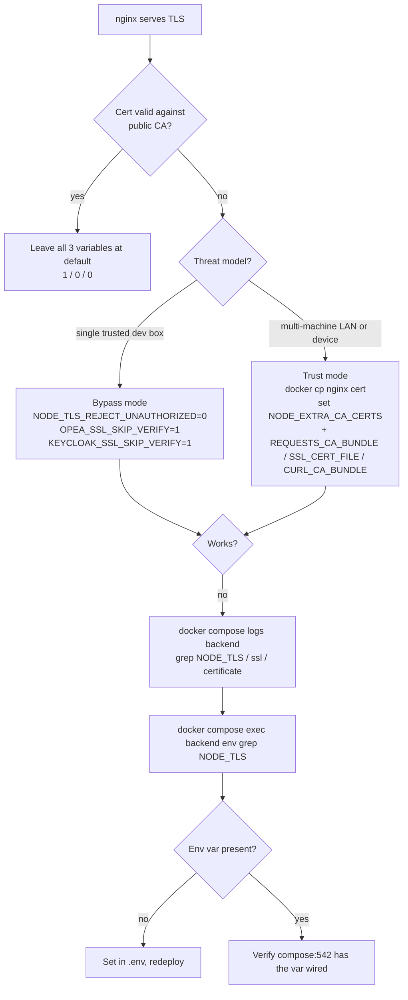

When you point a local GENIE.AI stack at a hostname other than `localhost`
(El Salvador-style mobile-test topology, a private-IP GPU node, a colleague's
laptop over LAN), nginx serves a **self-signed** TLS certificate. Browsers,
`curl`, Node.js and Python all reject the connection on certificate-validation
grounds. This page lists every variable GENIE.AI exposes to either bypass or
trust that certificate in dev, names the service each variable reaches, and
spells out the security cost of bypassing.

For production-grade hardening (Let's Encrypt, public CA, internal CA with
proper trust store), do **not** rely on the bypass variables — mount the real
chain and leave verification on.

## Prerequisites

- A running GENIE.AI stack (`docker compose up -d` or `docker stack deploy`)
- `docker compose` v2.x (the V1 hyphenated form does not support `docker compose ps -q`)
- `openssl` on the host (for the cert-extraction path under §[Trust](#trust-vs-bypass))
- The hostname you serve NGINX on reachable from wherever the dev client runs
  (e.g. `genie.local` resolves via `/etc/hosts` or DNS)
- Read access to `docker-compose.yaml`, `env`, and the OTel/SSL wiring
  (`configs/ssl/genie_ssl_patch.py`) — every command below references them

## Decision flow



## When you need this

The bypass is the right call in these scenarios:

- You ran `docker compose up -d` and nginx emitted a self-signed cert on
  first boot (`api-gateway-solution/nginx/entrypoint.sh:53-58` — the
  `generate_self_signed_cert()` function declared at line 34 fires when
  `./secrets/ssl/server.crt` is absent, see also the docker-compose volume
  mount at `docker-compose.yaml:313` mapping `./secrets/ssl` to
  `/etc/nginx/ssl`).
- The browser blocks the SPA on `NET::ERR_CERT_AUTHORITY_INVALID` and the
  backend logs `unable to verify the first certificate` for every Keycloak
  JWKS fetch.
- You set `NGINX_PUBLIC_DOMAIN` to a private IP (e.g. `10.0.0.102`) and
  services can't validate the cert against a public CA — there is no public
  CA to validate against.
- You run the mobile app against a phone-reachable hostname (e.g.
  `govchat.example.local`) and the device doesn't trust the cert.

If you have a real cert from Let's Encrypt or an internal CA: skip the
bypass, **mount the CA chain into the container trust store** (or set the
`*_CA_BUNDLE` variable — see §[Trust vs bypass](#trust-vs-bypass)) and
leave the bypass variables off.

## Env vars to set

| Name | Default | Prod value | Dev value | Applies to |
|---|---|---|---|---|
| `NODE_TLS_REJECT_UNAUTHORIZED` | `1` (strict) | `1` | `0` | Node.js services — `gov-chat-backend` (HTTPS fetches to NGINX for OIDC discovery, JWKS, Keycloak token introspection), `document-repository` (same). Driven by `superagent` in `components/gov-chat-backend/node_modules/superagent/lib/node/index.js:749`. |
| `OPEA_SSL_SKIP_VERIFY` | `0` (verify) | `0` | `1` only when remote GPU uses self-signed | All OPEA Python services — `embedding`, `reranker`, `textgen`, `chatqna`, `retriever`, `dataprep`. Wired at runtime via `configs/ssl/genie_ssl_patch.py` (no volume mount needed). |
| `KEYCLOAK_SSL_SKIP_VERIFY` | `0` (verify) | `0` | `1` only when Keycloak cert is self-signed | Dataprep's Keycloak service-account token fetch (aiohttp in `genie-ai-overlay/dataprep/keycloak_service_account.py`). Independent of `OPEA_SSL_SKIP_VERIFY`. |
| `NODE_EXTRA_CA_CERTS` | unset | path to CA chain | path to `nginx.crt` if you choose to trust it | Node.js services — file-based CA trust, used **instead of** `NODE_TLS_REJECT_UNAUTHORIZED=0`. |
| `REQUESTS_CA_BUNDLE` | unset | path to CA chain | path to `nginx.crt` if you choose to trust it | Python services — same idea, used **instead of** `OPEA_SSL_SKIP_VERIFY=1` / `KEYCLOAK_SSL_SKIP_VERIFY=1`. |
| `SSL_CERT_FILE` | system default | path to CA chain | path to `nginx.crt` | Python services (`ssl` stdlib, used by `aiohttp`/`httpx`/`requests` indirectly). |
| `CURL_CA_BUNDLE` | system default | path to CA chain | path to `nginx.crt` | `curl` invocations from healthchecks, Ansible, ad-hoc shell. |

The first three are GENIE.AI-managed toggles; the last four are the
language-/tool-level trust knobs you can reach for when you'd rather
trust the cert than bypass verification (see §[Trust vs
bypass](#trust-vs-bypass)).

## `docker-compose.yaml` wiring

The compose file wires the three GENIE.AI variables explicitly:

- **Backend** (`docker-compose.yaml:542`):
  `- NODE_TLS_REJECT_UNAUTHORIZED=${NODE_TLS_REJECT_UNAUTHORIZED:-1}`
  (and `:556` also forwards `OPEA_SSL_SKIP_VERIFY` when the backend's
  translation endpoint points at a remote GPU node)
- **Document repository** (`docker-compose.yaml:626`):
  `- NODE_TLS_REJECT_UNAUTHORIZED=${NODE_TLS_REJECT_UNAUTHORIZED:-1}`
- **OPEA services** — `OPEA_SSL_SKIP_VERIFY=${OPEA_SSL_SKIP_VERIFY:-0}`:
  - textgen (`docker-compose.yaml:800`)
  - embedding (`:998`)
  - reranker (`:1076`)
  - dataprep-arango-service (`:1173`)
  - retriever-arango-service (`:1269`)
  - chatqna-xeon-backend-server (`:1375`)
- **Dataprep Keycloak fetch** (`docker-compose.yaml:1180`):
  `KEYCLOAK_SSL_SKIP_VERIFY: ${KEYCLOAK_SSL_SKIP_VERIFY:-0}`

Setting any of these in `.env` is enough — the compose template defaults
to `1` / `0` so an unset `.env` keeps production-safe verification on.

OPEA Python services consume `OPEA_SSL_SKIP_VERIFY` via the runtime
patch `configs/ssl/genie_ssl_patch.py`, which rewrites SSL contexts in
the vendored `comps` library at container start. No volume mounts, no
code changes — flip the env var and rebuild (or redeploy the image).

The mobile-test topology doc describes the full phone↔server trust
chain including the WireGuard tunnel, self-signed cert and Keycloak
`/auth` prefix — useful if you're debugging a real device, not a
browser.

## Trust vs bypass

The variables above give you two strategies; pick by threat model.

**Bypass (cheap, dev-only):** set `NODE_TLS_REJECT_UNAUTHORIZED=0`,
`OPEA_SSL_SKIP_VERIFY=1`, `KEYCLOAK_SSL_SKIP_VERIFY=1` as needed. Every
TLS handshake succeeds regardless of who's on the other end — including
an active attacker on the LAN who presents their own cert. This is fine
when the entire network path is one trusted dev box; it is **not** fine
across the public internet or any multi-hop path you don't control end
to end.

**Trust (still dev, but safer):** copy the NGINX self-signed cert out of
the running container, then point the language/tool trust knobs at it:

```bash
# One-time: extract the cert from the nginx container
docker cp $(docker compose ps -q nginx):/etc/nginx/certs/server.crt \
  ./secrets/dev-nginx.crt

# .env (Node-side)
NODE_EXTRA_CA_CERTS=/run/secrets/dev-nginx.crt

# .env (Python-side, dataprep / OPEA services)
REQUESTS_CA_BUNDLE=/run/secrets/dev-nginx.crt
SSL_CERT_FILE=/run/secrets/dev-nginx.crt

# .env (shell / curl / Ansible)
CURL_CA_BUNDLE=/run/secrets/dev-nginx.crt
```

This rejects any cert that is **not** the exact one nginx is serving
— a real attacker substituting their own cert fails the handshake
instead of being silently accepted. Use this for any setup where
multiple machines talk to the dev stack (mobile devices, a colleague's
laptop, a CI runner that hits the stack over the network).

The same pattern applies to a remote GPU node with a self-signed
cert: copy `gpu-node.crt` from the node, set `NODE_EXTRA_CA_CERTS`
(backend, document-repository) and `REQUESTS_CA_BUNDLE` (dataprep,
OPEA wrappers) — documented in `env` Section 14.

## Per-service override

If you only need to bypass one specific call (e.g. a one-off debug
script, a healthcheck that hits the self-signed NGINX directly):

```bash
# curl — equivalent to NODE_TLS_REJECT_UNAUTHORIZED=0 for one call
curl -k https://genie.local/auth/realms/genie/.well-known/openid-configuration

# Node.js (no global env var)
node -e 'process.env.NODE_TLS_REJECT_UNAUTHORIZED="0"; fetch("https://genie.local/auth/realms/genie").then(r=>console.log(r.status))'

# Python (no global env var)
SSL_CERT_FILE=/dev/null REQUESTS_CA_BUNDLE="" python3 -c \
  'import httpx; print(httpx.get("https://genie.local/auth/realms/genie", verify=False).status_code)'
```

The same approach works for backend unit tests: prepend
`NODE_TLS_REJECT_UNAUTHORIZED=0` to the `npm test` invocation when the
test fixture stack uses a self-signed cert.

## Security implications

- **Bypass variables disable MITM protection.** Any attacker on the
  network path between a service and NGINX can present their own cert
  and silently intercept tokens, including Keycloak access tokens and
  refresh tokens. This is acceptable on a single dev box; it is not
  acceptable in shared or semi-trusted networks.
- **Cert trust variables still validate.** Setting
  `NODE_EXTRA_CA_CERTS` to the dev cert makes the connection trust the
  one specific cert nginx serves — same attack model as a public CA,
  just with a smaller trust store.
- **Production must never set these to `0`.** The defaults (`1` /
  `0`) are strict on purpose. The `env` file is explicit about the intent:
  `env:517` (within Section 9: Keycloak, lines `514-518`) reads "Set to 0
  for local dev with self-signed NGINX certs", and `env:871-872` (within
  Section 14: Remote GPU Node) gives the same `NODE_TLS_REJECT_UNAUTHORIZED=0`
  option for the GPU node's self-signed cert. Verify certs in production.
- **OPEA patch loads at every Python startup.** `configs/ssl/genie_ssl_patch.py`
  is wired via the `zz_genie_startup.pth` site-init hook installed by
  `build-patches/install_site_startup.sh`, so the monkey-patch only takes
  effect when `OPEA_SSL_SKIP_VERIFY=1` is set at container start. Flipping
  the variable back to `0` and recreating the container
  (`docker compose up -d <service>`) is enough to revert — the patch re-reads
  the env var at the next Python site init; no image rebuild needed. The
  `.pth` hook itself is permanent per image (build-time), but the bypass
  behavior is not.

## Verification

```bash
# 1. curl reaches NGINX (bypass flag accepted)
curl -kI https://genie.local/ | head -1
# Expect: HTTP/1.1 200 OK (or 302 → Keycloak)

# 2. backend TLS bypass is on — fetch a protected endpoint via NGINX
curl -k -o /dev/null -w "%{http_code}\n" \
  https://genie.local/auth/realms/genie/protocol/openid-connect/certs
# Expect: 200

# 3. browser — self-signed cert shows the warning page
# Open https://genie.local/ in Chrome → "Your connection is not private"
# (NET::ERR_CERT_AUTHORITY_INVALID). Click "Advanced" → "Proceed" to
# bypass for the session.

# 4. backend logs show the OIDC discovery fetch succeeded (one per startup)
docker compose logs backend | grep -i "openid-configuration\|jwks\|well-known"
# Expect: 200 responses, no "unable to verify" / "UNABLE_TO_VERIFY_LEAF_SIGNATURE"

# 5. OPEA services — dataprep logs no SSL errors when fetching Keycloak token
docker compose logs dataprep-arango-service | grep -iE "ssl|certificate|verify"
# Expect: nothing SSL-related on a clean startup
```

If the backend logs show
`Error: unable to verify the first certificate` or
`UNABLE_TO_VERIFY_LEAF_SIGNATURE`, the env var didn't reach the container
— re-check `docker compose exec backend env | grep NODE_TLS` and the
`NODE_TLS_REJECT_UNAUTHORIZED` line in `.env`.

## Common mistakes

- **Setting only `NODE_TLS_REJECT_UNAUTHORIZED=0` and forgetting the
  OPEA side.** Dataprep still fails SSL to the GPU node if the GPU
  uses a self-signed cert; flip `OPEA_SSL_SKIP_VERIFY=1` too.
- **`source .env` with special chars in `KEYCLOAK_ADMIN_PASSWORD`** —
  breaks shell expansion; extract with `grep | cut` instead. (Same
  advice as the Server Testing rules — see Related.)
- **Trusting the cert on the wrong path.** `NODE_EXTRA_CA_CERTS` must
  point at the certificate nginx is **serving**, not the one your
  browser happens to trust (or vice versa). Verify with
  `openssl s_client -connect genie.local:443 -showcerts` and compare.
- **Leaving the bypass on after promoting to staging.** A common
  pre-release oversight — `.env` is shared across dev/staging unless
  you keep it under per-env vault.

## Troubleshooting

| Symptom | Likely cause | Fix |
|---|---|---|
| Backend log: `Error: unable to verify the first certificate` on every JWKS fetch | `NODE_TLS_REJECT_UNAUTHORIZED` not reaching the backend container | `docker compose exec backend env \| grep NODE_TLS` — if missing, set it in `.env` and `docker compose up -d backend` |
| Dataprep log: `SSL: CERTIFICATE_VERIFY_FAILED` to GPU node | `OPEA_SSL_SKIP_VERIFY` not set, GPU node uses self-signed | Add `OPEA_SSL_SKIP_VERIFY=1` to `.env`, redeploy (`docker compose up -d embedding reranker textgen chatqna retriever dataprep-arango-service`) |
| Dataprep log: `SSL: CERTIFICATE_VERIFY_FAILED` to Keycloak specifically | `KEYCLOAK_SSL_SKIP_VERIFY` not set | Add `KEYCLOAK_SSL_SKIP_VERIFY=1` to `.env`, redeploy dataprep-arango-service only |
| `curl: (60) SSL certificate problem: unable to get local issuer certificate` from host shell | `CURL_CA_BUNDLE` not pointed at the dev cert | Set `CURL_CA_BUNDLE=./secrets/dev-nginx.crt` (or pass `-k` for one-off) |
| Bypass variable set in `.env` but service still validates | Compose template overrode it; check `${NODE_TLS_REJECT_UNAUTHORIZED:-1}` (default `1`) at `docker-compose.yaml:542` | Confirm `.env` line has no surrounding quotes; redeploy |
| `OPEA_SSL_SKIP_VERIFY=1` flipped back to `0` but service still skips | The patch only re-evaluates the env var at Python startup (the `.pth` site-init hook runs once per container start). The current container's `ssl.SSLContext.wrap_socket` is still monkey-patched. | Recreate the container — `docker compose up -d <service>`. The new container's Python process re-imports `genie_ssl_patch.py`, which checks the env var (now `0`) and applies no bypass. No rebuild needed. |
| Browser still warns even with `NODE_TLS_REJECT_UNAUTHORIZED=0` | Browser-side trust store is independent of server-side bypass | Either accept the warning via "Advanced → Proceed", or use Trust mode (`NODE_EXTRA_CA_CERTS` etc.) — bypass does **not** install the cert into the browser's trust store |

## Related

- [CORS, CSP & Public Domain](/docs/configure/cors-csp/) — `NGINX_PUBLIC_DOMAIN` is the hostname clients (and self-signed certs) hang off.
- [Reference → Environment variables](/docs/reference/env-vars/) — canonical list with defaults.
- [Deploy → Install guide](/docs/deploy/install-guide/) — first-deploy wiring walkthrough, includes the `NODE_TLS_REJECT_UNAUTHORIZED` row in the variable table.
- [Deploy → Docker Swarm setup](/docs/deploy/docker-swarm-setup/) — self-signed-cert quick-reference matrix (`NODE_TLS_REJECT_UNAUTHORIZED` × `OPEA_SSL_SKIP_VERIFY` × `KEYCLOAK_SSL_SKIP_VERIFY`).
- Operations → Server Testing — ROPC token extraction, `source .env` pitfalls, Docker exec patterns that come up while debugging TLS (see the `SERVER-TESTING.md` dev rule under `.claude/rules/`).
- [Mobile Deployment Guide](/docs/mobile/mobile-deployment-guide/) — phone↔server trust chain (the "El Salvador" topology): WireGuard tunnel, private IP, self-signed cert, Keycloak `/auth` prefix.