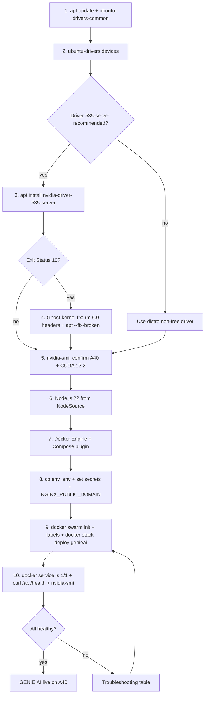

This walkthrough installs the server-grade NVIDIA driver on Ubuntu 22.04 for
an NVIDIA A40 GPU and resolves the common DKMS build failures caused by
manually installed kernel headers. It is a pre-requisite for GENIE.AI on A40
hardware — once the driver is working, follow
[Docker Swarm Setup → Single-Node Swarm](/docs/deploy/docker-swarm-setup/#step-13-single-node-swarm)
to deploy GENIE.AI.

## Goal

Install the NVIDIA proprietary driver on Ubuntu 22.04 for an A40 GPU and
bring up a single-node GENIE.AI Swarm stack on top of it, in ~30–60 minutes.

## Prerequisites

- **Ubuntu 22.04** (other Debian-based distros work but may need adjustments)
- **A40 GPU** physically installed and visible to the host (verify with
  `lspci | grep -i nvidia`)
- **Root or sudo access** — most commands below need `sudo`
- **Internet access** to reach the Ubuntu archive, NVIDIA driver mirror, and
  the GENIE.AI GitLab Container Registry
  (`registry.opensource.unicc.org/un/itu/genie-ai`)
- **GENIE.AI repository cloned locally** (for the `env` template and
  `docker-compose.yaml`)
- About 30–60 minutes for the full sequence (including a couple of reboots)

> **Note on A40 sizing:** the A40 ships with 48 GB of VRAM, more than
> enough for GENIE.AI's compose defaults — no GPU-specific `env.t4` /
> `env.rtx6000` override is required. The A40 has more VRAM than either the
> T4 (16 GB) or the RTX 6000 ADA (24 GB) targeted by those override files.

## Install flow at a glance



## 1. Initial system preparation

Update your package cache and install the utility used to identify drivers:

```bash
sudo apt update && sudo apt upgrade -y
sudo apt install -y ubuntu-drivers-common
```

## 2. Identify the hardware

Confirm the A40 is visible and see which drivers Ubuntu recommends:

```bash
sudo ubuntu-drivers devices
```

Expected output (truncated):

```
vendor : NVIDIA Corporation
model : GA102GL [A40]
driver : nvidia-driver-535-server - distro non-free
```

For an A40 in a server environment, the **535-server** branch is recommended
for stability and long-term support. If you need CUDA 12.8+ specifically
(e.g. for an OPEA release that pins newer CUDA), upgrade to the
**nvidia-driver-570** branch (the production branch that ships CUDA 12.8) —
GENIE.AI itself runs fine on the 535 branch.

## 3. Install the driver

```bash
sudo apt install -y nvidia-driver-535-server
```

The installation can fail during the DKMS build phase on hosts that have
leftover kernel headers for kernels you are not running. The fix is in
Step 4 below.

## 4. Conflict resolution (the "Ghost Kernel" fix)

If `apt install` fails with `Exit Status 10`, the DKMS build is picking up
rogue **6.0 series** kernel modules/headers that are not fully installed. The
fix is to remove the orphaned headers and finish the interrupted install.

> **Background:** DKMS builds kernel modules against the headers in
> `/usr/src`. If headers exist for kernels you are not running (e.g. a 6.0
> series on a 5.15 kernel), the build picks them up and fails. Removing the
> leftover headers lets DKMS build against the running kernel only.

### 4a. Verify the active kernel

```bash
uname -r
# Expected: 5.15.0-94-generic (or another 5.15 series)
```

### 4b. Locate and remove 6.0 leftovers

```bash
ls /lib/modules | grep 6.0
ls /usr/src   | grep 6.0
```

If you find 6.0-series directories, remove them:

```bash
sudo rm -rf /lib/modules/6.0.0-060000-generic
sudo rm -rf /usr/src/linux-headers-6.0.0-060000-generic
```

### 4c. Repair the installation

```bash
sudo apt --fix-broken install
sudo dpkg --configure -a
```

If Secure Boot is enabled in UEFI, the DKMS module will not load until you
enroll the MOK (Machine Owner Key). Reboot, choose **Enroll MOK**, then
continue with Step 5.

## 5. Verify the driver

```bash
watch nvidia-smi
```

You should see:

- **GPU Name:** NVIDIA A40
- **Driver Version:** 535.288.01 (or newer in the 535-server branch)
- **CUDA Version:** 12.2
- **Memory:** ~46 GB visible

Press `Ctrl+C` to exit `watch`.

## 6. Install Node.js and npm

Ubuntu 22.04's `nodejs` package is ancient (12.x). Install Node.js 22 from
NodeSource instead — the GENIE.AI frontend/backend Dockerfiles build on
`node:22-alpine` and `node:22-slim` (the project canonical runtime). CI
itself uses `node:20-alpine`, so Node 20+ on the host works for any local
lint/test runs.

```bash
curl -fsSL https://deb.nodesource.com/setup_22.x | sudo -E bash -
sudo apt install -y nodejs
```

Verify:

```bash
node -v   # v22.x
npm -v    # 10.x
```

## 7. Install Docker and the Compose plugin

GENIE.AI deploys with Docker Swarm (`docker stack deploy`). You need Docker
Engine 23+ and the `docker-compose-plugin` for `docker compose config`.

```bash
# 1. Install prerequisites
sudo apt update
sudo apt-get install -y ca-certificates curl gnupg

# 2. Create the keyring directory
sudo install -m 0755 -d /etc/apt/keyrings

# 3. Download and add Docker's GPG key
curl -fsSL https://download.docker.com/linux/ubuntu/gpg \
  | sudo gpg --dearmor -o /etc/apt/keyrings/docker.gpg
sudo chmod a+r /etc/apt/keyrings/docker.gpg

# 4. Add the Docker repository
echo \
  "deb [arch=$(dpkg --print-architecture) signed-by=/etc/apt/keyrings/docker.gpg] \
  https://download.docker.com/linux/ubuntu \
  $(. /etc/os-release && echo "$VERSION_CODENAME") stable" \
  | sudo tee /etc/apt/sources.list.d/docker.list > /dev/null

# 5. Install
sudo apt-get update
sudo apt-get install -y docker-ce docker-ce-cli containerd.io \
                        docker-buildx-plugin docker-compose-plugin

# 6. Allow your user to run docker without sudo
sudo usermod -aG docker $USER
newgrp docker

# 7. Verify
docker run hello-world
docker compose version
```

## 8. Configure `.env` for GENIE.AI

> **Working directory:** from here on, every command runs at the **GENIE.AI
> repository root** (the directory that holds `docker-compose.yaml`,
> `env`, `env.t4`, `env.rtx6000`).

Copy the template and customize:

```bash
cp env .env
```

Generate a strong value for each secret with:

```bash
python3 -c "import secrets; print(secrets.token_urlsafe(32))"
```

Then uncomment and set each of the following in `.env` (they ship commented
out in `env`):

```bash
ARANGO_PASSWORD=<strong-password>
TRANSLATION_CACHE_PASSWORD=<strong-password>
POSTGRES_PASSWORD=<strong-password>
KONG_DB_PASSWORD=<strong-password>            # must differ from POSTGRES_PASSWORD
KEYCLOAK_DB_PASSWORD=<strong-password>        # must differ from POSTGRES_PASSWORD
KEYCLOAK_ADMIN_PASSWORD=<strong-password>
KEYCLOAK_CLIENT_SECRET=<strong-random-string>
KEYCLOAK_PROXY_CLIENT_SECRET=<strong-random-string>
KC_DATAPREP_CLIENT_SECRET=<strong-random-string>  # dataprep client_credentials grant
GENIE_ADMIN_PASSWORD=<strong-password>
HUGGING_FACE_HUB_TOKEN=<your-huggingface-token>
```

> **Email:** if you plan to send user verification or password-reset emails,
> also uncomment and set `EMAIL_HOST`, `EMAIL_PORT`, `EMAIL_USER`,
> `EMAIL_PASSWORD`, and `EMAIL_FROM` in the SMTP section.

Set network/domain variables to your host's IP or hostname. Edit the
commented `NGINX_PUBLIC_DOMAIN`, `VUE_APP_API_URL`, `VUE_APP_CSP_CONNECT_SRC`,
`CSP_CONNECT_SRC`, and `CORS_ALLOWED_ORIGINS` lines in `.env`. The five
variables and what each should hold:

| Variable | What to set |
|---|---|
| `NGINX_PUBLIC_DOMAIN` | The A40's IP or FQDN (e.g. `10.0.0.100` or `gpu.example.org`) |
| `VUE_APP_API_URL` | `https://<NGINX_PUBLIC_DOMAIN>/api` |
| `VUE_APP_CSP_CONNECT_SRC` | `'self' https://<NGINX_PUBLIC_DOMAIN> wss://<NGINX_PUBLIC_DOMAIN>` |
| `CSP_CONNECT_SRC` | `'self' https://<NGINX_PUBLIC_DOMAIN> wss://<NGINX_PUBLIC_DOMAIN>` |
| `CORS_ALLOWED_ORIGINS` | `https://<NGINX_PUBLIC_DOMAIN>` |

If you prefer to script it, the two-step sed workflow below uncomments
and fills the five lines at once:

```bash
# 1. Uncomment the five lines (remove the leading "# "), then
# 2. Replace <your-ip-or-hostname> with the host's IP or FQDN.
sed -i 's|^# NGINX_PUBLIC_DOMAIN=|NGINX_PUBLIC_DOMAIN=|' .env
sed -i 's|^# VUE_APP_API_URL=|VUE_APP_API_URL=|' .env
sed -i 's|^# CSP_CONNECT_SRC=|CSP_CONNECT_SRC=|' .env
sed -i 's|^# VUE_APP_CSP_CONNECT_SRC=|VUE_APP_CSP_CONNECT_SRC=|' .env
sed -i 's|^# CORS_ALLOWED_ORIGINS=|CORS_ALLOWED_ORIGINS=|' .env

# 3. Fill in your hostname. Repeat for each variable:
sed -i "s|^NGINX_PUBLIC_DOMAIN=.*|NGINX_PUBLIC_DOMAIN=<your-ip-or-hostname>|" .env
sed -i "s|^VUE_APP_API_URL=.*|VUE_APP_API_URL=https://<your-ip-or-hostname>/api|" .env
sed -i "s|^VUE_APP_CSP_CONNECT_SRC=.*|VUE_APP_CSP_CONNECT_SRC='self' https://<your-ip-or-hostname> wss://<your-ip-or-hostname>|" .env
sed -i "s|^CSP_CONNECT_SRC=.*|CSP_CONNECT_SRC='self' https://<your-ip-or-hostname> wss://<your-ip-or-hostname>|" .env
sed -i 's|^CORS_ALLOWED_ORIGINS=.*|CORS_ALLOWED_ORIGINS=https://<your-ip-or-hostname>|' .env
```

If you want to customize LLM prompts, override them on a single line
(the env template ships multi-line examples that need to be collapsed to a
single quoted line). For example:

```bash
LABEL_SELECTOR_SYSTEM_PROMPT="You are a precise semantic labeler for a RAG system. Your goal: assign the 1 to 3 most relevant labels from the provided list that best describe the core topic(s) of the text chunk. Rules: return ONLY labels that are strongly and directly semantically relevant to the specific chunk. Most chunks should have 1–3 labels. Never exceed 4. Prefer broader, higher-level labels. Do NOT suggest new labels unless the concept is completely absent. Output format (strict JSON, no extra text): {\"labels\": [\"Label1\", \"Label2\"]}"

CHATQNA_SYSTEM_PROMPT="You are a friendly and polite information assistant. Your task is to answer the user's latest question using only the content provided from the knowledge base. Do not invent or assume information; if the answer is not in the provided content, inform the user that the information is unavailable. Keep answers informative but concise."
```

`VLLM_API_KEY` is only required if you point at a remote GPU node
(see the "Remote GPU" section near the bottom of `env`). Leave it empty
otherwise — Docker Compose defaults it to blank.

### 8b. Optional: customize LLM prompts

LLM prompts use a simple two-tier priority: an `ENV VAR` override (highest)
or the built-in default (lowest). Override any of these on a single quoted
line in `.env` (the env template ships multi-line examples that need to be
collapsed to one line):

```bash
LABEL_SELECTOR_SYSTEM_PROMPT="You are a precise semantic labeler for a RAG system. Your goal: assign the 1 to 3 most relevant labels from the provided list that best describe the core topic(s) of the text chunk. Rules: return ONLY labels that are strongly and directly semantically relevant to the specific chunk. Most chunks should have 1–3 labels. Never exceed 4. Prefer broader, higher-level labels. Do NOT suggest new labels unless the concept is completely absent. Output format (strict JSON, no extra text): {\"labels\": [\"Label1\", \"Label2\"]}"

CHATQNA_SYSTEM_PROMPT="You are a friendly and polite information assistant. Your task is to answer the user's latest question using only the content provided from the knowledge base. Do not invent or assume information; if the answer is not in the provided content, inform the user that the information is unavailable. Keep answers informative but concise."
```

Skip this subsection if you are happy with the built-in defaults — most
deployments are.

## 9. Deploy GENIE.AI

```bash
# Initialize Swarm (single node, all services on this A40)
docker swarm init
docker node update --label-add gateway=true $(hostname)
docker node update --label-add genieai=true $(hostname)
docker node update --label-add gpu=true $(hostname)

# Authenticate to the GitLab Container Registry
docker login registry.opensource.unicc.org/un/itu/genie-ai

# Deploy
set -a && source .env && set +a
docker compose config > docker-compose.resolved.yaml
docker stack deploy -c docker-compose.resolved.yaml genieai
```

This is the same flow as
[Docker Swarm Setup → Step 13: Single-node Swarm](/docs/deploy/docker-swarm-setup/#step-13-single-node-swarm);
the labels here are the single-node shortcut (`$(hostname)` instead of a
named peer).

## 10. Verify it worked

```bash
# All services should show 1/1 replicas and (healthy)
docker service ls

# Smoke test (backend health endpoint)
curl -sk https://localhost/api/health
# Expected: {"status":"ok","serverTime":"...","uptime":"... seconds"}

# GPU stack came up — vLLM OpenAI-compatible server
docker service logs genieai_vllm --tail 50 | grep 'Application startup complete'

# GPU is being used — TEI and vLLM processes are visible
nvidia-smi
```

If services are restarting, see
[Docker Swarm Setup → Troubleshooting](/docs/deploy/docker-swarm-setup/#troubleshooting).

## Verification checklist

After Step 10, confirm:

1. `docker service ls` shows all services with `1/1` replicas.
2. `docker service ls` shows `(healthy)` status next to each service.
3. `curl -sk https://localhost/api/health` returns `200` with
   `{"status":"ok",…}`.
4. `nvidia-smi` shows the A40 with active processes for the `vllm`,
   `tei` (TEI embedding), and `tei_reranker` (TEI reranking) containers.

## Troubleshooting

| Symptom | Likely cause | Fix |
|---|---|---|
| `sudo ubuntu-drivers devices` returns nothing | Kernel module not loaded / missing headers | Reboot, then `sudo apt install -y linux-headers-$(uname -r)` and re-run |
| DKMS build fails — missing `gcc`/`make` | Build toolchain absent | `sudo apt install -y build-essential linux-headers-$(uname -r)` |
| DKMS build fails — Exit Status 10 on a 6.0 series module | Orphaned headers in `/usr/src` for a kernel you are not running | See [Step 4](#4-conflict-resolution-the-ghost-kernel-fix) |
| Secure Boot blocks module load | DKMS signs the module, but the kernel refuses it until you enroll the MOK | Reboot, choose **Enroll MOK** in the blue MOK manager screen, then continue |
| `nvidia-smi` works but `docker run --gpus all …` fails | NVIDIA Container Toolkit not installed | `sudo apt install -y nvidia-container-toolkit && sudo systemctl restart docker` |
| `curl https://localhost/api/health` fails with TLS error | Self-signed dev cert (default) | `curl -sk https://localhost/api/health` (the `-k` skips verification) |
| Backend health check returns 5xx | Postgres / Kong not ready yet (the backend waits on db-migrations) | Wait 30–60 s and retry; check `docker service logs genieai_db-migrations --tail 50` |
| `docker stack deploy` complains about missing variables | `.env` not pre-resolved | Remember: Swarm does **not** substitute `${VAR}` — you must run `docker compose config > docker-compose.resolved.yaml` first (Step 9) |

## Next steps

- [Docker Swarm Setup](/docs/deploy/docker-swarm-setup/) — full
  multi-node Swarm deployment reference
- [GPU Deployment](/docs/deploy/gpu/) — GPU profile tuning
- [Install Guide](/docs/deploy/install-guide/) — end-to-end GENIE.AI
  install procedure
