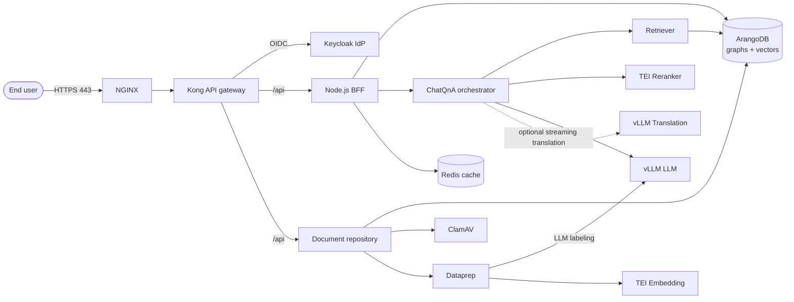
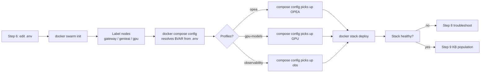

This is the canonical end-to-end install procedure for GENIE.AI. **Choose
the deployment model that matches your case before reading on** — each model
has a dedicated sibling guide with the platform-specific mechanics, while
this doc is the universal prerequisite + configuration + verification
backbone:

| Model | When to use it | Companion guide |
|---|---|---|
| **Docker Compose** (`docker compose up`) | Local dev, MVP, small single-host production, evaluation | [Docker Compose Setup](/docs/deploy/docker-compose-setup/) |
| **Docker Swarm** (`docker stack deploy`) | Production multi-node, HA, mixed CPU/GPU node placement | [Docker Swarm Setup](/docs/deploy/docker-swarm-setup/) |
| **Ansible + Swarm** | Repeatable fleet deploys with per-environment secrets | [Ansible README](/docs/deploy/docker-swarm-setup/#ansible-deployment-optional) |
| **Remote GPU** (`GPU_NODE_HOST=`) | OPEA orchestrators on CPU node, vLLM/TEI on a separate GPU node | [Remote GPU Node](/docs/deploy/docker-swarm-setup/#remote-gpu-node-optional) |

GPU profiles (T4 16 GB / RTX 6000 24 GB / A40 48 GB / H100) layer on top of
any of the above via the `env.t4` / `env.rtx6000` overrides — see
[GPU Deployment](/docs/deploy/gpu/).

## Goal

Read this doc top-to-bottom on first install to learn every prerequisite,
the environment-variable reference, and the post-deploy verification
checklist; afterwards use the cross-linked deployer guides above for
incremental changes. Provision a working GENIE.AI stack (NGINX → Kong →
backend → OPEA services → ArangoDB) in one sitting, verify every service is
healthy, and position yourself for knowledge-base population.

For data-curation guidance (which this guide does **not** cover) see
[Content Guidance](/docs/knowledge-base/content-guidance/) and
[Labelling Taxonomy](/docs/knowledge-base/labelling-taxonomy/).

For mobile-app build and distribution see
[Mobile Deployment Guide](/docs/mobile/mobile-deployment-guide/).

## Glossary

| Term | Meaning |
|---|---|
| **AQL** | ArangoDB Query Language — SQL-like query language for ArangoDB |
| **DGPR-compliant** | Compliant with the Digital Public Goods standard (alternate spelling — see **DPG**) |
| **DPG-compliant** | Compliant with the Digital Public Goods standard |
| **DPG** | Digital Public Good |
| **Kong** | Open-source API gateway used as the public entry point |
| **MECE** | Mutually Exclusive, Collectively Exhaustive (hierarchy design principle) |
| **MMR** | Maximal Marginal Relevance — diversity-aware retrieval reranking |
| **OPEA** | Open Platform for Enterprise AI (https://opea.dev) |
| **OIDC** | OpenID Connect — identity layer on top of OAuth 2.0 |
| **RAG** | Retrieval-Augmented Generation |
| **TEI** | Text Embeddings Inference (Hugging Face's embedding/rerank server) |
| **vLLM** | High-throughput LLM inference engine |

## Architecture at a glance



NGINX is the only host-published port (80/443); everything else stays on
the internal Docker network. The `observability` profile adds VictoriaMetrics,
VictoriaTraces, tempo-proxy, and Grafana on top of the always-on OTel Collector
+ VictoriaLogs log substrate.

## Step 1: Hardware requirements

GENIE.AI needs significant computational resources for AI model inference.
The solution will not run reliably without the resources below.

| Tier | CPU | RAM | GPU | Use case |
|---|---|---|---|---|
| Small | 8 vCPU | 16 GB | T4 16 GB (or none for CPU-only) | Dev, MVP, small knowledge base (< 1k chunks) |
| Medium | 16 vCPU | 32 GB | RTX 6000 24 GB | Production single-node |
| Large | 32 vCPU | 64 GB | A40 48 GB / H100 | Multi-node production with high concurrency |

For the GPU-specific layer, see [GPU Deployment](/docs/deploy/gpu/).

## Step 2: Software prerequisites

- **Ubuntu Linux 22.04** — primary tested platform. Other Debian-based
  distributions work but may need package-name adjustments.
- **Docker & Docker Swarm** — required for orchestrating the containerized
  services. See Step 3.
- **NVIDIA Drivers & CUDA** — required only if using GPU services (vLLM, TEI).
  See [GPU Deployment](/docs/deploy/gpu/) and
  [NVIDIA A40 Install Guide](/docs/deploy/a40-install/).
- **Node.js 22+** — required for JavaScript tooling. Docker images use
  `node:22`; CI lint+test jobs run on `node:20-alpine`.

## Step 3: Install Docker on every host

### 3a. Update and install prerequisites

```bash
sudo apt-get update
sudo apt-get install -y ca-certificates curl gnupg
```

### 3b. Add Docker's official GPG key

```bash
sudo install -m 0755 -d /etc/apt/keyrings
curl -fsSL https://download.docker.com/linux/ubuntu/gpg \
  | sudo gpg --dearmor -o /etc/apt/keyrings/docker.gpg
sudo chmod a+r /etc/apt/keyrings/docker.gpg
```

### 3c. Add the Docker repository

> **Note:** Use `https://download.docker.com/linux/ubuntu` on Ubuntu (not
> `/linux/debian`) — the repo URL must match your distribution.

```bash
echo \
  "deb [arch=$(dpkg --print-architecture) signed-by=/etc/apt/keyrings/docker.gpg] \
  https://download.docker.com/linux/ubuntu \
  $(. /etc/os-release && echo "$VERSION_CODENAME") stable" \
  | sudo tee /etc/apt/sources.list.d/docker.list > /dev/null
```

### 3d. Install Docker Engine

This also removes conflicting older versions like `docker.io` if present:

```bash
sudo apt-get update
sudo apt-get install -y docker-ce docker-ce-cli containerd.io \
                        docker-buildx-plugin docker-compose-plugin
```

### 3e. Start and enable Docker

If the installer does not start the daemon automatically:

```bash
sudo systemctl start docker
sudo systemctl enable docker
```

### 3f. Grant your user Docker permissions

```bash
sudo usermod -aG docker $USER
newgrp docker
```

### 3g. Verify

```bash
docker run hello-world
```

## Step 4: Install Node.js 22+

```bash
curl -fsSL https://deb.nodesource.com/setup_22.x | sudo -E bash -
sudo apt-get install -y nodejs
node -v   # v22.x
npm -v    # 10.x
```

## Step 5: Clone the repository

```bash
git clone https://opensource.unicc.org/un/itu/genie-ai.git
cd genie-ai
```

If you plan to commit changes, clone from your fork; check with the
administrator about which branch is current. The canonical mirror is at
`https://opensource.unicc.org/un/itu/genie-ai/`.

## Step 6: Environment configuration

```bash
cp env .env
```

The `env` template is the single source of truth for configuration. Three
templates ship in the repository:

| File | Purpose |
|---|---|
| `env` | Default deployment — copy to `.env` first |
| `env.t4` | NVIDIA T4 GPU overrides — source after `.env` |
| `env.rtx6000` | RTX 6000 ADA overrides — source after `.env` |

### 6a. Generate strong passwords

```bash
python3 -c "import secrets; print(secrets.token_urlsafe(32))"
```

Use this to generate every `*_PASSWORD` / `*_SECRET` value. All
`*_PASSWORD` / `*_SECRET` variables in the `.env` file are required.

### 6b. LLM prompt customization (optional)

GENIE.AI uses a two-tier priority for LLM prompts:

1. **ENV VAR** (highest): override in `.env` for deployment-specific
   customization.
2. **DEFAULT** (lowest): built-in prompts in Python code (works
   out-of-the-box).

| Variable | Purpose | Default location |
|---|---|---|
| `CHATQNA_SYSTEM_PROMPT` | Main ChatQnA system prompt | `genie-ai-overlay/chatqna/genieai_chatqna.py` |
| `CHATQNA_ABSTENTION_INSTRUCTIONS` | Instructions when no relevant docs found | `genie-ai-overlay/chatqna/genieai_chatqna.py` |
| `CHATQNA_ENFORCE_ABSTENTION` | Enable/disable abstention behavior | built-in default `"true"` |
| `LABEL_SELECTOR_SYSTEM_PROMPT` | Rules for automatic document labeling | `genie-ai-overlay/dataprep/genieai_dataprep_arangodb.py` |
| `CONTEXTUAL_RETRIEVAL_PROMPT` | Per-chunk doc-context generation | `genie-ai-overlay/dataprep/genieai_dataprep_arangodb.py` |

To customize, add the variable to `.env`. To change built-in defaults, edit
the Python source listed above.

### 6c. Minimum required variables (TL;DR)

This is the short list a first-time deployer MUST set before running
`docker stack deploy`. Section 6d below is the full reference (200+ vars with
defaults, descriptions, and qualifications).

Generate each secret with: `python3 -c "import secrets; print(secrets.token_urlsafe(32))"`

| Variable | Category | Purpose |
|---|---|---|
| `POSTGRES_PASSWORD` | PostgreSQL superuser | PostgreSQL root password (also used by Kong migrations) |
| `KONG_DB_PASSWORD` | Kong | Kong's dedicated PG user password (composed into Kong as `KONG_PG_PASSWORD`) |
| `ARANGO_PASSWORD` | ArangoDB | ArangoDB root password (knowledge-base storage) |
| `TRANSLATION_CACHE_PASSWORD` | Redis | Redis cache password (translation cache) |
| `KEYCLOAK_ADMIN_PASSWORD` | Keycloak | Keycloak master admin console password |
| `KEYCLOAK_DB_PASSWORD` | Keycloak | Keycloak dedicated PG user password |
| `KEYCLOAK_CLIENT_SECRET` | Keycloak | OIDC client secret for `genie-app` |
| `KEYCLOAK_PROXY_CLIENT_SECRET` | Keycloak | Service-account secret for the admin API proxy |
| `KC_DATAPREP_CLIENT_SECRET` | Keycloak | Service-account secret for dataprep (client_credentials grant) |
| `EMAIL_HOST` / `EMAIL_PORT` / `EMAIL_USER` / `EMAIL_PASSWORD` / `EMAIL_FROM` | SMTP | Required for user verification emails |
| `GENIE_ADMIN_PASSWORD` | Initial admin | Initial password for the seeded `genie-admin` user |
| `HUGGING_FACE_HUB_TOKEN` | GPU only | HF token to pull vLLM / TEI models |
| `VLLM_API_KEY` | Remote GPU only | Bearer token for the remote GPU node |

### 6d. Required environment variables

The full variable reference follows. Variables not listed here use compose
defaults.

> **Legend:** Required (`yes`) = must be set in `.env` before first deploy.
> Sample `<set-me>` = replace with your own value; do **not** ship the example
> value in production.

#### General & proxy settings

| Variable | Type | Required | Default | Description |
|---|---|---|---|---|
| `no_proxy` | string | no | (unset) | Comma-separated hosts to bypass HTTP proxy |
| `http_proxy` | string | no | (unset) | HTTP proxy URL (blank if unused) |
| `https_proxy` | string | no | (unset) | HTTPS proxy URL (blank if unused) |

#### Kong (API gateway) and PostgreSQL

| Variable | Type | Required | Default | Description |
|---|---|---|---|---|
| `POSTGRES_USER` | string | no | `genieai` | PostgreSQL superuser |
| `POSTGRES_DB` | string | no | `kong` | Default database |
| `POSTGRES_PASSWORD` | secret | yes | `<set-me>` | PostgreSQL superuser password |
| `KONG_DATABASE` | string | no | `postgres` | Tells Kong which DB to use |
| `KONG_PG_HOST` | string | no | `postgres` | Kong's PG host |
| `KONG_PG_USER` | string | no | `kong` | Kong's dedicated PG user |
| `KONG_PG_PASSWORD` | secret | yes | `<set-me>` (= `KONG_DB_PASSWORD`) | Kong PG user password |
| `KONG_PROXY_ACCESS_LOG` | string | no | `/dev/stdout` | Kong proxy access log path |
| `KONG_ADMIN_ACCESS_LOG` | string | no | `/dev/stdout` | Kong admin access log path |
| `KONG_PROXY_ERROR_LOG` | string | no | `/dev/stderr` | Kong proxy error log path |
| `KONG_ADMIN_ERROR_LOG` | string | no | `/dev/stderr` | Kong admin error log path |
| `KONG_ADMIN_LISTEN` | string | no | `0.0.0.0:8001, 0.0.0.0:8444 ssl` | Kong admin API listen address (see `docker-compose.yaml:229`) |
| `KONG_DNS_RESOLVER` | string | no | `127.0.0.11` | DNS resolver (Docker internal) |
| `KONG_DNS_ORDER` | string | no | `LAST,A,AAAA,CNAME` | DNS resolution order |
| `KONG_TRUSTED_IPS` | string | no | `172.16.0.0/12` | Trusted proxies for `X-Forwarded-*` headers |
| `KONG_DNS_STALE_TTL` | number | no | `5` | TTL for stale DNS responses |

#### Frontend (Vue.js)

| Variable | Type | Required | Default | Description |
|---|---|---|---|---|
| `APP_NAME` | string | no | `huduma` (code fallback) | Used by backend `database-operations-service.js` to prefix backup filenames (`${APP_NAME}_backup_<timestamp>`); the `'huduma'` default is preserved for backward compatibility with existing backups. Use the JSON config files in `public/config/` for UI branding instead |
| `FRONTEND_PORT` | number | no | `8090` | HOST port mapping for the Vue dev server (used only when the `8090:8090` mapping in `docker-compose.yaml` is uncommented). The frontend container itself listens on `PORT` (default `8090` baked into the image) |
| `VUE_APP_API_URL` | string | no | `/api` | Public URL the frontend uses to reach the API |
| `VUE_PROXY_HOST` | string | no | `localhost` | Vue dev proxy target (frontend's `server.js` and `vue.config.js` prepend `:3000` when this is unset, so the effective target becomes `localhost:3000`) |
| `VUE_APP_CSP_CONNECT_SRC` | string | no | `'self' http://localhost:3000 http://localhost:8090 http://127.0.0.1:8090 ws://localhost:3000 ws://localhost:8090` | CSP `connect-src` allowed origins (frontend build-time via Vue DefinePlugin; must match `CSP_CONNECT_SRC`) |
| `CSP_CONNECT_SRC` | string | no | `'self' http://localhost:3000 http://localhost:8090 http://127.0.0.1:8090 ws://localhost:3000 ws://localhost:8090` | CSP `connect-src` for backend Helmet config (must match `VUE_APP_CSP_CONNECT_SRC`) |
| `CORS_ALLOWED_ORIGINS` | string | no | `http://localhost:3000,http://localhost:8090,http://127.0.0.1:8090,https://localhost` | Comma-separated CORS origins (compose default includes localhost dev URLs + the resolved `NGINX_PUBLIC_DOMAIN`) |

#### Backend (Node.js)

| Variable | Type | Required | Default | Description |
|---|---|---|---|---|
| `NODE_ENV` | string | no | `production` | Application environment (baked into the backend image) |
| `BACKEND_PORT` | number | no | `3000` | HOST port mapping for the backend (used only when the `3000:3000` mapping in `docker-compose.yaml` is uncommented). The backend container itself listens on `PORT` (default `3000` baked into the image) |
| `API_PREFIX` | string | no | `/api` | Global API prefix |
| `UV_THREADPOOL_SIZE` | number | no | `128` | Libuv thread-pool size |
| `LOG_LEVEL` | string | no | `info` | Logging verbosity |
| `EMAIL_HOST` | string | yes (for user verification) | `<set-me>` | SMTP server |
| `EMAIL_PORT` | number | yes | `<set-me>` | SMTP port (587 for TLS, 465 for SSL) |
| `EMAIL_SECURE` | bool | no | `false` | SMTP TLS/SSL (`true` for port 465) |
| `EMAIL_USER` | string | yes | `<set-me>` | SMTP username |
| `EMAIL_PASSWORD` | secret | yes | `<set-me>` | SMTP password (Gmail users: 16-char App Password) |
| `EMAIL_FROM` | string | yes | `<set-me>` | `From:` address on outgoing mail |
| `BACKUP_DIR` | string | no | `./database_backups` | DB dump output dir (relative to backend `cwd`; compose bind-mounts `${DATA_DIR:-./data}/database_backups` → `/app/database_backups` so dumps land under `./data/database_backups` on the host) |
| `MAX_BACKUPS` | number | no | `5` | Backups to retain |
| `BACKUP_FORMAT` | string | no | `json` | Backup format |
| `COMPRESS_BACKUPS` | bool | no | `false` | gzip backups (`true` to enable) |
| `CONTEXT_OPTION` | string | no | `conversation-with-context-labels` | Conversation-context strategy |

#### Translation & Redis cache

| Variable | Type | Required | Default | Description |
|---|---|---|---|---|
| `TRANSLATION_THREADS` | number | no | `4` | Concurrent translation threads |
| `TRANSLATION_BATCHES` | number | no | `5` | Translation batch size |
| `TRANSLATION_CACHE` | string | no | `on` (compose) / `off` (code) | Enable/disable translation cache (`on` to enable) |
| `TRANSLATION_CACHE_PATH` | string | no | (legacy, unused) | Reserved file-based cache path. Current code uses Redis only; set to anything or leave unset |
| `TRANSLATION_CACHE_HOST` | string | no | `redis-cache` (compose) / `localhost` (code) | Redis cache host |
| `TRANSLATION_CACHE_PORT` | number | no | `6379` | Redis port |
| `TRANSLATION_CACHE_PASSWORD` | secret | yes | `<set-me>` | Redis cache password |

#### ArangoDB (knowledge base)

> **Note:** All GENIE.AI services (backend, frontend, document-repository,
> OPEA services) share a single ArangoDB database. The default name is
> `genie-ai`.

| Variable | Type | Required | Default | Description |
|---|---|---|---|---|
| `ARANGO_URL` | string | no | `http://arango-vector-db:8529` | ArangoDB connection URL |
| `ARANGO_PORT` | number | no | `8529` | ArangoDB port |
| `ARANGO_DB` | string | no | `genie-ai` | Database name (per-deployment isolation) |
| `ARANGO_USER` | string | no | `root` | Database user (used by backend, doc-repo, db-migrations) |
| `ARANGO_USERNAME` | string | no | `root` | Parallel to `ARANGO_USER` for OPEA services (dataprep, retriever) — keep both in sync |
| `ARANGO_PASSWORD` | secret | yes | `<set-me>` | ArangoDB root password |
| `ARANGO_GRAPH_NAME` | string | no | `GRAPH` | ArangoDB graph name (was `RETRIEVER_ARANGO_GRAPH_NAME` in v1.3) |

#### Document repository & virus scanning

| Variable | Type | Required | Default | Description |
|---|---|---|---|---|
| `DOC_REPO_PORT` | number | no | `3001` | HOST port mapping for document-repository (used only when the `3001:3001` mapping in `docker-compose.yaml` is uncommented). The doc-repo container itself listens on `PORT` (default `3001` baked into the image) |
| `DOC_REPO_URL` | string | no | `http://document-repository:3001` (compose line 1357) / `http://localhost:3001` (Python code) | Internal URL the chatqna orchestrator uses to reach document-repository. Compose hardcodes the literal `http://document-repository:3001` and does NOT propagate `DOC_REPO_URL` from `.env`; reading the env var would require editing the compose file. The Python chatqna code reads `DOC_REPO_URL` via `os.getenv("DOC_REPO_URL", "http://localhost:3001")` so the value flows through at runtime once it reaches the container |
| `UPLOAD_DIR` | string | no | `./uploads` | Upload directory (Docker volume is a separate name) |
| `MAX_FILES_UPLOAD` | number | no | `10` | Max files per upload |
| `MAX_FILE_SIZE` | number | no | `52428800` | Max file size in bytes (~50 MB) |
| `DOCUMENT_INGESTION_LANGUAGE` | string | no | `en` | Ingestion language code |
| `LOG_FILE` | string | no | `app.log` | Application log file name |
| `VIRUS_SCANNING` | bool | no | `false` | Enable ClamAV scanning on upload (`true` to enable) |
| `CLAMSCAN_ACTIVE` | bool | no | `true` | Master switch for ClamAV |
| `CLAMSCAN_HOST` | string | no | `127.0.0.1` | ClamAV host |
| `CLAMSCAN_PORT` | number | no | `3310` | ClamAV port |
| `CLAMSCAN_TIMEOUT` | number | no | `60000` | Scan timeout (ms) |
| `CLAMSCAN_REMOVE_INFECTED` | bool | no | `false` | Auto-delete infected files |
| `CLAMSCAN_QUARANTINE_INFECTED` | bool | no | `false` | Quarantine instead of delete |
| `CLAMSCAN_DEBUG_MODE` | bool | no | `false` | Enable debug logging |
| `CLAMSCAN_SOCKET` | bool | no | `false` | Use socket (vs TCP) |
| `CLAMSCAN_LOCAL_FALLBACK` | bool | no | `true` | Fall back to local `clamdscan` if daemon fails |
| `CLAMSCAN_PATH` | string | no | `/usr/bin/clamdscan` | Local fallback binary |

#### OPEA & ChatQnA orchestration

| Variable | Type | Required | Default | Description |
|---|---|---|---|---|
| `NGINX_PORT` | number | no | `80` | ChatQnA Nginx router port |
| `FRONTEND_SERVICE_IP` | string | no | `chatqna-xeon-ui-server` | ChatQnA UI server hostname |
| `FRONTEND_SERVICE_PORT` | number | no | `5173` | ChatQnA UI server port |
| `BACKEND_SERVICE_NAME` | string | no | `chatqna-xeon-backend-server` | ChatQnA backend service name (hardcoded in compose) |
| `BACKEND_SERVICE_IP` | string | no | `chatqna-xeon-backend-server` | ChatQnA backend hostname |
| `BACKEND_SERVICE_PORT` | number | no | `8888` | ChatQnA backend port |
| `DATAPREP_SERVICE_IP` | string | no | `dataprep-arango-service` | Dataprep hostname |
| `DATAPREP_SERVICE_PORT` | number | no | `5000` | Dataprep port |
| `MEGA_SERVICE_HOST_IP` | string | no | `chatqna-xeon-backend-server` | Mega-service orchestrator |
| `CHATQNA_TYPE` | string | no | `ChatQnA` | ChatQnA deployment type |
| `EMBEDDING_SERVER_HOST_IP` | string | no | `embedding` | OPEA embedding wrapper hostname (port 6000) |
| `EMBEDDING_SERVER_PORT` | number | no | `6000` | OPEA embedding wrapper port |
| `EMBEDDING_MODEL_ID` | string | no | `BAAI/bge-base-en-v1.5` | Embedding model |
| `EMBEDDING_SERVER_ENDPOINT` | string | no | `/v1/embeddings` | Embedding endpoint path |
| `RETRIEVER_SERVICE_HOST_IP` | string | no | `retriever-arango-service` | Retriever hostname |
| `RETRIEVER_SERVICE_PORT` | number | no | `7000` | Retriever port |
| `RERANK_SERVER_HOST_IP` | string | no | `reranker` | OPEA reranker wrapper hostname (port 8000) |
| `RERANK_SERVER_PORT` | number | no | `8000` | OPEA reranker wrapper port |
| `RERANKER_MODEL_ID` | string | no | `BAAI/bge-reranker-v2-m3` | Reranker model |
| `RERANKING_STRATEGY` | enum | no | `slice` | `slice` / `threshold` / `slice_threshold` / `knee_threshold` / `adaptive` |
| `RERANKER_TOP_N` | number | no | `3` | Chunks kept by `slice` strategy |
| `RERANKING_THRESHOLD` | number | no | `0.75` | Score threshold for `threshold` strategy (compose default `0.75`; Python code default `0.9` — compose wins at runtime; set in `.env` to override) |
| `RERANKER_SCORE_CALIBRATION` | enum | no | `none` | Score calibration mode |
| `RERANKER_SCORE_TEMPERATURE` | number | no | `1.0` | Score temperature for calibration |
| `LLM_SERVER_HOST_IP` | string | no | `vllm` | vLLM hostname |
| `LLM_SERVER_PORT` | number | no | `8000` | vLLM port |
| `VLLM_LLM_MODEL_ID` | string | no | `meta-llama/Meta-Llama-3.1-8B-Instruct` | Main LLM model |
| `VLLM_TRANSLATION_MODEL_ID` | string | no | `google/gemma-3-4b-it` | Translation LLM model |
| `VLLM_TRANSLATION_SERVICE_PORT` | number | no | `9031` | Translation service port |
| `GUARDRAIL_SERVICE_HOST_IP` | string | no | `guardrail` | Guardrail hostname |
| `GUARDRAIL_SERVICE_PORT` | number | no | `9090` | Guardrail port |
| `GUARDRAIL_URL` | string | no | `http://guardrail:9090/v1/guardrails` | Guardrail endpoint |
| `TRANSLATION_SERVICE_HOST_IP` | string | no | `vllm-translation-guardrail` | Translation service hostname (hardcoded in compose) |
| `TRANSLATION_SERVICE_PORT` | number | no | `9031` | Translation service port |

> **Note:** The `DATAPREP_SERVICE_IP` and `DATAPREP_SERVICE_PORT` env vars
> are consumed by the disabled `chatqna-xeon-nginx-server` service
> (`replicas: 0`); the active dataprep URL is
> `http://dataprep-arango-service:5000` referenced from chatqna env. The
> guardrail service is part of the `opea` profile but is also disabled by
> default (`replicas: 0`).

#### Dataprep

| Variable | Type | Required | Default | Description |
|---|---|---|---|---|
| `DATAPREP_CHUNK_SIZE` | number | no | `500` | Token/char count per chunk (Python-side fallback when no per-format override matches) |
| `DATAPREP_CHUNK_SIZE_PDF` | number | no | `500` | PDF chunk size |
| `DATAPREP_CHUNK_SIZE_DOCX` | number | no | `1000` | DOCX chunk size (1000+ recommended) |
| `DATAPREP_CHUNK_SIZE_XLSX` | number | no | `1500` | XLSX chunk size (1500+ recommended to avoid splitting rows) |
| `DATAPREP_CHUNK_SIZE_PPTX` | number | no | `500` | PPTX chunk size |
| `DATAPREP_CHUNK_SIZE_HTML` | number | no | `500` | HTML chunk size |
| `DATAPREP_CHUNK_SIZE_TXT` | number | no | `500` | TXT chunk size |
| `DATAPREP_CHUNK_SIZE_MD` | number | no | `500` | Markdown chunk size |
| `DATAPREP_CHUNK_OVERLAP` | number | no | `50` | Overlap between chunks |
| `DATAPREP_MAX_CONCURRENT_BATCHES` | number | no | `20` | Concurrent LLM label calls (was 5 in legacy configs) |
| `DOCLING_DEVICE` | enum | no | `cuda` | `cuda` or `cpu` — CUDA is faster |
| `DATAPREP_COMPONENT_NAME` | string | no | `GENIE_DATAPREP_ARANGODB` | Dataprep component name |
| `DOCUMENT_REPOSITORY_URL` | string | no | `http://document-repository:3001` | Doc-repo internal URL |
| `BACKEND_SERVICE_URL` | string | no | `http://backend:3000` | Backend URL (for hierarchy fetch) |
| `LABELING_STRATEGY` | enum | no | `llm` | `llm` / `embedding` / `bm25` |
| `EMBEDDING_LABEL_THRESHOLD` | number | no | `0.75` | Threshold for embedding-based labeling |
| `BM25_LABEL_THRESHOLD` | number | no | `2.00` | Threshold for BM25 labeling |
| `CONTENT_EXTRACTION_METHOD` | enum | no | `docling` (compose) / `opea` (Python code) | `opea` or `docling` (compose wins at runtime; set in `.env` to override) |
| `LABEL_SELECTOR_SYSTEM_PROMPT` | string | no | (built-in) | LLM labeling rules |
| `CONTEXTUAL_RETRIEVAL_ENABLED` | bool | no | `true` | Prepend LLM doc-context prefix to each chunk |
| `CONTEXTUAL_STRATEGY` | enum | no | `doc_level` | `per_chunk` or `doc_level` (compose default `doc_level`; Python code default `per_chunk` — compose wins at runtime; set in `.env` to override) |
| `CONTEXTUAL_RETRIEVAL_PROMPT` | string | no | (built-in) | Per-chunk context prompt (`{document_context}` placeholder) |
| `MULTI_TURN_BLEND_ENABLED` | bool | no | `false` | Multi-turn vector-space blending |
| `MULTI_TURN_BLEND_ALPHA` | number | no | `0.7` | Query weight α in `V = α·EQ + (1-α)·EH` |
| `MULTI_TURN_HISTORY_TURNS` | number | no | `1` | Prior turns blended into history embedding |
| `DATAPREP_CONTEXTUAL_MODEL` | string | no | (empty) | Model for context generation (empty = `VLLM_LLM_MODEL_ID`); must support guided JSON |
| `DATAPREP_CONTEXTUAL_DOC_BUDGET` | number | no | `6000` (compose) / `100000` (Python code) | Max chars of doc text fed to context LLM (~1500 tokens); `<=0` disables truncation (sibling `_DOC_LEVEL` variant defaults to `100000`). Compose wins at runtime; set in `.env` to override |
| `DATAPREP_CONTEXTUAL_MAX_TOKENS` | number | no | `512` | Max output tokens for context-gen LLM (was 200, truncated under load) |

#### Retriever

| Variable | Type | Required | Default | Description |
|---|---|---|---|---|
| `RETRIEVER_COMPONENT_NAME` | string | no | `GENIE_RETRIEVER_ARANGODB` | Retriever component name |
| `RETRIEVER_ARANGO_SEARCH_START` | string | no | `chunk` (compose) / `node` (Python code) | Graph traversal starting point (`chunk`/`node`/`edge`) — compose wins at runtime |
| `RETRIEVER_ARANGO_SEARCH_MODE` | enum | no | `vector` | `vector` / `hybrid` (hybrid is controlled separately by `RETRIEVER_HYBRID_RETRIEVAL_ENABLED`) |
| `RETRIEVER_HYBRID_RETRIEVAL_ENABLED` | bool | no | `true` | Master switch for hybrid BM25+dense fusion |
| `RETRIEVER_ARANGO_TRAVERSAL_ENABLED` | bool | no | `true` (compose) / `false` (Python code) | Enable graph traversal — compose wins at runtime |
| `RETRIEVER_ARANGO_TRAVERSAL_MAX_DEPTH` | number | no | `2` (compose) / `1` (Python code) | Max graph traversal depth — compose wins at runtime |
| `RETRIEVER_ARANGO_TRAVERSAL_MAX_RETURNED` | number | no | `5` (compose) / `3` (Python code) | Max items returned by traversal — compose wins at runtime |
| `RETRIEVER_ARANGO_TRAVERSAL_SCORE_THRESHOLD` | number | no | `0.7` (compose) / `0.5` (Python code) | Min score to keep traversal results — compose wins at runtime |
| `RETRIEVER_ARANGO_TRAVERSAL_CONCURRENT_BATCHES` | number | no | `10` (compose) / `1` (Python code) | Concurrent traversal batches — compose wins at runtime |
| `RETRIEVER_ARANGO_DISTANCE_STRATEGY` | string | no | `COSINE` | Distance metric for vector search |
| `RETRIEVER_ARANGO_NUM_CENTROIDS` | number | no | `1` | Vector-search centroids |
| `RETRIEVER_ARANGO_USE_APPROX_SEARCH` | bool | no | `false` | Use ANN search |
| `RETRIEVER_ARANGO_K` | number | no | `20` | Top chunks returned to reranker |
| `RETRIEVER_ARANGO_FETCH_K` | number | no | `30` | Candidate chunks scored before filtering |
| `RETRIEVER_ARANGO_SCORE_THRESHOLD` | number | no | `0.2` | Min similarity score |
| `RETRIEVER_ARANGO_DISTANCE_THRESHOLD` | number | no | `1` | Max distance |
| `RETRIEVER_ARANGO_LAMBDA_MULT` | number | no | `0.5` | MMR diversity factor (0 = relevance-only, 1 = max diversity) |
| `RETRIEVER_ARANGO_FILTER_STRATEGY` | enum | no | `OR` | `OR` or `AND` for label filters |
| `RETRIEVER_SUMMARIZER_ENABLED` | bool | no | `false` | LLM-summarize retrieved chunks (latency-heavy) |

For tuning guidance see
[RAG → Retriever Configuration](/docs/rag-pipeline/retrieval/) and the
[Retriever overview in the source code](https://opensource.unicc.org/un/itu/genie-ai/-/tree/main/genie-ai-overlay/retriever).

#### Network & external services

| Variable | Type | Required | Default | Description |
|---|---|---|---|---|
| `NGINX_PUBLIC_DOMAIN` | string | no | `localhost` | Public FQDN / IP for nginx |
| `NGINX_HTTP_PORT` | number | no | `80` | HTTP port |
| `NGINX_HTTPS_PORT` | number | no | `443` | HTTPS port |
| `NGINX_FRONTEND_HOST` | string | no | `frontend` | Internal frontend host |
| `NGINX_FRONTEND_PORT` | number | no | `8090` | Internal frontend port |
| `KONG_PROXY_HOST` | string | no | `kong` | Kong proxy host |
| `HUGGING_FACE_HUB_TOKEN` | secret | yes (with GPU) | `<set-me>` | HF token for model pulls |
| `VLLM_API_KEY` | secret | yes (with remote GPU) | `<set-me>` | Bearer token for remote GPU node |
| `DEPLOY_OPEA` | enum | no | `1` | `0` to disable all OPEA services; `1` (default) keeps them |
| `ENABLE_OBSERVABILITY` | enum | no | `0` | `0` / `1` — observability stack on/off |
| `CERTBOT_EMAIL` | string | no | (unset) | Let's Encrypt account email |
| `CERTBOT_REPLICAS` | number | no | `0` | Certbot replicas |
| `CERTBOT_STAGING` | bool | no | `false` | Use Let's Encrypt staging |
| `GPU_NODE_HOST` | string | no | (unset) | Remote GPU node host (deploys only orchestrators when set) |
| `GPU_MODEL_REPLICAS` | number | no | `1` (cascades from `DEPLOY_OPEA`, default 1) | Replicas for GPU model containers |
| `GPU_PUBLIC_DOMAIN` | string | no | (unset) | Public FQDN of remote GPU node |
| `VLLM_ENDPOINT` | string | no | `http://vllm:8000` (compose-internal) | vLLM endpoint override; for remote GPU set `VLLM_ENDPOINT=https://${GPU_NODE_HOST}/llm` in `.env` (no automatic override) |
| `VLLM_TRANSLATION_ENDPOINT` | string | no | `http://vllm-translation-guardrail:9031` (compose-internal) | vLLM translation endpoint; for remote GPU set `VLLM_TRANSLATION_ENDPOINT=https://${GPU_NODE_HOST}/translation` in `.env` (compose does NOT auto-substitute) |
| `EMBEDDING_SERVICE_URL` | string | no | `http://tei:80` (compose-internal) | Embedding service URL; for remote GPU set `EMBEDDING_SERVICE_URL=https://${GPU_NODE_HOST}/embed` in `.env` (compose does NOT auto-substitute) |
| `RERANKER_SERVICE_URL` | string | no | `http://tei_reranker:80` (compose-internal) | Reranker service URL; for remote GPU set `RERANKER_SERVICE_URL=https://${GPU_NODE_HOST}/rerank` in `.env` (compose does NOT auto-substitute) |
| `DOCLING_ENDPOINT` | string | no | (empty, uses in-process docling) | Remote docling-serve endpoint for document extraction; set to `https://${GPU_NODE_HOST}/docling` when using remote GPU |
| `DOCLING_ENDPOINT_TIMEOUT` | number | no | `120` | HTTP timeout (seconds) for remote docling-serve calls |
| `OPEA_SSL_SKIP_VERIFY` | bool | no | `0` | Skip SSL verification for OPEA Python services |
| `KEYCLOAK_SSL_SKIP_VERIFY` | bool | no | `0` | Skip SSL verification for dataprep's Keycloak client |
| `NODE_TLS_REJECT_UNAUTHORIZED` | bool | no | `1` | Node.js TLS verification (`0` for self-signed dev certs) |

#### Keycloak

| Variable | Type | Required | Default | Description |
|---|---|---|---|---|
| `KEYCLOAK_URL` | string | no | `https://localhost/auth` | Public Keycloak URL |
| `KEYCLOAK_REALM` | string | no | `genie` | Realm name |
| `KEYCLOAK_CLIENT_ID` | string | no | `genie-app` | OIDC client ID |
| `KEYCLOAK_CLIENT_SECRET` | secret | yes | `<set-me>` | OIDC client secret |
| `KEYCLOAK_PROXY_CLIENT_SECRET` | secret | yes | `<set-me>` | Service-account secret for the admin API proxy |
| `KC_DATAPREP_CLIENT_ID` | string | no | `dataprep-service-client` | Service-account client ID used by dataprep (client_credentials grant for service-to-service auth) |
| `KC_DATAPREP_CLIENT_SECRET` | secret | yes | `<set-me>` | Service-account secret for dataprep → doc-repo / backend API calls |
| `KC_MOBILE_CLIENT_ID` | string | no | `genie-mobile-<institution>` | Public OIDC client ID for the Flutter mobile app (PKCE, no secret — RFC 8252). Must match the Flutter flavor's `clientId` |
| `KC_MOBILE_REDIRECT_SCHEME` | string | no | `com.<institution>.genieai` | Custom URL scheme for mobile OIDC callback (must match Android `appAuthRedirectScheme`, iOS `APP_AUTH_REDIRECT_SCHEME`, and the Flutter flavor's `redirectScheme` — mismatch causes silent auth failure) |
| `KEYCLOAK_ADMIN_PASSWORD` | secret | yes | `<set-me>` | Master admin console password |
| `KEYCLOAK_DB_PASSWORD` | secret | yes | `<set-me>` | Keycloak dedicated PG user password |
| `KEYCLOAK_ADDITIONAL_REALMS` | string | no | (unset) | JSON array of additional realms |
| `KEYCLOAK_REGISTRATION_ENABLED` | bool | no | `true` | Allow self-registration |
| `KEYCLOAK_VERIFY_EMAIL` | bool | no | `true` | Require email verification |
| `KEYCLOAK_RESET_PASSWORD` | bool | no | `true` | Allow password reset |
| `KEYCLOAK_LOGIN_WITH_EMAIL` | bool | no | `true` | Allow login by email |
| `KEYCLOAK_DUPLICATE_EMAILS` | bool | no | `false` | Allow duplicate emails across users |
| `KEYCLOAK_BRUTE_FORCE` | bool | no | `true` | Enable brute-force protection |
| `KEYCLOAK_PASSWORD_POLICY` | string | no | `length(12) and upperCase(1) and lowerCase(1) and digits(1) and specialChars(1)` | Password complexity rules |
| `KEYCLOAK_THEME` | string | no | `genie` | Login theme |
| `KEYCLOAK_I18N_ENABLED` | bool | no | `true` | Enable login-page i18n |
| `KEYCLOAK_LOCALE` | string | no | `en` | Default login locale |
| `KEYCLOAK_SUPPORTED_LOCALES` | string | no | `["ar","de","en","es","fr","pt","ru","th","zh-Hans"]` | JSON array of supported login locales |
| `KEYCLOAK_ACCESS_TOKEN_LIFESPAN` | number | no | `300` | Access-token TTL (seconds) |
| `GENIE_ADMIN_EMAIL` | string | no | (unset) | Initial admin email |
| `GENIE_ADMIN_USERNAME` | string | no | `genie-admin` | Initial admin username |
| `GENIE_ADMIN_PASSWORD` | secret | yes | `<set-me>` | Initial admin password |

#### Observability (optional — `ENABLE_OBSERVABILITY=1`)

| Variable | Type | Required | Default | Description |
|---|---|---|---|---|
| `OTEL_EXPORTER_OTLP_ENDPOINT` | string | no | `http://otel-collector:4318` | OTLP collector base URL |
| `OTEL_TRACES_SAMPLER_RATE` | number | no | `100.0` | Trace sampling percentage |
| `GRAFANA_ADMIN_USER` | string | no | `admin` | Grafana admin user |
| `GRAFANA_ADMIN_PASSWORD` | secret | yes | `<set-me>` | Grafana admin password |
| `GRAFANA_ALERT_EMAIL` | string | no | (unset) | Alert notification email (reserved — not yet wired into contact points) |
| `GRAFANA_PORT` | number | no | `3002` | Host port for Grafana |
| `VICTORIAMETRICS_RETENTION` | string | no | `30d` | Metric retention period |
| `VICTORIALOGS_RETENTION` | string | no | `30d` | Log retention period |
| `VICTORIATRACES_RETENTION` | string | no | `30d` | Trace retention period |
| `KONG_TRACING_INSTRUMENTATIONS` | string | no | `request` | Kong tracing instrumentations |
| `KONG_TRACING_SAMPLING_RATE` | number | no | `1.0` | Kong trace sampling rate 0.0–1.0 |
| `KC_GRAFANA_CLIENT_ID` | string | no | `grafana` | Grafana OIDC client ID |
| `KC_GRAFANA_CLIENT_SECRET` | secret | yes | `<set-me>` | Grafana OIDC client secret |

## Step 7: Initialize Swarm and deploy



### 7a. Initialize Swarm

```bash
docker swarm init
docker node update --label-add gateway=true $(hostname)
docker node update --label-add genieai=true $(hostname)
docker node update --label-add gpu=true $(hostname)
```

For multi-node Swarm see [Docker Swarm Setup → Step 2](/docs/deploy/docker-swarm-setup/#step-2-label-nodes).

### 7b. Pre-resolve env into a flat YAML

> **Important:** `docker stack deploy` does **not** substitute `${VAR}`
> references from environment variables. Always run `docker compose config`
> first to produce a flat YAML, then deploy the resolved file.

```bash
set -a && source .env && set +a
docker compose config > docker-compose.resolved.yaml
```

With GPU-specific overrides (T4):

```bash
set -a && source .env && source env.t4 && set +a
docker compose config > docker-compose.resolved.yaml
```

### 7c. Deploy the stack

```bash
docker stack deploy -c docker-compose.resolved.yaml genieai
```

For a `docker compose up` single-host dev workflow see
[Docker Compose Setup → Step 6](/docs/deploy/docker-compose-setup/#step-6-deploy).

## Step 8: Verify deployment is healthy

```bash
# Services should be 1/1 with (healthy)
docker service ls

# Kong configured
docker service logs genieai_kong-config --tail 20
# Look for: "Configuration restored successfully"

# Keycloak realm applied
docker service logs genieai_keycloak-config --tail 10

# Smoke tests
curl -sk https://localhost/api/health
curl -sk https://localhost/
```

GPU stack confirmation (with `--profile opea --profile gpu-models`):

```bash
docker service logs genieai_vllm -f | grep 'Application startup complete'
curl -sk https://localhost/api/health | python3 -m json.tool
```

## Step 9: Knowledge-base population

The framework is empty until you ingest documents. The pipeline is:

1. Create the **label taxonomy** (categories + services) in the Admin Dashboard
   → Knowledge Hierarchy tab. For design principles see
   [Labelling Taxonomy](/docs/knowledge-base/labelling-taxonomy/).
2. Upload documents through the Admin Dashboard → Document Management tab, or
   via the `document-repository` upload API. Supported formats and known
   issues are documented in
   [Content Guidance](/docs/knowledge-base/content-guidance/).
3. Dataprep ingests each document: extracts text, splits into chunks, runs
   LLM-based labeling (or embedding / BM25 based on `LABELING_STRATEGY`), and
   stores everything in ArangoDB. Progress and failures land in the
   `ingestion_log` collection — visible in the Admin Dashboard.
4. Track per-chunk progress with the
   [Ingestion Log](/docs/operate/ingestion-log/) (see also
   [Ingestion pipeline](/docs/knowledge-base/ingestion/)).

## Step 10: First-time user accounts

The `genie-admin` user is provisioned automatically during deployment by
`configs/keycloak/genie-realm.yaml`. No script is required.

- **Admin console:** `https://<NGINX_PUBLIC_DOMAIN>/auth/admin/` (username
  `admin`, password from `KEYCLOAK_ADMIN_PASSWORD`)
- **GENIE realm admin:** username `genie-admin` (configurable via
  `GENIE_ADMIN_USERNAME`), password from `GENIE_ADMIN_PASSWORD`, has the
  `admin` realm role

To change the admin password, log in to the Keycloak admin console, switch
to the `genie` realm, then **Users → genie-admin → Credentials → Set
password**.

For full user-management instructions (CRUD, role assignment, security
considerations) see
[Keycloak Admin Operations Guide](/docs/configure/keycloak-admin-guide/).

## Step 11: Common post-deploy configuration

### 11a. NGINX

You do not need to configure NGINX manually — it auto-renders from
`default.conf.template` at startup. Common customization knobs:

| Variable | Purpose |
|---|---|
| `NGINX_PUBLIC_DOMAIN` | Public FQDN / IP the server is reachable at (drives redirect URIs and CORS allow-list) |
| `NGINX_HTTPS_PORT` | HTTPS port (default 443); set when running behind a non-standard port |
| `NGINX_HTTP_PORT` | HTTP port (default 80); set to `0` to disable HTTP entirely |
| `NGINX_FRONTEND_HOST` / `NGINX_FRONTEND_PORT` | Internal frontend routing target (rarely changed) |

For custom TLS certificates (production / non-Let's-Encrypt), drop the cert +
key into the `nginx_secrets` Docker volume and restart `genieai_nginx`. The
entrypoint detects the mounted files at startup and falls back to a
self-signed cert only if none are mounted. See
[Security Hardening](/docs/operate/security-hardening/).

### 11b. Kong

Kong database migrations run automatically as part of stack deploy. Routes
and plugins are applied by the `kong-config` one-shot service after Kong
becomes healthy — no manual configuration is needed for the default routes.

- **Custom routes** → add YAML to `api-gateway-solution/new-config/` (the
  restore script picks them up automatically).
- **Custom plugins** → enable via the Kong admin API or add to the
  declarative config alongside routes.
- **Trusted proxies** → `KONG_TRUSTED_IPS` (default `172.16.0.0/12`); expand
  when Kong sits behind an additional reverse proxy.
- **Tracing** → `KONG_TRACING_INSTRUMENTATIONS` and
  `KONG_TRACING_SAMPLING_RATE` (observability profile).

For full Kong operations (route CRUD, plugin config, RBAC) see
[Docker Swarm Setup → Kong trusted IPs](/docs/deploy/docker-swarm-setup/#kong-trusted-ips-required-for-swarm).

### 11c. Keycloak realm

The `genie` realm (clients, roles, mappers, the `genie-admin` user) is
applied by `keycloak-config`. Common post-deploy knobs:

| Variable | Purpose |
|---|---|
| `KEYCLOAK_SUPPORTED_LOCALES` | JSON array of login-page locales (e.g. `["en","es"]`) |
| `KEYCLOAK_PASSWORD_POLICY` | Realm password complexity rules (default: length(12) + 1 upper/lower/digit/special) |
| `KEYCLOAK_BRUTE_FORCE` | Enable Keycloak's built-in brute-force protection (default `true`) |
| `KEYCLOAK_VERIFY_EMAIL` | Require email verification on signup (default `true`) |
| `KEYCLOAK_REGISTRATION_ENABLED` | Allow self-registration (default `true`; set `false` to invite-only) |
| `KEYCLOAK_ACCESS_TOKEN_LIFESPAN` | Access-token TTL in seconds (default 300) |
| `GENIE_ADMIN_USERNAME` / `GENIE_ADMIN_PASSWORD` | Seeded `genie-admin` user credentials (change after first login) |
| `KEYCLOAK_ADDITIONAL_REALMS` | JSON array of additional realms to bootstrap alongside `genie` |

For full user/realm management (CRUD, role assignment, security
considerations) see
[Keycloak Admin Operations Guide](/docs/configure/keycloak-admin-guide/).
For external IdPs (Google, Microsoft, SAML/OIDC) see
[External IdP Integration Guide](/docs/configure/external-idp-integration-guide/).

## Troubleshooting

For environment-specific troubleshooting see:

- [Docker Compose Setup → Troubleshooting](/docs/deploy/docker-compose-setup/#troubleshooting)
- [Docker Swarm Setup → Troubleshooting](/docs/deploy/docker-swarm-setup/#troubleshooting)
- [GPU Deployment → Troubleshooting](/docs/deploy/gpu/#troubleshooting)

Common first-deploy failures (deployer-oriented, not environment-specific):

| Symptom | Likely cause | Fix |
|---|---|---|
| `docker stack deploy` reports `service "x" uses unsupported attribute` | `docker stack deploy` does not honor `--profile`; profiles are evaluated by `docker compose config` only | Run `docker compose config > docker-compose.resolved.yaml` first (see Step 7b), then `docker stack deploy -c docker-compose.resolved.yaml genieai` |
| Replicas stay at `0/N` after `docker stack deploy` | OPEA/AI services gated by `DEPLOY_OPEA=0` (compose default in older configs); or `replicas: 0` for the GPU services when `GPU_MODEL_REPLICAS=0` | Set `DEPLOY_OPEA=1` (default); with remote GPU, keep `GPU_MODEL_REPLICAS=0` and set `GPU_NODE_HOST` so the chatqna-orchestrators reach vLLM/TEI over the network |
| `curl https://localhost/api/health` returns 502 / 404 | NGINX hasn't rendered `default.conf.template`, or Kong upstream lacks the `/api` route | `docker service logs genieai_nginx --tail 50` — should show `Rendering nginx config from template...` followed by `Validating nginx configuration...` and `Starting nginx...`. Then `docker service logs genieai_kong-config --tail 50` — should show `Configuration restored successfully` |
| `curl https://localhost/` redirects to Keycloak but login fails with `invalid redirect_uri` | `NGINX_PUBLIC_DOMAIN` mismatches the URL used to reach the server, or `NGINX_HTTPS_PORT` is unset on a non-standard port | Set `NGINX_PUBLIC_DOMAIN` and (if not 443) `NGINX_HTTPS_PORT` in `.env`, then redeploy. Keycloak valid redirect URIs derive from these |
| vLLM OOMKilled on first boot | `VLLM_GPU_UTILIZATION` too high or model too large for the GPU | Lower `VLLM_GPU_UTILIZATION` (compose default `0.55` — see `docker-compose.yaml:755`; `env.t4=0.4`, `env.rtx6000=0.6`); see [GPU Deployment](/docs/deploy/gpu/) for per-GPU settings. Use `env.t4` (T4 16 GB) or `env.rtx6000` (24 GB) as starting points |
| Stack deploys cleanly but services crash at startup with `Missing *PASSWORD` / `Missing *SECRET` errors | All `*_PASSWORD` / `*_SECRET` values must be set before first deploy. `docker compose config` does NOT enforce required vars (it silently substitutes empty strings) — failures surface only at container startup | Generate strong values: `python3 -c "import secrets; print(secrets.token_urlsafe(32))"` and assign to each `PASSWORD`/`SECRET` listed in Step 6a. The required secrets are: `POSTGRES_PASSWORD`, `KONG_DB_PASSWORD`, `ARANGO_PASSWORD`, `TRANSLATION_CACHE_PASSWORD`, `KEYCLOAK_ADMIN_PASSWORD`, `KEYCLOAK_DB_PASSWORD`, `KEYCLOAK_CLIENT_SECRET`, `KEYCLOAK_PROXY_CLIENT_SECRET`, `KC_DATAPREP_CLIENT_SECRET`, `EMAIL_PASSWORD`, `GENIE_ADMIN_PASSWORD` (and `HUGGING_FACE_HUB_TOKEN` / `VLLM_API_KEY` when using GPU) |
| Step 6c vars show "(unset)" but compose substitutes a default anyway | Many `VUE_*`, `CSP_*`, `CORS_*` vars fall back to compose-level defaults (e.g. `'self' http://localhost:3000 …`) — leave them unset for local dev, override in `.env` for production | Override in `.env`; see `env` Section 5 (frontend) and Section 6 (backend) for the full list |

## Next steps

You now have GENIE.AI running. Continue with:

- [Post-deploy checklist](/docs/operate/health-checks/) — first
  user, first knowledge base
- [Knowledge Base](/docs/knowledge-base/) — content design, labelling,
  ingestion
- [Operations](/docs/operate/) — backup, troubleshooting, monitoring
- [Mobile Deployment Guide](/docs/mobile/mobile-deployment-guide/) —
  building and distributing the mobile app
