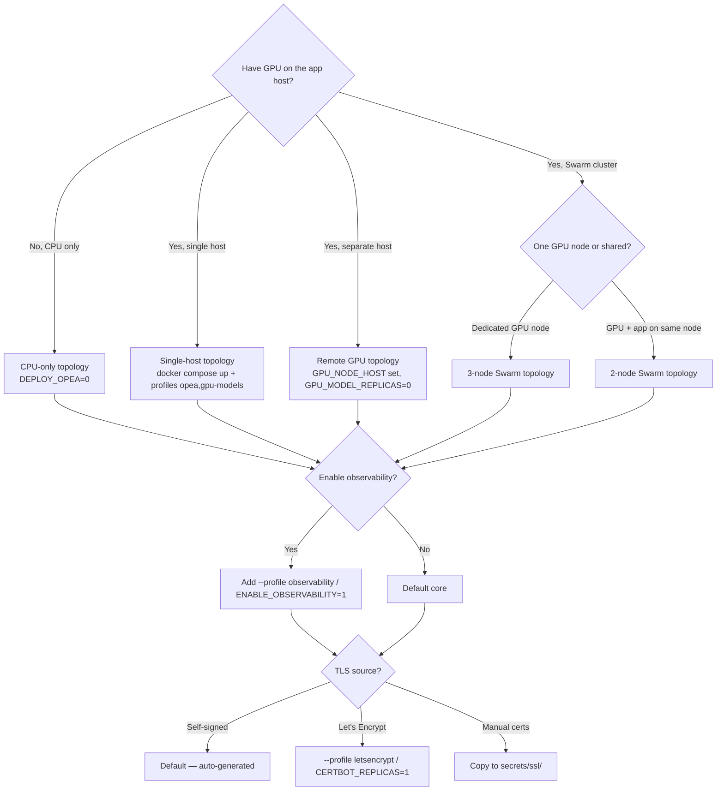

This page is the **single source of truth** for which deployment topology
fits which use case. It maps every supported combination of Docker Compose
profiles, Swarm node labels, GPU presence, observability, and TLS to a
named topology with a command, a diagram, and a verification recipe.

For the procedure to deploy a specific topology, follow the linked how-to
guide. This page answers **"which topology should I pick?"** and **"what
runs where?"**.

## Goal

Pick the right topology for your hardware and requirements in under five
minutes, then jump to the linked procedure to deploy it.

## Prerequisites

- Read the [Architecture Overview](/docs/architecture/architecture/) — the
  C4 container diagram and service auth matrix are referenced throughout.
- Decide on **hardware**: a single host, a Swarm cluster, or a separate
  GPU node.
- Decide on **AI scope**: pure core (no RAG), local OPEA + GPU, or remote
  GPU node.
- Decide on **observability**: enabled or disabled (default disabled).
- Decide on **TLS**: self-signed (default), manual, or Let's Encrypt.

## Topology decision tree



## Node-label matrix (Swarm)

GENIE.AI places every service on a Swarm node by **label**. The labels
`gateway`, `genieai`, `gpu` are applied with `docker node update --label-add`
and consumed by `placement.constraints` in
[`docker-compose.yaml`](https://opensource.unicc.org/un/itu/genie-ai/-/blob/main/docker-compose.yaml).

A single node can carry multiple labels — most production topologies run
two or three labels on the same physical host.

| Label | Purpose | Services pinned |
|---|---|---|
| `gateway=true` | Public-facing entry: TLS termination, Kong, Keycloak, PostgreSQL | `postgres`, `postgres-init`, `kong`, `kong-migrations`, `kong-config`, `nginx`, `certbot`, `keycloak`, `keycloak-config` |
| `genieai=true` | Application layer: backend, frontend, data stores, observability backends | `frontend`, `redis-cache`, `db-migrations`, `backend`, `document-repository`, `clamav`, `arango-vector-db`, `victoriametrics`, `victorialogs`, `victoriatraces`, `tempo-proxy`, `grafana` |
| `gpu=true` | AI / OPEA services (any service that consumes GPU resources or is tightly coupled to them) | `vllm`, `textgen`, `vllm-translation-guardrail`, `translation`, `guardrail`, `tei`, `embedding`, `tei_reranker`, `reranker`, `dataprep-arango-service`, `retriever-arango-service`, `chatqna-xeon-backend-server`, `chatqna-xeon-ui-server` (replicas 0), `chatqna-xeon-nginx-server` (replicas 0) |

The OTel Collector (`otel-collector`) is a special case: it runs in
**`mode: global`** with **no placement constraint**, so one collector runs
on every Swarm node. This is required so the fluentd logging driver
(`localhost:24224` on every node) has a collector to forward logs to.

> **Note on `chatqna-xeon-ui-server` / `chatqna-xeon-nginx-server`:** both
> have `profiles: [opea]` and `replicas: 0` by default — they are disabled
> in both `docker compose up` and `docker stack deploy`. They are listed in
> the `gpu=true` column above for completeness but **do not run** unless you
> explicitly raise `replicas: 1` (Swarm) or use `--profile opea` (Compose
> dev). They are debug helpers, not part of the active RAG pipeline.

## Profile matrix (Compose)

Docker Compose profiles control which optional services start. They are
**honored by `docker compose up`** and **ignored by `docker stack deploy`**
(Swarm starts everything regardless of profile — gating is done via env
vars like `DEPLOY_OPEA` / `ENABLE_OBSERVABILITY` / `CERTBOT_REPLICAS`).

| Profile | Compose command | Services added | Default in Swarm? |
|---|---|---|---|
| _(none)_ | `docker compose up -d` | `postgres`, `kong*`, `nginx`, `frontend`, `redis-cache`, `db-migrations`, `backend`, `document-repository`, `clamav`, `arango-vector-db`, `postgres-init`, `keycloak*`, `victorialogs`, `otel-collector`, `otel-collector-init` | All these always start in Swarm (15 named + 3 always-on observability backends) |
| `opea` | `--profile opea` | `textgen`, `translation`, `guardrail`, `embedding`, `reranker`, `dataprep-arango-service`, `retriever-arango-service`, `chatqna-xeon-backend-server`, `chatqna-xeon-ui-server` (replicas 0), `chatqna-xeon-nginx-server` (replicas 0) | Gated by `DEPLOY_OPEA` (default `1`) |
| `gpu-models` | `--profile gpu-models` | `vllm`, `vllm-translation-guardrail`, `tei`, `tei_reranker` | Gated by `GPU_MODEL_REPLICAS` (defaults to `DEPLOY_OPEA` — `1` by default; set `0` for remote GPU) |
| `observability` | `--profile observability` | `victoriametrics`, `victoriatraces`, `tempo-proxy`, `grafana` | Gated by `ENABLE_OBSERVABILITY` (default `0`). Note: `victorialogs`, `otel-collector`, and `otel-collector-init` start regardless — they have no profile and run in `mode: global` / `replicas: 1` so admin endpoints and log collection stay functional. |
| `letsencrypt` | `--profile letsencrypt` | `certbot` | Gated by `CERTBOT_REPLICAS` (default `0`) |

> **Profile vs Swarm gotcha:** when you run `docker stack deploy`, Swarm
> reads `image:` (never `build:`), ignores `profiles:`, and uses
> `replicas:` / env-var expansion to decide what runs. So switching a
> profile in Compose does **not** turn off the corresponding service in
> Swarm — set the matching env var (`DEPLOY_OPEA=0`,
> `ENABLE_OBSERVABILITY=0`, `CERTBOT_REPLICAS=0`).

## Topology catalog

Each topology below has: a name, a hardware sketch, the exact deploy
command, what runs where, and a verification recipe. All commands assume
the repo is cloned to `/opt/genie-ai` and the working directory is the
repo root.

### Topology A — Single-host (Compose dev, no GPU)

**Use for:** local development, quick smoke test, no AI workload.

```
localhost (no Swarm)
└── all 18 always-on services
    (compose: no profiles; Swarm-equivalent: DEPLOY_OPEA=0, ENABLE_OBSERVABILITY=0)
```

| Component | Command |
|---|---|
| Deploy | `docker compose up -d` |
| Verify | `docker compose ps` (all `running` / `healthy`) |
| Stop | `docker compose down` |

Set `DEPLOY_OPEA=0` in `.env` to make this match the Swarm-equivalent
behaviour (Compose ignores it; Swarm honours it).

Procedure: [Docker Compose Setup → Step 6b](/docs/deploy/docker-compose-setup/#6b-core-services-only).

### Topology B — Single-host (Compose dev, with local GPU)

**Use for:** full local RAG with a developer GPU (T4 / RTX 6000 / A40).

```
localhost (no Swarm)
└── all 18 always-on + opea + gpu-models
```

| Component | Command |
|---|---|
| Deploy (T4) | `docker compose --env-file .env --env-file env.t4 --profile opea --profile gpu-models up -d` |
| Deploy (RTX 6000) | `docker compose --env-file .env --env-file env.rtx6000 --profile opea --profile gpu-models up -d` |
| Verify vLLM | `docker compose logs vllm \| grep 'Application startup complete'` |
| Verify RAG | `curl -sk https://localhost/api/health \| jq .status` |

GPU model sizing: [GPU Deployment](/docs/deploy/gpu/).

### Topology C — Single-node Swarm (all labels on one node)

**Use for:** small production on one host, dev clusters, CI smoke tests.

```
manager (gateway=true, genieai=true, gpu=true)
└── all 37 services (core + observability optional + opea + gpu-models + letsencrypt optional)
```

```bash
# Init Swarm + label the manager for every role
docker swarm init
docker node update --label-add gateway=true  $(hostname)
docker node update --label-add genieai=true  $(hostname)
docker node update --label-add gpu=true     $(hostname)

# Auth to the registry (one-time)
docker login registry.opensource.unicc.org/un/itu/genie-ai

# Deploy
set -a && source .env && set +a
docker compose config > docker-compose.resolved.yaml
docker stack deploy -c docker-compose.resolved.yaml genieai
```

Verify:

```bash
docker service ls                       # all services 1/1 (healthy)
docker service logs genieai_kong-config | tail
# Look for: "Configuration restored successfully"
curl -sk https://localhost/api/health
```

Full procedure:
[Docker Swarm Setup → Step 13](/docs/deploy/docker-swarm-setup/#step-13-single-node-swarm).

### Topology D — Two-node Swarm (gateway+genieai on manager, gpu on worker)

**Use for:** small production where GPU memory pressure should not
threaten the gateway or app node.

```
manager (gateway=true, genieai=true)              worker (gpu=true)
├── postgres, postgres-init, kong*, nginx,         ├── vllm, vllm-translation-guardrail
│   keycloak*, certbot, frontend, redis-cache,    ├── tei, tei_reranker
│   db-migrations, backend, document-repository,  ├── textgen, embedding, reranker
│   clamav, arango-vector-db                      ├── translation, guardrail
│   (victoria*, tempo-proxy, grafana if obsv on)  ├── dataprep-arango-service
└── otel-collector (global, on every node)         ├── retriever-arango-service
                                                  └── chatqna-xeon-* (disabled)
```

```bash
# On manager
docker swarm init --advertise-addr <mgr-ip>
docker node update --label-add gateway=true <mgr>
docker node update --label-add genieai=true <mgr>

# On worker (after `docker swarm join --token ...`)
docker node update --label-add gpu=true <worker>

# On manager: deploy
set -a && source .env && set +a
docker compose config > docker-compose.resolved.yaml
docker stack deploy -c docker-compose.resolved.yaml genieai
```

Verify cross-node:

```bash
docker service ps genieai_backend  --format "{{.Node}} {{.Name}}"
docker service ps genieai_vllm     --format "{{.Node}} {{.Name}}"
# Both should show 1/1 running, each on the expected node.
```

### Topology E — Three-node Swarm (production)

**Use for:** production with strict separation of concerns and predictable
resource isolation.

```
manager (gateway=true)              worker-1 (genieai=true)             worker-2 (gpu=true)
├── postgres, postgres-init         ├── frontend                        ├── vllm, vllm-translation-guardrail
├── kong*, nginx                    ├── redis-cache                     ├── tei, tei_reranker
├── keycloak*, certbot              ├── db-migrations                   ├── textgen, embedding, reranker
└── otel-collector (global)         ├── backend                         ├── translation, guardrail
                                    ├── document-repository             ├── dataprep-arango-service
                                    ├── clamav                          ├── retriever-arango-service
                                    ├── arango-vector-db                └── chatqna-xeon-* (disabled)
                                    ├── victoria*, tempo-proxy, grafana (if ENABLE_OBSERVABILITY=1)
                                    └── otel-collector (global)
```

```bash
# Manager
docker swarm init --advertise-addr <mgr-ip>
docker node update --label-add gateway=true <mgr>

# Worker-1
docker swarm join --token <token> <mgr-ip>:2377
docker node update --label-add genieai=true <worker-1>

# Worker-2
docker swarm join --token <token> <mgr-ip>:2377
docker node update --label-add gpu=true <worker-2>

# Manager: deploy
set -a && source .env && set +a
docker compose config > docker-compose.resolved.yaml
docker stack deploy -c docker-compose.resolved.yaml genieai
```

Verify placement:

```bash
for s in kong nginx keycloak backend vllm tei dataprep-arango-service retriever-arango-service grafana; do
  printf "%-30s %s\n" "$s" "$(docker service ps genieai_${s} --format '{{.Node}}' | head -1)"
done
# Expected: kong/nginx/keycloak → mgr ; backend/grafana → worker-1 ;
#           vllm/tei/dataprep/retriever → worker-2
```

### Topology F — Remote GPU node (split app + AI)

**Use for:** when the GPU host is dedicated (bare-metal A40/H100, cloud
GPU instance), and the app cluster runs elsewhere.

```
App node (Swarm, gateway+genieai+gpu)              GPU node (standalone, no Swarm)
├── all core + observability                       └── nginx-gpu (TLS, port 443)
├── OPEA orchestrators (chatqna, retriever,            ├── /llm/         → vLLM LLM
│   dataprep, embedding wrapper, reranker wrapper,      ├── /translation/ → vLLM T
│   textgen, translation, guardrail) — connect         ├── /embed/       → TEI Emb
│   to remote GPU via HTTPS                             ├── /rerank/      → TEI Rer
└── NO gpu-models profile containers                  └── /docling/     → docling-serve
```

The app node **must** carry all three Swarm labels (`gateway`, `genieai`,
`gpu`). The OPEA orchestrators above have `placement: node.labels.gpu ==
true` in `docker-compose.yaml` — without the `gpu` label they will not
schedule. The `gpu` label on the app node only affects *placement*; the
GPU-model containers (`vllm`/`tei`/`tei_reranker`/
`vllm-translation-guardrail`) stay down because their `replicas` are gated
by `GPU_MODEL_REPLICAS=0` (see below).

App node `.env`:

```bash
GPU_NODE_HOST=gpu.example.com
GPU_MODEL_REPLICAS=0
VLLM_API_KEY=<api-key-from-gpu-node-admin>
OPEA_SSL_SKIP_VERIFY=1     # only if GPU node uses self-signed certs
```

Deploy orchestrators only on the app node:

```bash
# App node — deploy Swarm stack
docker stack deploy -c docker-compose.resolved.yaml genieai
# GPU_MODEL_REPLICAS=0 skips vllm/tei/tei_reranker/vllm-translation-guardrail
```

GPU node: see
[Docker Swarm Setup → Remote GPU Node](/docs/deploy/docker-swarm-setup/#remote-gpu-node)
and `deploy/ansible/README.md` for the standalone 5-service AI stack.

### Topology G — CPU-only Swarm (DEPLOY_OPEA=0)

**Use for:** stacks that need core services but no RAG pipeline (e.g.
evaluation harnesses, keycloak-only test rigs).

```bash
# .env
DEPLOY_OPEA=0
```

Deploy normally:

```bash
docker stack deploy -c docker-compose.resolved.yaml genieai
```

With `DEPLOY_OPEA=0`, the OPEA orchestrator services (`textgen`,
`embedding`, `reranker`, `dataprep-arango-service`,
`retriever-arango-service`, `chatqna-xeon-backend-server`) start with
`replicas: 0` (their `replicas` are templated as
`${DEPLOY_OPEA:-1}`). `translation` cascades to `replicas: 0` via
`${GPU_MODEL_REPLICAS:-${DEPLOY_OPEA:-1}}`. `guardrail` is hardcoded to
`replicas: 0` (always disabled — see the root `CLAUDE.md` port table).
The `chatqna-xeon-ui-server` / `chatqna-xeon-nginx-server` are also at
`replicas: 0`. The admin endpoints and chat UI still come up — chat
responses will return `abstain` (no retrieval = no relevant docs).

### Topology H — With observability (any topology A–G)

**Use for:** production where you want metrics, logs, traces, dashboards,
and alerts.

| Topology prefix | `.env` | Compose profiles added |
|---|---|---|
| A | `ENABLE_OBSERVABILITY=1` | `--profile observability` |
| B | `ENABLE_OBSERVABILITY=1` | `--profile observability` |
| C–E | `ENABLE_OBSERVABILITY=1` | (Swarm ignores profiles; env var gates replicas) |
| F | `ENABLE_OBSERVABILITY=1` (app node) | `--profile observability` |
| G | `ENABLE_OBSERVABILITY=1` | -- |

Required additional vars:

```bash
ENABLE_OBSERVABILITY=1
GRAFANA_ADMIN_USER=admin
GRAFANA_ADMIN_PASSWORD=<strong-password>
KC_GRAFANA_CLIENT_ID=grafana
KC_GRAFANA_CLIENT_SECRET=<strong-secret>
```

Nine pre-built dashboards are auto-provisioned from
`configs/grafana/provisioning/dashboards/` — five application
(`application-metrics`, `rag-pipeline-trace-waterfall`, `service-health`,
`service-logs`, `trace-explorer`) and four infrastructure
(`observability-stack-health`, `victoriametrics-single-node`,
`victorialogs-single-node`, `victoriatraces-single-node`).

Access: `https://<NGINX_PUBLIC_DOMAIN>/grafana/` (Keycloak OIDC login).

> **Note:** `victorialogs`, `otel-collector`, and `otel-collector-init`
> start regardless of `ENABLE_OBSERVABILITY` because they have no
> profile and `victorialogs` runs with `replicas: 1` while
> `otel-collector` runs in `mode: global` — the var only affects
> `victoriametrics` / `victoriatraces` / `tempo-proxy` / `grafana`.
> This is intentional: `victorialogs` is the admin-log destination even
> when full observability is disabled, and `otel-collector` collects
> container logs on every Swarm node via the fluentd driver.

### Topology I — With Let's Encrypt (any topology A–H)

**Use for:** production with a public FQDN and reachable port 80.

```bash
# .env
CERTBOT_EMAIL=your-email@example.com
NGINX_PUBLIC_DOMAIN=chat.example.com      # FQDN, not localhost
```

| Topology prefix | Activation |
|---|---|
| A, B | `docker compose --profile letsencrypt up -d` |
| C–H | `CERTBOT_REPLICAS=1` in `.env` |

Certbot obtains, writes to `secrets/ssl/`, and renews every 12 hours;
nginx reloads automatically. Set `CERTBOT_STAGING=true` to use the Let's
Encrypt staging server while testing (avoids rate limits).

Prerequisites: port 80 reachable from the internet, DNS A/AAAA record
for the FQDN pointing to the host running certbot (the gateway node in
Swarm).

## Topology comparison table

| | A | B | C | D | E | F | G | H | I |
|---|---|---|---|---|---|---|---|---|---|
| Single host | yes | yes | yes | – | – | – | – | – | – |
| Multi-node Swarm | – | – | – | 2-node | 3-node | yes (app) | optional | any | any |
| Local GPU | – | yes | yes | worker | worker | – | – | any | any |
| Remote GPU | – | – | – | – | – | yes | – | – | – |
| OPEA pipeline | – | yes | yes | yes | yes | yes | – | any | any |
| Observability | optional | optional | optional | optional | optional | optional | optional | yes | any |
| Let's Encrypt | optional | optional | optional | optional | optional | optional | optional | optional | yes |
| Public FQDN | optional | optional | optional | optional | optional | optional | optional | optional | yes |

## Verify it worked (any topology)

After deploy, run this checklist against **your** topology:

```bash
# 1. Service list — all services should be 1/1 (or 0/N if disabled) and (healthy) or 'running'
docker service ls --format "table {{.Name}}\t{{.Replicas}}\t{{.Image}}\t{{.Ports}}" | head

# 2. Kong routes live — kong-config one-shot completes in ~10–30 s
docker service logs genieai_kong-config | tail
# Look for: "Configuration restored successfully"

# 3. Keycloak realm applied
docker service logs genieai_keycloak-config | tail

# 4. Smoke tests
curl -sk https://localhost/api/health           # backend
curl -sk https://localhost/                     # frontend HTML
curl -sk https://localhost/auth/realms/genie    # Keycloak realm info

# 5. AI stack (only if OPEA active)
docker service logs genieai_vllm | grep 'Application startup complete'
curl -sk https://localhost/api/health | python3 -m json.tool

# 6. Observability (only if H)
curl -sk https://localhost/grafana/api/health
docker service logs genieai_otel-collector | tail

# 7. GPU placement (topology D, E)
docker service ps genieai_vllm --format "{{.Node}} {{.Name}}"
```

## Troubleshooting

### I picked the wrong topology and a service won't schedule

The service is pinned to a label the host does not have.

```bash
docker service ps genieai_<service> --no-trunc
# "no suitable node" → the target node lacks the required label.

docker node inspect <node> --format '{{.Spec.Labels}}'
# Add the missing label:
docker node update --label-add <label>=true <node>
```

### Profile works in `docker compose up` but not in Swarm

Compose profiles are **ignored** by `docker stack deploy`. Set the matching
env var instead:

| Compose profile | Swarm env var | Default |
|---|---|---|
| `--profile opea` | `DEPLOY_OPEA` | `1` |
| `--profile gpu-models` | `GPU_MODEL_REPLICAS` | cascades from `DEPLOY_OPEA` |
| `--profile observability` | `ENABLE_OBSERVABILITY` | `0` |
| `--profile letsencrypt` | `CERTBOT_REPLICAS` | `0` |

### Cross-node networking failing

Overlay network DNS can have first-startup delays. Check the overlay
subnet and `KONG_TRUSTED_IPS`:

```bash
docker network inspect genieai_genieai_network --format '{{range .IPAM.Config}}{{.Subnet}}{{end}}'
# Swarm default is often 10.x.x.x — set KONG_TRUSTED_IPS=10.0.0.0/8
```

### Remote GPU: OPEA services start but chat returns nothing

The orchestrators are up but cannot reach the remote GPU. Verify:

```bash
# 1. Override endpoints are set
grep -E '^VLLM_ENDPOINT|^EMBEDDING_SERVICE_URL|^RERANKER_SERVICE_URL|^VLLM_TRANSLATION_ENDPOINT|^DOCLING_ENDPOINT' .env

# 2. API key works
docker exec $(docker ps -q -f name=genieai_chatqna-xeon-backend-server) \
  curl -sk -H "Authorization: Bearer $VLLM_API_KEY" \
  https://${GPU_NODE_HOST}/llm/v1/models

# 3. OPEA services do not duplicate on the app node
docker service ps genieai_vllm --format "{{.DesiredState}} {{.Replicas}}"
# Should be 0/N — orchestrators only.
```

### Observability: `victorialogs` (and the OTel Collector) run even though `ENABLE_OBSERVABILITY=0`

By design — `victorialogs` has `replicas: 1` hard-coded and
`otel-collector` runs in `mode: global` (one collector per Swarm node,
no profile), so admin endpoints and the fluentd log pipeline keep
working when full observability is disabled. To stop them, scale
manually:

```bash
docker service scale genieai_victorialogs=0
docker service scale genieai_otel-collector=0   # stops it on every node
```

### Certbot issued a certificate but nginx serves the self-signed one

Certbot writes to `secrets/ssl/`; nginx only reloads when the file
changes. Either wait for the 12-hour renewal cycle, or force a reload:

```bash
docker exec $(docker ps -q -f name=genieai_nginx) nginx -s reload
```

## Related cross-links

Procedures:

- [Install Guide](/docs/deploy/install-guide/) — end-to-end install
  (Ubuntu + Docker + Node.js + env config)
- [Docker Compose Setup](/docs/deploy/docker-compose-setup/) — `docker
  compose up` reference
- [Docker Swarm Setup](/docs/deploy/docker-swarm-setup/) — `docker stack
  deploy` reference (covers topologies C, D, E, F)
- [GPU Deployment](/docs/deploy/gpu/) — `env.t4` / `env.rtx6000`
  profiles, VRAM sizing
- [NVIDIA A40 Install Guide](/docs/deploy/a40-install/) — A40-specific
  driver walkthrough (topology C variant)

Architecture:

- [Architecture Overview](/docs/architecture/architecture/) — C4
  container view, service auth matrix
- [Observability Overview](/docs/observe/overview/) — observability stack
  detail (topology H)
