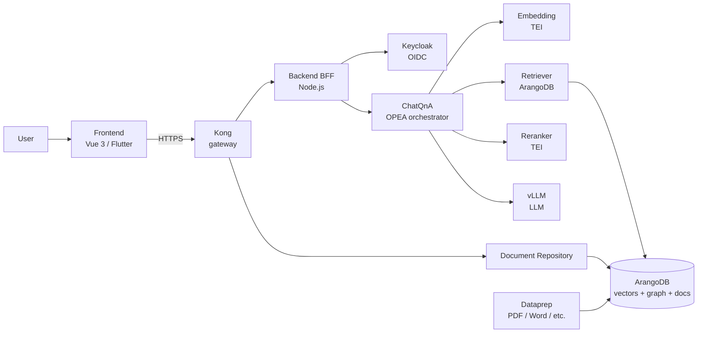

## GENIE.AI at a glance

One request travels: User → Frontend → Kong → Backend → ChatQnA →
{Embedding → Retriever → Reranker → vLLM} → streamed response back.
Documents are ingested through the Document Repository / Dataprep path
into ArangoDB.

## One paragraph

A user types a question into the chat. The question is turned into numbers
(**embedding**), the numbers are used to find the most relevant passages from
your indexed documents (**retrieval**), the top candidates are re-scored by a
specialised model (**reranking**), and the top ones are fed to a large
language model (**generation**) which writes a grounded answer in your
language (**translation** when the user's UI is not English).

## The five stages

| # | Stage | What it does | Where it runs |
|---|---|---|---|
| 1 | **Embedding** | Turns text into a 768-D vector | TEI embedding microservice |
| 2 | **Retrieval** | Hybrid vector + BM25 search over ArangoDB | Retriever microservice |
| 3 | **Reranking** | Re-scores the top candidates with a cross-encoder | Reranker microservice |
| 4 | **Generation** | LLM writes the answer from the top chunks | ChatQnA → vLLM |
| 5 | **Translation** *(optional)* | Translates the response to the user's UI locale | Translation microservice |

## The pieces you actually deploy

- **Frontend** — Vue 3 single-page app the citizen sees in the browser.
- **Backend (BFF)** — Node.js / Express that brokers auth, chat, and
  profile requests.
- **Mobile** — Flutter app for Android / iOS.
- **OPEA microservices** — Python / FastAPI services that do embedding,
  retrieval, reranking, generation, and translation.
- **ArangoDB** — graph + vector store for the knowledge base.
- **Keycloak** — identity provider (or any OIDC).
- **Kong / NGINX** — API gateway.
- **Victoria* + Grafana** — observability stack (optional).

## Sovereignty knobs

- **Models on your hardware** — vLLM and TEI run on your nodes; no model
  API key required.
- **Data stays home** — ArangoDB and the document store run in your
  perimeter.
- **Identity is yours** — Keycloak, or broker to any OIDC / SAML provider.
- **Telemetry is opt-in** — `ENABLE_OBSERVABILITY=1` switches it on;
  everything lands in self-hosted Victoria* stores.

## What's next

- Architecture diagrams → [Architecture overview](/docs/architecture/architecture/)
- RAG pipeline deep dive → [RAG pipeline → Pipeline architecture](/docs/rag-pipeline/pipeline/)
- Configurability → [Configuration reference](/docs/reference/env-vars/)

## Related

- [Welcome](/docs/get-started/welcome/)
- [Glossary](/docs/get-started/glossary/)
- [Quickstart: User](/docs/get-started/quickstart-user/)
- [Architecture overview](/docs/architecture/architecture/)