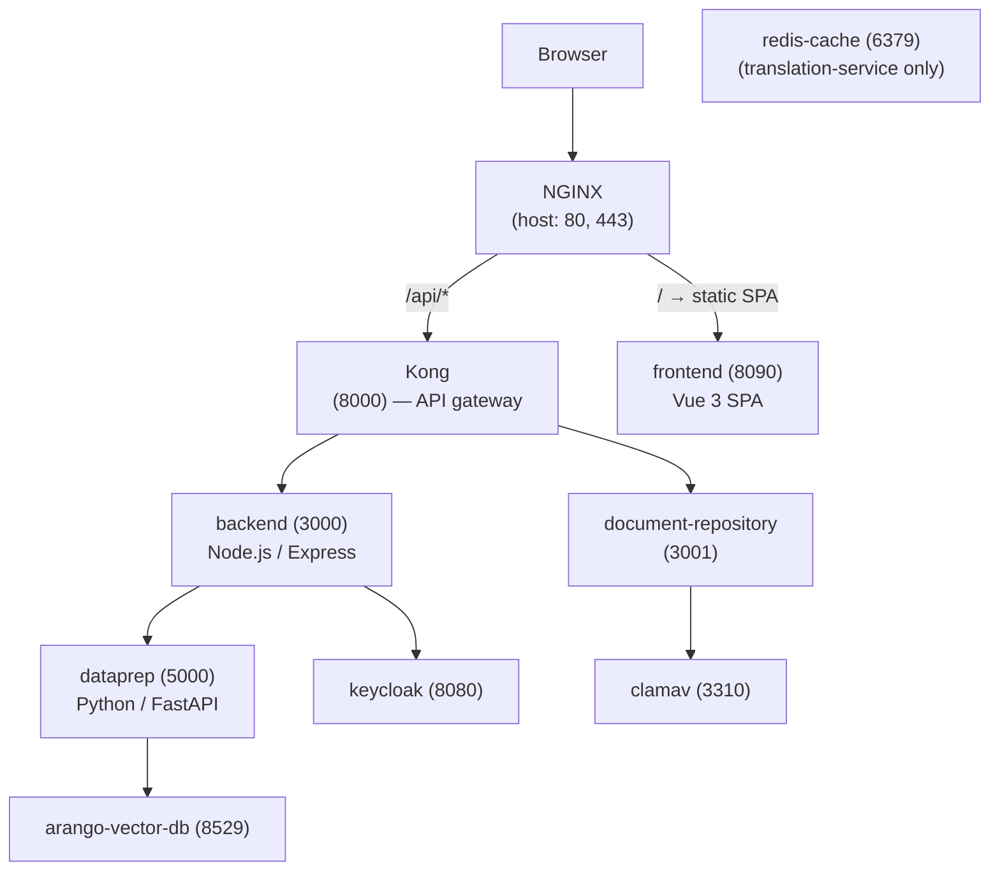

## Goal

In **30 minutes** you will have the GENIE.AI stack running in Docker Compose,
edited one source file in the service you care about, rebuilt only that
service's image, hit the change through NGINX to confirm it works, and run
the service's test suite green inside the running container. No GPU
services, no OPEA stack required.

The dev loop is **service-agnostic** — the same five commands work whether
you touched `components/gov-chat-backend` (Node.js), `gov-chat-frontend`
(Vue), `gov-chat-document-repository`, or `genie-ai-overlay/dataprep`
(Python). The only thing that changes is which `<service>` name you pass
to `docker compose`. Path B at the end covers the rarer case of adding
a brand-new route.

## Prerequisites

| What | Why | Verify |
|---|---|---|
| Docker Engine 23+ with Compose v2 | Container runtime + compose file format | `docker --version` (≥ 23) and `docker compose version` (v2.x) |
| 8 GB RAM free on the host | ArangoDB + Redis + Keycloak + PostgreSQL + Kong + NGINX + backend + frontend + document-repository | `free -h` |
| Git | Clone the repo | `git --version` |
| A POSIX shell | `bash`, `zsh`, or `fish` (examples use `bash`) | `echo $SHELL` |
| A code editor | Whatever your service uses — Node/Vue (backend/frontend), Dart (Flutter), Python (OPEA/dataprep) | VS Code, IntelliJ, Neovim, … |


You **do not** install Node.js / Python / Flutter on the host. The dev
loop runs each service inside its own container (`node:22`,
`python:3.11`, `flutter:3.10`), so the runtime version and native deps
match CI exactly. Skip `npm install` / `pip install` on the host.


## Architecture: where the service fits

Every service in `docker-compose.yaml` sits on a single overlay network.
Only **NGINX** publishes ports 80/443 to the host; every other service is
internal (Kong API gateway at 8000, backend at 3000, frontend at 8090,
document-repository at 3001, dataprep at 5000, etc.).



`docker-compose.yaml` declares the full topology. Each service has its own
`depends_on:` block that pulls in the minimum dep set, so `docker compose up
-d <service>` starts only what's needed for that service to run.

## Step 1 — Clone and seed `.env`

```bash
git clone https://opensource.unicc.org/un/itu/genie-ai.git
cd genie-ai

cp env .env
$EDITOR .env      # set at minimum:
                  #   ARANGO_PASSWORD, POSTGRES_PASSWORD,
                  #   KONG_DB_PASSWORD, KEYCLOAK_DB_PASSWORD,
                  #   KEYCLOAK_ADMIN_PASSWORD, KEYCLOAK_CLIENT_SECRET,
                  #   KC_DATAPREP_CLIENT_SECRET
```

**Never commit `.env`** — it is gitignored, contains secrets, and passwords
with characters like `+` or `)` break `source .env`. Extract individual
values with `grep ^KEY .env | cut -d= -f2-` instead.

## Step 2 — Start the dependency stack (no GPU)

```bash
docker compose up -d \
  postgres kong-migrations kong kong-config \
  keycloak keycloak-config postgres-init \
  arango-vector-db db-migrations \
  redis-cache clamav \
  backend frontend document-repository dataprep \
  nginx
```

What you are **not** starting: the `opea` / `gpu-models` profiles
(`vllm`, `tei`, `embedding`, `reranker`, `chatqna-xeon-backend-server`,
`translation`, …). Those need a GPU and are not on the dev path.

If you only need one service (e.g. frontend-only), bring up only the
required deps — `depends_on:` chains pull the rest:

```bash
# frontend-only: Compose pulls kong, keycloak-config, db-migrations automatically
docker compose up -d frontend

# document-repository only: pulls postgres, redis-cache, clamav, etc.
docker compose up -d document-repository
```

## Step 3 — Verify dependencies are healthy

```bash
docker compose ps
```

Healthy lines you should see (the exact set depends on which services
you started in Step 2):

| Service | Expected state | Why it matters |
|---|---|---|
| `postgres` | `running (healthy)` | Kong's DB |
| `kong-migrations`, `kong-config` | `exited (0)` | One-shots, prepare Kong schema + declarative config |
| `kong` | `running (healthy)` | API gateway |
| `keycloak` | `running (healthy)` | OIDC issuer |
| `keycloak-config` | `exited (0)` | One-shot, imports the `genie` realm |
| `postgres-init` | `exited (0)` | One-shot, creates Keycloak/Kong DBs |
| `arango-vector-db` | `running (healthy)` | Graph + vector store |
| `db-migrations` | `exited (0)` | One-shot, creates Arango collections |
| `redis-cache` | `running (healthy)` | Backend / dataprep cache |
| `clamav` | `running (healthy)` | Document-repository AV |
| `<the-service-you-care-about>` | `running (healthy)` | The thing you edit |
| `nginx` | `running (healthy)` | Host entry point |

While you wait for the one-shots (typically 10–30 s; `keycloak-config`
can take ~2 min the first time):

```bash
docker compose logs -f <service>                    # live tail
docker compose logs --tail=200 keycloak-config db-migrations   # one-shots
```

## Step 4 — Pick the service you touched

| You edited … | Service name | Build / recreate |
|---|---|---|
| `components/gov-chat-backend/` | `backend` | `docker compose build backend && docker compose up -d backend` |
| `components/gov-chat-frontend/` | `frontend` | `docker compose build frontend && docker compose up -d frontend` |
| `components/document-repository/` | `document-repository` | `docker compose build document-repository && docker compose up -d document-repository` |
| `genie-ai-overlay/dataprep/` | `dataprep` | `docker compose build dataprep && docker compose up -d dataprep` |
| `genie-ai-overlay/chatqna/` | `chatqna` (profile `opea` required) | `docker compose --profile opea build chatqna && docker compose up -d chatqna` |
| `genie-ai-overlay/embedding/` etc. | profile-gated OPEA services | rebuild the matching profile |
| `mobile/genie_ai_mobile/` | Flutter app | `cd mobile/genie_ai_mobile && flutter run -d <device>` (separate from Compose) |
| `components/shared/` (shared lib) | rebuild all images that depend on it | `grep -RE "FROM shared\|COPY.*shared" components/ genie-ai-overlay/` first |

The rest of this quickstart uses `<service>` — substitute your real service
name (`backend`, `frontend`, `document-repository`, `dataprep`, …).

## Step 5 — Edit the file

Open the source file you want to change in your editor. The host tree
is bind-mounted read-only at runtime, but the build **copies** the host
tree into the image — so any edit you save is picked up by the next
`docker compose build`.

A typical backend edit is a route handler:

```js
// components/gov-chat-backend/routes/<name>-routes.js
router.get('/api/<your-endpoint>', (req, res) => {
  res.json({ /* your change */ });
});
```

A typical frontend edit is a Vue component or a service module:

```vue
<!-- components/gov-chat-frontend/src/views/<YourView>.vue -->
<template>
  <!-- your change -->
</template>
```

A typical dataprep edit is a Python module:

```python
# genie-ai-overlay/dataprep/genieai_dataprep_arangodb.py
async def your_function(...):
    # your change
```

## Step 6 — Rebuild the `<service>` image

The host source tree is **not** bind-mounted at runtime — it is copied in at
**build** time. Every code change therefore needs a rebuild:

```bash
docker compose build <service>
```

Build context is `components/` (or `genie-ai-overlay/` for OPEA services);
the Dockerfile is `components/<service>/Dockerfile` (or
`genie-ai-overlay/<service>/Dockerfile`). First build is slow (~1 min);
subsequent builds are incremental thanks to BuildKit layer cache. To force
a cold rebuild (e.g. after `package.json` changes):

```bash
docker compose build <service> --no-cache
```

## Step 7 — Recreate the `<service>` container

```bash
docker compose up -d <service>
```

Compose tears down the old container, starts a fresh one from the new image,
and waits for the healthcheck. Watch it come up:

```bash
docker compose ps <service>                    # should be "running (healthy)" within ~30s
docker compose logs -f --tail=100 <service>    # exit with Ctrl-C
```

## Step 8 — Verify the change

How you verify depends on which service you touched:

**Backend / API changes** — hit through NGINX (the host entry point):

```bash
curl -sk https://localhost/<your-endpoint> | jq .
# or, with auth:
curl -sk https://localhost/<your-endpoint> -H "Authorization: Bearer $GENIE_TOKEN"
```

Mint a realm token first if your route is gated (see [Contribute →
Dev workflow](/docs/contribute/dev-workflow/) or `.claude/rules/SERVER-TESTING.md`).

**Frontend changes** — reload the browser (`Cmd-R` / `Ctrl-R`). NGINX serves
the rebuilt SPA on `https://localhost/`.

**Document-repository changes** — upload a test file via the admin UI
(`/api/admin/system-health` → Logs tab) or curl:

```bash
curl -sk -F "file=@/tmp/test.pdf" https://localhost/api/files/upload -H "Authorization: Bearer $GENIE_TOKEN"
```

**Dataprep / OPEA changes** — invoke directly via its OpenAI-compatible
endpoint (after `docker compose --profile opea up -d`):

```bash
curl -sk -X POST http://localhost:8888/v1/chatqna -H "Content-Type: application/json" \
  -d '{"messages":[{"role":"user","content":"hi"}]}'
```

If you do not see your edit, the most likely cause is that you skipped
Step 6 — go back and `docker compose build <service> && docker compose up -d
<service>`.

## Step 9 — Run tests

Each service bakes its own test runner into the image, so no host
install is needed. Exec into the running container:

```bash
# backend (Jest)
docker compose exec backend npm test

# backend targeted
docker compose exec backend npm run test:contract       # route handlers only
docker compose exec backend npm run test:coverage       # with coverage
docker compose exec backend npx jest __tests__/routes/<file>.test.js

# frontend (Vitest)
docker compose exec frontend npm test

# document-repository (Jest)
docker compose exec document-repository npm test

# dataprep / OPEA (pytest)
docker compose exec dataprep pytest
docker compose exec dataprep pytest tests/test_retriever.py   # one file

# Flutter
cd mobile/genie_ai_mobile && flutter test
```

A green run ends with `Test Suites: N passed, N total` (Jest) or
`N passed in X.Ys` (pytest) or `All tests passed!` (Vitest/Flutter).


`MODULE_NOT_FOUND` (Node) or `ModuleNotFoundError` (Python) inside the
container means the image is older than the host's
`package.json` / `requirements.txt` / `package-lock.json`. **Always
rebuild** before re-running tests: `docker compose build <service>
&& docker compose up -d <service>`.


## Path B — Add a brand-new route (backend-specific, optional)

If your change is **adding a route that didn't exist before** — not
editing an existing handler — you also need to register the new file
in the `ROUTE_CONFIGS` array in `components/gov-chat-backend/index.js`.
Skipping this step will leave your route returning 404 even after a
rebuild.

> Path B is **specific to the backend service** and **only needed
> when adding new routes**. Editing existing routes, services other
> than the backend, or non-route backend code does not require it.

### B.1 — Create the route file

Routes live in `components/gov-chat-backend/routes/<name>-routes.js` and
each exports an `express.Router()`:

```js
// components/gov-chat-backend/routes/dev-routes.js
'use strict';
const express = require('express');
const router = express.Router();

router.get('/api/dev/whoami', (req, res) => {
  res.status(200).json({
    status: 'ok',
    serverTime: new Date().toISOString(),
    uptimeSeconds: Math.round(process.uptime()),
    nodeVersion: process.version,
    git_sha: 'dev',
  });
});

module.exports = router;
```


Use `@swagger` JSDoc above each handler — `swagger-jsdoc` picks it up and
publishes it on `/api-docs`. See existing route files for the pattern.


### B.2 — Register in `ROUTE_CONFIGS`

```js
// components/gov-chat-backend/index.js
const ROUTE_CONFIGS = [
  // … existing entries …
  { file: 'dev-routes', paths: ['/api/dev'], serviceName: null },
];
```

Two flags:

- `serviceName: null` — no service dependency. The loader does
  `app.use(path, router)` directly.
- `keycloakAuth: true` — add it when the route must reject anonymous
  calls. Internally this adds `keycloakAuthMiddleware.authenticate` in
  front of your router. Skip for public endpoints (`/api/health`,
  `/api/dev/whoami`).

### B.3 — Verify and test

Re-run Steps 6–9:

```bash
docker compose build backend && docker compose up -d backend
curl -sk https://localhost/api/dev/whoami | jq .
docker compose exec backend npm test -- --testPathPattern=dev-routes
```

If you get 404, the most likely cause is missing the `ROUTE_CONFIGS`
entry — `docker compose logs backend | grep "Mounting dev-routes"`
should show your file mounted. If not, the route is registered but the
prefix doesn't match.

## What's next

- **Where to put a new route** — [Backend → API contracts](/docs/reference/api-contracts/).
- **Branching, commits, and the test pyramid** — [Contribute → Dev workflow](/docs/contribute/dev-workflow/).
- **Open a merge request** — [Contribute → How to open a MR](/docs/contribute/how-to-mr/).
- **OTel spans in your route** — [Observe → Tracing](/docs/observe/tracing/).
- **Trace failures end-to-end** — [Observe → Dashboards](/docs/observe/dashboards/).
- **Service topology in detail** — [Architecture → Overview](/docs/architecture/architecture/).
- **Full bring-up including TLS and secrets** — [Quickstart: Deployer](/docs/get-started/quickstart-deployer/).

## Tips

- **Live-reload logs** — `docker compose logs -f --tail=200 <service>` shows
  stdout/stderr as it flows. Add `--no-log-prefix` to drop the `[service]`
  prefix when grepping.
- **Shell into the running container** — `docker compose exec <service> sh`
  gives you a debug shell with the source tree mounted read-only at `/app`.
  For backend: `node -e "require('./routes/dev-routes')"` to verify a route
  file parses.
- **Reset one service** — `docker compose restart <service>` reuses the
  current image; `docker compose up -d --force-recreate <service>`
  rebuilds the container without rebuilding the image.
- **Skip the rest of the stack** — bring up only the deps you need:
  `docker compose up -d backend` pulls `arango-vector-db`, `redis-cache`,
  `clamav`, `keycloak-config`, `db-migrations` automatically through
  `depends_on:`.
- **Iterate faster** — `docker compose build --no-cache <service>` rebuilds
  a single service from scratch (skip the rest of the stack). Pin the
  cache with `BUILDKIT_CACHE_DIR` (Compose dev only — for Swarm/registry
  cache see the [install guide](/docs/deploy/install-guide/)).
- **Skip the wait** — most one-shots run in 10–30 s. `keycloak-config`
  can take ~2 min the first time it imports the realm.
- **Frontend hot-reload** — `docker compose up -d frontend` rebuilds and
  reloads the SPA. For component-only changes, the browser refresh is
  enough; for build-config changes (vue.config.js, package.json),
  rebuild the image.

## Troubleshooting

| Symptom | Likely cause | Fix |
|---|---|---|
| `docker compose build <service>` re-downloads every layer | BuildKit cache evicted (after `docker system prune`, low disk) | Run once to warm the cache; subsequent builds are incremental. Pin the cache with `BUILDKIT_CACHE_DIR`. |
| `docker compose up -d <service>` shows `Up` but never reaches `healthy` | Old container still holding the network alias, or stale image | `docker compose down <service> && docker compose up -d <service>`. If still stuck, `docker image rm <image-sha> && docker compose build <service>`. |
| Edit does not appear at the endpoint | Skipped the rebuild — host source is **build-time** copy, not bind-mount | Re-run Steps 6–7 (`docker compose build <service> && docker compose up -d <service>`). |
| `npm test` crashes with `MODULE_NOT_FOUND` (backend/frontend) or `ModuleNotFoundError` (dataprep) | Image built before a `package.json` / `requirements.txt` change landed on the host | Rebuild: `docker compose build <service> && docker compose up -d <service>`, then re-run the test. |
| NGINX returns 502 / 503 | A dependency is not healthy (most often `keycloak-config` or `db-migrations` still running) | `docker compose ps` and wait for the one-shots to reach `exited (0)` and the rest to be `(healthy)`. |
| `curl https://localhost/api/<endpoint>` returns 404 | Route not registered in `ROUTE_CONFIGS` (Path B), or path mismatch, or container was not rebuilt | Verify `index.js` has the new `ROUTE_CONFIGS` entry, the path matches, and you ran Steps 6–7. `docker compose logs backend \| grep "Mounting <file>-routes"`. |
| Port 80 / 443 already in use on the host | Another web server or leftover container | `sudo lsof -iTCP:80 -sTCP:LISTEN` to find the offender; stop it or remap `NGINX_HTTP_PORT`/`NGINX_HTTPS_PORT` in `.env`. |
| Host edit picked up by the **wrong** service | You edited `components/shared/` (used by multiple images) and only rebuilt one | `grep -R "<file>" components/*/Dockerfile* genie-ai-overlay/*/Dockerfile*` to find dependents, rebuild each. |
| `docker compose exec <service>` returns `Error response from daemon: Container ... is not running` | The service container crashed on boot | `docker compose logs <service>` — most often a missing `.env` secret or a syntax error. |
| Backend test reaches the real ArangoDB and hangs | Accidentally ran `npm run setup-db` instead of `npm test`, or a test imports a setup script | The default Jest config does not load setup scripts — verify you used `npm test`. For tests against the real DB, see `tests/` (not `__tests__/`). |

## Related

- **Deploy the stack to a Swarm cluster** — [Quickstart: Deployer](/docs/get-started/quickstart-deployer/) (adds TLS, secrets, observability).
- **Pick the right env-var profile for your hardware** — [Deploy → Topologies](/docs/deploy/topologies/) (single-host, Swarm 2-node / 3-node, remote GPU).
- **Understand the request flow you just debugged** — [Architecture → Overview](/docs/architecture/architecture/).