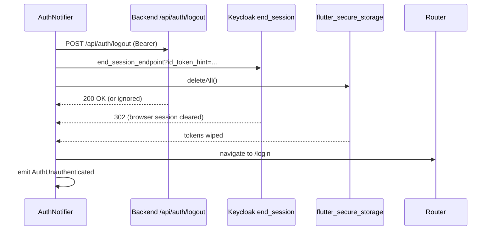

## Overview

This document describes how the GENIE.AI mobile app authenticates users against Keycloak — from the user tapping **Sign In** to logout cleaning up every credential on the device. It is written for two audiences:

- **End users / admins** who need to know what the user sees and what the deployer must configure.
- **Mobile developers** integrating or debugging the auth pipeline.

The wire protocol and code paths are in [Mobile Architecture](/docs/mobile/mobile-architecture/) §6 (Security). The OIDC client configuration and scheme coherence rules are in [Mobile Deployment Guide](/docs/mobile/mobile-deployment-guide/) Steps 1-3.

## Prerequisites

| Requirement | Why |
|-------------|-----|
| Running GENIE.AI stack with a reachable Keycloak | OIDC discovery + token endpoints |
| Mobile OIDC client created (`genie-mobile-<institution>`) | See [Mobile Deployment Guide §2](/docs/mobile/mobile-deployment-guide/#step-2-keycloak-client) |
| Matching redirect scheme across the 5 layers | See [Mobile Deployment Guide §3](/docs/mobile/mobile-deployment-guide/#step-3-scheme-coherence-rule) |
| App built with `--flavor <flavor>` | The flavor selects which Keycloak URL and client ID the app uses at startup |

## 1. Login — what the user sees

The OIDC login flow uses **PKCE with S256** and a public client (no client secret, per [RFC 8252 — OAuth 2.0 for Native Apps](https://datatracker.ietf.org/doc/html/rfc8252)). All steps happen in the system browser, not inside the app — there is no embedded WebView.

| # | What happens | Visible artefact |
|---|--------------|------------------|
| 1 | User opens the app, lands on `OidcLoginScreen` (`lib/components/auth/oidc_login_screen.dart`). | Login screen with branding |
| 2 | User taps **Sign In**. The app calls `KeycloakService.authorize()`. | Screen transitions to "Opening browser…" |
| 3 | `flutter_appauth` opens the system browser (Chrome Custom Tabs on Android, `ASWebAuthenticationSession` on iOS) at `${keycloakUrl}/realms/${realm}/protocol/openid-connect/auth`. | Browser opens to the Keycloak login page |
| 4 | User enters credentials (username + password) and submits. The system browser completes the auth. | Browser shows the consent / "You're signed in" page |
| 5 | Keycloak redirects the browser to `<redirectScheme>://callback?code=…&state=…`. | Browser briefly shows "Opening app…" then dismisses |
| 6 | `flutter_appauth` parses the redirect and exchanges the code for tokens at Keycloak's token endpoint. | App shows the chat screen |
| 7 | `AuthNotifier` persists tokens in `flutter_secure_storage` and emits `AuthAuthenticated`. | Authenticated home screen |

> **PKCE = Proof Key for Code Exchange** ([RFC 7636](https://datatracker.ietf.org/doc/html/rfc7636)). The app generates a `code_verifier` (random string), sends its SHA-256 hash (`code_challenge`) with the auth request, and proves possession of the verifier when exchanging the code. S256 = SHA-256 challenge method. This blocks authorization-code interception attacks (a malicious app on the same device cannot redeem a captured code without the verifier).

## 2. Token storage

Tokens are stored in `flutter_secure_storage`, which uses platform-secure storage:

| Platform | Backend |
|----------|---------|
| iOS | Keychain (`kSecAttrAccessibleAfterFirstUnlockThisDeviceOnly`) |
| Android | `EncryptedSharedPreferences` (AES-256 GCM) |

`TokenStorage` (`lib/services/auth/token_storage.dart`) writes a JSON blob with three tokens plus the access-token expiry:

```json
{
  "access_token": "eyJ…",
  "refresh_token": "eyJ…",
  "id_token": "eyJ…",
  "access_token_expiration": "2026-09-18T14:23:11.000Z"
}
```

The expiry timestamp is read directly from Keycloak's token response (`accessTokenExpirationDateTime` returned by `flutter_appauth`). If the field is absent, the code falls back to `now + 3600s` (1 hour). No clock-skew adjustment is applied — drift is absorbed by the proactive `validateTokens()` check on app resume.

## 3. Token refresh — transparent on 401

Every backend call goes through `AuthInterceptor` (`lib/services/auth/auth_interceptor.dart`). When the backend returns 401, the interceptor:

1. Calls `AuthNotifier.refreshTokens()`.
2. **If a refresh is already in flight**, waits on the same `Completer<TokenSet?>` rather than issuing a parallel refresh (single-flight mutex — prevents Keycloak's refresh-token rotation from invalidating a just-rotated token).
3. **On refresh success**, retries the original request once with the new access token.
4. **On second 401** (refresh failed), throws `AuthException` → `AuthNotifier` emits `AuthError(retryable: false)` → UI shows "Session expired, please sign in again".

The user **never sees the refresh happen** unless the refresh token itself has been revoked (e.g. by `/api/auth/logout` from another device, or by an idle period exceeding Keycloak's `ssoSessionMaxLifespan`).

### Refresh token rotation

Keycloak's mobile OIDC client in `configs/keycloak/genie-realm.yaml` declares `client.credentials.use.refresh.token: true`, which enables this client to **use** refresh tokens. Whether the realm rotates refresh tokens on use depends on the realm-level `revoke.refresh.token.on.use` policy, which is **not** currently set in the committed realm YAML. Stolen refresh tokens are therefore not guaranteed to have a single-use window until that policy is enabled — the `AuthInterceptor` single-flight mutex still prevents the client from issuing a redundant refresh that would otherwise race against itself.

## 4. Token validation on resume

`AuthNotifier.didChangeAppLifecycleState(state)` (`auth_notifier.dart:564`) is wired to Flutter's `WidgetsBindingObserver`. When `state == AppLifecycleState.resumed` **and** the user is currently `authenticated`, the notifier calls `validateTokens()`:

1. Read the access token's expiry from storage.
2. If the stored access token has already expired (past `access_token_expiration`), call `refreshTokens()` proactively — **before** any 401 fires. Still-valid tokens are NOT pre-refreshed by this path.
3. If refresh fails (network offline, refresh token revoked), degrade to `AuthError(retryable: true)` and surface a "Reconnect and retry" banner.

This proactive check avoids the user seeing a 401 mid-tap when resuming a long-backgrounded session whose token expired while in the background.

## 5. Error classes

`AuthNotifier` emits typed errors via `AuthError.errorMessage`. The `retryable` flag controls whether a "Retry" button is shown.

| Error | When | Retryable | User-visible recovery |
|-------|------|-----------|----------------------|
| `AUTH_NETWORK_OFFLINE` | No network or DNS failure during discovery | yes | Wait for connectivity (auto-retries via `ConnectivityService`) |
| `AUTH_NETWORK_OFFLINE_MID_OP` | Network dropped after the browser opened but before tokens arrived | yes | Tap Retry once connectivity returns |
| `AUTH_TIMEOUT` | OIDC authorize/token request exceeded its timeout | yes | Tap Retry |
| `DISCOVERY_TIMEOUT` | OIDC discovery endpoint unreachable / slow | yes | Wait for the stack to come back up; retry button available |
| `AUTH_DISCOVERY_FAILED` | OIDC discovery endpoint returned non-2xx | yes | Wait for the stack to come back up; retry button available |
| `AUTH_MALFORMED_RESPONSE` | Token endpoint returns non-JSON or missing `access_token` | no | Log out and sign in again |
| `AUTH_FAILED` | Generic authorize failure (no access token in response) | no | Log out and sign in again |
| `AUTH_PLATFORM_ERROR` | `flutter_appauth` raised a platform exception | yes | Tap Retry |
| `REFRESH_FAILED` | Refresh-token exchange returned an error | no | Log out and sign in again |
| `REFRESH_DISCOVERY_FAILED` | Refresh-path OIDC discovery failed (`AuthNotifier` silently transitions to `AuthUnauthenticated`) | no | Log out and sign in again |
| `REFRESH_DISCOVERY_TIMEOUT` | Refresh path could not run OIDC discovery in time | yes | Tap Retry |
| `REFRESH_TIMEOUT` | Refresh request exceeded 15s (`refreshTokenTimeout` at `auth_notifier.dart:44`) | yes | Tap Retry |
| `REFRESH_NETWORK_OFFLINE` | Network drop during refresh request | yes | Tap Retry once connectivity returns |
| `REFRESH_NETWORK_OFFLINE_MID_OP` | Network dropped mid-refresh | yes | Tap Retry once connectivity returns |
| `REFRESH_MALFORMED_RESPONSE` | Refresh token endpoint returns non-JSON or missing `access_token` | no | Log out and sign in again |
| `User cancelled (no error code)` | User dismissed the system browser without completing | n/a | Tap Sign In again — `AuthNotifier` transitions directly to `AuthUnauthenticated` with a log line `"Authorization cancelled by user"` |

For a 500ms-debounce auto-retry on connectivity restore, see `ConnectivityService` (`lib/services/connectivity_service.dart`) — when connectivity returns, in-flight auth attempts resume without user intervention.

## 6. Logout — the complete sequence

A single **Log Out** tap fires **three operations in parallel** to make sure no credential lingers:



| Operation | Purpose | Failure handling |
|-----------|---------|------------------|
| Backend `POST /api/auth/logout` | Invalidates the backend-side session record | Logged but does **not** abort the sequence |
| Keycloak `end_session_endpoint?id_token_hint=…` | RP-initiated logout — Keycloak invalidates its session cookie | Logged but does **not** abort the sequence |
| `flutter_secure_storage.deleteAll()` | Wipes access / refresh / ID tokens from device secure storage | Should never fail; logged if it does |

After the three operations return, the router pushes the unauthenticated route (`OidcLoginScreen`) and `AuthNotifier` emits `AuthUnauthenticated`. The next launch reads storage, finds no tokens, and emits `AuthUnauthenticated` immediately.

> **Why `id_token_hint`?** RFC 7009 specifies that the ID token is the most reliable way to identify which session to terminate. Without it, Keycloak cannot end the SSO session server-side, leaving the user logged into Keycloak on subsequent visits.

## 7. Failure modes and debug checklist

| Symptom | Likely cause | First check |
|---------|--------------|-------------|
| Login screen stuck on "Opening browser…" | `flutter_appauth` cannot find a browser handler | Confirm the device has a default browser; re-install the app |
| Browser opens but app never receives the callback | Scheme mismatch between Dart / Gradle / XCConfig / `.env` / Keycloak | Run [Mobile Deployment Guide §3 verification](/docs/mobile/mobile-deployment-guide/#step-3-scheme-coherence-rule) |
| Login succeeds but every API call returns 401 | Backend cannot reach Keycloak to validate tokens | `docker compose logs backend \| grep -i 'jwks\|keycloak'` |
| Token refresh fails silently after backgrounding | Refresh token rotated beyond max idle lifespan | Sign in again; check Keycloak `ssoSessionMaxLifespan` |
| Logout returns to login but Keycloak SSO still shows the user logged in | `end_session` not invoked (logout sequence skipped) | Verify the logout tap goes through `AuthNotifier.logout()`, not a UI-only navigate |
| `AUTH_MALFORMED_RESPONSE` after Keycloak restart | Stale `discovery.json` cache | Force-stop the app; the next launch re-runs OIDC discovery |
| Android 12+: "No stored state" on the callback | `RedirectUriReceiverActivity` task affinity mismatch | `AndroidManifest.xml` already pins `taskAffinity="${applicationId}"`; if you customised the manifest, restore it |

## 8. Programmatic verification

For automated tests, the canonical E2E login flow lives at `mobile/genie_ai_mobile/CLAUDE.md#Verify OIDC Login Flow` and uses Patrol to drive a real device through the OIDC redirect. For backend-side auth checks (token validation, JWKS rotation), see [API Contracts (backend)](/docs/backend/api-contracts-backend/).

## Related

- [Mobile Architecture](/docs/mobile/mobile-architecture/) — `AuthNotifier` lifecycle, providers, security features.
- [Mobile Deployment Guide](/docs/mobile/mobile-deployment-guide/) — Step 2 (Keycloak client), Step 3 (scheme coherence), Step 7 (validation).
- [API Contracts (backend)](/docs/backend/api-contracts-backend/) — `/api/auth/logout` shape, `/api/me` token validation.
- [Mobile CONTRIBUTING](/docs/mobile/mobile-deployment-guide/#contributor-concerns-dev-only) — developer-side login flow debugging.
