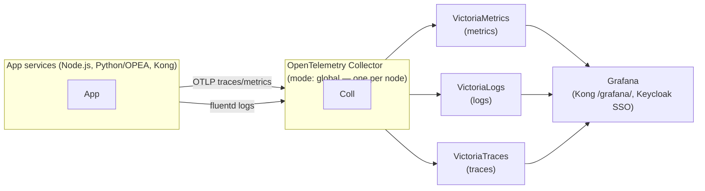

GENIE.AI is observable by default for production deployments: every application
service emits OpenTelemetry telemetry (metrics, logs, traces), which a central
collector funnels into a purpose-built storage trio and a Grafana front end. The
result is a single pane where operators can see service health, search logs,
trace a request end-to-end across the RAG pipeline, and get alerted before things
break.

The stack has **two layers** with different defaults. VictoriaLogs and the OTel
Collector are **always-on** (the admin logs UI queries VL directly and every
container ships logs via the fluentd driver). The in-app OTel SDK is **opt-in**
via `ENABLE_OBSERVABILITY=1` in `.env`. Profile-gated services (Grafana,
VictoriaMetrics, VictoriaTraces, tempo-proxy) come up with `--profile
observability` in Compose, or `ENABLE_OBSERVABILITY=1` in Swarm.

## Architecture at a glance

Three signals, three stores, one query layer. Each store is a single-node
Victoria* binary — operationally simple, no separate cluster to run.

## Cross-signal pivots

Traces, logs, and metrics share identifiers, so you can move between them in
either direction:

- **trace_id** on every log line touched by a request — see
  [Trace ↔ log correlation](#reading-a-trace).
- **service.name** on every log line (used as the dedup key for the
  cross-service admin/logs view).

## Pages in this section

- [Overview]() — the full stack, data flow, and how it
  is wired together.
- [Tracing]() — W3C `traceparent` propagation, the RAG
  pipeline span taxonomy, and how a `trace_id` links traces and logs.
- [Dashboards]() — the pre-built Grafana dashboards
  (9 in total) and how to pivot between them.
- [Alerting]() — built-in alert rules and what they
  catch.
- [Configuration]() — environment variables,
  retention, sampling, and enabling/disabling the stack.

## Design principles

- **OpenTelemetry-native.** No vendor lock-in: the SDK, the wire format, and the
  collector are all OTel. Swapping a storage backend is a collector config
  change, not an instrumentation change.
- **Three signals, cleanly separated.** Metrics, logs, and traces each have their
  own store optimised for that signal, rather than one overloaded system.
- **PII-safe by construction.** Sensitive attributes (tokens, passwords, user
  PII) are filtered out of span attributes before export. See
  [Tracing]().
- **One collector per node.** The collector runs in Docker Swarm `mode: global`
  so logs from every node (gateway, genieai, gpu) are collected regardless of
  where a service lands.
