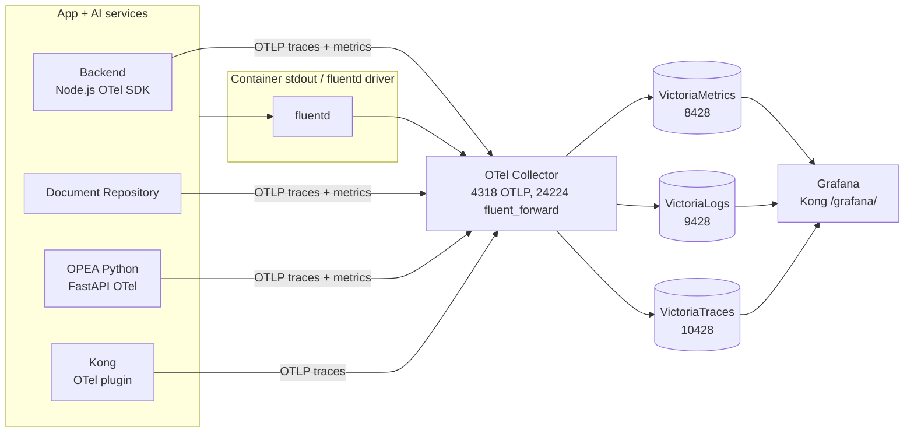

The observability stack is **disabled by default**. Enabling it is a single
environment variable, but a handful of related variables control access,
retention, and sampling.

**Prerequisites:** an existing GENIE.AI deploy with an editable `.env` file.
See the deployment guides for setup —
[Docker Swarm Setup]() or
[Docker Compose Setup]().
Also: ensure enough disk for the retention windows below (defaults are 30
days of metrics, logs, and traces).

## Telemetry pipeline

Three signal paths converge on the OTel Collector: (1) app and OPEA SDKs
push traces + metrics over OTLP, (2) Kong pushes traces via its OTel
plugin, (3) every container's stdout/stderr is tailed by the fluentd
log driver and forwarded over `fluent_forward` (port 24224,
localhost-only). The Collector fans out to the three Victoria* stores;
Grafana queries all three behind `/grafana/`.

## Enabling

| Variable | Default | Required | Notes |
|---|---|---|---|
| `ENABLE_OBSERVABILITY` | `0` | No | **Must be `0` or `1`** (not `true`/`false`). |
| `OTEL_EXPORTER_OTLP_ENDPOINT` | `http://otel-collector:4318` | No | OTLP base URL instrumented services export traces + metrics to. The collector appends `/v1/traces` and `/v1/metrics` itself. Override only for an external collector. |
| `OTEL_EXPORTER_OTLP_LOGS_ENDPOINT` | `http://otel-collector:4318/v1/logs` | No | OTLP logs endpoint (backend + doc-repo + OPEA). Setting the signal-specific endpoint makes the SDK use it as-is instead of appending `/v1/logs` to `OTEL_EXPORTER_OTLP_ENDPOINT`. |
| `OTEL_EXPORTER_OTLP_TRACES_ENDPOINT` | `grpc://127.0.0.1:4317` | No | Legacy OTLP gRPC traces endpoint (pre-OTel-Collector setup). Leave at default unless you have a specific reason to use gRPC. |

### How it is enabled per deployment mode

- **Docker Compose** — `docker compose --profile observability up -d`. The
  profile gates `victoriametrics`, `victoriatraces`, `tempo-proxy`, and
  `grafana`. The OTel Collector and VictoriaLogs are **always on** (the
  Collector is required for the fluentd logging driver to ship container logs,
  and VictoriaLogs is required by the admin log endpoints).
- **Docker Swarm** — `ENABLE_OBSERVABILITY=1` in `.env`. The same four
  services scale from `replicas: 0` to `replicas: 1`; the Collector and VL
  are always on.
- **Ansible** — `enable_observability: "1"` in `group_vars/all.yml` (the
  playbook provisions the Grafana dashboards and provisioning only when the
  flag is `1`).

## Sampling

| Variable | Default | Honored? | Notes |
|---|---|---|---|
| `OTEL_TRACES_SAMPLER_RATE` | 100.0 | Yes | Probability percentage applied by the collector's `probabilistic_sampler` processor. Lower for high-volume prod; raise when diagnosing. Metrics and logs are not sampled. |
| `KONG_TRACING_SAMPLING_RATE` | 1.0 | **No** | Declared for future use. The Kong OTel plugin config in `api-gateway-solution/new-config/kong_config.json` hardcodes `sampling_rate: 1.0`, and `restore-kong-config.sh` never PATCHes `config.sampling_rate` from the env var. Treat the Kong sampling rate as fixed at 1.0 today. |
| `KONG_TRACING_INSTRUMENTATIONS` | `request` | **No** | Injected into the Kong container's environment by `docker-compose.yaml:234` and `deploy/ansible/templates/env.j2:232`, but the Kong OTel plugin schema does not expose an `instrumentations` field — neither in `kong_config.json` nor in `restore-kong-config.sh`. The env var has no effect on what spans Kong emits. |

## Retention

Each Victoria store keeps data for a configurable window; lower it to save
disk, raise it for longer historical analysis.

| Variable | Default | Effect |
|---|---|---|
| `VICTORIAMETRICS_RETENTION` | `30d` | Metrics retention period. |
| `VICTORIALOGS_RETENTION` | `30d` | Logs retention period. |
| `VICTORIATRACES_RETENTION` | `30d` | Traces retention period. |

## Grafana access

Grafana is served behind the Kong gateway at `/grafana/` (no direct host port
exposed) with Keycloak OIDC SSO.

| Variable | Default | Required | Notes |
|---|---|---|---|
| `GRAFANA_PORT` | `3002` | No | Optional local-debug host port (default of `${GRAFANA_PORT:-3002}` is **commented out** in `docker-compose.yaml:1903-1905`). Grafana is normally reached via Kong `/grafana/`. Uncomment the `ports:` block for local debugging only. |
| `GRAFANA_ADMIN_USER` | `admin` | No | Local admin username (break-glass only — the login form is disabled by `GF_AUTH_DISABLE_LOGIN_FORM=true`). |
| `GRAFANA_ADMIN_PASSWORD` | _(empty)_ | **Yes, when enabled** | Local admin password. |
| `KC_GRAFANA_CLIENT_ID` | `grafana` | No | Keycloak OIDC client id for Grafana SSO. Created by `keycloak-config-cli`. |
| `KC_GRAFANA_CLIENT_SECRET` | _(empty)_ | **Yes, when enabled** | Keycloak OIDC client secret. |

> **SSO is the intended access path.** The local admin is a break-glass
> account; day-to-day access goes through Keycloak, so access is governed by
> the same identity provider as the rest of the platform.

### Verify SSO works

1. Browse to `https://<your-domain>/grafana/`.
2. You should be redirected to the Keycloak realm login — sign in with a
   realm user.
3. After login you land in Grafana with your Keycloak username.
4. If the **local admin login form** appears instead of the Keycloak redirect,
   `KC_GRAFANA_CLIENT_SECRET` is wrong (or `KC_GRAFANA_CLIENT_ID` does not
   match what `keycloak-config-cli` created).

## Collector placement

The OTel Collector runs in Docker Swarm `mode: global` with **no node
placement constraint** — one collector on **every** node (gateway, genieai,
gpu). **You do not need to do anything for collector placement** — the stack
already runs one collector per Swarm node, so container logs are captured
regardless of where the scheduler lands a service.

The collector's `fluent_forward` receiver (port 24224) is bound to
`0.0.0.0:24224` inside the container, but the Swarm port mapping is
`mode: host, host_ip: 127.0.0.1`, so only the local Docker daemon can push
container logs into it. External log injection is blocked by design.

> Verify on the **Observability stack health** dashboard — `otelcol_*` metrics
> are non-zero from every Swarm node.

## Disabling

Set `ENABLE_OBSERVABILITY=0` (Swarm) or omit the `observability` profile
(Compose). What stops and what does not:

- **Always-on regardless of the flag** — `otel-collector` (the fluentd logging
  driver needs it) and `victorialogs` (admin endpoints depend on it).
- **Gated by the flag** — `victoriametrics`, `victoriatraces`, `tempo-proxy`,
  and `grafana` scale to `replicas: 0` and are not started under the
  `observability` profile.

The Collector continues to receive OTLP, but every exporter is configured
with `sending_queue` and `retry_on_failure`, so traces/logs/metrics are
**buffered on disk** (file-backed for traces) and retried — telemetry is not
lost unless the queue is full. Application services continue to run
unaffected.

> **Practical consequences of disabling.** Grafana dashboards stop refreshing
> (Grafana is off); the **OTel Collector Down** alert will fire (no
> VictoriaMetrics to scrape — silence the rule while observability is off, or
> the on-call channel gets woken up nightly). Backend log records continue to
> reach VictoriaLogs (always-on), so the Admin Logs UI keeps working.

## Config file locations

| Artifact | Path |
|---|---|
| Collector config | `configs/otel/otel-collector-config.yaml` |
| Grafana datasources | `configs/grafana/provisioning/datasources/` |
| Grafana dashboards | `configs/grafana/provisioning/dashboards/` |
| Grafana alerting | `configs/grafana/provisioning/alerting/` |
| OTel integration guide | `configs/otel/README.md` |

## Next steps

Once enabled, open Grafana → Dashboards to confirm the 9 dashboards are
present (see [Dashboards]()), then visit
[Alerting]() to wire a contact point and confirm the
alert chain is live.