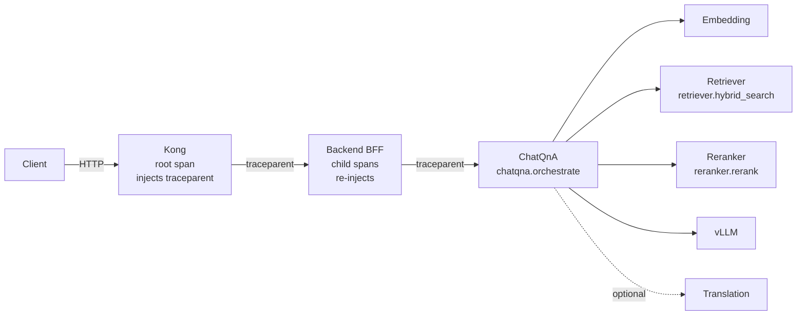

Tracing is what makes a GENIE.AI user query legible. Because every service
propagates a single W3C `traceparent` header and every RAG stage emits a span,
one user question produces one contiguous trace that can be read end-to-end in
Grafana — revealing exactly where time went and which chunks were retrieved.

## Trace propagation

The trace starts at the edge. Kong creates the root span and injects a
`traceparent` header into the request. Each downstream hop reads that header,
joins the trace as a child span, and re-injects the header for the next hop:

```
Client → Kong (root span, injects traceparent)
       → Backend BFF (auth + handler spans, re-injects)
       → ChatQnA (chatqna.orchestrate span, re-injects)
          → Embedding / Retriever / Reranker / LLM / Translation
            (FastAPI auto-spans + manual spans per service)
```



Every edge carries the same W3C `traceparent`; every hop becomes a child
span under that trace.

> **How to read the diagram.** Kong opens the trace (the **root span**) and
> tags every downstream call with the same trace id via the W3C `traceparent`
> header. Each hop becomes a **child span** under the same trace, so the whole
> user query reads as one tree in the trace explorer.

This is plain W3C Trace Context — no GENIE.AI-specific protocol — so standard
OTel tooling and Jaeger clients interoperate. **Note:** the OTel Collector
rewrites Kong spans from `kong` to `METHOD /path` via the
`transform/kong_span_names` processor — for matched routes, where Kong sets
`http.route`. For unmatched paths (e.g. 404 fallbacks without an
`http.route` attribute), the span may keep the literal name `kong`. Use the
HTTP method + route when searching; fall back to `kong` if the route search
yields no results (see [Reading a trace](#reading-a-trace) below).

## Span taxonomy

### Backend (Node.js) — `tracing.withSpan(name, fn)`

Created via the shared wrapper (never the global tracer). Key spans cover
Express request handling, middleware, and ArangoDB queries (instrumented in
`tracing-db.js`). Backend metrics are emitted by `metrics-middleware.js`:

| Instrument | Type | Attributes |
|---|---|---|
| `http_requests_total` | Counter | `http.method`, `http.status_code`, `http.route` (route template — no PII). |
| `http_request_duration_seconds` | Histogram | Same as above, units in seconds. |
| `log_record_dropped_total` | Counter | `reason` ∈ `{queue_full, otlp_unreachable, observability_disabled}` (cardinality-bounded enum from `metrics.js`). |

### Dataprep (Python/OPEA) — `with with_span(name, attributes={…}) as span:`

| Span | Phase | Key attributes |
|---|---|---|
| `dataprep.ingest` | ingest entry | `dataprep.file_type`, `dataprep.file_size_bytes`, `dataprep.file_id` |
| `dataprep.retract` | retract entry | `dataprep.file_id` |
| `dataprep.chunking` | docling + chunk | `dataprep.chunk_count` |
| `dataprep.llm.label_chunk` | single-chunk label call | `dataprep.chunk_index`, `dataprep.llm_attempt`, `dataprep.llm_batched=False`, `dataprep.llm_model`, `dataprep.labels_suggested`, `dataprep.llm.completion_tokens` |
| `dataprep.llm.label_batch` | batched label call | `dataprep.llm_batched=True`, `dataprep.llm_batch_size`, `dataprep.chunk_indices`, `dataprep.llm_model`, `dataprep.labels_suggested`, `dataprep.llm.completion_tokens`, `dataprep.llm.prompt_tokens` |

The `dataprep.llm_batched` attribute is what makes labelling-throughput
regressions visible — single-chunk vs batched label calls are distinguishable
in the trace explorer.

### Retriever (Python/OPEA)

| Span | Key attributes |
|---|---|
| `retriever.hybrid_search` | `rag.search_mode`, `rag.top_k`, `rag.chunk_count` |

### Reranker (Python/OPEA)

| Span | Key attributes |
|---|---|
| `reranker.rerank` | `reranker.strategy`, `reranker.model_id`, `reranker.input_doc_count`, `reranker.output_doc_count` |
| `reranker.tei_invoke` (TEI backend only) | `reranker.strategy`, `reranker.top_n`, `reranker.score_threshold`, `reranker.model_id`, `reranker.input_doc_count` + the TEI request/response timing. |

> **calibrated scores.** the post-temperature-scaled confidence values the
> reranker emits (see `RERANKER_SCORE_TEMPERATURE` in the configuration docs).
> They are emitted on the rerank result list, not as span attributes — look for
> them in the trace payload of the `reranker.rerank` span.

### ChatQnA (Python/OPEA)

| Span | Purpose |
|---|---|
| `chatqna.orchestrate` | Root per-request span inside ChatQnA (FastAPI auto-span wraps it). |
| `chatqna.reranker_selection` | Internal alignment of candidate vs selected chunks (drives the retrieval-quality eval harness via `rag.candidate_chunk_keys` / `rag.selected_chunk_keys`). |

> **Important.** ChatQnA does **not** emit per-stage spans for embed, retrieve,
> rerank, generate, or translate. Each of those stages is an HTTP call to a
> separate microservice (retriever, reranker, embedding, vLLM, translation),
> and each target service emits its own span via FastAPI auto-instrumentation
> or its manual spans above. To see the per-stage breakdown, expand
> `chatqna.orchestrate` in the trace tree — its children are the spans from
> the downstream services.

### Kong

The OTel plugin emits a `request` span per proxied call, carrying HTTP method,
route, and status. The collector renames `kong` → `METHOD /path`.

## PII filtering

Telemetry must never leak secrets. The backend applies a PII filter
(`tracing-pii.js`) that strips sensitive attributes — tokens, passwords, user
PII — from span attributes before export. The metrics middleware also rejects
a fixed allow-list of PII keys (`user_id`, `email`, `query_text`,
`document_text`, `password`, `token`) before they reach a `Counter.add` /
`Histogram.record` call.

> **The rule for engineers.** Never log raw tokens, passwords, or user PII in
> span attributes or metric labels. Put structured, non-sensitive identifiers
> on spans (a user id, a file id); let the filter catch anything that slips
> through, but do not rely on it.

### Verify the filter

1. Pick any trace in Grafana → **Explore** → Jaeger datasource → search by
   service `backend`.
2. Expand a span — open its **Attributes** panel.
3. Confirm user ids and file ids are present (those are non-sensitive), but
   nothing labelled `token`, `password`, `email`, `query_text`, or
   `document_text` ever appears. If you see one, file an issue — the allow-list
   in `components/gov-chat-backend/middleware/metrics-middleware.js` or the
   regex in `tracing-pii.js` needs updating.

## Sampling

Traces pass through a **probabilistic sampler** in the collector (head-based —
the decision is made per-span at span start, not after the trace completes).
Lower the rate in high-volume production to cut VictoriaTraces storage; raise
it when diagnosing. Metrics and logs are not sampled — only traces.

| Variable | Default | Effect |
|---|---|---|
| `OTEL_TRACES_SAMPLER_RATE` | 100.0 | Probability percentage applied by the collector's `probabilistic_sampler` processor (in `otel-collector-config.yaml:99-100`). 100 = keep every trace. |
| `KONG_TRACING_SAMPLING_RATE` | 1.0 | **Declared but not honored.** The Kong OTel plugin config in `api-gateway-solution/new-config/kong_config.json` hardcodes `sampling_rate: 1.0`, and `restore-kong-config.sh` never PATCHes `config.sampling_rate` from the env var. The Kong container reads the env var, but the value is dropped before reaching the plugin. Treat the Kong sampling rate as fixed at 1.0 today; rate-limiting happens at the collector instead. |

## Reading a trace

Two Grafana views are built for this:

- **Trace explorer** — search traces by service, operation, duration, or
  attribute (VictoriaTraces via the Jaeger datasource).
- **RAG pipeline trace waterfall** — a waterfall tailored to the RAG stages, so
  the embedding/retrieve/rerank/generate breakdown is immediately visible.

### Concrete walkthrough

1. **Grafana → Explore → Jaeger datasource** (the VictoriaTraces datasource).
2. Set **Service** = `backend`, **Lookback** = `1h`, **Limit** = 20.
3. Click any trace → the **Timeline** view shows the per-span breakdown.
4. To find slow queries: switch the search to **Sort by Duration desc** and
   look at the top entries. Expand the root span and inspect the
   `chatqna.orchestrate` span — its children (embedding, retriever.hybrid_search,
   reranker.rerank, LLM) tell you which stage dominates.
5. To pivot from a span to its logs: copy the `trace_id`, then in
   **Explore → VictoriaLogs** query `_msg:"trace_id=<value>"`. To pivot to its
   metrics: switch to **VictoriaMetrics** and filter
   `http_requests_total{service_name="genie-backend"}` for the same time window.

See [Dashboards]() for the dashboard catalogue.