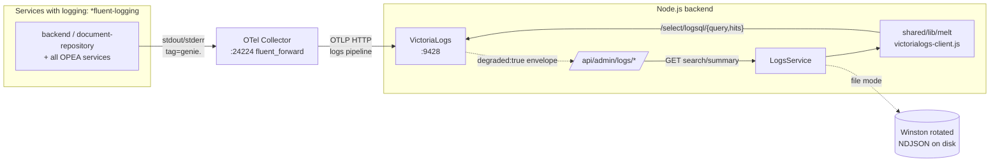
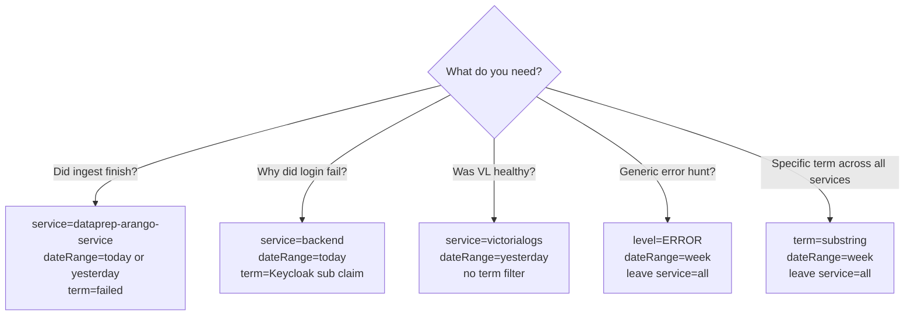

The **Logs tab** in the admin dashboard (reachable at
`https://<NGINX_PUBLIC_DOMAIN>/admin` → "Logs") is the operator-facing
surface for searching container logs across all GENIE.AI services. It is
backed by VictoriaLogs via the backend's **MELT seam**
(`MELT_PROVIDER=victorialogs`, an abstraction layer in
`components/shared/lib/melt/` named for **M**etrics / **E**vents /
**L**ogs / **T**races — a future-proof seam that lets the storage backend
swapped without changing call sites), with graceful degradation when VL is
unreachable.

This page covers what the Logs tab does, the five endpoints behind it, the
env vars that govern fallback behaviour, and how to debug common VL failures.

## Architecture



The Logs tab never talks to VL directly — every read goes through the backend's
MELT seam (`components/shared/lib/melt/victorialogs-client.js`). Ingestion
also goes through the OTel Collector (no direct jsonline POST from the app
code). The only failure mode that produces a `degraded: true` envelope is
the VL outage path covered in [Failure modes](#failure-modes-and-debugging).

## Prerequisites

- Admin role in Keycloak (the JWT must contain `realm_access.roles` including
  `admin`; see [Configuration &rarr; Keycloak admin
  guide]()).
- Observability stack on (or VL reachable on `VICTORIALOGS_URL`). When the
  observability profile is off, VL is still started as a core service (see
  the env file's **Section 12D: ADMIN LOGS MIGRATION**) — but Grafana /
  dashboards are not provisioned.
- For non-admin operators: see the read-only Service Logs Grafana dashboard
  under *General → Service Logs* in
  [Observability &rarr; Dashboards]().

## What the Logs tab is for

The Logs tab gives an operator a single search box for the **structured
Winston JSON envelopes** emitted by every Node.js and Python service, plus
the OTel Collector (services with `logging: *fluent-logging` in
`docker-compose.yaml`). Three concrete workflows:

1. **"Did my last re-ingest finish cleanly?"** — pick `dataprep-arango-service`
   in the service dropdown (the Logs tab shows the actual VL service name —
   `genie.<stack>_dataprep-arango-service_<n>` for a Compose deployment),
   choose a date range, look for `failed` entries.
2. **"Why did the login fail for user X?"** — pick `backend` in the service
   dropdown (VL name: `genie.<stack>_backend_<n>`), search for the user's
   Keycloak `sub` claim.
3. **"Was VictoriaLogs itself healthy during yesterday's outage?"** — pick
   `victorialogs` in the service dropdown and use the "Yesterday" preset.
   Note: the OTel Collector container does **not** use the fluentd logging
   driver and does **not** export its own logs via OTLP, so its records do
   not land in VictoriaLogs.

> **Where service names come from:** every container that runs with
> `logging: *fluent-logging` ships stdout/stderr to the OTel Collector
> under the tag `genie.<container_name>` (Compose container name format:
> `<project>_<service>_<index>`, e.g. `genieai_backend_1`). The Collector
> forwards to VictoriaLogs, which stores the tag as the
> `service.name` resource attribute. The Logs tab's service dropdown is
> populated from those `_stream.service` values.

### Workflow decision tree

Map your question to the right dropdown + filter combination:



## Endpoints

All five endpoints live under `/api/admin/logs` and require a Keycloak JWT
with the `admin` realm role.

| Method | Path | Purpose |
|---|---|---|
| `GET` | `/api/admin/logs` | Paginated list of recent logs. Query params: `limit` (default 100, max 10000), `level` (`TRACE` \| `DEBUG` \| `INFO` \| `WARN` \| `ERROR` \| `FATAL`), `service` (any `_stream.service` value present in VL — typically the fluentd-derived name `genie.<container_name>`). |
| `GET` | `/api/admin/logs/summary` | Error / Warning counts grouped by service. |
| `GET` | `/api/admin/logs/search` | Full-text search with date-range presets. Query params: `term` (substring match on the log message body — `_msg` field only, **not** level/service), `level`, `service`, `dateRange` (`today` \| `yesterday` \| `week` \| `month` \| `custom`), `startDate`, `endDate`. |
| `GET` | `/api/admin/logs/debug-yesterday` | Yesterday-only diagnostic dump (used by the Logs tab's "Yesterday" shortcut). |
| `POST` | `/api/admin/logs/rollover` | **Deprecated.** Returns `410 Gone` for cron User-Agents (`cron`, `curl`, `wget`, `httpie`, `python-requests`, `python-urllib`, `go-http-client`) and `200 {"deprecated":true}` for admin browser clients. See the [deprecation note](#deprecation-of-rollover) below. |

### Example: search for errors in the backend over the last week

```bash
ADMIN_TOKEN=...  # Get via the Keycloak master admin recipe

# `service=backend` matches the VL service.name `genie.<stack>_backend_<n>`
# (the Logs tab translates the dropdown label back to that exact value).
# Use `level=error` (lowercase is fine — the API uppercases via _normalizeLevelFilter).
curl -sk -H "Authorization: Bearer $ADMIN_TOKEN" \
  "https://<NGINX_PUBLIC_DOMAIN>/api/admin/logs/search?level=error&service=backend&dateRange=week&term=ECONNREFUSED" \
  | jq '.logs[] | {ts: .timestamp, level: .level, service: .service, msg: .message}'
```

## Wire-level contract (VictoriaLogs HTTP API)

The backend's `shared/lib/melt/victorialogs-client.js` is the read-side client
for the Logs tab. It speaks VL's `/select/logsql/query` and
`/select/logsql/hits` endpoints. Ingestion goes through the OTel Collector
(via `logger.emit(...)` in `components/shared/lib/victorialogs-transport.js`),
not via a direct jsonline POST.

- **VL base URL** — `VICTORIALOGS_URL` (Ansible default `http://victorialogs:9428`).
- **VL image** — `victoriametrics/victoria-logs:v1.50.0` (`docker-compose.yaml:1761`).
  The `1.50+` matters because that release introduced the canonical
  `AccountID` + `ProjectID` tenant headers; older VL builds ignore the
  multi-tenant header.
- **Tenant header** — `VICTORIALOGS_TENANT_ID` (default `0:0`; format
  `AccountID:ProjectID` per VL 1.50+ canonical tenant header).
- **Query timeout** — `VL_QUERY_TIMEOUT_MS` (default `30000` ms; raised for
  7-day security scans that aggregate more rows).
- **Time field** — `_time`. Every log line carries an ISO-8601 timestamp.
- **Envelope parsing gotcha** — for Node.js services, VL's `_msg` field is
  the raw Winston JSON envelope. `VictoriaLogsAdapter._normalizeRows`
  (`shared/lib/melt/victorialogs-client.js:237`) projects `_msg` into the
  row-level `message` field. The Logs tab reads `message`, not `_msg`, so
  the TYPE column shows the human-readable text — never the literal JSON
  envelope `{"level":"info","message":...}`.

#### VictoriaLogs field reference

The fields below are VL-internal — `VictoriaLogsAdapter` rewrites most of
them before the row reaches the Logs tab, so deployers usually do not see
the raw names. They appear here for grep/LogSQL queries run directly
against VL (e.g. from inside the VL container):

| Field | Source | Meaning |
|---|---|---|
| `_msg` | Raw log line as received | For Node services, this is the Winston JSON envelope (see gotcha above). For OTel-ingested lines, the rendered log body. |
| `_stream.service` | Container tag (`genie.<container_name>`) | The service the row belongs to. The Logs tab's service dropdown is populated from this field. |
| `_stream.level` | Winston level or OTel severity | `info`, `warn`, `error`, `debug`. May be empty for some sources — see the `level` filter failure-mode row. |
| `_time` | Ingest timestamp | ISO-8601 nanosecond timestamp; every log line carries one. |
| `LogSQL` | VL query language | The pipe-filter SQL-like language used by `/select/logsql/query` and `/select/logsql/hits`. `query=*` selects everything; `query=service:backend AND level:error` filters. See [VL docs](https://docs.victoriametrics.com/victorialogs/logsql/). |
| `AccountID:ProjectID` | Multitenancy header (`VICTORIALOGS_TENANT_ID`) | Required from VL 1.50+; sends the tenant header on every HTTP call. Format `AccountID:ProjectID`; default `0:0`. |

## Configuration

| Env var | Default | Purpose |
|---|---|---|
| `MELT_PROVIDER` | `victorialogs` (hardcoded constant in `components/shared/lib/melt/index.js`) | Future-proof seam selector. Whitelisted by `tests/config-validator/` so a deployer can override the env file; the runtime constant is the actual current value. Today there is only one backend implementation. |
| `VICTORIALOGS_URL` | `http://victorialogs:9428` (set by Ansible `env.j2:241`) | VL HTTP base URL. There is **no in-code default** — the `VictoriaLogsClient` constructor must receive `baseURL` (it gets `undefined` if you bypass Ansible and forget to inject this env var). |
| `VICTORIALOGS_TENANT_ID` | `0:0` (read by `shared/lib/melt/victorialogs-client.js:105`) | Tenant header for `/select/logsql/*` (`AccountID:ProjectID`). |
| `VL_QUERY_TIMEOUT_MS` | `30000` (hardcoded `docker-compose.yaml:578,623`) | axios timeout for VL `query` and `hits` methods. Raise for long scans. Lower for fast-fail dashboards. |
| `ADMIN_LOGS_SOURCE` | empty → routes to VL | Per-call selector for the LogsService. Set to `file` to fall back to the worker_threads file scanner — the permanent escape hatch when VL is down. Read every call (no restart). |
| `SECURITY_SCAN_BACKEND` | empty → routes to VL | Source for the Security tab scan. Set to `file` for the same worker_threads fallback. |
| `ENABLE_OBSERVABILITY` | `0` (`docker-compose.yaml:576`) | Gate for the OTel SDK self-telemetry. The Logs tab itself stays functional regardless — VL + OTel Collector + LogsService do not depend on this flag. |

> **Tunables worth knowing** (not env vars, but operator-facing knobs in
> `components/gov-chat-backend/services/logs-service.js`):
>
> - VL health probe is **lazy** on first call: 3 retries × 5 s backoff
>   (`HEALTH_PROBE_ATTEMPTS`, `HEALTH_PROBE_BACKOFF_MS` in
>   `shared/lib/melt/victorialogs-client.js`). Constructor does not block on
>   VL reachability.
> - VL-unreachable warning logging is rate-limited to **1 per minute** per
>   host (`VL_UNREACHABLE_LOG_COOLDOWN_MS = 60_000`, persisted to
>   `/tmp/vl-unreachable-ts` so backend restarts do not reset the cadence).
> - File-mode queries cap the date range at 366 days
>   (`MAX_LOG_FILES_RANGE_DAYS`). VL mode has no such cap (LogSQL is
>   unbounded — restrict the date range explicitly if a query times out).

## Failure modes and debugging

| Symptom | Cause | Fix |
|---|---|---|
| Logs tab returns `degraded: true` and an empty list | VL is unreachable (5xx/ECONNREFUSED/ENOTFOUND/timeout — recognised by `_isVlUnavailable` in `logs-service.js`) and the wrapper degraded to an empty envelope | Check `docker service logs <stack>_victorialogs --since 5m` (Swarm) or `docker compose logs victorialogs --since 5m` (Compose). VL disk full? → check the storage dashboard (`VICTORIALOGS_RETENTION` may be too generous). The first failure per minute is logged with `[opName] VictoriaLogs unreachable: …` — subsequent ones are rate-limited. |
| `/api/admin/logs/summary` returns all-zero counts even though services are logging | VL is healthy but the service logs aren't reaching it | Check `service.name` in the Service Logs dashboard for the same window — if empty, the affected service may be missing the `logging: *fluent-logging` directive in `docker-compose.yaml`. Out of 37 services in `docker-compose.yaml`, 35 use the fluentd logging driver; the rest use default Docker logging and **do not** land in VL. |
| `/api/admin/logs/search` returns rows but `level` filter does nothing | The query param is one of the six allowed levels (`TRACE`, `DEBUG`, `INFO`, `WARN`, `ERROR`, `FATAL`) but the rows' `_stream.level` is empty or non-canonical | VL `_msg` is the raw Winston JSON envelope. `VictoriaLogsAdapter._normalizeRows` projects `_msg` into `message` and pulls `level` from `fields.level` (falling back to `_stream.level`, then `INFO`). Inspect raw rows with `curl -sk "http://victorialogs:9428/select/logsql/query?query=*&limit=1"`. |
| All `/api/admin/logs/*` calls return 503 | The backend cannot reach `VICTORIALOGS_URL` from the container (no `baseURL` configured, or DNS failure) | From inside the backend container: `docker exec <stack>_backend wget -qO- "http://victorialogs:9428/health"`. If that succeeds but the Logs tab still fails, check the in-container env: `docker exec <stack>_backend printenv VICTORIALOGS_URL` — if empty, your `.env` is missing the var (Ansible normally injects it). |
| Cron still hitting `/api/admin/logs/rollover` and getting 410 | Old crontab entry not removed | Remove the cron job — log rollover is no longer required (logs are written directly to VL). The User-Agent regex that triggers the 410 is `/\b(?:cron\|curl\|wget\|httpie\|python-requests\|python-urllib\|go-http-client)\b/`. |
| Backend OOM during wide scans | VL query returning huge result sets | Lower `VL_QUERY_TIMEOUT_MS` to fail fast, or restrict the dateRange preset (`today` / `yesterday` / `week` are bounded; `month` may be too wide for noisy services; `custom` requires explicit `startDate` + `endDate`). |
| `ADMIN_LOGS_SOURCE=file` returns `vl_files_disabled` 503 | File-mode is requested but no rotated Winston archives exist in `${DATA_DIR:-./data}/logs/backend/` (mounted as `/app/logs` in the container) | Re-enable file logging in `components/shared/lib/logger.js` (the `DailyRotateFile` transport), or switch back to `ADMIN_LOGS_SOURCE=victorialogs` (the default). File mode is the escape hatch — not the steady-state source. |
| `ADMIN_LOGS_SOURCE=file` query fails on a wide date range | File mode caps the range at 366 days (`MAX_LOG_FILES_RANGE_DAYS`) | Split the query into ≤ 366-day windows, or use VL mode (no such cap). |

### Force the file fallback

If VL is genuinely down and you need logs **now**:

```bash
# Compose (single-node): edit .env and restart the backend container.
ADMIN_LOGS_SOURCE=file
docker compose up -d backend

# Swarm: edit .env (or override the running service), then force a re-deploy
# so the new env var is injected — LogsService reads ADMIN_LOGS_SOURCE on
# every call, but only after the env var is in the container.
docker service update --force <stack>_backend

# Direct runtime override (no restart needed — LogsService reads per-call):
# export ADMIN_LOGS_SOURCE=file inside the running container only as a last
# resort; the value is lost on the next container restart.
```

`file` mode reads the rotated Winston files in
`${DATA_DIR:-./data}/logs/backend/` (mounted as `/app/logs` inside the
container) via a worker_threads scanner — a Node.js worker-thread pool that
reads rotated files off the request thread, so the HTTP path stays
responsive while scans run in the background. Each scan is sequential
(one thread pool per process), which is why performance is much lower
than VL. The data is identical.

## Verify it worked

Before trusting the Logs tab in production, run through this checklist once
on a fresh deployment:

1. **VL is reachable from the backend container**

   ```bash
   docker exec <stack>_backend wget -qO- "http://victorialogs:9428/health"
   # → "OK"
   ```

2. **VL is receiving logs**

   ```bash
   # Wait ~30s for the OTel Collector to flush the first batch, then:
   curl -sk "http://victorialogs:9428/select/logsql/query?query=*&limit=5"
   # → a non-empty JSON array; each row has _stream.service, _time, _msg
   ```

3. **The Logs tab returns rows, not `{degraded: true}`**

   Open `https://<NGINX_PUBLIC_DOMAIN>/admin` → Logs tab, run a search with
   the "Yesterday" preset. You should see rows; the TYPE column should show
   human-readable text (e.g. `error — Login failed`), never the literal JSON
   envelope `{"level":"info","message":...}`.

4. **The admin role is enforced**

   ```bash
   # Without an admin token: 401/403
   curl -sk -w "%{http_code}\n" \
     "https://<NGINX_PUBLIC_DOMAIN>/api/admin/logs?limit=1"
   ```

5. **The rollover deprecation behaves as expected**

   ```bash
   # Cron-style caller gets 410
   curl -sk -o /dev/null -w "%{http_code}\n" \
     -X POST -H "User-Agent: curl/8.0.0" \
     "https://<NGINX_PUBLIC_DOMAIN>/api/admin/logs/rollover"
   # → 410

   # Browser / admin client (no cron-style User-Agent) gets 200 + deprecated:true
   curl -sk -X POST \
     -H "Authorization: Bearer $ADMIN_TOKEN" \
     -H "Content-Type: application/json" \
     -H "User-Agent: Mozilla/5.0 (admin-ui)" \
     "https://<NGINX_PUBLIC_DOMAIN>/api/admin/logs/rollover"
   # → {"deprecated":true}
   ```

If any of these fails, cross-reference with
[Failure modes and debugging](#failure-modes-and-debugging).

## Deprecation of rollover

`POST /api/admin/logs/rollover` is **deprecated and intentionally returns
410 Gone for cron callers**. The user-agent check (regex against
`cron|curl|wget|httpie|python-requests|python-urllib|go-http-client`)
exists so that:

- **Browser / admin clients** see `200 {"deprecated":true}` so the UI can
  display a friendly "no longer needed" message without breaking.
- **Old cron jobs** see `410 Gone` so they fail loudly and are removed
  (rather than silently succeeding forever against a no-op endpoint).

**If you still have a crontab entry calling `/api/admin/logs/rollover`,
remove it.** Logs are written to VL directly — no rollover step is required.

## Related

- [Observability &rarr; Configuration]() — the broader observability stack (Collector, retention, alerts)
- [Observability &rarr; Dashboards]() — Grafana Service Logs + VictoriaLogs dashboards
- [Troubleshooting]() — VL unreachable, missing telemetry
- [Configuration &rarr; Keycloak admin guide]() — Admin role assignment
- [Configuration &rarr; Environment variables]() — the full env var reference
