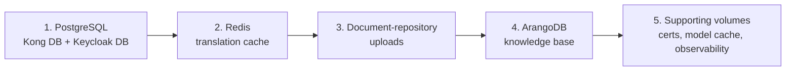

If you operate a GENIE.AI deployment and own the recovery story, this page
is for you. A complete GENIE.AI recovery requires more than the knowledge
base. Four stores hold state that is not reproducible from the codebase
alone, plus a handful of supporting volumes. Losing any of them costs more
than a rebuild incurs. This page covers all of them and the order to restore
them in.

> **In an emergency (TL;DR).** Restore order is fixed and non-negotiable:
> **PostgreSQL → Redis → Document-repository uploads → ArangoDB →
> Supporting volumes.** Each layer depends on the one below; skipping or
> reordering leaves the stack in an inconsistent state. Jump to the
> [Restore procedure](#restore-procedure--in-reverse-order) if you already
> know how to back up; everything below is for the operator who needs to
> build a backup routine from scratch.

## Overview — what state lives where

`docker-compose.yaml` declares the named volumes the stack depends on
(`docker-compose.yaml` lines 59–73). The four **critical** stores are what
must be on every backup cycle. Everything else is either reproducible from
inputs (HuggingFace model cache, Certbot certs from a CA) or loss-tolerant
(observability telemetry).

| Store | Volume name (top-level) | Mounted at | Holds | Backup criticality |
|---|---|---|---|---|
| **ArangoDB** | `arango_data` | `/var/lib/arangodb3` | Knowledge base: chunks, embeddings, knowledge graph, labels, conversations, users, ingestion logs | **Critical** |
| **PostgreSQL** | `postgres_data` | `/var/lib/postgresql/data` | Kong DB (routes/services/plugins) + Keycloak DB (realms, clients, users, roles) | **Critical** |
| **Redis** | `redis_data` | `/data` | Translation cache, backend cache | **Critical** |
| **Document-repository uploads** | `doc_repo_uploads` | `/app/uploads` | Original uploaded source files (the only durable copy after the chunks are derived) | **Critical** |
| Backend misc uploads | `backend_uploads` | `/app/Uploads` | Backend `Uploads/` directory (legacy, see [component config]()) | Low |
| Backend data dir | `backend_data` | `/app/data` | Database migration output, log files | Low |
| HF model cache (GPU nodes) | `hf_cache` | (mounted into OPEA services) | Downloaded embedding/reranker/LLM model files | Low (re-pullable) |
| Certbot | `certbot-webroot`, `certbot-etc` | `/var/www/certbot`, `/etc/letsencrypt` | ACME account + issued certificates | Medium (renewable, but loss means a forced renewal window) |
| Observability | `vm-data`, `grafana-data`, `vlogs-data`, `vtraces-data`, `otel-queue` | (per service) | Metrics, dashboards, logs, traces | Low (operational telemetry; can be reset) |

The rest of this page covers the **four critical stores** plus the supporting
volumes most teams will also want to protect.

## Why this is more than just ArangoDB

ArangoDB is the obvious one — losing it means re-ingesting every document,
which is hours of work even with a populated `doc_repo_uploads`. But a
freshly-restored ArangoDB on an empty PostgreSQL is still broken:

- **No identity.** Keycloak lives in PostgreSQL. Without it, every user is
  gone, OIDC clients vanish, the OIDC handshake that the frontend depends
  on fails. Admin recovery requires re-creating realms, clients, and users
  from scratch.
- **No gateway.** Kong stores its DB-mode configuration in PostgreSQL.
  Without it, every route (`/api/auth/*`, `/api/chat/*`, `/api/admin/*`,
  `/api/services/*`, `/grafana/`, …) is gone; the public-facing surface
  returns 404s or — worse — unconfigured defaults.
- **No translations.** Redis holds the translation cache. Loss means a
  cold cache, not data loss, but every translated response is regenerated
  on first request (slow first paint).
- **No source documents.** The document-repository volume is the only
  durable copy of the originals. ArangoDB chunks can be re-derived from
  them, but if both are lost, the knowledge base is gone forever.

A backup that covers only ArangoDB protects the most visible asset and
leaves the rest of the system one bad day away from a manual rebuild.

## Network name handling — discover, do not hardcode

The compose file defines a single top-level network named `genieai_network`
(`docker-compose.yaml` line 1926). At runtime Docker prefixes that name with
the project name (standalone Compose) or the stack name (Swarm):

| Deployment mode | Default network name | Source of the prefix |
|---|---|---|
| `docker compose up` (standalone) | `<project>_genieai_network` | `COMPOSE_PROJECT_NAME` env, or directory name (default) |
| `docker stack deploy` (Swarm) | `<stack_name>_genieai_network` | Stack name passed to `docker stack deploy`; Ansible sets `stack_name: genieai` (`deploy/ansible/group_vars/all.yml` line 34), yielding `genieai_genieai_network` |
| Custom `-p <name>` or `--project-name <name>` | `<name>_genieai_network` | Explicit override |

**Do not hardcode the prefix.** Discover it before every operation:

```bash
# 1. List candidate networks — filter by the Compose project label
docker network ls --filter "label=com.docker.compose.project"

# 2. Pick the one whose name ends in `_genieai_network`
NETWORK=$(docker network ls --format '{{.Name}}' \
  --filter "label=com.docker.compose.project" \
  | grep '_genieai_network$' | head -1)

echo "Discovered GENIE.AI network: $NETWORK"
# e.g. genieai_genieai_network  (Swarm, stack_name=genieai)
# e.g. genie-ai_genieai_network (standalone, project=directory name)
```

For Swarm stacks without the compose-project label, fall back to the stack
name (`docker network ls --filter "label=com.docker.stack.namespace"`).

> **Why this matters.** Backup scripts and ad-hoc `docker run --network …`
> helpers that hardcode `genieai_genieai_network` will silently fail (or
> silently skip the right network) on a standalone `docker compose` setup
> where the actual name is `genie-ai_genieai_network`. Always discover.

## Prerequisite — extract credentials from `.env`

Most backup commands need credentials. The `.env` file is gitignored and
contains values with special characters (`+`, `)`, `=`). Extract them with
`grep | cut`, never `source .env`:

```bash
ENV_FILE=/opt/genie/.env

ARANGO_PASSWORD=$(grep ^ARANGO_PASSWORD= "$ENV_FILE" | cut -d= -f2-)
POSTGRES_PASSWORD=$(grep ^POSTGRES_PASSWORD= "$ENV_FILE" | cut -d= -f2-)
KONG_DB_PASSWORD=$(grep ^KONG_DB_PASSWORD= "$ENV_FILE" | cut -d= -f2-)
KEYCLOAK_DB_PASSWORD=$(grep ^KEYCLOAK_DB_PASSWORD= "$ENV_FILE" | cut -d= -f2-)
TRANSLATION_CACHE_PASSWORD=$(grep ^TRANSLATION_CACHE_PASSWORD= "$ENV_FILE" | cut -d= -f2-)
```

Default users and database names (overridable in `.env`):

| Variable | Default | Notes |
|---|---|---|
| `POSTGRES_USER` | `genieai` | Superuser; created by PostgreSQL init |
| `POSTGRES_DB` | `kong` | The default database created at first start |
| `KONG_PG_USER` | `kong` | What Kong uses to *connect*; user itself is hardcoded `kong` by `postgres-init` |
| `KC_DB_USERNAME` | `keycloak` | What Keycloak uses to *connect*; user itself is hardcoded `keycloak` by `postgres-init` |

> **Why two variables.** `postgres-init` (`configs/postgres/init-databases.sh`) iterates
> over `SERVICES="kong keycloak"` and creates one user + database per service, with
> the password from `${SVC^^}_DB_PASSWORD` (so `KONG_DB_PASSWORD` and
> `KEYCLOAK_DB_PASSWORD`). The user/database names are not overridable — only the
> password is. `KONG_PG_USER` / `KC_DB_USERNAME` are then read by Kong / Keycloak to
> connect to those fixed users. **Always keep these defaults in sync**; renaming the
> user the client connects as without renaming the user `postgres-init` creates
> leaves the new user non-existent and the service unable to authenticate.

## 1. ArangoDB backup — the knowledge base

The knowledge base lives entirely in ArangoDB: chunks, embeddings, the
knowledge graph, labels, conversations, users, and ingestion logs. The
shipped script (`components/arangodb/dump.sh`) uses `arangodump` and is the
recommended path.

> **Gotcha — the shipped script has two known bugs** (also covered in the
> original Kong + ArangoDB doc; documented here for completeness):
>
> 1. It hardcodes `--network chatqna_default` (a project-rename artefact).
> 2. It hardcodes `--server.password test`.
>
> Patch both before first use, **and** substitute the actual network name
> discovered above rather than assuming `genieai_network` /
> `genieai_genieai_network`.

```bash
cd components/arangodb

# 1. Discover the actual network (do not hardcode!)
NETWORK=$(docker network ls --format '{{.Name}}' \
  --filter "label=com.docker.compose.project" \
  | grep '_genieai_network$' | head -1)

# 2. Patch the two legacy bugs in dump.sh + restore.sh
sed -i "s|--network chatqna_default|--network ${NETWORK}|" dump.sh restore.sh
sed -i 's|--server.password test|--server.password "$ARANGO_PASSWORD"|' dump.sh restore.sh

# Verify the edits
grep -E "(--network|--server.password)" dump.sh restore.sh

# 3. Run the dump
export ARANGO_PASSWORD="$ARANGO_PASSWORD"   # from the prerequisite block
./dump.sh
```

The dump appears inside the helper container at
`/root/arango_backups/<YYYYMMDDHHMMSS>/<database>/`. Copy it out before the
container is reaped:

```bash
HELPER=$(docker ps -a --format '{{.Names}}' | grep -E 'arangodump|arangodb' | head -1)
docker cp "${HELPER}:/root/arango_backups" ./arango_backups
```

### Verify the ArangoDB backup

The dump is unusable if any per-database directory is empty or missing.
Confirm size + non-empty contents before relying on it:

```bash
TS=$(ls ./arango_backups | sort | tail -1)         # latest timestamp
ls -la "./arango_backups/${TS}"
# Expect: one subdirectory per database (e.g. <ARANGO_DB>), each non-empty.
find "./arango_backups/${TS}" -type f -name '*.data.json' -o -name '*.structure.json' | wc -l
# Non-zero count means arangodump wrote data + structure files per collection.
```

### ArangoDB failure modes

| Symptom | Cause | Action |
|---|---|---|
| `network chatqna_default not found` | Script not patched | Re-apply the `sed` patch above; better — use the discovered `$NETWORK` value |
| `401 Unauthorized` from arangodump | Hardcoded `test` password | Patch `--server.password` and re-run |
| Empty `<timestamp>/<db>/` directories | `--volumes-from` cannot see Swarm named volumes | On Swarm, replace `--volumes-from arango-vector-db` with `-v genieai_arango_data:/source` and call `arangodump --input-directory /source` instead |
| Helper container exits immediately | Image pull failure (no internet) | Pre-pull `arangodb/arangodb:3.12` on the host |

> **Backup destination lives only on the operator host.** Copy the dump
> directory off-host (rsync, scp, or your backup tool of choice). A backup
> that sits on the same machine as the database is not a backup — both go
> down together.

## 2. PostgreSQL backup — Kong DB + Keycloak DB

PostgreSQL hosts two databases that must survive:

- **`kong`** (default `POSTGRES_DB`) — Kong stores its DB-mode routes,
  services, plugins, upstreams in this database. Loss means the public
  proxy returns 404s for every API path.
- **`keycloak`** — OIDC realms, clients (including the `genie-app` OIDC
  client and the `genie-proxy-client` service account), users, roles,
  identity-provider links. Loss means every Keycloak login fails.

> **Note on Kong configuration.** Kong has two configuration modes:
> **DB-backed** (state lives in the `kong` PostgreSQL database, the runtime
> default for this stack) and **declarative** (state lives in a YAML/JSON
> file loaded at boot). When Kong runs in DB mode, the source of truth for
> routes / services / plugins is the `kong` database in PostgreSQL. A
> `pg_dump` of that database is sufficient to restore the gateway
> end-to-end. The declarative export (`manage-kong-config.sh -b`) is a
> *human-readable backup* that doubles as a code-review artifact; keep it,
> but it is not strictly required if you have a fresh PostgreSQL dump.

Both databases live in the same `postgres` container; back them up in a
single `pg_dump` pass.

### Backup procedure

```bash
# Run pg_dump inside the postgres container (avoids host-side version mismatch)
docker exec postgres bash -c "
  PGPASSWORD='$POSTGRES_PASSWORD' pg_dump -U ${POSTGRES_USER:-genieai} \
    -d ${POSTGRES_DB:-kong} \
    --format=custom --compress=9 \
    --file=/tmp/kong.dump &&
  PGPASSWORD='$KEYCLOAK_DB_PASSWORD' pg_dump -U ${KC_DB_USERNAME:-keycloak} \
    -d keycloak \
    --format=custom --compress=9 \
    --file=/tmp/keycloak.dump
"

# Copy out
mkdir -p ./pg_backups/$(date -u +%Y%m%d%H%M%S)
TS=$(date -u +%Y%m%d%H%M%S)
docker cp postgres:/tmp/kong.dump      ./pg_backups/${TS}/kong.dump
docker cp postgres:/tmp/keycloak.dump  ./pg_backups/${TS}/keycloak.dump
```

The custom format (`-Fc`) supports parallel restore and selective table
extraction; compressed (level 9) cuts a typical dump to ~10% of raw SQL.

### One-time: also export a declarative Kong config (recommended)

Even though `pg_dump` covers DB-mode Kong, the declarative export is
useful for code review and for restoring to a fresh Kong without restoring
the whole Postgres:

```bash
cd api-gateway-solution/new-config
./manage-kong-config.sh -b     # writes kong_backups/kong_backup_<TIMESTAMP>.json (human-readable)
```

> **Note on the `-b` flag.** In `manage-kong-config.sh`, `-b` *performs* the
> backup (writes a timestamped file under `kong_backups/`). In
> `restore-kong-config.sh`, `-b` is the *input* — the path to the backup
> file to restore (default `/opt/kong-config/kong_config.json`). Same flag,
> opposite meanings. The line above uses `manage-kong-config.sh`; for the
> restore side, see the [Restore
> procedure](#restore-procedure--in-reverse-order).

### Verify the PostgreSQL backup

A custom-format dump that pg_restore cannot read is a placeholder, not a
backup. Confirm each dump is well-formed and contains the expected
top-level objects:

```bash
# Custom-format dumps must list TOC entries without errors
pg_restore --list ./pg_backups/${TS}/kong.dump | head -5
pg_restore --list ./pg_backups/${TS}/keycloak.dump | head -5
# Expect: a non-empty TOC header (e.g. "; pg_dump output", table names)

# Sanity check: Kong dump should contain the routes / services / plugins schemas
pg_restore --list ./pg_backups/${TS}/kong.dump | grep -E 'routes|services|plugins'
# Expect: at least one row per schema object.

# Size sanity (non-zero + non-trivial — a few KB minimum for an empty DB, tens of MB for a populated one)
ls -lh ./pg_backups/${TS}/kong.dump ./pg_backups/${TS}/keycloak.dump
```

### PostgreSQL failure modes

| Symptom | Cause | Action |
|---|---|---|
| `pg_dump: error: connection to server … FATAL: password authentication failed` | Wrong password | Re-extract from `.env`; the `postgres` superuser uses `POSTGRES_PASSWORD`, **not** the Kong/Keycloak DB user passwords |
| `pg_dump: error: could not access database "keycloak"` | `postgres-init` did not run on the new host | Verify the `keycloak` database exists: `docker exec postgres psql -U ${POSTGRES_USER:-genieai} -lqt | cut -d \| -f 1 \| grep keycloak` |
| Restore fails with `role "kong" does not exist` | Skipped `postgres-init` step on the new host | Run the `postgres-init` service (one-shot) before restoring the Kong DB |

## 3. Redis backup — translation cache + backend cache

The `redis-cache` service runs Redis 7 with `--appendonly yes` and
`--maxmemory-policy noeviction` (`docker-compose.yaml` line 432). Both
flags matter for backups:

- **AOF mode** (`appendonly yes`): every write is journaled; the dataset
  can always be reconstructed from the AOF.
- **`noeviction`**: writes never fail by evicting — but the dataset can
  grow unbounded if traffic spikes, which makes backups larger than the
  in-memory dataset.

Two backup strategies, both work; pick one per environment.

### Strategy A — RDB snapshot via `BGSAVE` (recommended for cron)

```bash
# Trigger a background save and wait for completion
docker exec redis-cache sh -c '
  REDISCLI_AUTH="$TRANSLATION_CACHE_PASSWORD" \
    redis-cli -a "$TRANSLATION_CACHE_PASSWORD" BGSAVE
'
# BGSAVE returns immediately; poll until the previous save finishes
for i in $(seq 1 30); do
  STATE=$(docker exec redis-cache \
    sh -c 'REDISCLI_AUTH="$1" redis-cli -a "$1" LASTSAVE' _ \
    "$TRANSLATION_CACHE_PASSWORD")
  echo "LASTSAVE=$STATE"
  sleep 1
done

# Copy the dump file out
docker cp redis-cache:/data/dump.rdb ./redis_backups/dump_$(date -u +%Y%m%d%H%M%S).rdb
```

> The `--appendonly` AOF is also at `/data/appendonly.aof` (or
> `/data/appendonlydir/` on newer Redis 7 builds). Snapshots of both are
> safer than RDB alone for crash-consistency.

### Strategy B — copy the AOF (preferred for hot streams)

```bash
# Force a single AOF rewrite (compacts the log) before copying
docker exec redis-cache sh -c '
  REDISCLI_AUTH="$TRANSLATION_CACHE_PASSWORD" \
    redis-cli -a "$TRANSLATION_CACHE_PASSWORD" BGREWRITEAOF
'
sleep 5
docker cp redis-cache:/data/appendonly.aof ./redis_backups/appendonly_$(date -u +%Y%m%d%H%M%S).aof
```

### Verify the Redis backup

The RDB/AOF must be parseable; a corrupt dump file will refuse to load on
restore and crash the service. Validate before trusting the copy:

```bash
# Use redis-check-rdb inside the redis-cache image to validate the RDB
docker run --rm \
  -v "$(pwd)/redis_backups:/backup:ro" \
  redis:7-alpine \
  sh -c 'redis-check-rdb /backup/dump_<ts>.rdb'
# Expect: "RDB is OK" or "Dump finished" + non-zero offsets; exit code 0.

# For the AOF (Redis 7+) — validate the directory of segments
docker run --rm \
  -v "$(pwd)/redis_backups:/backup:ro" \
  redis:7-alpine \
  sh -c 'redis-check-aof /backup/appendonly_<ts>.aof'
# Expect: "AOF is OK" or "Appendonly is OK"; exit code 0.
```

### Redis failure modes

| Symptom | Cause | Action |
|---|---|---|
| `NOAUTH Authentication required` | Skipped `REDISCLI_AUTH` | Re-export `TRANSLATION_CACHE_PASSWORD` and prefix the `redis-cli` invocation with `REDISCLI_AUTH=...` |
| `redis-cli: command not found` | Ran the command from a container that does not ship `redis-cli` (e.g. `alpine:3.19` or `postgres`) | Run it inside the `redis-cache` container — `redis:7-alpine` ships `redis-cli` at `/usr/local/bin/redis-cli` (on `$PATH`), so `docker exec redis-cache sh -c 'redis-cli ...'` works without a full path |
| Empty RDB after restore | RDB was copied mid-`BGSAVE` | Wait for `LASTSAVE` to advance before copying, or copy the AOF instead |

## 4. Document-repository uploads backup — the source documents

The `doc_repo_uploads` volume is mounted at `/app/uploads` inside the
`document-repository` service (`docker-compose.yaml` line 638). It is the
**only durable copy** of the original source files uploaded by users; once
the chunks are derived and stored in ArangoDB, the documents here are the
recovery vector for a full re-ingest.

### Backup procedure — direct volume mount (Compose standalone)

```bash
# Run a throwaway container attached to the volume
docker run --rm \
  -v doc_repo_uploads:/source:ro \
  -v "$(pwd)/upload_backups:/backup" \
  alpine:3.19 \
  tar czf /backup/uploads_$(date -u +%Y%m%d%H%M%S).tar.gz -C /source .
```

### Backup procedure — Swarm (named volume from a service task)

On Swarm the named volume lives on a specific node; run the helper from a
service task or use a `docker run` with the explicit volume driver scope:

```bash
# Service task approach (works on any node that runs doc-repo)
docker exec $(docker ps --filter "label=com.docker.swarm.service.name=genieai_document-repository" -q | head -1) \
  tar czf - -C /app/uploads . > upload_backups/uploads_$(date -u +%Y%m%d%H%M%S).tar.gz
```

### Alternative — `rsync` against a known service task

If a backup server is reachable from the swarm node that hosts the
`document-repository` task, `rsync` is simpler than tarballing:

```bash
SVC=$(docker ps --filter "label=com.docker.swarm.service.name=genieai_document-repository" -q | head -1)
docker exec "$SVC" tar cf - -C /app/uploads . \
  | rsync -a --delete - backup@backup-host:/srv/genie/uploads/
```

### Verify the document-repository uploads backup

The tarball must contain every original source file — silent truncation
leaves the knowledge base irrecoverable. Compare the file count in the
tarball against the source volume:

```bash
# Source-side count (running container)
SVC=$(docker ps --filter "label=com.docker.swarm.service.name=genieai_document-repository" -q | head -1)
docker exec "$SVC" sh -c 'find /app/uploads -type f | wc -l'

# Tarball-side count (entries inside the archive)
tar tzf upload_backups/uploads_<ts>.tar.gz | wc -l

# Two values should match exactly (one tarball entry per source file + the root directory).
# Spot-check the contents: first/last file names should look like real uploads.
tar tzf upload_backups/uploads_<ts>.tar.gz | head -3
tar tzf upload_backups/uploads_<ts>.tar.gz | tail -3
```

> **Why this matters.** ArangoDB chunks can be regenerated from these files
> via dataprep re-ingestion. If both the ArangoDB dump **and** the upload
> volume are lost, the knowledge base is unrecoverable. Treat uploads as
> the irreplaceable source.

## 5. Supporting volumes (lower priority)

These are reproducible or operational data; back them up if your retention
or compliance posture requires it, but a total loss is recoverable.

| Volume | Backup | Restore |
|---|---|---|
| `hf_cache` (HF model weights) | Optional — GPU nodes pull ~10–30 GB per model; `rsync` to a model store | Re-pull via `huggingface-cli` once the deploy env vars (`EMBEDDING_MODEL_ID`, `RERANKER_MODEL_ID`, `VLLM_LLM_MODEL_ID`) are set |
| `backend_uploads` | `docker run --rm -v backend_uploads:/src -v "$PWD":/backup alpine tar czf /backup/backend_uploads.tgz -C /src .` | Reverse tarball into the volume |
| `backend_data` | Same pattern | Reverse tarball |
| `certbot-webroot`, `certbot-etc` | `tar czf certbot.tgz /etc/letsencrypt /var/www/certbot` (or copy the bind-mounted dirs) | Run `certbot` renewal — loss of the cert forces the renewal window, not a security incident |
| `vm-data`, `grafana-data`, `vlogs-data`, `vtraces-data`, `otel-queue` | Snapshots if observability retention is regulated; otherwise loss = empty dashboards + historical telemetry loss | Provisioning files in `configs/` are the source of truth for Grafana datasources and dashboards; restore is a fresh deploy with the same provisioning |

## Cron template — all four critical stores

The snippet below covers ArangoDB + PostgreSQL + Redis + uploads in one
nightly run. Save as `/etc/cron.d/genieai-backup` and run as the user that
has Docker socket access (`root` is the safe default on the operator
host):

```cron
SHELL=/bin/bash
PATH=/usr/local/sbin:/usr/local/bin:/usr/sbin:/usr/bin:/sbin:/bin

# Nightly at 02:30 UTC — runs all four critical-store backups
30 2 * * * root /opt/genie/scripts/backup-all.sh >> /var/log/genie-backup.log 2>&1
```

`/opt/genie/scripts/backup-all.sh`:

```bash
#!/usr/bin/env bash
set -euo pipefail

ENV_FILE=/opt/genie/.env
TS=$(date -u +%Y%m%d%H%M%S)
BACKUP_ROOT=/srv/genie/backups/${TS}
mkdir -p "${BACKUP_ROOT}"/{arango,pg,redis,uploads,kong}

# Discover the GENIE.AI network (see "Network name handling" above)
NETWORK=$(docker network ls --format '{{.Name}}' \
  --filter "label=com.docker.compose.project" \
  | grep '_genieai_network$' | head -1)

# Extract credentials without sourcing .env
ARANGO_PASSWORD=$(grep ^ARANGO_PASSWORD= "$ENV_FILE" | cut -d= -f2-)
POSTGRES_PASSWORD=$(grep ^POSTGRES_PASSWORD= "$ENV_FILE" | cut -d= -f2-)
KEYCLOAK_DB_PASSWORD=$(grep ^KEYCLOAK_DB_PASSWORD= "$ENV_FILE" | cut -d= -f2-)
TRANSLATION_CACHE_PASSWORD=$(grep ^TRANSLATION_CACHE_PASSWORD= "$ENV_FILE" | cut -d= -f2-)
POSTGRES_USER=$(grep ^POSTGRES_USER= "$ENV_FILE" | cut -d= -f2-)
POSTGRES_USER=${POSTGRES_USER:-genieai}
POSTGRES_DB=$(grep ^POSTGRES_DB= "$ENV_FILE" | cut -d= -f2-)
POSTGRES_DB=${POSTGRES_DB:-kong}
# KC_DB_USERNAME is what Keycloak uses to connect; the user is hardcoded 'keycloak' by postgres-init
KC_DB_USERNAME=$(grep ^KC_DB_USERNAME= "$ENV_FILE" | cut -d= -f2-)
KC_DB_USERNAME=${KC_DB_USERNAME:-keycloak}
# Keycloak DB name is hardcoded 'keycloak' (created by postgres-init); there is no KEYCLOAK_DB env var
KEYCLOAK_DB=keycloak

# 1. ArangoDB
( cd /opt/genie/components/arangodb
  ARANGO_PASSWORD="$ARANGO_PASSWORD" ./dump.sh
)
HELPER=$(docker ps -a --format '{{.Names}}' | grep -E 'arangodump|arangodb' | head -1)
docker cp "${HELPER}:/root/arango_backups" "${BACKUP_ROOT}/arango/"

# 2. PostgreSQL — Kong DB + Keycloak DB
docker exec postgres bash -c "
  PGPASSWORD='$POSTGRES_PASSWORD' pg_dump -U $POSTGRES_USER \
    -d $POSTGRES_DB --format=custom --compress=9 \
    --file=/tmp/kong.dump &&
  PGPASSWORD='$KEYCLOAK_DB_PASSWORD' pg_dump -U $KC_DB_USERNAME \
    -d $KEYCLOAK_DB --format=custom --compress=9 \
    --file=/tmp/keycloak.dump
"
docker cp postgres:/tmp/kong.dump      "${BACKUP_ROOT}/pg/"
docker cp postgres:/tmp/keycloak.dump  "${BACKUP_ROOT}/pg/"

# 3. Redis — RDB snapshot via BGSAVE
docker exec redis-cache sh -c '
  REDISCLI_AUTH="$1" redis-cli -a "$1" BGSAVE
' _ "$TRANSLATION_CACHE_PASSWORD"
for i in $(seq 1 30); do sleep 1; done
docker cp redis-cache:/data/dump.rdb "${BACKUP_ROOT}/redis/dump.rdb"

# 4. Document-repository uploads — direct volume mount
docker run --rm \
  -v doc_repo_uploads:/source:ro \
  -v "${BACKUP_ROOT}/uploads":/backup \
  alpine:3.19 \
  tar czf /backup/uploads.tgz -C /source .

# 5. Optional: declarative Kong config (human-readable artifact)
# Note: Kong admin (8001) is NOT exposed to the host by default. Run this from
# inside the overlay network via a sidecar that has curl (the `postgres` image
# ships neither curl nor wget — don't try `docker exec postgres bash -c "curl …"`).
# Alternatively, run `./manage-kong-config.sh -b` from a node that can reach Kong admin.
docker run --rm \
  --network="$NETWORK" \
  curlimages/curl:8.10.1 \
  -sS "${KONG_ADMIN_URL:-http://kong:8001}/services" \
  > "${BACKUP_ROOT}/kong/services.json" || true

# Push off-host — adjust to your backup target
rsync -a --delete "${BACKUP_ROOT}/" backup@backup-host:/srv/genie/${TS}/

# Prune — keep 30 days locally
find /srv/genie/backups -maxdepth 1 -type d -mtime +30 -exec rm -rf {} +
```

For Swarm, run the cron on the manager node and let Docker route the
helper containers to the right node via the discovered `$NETWORK` and the
existing service tasks.

## Restore procedure — in reverse order

Restore order matters: each layer depends on the one below. Skipping a
layer or restoring out of order leaves the stack in an inconsistent state.

> **Capture a baseline BEFORE disaster strikes.** The verify steps below
> compare restored counts against a baseline you must have captured while
> the system was healthy. Add this to your normal backup routine (or run
> it monthly):
>
> ```bash
> # ArangoDB — collection counts (run on a healthy stack)
> docker exec arango-vector-db arangosh --server.endpoint tcp://127.0.0.1:8529 \
>   --server.username root --server.password "$ARANGO_PASSWORD" \
>   --javascript.execute-string 'db._collections().forEach(c => print(c.name() + ": " + c.count()))' \
>   > /srv/genie/baselines/arango_$(date -u +%Y%m%d).txt
>
> # PostgreSQL — table counts in kong + keycloak DBs
> docker exec postgres psql -U ${POSTGRES_USER:-genieai} -d ${POSTGRES_DB:-kong} -c '\dt+' >> /srv/genie/baselines/pg_kong_$(date -u +%Y%m%d).txt
> docker exec postgres psql -U ${KC_DB_USERNAME:-keycloak} -d keycloak     -c '\dt+' >> /srv/genie/baselines/pg_kc_$(date -u +%Y%m%d).txt
>
> # Redis — DBSIZE
> docker exec redis-cache sh -c 'REDISCLI_AUTH="$1" redis-cli -a "$1" DBSIZE' _ "$TRANSLATION_CACHE_PASSWORD" \
>   >> /srv/genie/baselines/redis_$(date -u +%Y%m%d).txt
>
> # Document-repository uploads — file count
> docker exec $(docker ps --filter "label=com.docker.swarm.service.name=genieai_document-repository" -q | head -1) \
>   sh -c 'find /app/uploads -type f | wc -l' \
>   >> /srv/genie/baselines/uploads_$(date -u +%Y%m%d).txt
> ```
>
> Without a baseline, you can only catch catastrophic failures (zero,
> empty) — not partial drops.

### Order of operations

Each layer depends on the one below. The arrow direction is "must be
restored before":



**Why this order.** Each layer is a foundation for the one above it:

1. **PostgreSQL first** — every other service authenticates against Keycloak
   (which lives here) and routes through Kong (also here). Restoring
   PostgreSQL brings identity + the gateway online so the rest of the stack
   can come up without 401/404 floods.
2. **Redis second** — cold-cache is a performance problem, not a correctness
   one, but restoring it before traffic flows avoids a slow first-paint on
   the first batch of translated responses.
3. **Document-repository uploads third** — the source files are the recovery
   vector for the knowledge base. Even if the ArangoDB dump is unrecoverable,
   the uploads let you re-derive everything via dataprep.
4. **ArangoDB fourth** — the knowledge base. If the dump is lost, this is
   reconstructed by re-ingestion from step 3; if the dump survives, it
   restores directly.
5. **Supporting volumes** — certs, model cache, observability data; each is
   independent and can come up whenever convenient.

Skipping a layer or restoring out of order leaves the stack in an
inconsistent state (e.g., restoring ArangoDB before Keycloak means the
backend can serve chunks but cannot identify the user asking for them).

### 1. Restore PostgreSQL

Both databases must be restored into a freshly-initialised PostgreSQL
instance. The `postgres-init` service creates the dedicated users; run it
before restoring the per-database dumps.

```bash
# 1. Start the stack and let postgres-init run (one-shot)
docker compose up -d postgres
docker compose run --rm postgres-init   # or via stack: docker service scale …

# 2. Restore the Kong DB
docker exec -i postgres bash -c "
  PGPASSWORD='$POSTGRES_PASSWORD' pg_restore -U ${POSTGRES_USER:-genieai} \
    -d ${POSTGRES_DB:-kong} --clean --if-exists --no-owner \
    --role=kong
" < pg_backups/${TS}/kong.dump

# 3. Restore the Keycloak DB
docker exec -i postgres bash -c "
  PGPASSWORD='$KEYCLOAK_DB_PASSWORD' pg_restore -U ${KC_DB_USERNAME:-keycloak} \
    -d keycloak --clean --if-exists --no-owner
" < pg_backups/${TS}/keycloak.dump

# 4. If you also have a declarative Kong export, restore it for code-review parity
cd api-gateway-solution/new-config
./restore-kong-config.sh -b /opt/kong-config/kong_config.json
```

> **Important.** `--role=kong` sets object ownership to the `kong` user
> (the running Kong connects as `kong`, not as `genieai`). Omitting it
> leaves Kong unable to read its own schema after restart. The
> `--no-owner` flag then prevents `pg_restore` from trying to `ALTER OWNER`
> back to the dump-time superuser.

> **Quick verify (this step).** Both databases should list their tables:
> `docker exec postgres psql -U ${POSTGRES_USER:-genieai} -d ${POSTGRES_DB:-kong} -c '\dt'`
> and `docker exec postgres psql -U ${KC_DB_USERNAME:-keycloak} -d keycloak -c '\dt'`.
> An empty `\dt` list on a non-empty dump means the restore silently
> failed — stop and re-check.

### 2. Restore Redis

```bash
# Stop the running redis-cache service so it doesn't write to the volume
docker service scale genieai_redis-cache=0      # Swarm
# or:  docker compose stop redis-cache          # Compose

# Replace the RDB (and AOF if you have it) inside the volume
docker run --rm \
  -v redis_data:/data \
  -v "$(pwd)/redis_backups":/backup:ro \
  alpine:3.19 \
  cp /backup/dump.rdb /data/dump.rdb
# If you have an AOF too:
#   cp /backup/appendonly.aof /data/appendonly.aof

# Restart — Redis loads the RDB on startup
docker service scale genieai_redis-cache=1
```

> **Quick verify (this step).** `DBSIZE` should be non-zero and within
> ~10% of the pre-restore baseline. A `DBSIZE` of 0 means the RDB was not
> loaded (corrupt file or wrong mount path):
> `docker exec redis-cache sh -c 'REDISCLI_AUTH="$1" redis-cli -a "$1" DBSIZE' _ "$TRANSLATION_CACHE_PASSWORD"`.

### 3. Restore document-repository uploads

```bash
# Stop the document-repository service
docker service scale genieai_document-repository=0

# Replace the volume contents from the tarball
docker run --rm \
  -v doc_repo_uploads:/target \
  -v "$(pwd)/upload_backups":/backup:ro \
  alpine:3.19 \
  sh -c "rm -rf /target/* && tar xzf /backup/uploads.tgz -C /target"

# Restart
docker service scale genieai_document-repository=1
```

> **Quick verify (this step).** File count must match the pre-restore
> baseline: `docker exec $(docker ps --filter "label=com.docker.swarm.service.name=genieai_document-repository" -q | head -1) sh -c 'find /app/uploads -type f | wc -l'`.
> A smaller count means the tarball was truncated — do not proceed to the
> next step.

### 4. Restore ArangoDB

```bash
cd components/arangodb
./restore.sh "${TS}"
```

The script runs `arangorestore` for each database directory under
`/root/arango_backups/${TS}/` against the running `arango-vector-db`. The
two patches from §1 (network name + `--server.password`) apply.

> **Quick verify (this step).** Per-collection document counts should match
> the pre-restore baseline; a zero on `messages` or `chunks` means the
> restore silently dropped collections:
> `docker exec arango-vector-db arangosh --server.endpoint tcp://127.0.0.1:8529 --server.username root --server.password "$ARANGO_PASSWORD" --javascript.execute-string 'db._collections().forEach(c => print(c.name() + ": " + c.count()))'`.
> Compare the counts against the baseline captured before the disaster.

### Verify the restore succeeded

> **Baseline = your pre-disaster numbers.** Every check below compares
> against numbers you should have captured **before** anything broke:
> per-collection document counts in ArangoDB, table row counts in
> PostgreSQL, `DBSIZE` in Redis, file count in `doc_repo_uploads`. Without
> a baseline, these checks only catch *catastrophic* failures (zero,
> empty), not partial ones.

```bash
# ArangoDB — counts per key collection should match the pre-restore baseline
docker exec arango-vector-db arangosh \
  --server.endpoint tcp://127.0.0.1:8529 \
  --server.username root --server.password "$ARANGO_PASSWORD" \
  --javascript.execute-string '
    ["conversations","messages","users","serviceCategories","services"].forEach(
      c => print(c + ": " + db._collection(c).count())
    )'

# PostgreSQL — Kong DB tables and Keycloak DB tables exist
docker exec postgres bash -c "
  PGPASSWORD='$POSTGRES_PASSWORD' psql -U ${POSTGRES_USER:-genieai} \
    -d ${POSTGRES_DB:-kong} -c '\dt' &&
  PGPASSWORD='$KEYCLOAK_DB_PASSWORD' psql -U ${KC_DB_USERNAME:-keycloak} \
    -d keycloak -c '\dt'
"

# Redis — key count matches expectations
docker exec redis-cache sh -c '
  REDISCLI_AUTH="$1" redis-cli -a "$1" DBSIZE
' _ "$TRANSLATION_CACHE_PASSWORD"

# Document-repository uploads — files match the expected count
docker exec $(docker ps --filter "label=com.docker.swarm.service.name=genieai_document-repository" -q | head -1) \
  sh -c 'ls /app/uploads | wc -l'
```

If any count is wildly off, **stop and inspect** — partial restores can
leave the system in an inconsistent state. See
[Troubleshooting]() for log locations.

> **Re-ingestion as a fallback.** If the ArangoDB dump is lost but the
> `doc_repo_uploads` volume is intact, the knowledge base can be rebuilt by
> re-ingesting every document through the document-repository UI or API.
> See [Knowledge base &rarr; Document
> lifecycle]().

## Troubleshooting

| Symptom | Cause | Action |
|---|---|---|
| `network <name> not found` on any backup helper | Hardcoded network prefix | Run the discovery snippet in [Network name handling](#network-name-handling--discover-do-not-hardcode) and substitute the discovered `$NETWORK` value |
| `network chatqna_default not found` | `dump.sh` / `restore.sh` not patched | Re-apply the `sed` patch in §1 |
| `401 Unauthorized` from arangodump / Kong admin / pg_dump | Hardcoded password or wrong env extraction | Re-extract the password with `grep ^VAR= "$ENV_FILE" | cut -d= -f2-`; do **not** `source .env` |
| `pg_dump: could not access database "keycloak"` | Skipped `postgres-init` step on the new host | Start the `postgres-init` service before restoring the Keycloak DB |
| Restore succeeds but OIDC login fails | `genie-app` / `genie-proxy-client` clients missing their secrets | Re-apply `KEYCLOAK_CLIENT_SECRET` and `KEYCLOAK_PROXY_CLIENT_SECRET` from the original `.env` (Keycloak stores hashed values; secrets in `.env` are the originals Kong and the backend use to authenticate **to** Keycloak). Client IDs are set via `KEYCLOAK_CLIENT_ID` (default `genie-app`) and `KEYCLOAK_PROXY_CLIENT_ID` (default `genie-proxy-client`, hardcoded in `docker-compose.yaml`). |
| Restore succeeds but the frontend shows the wrong language set | `KEYCLOAK_SUPPORTED_LOCALES` changed since the backup | Re-apply the env var to match the backed-up Keycloak realm config. See [Restrict active locales](/docs/configure/locale-whitelist/) for the canonical reference. |
| `pg_restore` fails with `role "kong" does not exist` | Restored into a fresh cluster without the `postgres-init` users | Run `postgres-init` first; restore only the data, not the global roles |
| Restored ArangoDB chunks return no results in chat | `EMBEDDING_MODEL_ID` or `ARANGO_GRAPH_NAME` changed since the dump | Verify the values used at restore time match what was active when the dump was taken; mismatched model dimensions silently corrupt retrieval |

## What to back up — quick reference

| Artifact | What it holds | Backup tool | Restore tool |
|---|---|---|---|
| ArangoDB dump | Knowledge base (chunks, embeddings, graph, labels, conversations, users, ingestion logs) | `components/arangodb/dump.sh` (patched, network-discovered) | `components/arangodb/restore.sh` (patched) |
| Kong DB | Gateway routes, services, plugins, upstreams (DB-mode source of truth) | `pg_dump -U ${POSTGRES_USER:-genieai} -d ${POSTGRES_DB:-kong} -Fc` (superuser) inside the `postgres` container | `pg_restore --role=kong` |
| Keycloak DB | Realms, clients, users, roles | `pg_dump -U keycloak -d keycloak -Fc` inside the `postgres` container | `pg_restore -U keycloak` |
| Redis dataset | Translation cache, backend cache | `redis-cli BGSAVE` + copy `/data/dump.rdb` (and `/data/appendonly.aof`) | Stop service, copy RDB back into the volume |
| Document-repository uploads | Original source files | `tar` the `doc_repo_uploads` volume | Stop service, untar into the volume |
| Declarative Kong config (optional) | Human-readable export of routes/plugins | `manage-kong-config.sh -b` | `restore-kong-config.sh -b <file>` |
| `.env` | Deployment secrets and config | Copy off-host (gitignored) | Manual |
| Observability volumes | Metrics, dashboards, logs, traces | `tar` the volumes if retention is regulated | Fresh deploy with the same provisioning |
| SSL certs (`certbot-…`) | ACME account + issued certs | `tar /etc/letsencrypt /var/www/certbot` | Restore from tarball or re-issue |
| HF model weights (`hf_cache`) | Downloaded model files | `rsync` the volume on GPU nodes | Re-pull via `huggingface-cli` |

> **Re-ingestion is the fallback for the knowledge base.** If every
> indexed artifact is lost but `doc_repo_uploads` survives, the knowledge
> base can be rebuilt by re-ingesting the source documents. Keeping the
> source documents is therefore your insurance of last resort. See
> [Knowledge base &rarr; Document
> lifecycle]().

## Related

- [Updates]() — keeping tags for rollback
- [Troubleshooting]() — debug "network not found", ArangoDB errors, Kong 5xx
- [Observability]() — Kong logs + ingestion log correlation
- [Configuration &rarr; Environment variables]() — `ARANGO_PASSWORD`, `DATA_DIR`, `TRANSLATION_CACHE_PASSWORD`