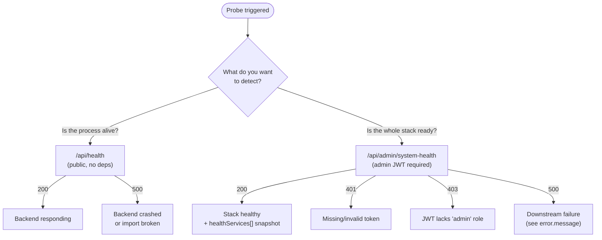

> **For operators and load balancers.** GENIE.AI exposes two layered health
> endpoints on the **backend** service (port `3000`):
>
> 1. **`/api/health`** — a public, dependency-free **liveness probe** (no auth).
> 2. **`/api/admin/system-health`** — a richer **admin diagnostic** that probes
>    ArangoDB, Keycloak, and the backend itself (requires the `admin` realm role).
>
> Use the first for liveness, the second for readiness and post-deploy smoke
> tests.

This page covers what each endpoint reports, how to wire them into your
infrastructure, and how to interpret the results.

## Prerequisites

- A reachable GENIE.AI deployment via one of:
  - **Docker Compose** — see
    [Deploy &rarr; Docker Compose Setup](/docs/deploy/docker-compose-setup/).
  - **Docker Swarm** — see
    [Deploy &rarr; Docker Swarm Setup](/docs/deploy/docker-swarm-setup/).
  - **Ansible** automated Swarm — see
    [Deploy &rarr; Install Guide](/docs/deploy/install-guide/).
- The stack's **public domain** (`NGINX_PUBLIC_DOMAIN` in `.env`, default
  `localhost`) and **HTTPS port** (`NGINX_HTTPS_PORT`, default `443`).
- For the admin endpoint: a Keycloak user with the **`admin`** realm role —
  see [Configure &rarr; Keycloak Admin Guide](/docs/configure/keycloak-admin-guide/).
- For liveness wiring: write access to your load balancer, Kubernetes probe,
  or monitoring system that will consume the endpoint.

## Endpoint summary

| | `/api/health` (liveness) | `/api/admin/system-health` (diagnostic) |
|---|---|---|
| **Auth** | Public — no token | Keycloak JWT with `admin` realm role |
| **Probes** | Backend only (no downstream calls) | Backend + ArangoDB + Keycloak + system metrics |
| **Use for** | Liveness probe, dependency-free heartbeat | Readiness probe, post-deploy smoke, admin dashboard |
| **Speed** | < 50 ms (in-memory) | 100–500 ms (queries ArangoDB) |
| **Failure body** | `500 {"message": "Health check failed"}` | `401` (no token), `403` (wrong role), `500 {"message":"An unexpected error occurred"}` (service crash) |
| **Defined at** | [`components/gov-chat-backend/index.js:711`](https://gitlab.com/un/itu/genie-ai/-/blob/main/components/gov-chat-backend/index.js#L711) | [`components/gov-chat-backend/routes/admin-routes.js:65`](https://gitlab.com/un/itu/genie-ai/-/blob/main/components/gov-chat-backend/routes/admin-routes.js#L65) |



## `/api/health` — public liveness probe

The simplest endpoint, defined in
[`components/gov-chat-backend/index.js:711`](https://gitlab.com/un/itu/genie-ai/-/blob/main/components/gov-chat-backend/index.js#L711).
It is registered in the public-paths list
([`middleware/keycloak-auth-middleware.js:10`](https://gitlab.com/un/itu/genie-ai/-/blob/main/components/gov-chat-backend/middleware/keycloak-auth-middleware.js#L10))
so Keycloak authentication is skipped.

### Request

```bash
# Compose (host): backend port 3000 is internal-only — go through nginx
curl -sk https://<NGINX_PUBLIC_DOMAIN>[:<NGINX_HTTPS_PORT>]/api/health

# Inside the Swarm overlay network (debug only): backend port 3000 is exposed
# internally; use the in-network DNS name "backend"
docker exec <stack>_backend wget -qO- http://localhost:3000/api/health
```

```json
{
  "status": "ok",
  "serverTime": "2026-09-18 14:23:45",
  "uptime": "86423 seconds"
}
```

### Response fields

| Field | Type | Meaning |
|-------|------|---------|
| `status` | string | Hardcoded `"ok"` when the Express handler can respond. The endpoint does **not** check ArangoDB, Keycloak, or any downstream service. |
| `serverTime` | string | Current server time formatted `YYYY-MM-DD HH:MM:SS` in **UTC** (`new Date().toISOString()`). Useful for clock-skew checks against your load balancer. |
| `uptime` | string | `Math.floor(process.uptime()) + ' seconds'` — whole seconds since the Node.js process started. Reset to `0 seconds` after every backend restart. |

### Failure modes

- **500 `{"message": "Health check failed"}`** — the handler itself threw
  (Express app crashed mid-request or a downstream import broke). The body
  is plain `{message}` — **no `status` field** — so a load balancer can
  distinguish "backend alive but sick" from "backend gone".

### When to use it

- **Docker Swarm healthcheck** — already configured in
  `docker-compose.yaml` for the `backend` service (see [Wiring examples](#wiring-examples)).
  Swarm reaps the container when the probe fails five times in a row.
- **Kubernetes liveness probe** — set `livenessProbe.httpGet.path=/api/health`.
  The endpoint is dependency-free, so it cannot false-positive when ArangoDB
  is briefly down (use the [readiness probe](#readiness) for that).
- **Reverse-proxy upstream checks** — Kong/Nginx `health_check` blocks. Kong
  routes `/api/*` to the backend (see
  [`api-gateway-solution/new-config/kong_config.json:82`](https://gitlab.com/un/itu/genie-ai/-/blob/main/api-gateway-solution/new-config/kong_config.json#L82)).

### When NOT to use it

- For **readiness**, do not use `/api/health` — it does not probe ArangoDB
  or Keycloak. Wire readiness to `/api/admin/system-health` instead
  (or a custom dependency-aware probe).
- For **liveness of the whole stack** (frontend, OPEA, document repository),
  `/api/health` is backend-only. Probe each service's own port or rely on
  the [Application Metrics dashboard](/docs/observe/dashboards/).

## `/api/admin/system-health` — admin diagnostic

A richer endpoint that probes the actual dependencies the backend talks to.
Defined in
[`components/gov-chat-backend/routes/admin-routes.js:65`](https://gitlab.com/un/itu/genie-ai/-/blob/main/components/gov-chat-backend/routes/admin-routes.js#L65).
Registered for `/api/admin` in the `ROUTE_CONFIGS` table at
`index.js:495` (entry `{ file: 'admin-routes', paths: ['/api/admin'] }`),
mounted at runtime by `registerRoutes()` called at `index.js:766`, then
guarded by `keycloakAuthMiddleware.requireAdmin` at `admin-routes.js:45` —
so **both authentication and the `admin` realm role are required**.

### Request

```bash
# Pull a realm token (Direct Access Grants are disabled by default —
# see /docs/operate/server-testing/ for the temporary-enable pattern).
# Defaults from env: KEYCLOAK_REALM=genie, KEYCLOAK_CLIENT_ID=genie-app.
ADMIN_TOKEN=$(curl -sk -X POST \
  "${KEYCLOAK_URL:-https://${NGINX_PUBLIC_DOMAIN}/auth}/realms/${KEYCLOAK_REALM:-genie}/protocol/openid-connect/token" \
  --data-urlencode "grant_type=password" \
  --data-urlencode "client_id=${KEYCLOAK_CLIENT_ID:-genie-app}" \
  --data-urlencode "username=<admin-user>" \
  --data-urlencode "password=<admin-password>" \
  | python3 -c "import sys,json; print(json.load(sys.stdin)['access_token'])")

curl -sk -H "Authorization: Bearer $ADMIN_TOKEN" \
  https://<NGINX_PUBLIC_DOMAIN>[:<NGINX_HTTPS_PORT>]/api/admin/system-health
```

### Response shape

`AdminDashboardService.getSystemHealth()`
([`services/admin-dashboard-service.js:52`](https://gitlab.com/un/itu/genie-ai/-/blob/main/components/gov-chat-backend/services/admin-dashboard-service.js#L52))
returns:

```json
{
  "metrics": {
    "systemUptime": 99.99,
    "avgResponseTime": 142,
    "errorRate": 0.21,
    "monthlyActiveUsers": 87
  },
  "trends": {
    "uptime": 0.1,
    "responseTime": -3.2,
    "errorRate": 0.0,
    "activeUsers": 4.0
  },
  "resourceUsage": {
    "cpu": 23,
    "memory": 41,
    "storage": 12
  },
  "healthServices": [
    { "id": "apiServices", "name": "API Services",     "status": "good" },
    { "id": "database",     "name": "Database",         "status": "good" },
    { "id": "cache",        "name": "Cache",            "status": "good" },
    { "id": "storage",      "name": "Storage",          "status": "good" },
    { "id": "messageQueue", "name": "Message Queue",    "status": "good" },
    { "id": "externalApi",  "name": "External API",     "status": "good" }
  ]
}
```

| Field | Meaning |
|-------|---------|
| `metrics` | Aggregate KPIs: `systemUptime` (% over last 30d), `avgResponseTime` (ms), `errorRate` (%), `monthlyActiveUsers` (count). |
| `trends` | Percentage deltas versus the 30–60 days ago window — but the four fields use **different** reference windows, so they are not strictly comparable to each other. `uptime` and `activeUsers` compare the last 30 days to the 30–60 days ago window (true month-over-month). `responseTime` compares the last 24 hours of `queries` (the same window as `avgResponseTime` above) to the 30–60 days ago window — so the trend mixes a 24-hour numerator with a 30-day denominator. `errorRate` compares yesterday's `combined-<date>.log` against the 30–60 days ago window — same mixed-window caveat. |
| `resourceUsage` | Live host metrics from `ResourceUsageMonitor`: `cpu` (%), `memory` (%), `storage` (%). Used to drive `healthServices[].status`. |
| `healthServices[]` | One entry per dependency. `status` uses the vocabulary `good` / `warning` / `error`; `apiServices` flips to `warning` when CPU ≥ 80%, `storage` when storage ≥ 90%. |

### Failure modes

- **401 `{"error":"TOKEN_INVALID","message":"Missing or malformed Authorization header","details":{}}`** —
  no `Authorization: Bearer` header. Returned by the auth middleware at
  [`middleware/keycloak-auth-middleware.js:78`](https://gitlab.com/un/itu/genie-ai/-/blob/main/components/gov-chat-backend/middleware/keycloak-auth-middleware.js#L78)
  (the `__tests__/routes/admin.test.js:140` test mocks this middleware to a
  shorter body, so its assertion body does not match the production shape).
- **403 `{"error":"FORBIDDEN","message":"Admin access required","details":{}}`** —
  JWT is valid but lacks the `admin` realm role (test:
  [`__tests__/routes/admin.test.js:149`](https://gitlab.com/un/itu/genie-ai/-/blob/main/components/gov-chat-backend/__tests__/routes/admin.test.js#L149)).
- **500 `{"message":"An unexpected error occurred","error":"<NODE_ENV-only>"}`** —
  `getSystemHealth()` threw (ArangoDB unreachable, malformed config). Handled
  by the error middleware at `index.js:789`.

### When to use it

- **Operator dashboard** — the Admin UI's **Overview** tab polls this on
  load and surfaces the result as colored status pills.
- **Readiness probe** for Kubernetes / Swarm when the load balancer should
  remove the backend from rotation only when the *whole* stack is sick.
- **Post-deploy smoke test** — the canonical first check after every
  release.

## Wiring examples

### Docker Swarm healthcheck (already configured)

`docker-compose.yaml` (root, backend service block at line 484) ships with:

```yaml
healthcheck:
  test: ["CMD", "wget", "--no-verbose", "--tries=1", "--spider", "http://localhost:3000/api/health"]
  interval: 10s
  timeout: 5s
  retries: 5
  start_period: 90s
```

The probe hits `/api/health` over the in-container loopback — no network
hops, no auth. Swarm marks the task `unhealthy` after five consecutive
failures (matching `retries: 5`) and replaces it. The `start_period: 90s`
gives the Node.js process time to load `AdminDashboardService` and other
heavy modules on first boot.

> **Backend image note:** the runtime image is
> `node:22-slim` and ships `wget` (the entrypoint needs it to wait for
> ArangoDB). If you ever switch to a `node:22-alpine` base, install
> `wget` before the `HEALTHCHECK` line or the probe will silently fail.

### Kubernetes probes

```yaml
livenessProbe:
  httpGet:
    path: /api/health
    port: 3000
  initialDelaySeconds: 30
  periodSeconds: 30
readinessProbe:
  httpGet:
    path: /api/admin/system-health
    port: 3000
  httpHeaders:
    - name: Authorization
      value: Bearer <service-account-token>
  initialDelaySeconds: 10
  periodSeconds: 15
  failureThreshold: 3
```

> **Important:** the readiness probe needs a service-account JWT with the
> **`admin`** realm role. Mint one via Keycloak's `client_credentials`
> grant with a dedicated `genie-readiness` client (recommended), or reuse
> the `genie-app` client if its service account carries the role. The
> default `genie-app` client does **not** carry the `admin` role by
> default — check
> [Configure &rarr; Keycloak Admin Guide](/docs/configure/keycloak-admin-guide/).

### Prometheus / blackbox_exporter

`/api/health` is plain JSON, not Prometheus-format. Wire it through
`blackbox_exporter` if you want to scrape it:

```yaml
# prometheus.yml
scrape_configs:
  - job_name: genie_health
    metrics_path: /probe
    params:
      module: [http_2xx]
    static_configs:
      - targets: ['<NGINX_PUBLIC_DOMAIN>:<NGINX_HTTPS_PORT>']
    relabel_configs:
      - source_labels: [__address__]
        target_label: __param_target
      - source_labels: [__param_target]
        target_label: instance
      - target_label: __address__
        replacement: blackbox-exporter:9115
```

## Verify it worked

After wiring, exercise both endpoints end-to-end from the gateway host:

```bash
# 1. Public liveness — must return 200 + status:"ok" without a token
curl -sk -w "\nHTTP %{http_code}\n" \
  https://<NGINX_PUBLIC_DOMAIN>[:<NGINX_HTTPS_PORT>]/api/health

# 2. Admin diagnostic — must return 200 + the dependency snapshot
curl -sk -H "Authorization: Bearer $ADMIN_TOKEN" \
  -w "\nHTTP %{http_code}\n" \
  https://<NGINX_PUBLIC_DOMAIN>[:<NGINX_HTTPS_PORT>]/api/admin/system-health

# 3. Negative case — admin endpoint without a token must return 401, not 500
curl -sk -w "\nHTTP %{http_code}\n" \
  https://<NGINX_PUBLIC_DOMAIN>[:<NGINX_HTTPS_PORT>]/api/admin/system-health

# 4. From inside the Swarm network (Compose/Swarm overlay), the in-container
#    path uses port 3000 and DNS name "backend"
docker exec <stack>_backend wget -qO- http://localhost:3000/api/health
```

| # | Expected | If different, suspect |
|---|----------|----------------------|
| 1 | `200`, body `{"status":"ok",...}` | nginx/Kong route missing `/api/health`; backend down |
| 2 | `200`, body with `metrics`/`healthServices[]` | Bad token (401); missing role (403); ArangoDB down (500) |
| 3 | `401` (with `{"error":"TOKEN_INVALID",...}`) | Auth middleware misconfigured — should NOT be 500 |
| 4 | `{"status":"ok",...}` | `wget` missing in backend image; in-network DNS broken |

Anything else means a wiring mistake (typically: probe hitting a port the
proxy does not expose, or the `admin` role missing from the service account).

## Troubleshooting

| Symptom | Cause | Fix |
|---------|-------|-----|
| `/api/health` returns **500** | The Express app crashed mid-request or a downstream import broke | Check `docker service logs <stack>_backend --since 5m` for stack traces. The endpoint itself is dependency-free. |
| `/api/health` hangs forever | Kong / Nginx is not routing `/api/health` | Verify Kong's route for the backend exposes `/api/health` (config: [`kong_config.json:82`](https://gitlab.com/un/itu/genie-ai/-/blob/main/api-gateway-solution/new-config/kong_config.json#L82)). Direct `curl http://backend:3000/api/health` from inside the overlay network should succeed. |
| `/api/admin/system-health` shows `database` with `status: 'error'` | ArangoDB is unreachable from the backend container | Check the network: `docker exec <stack>_backend wget -qO- http://arango-vector-db:8529/_api/version`. Confirm `ARANGO_URL` matches the deployed service name (`http://arango-vector-db:8529` by default — service name in `docker-compose.yaml` is `arango-vector-db`, **not** `arangodb`). |
| Admin endpoint returns **401** with a valid admin token | The JWT was minted against the wrong realm, or the `admin` role was not assigned | The admin endpoint validates against the **same realm** the user logs into, not `master`. Check `KEYCLOAK_URL` and `KEYCLOAK_REALM` (default `genie`) point at the user realm. |
| Admin endpoint returns **403** with a valid token | JWT is valid but lacks the `admin` realm role | Assign the role in Keycloak Admin Console → Users → Role mapping → Realm roles, or use a service account whose role mapping includes `admin`. See [Configure &rarr; Keycloak Admin Guide](/docs/configure/keycloak-admin-guide/). |
| Swarm repeatedly restarts a healthy backend | Healthcheck `interval` is shorter than the request latency | Raise `interval` to ≥ 30s and `timeout` to ≥ 5s. The endpoint takes < 50 ms but cold-start migrations can briefly block the event loop. |
| Kubernetes readiness probe flapping | `/api/admin/system-health` is slow under load (ArangoDB warm-up, Keycloak introspection) | Increase `failureThreshold` to 3 and `periodSeconds` to 15–20 s. For very large deployments, consider a separate readiness check that only pings ArangoDB. |
| `wget: not found` in healthcheck logs | Backend image was rebuilt on a slim base that dropped `wget` | Restore `wget` in the `Dockerfile` for `components/gov-chat-backend` (the entrypoint also needs it). |

## Related

- [Troubleshooting](/docs/operate/troubleshooting/) — broader diagnostic
  methodology (trace-first, logs-second).
- [Admin Logs](/docs/operate/admin-logs/) — when health is green but a
  service is silently degraded, the Logs tab shows you why.
- [Observe &rarr; Dashboards](/docs/observe/dashboards/) — the Service
  Health Overview dashboard is the human-facing complement to these
  endpoints.
- [Configure &rarr; Keycloak Admin Guide](/docs/configure/keycloak-admin-guide/) —
  how to assign the `admin` realm role for the diagnostic endpoint.
- [Configure &rarr; CORS &amp; CSP](/docs/configure/cors-csp/) — when your
  monitoring system originates from outside the configured
  `CORS_ALLOWED_ORIGINS` and the browser blocks the probe.
- [Deploy &rarr; Docker Swarm Setup](/docs/deploy/docker-swarm-setup/) —
  full deployment context (node labels, secrets, profiles).
- [Architecture Overview](/docs/architecture/architecture/) — where the
  backend, Kong, ArangoDB, and Keycloak fit in the system topology.