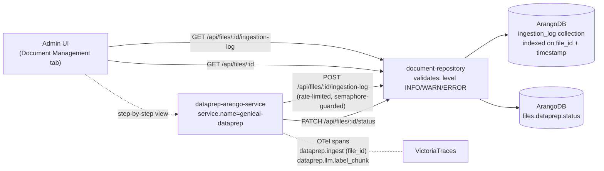

The **ingestion log** is the per-chunk progress feed that dataprep writes
during document ingestion. Every chunk event — parse, label, embed, context
generation, fallbacks — produces one row, addressed by `file_id`. The log is
the operator's primary tool for answering "why did this document land in
`failed` state?" or "what step was reached before the pipeline broke?"

This page consolidates what the ingestion log is, how to read it (UI and
ArangoDB), the canonical messages you will learn to grep for, and how to
correlate a log entry with the matching RAG-pipeline trace.

## Prerequisites

- A deployed GENIE.AI stack with the document-repository service running
  (the component that owns the `ingestion_log` collection and exposes the
  `/api/files/:fileId/ingestion-log` endpoints). See
  [Deployment &rarr; Docker Swarm]()
  if the stack is not yet up.
- An admin Keycloak user (the `Admin` role reads the log from the admin UI).
  Service-to-service callers authenticate as the `dataprep-service-client`
  OIDC client (mapped to the realm role `dataprep-service`).
- For ArangoDB-level reads: shell access to a Swarm node and the deployed
  `.env` file (`/opt/genieai/.env` for Ansible Swarm, project-root `.env` for
  Docker Compose) so you can read `ARANGO_PASSWORD`, `ARANGO_USERNAME`, and
  `ARANGO_DB`.
- For trace correlation: the observability stack must be enabled —
  `ENABLE_OBSERVABILITY=1` in `.env`, otherwise VictoriaTraces carries no
  spans and step 4 of the correlation recipe cannot work.

## Goal

Read the per-chunk ingestion log to answer "what happened to file `X`?":
identify the failing stage (`Labeling`, `Embedding`, `Contextualization`, …),
find the canonical failure message, and pivot to the matching RAG-pipeline
trace in VictoriaTraces to confirm the root cause.

## Data flow



## What it is, and what it is not

| Ingestion log | Document state (Document lifecycle) |
|---|---|
| Per-event progress feed — one row per dataprep action on a chunk or file | Per-document state machine (`uploaded` → `processing` → `completed` / `failed`) |
| Lives in the ArangoDB `ingestion_log` collection (admin-readable via `/api/files/:fileId/ingestion-log`) | Lives in the `files` collection as `dataprep.status` |
| Append-only — a chunk can have many rows | Single field — one value at a time |
| Written by **dataprep only** | Written by dataprep (`PATCH /api/files/:fileId/status`) |

The two views are correlated: a `failed` document status almost always has
one or more `failed`-themed ingestion-log rows leading up to it.

## Endpoints

| Method | Path | Caller | Role | Purpose |
|---|---|---|---|---|
| `POST` | `/api/files/:fileId/ingestion-log` | dataprep (`dataprep-arango-service`) | `Admin` OR `dataprep-service` | Append a new log row for the file. |
| `GET` | `/api/files/:fileId/ingestion-log` | admin UI (`FileDetailsDialog.vue`), dataprep | `Admin` OR `dataprep-service` | Read the log entries for the file. |
| `PATCH` | `/api/files/:fileId/status` | dataprep | `Admin` OR `dataprep-service` | Set the document state and `chunk_count`. Valid statuses: `Pending`, `Ingesting`, `Ingested`, `Ingested with Warnings`, `Ingestion Error`, `Retracted`, `Killed`. Optional `ingest_date` / `retract_date` ISO 8601 strings also accepted. |

The admin Logs tab does not show the ingestion log directly — the per-file
ingestion log is read from the **Document Management tab → File Details
Dialog** in the admin UI.

## Schema of an entry

Stored in ArangoDB `ingestion_log` collection:

| Field | Type | Description |
|---|---|---|
| `file_id` | string | The file the row belongs to (NOT `fileId`). |
| `message` | string | Human-readable event description — see canonical messages below. |
| `timestamp` | ISO 8601 | When the event happened. |
| `level` | string | `INFO`, `WARN`, `ERROR` (uppercase — set by the Joi schema in `components/document-repository/src/controllers/fileController.js:85-89`; dataprep emits these strings verbatim). |
| `stage` | string | Pipeline stage emitting the event — one of `Labeling`, `Contextualization`, `Chunking`, `Graph`, `System`, `Guardrail`, `Retract` (PascalCase strings; not dot-separated). |

## Canonical messages you will grep for

These are the strings produced by `genie-ai-overlay/dataprep/genieai_dataprep_arangodb.py`
via `_write_ingestion_log(...)`. Learning them saves hours of debugging.

| Message (substring) | Example full message | Meaning | Operator action |
|---|---|---|---|
| `Final labels` | `Chunk 12: Final labels (3): ["Tax:IVA","Topic:Property","Audience:Citizen"].` | Labelling for this chunk is complete (with the chosen labels listed). | None — this is the happy path. |
| `failed` | `Chunk 7: Batch labeling call failed for chunks [7, 8] (vLLM timeout); falling back to per-chunk.` | A stage failed for this chunk/file. Read the surrounding message for the cause. | Cross-reference the trace in VictoriaTraces and the service logs. |
| `using raw chunks` | `Doc-level context generation failed after 3 attempts — using raw chunks.` | Contextual Retrieval / doc-context generation failed; ingestion continued with raw chunks (no contextual prefix). | Investigate per-chunk cause. Common: vLLM client init failed, LLM timeout, JSON parse error. |
| `using raw chunk` | `Chunk 14: context generation failed after 3 attempts — using raw chunk.` | A single chunk's context-generation retries were exhausted; that chunk ingested with the raw text. | Usually transient (vLLM load). Investigate per chunk if persistent. |
| `Batch labeling parse failure` | `Batch labeling parse failure for chunks [3, 4, 5]; falling back to per-chunk.` | The labelling LLM returned non-JSON despite guided JSON (batched path). | Model compatibility issue — see [RAG &rarr; Choosing models](). |
| `Batch labeling call failed` | `Batch labeling call failed for chunks [7, 8] (vLLM timeout); falling back to per-chunk.` | A labelling batch failed; per-chunk fallback engaged. | Usually transient (vLLM load). Retry; if persistent, lower `DATAPREP_LLM_LABEL_BATCH_SIZE`. |
| `context generation failed` | `Chunk 14: context generation failed after 3 attempts — using raw chunk.` | Contextual Retrieval's per-chunk doc-context call failed; chunk ingested without the context prefix. | Non-fatal — the chunk is still retrievable but with weaker labels. |

## Reading the log via ArangoDB

When the admin UI is unavailable (or you want a one-off script), query
ArangoDB directly. Use the base64 remote-script pattern from
`.claude/rules/DEBUGGING-TRACING.md` §3 / §5 to keep quoting sane.

```python
# Save as /tmp/analyze_ingestion_log.py, base64-encode, ssh + run on the swarm node
# Adjust ENV_PATH to match your deployment:
#   /opt/genieai/.env    — Ansible Swarm
#   <project-root>/.env  — Docker Compose (run on the Swarm node where arango lives)
import json, urllib.request, base64
ENV_PATH = "/opt/genieai/.env"
env = {k:v for k,v in (l.strip().split("=",1) for l in open(ENV_PATH)
       if "=" in l and not l.startswith("#"))}
env = {k:v.strip().strip('"').strip("'") for k,v in env.items()}
url = "http://localhost:%s/_db/%s/_api/cursor" % (
    env.get("ARANGO_PORT","8529"), env.get("ARANGO_DB","genie-ai"))
auth = base64.b64encode(("%s:%s" % (env.get("ARANGO_USERNAME","root"),
       env.get("ARANGO_PASSWORD",""))).encode()).decode()
def q(aql):
    req = urllib.request.Request(url, data=json.dumps({"query":aql}).encode(),
        headers={"Authorization":"Basic "+auth, "Content-Type":"application/json"})
    return json.load(urllib.request.urlopen(req)).get("result",[])

FILE_ID = "<file_id>"

# All log rows for the file, newest first
for m in q('FOR d IN ingestion_log FILTER d.file_id=="%s" '
           'SORT d.timestamp DESC RETURN {ts: d.timestamp, msg: d.message}' % FILE_ID):
    print(m)

# Just the failures
for m in q('FOR d IN ingestion_log FILTER d.file_id=="%s" AND d.message LIKE "%%failed%%" '
           'RETURN d.message' % FILE_ID):
    print(m)
```

> **AQL gotcha:** the field is `file_id` (snake_case), not `fileId`. The
> `%%` is an escaped `%` in AQL string literals. The default ARANGO_DB is
> `genie-ai` (see `docker-compose.yaml`); the script falls back to that
> only if the env var is unset. The default `ARANGO_USERNAME` is `root`
> (the actual env var name is `ARANGO_USERNAME`, not `ARANGO_USER`).

## Correlating the ingestion log with the RAG-pipeline trace

A failed ingestion usually corresponds to a failed trace in VictoriaTraces.
The trace ID is propagated via the W3C `traceparent` header from the admin
UI / backend → dataprep. To find the matching trace:

1. Note the `file_id` from the admin UI Document Management tab.
2. Open the Trace Explorer dashboard in Grafana
   ([Observability &rarr; Dashboards]()).
3. Filter by `service.name=genieai-dataprep` and
   `attribute.dataprep.file_id=<file_id>`.
4. Open the trace and look for `dataprep.llm.label_chunk` / `dataprep.llm.label_batch`
   spans with red status — those are the per-chunk failures that produced
   `failed` / `raw-chunk fallback` ingestion-log rows.

For the trace-fetch recipe (including the `startTime` / `duration` microsecond
gotcha), see `.claude/rules/DEBUGGING-TRACING.md` §1.

## When to re-ingest vs when to fix

| Symptom in the log | First action | Re-ingest? |
|---|---|---|
| `Batch labeling parse failure` on every chunk | Check the model supports `response_format=json_object` ([RAG &rarr; Choosing models]()). | No — fix the model config, then re-ingest. |
| `failed` on the **context generation** step only | Lower `DATAPREP_CONTEXTUAL_DOC_BUDGET` or disable Contextual Retrieval (`CONTEXTUAL_RETRIEVAL_ENABLED=false`) temporarily. | Only if you want the context prefix on existing documents. |
| `raw-chunk fallback` on isolated chunks (most chunks labelled) | Usually transient vLLM load. Re-ingest if labels are critical. | Optional. |
| `failed` on **parsing** (docling) | Check the source file — scanned PDFs, password-protected files, etc. | After fixing the file (re-upload). |
| `failed` on **embedding** | Check the `tei` Docker service health (`docker service ps genieai_tei` or `docker compose ps tei`). Dataprep calls TEI directly at `TEI_EMBEDDING_ENDPOINT` (default `http://tei:80`) — it does **not** go through the OPEA `embedding` wrapper (that wrapper is used by chatqna). | After the `tei` service is healthy again. |

## Verify it worked

After you read or query the ingestion log, confirm the full pipeline is consistent:

```bash
# 1. The collection exists and is indexed
docker exec $(docker ps --format '{{.Names}}' | grep arango-vector-db | head -1) \
  arangosh --server.password "$ARANGO_PASSWORD" --javascript.execute-string '
    print(db._collections().filter(c => c._name === "ingestion_log").length);
    print(db.ingestion_log.indexes.map(i => i.id).join(","));
'
# Expected: prints "1" and a list including idx_ingestion_log_file_id, idx_ingestion_log_timestamp.

# 2. A known file returns rows (replace FILE_ID with a real id from the admin UI)
docker exec $(docker ps --format '{{.Names}}' | grep arango-vector-db | head -1) \
  arangosh --server.password "$ARANGO_PASSWORD" --javascript.execute-string '
    print(db.ingestion_log.byExample({file_id: "FILE_ID"}).count());
'
# Expected: > 0 (the file is at least partially ingested).

# 3. The HTTP endpoint round-trips for an admin token
# Mint a realm access token from the admin Keycloak user, then call the endpoint.
# (Keycloak ROPC/direct grant is disabled by default; the admin-cli flow below uses
#  the master admin password already present in /opt/genieai/.env.)
KEYCLOAK_URL="https://$(grep ^NGINX_PUBLIC_DOMAIN= /opt/genieai/.env | cut -d= -f2)"
KC_ADMIN_PWD=$(grep ^KEYCLOAK_ADMIN_PASSWORD= /opt/genieai/.env | cut -d= -f2)
ADMIN_TOKEN=$(curl -sk -X POST "$KEYCLOAK_URL/realms/master/protocol/openid-connect/token" \
  -d "client_id=admin-cli" -d "username=admin" -d "password=$KC_ADMIN_PWD" \
  -d "grant_type=password" | python3 -c "import sys,json; print(json.load(sys.stdin)['access_token'])")
curl -sk -w "\nHTTP %{http_code}\n" \
  "$KEYCLOAK_URL/api/files/FILE_ID/ingestion-log" \
  -H "Authorization: Bearer $ADMIN_TOKEN" | tail -5
# Expected: HTTP 200 and a JSON array of ingestion_log rows.

# 4. The OTel Collector is reachable from dataprep
# (Reachability check — for an actual service.name probe see step 5.)
docker exec $(docker ps --format '{{.Names}}' | grep dataprep | head -1) \
  sh -c "echo \${OTEL_EXPORTER_OTLP_ENDPOINT:-http://otel-collector:4318}"
# Expected: prints the OTLP endpoint (default http://otel-collector:4318).

# 5. VictoriaTraces actually carries spans with service.name=genieai-dataprep
# (Requires ENABLE_OBSERVABILITY=1 and a recent ingest so a trace exists.)
VT_SERVICE=$(docker ps --format '{{.Names}}' | grep victoriatraces | head -1)
curl -sk "http://${VT_SERVICE}:10428/select/jaeger/api/services" \
  | python3 -c "import sys,json; d=json.load(sys.stdin); print('genieai-dataprep present:', 'genieai-dataprep' in d.get('data',[]))"
# Expected: prints "genieai-dataprep present: True" once a dataprep ingest has emitted spans.
```

If any step fails, the troubleshooting table below pinpoints the cause.

## Troubleshooting

| Symptom | Likely cause | Fix |
|---|---|---|
| The admin UI shows "No log entries" for a file that has `Ingestion Error` status | The POST `/api/files/:id/ingestion-log` calls are silently dropped because dataprep lost its Keycloak `dataprep-service` token (e.g. `KC_DATAPREP_CLIENT_SECRET` rotated without redeploy). | Confirm the secret in `.env`, then `docker service update --force genieai_dataprep-arango-service`; new ingestion-log rows resume on the next ingest. |
| Every dataprep log POST returns `HTTP 429 Too Many Requests` in service logs | `_log_semaphore` throttles concurrent log writes (max 100 in `_write_ingestion_log`); 429 responses from doc-repo are silently dropped by the response handler in the same function. | Non-fatal — ingestion continues, only the *log* rows are dropped. Investigate the underlying stage error via the matching trace. |
| AQL `FOR d IN ingestion_log FILTER d.file_id==...` returns 0 rows even though the admin UI shows rows | AQL field is `file_id` (snake_case), not `fileId`. The query parser silently returns empty if the field name is wrong. | Use `FILTER d.file_id==...` and double-check the index `idx_ingestion_log_file_id` is built (see verify step 1). |
| The matching trace does NOT exist in VictoriaTraces for a `failed` file | Observability stack disabled (`ENABLE_OBSERVABILITY=0`); or the trace was sampled out (`OTEL_TRACES_SAMPLER_RATE` < 100). | Set `ENABLE_OBSERVABILITY=1` and `OTEL_TRACES_SAMPLER_RATE=100.0`; redeploy. Historical rows have no traces. |
| VictoriaTraces shows the parent `dataprep.ingest` span but not the `dataprep.llm.label_*` children | The parent span returned before children flushed (race on shutdown / OOM kill). | Re-trigger the ingest; child spans re-emit on the next attempt. |
| Status field never moves past `Ingesting` | Dataprep crashed mid-pipeline (OOM, Swarm node failure, network to vLLM). The `Killed` PATCH was never sent. | Inspect `docker service logs genieai_dataprep-arango-service --since 1h`; manually `PATCH` the file to `Killed` (allowed roles: `Admin` or `dataprep-service`) to free the lock, then re-ingest. |
| Chunk count is `0` even though the file is `Ingested` | `chunk_count` is set by dataprep at the end of the run; if the pipeline errored before `await _update_doc_status(..., chunk_count=len(chunks))` the value stays at the pre-ingest default. | Cross-reference with the `dataprep.chunk_count` attribute on the `dataprep.chunking` span (child of `dataprep.ingest`); the discrepancy is the unreported failure. |
| `Level: WARN` rows show `New (non-taxonomy) labels suggested` | The labelling LLM hallucinated labels that are not in the `serviceCategories` taxonomy. | Review the suggested labels in the admin UI under Knowledge Hierarchy; promote any valid ones, then re-ingest. |
| Many rows with `Doc-level context generation failed after 3 attempts` | vLLM is overloaded (queue full, OOM) or `DATAPREP_CONTEXTUAL_DOC_BUDGET` is too large for the loaded context window. | Lower `DATAPREP_CONTEXTUAL_DOC_BUDGET`, or temporarily set `CONTEXTUAL_RETRIEVAL_ENABLED=false` and re-ingest. |

## Troubleshooting by symptom

The table above maps symptoms to likely causes in one row. The playbook below
maps the most common symptoms to a numbered recipe — useful when the
diagnosis needs a probe, not a one-liner.

### Symptom: file stuck in `Ingesting` for > 1 hour

1. Open the ingestion log; check whether entries are still being written.
2. If yes — the worker is alive but slow. Check dataprep container CPU/memory
   (`docker service ps genieai_dataprep-arango-service` for Swarm — in Swarm
   mode, container names are randomized; the service-style command works,
   while `docker stats` requires the exact randomized container name).
3. If no — the worker probably crashed. Restart the dataprep container; the
   file stays in `Ingesting` until the worker resumes or you kill it.

### Symptom: file ends in `Ingestion Error` with labelling parse failures

The labelling LLM returned malformed JSON. Almost always a model issue, not
a document issue. Steps:

1. Probe the live vLLM with the real `LABEL_SELECTOR_SYSTEM_PROMPT` and a
   real chunk from the file (see `.claude/rules/DEBUGGING-TRACING.md` §7 —
   use the base64 ssh pattern).
2. If the probe succeeds — check whether the file's content includes very
   long sections that may have hit `DATAPREP_CONTEXTUAL_MAX_TOKENS` (default
   `512`).
3. If the probe fails — the model is overloaded or misconfigured; check
   vLLM health and the model's guided-JSON support.

### Symptom: many files show batch labelling fallbacks

The primary embedding model is degraded. Steps:

1. Check the `embedding` / `tei` container logs.
2. Check the embedding service endpoint (`EMBEDDING_SERVICE_URL`) is
   reachable from `dataprep-arango-service` (the Docker service / DNS
   hostname; the OTel `service.name` for queries in VictoriaLogs is
   `genieai-dataprep`).
3. If `tei` is OOM-killed, scale down concurrency (`VLLM_MAX_NUM_SEQS`) or
   upgrade the embedding model.

### Symptom: file in `Ingested with Warnings`

Ingestion succeeded but at least one chunk used a fallback. The document IS
retrievable, but quality may be reduced. Open the ingestion log, count
warnings per chunk, and decide whether to retract + re-upload.

## Related

- [Knowledge base &rarr; Document lifecycle]() — the per-document state machine
- [Knowledge base &rarr; Ingestion]() — the ingestion pipeline overview
- [RAG &rarr; Data labelling strategy]() — labelling failure modes in detail
- [RAG &rarr; Contextual Retrieval]() — what the context-generation step does
- [Troubleshooting]() — ingestion-stuck recipes
- [Admin Logs]() — the VictoriaLogs search for service-level errors
