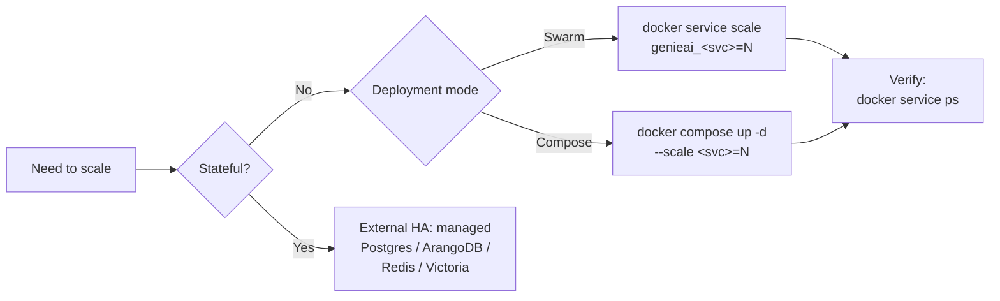

GENIE.AI runs ~30 services in `docker-compose.yaml` (excluding init/migration
helpers and named volumes). Each scales differently depending on its workload
profile. This guide groups services by scaling category and explains what to
watch.

## Prerequisites

- A deployed stack (see [Install guide](/docs/deploy/install-guide/) or
  [Docker Swarm setup](/docs/deploy/docker-swarm-setup/)).
- Docker CLI access on a Swarm manager node (`docker service ls` returns the
  stack).
- For GPU scaling: at least one Swarm node labelled `gpu=true` (see
  [GPU deployment](/docs/deploy/gpu/) and
  [Topologies](/docs/deploy/topologies/)).
- For observability scaling: `ENABLE_OBSERVABILITY=1` set in `.env` (or
  `enable_observability: "1"` in the Ansible vars).

> **Stack-name caveat:** the Ansible playbook defaults
> `stack_name: genieai` (see `deploy/ansible/group_vars/all.yml`), so the
> examples below assume services are prefixed `genieai_<service>`. If you
> overrode `stack_name` at deploy time (`--extra-vars stack_name=foo`), use
> `foo_<service>` instead.

## Scaling categories at a glance

| Category | Services | Scales? | Caveat |
|---|---|---|---|
| **Stateless** | `backend`, `frontend`, `kong`, `otel-collector` | Yes (freely, except `otel-collector`) | Add replicas behind the same Kong route; `otel-collector` is `mode: global` (one replica per Swarm node — do not override) |
| **Stateful — single-writer** | `arango-vector-db`, `postgres`, `redis-cache` | Single instance by design | HA needs external/managed service |
| **Stateful — sticky** | `document-repository`, `keycloak` | Keycloak: clustering mode. Doc-repo: shared volume (NFS, EFS) | Uploads are volume-bound |
| **AI — GPU-bound** | `vllm`, `embedding`, `reranker`, `retriever-arango-service`, `dataprep-arango-service`, `chatqna-xeon-backend-server`, `translation`, `textgen` | Per-GPU budget | One replica per GPU; concurrent requests contend |
| **Observability — storage-bound** | `victoriametrics`, `victorialogs`, `victoriatraces` | Per storage | Retention/size tradeoff (see env vars) |

## Stateless services

These have no on-disk state. Scale freely with `docker service scale` (Swarm)
or `docker compose up -d --scale <svc>=N` (compose).

```bash
# Scale backend to 3 replicas
docker service scale genieai_backend=3

# Scale frontend to 2 replicas
docker service scale genieai_frontend=2
```

Verify:

```bash
docker service ps genieai_backend          # desired-state == running
docker service logs genieai_backend --since 2m
```

No caveats. Kong auto-discovers new backend replicas through its DNS-based
upstream; no reload required.

## Stateful — single-writer

These services are deployed as a single replica by design
(`replicas: 1` in compose). The compose stack does not include clustering
configuration for them.

**ArangoDB** (`arango-vector-db`) — single primary, no read-replica config in
the shipped compose. Two practical paths for HA:

1. **External managed ArangoDB** (ArangoDB Oasis, ArangoGraph) — point
   `ARANGO_URL` to the managed endpoint and keep the in-stack
   `arango-vector-db` service scaled to 0.
2. **Self-managed cluster** — replace the in-stack service with your own
   `arangodb` cluster deployment and reuse the same env vars
   (`ARANGO_DB`, `ARANGO_USER`, `ARANGO_PASSWORD`,
   `ARANGO_GRAPH_NAME`).

   > Do **not** edit the in-stack compose to add replication — the bundled
   > service is configured as a single coordinator and does not ship a
   > `_arangodb_.replication` block.

**PostgreSQL** (`postgres`) — Kong + Keycloak + db-migrations all point at the
same instance (the compose defaults `POSTGRES_USER=genieai`,
`POSTGRES_DB=kong`). For HA:

- Run a managed Postgres (RDS, Cloud SQL) and override the connection env
  vars in `.env`: `KONG_PG_HOST=...` (Kong) and `KC_DB_URL=...`
  (Keycloak, e.g. `jdbc:postgresql://<host>:5432/keycloak`). Then migrate
  the schema with `kong-migrations` + `db-migrations` + `postgres-init`
  against the managed host.
- Or run Postgres with `repmgr` / `pg_auto_failover` and a virtual IP.

**Redis** (`redis-cache`) — single primary is fine for caching (no data loss
on restart; cache misses are absorbed by the backend). For HA, use Sentinel,
a managed Redis (ElastiCache, MemoryDB), or run a second instance and point
clients at it explicitly.

Verify:

```bash
docker exec genieai_postgres pg_isready -U genieai -d kong
docker exec genieai_redis-cache redis-cli PING   # returns PONG
```

## Stateful — sticky

**Keycloak** (`keycloak`) — the in-stack service is a **single instance** with
placement `node.labels.gateway == true`. It uses the bundled Postgres
backend and does **not** configure JGroups / clustering out of the box. For
clustering:

- All nodes must share the same Postgres backend (already true in-stack).
- A shared `KEYCLOAK_PROXY_CLIENT_SECRET` (this is a **single shared secret**
  across all nodes — not rotated per node; the OIDC proxy client
  authenticates every backend service identically).
- The Keycloak image defaults `cache-owners=1` — for clustering override
  `KC_CACHE_OWNERS_COUNT=2` and set `KC_CACHE_STACK=jdg` plus a JGroups
  transport (`JDBC_PING` works against the shared Postgres). The bundled
  `genie-ai-keycloak` image does not ship these overrides; for true
  clustering replace the in-stack service with a Keycloak cluster
  deployment.

**Document-repository** (`document-repository`) — uploads go to a named
volume (`doc_repo_uploads` mounted at `/app/uploads`). For multiple replicas:

- Mount the **same** external volume on every replica (NFS, EFS, a shared
  block device) by editing the in-stack service `volumes:` block to point at
  the external mount, **or**
- Set `UPLOAD_DIR` in `.env` to a path inside a shared volume. `UPLOAD_DIR`
  only changes the local path the Node app writes to (default `./uploads`,
  baked in `components/document-repository/Dockerfile` `ENV UPLOAD_DIR=./uploads`
  and read by `src/config/appConfig.js`); it does **not** add S3 or any
  other object-store backend. For object storage, mount an S3-compatible
  filesystem (s3fs, goofys) under `UPLOAD_DIR`.
- Run only **one** OTel Collector process per Swarm node (the compose already
  uses `mode: global` for `otel-collector` — do not override this) or use
  the OTel SDK in the document-repository code path instead.

## AI services (GPU-bound)

GPU services ship a single replica per GPU node. The compose uses two
templates: `replicas: ${GPU_MODEL_REPLICAS:-${DEPLOY_OPEA:-1}}` for the
heavyweight services (`vllm`, `vllm-translation-guardrail`, `translation`, `tei`,
`tei_reranker`) and `replicas: ${DEPLOY_OPEA:-1}` for the lighter OPEA
wrappers (`textgen`, `embedding`, `reranker`, `dataprep-arango-service`,
`retriever-arango-service`, `chatqna-xeon-backend-server`). Each replica
pins to one GPU; concurrent requests share the KV cache on vLLM and contend
for TEI worker threads on the embedding/reranker containers.

### vLLM

```bash
docker service scale genieai_vllm=2   # 2 replicas, 2 GPU nodes required
```

Caveats:

- **GPU memory contention**: concurrent requests share the KV cache.
- **Sub-linear throughput past ~70% GPU utilization** is a rule of thumb,
  not a measured threshold — verify with the
  [RAG pipeline trace dashboard](/docs/operate/troubleshooting/).
- **Watch the queue**:
  ```bash
  # vLLM Prometheus metrics on port 8000 (network-internal)
  docker exec $(docker ps --format '{{.Names}}' | grep '^genieai_vllm' | head -1) \
    curl -s http://localhost:8000/metrics | grep -E '^vllm:(num_waiting|num_requests_running)'
  ```
  A sustained non-zero `vllm:num_waiting` means requests are queueing — add
  another replica (and another GPU) or reduce concurrent requests.

### Dataprep (`dataprep-arango-service`)

```bash
docker service scale genieai_dataprep-arango-service=2
```

Caveats:

- Each replica runs labelling LLM calls against vLLM — multiple replicas
  multiply vLLM load (see `genie-ai-overlay/dataprep/genieai_dataprep_arangodb.py`).
- **Per-replica concurrency**: `DATAPREP_MAX_CONCURRENT_BATCHES` (default
  `20`, raised from `5` after the labelling-bottleneck fix).
- **Batch size**: `DATAPREP_LLM_LABEL_BATCH_SIZE` (default `4`) — chunks
  per labelling call. Larger batches amortise the call overhead but stretch
  the per-call latency window.
- Watch ingestion throughput on the ingestion-log dashboard.

### Embedding / Reranker

CPU-friendly when using the `tei` profile; GPU-bound when using the bundled
embedding/reranker image. Scale for throughput:

```bash
docker service scale genieai_embedding=3
docker service scale genieai_reranker=2
```

These are independent of each other; chatqna calls embedding during ingest
and reranker during query. If only one is hot, scale that one only.

### Retriever / ChatQnA / Translation / Textgen

Scale per GPU availability. Each replica pins to one GPU (`node.labels.gpu
== true`). Concrete service names (do not abbreviate when scaling):

| Logical name | Compose service name | Internal port |
|---|---|---|
| Retriever | `retriever-arango-service` | 7000 |
| ChatQnA | `chatqna-xeon-backend-server` | 8888 |
| Translation | `translation` | 8888 |
| Textgen | `textgen` | 9000 |

```bash
docker service scale genieai_chatqna-xeon-backend-server=2
docker service scale genieai_retriever-arango-service=2
docker service scale genieai_translation=2
docker service scale genieai_textgen=2
```

## Observability — storage-bound

`VictoriaMetrics` / `VictoriaLogs` / `VictoriaTraces` scale on disk and
retention. All three default to a single instance controlled by the
`observability` profile (Compose) or `ENABLE_OBSERVABILITY=1` (Swarm).

| Service | Retention env var | Default | Storage path (volume) |
|---|---|---|---|
| `victoriametrics` | `VICTORIAMETRICS_RETENTION` | `30d` | `/var/lib/victoria-metrics` (`vm-data`) |
| `victorialogs` | `VICTORIALOGS_RETENTION` | `30d` | `/var/lib/victoria-logs` (`vlogs-data`) |
| `victoriatraces` | `VICTORIATRACES_RETENTION` | `30d` | `/var/lib/victoria-traces` (`vtraces-data`) |

For multi-replica observability, all three use the `--retentionPeriod` flag
and a `--storageDataPath` flag mapped to named volumes: `--storageDataPath=/var/lib/victoria-metrics` (volume `vm-data`),
`--storageDataPath=/var/lib/victoria-logs` (volume `vlogs-data`),
`--storageDataPath=/var/lib/victoria-traces` (volume `vtraces-data`). For cluster mode:

1. Convert each service to multi-replica (`replicas: N`).
2. Mount the **same** external storage path on every replica (NFS, EFS,
   CephFS) by editing the in-stack `volumes:` block.

The Compose stack does **not** ship Victoria cluster-mode config — for
production HA, run VictoriaCluster externally and point the OTel Collector
exporters at the cluster endpoints.

## Scaling on Swarm vs Compose



### Swarm (production)

```bash
docker service scale genieai_backend=3
```

The Swarm scheduler spreads replicas across nodes that satisfy the service's
placement constraints:

| Label | Services |
|---|---|
| `node.labels.gateway == true` | `postgres`, `kong`, `kong-migrations`, `kong-config`, `nginx`, `certbot`, `keycloak` |
| `node.labels.genieai == true` | `frontend`, `backend`, `redis-cache`, `db-migrations`, `document-repository`, `clamav`, `arango-vector-db` |
| `node.labels.gpu == true` | `vllm`, `textgen`, `vllm-translation-guardrail`, `translation`, `guardrail`, `tei`, `tei_reranker`, `embedding`, `reranker`, `dataprep-arango-service`, `retriever-arango-service`, `chatqna-xeon-backend-server`, `chatqna-xeon-ui-server`, `chatqna-xeon-nginx-server` |
| `mode: global` (no label) | `otel-collector` — one replica per Swarm node |

Scaling a service whose placement constraint is not present on any node will
leave it at `0/N` replicas — Swarm will refuse to schedule new replicas. See
[Topologies](/docs/deploy/topologies/) for the per-topology node-label
matrix.

### Compose (single-host)

```bash
docker compose up -d --scale backend=3 --scale frontend=2
```

Note: Compose `--scale` only works for stateless services — Compose has no
placement control for stateful services. For stateful HA, follow the
patterns in [Stateful — single-writer](#stateful--single-writer) and
[Stateful — sticky](#stateful--sticky).

## What to watch per service

| Symptom | Likely cause | Action |
|---|---|---|
| `vllm:num_waiting > 0` | vLLM saturated | Scale vLLM or reduce concurrent requests |
| Backend returns 503 | Backend pool exhausted | Scale backend replicas |
| ArangoDB "primary not found" | Replica promotion needed | Restart `arango-vector-db`, verify cluster topology |
| Document-repository upload fails | Shared volume disconnected | Check mount, restart doc-repo |
| Redis `OOM` errors | Cache too small | Scale Redis memory or enable eviction |
| Keycloak login slow | Auth DB CPU-bound | Scale Postgres or move to managed |
| `victorialogs` disk filling | Retention too long | Lower `VICTORIALOGS_RETENTION` or add storage |
| `chatqna` 500s | Downstream (retriever/reranker) saturated | Scale downstream; chatqna is stateless |
| Dataprep ingest slow | vLLM labelling bottleneck | Raise `DATAPREP_MAX_CONCURRENT_BATCHES`, then scale dataprep |

## Rollback

If a scaling change causes issues, scale back down:

```bash
docker service scale genieai_backend=1
docker service scale genieai_vllm=1
```

Monitor for 5-10 minutes before declaring success.

## Verify it worked

```bash
# Confirm desired state matches running replicas
docker service ls --filter name=genieai_backend
# NAME                MODE                REPLICAS   IMAGE
# genieai_backend     replicated          3/3        ...

# Confirm no errors after scaling
docker service logs genieai_backend --since 5m | grep -iE 'error|panic|fatal'

# Confirm Kong still routes (stateless services)
curl -fsS https://${NGINX_PUBLIC_DOMAIN}/api/health || echo "API down"
```

## Related

- [Install guide](/docs/deploy/install-guide/) — single-host setup
- [Docker Swarm setup](/docs/deploy/docker-swarm-setup/) — production deploy
- [Docker Compose setup](/docs/deploy/docker-compose-setup/) — single-host reference
- [GPU deployment](/docs/deploy/gpu/) — GPU sizing and profiles
- [Topologies](/docs/deploy/topologies/) — multi-node, remote-GPU, observability topologies
- [NVIDIA A40 install](/docs/deploy/a40-install/) — A40 worked example
- [Backup & restore](/docs/operate/backup-restore/) — stateful backup
- [Health checks](/docs/operate/health-checks/) — service health verification
- [Troubleshooting](/docs/operate/troubleshooting/) — common issues
- [Updates](/docs/operate/updates/) — version upgrades