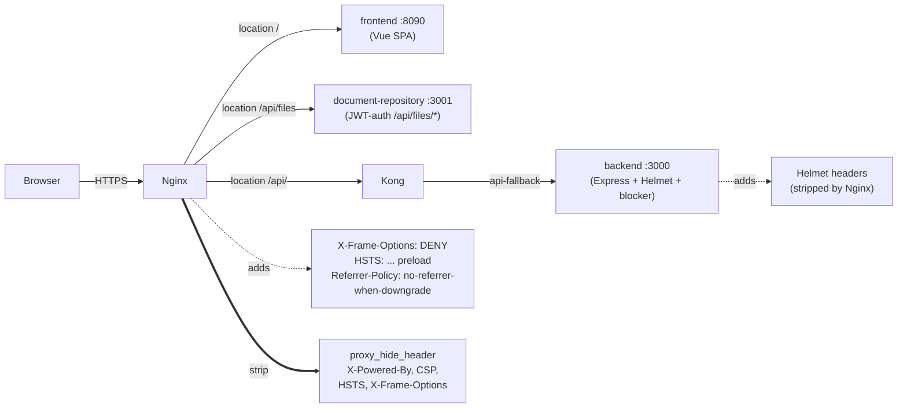
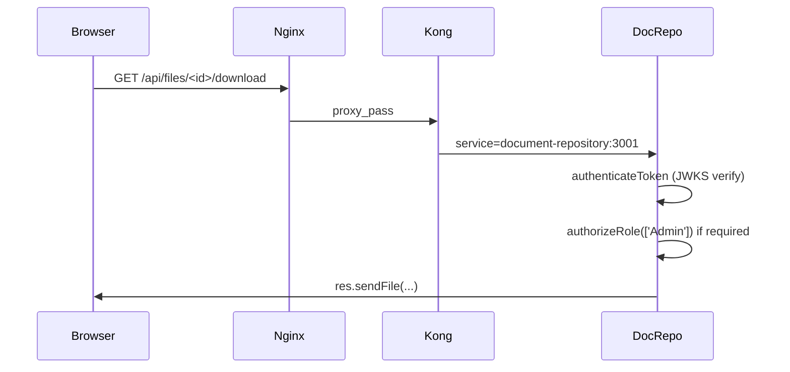

> **For deployers and security reviewers.** This page documents the
> security controls the GENIE.AI stack ships with by default: which
> requests are blocked before they reach the router, which HTTP headers
> Nginx and the backend set (or strip), which static surfaces are
> intentionally exposed, and how the document download flow actually
> gates access. Use it to audit your deployment, confirm Kong/Nginx is
> not re-enabling what the backend blocks, and adjust policy when
> reverse-proxying.

## Prerequisites

- A running deployment (Compose or Swarm) — see [Deploy &rarr; Docker Swarm](/docs/deploy/docker-swarm-setup/).
- `curl` + shell access to the gateway node (for the verify steps).
- Familiarity with HTTP security headers (CSP, HSTS, X-Frame-Options) —
  see [MDN's security headers guide](https://developer.mozilla.org/en-US/docs/Web/HTTP/Headers#security_headers).
- The `KEYCLOAK_ADMIN_PASSWORD` of your realm (to mint an admin token for the
  document-repository auth check) — see [Configure &rarr; Keycloak admin guide](/docs/configure/keycloak-admin-guide/).

## Architecture: who sets what

The deployer actually sees **two layers** of HTTP-header policy, and they
do not agree on every value. Nginx is the outer authority: it strips
the upstream headers and re-adds its own.



**The values you observe in `curl -I` come from Nginx**, not Helmet.
Helmet's headers are still emitted by the backend — they are stripped
at the Nginx hop. When this doc says "what Helmet sets" it means what
the backend emits internally; for what reaches the browser, read
"what Nginx sets".

| Header | Helmet (backend) | Nginx (gateway — what the browser sees) | Source |
|---|---|---|---|
| `X-Content-Type-Options` | `nosniff` | `nosniff` | both agree |
| `X-Frame-Options` | `SAMEORIGIN` (Helmet default) | `DENY` (per-location) | [`security-headers.inc:7`](https://gitlab.com/un/itu/genie-ai/-/blob/main/api-gateway-solution/nginx/conf/security-headers.inc) |
| `Strict-Transport-Security` | `max-age=31536000; includeSubDomains` | `max-age=31536000; includeSubDomains; preload` | [`security-headers.inc:11`](https://gitlab.com/un/itu/genie-ai/-/blob/main/api-gateway-solution/nginx/conf/security-headers.inc) |
| `Referrer-Policy` | `no-referrer` (Helmet default) | `no-referrer-when-downgrade` | [`security-headers.inc:14`](https://gitlab.com/un/itu/genie-ai/-/blob/main/api-gateway-solution/nginx/conf/security-headers.inc) |
| `Content-Security-Policy` | from `cspOptions` (see below) | `/` and `@frontend_spa` use `${CSP_CONNECT_SRC}`; `/api/`, `/api/queries/stream`, `/api-docs`, and `/grafana/` define their own CSPs (mostly `connect-src 'self'`) | [`default.conf.template:268`](https://gitlab.com/un/itu/genie-ai/-/blob/main/api-gateway-solution/nginx/conf/default.conf.template#L268) for `/`, `:185` for `/api/`, `:132` for `/api/queries/stream`, `:210` for `/api-docs`, `:247` for `/grafana/` |
| `X-Powered-By` | **stripped** by `app.disable('x-powered-by')` | also `proxy_hide_header` | [`index.js:521`](https://gitlab.com/un/itu/genie-ai/-/blob/main/components/gov-chat-backend/index.js#L521) + [`default.conf.template:44`](https://gitlab.com/un/itu/genie-ai/-/blob/main/api-gateway-solution/nginx/conf/default.conf.template#L44) |

## The sensitive-path blocker

Mounted very early in the Express middleware chain
([`components/gov-chat-backend/index.js:553`](https://gitlab.com/un/itu/genie-ai/-/blob/main/components/gov-chat-backend/index.js#L553))
— **before** the router, **before** Helmet, **before** body parsers — so a
blocked request costs almost nothing:

```javascript
app.use((req, res, next) => {
  try {
    if (
      req.path.match(/\/\.[^/]+/) ||
      req.path.includes('/BitKeeper') ||
      req.path.includes('/.git') ||
      req.path.includes('/.env')
    ) {
      logger.warn(`SECURITY: Blocked access to sensitive path: ${req.path}`, {
        ip: req.ip,
        method: req.method,
        userAgent: req.get('User-Agent') || 'none'
      });
      return res.status(404).json({ message: 'Not Found' });
    }
    next();
  } catch (error) {
    logger.error('Sensitive path middleware error:', { /* ... */ });
    res.status(500).json({ message: 'Internal server error' });
  }
});
```

What it blocks (request must reach the backend for any of these to fire):

| Probe | Matched pattern | Why |
|-------|----------------|-----|
| `/.env`, `/.env.bak`, `/.env.example` | `/.env` substring or `/\.<anything>` regex | Common credential-leak vector — `.env` is gitignored but a misconfigured reverse proxy can still serve it. |
| `/.git/HEAD`, `/.git/config` | `/.git` substring or `/\.<anything>` regex | Repository exfiltration via the `/.git` directory exposure vulnerability. |
| `/.ssh/`, `/.aws/`, `/.docker/` | `/\.<anything>` regex | Common credential discovery paths. |
| `/BitKeeper/` | exact substring | Legacy SCM scanner probe (often associated with old Nessus/Nikto scans). |

What it does **not** block (by design):

- `/api/*`, `/admin`, normal application routes — these are routed normally.
- `/api/health` — not matched by the patterns (`/api/health` starts with `/a`, not `/.`); this is what allows load balancer probes through. The frontend container separately exposes `/health` on its own port (8090) for K8s/Swarm healthchecks; see [Health Checks](/docs/operate/health-checks/).

> **Top-level dotfiles are blocked at Nginx, not the backend.** The
> stock [`default.conf.template:65-74`](https://gitlab.com/un/itu/genie-ai/-/blob/main/api-gateway-solution/nginx/conf/default.conf.template#L65)
> already includes two `deny all; return 404;` regex locations covering
> `/.env`, `/.git`, `/.svn`, `/.hg`, `/.ssh`, `/.aws`, `/.docker`, and
> `/BitKeeper/` (negative lookahead `(?\!well-known)` keeps the ACME
> path open). A request to `https://<host>/.env` therefore returns
> `404` at Nginx — the Vue SPA fallback is never reached. The
> backend's blocker is the second line of defense for paths Nginx
> actually forwards (e.g. `/api/.env` via the Kong `api-fallback` route).

The blocker logs each hit at `warn` level with the IP, method, and
User-Agent. Tail the backend logs to see scanner activity:

```bash
docker service logs genieai_backend --since 1h 2>&1 | grep "SECURITY: Blocked"
```

> **Note:** the response is always `404 {"message":"Not Found"}` — never
> `403` — so scanners cannot distinguish "blocked" from "no such resource"
> and waste budget crawling the rest of the tree.

## Helmet security headers + CSP

The backend applies Helmet
([`components/gov-chat-backend/index.js:591`](https://gitlab.com/un/itu/genie-ai/-/blob/main/components/gov-chat-backend/index.js#L591))
with three custom knobs:

```javascript
app.use(
  helmet({
    contentSecurityPolicy: cspOptions,
    xssFilter: true,
    hsts: {
      maxAge: 31536000,
      includeSubDomains: true
    }
  })
);
```

`cspOptions` is built mostly from hardcoded defaults in
[`components/gov-chat-backend/index.js:386-401`](https://gitlab.com/un/itu/genie-ai/-/blob/main/components/gov-chat-backend/index.js#L386):

```javascript
const connectSrcUrls = (
  process.env.CSP_CONNECT_SRC || `'self' http://localhost:3000 ws://localhost:3000 ${process.env.KEYCLOAK_URL}`
).split(' ');

const cspOptions = {
  directives: {
    defaultSrc:    ["'self'"],
    scriptSrc:     ["'self'", 'cdn.jsdelivr.net'],
    styleSrc:      ["'self'", "'unsafe-inline'", 'https://cdnjs.cloudflare.com'],
    imgSrc:        ["'self'", 'data:'],
    fontSrc:       ["'self'", 'data:', 'https://cdnjs.cloudflare.com'],
    connectSrc:    connectSrcUrls,
    frameSrc:      ["'none'"],
    objectSrc:     ["'none'"],
    baseUri:       ["'self'"],
    formAction:    ["'self'"],
    frameAncestors:["'none'"]
  },
  reportOnly: false
};
```

Only one directive is env-controlled: `connectSrc`, built from
`CSP_CONNECT_SRC` (default: ``'self' http://localhost:3000 ws://localhost:3000 ${KEYCLOAK_URL}``).
The `script-src` value includes `cdn.jsdelivr.net` — but the deployed
frontend bundle does not load any asset from that host; only
`cdnjs.cloudflare.com` is referenced in practice. See [Configure &rarr; CORS / CSP](/docs/configure/cors-csp/)
for the full reference.

> **Reminder:** the Nginx layer strips these headers and adds its own
> CSP per location (different from Helmet's CSP, see the Architecture
> table above). The values you observe in `curl -I` come from Nginx.

## `robots.txt` policy

The backend serves a minimal `robots.txt`
([`components/gov-chat-backend/index.js:732`](https://gitlab.com/un/itu/genie-ai/-/blob/main/components/gov-chat-backend/index.js#L732)):

```text
User-agent: *
Disallow: /api/
Disallow: /Uploads/
```

Effect: well-behaved crawlers (Google, Bing, DuckDuckGo) will not index
anything under `/api/` (auth tokens in URLs, query content) or `/Uploads/`
(user-profile avatar storage, see below). Search engines still see the
frontend (`/`, `/about`, etc.) and any public pages outside `/api/` and
`/Uploads/`.

> **Note:** this is not a security control — it is a courtesy to crawlers.
> Any malicious actor ignores `robots.txt`. The sensitive-path blocker is
> what actually protects `/.env`, `/.git`, etc.

## Static file serving

The backend serves two static surfaces
([`components/gov-chat-backend/index.js:667`](https://gitlab.com/un/itu/genie-ai/-/blob/main/components/gov-chat-backend/index.js#L667)
and
[`components/gov-chat-backend/index.js:689`](https://gitlab.com/un/itu/genie-ai/-/blob/main/components/gov-chat-backend/index.js#L689)):

| Surface | Path | What it actually serves | Auth |
|---|---|---|---|
| User profile files | `/Uploads` | Avatars / per-user uploads written by `user-profile-service.js` (imported at [`index.js:1065`](https://gitlab.com/un/itu/genie-ai/-/blob/main/components/gov-chat-backend/index.js#L1065)) — backed by the `backend_uploads` Docker named volume | none (no JWT middleware on this mount) |
| Frontend bundle (legacy) | `/dist` | `express.static('dist')` — **no-op in the deployed image**: the backend Dockerfile does not COPY any `dist/` directory. This is a dead-code fallback; production traffic is served by the dedicated `frontend` container on port 8090 behind Nginx. | none |

### `/Uploads` — defense-in-depth

This mount is **NOT the document repository**. Document storage lives in
the separate `document-repository` service on port 3001 (Docker named
volume `doc_repo_uploads:/app/uploads`). The backend's `/Uploads` mount
serves user profile files (e.g. avatars uploaded by
`UserProfileService.storeFile`) only.

It is exposed on the backend without an auth middleware. It is reachable
on three paths:

1. `http://backend:3000/Uploads/<file>` — direct container-to-container
   traffic on the overlay network.
2. Through Nginx `/Uploads/` — Nginx has `try_files $uri =404` (no
   `proxy_pass` to the backend), so this returns `404` unless a file
   with that name happens to exist in the Nginx document root (it does
   not — there is no `root` directive for that location).
3. Through the Kong `api-fallback` route (`paths: ["/api"]`,
   [`kong_config.json`](https://gitlab.com/un/itu/genie-ai/-/blob/main/api-gateway-solution/new-config/kong_config.json)) —
   `strip_path` is **false**, so the full `/api/Uploads/foo` URI is
   forwarded to the backend unchanged. There is no `/api/Uploads`
   mount in the backend (only `/Uploads`), and no Kong route
   whitelists `/api/Uploads`, so the request 404s.

> **Operational rule.** Treat the backend `/Uploads` mount as
> **overlay-internal only**. Do not expose the backend port (3000)
> outside the overlay network. The Nginx layer already does not proxy
> `/Uploads/` to the backend.

If you operate Kong manually (custom `api-gateway-solution`), verify
that:

- The backend service on Kong points at `backend:3000` and does not
  add a separate route for `/Uploads/` to the backend.
- The direct backend port (`:3000/Uploads`) is **not** reachable from
  outside the overlay network. `docker network inspect genieai_network`
  should show the backend is on the internal network only.

### `/dist` — dead-code in the deployed image

The backend's `express.static('dist')` mount has no `dist/` directory in
the runtime image (the [Dockerfile](https://gitlab.com/un/itu/genie-ai/-/blob/main/components/gov-chat-backend/Dockerfile)
does not COPY one; it only ships `/app/Uploads`). Production traffic for
the SPA is served by the dedicated `frontend` container on port 8090
behind Nginx. The `/dist` mount is a fallback kept for legacy paths
that point at the backend directly; it serves nothing in practice.

If you operate Kong/Nginx manually, no special handling is needed —
this mount is unreachable through any normal path.

## Document download — the actual flow

The doc-repo **does not issue signed URLs**. Downloads are protected by
**Keycloak JWT bearer tokens**, validated by the `document-repository`
service on every request:



The relevant code paths:

| Layer | What it does |
|---|---|
| Nginx | `/api/` proxied to Kong (no path manipulation). |
| Kong | Route `/api/files` → service `document-repository` (port 3001). Strip path: false, preserve host: true. ([`kong_config.json`](https://gitlab.com/un/itu/genie-ai/-/blob/main/api-gateway-solution/new-config/kong_config.json)) |
| document-repository | `router.use(authenticateToken)` on every route. The `downloadFile` controller ([`fileController.js:501`](https://gitlab.com/un/itu/genie-ai/-/blob/main/components/document-repository/src/controllers/fileController.js#L501)) calls `res.sendFile(filePath)` after auth. |
| JWT validation | Verifies signature, issuer, expiration via JWKS (`jose.jwtVerify` in [`keycloak-auth-middleware.js:110`](https://gitlab.com/un/itu/genie-ai/-/blob/main/components/document-repository/src/middlewares/keycloak-auth-middleware.js#L110)). |

There is no URL-signing layer. If a deployer wants short-lived or
single-use URLs, that is a future enhancement, not a current
guarantee. The defense is the JWT lifetime set by Keycloak realm
configuration (see [Configure &rarr; Keycloak admin guide](/docs/configure/keycloak-admin-guide/)).

## What this page deliberately does **not** cover

- **Network-level isolation** — handled by Docker overlay networks, the
  `genieai=true` / `gateway=true` node labels, and `deploy/ansible`.
  See [Deploy &rarr; Docker Swarm](/docs/deploy/docker-swarm-setup/).
- **Keycloak realm hardening** — covered in
  [Configure &rarr; Keycloak admin guide](/docs/configure/keycloak-admin-guide/).
- **Container CVE remediation** — covered in the security triage playbook
  ([docs/security/cve-triage-2026q3.md](https://gitlab.com/un/itu/genie-ai/-/blob/main/docs/security/cve-triage-2026q3.md)).
- **GDPR / data-residency** — covered in the user-profile routes and
  the Keycloak realm configuration.

## Verifying it works

After deploying, walk through these checks. Replace `<NGINX_PUBLIC_DOMAIN>`
with the domain of your gateway (e.g. `genie.example.org`).

```bash
DOMAIN="<NGINX_PUBLIC_DOMAIN>"

# 1. Sensitive paths under /api/ return 404 (NOT 200, NOT 403).
#    These reach the backend, where the blocker fires.
for path in /api/.env /api/.git/HEAD /api/.ssh/id_rsa /api/BitKeeper/; do
  curl -sk -o /dev/null -w "%{http_code} %{url_effective}\n" \
    "https://${DOMAIN}${path}"
done
# Expect: four lines of "404 https://..."

# 2. TOP-LEVEL sensitive paths return 404 from Nginx (regex deny, not
#    the Vue SPA fallback). The stock default.conf.template already
#    blocks dotfiles at lines 65-74.
curl -sk -o /dev/null -w "%{http_code} %{url_effective}\n" \
  "https://${DOMAIN}/.env"
# Expect: 404. If this prints 200, an operator has stripped the dotfile
# regex block from default.conf.template — restore it (see Troubleshooting).

# 3. Helmet-equivalent headers are present (Nginx values, not Helmet defaults)
curl -sk -I "https://${DOMAIN}/api/health" | grep -iE \
  "content-security-policy|strict-transport-security|x-content-type|x-frame-options"
# Expect: each header on its own line

# 4. X-Frame-Options is DENY (Nginx), not SAMEORIGIN (Helmet)
curl -sk -I "https://${DOMAIN}/api/health" | grep -i "^x-frame-options:"
# Expect: X-Frame-Options: DENY

# 5. HSTS includes ;preload (Nginx), not just ;includeSubDomains (Helmet)
curl -sk -I "https://${DOMAIN}/api/health" | grep -i "^strict-transport-security:"
# Expect: ...includeSubDomains; preload...

# 6. robots.txt is served and disallows the expected paths
curl -sk "https://${DOMAIN}/robots.txt"
# Expect:
#   User-agent: *
#   Disallow: /api/
#   Disallow: /Uploads/

# 7. X-Powered-By is NOT present (no Express fingerprinting)
curl -sk -I "https://${DOMAIN}/api/health" | grep -i "x-powered-by"
# Expect: empty output

# 8. Document download requires a JWT (returns 401 without one)
curl -sk -o /dev/null -w "%{http_code}\n" \
  "https://${DOMAIN}/api/files/00000000-0000-0000-0000-000000000000/download"
# Expect: 401
```

If any check fails, the most likely cause is a misconfigured Kong/Nginx
that is **stripping** headers (Nginx already strips upstream headers
deliberately — `proxy_hide_header` in `default.conf.template`) or
**rewriting** paths.

## Failure modes and troubleshooting

| Symptom | Cause | Fix |
|---|---|---|
| `/.env` returns `200 OK` at the gateway | An operator has removed or weakened the `location ~ /\.(?!well-known)` / `location ~ /(BitKeeper|\.git|\.svn|\.hg|CVS)` deny blocks in `default.conf.template` (lines 65-74) | Restore the stock deny blocks: `location ~ /\.(?!well-known) { deny all; return 404; }` and `location ~ /(BitKeeper|\.git|\.svn|\.hg|CVS) { deny all; return 404; }`. Re-test with check #2 above. |
| Scanner gets `200` from `/api/.env` instead of `404` | The Kong `/api` route does not include the path, OR a custom reverse proxy is short-circuiting before Kong | Confirm the route entry in `kong_config.json` has `"paths": ["/api"]` with `"strip_path": false`. Test directly against Kong with curl. |
| CSP errors in the browser console after deployment | `CSP_CONNECT_SRC` is too restrictive for the deployed UI dependencies | Inspect the browser console `Content Security Policy: ...` directive. Add the missing source to `CSP_CONNECT_SRC` in `.env` (XHR/fetch sources — typically `wss://<gateway-node-fqdn>` and `https://<gateway-node-fqdn>`). |
| `curl -I` shows Helmet defaults (`X-Frame-Options: SAMEORIGIN`, `Referrer-Policy: no-referrer`, HSTS without `; preload`) | Nginx is being bypassed (you are hitting the backend port 3000 directly) or a custom reverse proxy is forwarding Helmet headers instead of replacing them | All end-user traffic must go through Nginx (port 80/443 → Kong → backend). Never expose `:3000` outside the overlay network. If running a custom gateway, copy the `proxy_hide_header` and `add_header` block from [`default.conf.template`](https://gitlab.com/un/itu/genie-ai/-/blob/main/api-gateway-solution/nginx/conf/default.conf.template). |
| Helmet is not setting HSTS | The browser is hitting the backend over HTTP, not HTTPS | HSTS only fires on HTTPS — verify Nginx terminates TLS and that the backend is reached via the HTTPS port. HSTS also requires the response status to be a `2xx` or `3xx` (it is not set on `404`). |
| `X-Powered-By: Express` appears in the response headers | A reverse proxy is re-injecting the header | Disable `proxy_pass_header X-Powered-By` in Nginx or strip it with `proxy_hide_header X-Powered-By;` (this is already in the stock template — line 44). |
| Anonymous request to `/api/files/<id>/download` returns `200` instead of `401` | `authenticateToken` middleware has been removed or `isPublicRoute` lists `/api/files` | Re-check `keycloak-auth-middleware.js`: `router.use(authenticateToken)` should be the first middleware on the doc-repo router. The test suite (`__tests__/keycloak-auth-middleware.test.js`) asserts `/api/files` is NOT public. |
| Direct container access to `http://<node>:3000/Uploads/<file>` returns `200` | Someone published the backend port on a Swarm node without the internal-only constraint | Restore the `internal: true` (or remove the published port) in `docker-compose.yaml`. The `genieai_network` is the only intended network for backend traffic. |

## Related

- [Health Checks](/docs/operate/health-checks/) — the `/api/health` endpoint
  is intentionally not matched by the sensitive-path blocker; the
  frontend container separately exposes `/health` on port 8090.
- [Troubleshooting](/docs/operate/troubleshooting/) — scanner activity and
  CSP errors are both covered in the diagnostic playbook.
- [Configure &rarr; CORS / CSP](/docs/configure/cors-csp/) — the
  `CORS_ALLOWED_ORIGINS` and `CSP_CONNECT_SRC` env vars that drive the
  Nginx CSP / CORS headers.
- [Configure &rarr; Keycloak admin guide](/docs/configure/keycloak-admin-guide/) —
  the JWT-lifetime and realm-role settings that gate `/api/files/*` in
  the document-repository service.
- [Deploy &rarr; Docker Swarm](/docs/deploy/docker-swarm-setup/) —
  the overlay network topology and node-label placement constraints.
- [Architecture &rarr; Service auth matrix](/docs/architecture/architecture/) —
  who-can-call-who between the frontend, Nginx, Kong, backend, and
  document-repository services.
