This page lists the problems operators hit most often, the first place to look,
and where the deeper notes live. For install-time problems, see the
troubleshooting sections of the [deployment
guides]().

## Goal

Localise any operational issue to a single component, stage, or config value
in minutes — without restarting services or grepping unbounded logs.

## Prerequisites

- A running GENIE.AI stack (Swarm or Compose) reachable via SSH on the manager
  node. See [Installation & Configuration
  Guide]() for first-time setup.
- **Docker** access: `docker service ls`, `docker service logs`, `docker
  service ps` must work for the operator user (member of the `docker` group,
  or root on the Swarm manager).
- **Observability stack on** (`ENABLE_OBSERVABILITY=1` in `.env`): Grafana
  reachable at `https://<NGINX_PUBLIC_DOMAIN>/grafana/`. Without it, the
  trace-first playbook below reduces to log-grep + admin Query Inspector.
  See [Observability &rarr;
  Configuration]().
- **Keycloak admin password** (`KEYCLOAK_ADMIN_PASSWORD` in `.env`) for the
  Authentication / token errors section.
- **GPU node SSH access** (read-only) for the GPU OOM section — VRAM headroom
  is read directly from the GPU host via `nvidia-smi` (no Grafana panel
  exposes GPU memory yet).

## General principle: trace, then logs, then code

For any "why did this answer come out wrong / slow / empty" question, the
fastest path is the **trace**, not the logs:

1. Find the query's trace in the **Trace Explorer** dashboard (under
   *General → Trace Explorer* — see
   [Dashboards]()). Open the admin
   **Query Inspector** at `/admin/queries/inspect/<queryId>` (the chat
   response returns a `queryId`, which is the ArangoDB document `_key` for
   that query; the inspector surfaces it for cross-reference, but it is **not**
   the OTel trace ID).
2. Walk the RAG stage spans (see [RAG pipeline]() for
   the stage taxonomy: `embedding` → `retriever` → `reranker` → `llm`) to see
   which stage is slow or returns nothing.
3. Pivot to the **Service Logs** dashboard for that stage's error detail.
   Filter by `service.name=<service>` (the actual OTel `service.name`
   values emitted are `genie-backend`, `genieai-dataprep`, `genieai-chatqna`,
   `genieai-reranker`, `genieai-retriever`, plus the vLLM/TEI sidecar names
   declared by their respective images; the `embedding`/`llm` *stage* names
   do not match any `service.name`).

Only reach for code / config when the trace + logs do not localise the issue.

See [Observability]() for how the stack is
wired.

### Why this matters

- `queryId` ≠ trace ID. `queryId` is the ArangoDB `_key` of the `queries`
  collection document; trace IDs are auto-generated by the OpenTelemetry SDK
  per request. They correlate in the logs because the backend injects a W3C
  `traceparent` header that OPEA services propagate (see
  [RAG pipeline]() §Tracing), but they are
  two different identifiers.
- Searching the Trace Explorer dashboard by `queryId` will return nothing.
  Search by `trace_id` (the OTel trace identifier — pick it up from the
  VictoriaLogs service log record under the `trace_id` field, or from any
  backend log line carrying `trace_id`/`span_id` for the request). The chat
  HTTP response does **not** carry `traceparent` as a response header — the
  backend injects it only on the *outbound* request to OPEA services (see
  `components/gov-chat-backend/services/query-service.js:641-644`).

## Common problems

### Ingestion stuck or failed

- **Check the ingestion log** for the `file_id` — see where it stopped
  (parse? labelling? embedding?). The per-chunk log is the ArangoDB
  `ingestion_log` collection, **not** the [Admin &rarr; Logs
  dashboard]() (that one queries VictoriaLogs
  container logs — different store). See the [Ingestion log
  reference]() for the per-event schema, or
  query ArangoDB directly (see `.claude/rules/DEBUGGING-TRACING.md` §3 for
  the AQL pattern). The admin UI exposes the collection via
  `/api/files/<fileId>/ingestion-log`.
- **Dataprep traces**: in the Trace explorer dashboard, filter by
  `service.name=genieai-dataprep` and `operation_name starts-with
  dataprep.llm.label_` (the two real span names are
  `dataprep.llm.label_chunk` and `dataprep.llm.label_batch`). A red span →
  vLLM unavailable or rejecting the labelling request.
- **vLLM rejecting the labelling request** — usually a model compatibility
  issue with `response_format=json_object` (vLLM guided JSON). See [RAG
  &rarr; Choosing models]() for the
  supported-model list.
- **vLLM health**: is the generation/LM endpoint up?

  ```bash
  docker service ls | grep -E 'vllm|chatqna'
  docker service logs genieai_vllm --since 5m | grep -iE 'ready|error'
  ```

- **Raw-chunk fallback** in the ingestion log means labelling/embedding
  failed for that specific chunk but ingestion continued with the raw chunk
  (no contextual prefix, no labels). Investigate the per-chunk error message
  in the ingestion log to find whether it was an LLM call failure, JSON
  parsing failure, or arango write failure.

### Retrieval returns nothing / wrong results

- **Empty retrieval**: is the knowledge base loaded? Are the document(s) in
  `completed` state? See [Knowledge base &rarr; Document
  lifecycle]().
- **Wrong-topic retrieval**: check the label filter and the taxonomy — see
  [Knowledge base &rarr; Labelling &
  taxonomy]().
- **Embedding mismatch**: was the embedding model changed without re-ingestion?
  See [Updates]() — the re-ingestion rule.
- **Thresholds too strict**: retrieval `RETRIEVER_ARANGO_SCORE_THRESHOLD` /
  reranker `RERANKING_THRESHOLD` may be filtering everything. These are set
  in `.env` and require a service restart. To diagnose: raise each threshold
  by 0.1 and re-query; if results reappear, the thresholds were too tight.
  Defaults are documented at
  `docker-compose.yaml:1239,1330,1340` (retrieval `0.2`, reranker `0.75`) and
  in [Configuration &rarr; Environment
  variables]().

  > **Code vs. compose defaults.** The chatqna Python module
  > (`genie-ai-overlay/chatqna/genieai_chatqna.py:196,206`) declares its own
  > Python-side fallbacks (`0.1`, `0.9`) that apply only when the env var is
  > unset. Compose always overrides these (`0.2`, `0.75`) when the service is
  > deployed with the standard environment block — tune `.env`, not the code.

### Gateway errors (502 / 504)

- A 502/504 means Kong could not reach an upstream service.
- `docker service ls` — is the target service running and healthy?
- **404 with a tiny (~47 byte HTML) body** from a browser = the Nginx HTML
  fallback (`<html>...<title>404 Not Found</title>...</html>`, the route is
  missing in Kong or nginx); **404 with a JSON body** like `{"error":"not
  found"}` = an application-level 404 (the route exists, the resource does
  not).
- Check Kong's own logs via the Service Logs dashboard or
  `docker service logs genieai_kong --since 5m`.

### Authentication / token errors

- Master token ≠ realm token — only use the master token for the Keycloak
  Admin API; application services validate against the realm. See
  [Configuration &rarr; Keycloak admin
  guide]().
- `"Account is not fully set up"` on login → user profile missing required
  fields (`firstName`, `lastName`), `emailVerified` not set, or credentials
  marked temporary. Check via Keycloak Admin API:

  ```bash
  # Get the master admin token (see Keycloak admin guide for the recipe)
  ADMIN_TOKEN=...

  curl -sk -H "Authorization: Bearer $ADMIN_TOKEN" \
    "<KEYCLOAK_URL>/admin/realms/<REALM>/users/<user-id>" \
    | python3 -c 'import sys,json; u=json.load(sys.stdin); \
        print("emailVerified:", u.get("emailVerified")); \
        print("firstName:", u.get("firstName")); \
        print("lastName:", u.get("lastName")); \
        print("temp creds:", any(c.get("temporary") for c in u.get("credentials", [])))'
  ```

  Fix: PUT the user with `emailVerified: true`, non-empty first/last name,
  and credentials with `temporary: false` in the same payload (PUT
  overwrites `credentials` if omitted).

### GPU out-of-memory

- A model service crashing with OOM (exit 137 in `docker service ps`) → its
  `_GPU_UTIL` budget is too small, or the combined budgets exceed the GPU.
- Lower other services' budgets or move to a larger GPU profile. See
  [Scaling]() and [GPU
  deployment]().
- Verify VRAM headroom on the GPU host directly — there is no Grafana panel
  for it yet:

  ```bash
  # On the GPU node (10.0.0.110 in the reference deployment)
  ssh govstack@<gpu-node> 'nvidia-smi --query-gpu=memory.used,memory.total --format=csv'
  # Expected: a single row showing MB used / MB total.
  # If "memory.used" is near "memory.total", one of the _GPU_UTIL budgets
  # (VLLM_GPU_UTILIZATION, VLLM_TRANSLATION_GPU_UTILIZATION) is too high.
  ```

### Observability shows no data

- **Collector down** alert firing → the OpenTelemetry Collector is not
  running. Restart it (`mode: global`, one per node, see the
  `otel-collector` service block in `docker-compose.yaml:1676-1717`):

  ```bash
  # Swarm
  docker service ps genieai_otel-collector | grep Running
  docker service logs genieai_otel-collector --since 5m | grep -iE 'error|started'
  ```

- **Telemetry present but incomplete** → check `OTEL_TRACES_SAMPLER_RATE`
  (traces are sampled; metrics and logs are not, default `100.0`).
- **Telemetry missing from a single service only** → check that the service
  has the `fluentd` logging driver configured in `docker-compose.yaml` (most
  services do, but verify the `logging.driver` block on the affected
  service). Without it, container stdout/stderr never reaches the Collector.
- **All logs missing / empty Service Logs dashboard** → VictoriaLogs is
  full. Check the VictoriaLogs single-node dashboard; retention is governed
  by `VICTORIALOGS_RETENTION` (default `30d`).
- **Firewall blocking OTLP**: confirm port `4318` (HTTP) is reachable
  between services and the OTel Collector (`OTEL_EXPORTER_OTLP_ENDPOINT`
  defaults to `http://otel-collector:4318`).
- See [Observability &rarr;
  Configuration]().

## Where the deeper notes live

| Topic | Location |
|---|---|
| GPU / model runtime problems | [GPU deployment]() troubleshooting |
| Compose startup problems | [Docker Compose setup]() troubleshooting |
| Swarm / node-label problems | [Docker Swarm setup]() troubleshooting |
| Labelling quality problems | [Data labelling strategy]() |
| RAG internals (reranker, confidence) | [RAG pipeline]() |
| Debugging with traces/logs (AQL patterns, base64 remote-script) | `.claude/rules/DEBUGGING-TRACING.md` (internal) |

## Verify it worked

After applying any fix, validate that the original symptom is gone **and** you
did not introduce a regression:

```bash
# 1. All target services back to Running replicas
docker service ls | grep -E 'vllm|chatqna|kong|otel-collector'
# Expected: REPLICAS = N/N for every line, no '0/N' or 'pending'

# 2. End-to-end chat trace produces one trace_id with all four RAG stages
#    (Trace Explorer dashboard → set time range to last 5 min, filter
#    service.name = genieai-chatqna, operation_name = chatqna.orchestrate)
# Expected: trace contains embedding, retriever, reranker, llm child spans

# 3. No recent errors in the Service Logs dashboard
#    Filter service.name=genie-backend AND level=error, last 1h
# Expected: zero (or only known-noise) rows

# 4. VictoriaLogs retention not exceeded — see the VictoriaLogs
#    single-node dashboard panel 'Disk usage' vs 'Retention'.
#    (VictoriaLogs is internal-only on port 9428; retention is configured
#    by the VICTORIALOGS_RETENTION env var (-> -retentionPeriod flag at
#    start). For runtime metrics exposed by the process, exec into the
#    running container and scrape /metrics:
#      docker exec $(docker ps -qf label=com.docker.swarm.service.name=genieai_victorialogs) \
#        curl -s 'http://localhost:9428/metrics' | grep -E 'vl_(retention|rows_dropped)')
```

If any check fails, the fix is incomplete — restart the section above that
matches the failing check.

## Troubleshooting at a glance

The sections above are organised by symptom. This table is the inverse
index — start from the symptom you observe:

| Symptom | First thing to check | Section |
|---|---|---|
| Chat answer is wrong / slow / empty | Trace Explorer → `chatqna.orchestrate` span, walk the 4 RAG stage children | [General principle](#general-principle-trace-then-logs-then-code) |
| Document upload stuck in `processing` / failed | Ingestion log for `file_id`; dataprep spans `dataprep.llm.label_*` | [Ingestion stuck or failed](#ingestion-stuck-or-failed) |
| Retrieval returns nothing or wrong topic | `RETRIEVER_ARANGO_SCORE_THRESHOLD`, label filter, embedding model drift | [Retrieval returns nothing / wrong results](#retrieval-returns-nothing--wrong-results) |
| 502 / 504 from the gateway | `docker service ls` for the upstream; Kong/Nginx route integrity | [Gateway errors (502 / 504)](#gateway-errors-502--504) |
| `404` HTML fallback vs `404` JSON | Route missing in Kong/Nginx (HTML) vs application 404 (JSON) | [Gateway errors (502 / 504)](#gateway-errors-502--504) |
| `Account is not fully set up` on login | Keycloak user has `firstName`/`lastName`, `emailVerified:true`, non-temporary password | [Authentication / token errors](#authentication--token-errors) |
| Model service exits with code 137 | GPU OOM — lower `_GPU_UTIL` budgets or move to a larger GPU | [GPU out-of-memory](#gpu-out-of-memory) |
| Empty Service Logs dashboard | VictoriaLogs retention (`VICTORIALOGS_RETENTION`) or Collector down | [Observability shows no data](#observability-shows-no-data) |
| Collector down alert | `docker service ps genieai_otel-collector`; restart via the rollout | [Observability shows no data](#observability-shows-no-data) |
| Single service has no telemetry | Missing `fluentd` logging driver in that service block | [Observability shows no data](#observability-shows-no-data) |

## Diagnostic flow (trace-first)

```mermaid
flowchart TD
    A[User reports:<br/>wrong / slow / empty answer] --> B{Trace Explorer<br/>shows a trace?}
    B -- yes --> C[Walk the 4 RAG stage spans:<br/>embedding → retriever<br/>→ reranker → llm]
    B -- no --> D[Pick the trace_id from<br/>VictoriaLogs service log<br/>for the request]
    C --> E{Which stage is<br/>red or slow?}
    E -- embedding --> F[Check vLLM / TEI health<br/>docker service ls &#124; grep vllm]
    E -- retriever --> G[ArangoDB connectivity<br/>+ RETRIEVER_ARANGO_SCORE_THRESHOLD]
    E -- reranker --> H[RERANKING_THRESHOLD<br/>+ reranker service health]
    E -- llm --> I[vLLM OOM / context length<br/>+ response_format=json_object]
    F --> J[Service Logs dashboard<br/>filter service.name=<svc>]
    G --> J
    H --> J
    I --> J
    D --> J
    J --> K{Logs show root cause?}
    K -- yes --> L[Apply fix + Verify it worked]
    K -- no --> M[Drop to code / config<br/>see Where the deeper notes live]
```



## Related

- [Backup & restore]() — recovery when troubleshooting leads to "rebuild from backup"
- [Updates]() — rollback procedure when troubleshooting confirms a bad update
- [Admin Logs]() — operator UI for the logs and VictoriaLogs queries
