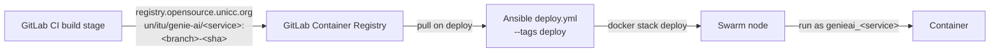

GENIE.AI has three kinds of update, with different blast radii. The critical
thing to know is **which updates force a knowledge-base re-ingestion**. Plan
backups before every change and keep the previous-known-good tag for rollback.

## Prerequisites

- A working deployment (Compose or Swarm) with `.env` populated.
- `GENIE_AI_GLOBAL_TAG` rollback target noted before starting (per-service tags like `GENIE_AI_BACKEND_IMAGE_TAG` override just the backend).
- For model pulls: `HUGGING_FACE_HUB_TOKEN` set in `.env`. Without it, vLLM
  silently stalls while retrying the private-model download with no error in
  the container logs.
- `docker service ls` (Swarm) or `docker compose ps` (Compose) returns the
  stack — required to copy service names verbatim in the commands below.
- Backup taken (see [Backup & restore]()).

## The re-ingestion rule

| Change | Re-ingest required? | Restart target (Swarm service) |
|---|---|---|
| **LLM** (`VLLM_LLM_MODEL_ID`) | **No** — model is read at query time | `genieai_vllm` (model-serving vLLM) |
| **Reranker** (`RERANKER_MODEL_ID`) | **No** — query-time re-score | `genieai_tei_reranker` (the TEI serving the reranker) |
| **Translation** (`VLLM_TRANSLATION_MODEL_ID`) | **No** — query-time | `genieai_vllm-translation-guardrail` (the vLLM serving the translation model — **not** the `translation` OPEA wrapper) |
| **Embedding model** (`EMBEDDING_MODEL_ID`) | **Yes** — vectors live in the old model's space | `genieai_tei` + full re-ingest |
| **Labelling taxonomy** (`LABEL_SELECTOR_SYSTEM_PROMPT`) | **Recommended** — labels are stored on chunks at ingest time | `genieai_dataprep-arango-service` |
| **Chunking / dataprep logic** | **Yes** — chunk boundaries and content change | `genieai_dataprep-arango-service` + re-ingest affected docs |

> **Changing the embedding model is the expensive update.** Plan a full
> re-ingest (see [Knowledge base &rarr;
> Ingestion]()) when you change
> `EMBEDDING_MODEL_ID`. Everything else is a service restart.

### Why the right restart target matters

Model changes are picked up by the **model-serving process**, not the
OPEA wrapper that fronts it. Translating a model restart requires restarting
`vllm-translation-guardrail` (the vLLM that actually loads the model into
GPU memory), **not** `translation` (the OPEA wrapper that just forwards
requests). The wrapper will keep using the old model until the vLLM
behind it restarts. Same pattern for `tei_reranker` (TEI serving the
reranker) vs `reranker` (OPEA wrapper) and `tei` (TEI serving the
embedding) vs `embedding` (OPEA wrapper).

## Updating a model

1. **Confirm `HUGGING_FACE_HUB_TOKEN`** is set in `.env` (see
   [Configuration &rarr; Environment
   variables]()).
   vLLM pulls the new model from HuggingFace on startup and silently stalls
   if the token is missing (private repos) or is wrong.
2. Edit `.env` (e.g. set `VLLM_LLM_MODEL_ID=...`). The variable must be set
   in `.env` — Swarm resolves it once at deploy time, Compose reads it on
   every container (re)create.
3. Restart the **model-serving** service so it picks up the new model. Pick
   the right service from the re-ingestion table above:

   ```bash
   # Swarm — LLM model change
   docker service update --force genieai_vllm
   # Swarm — reranker model change
   docker service update --force genieai_tei_reranker
   # Swarm — translation model change (the vLLM serving the translation model)
   docker service update --force genieai_vllm-translation-guardrail
   # Swarm — embedding model change (also requires re-ingest — see above)
   docker service update --force genieai_tei

   # Compose (service names from docker-compose.yaml)
   docker compose up -d vllm                # LLM
   docker compose up -d tei_reranker        # reranker
   docker compose up -d vllm-translation-guardrail  # translation
   docker compose up -d tei                 # embedding (re-ingest too)
   ```

4. The new model is pulled automatically on startup (or reused from the
   `hf_cache` named volume if already downloaded). Confirm with logs:

   ```bash
   # Swarm
   docker service logs genieai_vllm --since 5m | grep -iE 'loaded|error|ready'
   # Compose
   docker compose logs vllm --tail=200 | grep -iE 'loaded|error|ready'
   ```

   Expect to see lines like `Loaded model ... in Xs` once the model is in
   GPU memory.

### Verify it worked

Open Grafana (`https://<your-domain>/grafana/`) and confirm on the
[observability dashboards]() that
the new model is serving and latency is normal:

   | Dashboard | Panel | What to check |
   |---|---|---|
   | **Application metrics** | **Backend HTTP Requests (5m rate)** | `/api/chat/*` rate matches pre-update baseline (≥ 0 traffic flowing). |
   | **Application metrics** | **Chat RAG Pipeline Latency** | P95 within 2× of pre-update baseline. |
   | **Application metrics** | **Error Rate (5xx %)** | No new 5xx spike after the restart. |
   | **Service health** | **Latency p50** / **Latency p95** / **Latency p99** (separate panels) | p50 TTFT < 500 ms (compared with pre-update baseline). |
   | **Service health** | **Error Rate (%)** | Steady after the restart. |
   | **Service logs** | **Logs** (filter on the vLLM container, e.g. `genieai_vllm` or `service.name:genieai-vllm`) | No repeating error / retry lines from the new model. |
   | **RAG pipeline trace waterfall** | **Pipeline Stage Latency Breakdown (Stacked)** | No stage > 5× its pre-update baseline. |

   A >2× latency regression or repeated 5xx → roll back (see [Rollback
   procedure](#rollback-procedure) below).

For GPU-profile-specific settings (`VLLM_GPU_UTILIZATION`, model length limits),
the `env.t4` / `env.rtx6000` files override memory and length limits — see
[GPU deployment]().

## Updating service images

When a GENIE.AI component image is rebuilt, CI publishes a new tag to
`registry.opensource.unicc.org/un/itu/genie-ai/<service>:<branch>-<sha>`
(the registry and project path are baked into `docker-compose.yaml` via
`GENIE_AI_REGISTRY`, with `GENIE_AI_GLOBAL_TAG` defaulting to `main`).



### Find the new tag

- **Releases page** in GitLab → tag of the form `vX.Y.Z` (released images
  re-tagged from the per-commit `<branch>-<sha>`). See
  [Release process]().
- **Container Registry API**: list tags for the service image under
  `un / itu / genie-ai` (`registry.opensource.unicc.org`). Verify the tag
  with `docker buildx imagetools inspect` — the registry listing can be
  polluted by transient `cache-*` buildx tags.
- **Pipeline artifacts**: the build job publishes a `<branch>-<sha>` tag
  after the contract + scan stages pass. Avoid the candidate `tmp/*`
  images; those are pre-promotion.

### Swarm (Ansible)

```bash
# <env> is your inventory name (e.g. test, prod)
sed -i "s|^GENIE_AI_GLOBAL_TAG=.*|GENIE_AI_GLOBAL_TAG=<new-tag>|" .env

ansible-playbook -i inventory/<env>.ini deploy.yml \
  --tags deploy --vault-id <env>@prompt
```

The `deploy` tag regenerates `.env`, validates it, and runs
`docker stack deploy --resolve-image always` so Swarm pulls the new digest.
Per-service tags (`GENIE_AI_BACKEND_IMAGE_TAG=…`) override just one service
without touching the rest of the stack — useful for hot-fixing one component
without a full re-roll.

For tagged re-runs, see `deploy/ansible/README.md`.

### Compose (local dev)

```bash
docker compose build <service>      # rebuilds from local Dockerfile
docker compose up -d <service>      # recreates the container with the new image
```

`docker compose build` only works for services with a `build:` block (the
GENIE.AI components). Third-party services (`postgres`, `kong`, `vllm`,
`otel-collector`, etc.) are pulled from their upstream registry — to update
those, bump the image tag in `docker-compose.yaml` and run
`docker compose pull <service>`.

### Verify it worked

```bash
# Swarm — confirm the new digest is running
docker service ls --filter name=genieai_<service> --format '{{.Name}} {{.Image}}'

# Compose
docker compose ps <service>
```

Then check the **Application metrics** dashboard for the service's
`/api/...` error rate staying flat and **Service health** dashboard for
latency percentiles within baseline.

## Updating the stack

A stack update (new `docker-compose.yaml`, new config, schema migration) is the
broadest change:

1. **Check release notes for ArangoDB schema changes.** If present, read
   `docs/database-migrations.md` (internal) for the required migration order
   **before** redeploying. Migrations run as a `db-migrations` init container
   that exits 0 before the backend starts — they are forward-only, never
   skipped.
2. **Back up first** — see [Backup & restore]().
3. **Re-deploy** via Ansible or Compose:

   ```bash
   # Swarm — build + deploy (the build tag refreshes secrets and resolves
   # the compose file; deploy runs docker stack deploy).
   ansible-playbook -i inventory/<env>.ini deploy.yml \
     --tags build,deploy --vault-id <env>@prompt

   # Compose
   docker compose up -d
   ```

4. **Watch for regressions** during the next 30 minutes on the Grafana
   dashboards ([see the dashboards reference]()):

   | Dashboard | Panel | Threshold |
   |---|---|---|
   | **Service health** | **Error Rate (%)** | No new 5xx spike on `/api/chat/*` |
   | **Service health** | **Latency p95** | p95 within 2× of pre-update baseline |
   | **Application metrics** | **Error Rate (5xx %)** | < 1% sustained |
   | **Application metrics** | **Chat RAG Pipeline Latency** | P95 within 2× of pre-update |
   | **Service logs** | filter `service.name:genieai-dataprep`, grep `failed` | No new failed rows in the ArangoDB `ingestion_log` collection |
   | **RAG pipeline trace waterfall** | **Pipeline Stage Latency Breakdown (Stacked)** | No stage > 5× its pre-update baseline |

   A regression beyond those thresholds → roll back.

### Verify it worked

```bash
# All services running
docker service ls --filter label=com.docker.stack.namespace=genieai

# No crash-looping tasks
docker service ls --format '{{.Name}} {{.DesiredState}} {{.CurrentState}}' | grep -v Running
```

Confirm the **Application metrics** dashboard's `Backend HTTP Requests` panel
shows traffic matching the pre-update rate.

> **Update cadence.** Take a backup before every stack update, and keep at
> least the previous-known-good image tag so you can roll back. An update
> without a rollback path is not an update — it is a cutover.

## Rollback procedure

If the update breaks anything, revert to the previously-working tag:

### Swarm

```bash
# 1. Note the current tag (so you can confirm what you're rolling back FROM)
grep GENIE_AI_GLOBAL_TAG .env

# 2. Replace with the previous-known-good tag (commit SHA or release tag)
sed -i "s|^GENIE_AI_GLOBAL_TAG=.*|GENIE_AI_GLOBAL_TAG=<previous-sha-or-tag>|" .env

# 3. Re-deploy (no rebuild — images are already in the registry)
ansible-playbook -i inventory/<env>.ini deploy.yml \
  --tags deploy --vault-id <env>@prompt

# 4. Force a restart of the rolled-back service if Swarm cached the old container
docker service update --force genieai_<service>
```

### Compose

```bash
sed -i "s|^GENIE_AI_GLOBAL_TAG=.*|GENIE_AI_GLOBAL_TAG=<previous-sha-or-tag>|" .env
docker compose pull <service>
docker compose up -d <service>
```

Rollback does **not** undo a re-ingestion (the new chunks/embeddings are
already in ArangoDB). If the failed update required a re-ingest, restore from
backup — see [Backup & restore]().

### Verify it worked

```bash
# Swarm — confirm the rolled-back image is now running
docker service ls --filter name=genieai_<service> --format '{{.Name}} {{.Image}}'

# Compose
docker compose ps <service>
```

Watch the **Service health** dashboard — the 5xx rate should fall back to
baseline within a few minutes once the rolled-back container is serving.

## Troubleshooting

| Symptom | Likely cause | Fix |
|---|---|---|
| `vllm` restart loops on startup, no model-load message in logs | `HUGGING_FACE_HUB_TOKEN` unset or wrong; vLLM is retrying the private-model download silently | Set `HUGGING_FACE_HUB_TOKEN` in `.env` and rerun `--force` |
| Model change took effect in `vllm` logs but responses still use the old model | Restarted the OPEA wrapper (`translation`, `reranker`, `embedding`) instead of the model-serving TEI/vLLM | Restart `vllm-translation-guardrail` (translation) / `tei_reranker` (reranker) / `tei` (embedding) — see the re-ingestion table above |
| Embedding model swap but chunks still retrieve stale results | Vectors are in the old model's space; a service restart alone does not move them | Trigger a full re-ingest of every document (see [Ingestion]()) |
| `ansible-playbook ... --tags deploy` fails with `'swarm_registry_url' is undefined` | Skipped the `build` tag — facts are computed during `build` | Run with `--tags build,deploy` (or full deploy without `--tags`) |
| `--tags deploy` prompts for git credentials | `vars_prompt` runs before tag filtering | Pass `--extra-vars "git_username=… git_token=…"` |
| Swarm service stuck on the old container after `docker stack deploy` | Swarm kept the task running and the new digest was identical | `docker service update --force genieai_<service>` |
| Ingestion regression after a stack update — `failed` rows in `ingestion_log` | New dataprep image broke the chunking / labelling pipeline | Roll back `GENIE_AI_DATAPREP_ARANGO_IMAGE_TAG` first (single-service override), then file a bug |
| Re-ingested under new embedding model — chatbot returns no relevant docs | Vector index built from new vectors, but old documents still hold old embeddings | Confirm `retriever-arango-service` restarted (auto via stack redeploy) and the new vectors exist (`FOR d IN <GRAPH>_SOURCE RETURN COUNT(d)` vs old `arango_data` dump) |
| `docker service update --force genieai_vllm` returns `no such image` | Per-service tag typo (`GENIE_AI_<X>_IMAGE_TAG` does not match the service) | Check `docker service inspect genieai_vllm | grep Image` and align the override |

## Related

- [Backup & restore]() — back up before any update
- [Scaling]() — replica tuning after an update
- [Troubleshooting]() — post-update failures
- [GPU deployment]() — model + GPU memory updates
- [Release process]() — how images get tagged and promoted
- [Dashboards]() — the panels cited above
- [Knowledge base &rarr; Ingestion]() — full re-ingest procedure
- [Knowledge base &rarr; Document lifecycle]() — `dataprep.status` state machine
- [Knowledge base &rarr; Ingestion log]() — reading `failed` rows in ArangoDB
