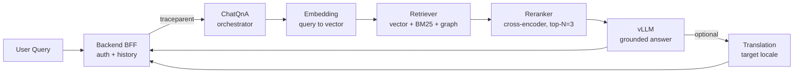

The RAG pipeline is orchestrated by the **ChatQnA** mega-service
(`genie-ai-overlay/chatqna/genieai_chatqna.py`), a Python/FastAPI service built
on the OPEA mega-service framework. It wires together five specialist
microservices into a directed acyclic graph (DAG) and streams the final answer
back to the client.

This page describes the lifecycle of a single chat request — from the browser
submitting a query to the streamed tokens reaching the screen — and the
configuration surface that governs it.

## Service roles

| Stage | Service | Stack | Role |
|---|---|---|---|
| Orchestration | **ChatQnA** | Python / FastAPI | Owns the DAG; calls each stage; enforces abstention and confidence. |
| Embedding | **TEI Embedding** | Hugging Face TEI | Vectorises the query (and chunks at ingest time). |
| Retrieval | **Retriever** | Python / ArangoDB | Hybrid vector + BM25 + graph search over indexed chunks. |
| Reranking | **TEI Reranker** | Hugging Face TEI | Re-scores retrieved chunks by query relevance. |
| Generation | **vLLM** | vLLM (OpenAI-compatible) | Produces the grounded answer. |
| Translation | **Translation** (optional) | vLLM-hosted translation model | Translates the stream into the user's UI language. |

All services are containerised and communicate over the internal Docker
network. Only the backend (BFF) and the public Nginx gateway are reachable
from outside the cluster.

## Request lifecycle

```
1. Client (Web/Mobile)
2. → API Gateway (Kong)
3. → Backend BFF (Node.js/Express)   — auth, rate limit, conversation history
4. → ChatQnA (Python/FastAPI)
   4a. → Embedding (TEI)            — query → vector
   4b. → Retriever (ArangoDB)       — vector + BM25 + graph search → top-K chunks
   4c. → Reranker (TEI)             — relevance re-score → top-N (default N=3)
   4d. → LLM (vLLM)                 — system prompt + chunks → streamed answer
   4e. → Translation (optional)     — stream → user language
5. ← Streamed response + confidence
```

### Request lifecycle (visual)



### 1. Embedding

The user's query is sent to the embedding service, which returns a dense
vector using the configured embedding model (default
`BAAI/bge-base-en-v1.5`, 768-dim, configured by `EMBEDDING_MODEL_ID`). The
same model is used at ingest time so that query and chunk vectors live in the
same space.

### 2. Hybrid retrieval

The retriever searches ArangoDB with a hybrid strategy. Under the
docker-compose default (`RETRIEVER_HYBRID_RETRIEVAL_ENABLED=true` — hybrid
dense + BM25 + RRF is the runtime default), the result lists are merged
with **reciprocal-rank fusion (RRF)** controlled by
`RETRIEVER_HYBRID_DENSE_WEIGHT`, `RETRIEVER_HYBRID_LEXICAL_WEIGHT`, and
`RETRIEVER_HYBRID_RRF_K`. Set `RETRIEVER_HYBRID_RETRIEVAL_ENABLED=false`
in `.env` to fall back to dense-only with a wider `fetch_k` candidate set
fused down to `k`. See [Retrieval]() for the
full knob set and for graph traversal via
`RETRIEVER_ARANGO_TRAVERSAL_*`.

### 3. Reranking

The candidate chunks are re-scored by a cross-encoder reranker (default
`BAAI/bge-reranker-v2-m3`, configured by `RERANKER_MODEL_ID`). The reranker
applies one of several selection **strategies** (`slice` (default),
`adaptive`, `threshold`, `knee_threshold`, `slice_threshold`) to decide how
many chunks to keep and whether to keep any at all. The default keeps the top
**`RERANKER_TOP_N` (default 3)** chunks.

The reranker's scores feed the **confidence score** shown to the user. See
[Reranking]().

### 4. Generation

The kept chunks are assembled into a prompt with the **system prompt** and
sent to the LLM. The default model is **`meta-llama/Meta-Llama-3.1-8B-Instruct`**
(the docker-compose default, set by `VLLM_LLM_MODEL_ID`).
**`ibm-granite/granite-4.1-8b`** is the **recommended and validated** model
(must support OpenAI-compatible guided JSON for the dataprep labelling call).
The in-code fallback for chatqna is `ibm-granite/granite-3.3-2b-instruct`
(`genieai_chatqna.py:148`), reached only when neither `VLLM_LLM_MODEL_ID` nor
`LLM_MODEL` env vars are set. See [Choosing models]().

The built-in system prompt (paraphrased; the canonical default lives in
`genieai_chatqna.py:490-502`) instructs the model to:

- answer **only** from the provided retrieved context — never invent facts,
- keep answers concise; provide detailed explanations only when necessary or
  explicitly requested,
- personalise the answer using the user's profile and conversation history,
- prefer information contained in the context,
- **abstain** when the answer is not in the context.

When self-confidence is enabled (`LLM_SELF_CONFIDENCE_ENABLED=1`), the model
also emits a `[[CONF:0-100]]` token that the pipeline parses separately from
the visible answer. See
[Generation → Self-confidence](#self-confidence).

The answer is **streamed** back to the client token-by-token. For the exact
SSE wire format and metadata envelope, see
[Streaming & metadata events]().

### 5. Translation (optional)

For multilingual deployments, the streamed answer can be translated into the
user's UI language on the fly by a dedicated translation model. Streaming
translation (`STREAMING_TRANSLATION_ENABLED=1`) publishes the target language
incrementally rather than waiting for the full English answer. See
[Generation &rarr; Translation](#translation).

## Configuration surface

The pipeline is configured almost entirely through environment variables with
safe defaults. Key groups:

| Group | Representative variables |
|---|---|
| Endpoints | `EMBEDDING_SERVER_HOST_IP`, `RETRIEVER_SERVICE_HOST_IP`, `RERANK_SERVER_HOST_IP`, `VLLM_LLM_ENDPOINT` |
| Models | `EMBEDDING_MODEL_ID`, `RERANKER_MODEL_ID`, `VLLM_LLM_MODEL_ID`, `VLLM_TRANSLATION_MODEL_ID` |
| Retrieval | `RETRIEVER_ARANGO_K`, `RETRIEVER_ARANGO_FETCH_K`, `RETRIEVER_ARANGO_SCORE_THRESHOLD`, `RETRIEVER_HYBRID_RETRIEVAL_ENABLED`, `RETRIEVER_HYBRID_DENSE_WEIGHT`, `RETRIEVER_HYBRID_LEXICAL_WEIGHT`, `RETRIEVER_HYBRID_RRF_K` |
| Reranker | `RERANKING_STRATEGY`, `RERANKER_TOP_N`, `RERANKING_THRESHOLD`, `RERANKER_SCORE_CALIBRATION`, `RERANKER_SCORE_TEMPERATURE`, `CONFIDENCE_RANK_DECAY` |
| Generation | `CHATQNA_SYSTEM_PROMPT`, `CHATQNA_ENFORCE_ABSTENTION`, `CHATQNA_ABSTENTION_INSTRUCTIONS`, `LLM_SELF_CONFIDENCE_ENABLED` |
| Translation | `VLLM_TRANSLATION_MODEL_ID`, `STREAMING_TRANSLATION_ENABLED` |
| Multi-turn | `MULTI_TURN_BLEND_ENABLED`, `MULTI_TURN_BLEND_ALPHA`, `MULTI_TURN_HISTORY_TURNS` |
| Contextual | `CONTEXTUAL_RETRIEVAL_ENABLED`, `CONTEXTUAL_STRATEGY`, `CONTEXTUAL_LABEL_RAW` |

> **Two-tier prompt priority.** Prompt strings follow a simple rule: an
> environment variable (highest) overrides the built-in default (lowest). This
> lets deployments customise behaviour without forking the code. Override
> targets: `CHATQNA_SYSTEM_PROMPT`, `CHATQNA_ABSTENTION_INSTRUCTIONS`,
> `LABEL_SELECTOR_SYSTEM_PROMPT`, `CONTEXTUAL_RETRIEVAL_PROMPT`.

See the top-level `env` file for the canonical variable list and
[Choosing models]() for model/GPU-profile
guidance.

## Per-request overrides

Most knobs above are deployment-wide (set in `.env`). A subset can be
overridden on a single chat request via the OpenAI-compatible `retriever_parameters`
and `reranker_parameters` fields on the request body — useful for experimentation
or for an admin tool that wants to A/B a chunk count. See
[Per-request overrides]().

## Tracing

Every stage emits an OpenTelemetry span. The backend injects a `traceparent`
header that ChatQnA propagates to each downstream call (retriever, reranker,
vLLM, embedding, translation), so a single user query produces one
contiguous trace in VictoriaTraces / Grafana. The ChatQnA root span is
`chatqna.orchestrate`; the chatqna-side child span emitted from the reranker
alignment code is `chatqna.reranker_selection`. Other per-stage spans are
OPEA megaservice HTTP client spans (named `METHOD /path` by the request
hook in `genie-ai-overlay/tracing.py`, e.g. `POST /v1/embeddings`).
This is what makes latency regressions and retrieval-quality problems
diagnosable.

> **Verification recipe.** After sending a chat request, open the
> resulting `trace_id` in VictoriaTraces (or Grafana → Explore) — one
> contiguous trace should span Backend, ChatQnA, Retriever, Reranker,
> and vLLM. If the chain breaks, the span link is missing — check that
> `traceparent` is being forwarded by your ingress (Kong, Nginx) and
> that `OTEL_EXPORTER_OTLP_ENDPOINT` is set to the OTel Collector.

See [Observability]() for the full
tracing architecture and the per-stage attribute reference.